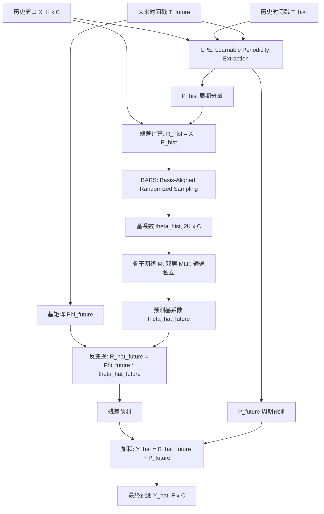
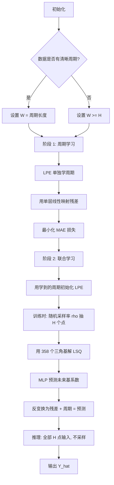

# Taming the Recent-Data Bias: Towards Robust Time Series Forecasting with Global Context（ICML 2026）

> 作者：Longlong Xu、Zeyan Li、Xiao He、Zhaoyang Yu、Changhua Pei、Zhe Xie、Zijun Dou、Tieying Zhang、Dan Pei  
> 机构：清华大学计算机科学与技术系；中国科学院计算机网络信息中心；字节跳动  
> 发表年份：2026  
> 会议/期刊：The 43rd International Conference on Machine Learning (ICML 2026)，首尔  
> 关联 PDF：同目录下 `ICML26_TameR_20260520.pdf`

## 一、文档信息速览

| 字段 | 值 |
|---|---|
| 标题 | Taming the Recent-Data Bias: Towards Robust Time Series Forecasting with Global Context |
| 作者 | Longlong Xu, Zeyan Li, Xiao He, Zhaoyang Yu, Changhua Pei, Zhe Xie, Zijun Dou, Tieying Zhang, Dan Pei |
| 机构 | 清华大学；中科院计算网络信息中心；字节跳动 |
| 发表年份 | 2026 |
| 会议/期刊 | ICML 2026 |
| 分类 | 时序预测 / 鲁棒性 / 异常鲁棒 |
| 核心问题 | 现有深度时序预测模型过度依赖最近时间步（"recent-data bias"），导致在最近数据被扰动（噪声、缺失、异常）时预测严重失真 |
| 主要贡献 | (1) 首次系统性研究并揭示"recent-data bias"；(2) 提出 BARS 基对齐随机采样策略；(3) 提出 LPE 可学习周期提取 + 两阶段训练；(4) 8 数据集 / 5 域实验全面验证 |

## 二、背景（Background）

时间序列预测（Time Series Forecasting, TSF）是 AIOps、经济、能源、交通、气象等领域的关键技术。一个基本观察是：**最近的观测点对预测影响最大**——这一假设根植于指数平滑（Exponential Smoothing, Holt 1957）、LogTrans 等经典与现代模型中，并通过 Attention 机制被进一步强化。直觉上：距离预测时刻越近的点，相关性理应越强。

然而，真实场景下的时序数据**频繁被噪声污染、存在缺失值、或者包含异常点**。当最近的历史点被扰动时，依赖"近大远小"权重分配的模型预测会显著偏离真值。本文通过一个简单的单层线性模型在 ETTh2 上的实验给出了三个诊断性观察：(a) 真实异常出现时预测严重发散；(b) 干净数据上预测正常；(c) 对最后一个点施加 OOD 扰动后，预测也立刻发散；(d) 归一化权重矩阵中，最右列（最近点）权重显著最大。

这暴露出 TSF 中一个**普遍但未被系统研究**的现象——"**Recent-Data Bias**"：模型对最近数据过度依赖，使预测对最近数据上的扰动极度脆弱。作者进一步在 PatchTST、TimeMixer、FiLM、FreTS 四类主流架构上（涵盖时域、频域、数学域的线性和注意力模型）做"输入重要性"分析，发现**所有模型都把最高重要性分数分配给最近点**——这与"架构无关"。

为缓解该问题，业界已有的方向包括：(1) 季节-趋势分解（N-BEATS、DLinear、TimesNet）——但扰动仍可能存在于分解后的任一分量中；(2) 非平稳 Transformer、Koopa 等非平稳建模——部分做法反而加重对最近数据的依赖；(3) TSFA（带异常的时序预测）类方法，如 RobustTSF，遵循"检测-填充-重训"管线，每一步都引入累计误差。综上，**在保持精度的同时增强对最近数据扰动的鲁棒性仍然是一个未解难题**。

## 三、目的（Problems Solved）

本文要解决的具体问题有：

- **揭示"recent-data bias"的普遍性**：首次系统地在多类架构、多个数据集上量化"最近点权重过大"的现象。
- **对抗扰动的鲁棒性**：当最近时间步出现噪声、缺失、连续异常、多点异常时，预测仍应保持稳定。
- **保持预测精度**：在干净数据上不能因为鲁棒化而显著牺牲精度。
- **解决"随机采样"引入的两个新挑战**：
  - (1) **不规则表示**：随机采样让时间点间距不等，若按时间域做 zero-padding / 插值会扭曲分布；
  - (2) **信息损失**：关键时序模式可能恰好落在未采样的区段，损失周期信息。
- **提供可落地的方法**：仅以双层 MLP 为骨干即可在多个数据集上超越更复杂的 TimesNet、TimeMixer 等模型。

## 四、核心原理（Principles）

**总览**：TameR（Tame Recent-data bias）从"充分挖掘全局上下文"这一根本思路出发，提出三大组件协同：(i) **BARS**（Basis-Aligned Randomized Sampling）——在训练时随机采样时间点并把它们投影到一组三角基函数组成的固定表示空间，从优化上衰减任何单点的特殊影响；(ii) **LPE**（Learnable Periodicity Extraction）——在采样前先把周期分量从时序中分解出来，避免周期信息被采样损失；(iii) **两阶段训练**——先单独学准周期，再联合学周期 + 残差，规避双空间学习的优化困难。

**关键概念**：
- **Recent-data bias**：模型把过多预测权重放在最近时间步上的归纳偏置。
- **BARS basis projection**：把任意稀疏采样点上的信号视为一个"连续函数"的采样，用 179 个频率 × 2（sin/cos）= 358 个三角基函数拟合该函数，输出基系数 $\theta$。预测在基系数空间完成，再反变换到时域。
- **Learnable Periodic Cycle**：每个通道一个长度为 W（如 24h）的可学习周期模板，通过对齐-重复-截断三步覆盖整个 H+F 长度。
- **Dual-space Learning**：周期分量在时域用 LPE 预测，残差在基系数域用 BARS + 骨干网络预测。
- **2-Stage Training**：先 LPE-only 学周期 → 再联合 LPE + BARS。

**核心数学**：
对历史序列 $X \in \mathbb{R}^{H\times C}$，BARS 用采样率 $\rho$ 抽出 $\lfloor \rho H\rfloor$ 个点，组成索引集 $\tau$ 与值集 $X_{\text{sampled}}$，解如下正则最小二乘得到基系数：

$$
\min_{\theta} \lVert \Phi(\tau)\,\theta - X_{\text{sampled}} \rVert_2^2 + \lambda \lVert\theta\rVert_2^2
$$

其中 $\Phi(\tau) \in \mathbb{R}^{|\tau|\times 2K}$ 是基矩阵。骨干网络 $M$ 把 $\theta_{\text{hist}}$ 映射到 $\hat\theta_{\text{future}}$，再用未来时刻的基矩阵反变换为残差预测。最终预测：

$$
\hat{Y} = \underbrace{\Phi_{\text{future}}\,\hat\theta_{\text{future}}}_{\text{residual}} \;+\; \underbrace{P_{\text{future}}}_{\text{periodic}}
$$

**为什么这样做**：从优化视角，Proposition 3.1 证明在线性预测器 + VAR(1) 平稳序列下，梯度幅度随 lag 指数衰减 $\lVert\Gamma(k)\rVert \le \lVert A^k\rVert \lVert\Gamma(0)\rVert$（其中 $\rho(A)<1$），导致模型更更新 $W_0$（最近点对应权重），从而形成 recent-data bias。基投影在优化上"摊薄"了任何单点的扰动（Proposition C.3），将局部扰动扩散到全局系数。

## 五、算法详解（Algorithm）

1. **输入 / 输出**
   - 输入：历史窗口 $X\in\mathbb{R}^{H\times C}$、历史时间戳 $T_{\text{hist}}$、未来时间戳 $T_{\text{future}}$
   - 输出：未来 $F$ 步预测 $\hat Y\in\mathbb{R}^{F\times C}$

2. **核心模块**
   - LPE（Learnable Periodicity Extraction）：从可学习周期模板生成周期分量
   - BARS（Basis-Aligned Randomized Sampling）：残差的随机采样 + 基投影
   - 骨干网络 M：双层 MLP（ReLU），通道独立
   - 两阶段训练协议

3. **伪代码**（训练 + 推理）

```python
# ============ 阶段 1: 周期学习 ============
# 不使用 BARS，单层线性直接从残差映射到残差
P_hist, P_future = LPE(T_hist), LPE(T_future)
R_hist = X - P_hist
# 简单的线性残差映射（不引入 BARS）
linear = nn.Linear(H, F)
R_hat_future = linear(R_hist.transpose(-1,-2)).transpose(-1,-2)  # channel-wise
loss1 = MAE(R_hat_future + P_future, Y)  # Y 为真实未来值
loss1.backward(); opt.step()

# ============ 阶段 2: 联合学习 ============
P_hist, P_future = LPE(T_hist), LPE(T_future)
R_hist = X - P_hist
# BARS: 随机采样 + 基投影（训练时）
idx = random_subset(H, size=int(rho * H))              # 随机子集
theta_hist = solve_lsq(Phi[idx], R_hist[idx], lam=lam) # R^(2K x C)
# 骨干网络预测未来基系数
theta_hat_future = MLP(theta_hist)                      # 共享通道独立
# 反变换到残差空间
R_hat_future = Phi_future @ theta_hat_future            # R^(F x C)
Y_hat = R_hat_future + P_future
loss2 = MAE(Y_hat, Y)
loss2.backward(); opt.step()

# ============ 推理 ============
P_hist, P_future = LPE(T_hist), LPE(T_future)
R_hist = X - P_hist
# 推理时: 不采样，使用所有 H 个点
theta_hist = solve_lsq(Phi, R_hist, lam=lam)
theta_hat_future = MLP(theta_hist)
R_hat_future = Phi_future @ theta_hat_future
Y_hat = R_hat_future + P_future
```

4. **关键数学**
   - 基矩阵定义（179 频率，每频率两正交函数）：
     $$\Phi(t) = [\cos(2\pi f_1 t),\ \sin(2\pi f_1 t),\ \dots,\ \cos(2\pi f_{179} t),\ \sin(2\pi f_{179} t)] \in \mathbb{R}^{T\times 358}$$
   - 周期模板更新：$\text{cycle} \in \mathbb{R}^{W\times C}$，通过对齐（$t \bmod W$）、重复、截断得到 $P$。
   - 损失：两个阶段都用 **MAE**（$\lVert Y-\hat Y\rVert_1$），文中指出 MAE 对异常比 MSE 更鲁棒。

5. **复杂度分析**（论文未显式讨论，基于模块推断）
   - LPE：$O((H+F)\cdot C)$
   - BARS：每次迭代需解 358×358 的小规模 LSQ，$O(K^2|\tau|)$，$K=179$
   - 骨干 MLP：$O(H\cdot F\cdot d)$，$d$ 为隐层维度
   - 整体训练开销与同规模线/注意力模型相当，文中 Efficiency Analysis（Appendix J）显示 TameR 在 GPU 时间上不逊于 TimesNet 等。

6. **训练与推理**
   - 损失：两阶段 MAE
   - 训练：阶段 1 预热 LPE 周期；阶段 2 联合优化 LPE + BARS + MLP
   - 推理：使用所有 $H$ 个点做基投影，得到 $\theta_{\text{hist}}$，再预测未来系数

7. **示例**
   以 ETTh1（H=96）为例：LPE 周期长度 W=24（小时级）。BARS 随机选 30 个点，用 358 个三角基解 LSQ 得到 $\theta_{\text{hist}}\in\mathbb{R}^{358\times 7}$（7 个变量）。MLP 输出 $\hat\theta_{\text{future}}\in\mathbb{R}^{358\times 7}$，乘上 $\Phi_{\text{future}}\in\mathbb{R}^{96\times 358}$ 得到残差预测，再加 LPE 周期分量得到最终 $\hat Y$。

## 六、系统架构图（Architecture）



## 七、流程图（Process Flow）



## 八、关键创新点（Key Innovations）

- **+ Recent-Data Bias 的系统性揭示**：首次在四类主流架构（PatchTST/TimeMixer/FiLM/FreTS）和两个数据集上做"输入点重要性"评分，定量证实了"最近点权重过大"是跨架构普遍现象。
- **+ BARS 基对齐随机采样**：把"在时间域随机丢点"重新表述为"在三角基域内的统一表示"，巧妙回避了 zero-padding / 插值引入的人为偏差，并从优化角度证明能"摊薄"局部扰动。
- **+ LPE 可学习周期提取**：把周期建模放在采样之前，避免关键周期信息被采样破坏；引入"对齐-重复-截断"流水线让周期模板自适应任意时间戳。
- **+ 两阶段训练协议**：第一阶段先用简单线性 + LPE 锁住周期模板，第二阶段再联合优化 LPE + BARS + 骨干，规避双空间学习的优化冲突。
- **+ MAE 损失 + Channel-Independent 骨干**：仅用双层 MLP + MAE 就在大多数数据集上击败 TimesNet、TimeMixer 等重模型，体现了"鲁棒性优先"的设计哲学。

## 九、实验与结果（Experiments）

- **数据集**：8 个数据集跨 5 个域——ETTh1/ETTh2/ETTm1/ETTm2（电力变压器）、Weather（气象）、Exchange（汇率）、Traffic（交通）、Solar（光伏）。
- **Baseline**：DLinear、TimeMixer、CycleNet、Crossformer、PatchTST、iTransformer、Leddam、MICN、TimesNet、FEDformer、FreTS、TimeKAN、FiLM、RobustTSF（共 14 个）。
- **主要指标**：MSE、MAE（多变量）、Avg Rank、1st Count；自定义 $MSE\!\uparrow$ 表示扰动后 MSE 相对增幅。
- **扰动场景**：2 个位置（Recent / Random）× 4 个类型（单点异常 SAP、连续异常 CAS、单点缺失 SMP、多点异常 MAP）。
- **关键结果**：
  - 在"(recent, SAP)"扰动下 TameR 在 8 数据集上 **1st Count=31, Avg Rank=1.33**，远超 TimesNet（9, 2.20）和 MICN（6, 2.51）。
  - 在干净数据上 TameR 取得 **1st Count=16, Avg Rank=1.82**，仅次于 Leddam（7, 2.07）和 PatchTST（5, 2.40）。
  - 在 Exchange 等高分布漂移数据集上略逊（依赖基函数重建），整体仍为 SOTA。
- **消融实验**：在 ETTh1/ETTm1/Weather 上对比 (1) w/o 2-Stage；(2) w/o LPE；(3) Sample-0-Pad；(4) Sample-Interp；(5) w/o Sample。结果：去掉 LPE 或 2-Stage 精度下降；去掉采样则在扰动下 MSE 急剧上升；零填充/插值替代基投影则精度和鲁棒性都下降。
- **效率分析**（Appendix J）：TameR 训练/推理时间与同规模线/频域模型相当。

## 十、应用场景（Use Cases）

- **AIOps 容量规划**：在 KPI（CPU、内存、QPS）近期被异常或缺失值污染时仍能给出准确资源需求预测，避免误扩容。
- **数据中心能耗预测**：电力负载序列常被采集缺失或仪表异常打断，TameR 对最近点扰动不敏感，可用于冷却与调度。
- **金融时序（汇率/订单流）**：对偶发尖峰、停牌带来的缺失不敏感，提升下游风控与交易策略稳健性。
- **气象/能源（光伏、风电）**：传感器短暂故障的"近期异常"不会击穿预测模型，调度更可靠。
- **在线服务的弹性扩缩容**：把 TameR 作为基础预测器嵌入 K8s HPA / 自动扩缩容控制器，对突发尖刺流量免疫。

## 十一、相关论文（Related Papers in this set）

- 本批次的 **ICML26_SPRINT** 也属于时序预测方向，聚焦"推理时下采样加速"，与 TameR 在时序基础模型推理效率上互补。
- 同样来自 NetMan AIOps Lab 的 **AutoDA-Timeseries** 处理时序数据增强，与 TameR 的"训练时随机采样"在思想上有相似之处（都通过改变训练数据分布提升鲁棒性），可作为对比参考。

## 十二、术语表（Glossary）

- **TSF (Time Series Forecasting)**：时间序列预测，给定历史 H 步预测未来 F 步。
- **VAR(1)**：一阶向量自回归过程，描述时间序列生成机制。
- **Recent-Data Bias**：本文提出的概念，指模型对最近时间步权重过大的归纳偏置。
- **BARS (Basis-Aligned Randomized Sampling)**：基对齐随机采样，把采样后时间序列投影到固定三角基域。
- **LPE (Learnable Periodicity Extraction)**：可学习周期提取模块。
- **Channel-Independent**：通道独立策略，每个变量用同一骨干网络分别预测。
- **MAE Loss**：平均绝对误差损失，对异常比 MSE 更鲁棒。
- **MAE / MSE 指标**：评估预测的回归误差。
- **SOTA**：State-of-the-art，当前最优。
- **LSQ (Least Squares)**：最小二乘，本文用于从采样点解基系数。

## 十三、参考与延伸阅读

- Cheng et al., **RobustTSF: Towards Theory-guided Robust Time Series Forecasting with Anomalies**（AAAI 2024）：MAE 比 MSE 鲁棒的早期论证。
- Lin et al., **CycleNet: Enhancing Time Series Forecasting through Modeling Periodicity**（2024）：本文 LPE 的灵感来源。
- Nie et al., **PatchTST**（ICLR 2023）；Wang et al., **TimeMixer**；Yi et al., **FreTS**；Zhou et al., **FiLM**——四个被本文作为对照的代表架构。
- 代码：https://github.com/NetManAIOps/TameR
