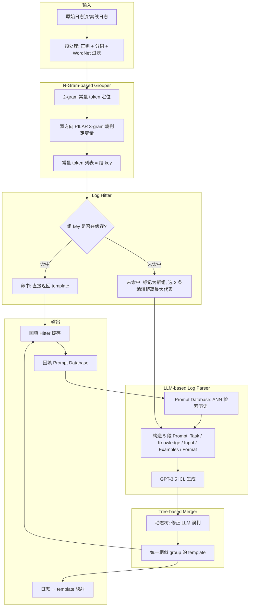
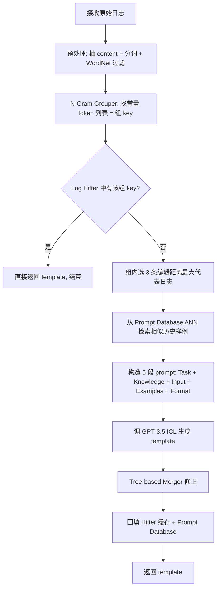

# SelfLog: Self-Evolutionary Group-wise Log Parsing Based on Large Language Model（ISSRE 2024）

> 作者：Anonymous（双盲）  
> 机构：NetMan AIOps Lab 等  
> 发表年份：2024  
> 会议/期刊：ISSRE 2024（IEEE International Symposium on Software Reliability Engineering）  
> 关联 PDF：同目录下 `ISSRE2024_paper_129.pdf`  
> 关键词：large language model、log parsing、self-evolution

## 一、文档信息速览

| 字段 | 值 |
|---|---|
| 标题 | Self-Evolutionary Group-wise Log Parsing Based on Large Language Model（SelfLog） |
| 作者 | Anonymous（双盲） |
| 机构 | NetMan AIOps Lab 等 |
| 发表年份 | 2024 |
| 会议/期刊 | ISSRE 2024 |
| 分类 | 日志解析 / 大语言模型 / 自进化 / 效率 |
| 核心问题 | 现有 LLM 日志解析方法依赖人工标注 prompt 模板、且单条 LLM 调用效率低（≤10 logs/s），无法满足工业每秒数万条日志的吞吐。 |
| 主要贡献 | 1) SelfLog 自进化框架：把 LLM 自身历史解析结果存入 Prompt Database，替代人工标注；2) N-Gram-based Grouper 把日志先聚类再调 LLM，避免逐条调用；3) Log Hitter 缓存已解析的组模板，进一步减少 LLM 调用；4) Tree-based Merger 修正 LLM 错误分组；5) 在 16 个 LogPai 公开数据集上 GA=0.975、PA=0.942 达 SOTA，处理速度达 45,000 logs/s，仅消耗 1% token。 |

## 二、背景（Background）

日志（log）、时序（time series）、追踪（trace）是 AIOps 三大可观测数据类型。日志半结构化，是最易获取且覆盖最广的一类；日志解析（log parsing）通过把半结构化日志转为"常量 + 通配符"形式的模板（template），是异常检测、日志压缩、日志摘要、故障根因分析等下游任务的预处理基石。

传统日志解析分两条路线：
- **基于源码的解析**：直接读 print/logger 源码拿到模板——准确但要求源码可见，许多黑盒系统做不到。
- **数据驱动的解析**：从日志自身推断模板，又分为：
  - **无监督**：Drain、Logram、Spell、LenMa 等基于聚类或启发式规则，依赖作者对日志的观察；一旦新数据集不满足假设（例如 Drain 假设"日志首 token 为常量"，而 Proxifier 数据集中 2000 条日志首 token 都是变量），性能断崖。
  - **有监督**：LogPPT 等微调预训练模型，对训练集分布敏感、对未见模板泛化差。

LLM 的兴起给日志解析带来第三条路——零样本、跨数据集、语义理解强。代表性工作 **DivLog** 用 ICL（In-Context Learning）把"相似日志 + 模板"塞进 prompt，让 LLM 推断新模板。然而 DivLog 有两大痛点：

1. **依赖人工标注**：prompt 里的样例需要专家手工维护，系统升级后又得重标。
2. **效率低**：单条日志都要调一次 LLM，实测 ≤10 logs/s，但生产系统每秒能产生数万条。

SelfLog 直击这两大痛点：用 LLM 自己的历史输出做 prompt 样例（自进化），用 N-Gram 聚类 + Log Hitter + Tree-based Merger 把"逐条调用 LLM"压到"按组调用 + 大部分组直接命中缓存"，最终处理速度飙到 45,000 logs/s。

## 三、目的（Purpose / Problems Solved）

论文显式列出两大痛点：

- **痛点 1：依赖人工标注 prompt 模板。** 系统升级/迭代后，新一轮人工标注不可避免。解决方案：自进化——用 LLM 自身的历史解析结果填 prompt，无需人工。
- **痛点 2：日志处理速度 ≤10 logs/s。** 工业生产系统每秒可产生数万条日志，LLM 生成速率跟不上。解决方案：N-Gram Grouper + Log Hitter + Tree-based Merger 三件套，大幅减少 LLM 调用次数 + 缓存命中直接返回。

## 四、核心原理（Principles）

SelfLog 系统由四大模块组成（Fig.3）：

1. **N-Gram-based Grouper**：把日志先聚类。改进自 PILAR 的熵方法：先用 `[A-Za-z0-9*]+` 简单分词；用 WordNet 频次过滤"长度 ≤3 的低频 token"（如 pam、uid、tty、ssh），消除前后缀干扰；找 2-gram 常量 token 的位置，从该位置向左+向右两个方向用 PILAR 的 3-gram 熵判定"变量列表"；剩余 token 作为"常量 token 列表"；按常量 token 列表分组日志。相比 PILAR 的差异：① 不再默认"首 token 为常量"（双向扫描）；② 阈值随不同日志数量自动调整。
2. **Log Hitter**：维护 (token_list, template) 字典，组内日志先查字典：① 命中 → 直接返回模板（不调 LLM）；② 未命中 → 把 token_list 记为新 key，并送 3 条"组内编辑距离最大"的日志给 LLM-based Log Parser；LLLM 解析 + Tree-based Merger 修正后回填字典。
3. **LLM-based Log Parser**：GPT-3.5（论文主体）作为 LLM，prompt 五段——Task Description / Human Knowledge（可选，告诉 LLM \* 是通配符） / Input Logs（3 条组内代表日志） / Self-evolution Examples（从 Prompt Database 用 ANN 检索最相似的历史 <log, template> 对） / Output JSON Format（约束 LLM 填到预设 json 字段）。
4. **Tree-based Merger**：实时构建并更新一棵树，捕捉"组内 LLM 误判"的角案例——例如初期日志只有 user=cyrus，LLM 误以为 cyrus 是常量；后续出现 user=news、user=test 时，Tree-based Merger 把"user <\*> by"纠正为统一模板。
5. **Prompt Database**：存储 LLM 自身的历史 <log, template>，通过 ANN 检索最相似日志作为 ICL 样例，形成"自进化"循环。

**与现有方法差异**：
- vs **DivLog**：本方法用 LLM 自身历史作为 prompt 样例，无需人工标注；并用 Grouper/Hitter 把 LLM 调用次数从"每条一次"压到"每组一次甚至 0 次"。
- vs **Drain 等无监督方法**：本方法用 LLM 语义理解替代手写规则，对"首 token 是变量"等反例鲁棒；Table I 显示 SelfLog 在 Proxifier 上 GA=1.000，Drain 仅 0.527。
- vs **LogPPT 等监督方法**：本方法零训练/零标注，对未见模板泛化更好。

数学上，SelfLog 没有新的核心数学公式，主要创新是"工程范式"——自进化 + 分组 + 缓存 + 修正。

## 五、算法详解（Algorithm）

### 1. 输入 / 输出

- **输入**：原始日志流（可流式可离线）；可选的 WordNet 词典。
- **输出**：每条日志对应的 (template, group_id)。

### 2. 核心模块

- **预处理**：正则抽 timestamp/level/process_id，只对 log content 用 `[A-Za-z0-9*]+` 分词，WordNet 过滤短低频 token。
- **N-Gram-based Grouper**：找 2-gram 常量位置 → 双方向 PILAR 3-gram 熵判定变量 → 剩余为常量 token 列表 → 按 token 列表分组。
- **Log Hitter**：token_list → template 字典，命中直接返回。
- **LLM-based Log Parser**：5 段 prompt 调 GPT-3.5 ICL。
- **Prompt Database**：存储历史 <log, template>，ANN 检索最相似。
- **Tree-based Merger**：动态树修正 LLM 误判。

### 3. 伪代码

```python
# === N-Gram-based Grouper (Algorithm 1) ===
def ngram_grouper(log_X):
    T_X = tokenize(log_X)  # [A-Za-z0-9*]+
    T_X = filter_short_lowfreq(T_X, wordnet)  # 去掉 <=3 字符且 WordNet 频次低的 token
    position = get_2gram_const_index(T_X)  # 2-gram 常量 token 的最大权重位置
    var_right = pilar_gram(T_X, position, direction='right')
    var_left = pilar_gram(T_X, position, direction='left')
    return T_X - var_right - var_left  # 常量 token 列表 (组 key)

# === SelfLog 主流程 ===
def selflog_parse(stream, prompt_db, hitter, merger):
    for log in stream:
        tokens = preprocess(log)                # 正则 + 分词 + WordNet 过滤
        group_key = ngram_grouper(tokens)       # 聚类键
        template = hitter.get(group_key)        # 缓存查
        if template is None:
            # 选 3 条组内编辑距离最大的代表日志
            samples = select_3_farthest(group_logs[group_key])
            # 构造 5 段 prompt: Task / Knowledge / Input / Examples (ANN 检索) / Format
            examples = prompt_db.ann_search(samples, k=3)
            prompt = build_prompt(samples, examples)
            # 调 LLM
            resp = llm.generate(prompt)         # GPT-3.5
            template = merger.correct(resp, group_logs[group_key])
            hitter.set(group_key, template)     # 缓存回填
            prompt_db.add(samples, template)    # 自进化
        yield template
```

### 4. 关键数学

PILAR 的 3-gram 熵判定（简化）：

$$\mathrm{PILAR}(t) = \frac{\mathrm{count}(t, t_{-1}, t_{+1}) - \mathrm{count\_wo\_t}}{\mathrm{threshold}}$$

若 PILAR 得分低于阈值则 token $t$ 判为变量。SelfLog 改用"自动调整阈值"代替"经验阈值"。

GA（Group Accuracy）：

$$\mathrm{GA} = \frac{\#\{\text{正确分到同一模板的所有日志}\}}{\#\{\text{总日志}\}}$$

PA（Parsing Accuracy）：

$$\mathrm{PA} = \frac{\#\{\text{模板完全匹配的日志}\}}{\#\{\text{总日志}\}}$$

### 5. 复杂度分析

论文未给严格复杂度公式。LLM 调用是主要瓶颈：传统 LLM-based 方法每条日志 1 次调用 → ≤10 logs/s；SelfLog 经 Grouper + Hitter 后仅对"新组"调 LLM，处理速度达 45,000 logs/s，提升 4500 倍。

### 6. 训练与推理

- **无训练**：SelfLog 完全是 prompt + 规则工程。
- **推理**：每条日志 → preprocess → grouper → hitter → (可选) LLM → merger → 缓存。
- **token 成本**：SelfLog 仅消耗 DivLog 的 1% token（Fig.6），主要由"按组调用"+"自进化 prompt 复用"两个机制压低。

### 7. 示例

论文 Fig.2 给出一个 Proxifier 的反例：单条日志 "status code 503" 喂给 LLM，模型把 503 整体判为变量（错）；如果把多条含 "status code 403/503" 的相似日志一起喂，模型能正确识别"status code"是常量、403/503 是变量。Fig.5 给出 Tree-based Merger 的示例：早期日志只出现 user=cyrus，LLM 误判模板为 "session opened for user cyrus by <\*>"，等 user=news/test 出现时，Merger 合并为统一模板 "session opened for user <\*> by"。

## 六、系统架构图（Architecture）



## 七、流程图（Process Flow）



## 八、关键创新点（Key Innovations）

- **+ Self-Evolution Prompt Database**：用 LLM 自身的历史 <log, template> 取代人工标注 prompt 样例，系统升级时无需重标。通过 ANN 检索"最相似历史日志"做 ICL，让 LLM 在自反思中改进。
- **+ N-Gram-based Grouper**：突破 PILAR "首 token 是常量"假设（Proxifier 数据集 2000 条首 token 全是变量），改用"2-gram 常量定位 + 双方向 3-gram 熵"；阈值随日志数自动调整；这是 SelfLog 在 Proxifier 等反例数据集上 GA=1.000 的关键。
- **+ Log Hitter 缓存**：相同 group_key 后续日志直接命中返回，不需要再调 LLM。缓存随时间自增长，对"日志分布相对稳定"的工业系统效果显著。
- **+ Group-wise Prompting**：把"逐条调用 LLM"改成"按组调用"，同组多条相似日志一次喂给 LLM，让 LLM 通过"对比"识别变量（Fig.2 反例），同时大幅减少 LLM 调用次数。
- **+ Tree-based Merger**：用一棵动态树捕捉 LLM 的"早期误判"——例如初期只看到 user=cyrus 就把 cyrus 误以为是常量，等 user=news/test 出现时合并为统一模板，类似 Drain 的"树合并"思想被迁移到 LLM 输出修正。

## 九、实验与结果（Experiments）

- **数据集**：LogPai 公开日志 16 个系统（HDFS、BGL、HPC、Apache、HealthApp、Mac、Proxifier、Zookeeper、Thunderbird、Spark、Android、Linux、Hadoop、OpenStack、Windows、OpenSSH），每个 2K 标注。
- **Baseline**：LenMa、Spell、Drain、Logram、LogPPT、DivLog。
- **评估指标**：GA（Group Accuracy）、PA（Parsing Accuracy）、PTA、RTA。
- **关键结果数字**（Table I + Fig.6）：
  - SelfLog 平均 GA = **0.975**、PA = **0.942**，超过 DivLog（0.920/0.309）和 Drain（0.865/0.319）成为新 SOTA。
  - 在 Proxifier 上 SelfLog GA=1.000 vs Drain 0.527（首 token 假设失效）。
  - 在 HealthApp、Zookeeper 等上 SelfLog GA 0.993+。
  - 效率（Fig.6）：SelfLog 处理 2000 条 Proxifier 日志的时间是 DivLog 的 1/100（≈1%），token 消耗是 DivLog 的 1/10。
  - 解析速度：45,000 logs/s（论文标题数字）。
- **消融实验**：RQ3 给出 Grouper、Hitter、Merger、Prompt Database 各组件的消融。
- **超参分析**：组内选 3 条代表日志的合理性、不同 prompt 样例数、阈值自动调整等。
- **LLM 主干**：论文主体 GPT-3.5，并评估 GPT-4 / 其他开源 LLM 兼容性（RQ6）。
- **解析速度**：RQ5 实测 45,000 logs/s，可匹配工业在线系统日志产生速率。

## 十、应用场景（Use Cases）

- **在线日志流式解析**：45,000 logs/s 的处理速度可直接对接每秒数万条日志的微服务系统。
- **系统升级后的快速适配**：自进化机制让模型在新模板出现时自我修正，无需重标。
- **跨系统统一解析**：LLM 语义理解跨系统鲁棒，一个 SelfLog 部署可同时处理 HDFS/BGL/Spark/Proxifier 等异构日志。
- **AIOps 平台前端**：作为日志模板抽取的"即插即用"组件，输出供下游异常检测 / 根因分析使用。
- **运维成本降低**：相比 Drain 需手工调参/重训练、DivLog 需手工维护 prompt 样例，SelfLog 几乎零运维。

## 十一、相关论文（Related Papers in this set）

- `Shiyu__Accurate_and_Interpretable_Log_Fault_Diagnosis_using_Large_Language_Models-2`：LLM 日志故障诊断，使用了 Drain 作为消融对照；与本篇"日志解析"上游互补。
- `Mengyao__SiameseLSTM`：KPI 时序异常检测，与本篇日志维度互补。
- `TSC-TADBench`：trace 异常检测，与本篇日志维度互补。
- `ISSRE2024_paper_129`（本篇，SelfLog）：LLM 日志解析 + 自进化。
- `LabelEase_ISSRE24_CameraReady`：自动打标/主动学习，与"自进化"思路对照。
- `ASE24-ART`：日志相关工作（不同子方向）。

## 十二、术语表（Glossary）

- **Log Parsing（日志解析）**：把半结构化日志转为 (常量 + 通配符) 模板的预处理步骤。
- **Template（模板）**：日志内容中的常量部分，变量部分用 `*` 替代。
- **Group Key（组键）**：N-Gram Grouper 输出的"常量 token 列表"，相同 group key 的日志属于同一模板。
- **ICL（In-Context Learning）**：LLM 不训练、直接通过 prompt 样例学习任务的能力。
- **Prompt Database**：SelfLog 存储 LLM 自身历史 <log, template> 的数据库。
- **ANN（Approximate Nearest Neighbor）**：近似最近邻检索，用于从 Prompt Database 找最相似历史样例。
- **N-Gram**：N 元语法，N 个连续 token 的组合，SelfLog 用 2-gram/3-gram。
- **PILAR**：一种基于熵的日志变量检测算法，SelfLog 改进其方向性与阈值。
- **Drain**：经典无监督日志解析器，假设首 token 为常量。
- **DivLog**：当前 SOTA 的 LLM 日志解析器（基于 GPT-3.5 ICL + 人工标注样例），SelfLog 的直接对照。
- **GA（Group Accuracy）**：所有日志都被分到正确模板的比例。
- **PA（Parsing Accuracy）**：日志模板完全匹配（常量+变量位置都正确）的比例。
- **Merger（合并）**：把多个相似 group 合并为统一模板。
- **Self-Evolution（自进化）**：用 LLM 自身历史输出训练/改进 LLM 后续行为。
- **Streaming Log（日志流）**：实时连续产生的日志。

## 十三、参考与延伸阅读

- **Drain**（论文 [12]）：经典无监督日志解析器，论文"组键"思路与 Drain 的树结构有渊源。
- **DivLog**（论文 [17]）：当前 SOTA LLM 日志解析器，SelfLog 的直接对照与改进对象。
- **Logram / Spell / LenMa / LogPPT**：Table I 中作为 Baseline。
- **LogPai**（数据集）：16 个公开日志系统标注库，SelfLog 评测的基石。
- **PILAR**（论文 [10]）：基于熵的日志变量检测，SelfLog Grouper 的前身。
- **GPT-3.5 / GPT-4**：SelfLog 默认用 GPT-3.5，可换为 GPT-4 或其他开源 LLM。
- **WordNet**：英文词汇语义网络，SelfLog 用其过滤短低频 token。
