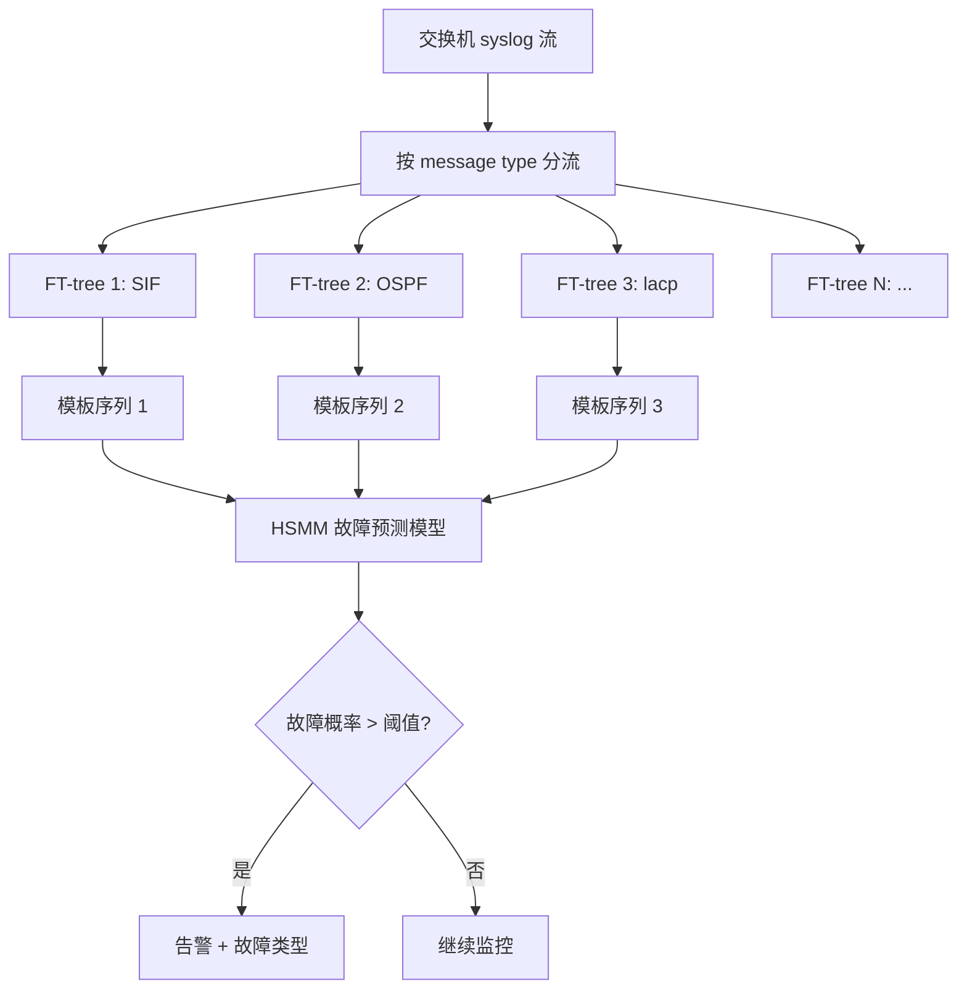
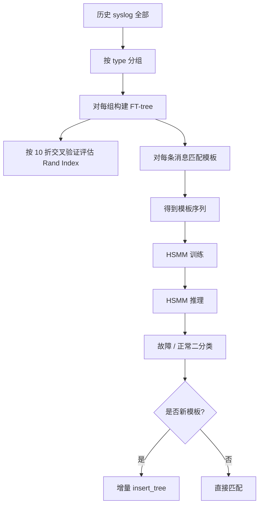

# Syslog Processing for Switch Failure Diagnosis and Prediction in Datacenter Networks（IWQoS 2017）

> 作者：Shenglin Zhang、Weibin Meng、Jiahao Bu、Sen Yang、Ying Liu、Dan Pei、Jun (Jim) Xu、Yu Chen、Hui Dong、Xianping Qu、Lei Song  
> 机构：清华大学（网研院/计算机系/TNList）；佐治亚理工学院；百度公司  
> 发表年份：2017  
> 会议/期刊：IWQoS 2017（IEEE/ACM International Symposium on Quality of Service）  
> 关联 PDF：同目录下 `IWQOS_2017_zsl.pdf`

## 一、文档信息速览

| 字段 | 值 |
|---|---|
| 标题 | Syslog Processing for Switch Failure Diagnosis and Prediction in Datacenter Networks |
| 作者 | Shenglin Zhang, Weibin Meng, Jiahao Bu, Sen Yang, Ying Liu, Dan Pei, Jun (Jim) Xu, Yu Chen, Hui Dong, Xianping Qu, Lei Song |
| 机构 | 清华大学、佐治亚理工学院、百度公司 |
| 发表年份 | 2017 |
| 会议/期刊 | IWQoS 2017 |
| 分类 | 交换机 syslog 处理 / 故障预测 / 模板提取 / 增量学习 |
| 核心问题 | 交换机 syslog 模板提取的准确率与增量学习能力难以兼顾；现有 STE、Signature Tree、LogSimilarity 都有准确率或增量训练缺陷 |
| 主要贡献 | (1) 提出 FT-tree（Frequent Template Tree），基于频繁词组合同时获得高准确率 + 增量训练；(2) 与 3 种现有方法对比；(3) 在 2 年 2,223 台交换机 10+ 数据中心数据上 F1 提升 155-188%，训练时间减少 117-730 倍 |

## 二、背景（Background）

现代云服务商的数据中心网络动辄部署数万乃至数十万台交换机，每年发生数百次交换机故障（如微软数据中心年故障 400+）。这些故障轻则服务降级，重则整片数据中心宕机（如 Colo4、Hosting.com 的事件）。交换机故障诊断与预测因此成为网络运维的核心任务之一。

交换机 syslog 是故障诊断与预测的"金矿"信息源：每条 syslog 包含时间戳、交换机 ID、消息类型（message type）和详细消息（detailed message）；详细消息一般通过 printf 生成，包含位置、丢包率、IP 等动态参数。但 syslog 本身是非结构化文本，必须先通过"模板提取"将每条消息归类为有限数量的"模板/子类型"，才能进一步用机器学习做故障预测。

现有三种主流模板提取方法都存在明显缺陷：
- **STE（Statistical Template Extraction）**：基于 word-score 聚类，漏判某些子类型（消息无法匹配任何模板），且不支持增量训练。
- **Signature Tree（Qiu 等）**：基于词组合的频率，但因"组合"而非"词"统计，重建需要处理全部历史数据，不能增量。
- **LogSimilarity（Kimura 等）**：按"字符 / 字母 / 数字"5 类分词，可增量但容易把不同子类型归为同一模板（低准确率）。

这意味着在大型数据中心网络每天千万级新 syslog、跨 2 年历史的场景下，要么牺牲准确率，要么付出极大计算开销（每天/每次固件升级都要从头训练）。

## 三、目的（Problems Solved）

- **模板提取准确率低**：现有 STE、LogSimilarity 误匹配严重。
- **不支持增量训练**：Signature Tree、STE 每次有新模板出现都需要全量重训。
- **故障预测精度受限**：错误模板 → 错误统计 → 预测 F1 下降。
- **固件/软件升级带来的新模板**：必须能在线识别、增量更新。
- **HSMM 等下游预测模型的模板依赖**：把模板质量提升与故障预测精度提升解耦。

## 四、核心原理（Principles）

**系统总览**：基于观察"正确的模板通常是 syslog 中频繁出现的词组合"，FT-tree 维护一个前缀树结构，其根节点是 message type（如 SIF、OSPF、lacp），每条根到叶路径就是一个 message template；按词的全局支持度（频率）排序后逐条消息插入；超过度阈值 $k$ 的子节点被剪掉。

**关键概念**：

- **Syslog Message**：交换机产生的一条记录。
- **Message Type / Subtype**：消息类型（粗粒度）/ 子类型（细粒度模板）。
- **Template**：去掉动态参数后的消息骨架。
- **FT-tree**：频繁模板树；前缀树扩展。
- **Support (词组合频率)**：在所有 syslog 中某词组合出现的消息数。
- **Word-name**：节点对应的词。
- **Pruning Threshold $k$**：节点最大子节点数。
- **Incremental Retraining**：增量训练。
- **HSMM (Hidden Semi-Markov Model)**：下游故障预测模型。
- **Rand Index**：评估聚类 / 模板学习准确率。
- **$\Delta\tau_m$ / $\Delta\tau_a$ / $[\tau_s, \tau_e]$ / $\xi$ / $\theta$**：预测模型的时间参数。
- **ominous / non-ominous time bin**：故障前 / 非故障前时间窗。

**数学原理**：

- **Support 定义**：

$$
\text{Support}(A) = |\{M \in D_M \mid A \subseteq M\}|
$$

- **FT-tree 插入（递归）**：若当前节点 N 的 word-name = p.word-name 且 N 是 T 的子节点，则创建新子节点 N'，递归处理 P。
- **节点度约束**：

$$
|\text{children}(C)| > k \implies \text{Eliminate all children of } C
$$

- **Rand Index（评估模板学习）**：

$$
\text{Rand Index} = \frac{a + b}{a + b + c + d}
$$

其中 $a, b$ 为聚类结果与人工分类一致的对数；$c, d$ 为不一致的对数。
- **故障预测 F1**：

$$
F_1 = \frac{2 \cdot \text{Precision} \cdot \text{Recall}}{\text{Precision} + \text{Recall}}
$$

- **Ominous Time Bin**：若 $\tau_x \in [\tau_s, \tau_e]$ 且消息数 $\ge \theta$。
- **预测范围**：$\Delta\tau_m = 2h$，$\Delta\tau_a = 30min$，$[\tau_s, \tau_e] = 24h$，$\xi = 15min$，$\theta = 5$。

**与现有技术的差异**：与 STE 相比，FT-tree 不会漏判；与 Signature Tree 相比，FT-tree 用"词"而非"组合"频率统计，可增量；与 LogSimilarity 相比，FT-tree 用真实词而非字符类别，准确率大幅提升。

## 五、算法详解（Algorithm）

1. **输入 / 输出**：
   - 输入：某 message type 的所有消息集合 $D_M$，剪枝阈值 $k$。
   - 输出：FT-tree $T$，其中每条根到叶路径是一个模板。
   - 在线：新增消息 $M_{new}$ → 自动增量更新树结构。

2. **核心模块**：
   - **单次扫描统计词频**（Algorithm 1 第 1-3 行）：生成按支持度降序的词列表 $L$。
   - **建树**（第 4-9 行）：创建以 message type 为根的树；每条消息按 $L$ 顺序插入前缀树。
   - **剪枝**（第 10-14 行）：遍历每个非叶节点，若子节点数 > $k$，删除所有子节点并把该节点升级为叶。
   - **增量更新**（§III-B）：固件升级后，仅对增量消息按 Algorithm 1 插入；新词追加到 $L$ 末尾。
   - **故障预测**：以提取的模板序列作为输入，HSMM 训练 / 推理。

3. **伪代码**：

```python
def build_ft_tree(messages, k):
    """Algorithm 1"""
    L = sorted(word_freq(messages).items(), key=lambda x: -x[1])  # 第 1-3 行
    T = Tree(root_label=messages[0].type)  # 第 4 行
    for M in messages:
        ordered = sorted(M.words, key=lambda w: L.index(w))  # 第 6 行
        insert_tree(ordered, T)  # 第 7-8 行
    for C in T.children:
        if len(C.children) > k:
            C.children = []  # 第 11-12 行
    return T

def insert_tree(words, node):
    if not words:
        return
    p, P = words[0], words[1:]
    child = node.find_child(p)
    if child is None:
        child = node.add_child(p)
    insert_tree(P, child)

def incremental_update(T, new_messages, k):
    """对新增消息调用 insert_tree 即可"""
    for M in new_messages:
        ordered = sort_by_L_with_new_words(M.words, T.L)
        insert_tree(ordered, T)
    # 不必全量重训

def predict_failure(template_seq, hsmm):
    """HSMM 训练 / 推理"""
    return hsmm.predict(template_seq)
```

4. **关键数学**：见 §四。

5. **复杂度分析**：
   - 单次扫描词频：$O(N \cdot \bar{L})$，$N$ 为消息数，$\bar{L}$ 为平均消息长度。
   - 树构建：每条消息插入 $O(\bar{L})$，整体 $O(N \cdot \bar{L})$。
   - 剪枝：$O(|T|)$。
   - 增量更新：仅对新增消息 $O(N_{new} \cdot \bar{L})$，远小于全量重训。
   - 故障预测：HSMM 时间 $O(T^2 \cdot N_{states})$。

6. **训练与推理**：
   - 训练：FT-tree 构建（一次性 / 增量）+ HSMM 训练。
   - 推理：每条新 syslog 匹配到模板 → 模板序列输入 HSMM → 故障预警。

7. **示例**：SIF 类型 12 条消息中包含 4 个子类型 N1-N4（Interface * down、Interface * up、Vlan-interface * down、Vlan-interface * up）；FT-tree 正确识别出 4 个模板；匹配到这些模板后，HSMM 在 SIF 序列上实现 F1=0.4821，Recall 95.3%，Precision 32.27%。

## 六、系统架构图（Architecture）



## 七、流程图（Process Flow）



## 八、关键创新点（Key Innovations）

- **+ FT-tree 双优**：同时获得高准确率（Rand Index 接近 1）+ 增量训练（无需重训）。
- **+ 频繁词组合模板**：把"模板"定义为"频繁出现的词组合"，让树结构自然支持增量。
- **+ 度阈值 $k$ 剪枝**：参数 $k$ 直观（"每个 subtype 不能超过 $k$ 个子 pattern"），便于运维人员理解。
- **+ 大规模工业验证**：2,223 台交换机 2 年真实故障工单 + syslog。
- **+ 端到端 F1 提升**：通过改进模板质量，HSMM 故障预测 F1 提升 155-188%。
- **+ 计算效率大幅提升**：相对 Signature Tree / STE 减少 117-730 倍时间。

## 九、实验与结果（Experiments）

- **数据集**：合作 Tier-1 云服务商 10+ 数据中心 2,223 台同型号交换机 2 年 syslog；228 次硬件故障；131 台故障交换机；1,273 个 ominous 时间窗 vs 5,516,435 个 non-ominous 时间窗。
- **Baseline**：Signature Tree、STE、LogSimilarity。
- **主要指标**：Rand Index、Precision、Recall、F1、训练时间。
- **关键结果数字**：
  - 模板学习准确率：FT-tree 与 Signature Tree Rand Index 接近 1；STE 仅 62.10%，LogSimilarity 59.31%；
  - 故障预测 F1：FT-tree / Signature Tree = 48.21%，STE = 16.75%，LogSimilarity = 18.93%（**F1 提升 155-188%**）；
  - 每日模板匹配时间：FT-tree 51 min、LogSimilarity 80 min、STE 100 h、Signature Tree 628 h（**计算效率提升 117-730 倍**）；
  - 228 次故障中 Precision 32.27%、Recall 95.3%。
- **消融实验**：对比 FT-tree vs Signature Tree（同样高准确率但 Signature Tree 不可增量），证明增量特性的独立价值。
- **效率分析**：测试服务器 12× Intel Xeon E5645 @ 2.40GHz，单线程运行。
- **可视化**：4 个 message type 的 Rand Index 对比柱状图、PR 曲线对比。

## 十、应用场景（Use Cases）

- **大型数据中心交换机故障预测**：在生成告警前 24h 内预警。
- **运营商网络设备 syslog 解析**：路由器、OLT 等的故障诊断。
- **云服务商 SLA 保障**：提前更换即将故障的交换机。
- **AIOps 平台模板管理**：跨多厂商设备的统一模板库。
- **新固件发布兼容性验证**：用增量 FT-tree 快速识别新模板。

## 十一、相关论文（Related Papers in this set）

- `iwqos16-li`：M³ 多层 SVC 视频组播（同一作者群）。
- `iwqos16-sui`：清华 Wi-Fi 轨迹隐私（同一作者群）。
- `lanman16-sui`：AP 密度对 Wi-Fi 性能的影响（同一作者群）。
- `mobisys16-sui`：WiFiSeer 大规模企业 Wi-Fi 延迟（同一作者群）。
- `ubicomp16-EDUM`：基于 Wi-Fi 的课堂教育测量（同一作者群）。
- `liu_cnsm14_cloudwatchplus`：云租户级应用感知延迟监控。

## 十二、术语表（Glossary）

- **Syslog**：设备日志协议。
- **Message Type / Subtype**：消息类型 / 子类型。
- **Template**：消息模板。
- **FT-tree**：Frequent Template Tree。
- **Support**：词组合在消息集合中的频率。
- **Word-name**：FT-tree 节点的词名。
- **Pruning Threshold $k$**：节点最大子节点数。
- **Incremental Retrainable**：可增量重训。
- **HSMM**：隐半马尔可夫模型。
- **Rand Index**：聚类 / 模板学习评估指标。
- **ominous time bin**：故障前时间窗。
- **$\Delta\tau_m$**：滑动窗口长度（2h）。
- **$\Delta\tau_a$**：运维人员响应时间（30min）。
- **$[\tau_s, \tau_e]$**：预测时间范围（24h）。
- **$\xi$**：时间分桶大小（15min）。
- **$\theta$**：最低消息数阈值（5）。
- **Pingmesh**：微软数据中心延迟测量系统。
- **OUI**：组织唯一标识符。

## 十三、参考与延伸阅读

- Paper: Pingmesh（Guo 等, SIGCOMM 2015）——大规模数据中心延迟测量。
- Paper: Network failures in data centers（Gill, Jain, Nagappan, SIGCOMM 2011）。
- Paper: Spatio-temporal factorization of log data（Kimura 等, INFOCOM 2014）——STE。
- Paper: Proactive failure detection learning（Kimura 等, CNSM 2015）——LogSimilarity。
- Paper: What happened in my network（Qiu, Ge, Pei, Wang, Xu, IMC 2010）——Signature Tree。
- Paper: Error log processing for accurate failure prediction（Salfner, Tschirpke, WASL 2008）。
- Paper: Using hidden semi-Markov models for effective online failure prediction（Salfner, Malek, SRDS 2007）。
- Paper: Developing a predictive model of QoE for Internet video（Balachandran 等, SIGCOMM 2013）。
- 相关论文：`iwqos16-li`、`iwqos16-sui`、`lanman16-sui`、`mobisys16-sui`。
