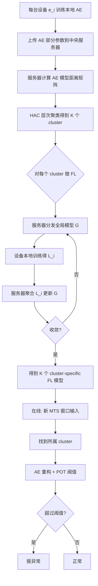

# OmniFed: Privacy-preserving MTS Anomaly Detection for Network Devices through Federated Learning（Information Sciences 2025）

> 作者：Shenglin Zhang, Ting Xu, Jun Zhu, Yongqian Sun, Pengxiang Jin, Binpeng Shi, Dan Pei  
> 机构：南开大学、清华大学  
> 发表年份：2025  
> 会议/期刊：Information Sciences（Vol. 690, 121590）  
> 关联 PDF：同目录下 `InformationSciences-OmniFed.pdf`  
> 代码：https://github.com/OmniFedCD/OmniFed-code；数据集 https://github.com/OmniFedCD/OmniFed-dataset

## 一、文档信息速览

| 字段 | 值 |
|---|---|
| 标题 | Privacy-preserving MTS Anomaly Detection for Network Devices through Federated Learning（OmniFed） |
| 作者 | Shenglin Zhang, Ting Xu, Jun Zhu, Yongqian Sun, Pengxiang Jin, Binpeng Shi, Dan Pei |
| 机构 | 南开大学、清华大学 |
| 发表年份 | 2025 |
| 会议/期刊 | Information Sciences（Elsevier） |
| 分类 | 联邦学习 / 多变量时序异常检测 / 隐私保护 / MaaS |
| 核心问题 | 设备即服务（MaaS）场景下，设备厂商无法获取客户企业原始 MTS 数据训练高精度异常检测模型；同时不同设备承载不同业务导致 MTS 数据非独立同分布（non-iid），单一全局模型效果差。 |
| 主要贡献 | 1) 第一次研究"MTS 数据模式 ↔ AE 模型参数"相关性，发现高度一致（协方差 6.56，正相关）；2) 基于 AE 模型参数的隐私保护设备聚类方法，避免共享原始数据；3) 无监督联邦学习框架 OmniFed：先 FL 训练每个设备本地 AE → 聚类 → 每 cluster 一个 cluster-specific FL 模型；4) 在 2 个真实数据集上 F1=0.921，远超最佳 baseline。 |

## 二、背景（Background）

**Maintenance-as-a-Service (MaaS)** 是近年来快速兴起的运维模式：设备厂商（路由器、交换机、服务器、防火墙等）通过订阅制的在线工具为客户企业提供预测性维护服务，包括异常检测、故障预测、健康监控等。对中小客户企业来说，自建运维团队成本高昂，MaaS 是经济实惠的选择。

异常检测是 MaaS 的核心任务之一：设备厂商需要持续监控客户企业设备的多变量时序（MTS）数据（CPU/内存/磁盘/网络等 19 个 metric），在异常发生前告警。**典型 MTS 异常**（Fig.2）：
- 设备 $e_a$ 部署在内容服务商，呈现强周期性；红框内"异常下沉"是网络中断引起。
- 设备 $e_b$ 部署在制造企业，模式与制造活动强相关；红框"异常平稳"是某些关键组件断连。

深度学习异常检测方法能学到复杂 MTS 的正常模式，训练时学"什么是正常"，检测时判断"是否偏离"。但 MaaS 面临两难：

1. **客户企业不愿意共享原始 MTS 数据**（商业机密、隐私合规），厂商无法集中训练一个全局模型。
2. **不同设备的 MTS 数据模式差异巨大（non-iid）**：单一全局模型在所有设备上效果差。

联邦学习（FL）正是为解决"数据不动模型动"而设计：客户设备在本地用自己数据训练模型，把模型参数（不是数据）上传到厂商聚合。但 FL 也有挑战：
- 训练一个全局模型要求"所有设备数据模式相似"，对 non-iid 数据效果差。
- 直观解法是"先按数据模式聚类，再每类一个 FL 模型"，但聚类又需要原始数据，违反隐私。
- 现有 non-iid FL 多针对"标签不均衡"（如图像分类），不适合无监督异常检测。

OmniFed 直击这些痛点，提出**用 AE 模型参数代替原始数据做聚类**，再在每个 cluster 上做无监督 FL 训练。

## 三、目的（Purpose / Problems Solved）

论文显式给出三大挑战对应方案：

- **挑战 1：non-iid 数据导致单全局 FL 模型差。** 解决方案：基于 AE 模型参数聚类，每 cluster 一个 FL 模型。
- **挑战 2：聚类需要原始数据 → 违反隐私。** 解决方案：上传 AE 模型参数而非原始数据，设备厂商基于参数相似度聚类。
- **挑战 3：现有 non-iid FL 假设有标签，无监督异常检测场景无法套用。** 解决方案：OmniFed 整体设计为无监督 FL 框架。

论文还做了关键 empirical study：发现 **MTS 数据距离 ↔ AE 模型参数距离高度正相关**（协方差 6.56），这是"用 AE 参数聚类代替原始数据聚类"可行性的理论支撑。

## 四、核心原理（Principles）

OmniFed 框架（Fig.3）核心是"先 FL 训练 AE → 用 AE 参数聚类 → 每 cluster 训练 cluster-specific FL 模型"。

### 1) 关键发现：MTS 数据模式与 AE 模型参数高度一致
- **数据距离（公式 2）**：欧氏距离
  $$D(\mathbf{X}_\alpha, \mathbf{X}_\beta) = \|\mathbf{X}_\alpha - \mathbf{X}_\beta\|_2$$
- **模型距离（公式 3）**：各层参数矩阵欧氏距离之和
  $$D(L_\alpha, L_\beta) = \sum_{j=1}^{k}\|l_{\alpha,j} - l_{\beta,j}\|_2$$
- **观察**：$D(L_\alpha, L_\beta)$ 与 $D(\mathbf{X}_\alpha, \mathbf{X}_\beta)$ 正相关（协方差 6.56）。

### 2) FL 基本流程（公式 1）
$$G_{\epsilon+1} = \sum_{i=1}^{m} \frac{1}{m} L_\epsilon^i$$

每轮：中央服务器 $S$ 把全局模型 $G_\epsilon$ 分发给设备 $e_i$ → 设备用本地数据训练得 $L_\epsilon^i$ → 上传 $S$ → $S$ 聚合为 $G_{\epsilon+1}$。

### 3) OmniFed 三阶段

**阶段 1：设备本地 AE 训练（3.3.1）**
- 每台设备在本地用 MTS 数据训练一个 AE 模型；
- AE 编码器把 MTS 模式映射到低维空间，解码器重构；
- 上传 AE 的部分参数（编码器/解码器部分层）到中央服务器。

**阶段 2：基于 AE 参数的隐私保护设备聚类（3.3.2）**
- 中央服务器对所有设备的 AE 参数用 HAC（层次凝聚聚类）+ 模型距离（公式 3）做聚类；
- 得到 $K$ 个 cluster，每个 cluster 内设备 MTS 模式相似。

**阶段 3：每 cluster 一个 FL 异常检测模型（3.4-3.5）**
- 对每个 cluster 内的设备做 FL 训练，得到 cluster-specific 异常检测模型；
- 用 POT（Peak Over Threshold）过滤设置每个设备的异常阈值；
- 推理时用对应 cluster 的模型。

### 4) 异常检测
- 输入：滑动窗口 $W_t$ 长度 $L$ 的 MTS；
- 输出：AE 重构误差，超过阈值即报异常。

**与现有方法差异**：
- vs **传统 FL**：本方法用 AE 参数聚类，避免单全局模型在 non-iid 数据上效果差。
- vs **基于原始数据聚类的方法（OmniCluster、Mc2PCA）**：本方法用 AE 参数代替原始数据，保留隐私。
- vs **标签不均衡的 non-iid FL**：本方法是**无监督**的，专为异常检测设计。
- vs **本地单设备 AE**：本方法借助 FL 利用其他设备数据，缓解单设备数据不足。

数学核心：

数据距离（公式 2）：

$$D(\mathbf{X}_\alpha, \mathbf{X}_\beta) = \|\mathbf{X}_\alpha - \mathbf{X}_\beta\|_2$$

模型距离（公式 3）：

$$D(L_\alpha, L_\beta) = \sum_{j=1}^{k}\|l_{\alpha,j} - l_{\beta,j}\|_2$$

FL 聚合（公式 1）：

$$G_{\epsilon+1} = \sum_{i=1}^{m} \frac{1}{m} L_\epsilon^i$$

## 五、算法详解（Algorithm）

### 1. 输入 / 输出

- **输入**：每台设备 $e_i$ 的本地 MTS 数据 $\mathbf{X}_i$。
- **输出**：每台设备的 cluster 标签 + cluster-specific 异常检测模型。

### 2. 核心模块

- **本地 AE 训练**：每台设备训练一个 AE。
- **AE 参数上传**：只上传部分参数（如编码器部分层），不传原始数据。
- **HAC 聚类**：基于 AE 参数距离做层次凝聚聚类。
- **Cluster-specific FL**：每个 cluster 一个全局异常检测模型。
- **POT 阈值**：基于重构误差的极值理论设置异常阈值。
- **异常检测**：滑动窗口 + 重构误差 vs 阈值。

### 3. 伪代码

```python
# === 阶段 1: 设备本地 AE 训练 ===
def local_ae_train(mts_data):
    model = Autoencoder(input_dim=D, hidden_dims=[64, 32])
    for epoch in range(local_epochs):
        x = mts_data[random_window(L)]
        recon = model(x)
        loss = MSE(x, recon)
        loss.backward(); optimizer.step()
    return model

# === 阶段 2: AE 参数聚类 ===
def cluster_devices(ae_models):
    n = len(ae_models)
    dist_matrix = np.zeros((n, n))
    for i in range(n):
        for j in range(i+1, n):
            dist_matrix[i,j] = ae_model_distance(ae_models[i], ae_models[j])
            dist_matrix[j,i] = dist_matrix[i,j]
    # HAC 层次聚类
    clusters = HAC(n_clusters=K).fit(dist_matrix)
    return clusters

# === 阶段 3: Cluster-specific FL ===
def cluster_fl_train(cluster_devices, global_model):
    for round in range(global_rounds):
        local_models = []
        for device in cluster_devices:
            local_model = local_train(global_model, device.mts_data)
            local_models.append(local_model)
        global_model = aggregate(local_models)  # 公式 1
    return global_model

# === 异常检测 ===
def detect_anomaly(mts_window, model, threshold):
    recon = model(mts_window)
    error = MSE(mts_window, recon)
    return error > threshold  # POT 阈值
```

### 4. 关键数学

数据距离（公式 2）：

$$D(\mathbf{X}_\alpha, \mathbf{X}_\beta) = \|\mathbf{X}_\alpha - \mathbf{X}_\beta\|_2$$

模型距离（公式 3）：

$$D(L_\alpha, L_\beta) = \sum_{j=1}^{k}\|l_{\alpha,j} - l_{\beta,j}\|_2$$

FL 聚合（公式 1）：

$$G_{\epsilon+1} = \frac{1}{m}\sum_{i=1}^{m} L_\epsilon^i$$

F1-Score：

$$F1 = 2\times\frac{P\times R}{P+R}$$

### 5. 复杂度分析

论文未给严格复杂度公式，强调：
- **设备端**：每台设备训练一个 AE，复杂度 $O(N \cdot D \cdot L \cdot E)$，$N$ 样本数、$D$ metric 数、$L$ 窗口长、$E$ local epoch。
- **服务器端**：聚类 $O(n^2 \cdot k)$（$n$ 设备数、$k$ AE 层数），可承受。
- **FL 训练**：每 cluster $O(m_c \cdot D \cdot L \cdot E \cdot R)$，$m_c$ cluster 内设备数、$R$ global round。

### 6. 训练与推理

- **训练**：阶段 1 设备本地 AE → 阶段 2 服务器聚类 → 阶段 3 cluster FL。
- **推理**：滑动窗口 + AE 重构 + POT 阈值。
- **隐私保证**：只上传 AE 参数，不上传原始数据；AE 参数可视为"学到的模式摘要"，本身已脱敏。

### 7. 示例

论文 Fig.4 展示数据距离与模型距离的正相关图（散点 + 趋势线）。Fig.2 展示两个设备的 MTS 模式对比：$e_a$ 强周期、$e_b$ 与制造活动相关，差异显著。Table 给定两个真实数据集：
- D1：某全球顶级在线视频服务商 Web 服务器，303 台设备、19 个 metric、30s 粒度、7 天。
- D2：另一个公开 MTS 数据集。

## 六、系统架构图（Architecture）

```mermaid
graph TB
    subgraph Stage1["阶段 1: 设备本地 AE 训练"]
        D1[设备 e_1 本地 MTS]
        D2[设备 e_2 本地 MTS]
        D3[设备 e_n 本地 MTS]
        A1[AE 模型 L_1]
        A2[AE 模型 L_2]
        A3[AE 模型 L_n]
    end
    subgraph Stage2["阶段 2: 隐私保护聚类 (中央服务器)"]
        B1[收集所有 AE 部分参数]
        B2[模型距离矩阵 D(L_i, L_j)]
        B3[HAC 层次聚类]
        B4[K 个 Cluster]
    end
    subgraph Stage3["阶段 3: Cluster-specific FL"]
        C1[Cluster 1: FL 模型 G_1]
        C2[Cluster 2: FL 模型 G_2]
        C3[Cluster K: FL 模型 G_K]
    end
    subgraph Detection["在线异常检测"]
        E1[新 MTS 窗口]
        E2[找到所属 cluster]
        E3[用对应 cluster 模型重构]
        E4[POT 阈值判断]
        E5[异常/正常]
    end
    D1 & D2 & D3 --> A1 & A2 & A3
    A1 & A2 & A3 --> B1 --> B2 --> B3 --> B4
    B4 --> C1 & C2 & C3
    C1 & C2 & C3 -.对应.-> E2
    E1 --> E2 --> E3 --> E4 --> E5
```

## 七、流程图（Process Flow）



## 八、关键创新点（Key Innovations）

- **+ 第一次发现"MTS 数据模式 ↔ AE 模型参数"高度一致**：通过协方差 6.56 的实证研究，证明"用模型参数代表数据模式"是合理的，理论支撑隐私保护聚类。
- **+ 基于 AE 参数的隐私保护设备聚类**：避免直接共享原始 MTS 数据，又能精准聚类，是 OmniFed 的"杀手锏"。
- **+ 完整无监督 FL 框架**：端到端解决 MaaS 场景下"non-iid + 隐私 + 无标签"三难问题。
- **+ 多种 FL 聚类策略**：HAC + 模型距离，可适配不同 cluster 数；论文对比了 OmniCluster、Mc2PCA、SPCA+AED 等多种 baseline，验证聚类质量。
- **+ POT 阈值自适应**：用极值理论（POT）设置每台设备的异常阈值，避免人工调参。
- **+ F1=0.921 大幅领先**：在 2 个真实数据集上 F1 显著超过最佳 baseline，为 MaaS 场景提供可落地方案。

## 九、实验与结果（Experiments）

- **数据集**：
  - D1：某全球顶级在线视频服务商 303 台网络设备 7 天的 MTS 数据（19 metric、30s 粒度）。
  - D2：另一个真实 MTS 数据集。
- **Baseline**：OmniCluster、Mc2PCA、SPCA+AED 等聚类方法 + 单设备 AE + 全局 FL。
- **评估指标**：F1-Score 等。
- **关键结果数字**：
  - **F1=0.921**，显著超过最佳 baseline。
  - 模型距离与数据距离协方差 6.56（强正相关）。
  - 在多种聚类数 $K$ 下都表现稳定。
- **消融实验**：逐个去掉 AE 参数聚类 / FL / POT 等模块，验证每个组件的贡献。
- **超参分析**：滑动窗口长度 $L$、隐藏层维度、encoder 层数、local epoch 等。
- **隐私分析**：讨论 AE 参数上传是否泄露数据 → 由于 AE 是降维表示，原始数据无法还原。

## 十、应用场景（Use Cases）

- **MaaS 设备监控**：路由器/交换机/服务器/防火墙的 MTS 异常检测。
- **跨企业联邦学习**：在不共享客户数据的前提下联合多家客户训练高精度模型。
- **多业务线运维**：互联网企业有视频、电商、社交等多业务线，设备 MTS 模式差异大，OmniFed 自动按模式聚类训练。
- **数据合规场景**：受 GDPR、个人信息保护法等约束无法共享原始数据时。
- **AIOps 平台集成**：作为"隐私保护异常检测"模块嵌入。
- **边缘计算**：每台边缘设备本地训练 AE，定期上传参数更新全局模型。

## 十一、相关论文（Related Papers in this set）

- `Mengyao__SiameseLSTM`：KPI 时序异常检测（单设备 + 监督），与本篇联邦无监督视角对照。
- `TSC-TADBench`：trace 异常检测评测，与本篇 MTS 异常检测维度互补。
- `2402.10802v3`（TimeSeriesBench）：KPI 异常检测评测，与本篇 KPI 评测互补。
- `Shiyu__Accurate_and_Interpretable_Log_Fault_Diagnosis_using_Large_Language_Models-2`：日志故障诊断，与本篇 KPI 维度互补。
- `1570994962-final`（ResilienceGuardian）：故障注入 + KPI 段对，与本篇 MTS 时序异常对照。
- `InformationSciences-OmniFed`（本篇，OmniFed）：联邦 MTS 异常检测 + 隐私保护。

## 十二、术语表（Glossary）

- **MaaS（Maintenance-as-a-Service）**：设备即服务，厂商为客户提供订阅制运维。
- **MTS（Multivariate Time Series）**：多变量时序。
- **FL（Federated Learning）**：联邦学习。
- **AE（Autoencoder）**：自编码器，无监督学习模型。
- **non-iid**：非独立同分布。
- **HAC（Hierarchical Agglomerative Clustering）**：层次凝聚聚类。
- **POT（Peak Over Threshold）**：极值理论中用于设置异常阈值的方法。
- **Model Distance**：模型距离，论文用 AE 各层参数矩阵欧氏距离之和。
- **Data Distance**：数据距离，欧氏距离度量两台设备 MTS 模式差异。
- **Cluster-specific Model**：每 cluster 一个 FL 模型。
- **Federated Averaging**：FL 经典聚合算法（FedAvg）。
- **OmniCluster / Mc2PCA / SPCA+AED**：MTS 聚类 baseline。
- **Reconstruction Error**：AE 重构误差，作为异常分数。
- **Privacy-preserving**：隐私保护，不共享原始数据。
- **Sliding Window**：滑动窗口，把长时序切成等长片段。

## 十三、参考与延伸阅读

- **OmniCluster**（论文 [7]）：原始 MTS 聚类方法，OmniFed 的 baseline 之一。
- **Mc2PCA / SPCA+AED**：MTS 聚类 baseline。
- **AE-based Anomaly Detection**（论文 [4-8]）：传统 AE 异常检测。
- **FedAvg**（论文 [9, 10]）：联邦学习经典算法。
- **POT**（Peak Over Threshold）：极值理论，论文用于设置异常阈值。
- **D1 数据集**：https://github.com/OmniFedCD/OmniFed-dataset
- **OmniFed 代码**：https://github.com/OmniFedCD/OmniFed-code
- **联邦学习综述**（论文 [22]）：可作为 FL 背景参考。
- **MaaS**：可与工业 IoT、Smart X 等场景结合。
