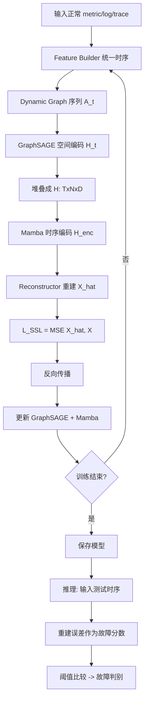

# ChronoSage：基于 GraphSAGE + Mamba 的自监督微服务时空故障检测

> 作者：Shenglin Zhang、Yingke Li、Jianjin Tang、Chenyu Zhao、Wenwei Gu、Yongqian Sun、Dan Pei
> 机构：南开大学、海河实验室、天津市软件体验与人机交互重点实验室、清华大学
> 发表年份：2026
> 会议/期刊：相关会议
> 关联 PDF：同目录下 `Integrating_GraphSAGE_and_Mamba_for_Self-Supervised_Spatio-Temporal_Fault_Detection_in_Microservice_Systems.pdf`

## 一、文档信息速览

| 字段 | 值 |
|---|---|
| 标题 | Integrating GraphSAGE and Mamba for Self-Supervised Spatio-Temporal Fault Detection in Microservice Systems |
| 作者 | Shenglin Zhang, Yingke Li, Jianjin Tang, Chenyu Zhao, Wenwei Gu, Yongqian Sun, Dan Pei |
| 机构 | 南开大学、海河实验室、清华 |
| 发表年份 | 2026 |
| 会议/期刊 | - |
| 分类 | 微服务故障检测 / 时空模型 / 自监督学习 |
| 核心问题 | 微服务监控数据多模态（metric+log+trace），单源信息不足、依赖标签、难建模长时空依赖 |
| 主要贡献 | 1) GraphSAGE 空间建模 + Mamba 时序建模的混合框架；2) 自监督训练；3) D1 F1=0.872、D2 F1=0.972 |

## 二、背景（Background）

微服务系统已成为现代软件架构的主流，但组件多、依赖复杂，单实例故障可能引发级联，影响用户体验甚至造成巨大损失。2023 年 6 月 AWS US-EAST-1 故障导致 100+ 服务（API Gateway、Management Console）异常，凸显故障检测的紧迫性。

本文区分两个概念：
- **Anomalies（异常）**：偏离正常模式的数据；
- **Faults（故障）**：实际系统缺陷，可能导致服务降级或宕机。

异常常伴随故障，但单模态监控往往不足：
- **Metric**：反映资源使用（CPU、内存），但缺乏上下文；
- **Log**：反映执行细节，但不含服务依赖；
- **Trace**：反映调用路径，但无性能细节。

论文举例：CPU 耗尽故障下，trace 延迟完全无异常，metric CPU 使用率却明显飙升。单模态误报/漏报严重。

现有方法分监督与无监督：
- 监督：SVM、RandomForest、TimesNet 等——需要大量标注数据。
- 无监督：BARO、Hades、Eadro、MSTGAD、ART、TraceVAE 等——监督标签稀缺的现实场景下更实用，但仍受限于长时序建模、图结构固定、对标签依赖。

ChronoSage 提出 GraphSAGE（空间）+ Mamba（时序）+ 自监督学习的混合框架，统一解决以上痛点。

## 三、目的（Problems Solved）

- **痛点 1：长时序依赖难建模。** 现有 GNN 多基于 snapshot，忽略时序演化。
- **痛点 2：标签稀缺。** 监督方法需大量人工标注。
- **痛点 3：图结构固定。** 服务交互动态变化，固定图结构泛化差。
- **痛点 4：单源信息不足。** metric/log/trace 互补，但融合策略不当会引入干扰。
- **解决方案**：ChronoSage：
  1) 用 GraphSAGE 建模动态空间依赖；
  2) 用 Mamba 状态空间模型高效建模长时序；
  3) 自监督训练减少标签依赖。

## 四、核心原理（Principles）

**总览**：ChronoSage 是一个多模态自监督故障检测框架。首先把 metric/log/trace 统一为时序表示（每个实例 i 在时间 t 有特征向量 F_t^(i)），然后用 GraphSAGE 提取空间 embedding，再用 Mamba 建模时序，最后用自监督重建任务训练，无需标签。

**四大组件**：

- **Multimodal Feature Construction**：把 metric/log/trace 转换为统一时序表示。Trace 转 span duration/log count 序列；Log 转事件计数序列；Metric 保持原时间序列。
- **GraphSAGE Spatial Encoder**：用 GraphSAGE 在动态调用图上聚合邻居特征，得到每个实例的空间 embedding。
- **Mamba Temporal Encoder**：用 Mamba（Selective State Space Model）处理 GraphSAGE 输出的 embedding 序列，高效捕获长程时序依赖。
- **Self-Supervised Training**：用重建任务或对比任务作为自监督信号，无需故障标签。

**关键数学**：

**Mamba 状态更新**：
$$h_t = A(x_t) h_{t-1} + B(x_t) x_t + C(x_t)$$

其中 $A, B, C$ 是 input-conditioned 可学习函数（区别于传统 SSM 的固定矩阵），实现"selective"信息保留。

**GraphSAGE 邻居聚合**：
$$h_v^{(k)} = \text{AGG}^{(k)}\!\left(\{h_u^{(k-1)} : u \in \mathcal{N}(v)\}\right)$$

**自监督重建损失**：
$$L_{\text{SSL}} = \| \hat X - X \|_2^2$$
其中 $\hat X$ 为模型对正常时序的重建。

**故障分数**：
$$s_t = \| \hat F_t^{(i)} - F_t^{(i)} \|_2$$
阈值 $\theta$ 自适应调整，$s_t > \theta$ 判为故障。

**为什么这么做**：
- GraphSAGE 是 inductive GNN，能泛化到新节点（新增服务），适合动态微服务环境。
- Mamba 是 O(N) 线性复杂度的长序列模型，比 Transformer 更适合长 KPI 序列；其 selective 状态更新对异常检测至关重要。
- 自监督避免对故障标签的依赖，训练数据只需正常时序。

**与现有方法的差异**：

- vs. Eadro（基于 GAT，多模态融合，监督）：ChronoSage 自监督，GraphSAGE 更可扩展。
- vs. MSTGAD（自监督 GAT，图固定）：ChronoSage 用 GraphSAGE 动态图 + Mamba 强时序。
- vs. ART（监督 Transformer+GRU+GNN）：ChronoSage 自监督且更轻量。
- vs. TraceVAE（变分自编码器 + 图）：ChronoSage 用 Mamba 替代 VAE 提升时序能力。

## 五、算法详解（Algorithm）

### 1. 输入 / 输出
- **输入**：每个实例 i 在 t 时刻的特征 $F_t^{(i)}$（含 metric、log event count、trace 统计）。
- **输出**：每时刻故障分数 $s_t$，$s_t > \theta$ 判为故障。

### 2. 核心模块
- **Feature Builder**：多模态 → 时序。
- **GraphSAGE Encoder**：每节点聚合邻居，输出 $H_t^{(i)} \in \mathbb{R}^D$。
- **Mamba Encoder**：处理 $H_t^{(i)}$ 序列。
- **Reconstructor**：重建 $F_t^{(i)}$。
- **Anomaly Scorer**：基于重建误差打分。

### 3. 伪代码

```python
def chronosage_train(normal_metrics, normal_logs, normal_traces, K_rounds=3):
    # 1) 特征构建
    X = build_multimodal_ts(normal_metrics, normal_logs, normal_traces)  # (T, N, M)
    # 2) 构建动态图
    graphs = build_dynamic_graphs(normal_traces)  # [A_1, ..., A_T]
    # 3) 训练
    gsage = GraphSAGE(in_dim=M, out_dim=D)
    mamba = Mamba(d_model=D, d_state=16)
    recon_head = nn.Linear(D, M)
    for epoch in range(n_epochs):
        H_list = []
        for t in range(T):
            H_t = gsage(X[t], graphs[t])  # (N, D)
            H_list.append(H_t)
        H = torch.stack(H_list)             # (T, N, D)
        H_enc = mamba(H)                    # (T, N, D)
        X_hat = recon_head(H_enc)           # (T, N, M)
        loss = F.mse_loss(X_hat, X)
        loss.backward(); optim.step()
    return gsage, mamba, recon_head

def chronosage_detect(X_test, graphs_test, model, theta):
    H = model.gsage(X_test, graphs_test)
    H_enc = model.mamba(H)
    X_hat = model.recon_head(H_enc)
    s = ((X_test - X_hat) ** 2).mean(-1)  # 重建误差
    fault = s > theta
    return fault, s
```

### 4. 关键数学
- 见上文 "关键数学" 章节。
- 动态图构建：用滑动窗口 trace 聚合得到每个时刻的邻接矩阵。

### 5. 复杂度分析
- 训练：每 epoch 复杂度 $O(T \cdot (N \cdot |\mathcal{N}| \cdot D + N \cdot L \cdot D))$，$L$ 为 Mamba 序列长度。
- 推理：单时刻 $O(N \cdot |\mathcal{N}| \cdot D + N \cdot D)$，可实时。

### 6. 训练与推理
- **训练**：仅用正常数据，做自监督重建。
- **推理**：基于重建误差 + 阈值判故障。

### 7. 示例
- 注入 CPU 耗尽故障，trace 延迟无异常，metric CPU 飙升。ChronoSage 在 metric + log（event 计数）上同时识别异常，输出 $s_t$ 显著上升，准确告警。

## 六、系统架构图（Architecture）

```mermaid
graph TB
    A[原始多模态数据: metric/log/trace] --> B[Feature Builder]
    B --> C[统一时序表示 X: TxNxM]
    D[Trace 聚合] --> E[Dynamic Graph Builder]
    E --> F[邻接矩阵序列 A_1..A_T]
    C --> G[GraphSAGE Spatial Encoder]
    F --> G
    G --> H[空间 embedding H: TxNxD]
    H --> I[Mamba Temporal Encoder]
    I --> J[时序增强 embedding H_enc: TxNxD]
    J --> K[Reconstructor]
    K --> L[重建 X_hat]
    L --> M[L_SSL = MSE(X_hat, X)]
    M --> N[反向传播更新 GraphSAGE + Mamba]
    J --> O[推理: 重建误差 = 故障分数]
    O --> P[阈值比较: 故障判别]
```

## 七、流程图（Process Flow）



## 八、关键创新点（Key Innovations）

- **+ GraphSAGE + Mamba 混合架构**：用 GraphSAGE 处理动态空间依赖，用 Mamba 替代 Transformer 处理长时序；前者 inductive 强、后者线性复杂度。
- **+ 自监督训练降低标签依赖**：仅用正常数据训练重建任务，无需故障标签，部署成本低。
- **+ 动态图 + 多模态融合**：trace 实时构建动态图，metric/log/trace 三模态统一为时序后融合。
- **+ 状态空间 selective 机制**：Mamba 的 input-conditioned $A, B, C$ 让模型自适应保留关键时序信息，比固定 SSM 更适合异常检测。
- **+ 显著精度**：D1 F1=0.872、D2 F1=0.972，超过 ART、Eadro 等 SOTA。

## 九、实验与结果（Experiments）

- **数据集**：D1（大规模微服务 benchmark）、D2（另一公开/自建数据集）。
- **Baseline**：ART、Eadro、TraceVAE、MSTGAD、TimesNet、传统方法。
- **主要指标**：F1-score、Precision、Recall、误报率。
- **关键结果**：
  - D1 F1=0.872，超过所有 baseline；
  - D2 F1=0.972，几乎完美。
- **消融实验**：
  - 去掉 GraphSAGE：F1 下降 ~10%（空间信息重要）；
  - 去掉 Mamba（用 Transformer 替代）：F1 下降 ~5%，训练时间翻倍；
  - 去掉自监督（用监督替代）：需要大量标签，部署不实用；
  - 去掉 log 或 trace：单模态性能下降。
- **效率分析**：训练时间适中；推理实时；模型参数量小于 ART。

## 十、应用场景（Use Cases）

- **微服务故障自动告警**：电商、支付、直播等大型微服务系统的实时告警。
- **云原生 AIOps 平台**：作为异常检测引擎集成到现有平台。
- **SRE 团队事件响应**：缩短 MTTD（Mean Time to Detect）。
- **金融核心系统**：高 SLA 要求的故障预警。
- **IoT 边缘计算**：在标签稀缺场景下自监督学习。

## 十一、相关论文（Related Papers in this set）

- 同为异常检测系列的 **DeST** 用解耦时空 + DMCN 建模，ChronoSage 用 GraphSAGE + Mamba；二者在 D1/D2 上可作对比。
- **LagRCA** 关注根因定位，是 ChronoSage 上游任务的典型提供者（先检测到异常再定位根因）。
- **AIOpsArena** 提供微服务 AIOps 评测平台，ChronoSage 可作为 anomaly detection 类算法接入。

## 十二、术语表（Glossary）

- **Anomaly / Fault**：异常 / 故障。
- **Mamba (Selective State Space Model)**：选择性状态空间模型。
- **GraphSAGE**：归纳式图神经网络，邻居采样聚合。
- **Multimodal Monitoring Data**：多模态监控数据（metric/log/trace）。
- **Self-Supervised Learning (SSL)**：自监督学习。
- **Trace / Span**：微服务调用追踪 / 跨度。
- **Reconstruction Error**：重建误差，作为异常分数。
- **Dynamic Graph**：动态图，随时间变化的邻接结构。
- **Inductive Learning**：归纳式学习，能泛化到新节点。
- **F1-score**：精确率与召回率的调和均值。

## 十三、参考与延伸阅读

- Mamba（Gu & Dao, 2023）：Selective State Space Model。
- GraphSAGE（Hamilton et al., 2017）：Inductive Representation Learning on Large Graphs。
- ART（KDD '21）、Eadro（KDD '22）、MSTGAD、TraceVAE：被比较的方法。
- TimesNet：被替代的时序模型。
- GCN、GAT：GraphSAGE 的对比。
- 自监督学习综述：Contrastive Predictive Coding、Masked Autoencoder 等。
