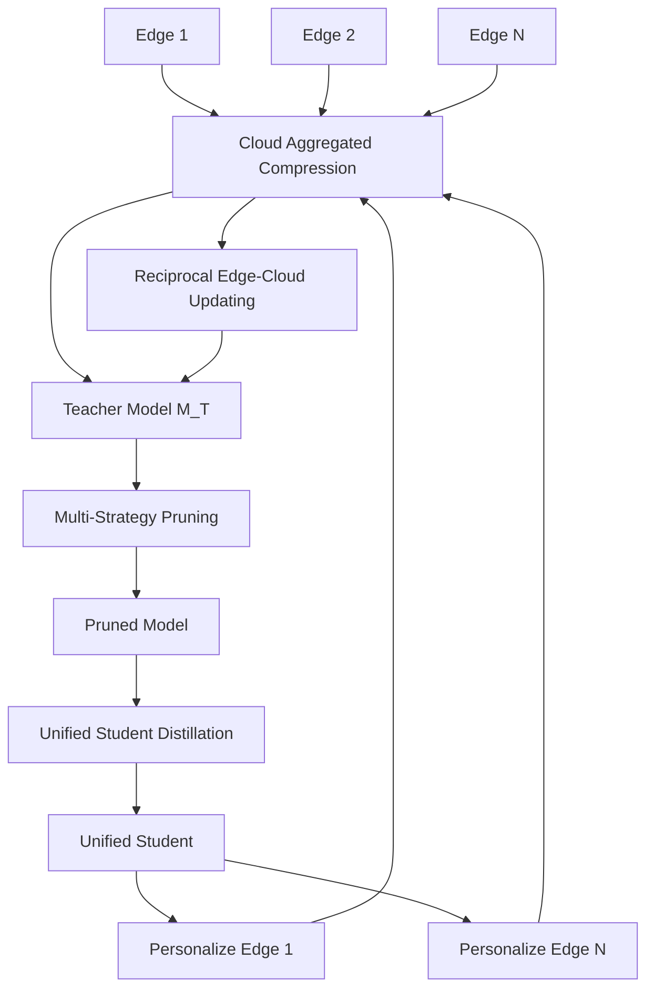
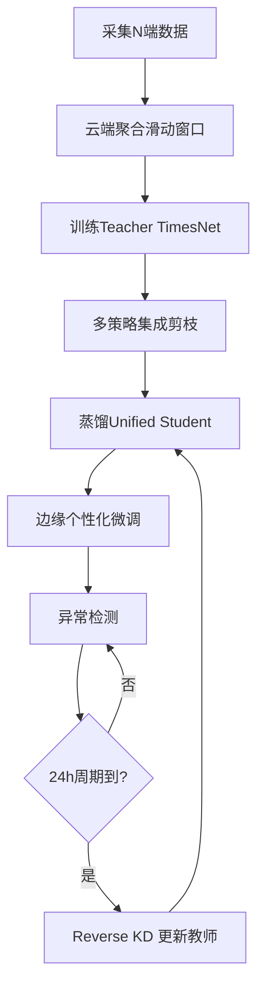

# Bridging Edge and Cloud: A Knowledge-Enhanced Framework for Efficient Time Series Anomaly Detection (TSC 2025)

> 作者：Shenglin Zhang, Jiacheng Zhang, Guohua Liu, Shiqi Chen, Chenyu Zhao, Minghua Ma, Yutong Chen, Yongqian Sun, Dan Pei
> 机构：南开大学软件学院、阿里云、Microsoft、清华大学
> 发表年份：2025
> 会议/期刊：IEEE Transactions on Services Computing (TSC), 2025 (CCF A)
> 关联 PDF：同目录下 `Jiacheng__RefinedEdge_to_TKDE.pdf`

## 一、文档信息速览

| 字段 | 值 |
|---|---|
| 标题 | Bridging Edge and Cloud: A Knowledge-Enhanced Framework for Efficient Time Series Anomaly Detection (RefinedEdge) |
| 作者 | Shenglin Zhang, Jiacheng Zhang, Guohua Liu, Shiqi Chen, Chenyu Zhao, Minghua Ma, Yutong Chen, Yongqian Sun, Dan Pei |
| 机构 | 南开大学、阿里云、Microsoft、清华大学 |
| 发表年份 | 2025 |
| 会议/期刊 | IEEE Transactions on Services Computing (TSC), 2025（CCF A） |
| 分类 | 时序异常检测 / 边缘-云协同 / 模型压缩 / 知识蒸馏 |
| 核心问题 | 在资源受限的边缘设备上部署高精度多变量时序异常检测模型，并实现云-端持续协同 |
| 主要贡献 | (1) Aggregated Compression 多策略压缩；(2) Knowledge Refinement 知识精炼；(3) Reciprocal Edge-Cloud Updating 互惠更新机制 |

## 二、背景（Background）

随着物联网与工业 4.0 的发展，传感器持续生成大量多变量时序数据，及时发现异常对系统可靠性至关重要。云端异常检测模型通常参数达百万甚至千万级，需 GPU 才能高效运行；而边缘设备只有 2.6 GHz 六核 CPU 或更低算力，论文实验中观察到只能有效运行小于 0.15 M 参数的模型。

边缘计算因低延迟、隐私合规逐渐成为主流，但算力与存储限制成为部署深度异常检测模型的关键障碍。统计方法虽轻量但难以捕捉复杂时序依赖，云端方案虽准确但延迟高、带宽受限。已有边缘-云协同框架多用于视觉/通用机器学习，不能直接迁移到时序异常检测。

## 三、目的（Purpose / Problems Solved）

- **挑战 1（数据）**：边缘数据存在噪声、不完整、分布不均，且单设备数据量小 → **方案**：Aggregated Compression，把多端数据在云端聚合后训练教师模型。
- **挑战 2（模型）**：边缘算力苛刻，深度模型必须大幅压缩，又要求保留多变量相关与时序依赖 → **方案**：Knowledge Refinement，多策略剪枝 + 平衡蒸馏损失 + 个性化微调。
- **挑战 3（同步）**：边缘异构、带宽有限，传统周期性整体更新不适应 → **方案**：Reciprocal Edge-Cloud Updating，反向蒸馏把个性化知识回流到云端教师。
- **挑战 4（评测）**：缺乏工业级评估 → 引入 4 个真实数据集（EdgeNode、SMD、MSL、SMAP）并复现 8 个基线。

## 四、核心原理（Principles）

RefinedEdge 是一个云-边协同框架：云端训练 TimesNet 教师模型，多策略剪枝得到 Pruned Model，再用加权 KD 蒸馏得到 Unified Student；边缘端在 Unified Student 基础上做个性化微调得到 Personalized Student；通过 Reverse KD 把边缘知识回传云端教师，形成持续更新闭环。

关键概念：
- **Aggregated Data**：来自 N 个边缘设备的滑动窗口数据 $X_{agg}$，在云端合并训练。
- **Teacher Model $M_T$**：基于 TimesNet 的重构式异常检测模型，损失函数为重建误差：
  $$L_{recon}=\frac{1}{|X_{agg}|}\sum_{x\in X_{agg}}\|M_T(x)-x\|_2^2$$
- **Multi-Strategy Pruning**：四种策略（Random-Magnitude、Magnitude-Magnitude、Taylor-Magnitude、BN-Scale Group）按重要性分数集成。
- **KD Loss**：平衡重建与模仿：
  $$L_{total}=\lambda_{kd}L_{recon}+(1-\lambda_{kd})L_{kd}$$
  其中 $L_{kd}=\|M_S(x)-M_T(x)\|_2^2$。
- **Reverse KD**：让边缘个性化模型指导云端教师更新，按 F1 自适应加权：
  $$L_{T}^{update}=\sum_{i=1}^{n}\beta_i\|M_{S_i}(x)-M_T(x)\|_2^2+(1-\beta_i)\|M_T(x)-x\|_2^2$$
- **Reciprocal Updating**：教师 ↔ 学生周期 24 小时回写，平衡全局共享与本地特化。

与现有技术差异：不同于传统只做前向蒸馏的 KD 框架，RefinedEdge 通过反向蒸馏让边缘个性化知识回流到云端教师，从而在多边缘异构环境下保持全局一致性。

## 五、算法详解（Algorithm）

1. **输入 / 输出**：输入：N 个边缘设备的滑动窗口数据；输出：每个边缘设备的个性化学生模型及其异常分数。
2. **核心模块**：数据聚合、Teacher 训练、多策略剪枝、Unified Student 蒸馏、个性化微调、Reverse KD 互惠更新。
3. **伪代码**：

```python
# 云端
for epoch in epochs:
    # 多策略集成剪枝
    scores = {}
    for s in strategies:
        scores[s] = s.importance(teacher)
    ensemble = average(list(scores.values()))
    prune_layers(teacher, ensemble, ratio=rho_i)
# 知识精炼
loss = lam * mse(student, x) + (1-lam) * mse(student, teacher)
student = train(student, data, loss)
# 反向蒸馏更新教师
beta = softmax(F1_per_edge) if F1 else [1/n]*n
teacher_loss = sum(b*mse(s_i, teacher) + (1-b)*mse(teacher, x))
teacher.update(teacher_loss)
# 边缘个性化
for i, edge in enumerate(edges):
    p_i = finetune(student, edge.local_data)
```

4. **关键数学**：剪枝率渐进 $\rho_i=\rho_0+(1-\rho_0)\cdot i/\nu$；集成重要性 $\omega_{ens}(\theta)=\frac{1}{|S|}\sum_{s\in S}\omega_s(\theta)$。
5. **复杂度分析**：云端每迭代 $O(P_T+N\cdot P_S)$；边缘推理 $O(P_S)$；通信仅在 24h 周期更新。
6. **训练与推理**：教师使用 TimesNet，Adam 优化器，lr=1e-3；剪枝从 0% 渐进到目标压缩比；学生 KD 系数 $\lambda_{kd}\in[0.4,0.7]$。
7. **示例**：在 200 个边缘节点的工业数据上，把 7 M 教师压缩到 0.12 M 学生后，F1 仍保持 0.9588，优于所有基线。

## 六、系统架构图（Architecture）



## 七、流程图（Process Flow）



## 八、关键创新点（Key Innovations）

- **+ Aggregated Compression**：把多端数据汇聚到云端训练，再多策略剪枝。
- **+ Balanced KD Loss**：在重建误差与模仿误差之间用 $\lambda_{kd}$ 加权，保留时序依赖。
- **+ Reciprocal Edge-Cloud Updating**：反向蒸馏让边缘个性化知识回流到云端教师。
- **+ 个性化微调系数自适应学习**：$\alpha_i=\sigma(\phi_i)$，由数据自动决定。
- **+ 数据驱动的重要性加权**：基于边缘 F1 的 softmax 权重。

## 九、实验与结果（Experiments）

- **数据集**：EdgeNode（200 个边缘节点，25 指标，5.18% 异常）、SMD（28 台机器，38 指标，4.16%）、MSL（27 航天器系统，55 指标，10.72%）、SMAP（55 卫星系统，25 指标，13.13%）。
- **Baseline**：Cloud-Train (7 M)、Edge-Train (0.12 M)、EWMA、SVM、AE、OmniAnomaly、USAD。
- **主要指标**：实体级 point-adjusted F1、训练时间、推理延迟。
- **关键结果数字**：
  - Personalised Student F1：EdgeNode 0.9588、SMD 0.9274、MSL 0.8827、SMAP 0.8580。
  - 参数量从 7 M 压缩到 0.12 M（约 1.7%），F1 全面优于 Cloud-Train 与 Edge-Train。
  - 训练时间相比基线减少 56.23%-97.53%。
  - 大规模场景下推理延迟为分钟级。
- **消融实验**：四种剪枝策略单独使用的 F1 差距 0.03-0.05；$\lambda_{kd}$ 在 [0.4, 0.7] 之间取 0.55 表现最佳。
- **效率分析**：学生模型可在 2.6 GHz CPU 上实时推理，吞吐 > 1K KPI/s。

## 十、应用场景（Use Cases）

- **智能制造**：边缘 PLC 上的异常检测与预测维护。
- **车联网**：车载边缘节点实时检测异常并卸载到云端做长期分析。
- **5G 基站运维**：在边缘服务器上检测 RAN KPI 异常。
- **智慧城市**：分布式摄像头/传感器协同异常识别。
- **工业互联网**：低带宽场景下的边-云协同异常检测。

## 十一、相关论文（Related Papers in this set）

- 与 **PIPCell (PIPCell_ISSRE_CameraReady_v5)**、**TimeSeriesBench (2402.10802v3)**、**TADBench (TSC-TADBench)** 同属时序异常检测方向。
- 与 **Lindorm-UWC (p1920-zheng)** 互补：后者处理车联网数据存储，前者处理异常检测。
- 与 **ChatTS (VLDB_2025_Camera_Ready-1)**、**AetherLog、LogInsight、Medicine、ResilienceGuardian** 等 LLM/AIOps 工作共同组成智能运维技术栈。

## 十二、术语表（Glossary）

- **MTSAD**：Multivariate Time Series Anomaly Detection。
- **KD**：Knowledge Distillation。
- **Reverse KD**：让边缘学生指导云端教师更新。
- **Aggregated Compression**：数据聚合 + 多策略压缩。
- **Personalized Student**：在统一学生基础上做本地微调的模型。
- **TimesNet**：基于频域的时序基础模型。
- **Point-adjusted F1**：区间粒度的异常评估指标。
- **Reciprocal Edge-Cloud Updating**：互惠更新机制。

## 十三、参考与延伸阅读

- TimesNet: Are Transformers Effective for Time Series Forecasting?（教师模型基座）。
- CrossFormer、iTransformer：用于泛化性实验的 Transformer 时序模型。
- OmniAnomaly、USAD：重构式异常检测基线。
- 知识蒸馏经典：Hinton et al., 2015。
- TorchPruning 项目：https://github.com/VainF/TorchPruning
- 项目主页：见论文对应 GitHub issue。