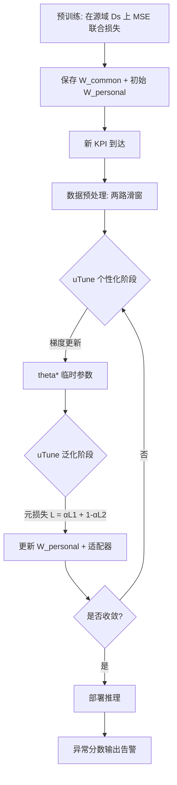

# KAD-Disformer: Pre-trained KPI Anomaly Detection Model Through Disentangled Transformer（KDD 2024）

> 作者：Zhaoyang Yu, Changhua Pei, Xin Wang, Minghua Ma, Chetan Bansal, Saravan Rajmohan, Qingwei Lin, Dongmei Zhang, Xidao Wen, Jianhui Li, Gaogang Xie, Dan Pei
> 机构：清华大学 & BNRist；中国科学院计算机网络信息中心；Stony Brook University；Microsoft；BizSeer Technology
> 发表年份：2024
> 会议/期刊：KDD '24, August 25–29, 2024, Barcelona, Spain（CCF A 类，数据挖掘顶会）
> 关联 PDF：同目录下 `KAD_Disformer_CRv1.4_submitted.pdf`

## 一、文档信息速览

| 字段 | 值 |
|---|---|
| 标题 | Pre-trained KPI Anomaly Detection Model Through Disentangled Transformer |
| 作者 | Zhaoyang Yu, Changhua Pei, Xin Wang, Minghua Ma, Chetan Bansal, Saravan Rajmohan, Qingwei Lin, Dongmei Zhang, Xidao Wen, Jianhui Li, Gaogang Xie, Dan Pei |
| 机构 | 清华大学 & BNRist；中科院 CNIC；Stony Brook University；Microsoft；BizSeer |
| 发表年份 | 2024 |
| 会议/期刊 | KDD 2024（CCF A） |
| 分类 | 异常检测 / 时序预测 / 预训练通用模型 |
| 核心问题 | 大规模在线服务系统存在十万级异构 KPI（响应时延、错误率等），传统"一 KPI 一模型"成本极高，迁移方法又存在性能退化与小样本过拟合的难题。 |
| 主要贡献 | 1) 首个时序 KPI 异常检测预训练-微调框架；2) 解耦投影矩阵（Disentangled Projection Matrices, DPM）保留公共知识；3) 面向少样本微调的两阶段 uTune 机制；4) 加性去噪重构目标；5) 在 Microsoft 云平台数月真实部署 |

## 二、背景（Background）

在线服务系统（社交网络、电商、支付、搜索）通常以"关键性能指标（KPI）"作为健康度信号：服务响应时延、错误率、吞吐、CPU 利用率等都被聚合为分钟级时序数据，并在异常时触发告警。KPI 异常检测（KAD）是 AIOps 体系中链路最上游、触发最频繁的能力之一。

传统 KAD 范式以"基于规则 + 人工阈值"为主，虽延迟低、解释性强，但面对季节性突变、概念漂移、噪声等场景检测精度差；随后发展的监督/半监督/无监督学习方法（Opprentice、ACVAE、Donut、AnomalyTrans 等）显著提升精度，但每条新 KPI 都需要单独训练模型，动辄消耗数十小时。更大的工业现实是：单一云平台往往有数十万条 KPI 曲线，"一 KPI 一模型"成本根本不可接受。

KAD 领域近两年也涌现出基于迁移学习或聚类的通用模型（ATAD、AnoTransfer 等），但它们需要先对 KPI 聚类、依赖人工特征或部分标注，泛化能力受限。三大核心挑战由此浮现：（1）KPI 高度异质且非平稳，单一模型难以覆盖；（2）通用模型容量与"快速适配新 KPI"之间存在矛盾——大模型难以小样本适配，小模型在历史 KPI 上表现不足；（3）少量、含噪的微调数据极易引发过拟合，导致部署后性能断崖下跌。KAD-Disformer 正是在这一背景下，提出"预训练 + 解耦 Transformer + 少样本微调"三件套解决方案。

## 三、目的（Purpose / Problems Solved）

- **痛点 1：模型泛化与适配难兼得。** 现状：通用预训练模型在源域表现尚可，但一旦迁移到未见过的目标 KPI，性能会大幅下降。
  - **解决方案：** 将 Transformer 注意力投影矩阵 $W$ 解耦为"公共部分 $W^{common}$"与"个性化部分 $W^{personal}$"；$W^{common}$ 仅在预训练阶段更新，用于保存跨 KPI 知识，$W^{personal}$ 在预训练 + 微调阶段持续更新，负责学习目标 KPI 的特有模式。

- **痛点 2：少样本微调易过拟合。** 现状：KPI 微调数据通常只覆盖一个完整周期（数十至数百小时），样本少、噪声大。
  - **解决方案：** 提出两阶段 uTune（unsupervised few-shot fine-tuning）机制。第一阶段用目标 KPI 的小批量数据 $x_1$ 更新 $W^{personal}$ 与适配器，得到临时参数 $\theta^*$；第二阶段用源域数据 $x_2$ 计算损失 $L_2$，与 $L_1$ 一起构成元损失 $L=\alpha L_1+(1-\alpha)L_2$，进一步回传更新参数，从而避免个性化参数"钻进"过拟合角落。

- **痛点 3：KPI 数据含噪且异常混在正常里。** 现状：原始 VAE / Transformer 在训练阶段就会被异常污染，从而降低异常点的重建误差，反而无法有效区分。
  - **解决方案：** 引入"去噪重构"目标与两路滑动窗口（context window 步长 1 捕获局部信息；history window 步长 = 周期 $p$ 捕获长期依赖），强迫解码器用历史帧辅助当前帧，重建出"去噪后的 KPI"。

- **痛点 4：现有 Transformer 缺少对 KPI 周期/趋势的显式处理。** 现状：KPI 普遍呈季节性，但 Transformer 注意力本身只建模时间步依赖。
  - **解决方案：** 在 Series Adapter 中嵌入时间序列分解模块，把 KPI 拆为 seasonal + trend，分别过两个 FFN，再相加；Seasonal Adapter + Encoder Adapter 串联在每一层，保证浅层和深层都能适配。

## 四、核心原理（Principles）

### 系统总览

KAD-Disformer 由"两条输入滑窗 + 历史编码器 + 上下文编码器 + 双解码器 + 去噪重构"组成，整体沿用 encoder-decoder 架构。原始 KPI $X_{raw}$ 先用两个不同步长的滑动窗口切成"上下文窗口"（stride=1）和"历史窗口"（stride = KPI 周期 $p$，默认由 FFT 估计），分别送入 Historical Encoder 与 Context Encoder。两个编码器内部的多头注意力层都使用**解耦投影**：$W = W^{common} + W^{personal}$。Context Encoder 的输出 $Q_{ctx}$ 同时送往 Context Decoder（用自己重建）和 Denoising Decoder（用历史帧的 $K$、$V$ 联合重建）。最终异常分数 $score = (X̂_1 + X̂_2) / 2$ 与 $X$ 的 MSE。

### 关键概念

- **Disentangled Projection Matrices (DPM)**：把 $W^Q, W^K, W^V$ 都拆成 $W^{common} + W^{personal}$。
- **Two-stage uTune**：个性化阶段（personalization stage）→ 元目标更新（generalization stage）。
- **Denoising Reconstruction**：双解码器共享 $Q$，K/V 由历史帧补足。
- **Series Adapter + Encoder Adapter**：前者内嵌时序分解 + FFN；后者是简单 FC，注入到每一层 Encoder。
- **滑动窗口对**：$\mathcal{W}_x$（context, stride=1） + $\mathcal{W}_h$（history, stride = $p$）。

### 数学原理

**解耦点积注意力**

$$Q = X(W^{Q,common} + W^{Q,personal})$$

$$K = X(W^{K,common} + W^{K,personal}),\quad V = X(W^{V,common} + W^{V,personal})$$

$$\mathrm{Attention}(Q,K,V) = \mathrm{softmax}\!\left(\tfrac{QK^\top}{\sqrt{w}}\right)V$$

**Series Adapter 中的时序分解**

$$X^{seasonal} = \mathrm{AvgPool}(X),\quad X^{trend} = X - X^{seasonal}$$

**两阶段 uTune 损失**

$$L = \alpha L_1 + (1-\alpha)L_2,\quad \alpha \in [0,1]$$

其中 $L_1 = \mathrm{MSE}(X, X̂_1)$，$L_2 = \mathrm{MSE}(X, X̂_2)$。$\alpha = 0.5$ 在论文中被经验选定为稳定区间 $[0.2, 0.7]$ 的中点。

**去噪重构总损失**

$$L = |L_{context}| + |L_{denoised}|$$

$$L_{context} = \mathrm{MSE}(X, X̂_1),\ L_{denoised} = \mathrm{MSE}(X, X̂_2)$$

最终异常分数 = $(X̂_1 + X̂_2) / 2$。

### 与现有技术的差异

- 相对 **AnomalyTrans / TranAD**：DPM + 适配器体系保留了预训练知识，避免微调阶段"全量更新"带来的灾难性遗忘。
- 相对 **ATAD / AnoTransfer**：不再依赖聚类或手工特征，可"零簇"适配新 KPI。
- 相对 **Donut / VAE 系列**：用 Transformer 替代 VAE 捕获长期依赖，并用去噪重构抗噪。
- 相对 **FOMAML**：uTune 不再平均所有任务的梯度，而是先 $\theta \to \theta^*$，再基于 $\theta^*$ 二次更新，更符合 KAD "任务 = 1 条新 KPI" 的设定。

## 五、算法详解（Algorithm）

### 1. 输入 / 输出

- 输入：KPI 原始序列 $X_{raw} = [x_0, x_1, \dots, x_N]$。
- 输出：每个时刻的异常分数 $\mathrm{AnomalyScore}(t)$ 及 0/1 标签（论文使用点调整 + 区间评估）。

### 2. 核心模块

- **Historical Encoder**：以步长 = $p$ 的滑窗切出长程窗口，多头注意力 + DPM + Encoder Adapter。
- **Context Encoder**：以步长 1 切出局部窗口，结构同上但参数独立。
- **Series Adapter**：输入侧时序分解（AvgPool → seasonal/trend）+ 两个 FFN。
- **Context Decoder**：纯 $X̂_1$ 重建。
- **Denoising Decoder**：$Q$ 来自 Context Encoder，$K,V$ 来自 Historical Encoder，输出 $X̂_2$。
- **uTune Controller**：两阶段梯度调度器。

### 3. 伪代码（与论文 Algorithm 1 + Algorithm 2 对齐）

```python
# -------- 预训练（Algorithm 1） --------
def pretrain(Ds, lr, model):
    random_init(model.params)
    for x in dataloader(Ds):                # Ds 为源域 KPI 集
        L = mse_loss(model.reconstruct(x), x)
        model.params -= lr * grad(L)        # 同时更新 W_common + W_personal + 适配器
    return model

# -------- uTune 微调（Algorithm 2） --------
def utune(model, X, Ds, alpha=0.5, lr=1e-3):
    while not converged:
        x1 = sample(X)                     # 目标 KPI 少样本
        x2 = sample(Ds)                    # 源域
        L1 = mse_loss(model(x1), x1)        # 个性化阶段
        w_personal, w_adap = grad_update(L1, model.w_personal, model.w_adap, lr)
        L2 = mse_loss(model(x2), x2)        # 泛化阶段
        L  = alpha * L1 + (1 - alpha) * L2
        w_personal, w_adap = grad_update(L, w_personal, w_adap, lr)
    return model
```

### 4. 关键数学

- 详见第四节"数学原理"。
- 经验上 $\alpha \in [0.2, 0.7]$，Encoder 层数 $N \ge 3$ 时性能稳定；论文取 $\alpha=0.5, N=3$。

### 5. 复杂度分析

- 预训练：与 Transformer 复杂度一致，$O(L^2 d)$（$L$ 为窗口长度，$d$ 为隐层维数）；但因 DPM 把每个 $W$ 切成两份，可学习参数量约翻倍。
- 微调：仅更新 $W^{personal}$ + 适配器（极少量参数，约总参数量 10–20%），节省训练时间和显存。
- 推理：直接前向，计算复杂度与 AnomalyTrans 相当。

### 6. 训练与推理

- **训练**：联合 MSE 损失 $L = L_{context} + L_{denoised}$，Adam 优化器，预训练在 4 块 RTX 3090 上完成。
- **推理**：输入窗口到模型，得到 $X̂_1, X̂_2$；异常分数 = $|X - (X̂_1+X̂_2)/2|$；阈值由点调整策略确定。

### 7. 示例

输入一条周期 $p=24$ 小时的响应时延 KPI（共 7 天 = 10080 个点）。FFT 估得 $p=1440$。历史窗口 stride=1440，上下文窗口 stride=1。
1. 预训练：模型在源域 367 条 Yahoo 序列上学到"周周期 + 日周期 + 工作日峰"模式。
2. uTune：用目标 KPI 前 10%（约 1 天）的 1440 个点微调，$L_1$ 让 $W^{personal}$ 学到本地尖峰；$L_2$ 让 $W^{personal}$ 不偏离源域太多。
3. 推理：模型对剩余 6.4 天数据打分，第 5 天出现 504 spike（红色点）被正确标出。

## 六、系统架构图（Architecture）

```mermaid
graph TB
    A[KPI 原始序列 X_raw] --> B1[Context Window stride=1]
    A --> B2[History Window stride=p]
    B1 --> C1[Context Encoder<br/>Common+Personal Projection]
    B2 --> C2[Historical Encoder<br/>Common+Personal Projection]
    C1 --> D1[Context Decoder]
    C2 --> D3[Denoising Decoder]
    C1 --> D3
    D1 --> E1[X_hat_1 上下文重建]
    D3 --> E2[X_hat_2 去噪重建]
    E1 --> F[异常分数 = MSE X, (X_hat_1+X_hat_2)/2]
    E2 --> F
    F --> G[点调整 + 阈值<br/>输出告警]
    C1 -.适配器.-> C1
    C2 -.Series Adapter 时序分解.-> C1
    C2 -.Encoder Adapter FC.-> C1
```

## 七、流程图（Process Flow）



## 八、关键创新点（Key Innovations）

- **+ Disentangled Projection Matrices (DPM)**：把 Transformer 三组投影 $W^Q,W^K,W^V$ 拆为公共 $W^{common}$ 与个性化 $W^{personal}$，前者仅在预训练更新，冻结所有跨 KPI 知识；后者在微调阶段以两阶段目标快速适配新 KPI。解决了"通用模型容量 vs 适配灵活性"的矛盾。

- **+ Two-stage uTune**：借鉴 FOMAML 思想但结合 KAD 实际只面对单一任务的特性，引入"先 $\theta \to \theta^*$，再以 $\theta^*$ 为锚点二次更新"机制。F1 在 5 小时少样本下比无 uTune 高 30%，在全量下也高 14%。

- **+ Denoising Reconstruction with two sliding windows**：用 stride=1 的局部窗口 + stride=$p$ 的长程窗口，强制模型"用历史预测当下"，天然抑制异常值对重建误差的污染。Context + Denoising 双解码器，输出取平均。

- **+ Series Adapter + Encoder Adapter 的可插拔适配层**：Series Adapter 集成时间序列分解（seasonal + trend），可学习参数极少；Encoder Adapter 是简单的 FC，弥补深层适配不足。消融实验显示去掉 Adapter，F1 最高下降 32%。

- **+ 端到端工业部署验证**：模型已在 Microsoft 的真实云平台运行数月，承载百万级用户流量，并通过"KPI 必须覆盖完整周期、预训练数据要尽量异质"等部署经验反哺方法设计。

## 九、实验与结果（Experiments）

- **数据集**：4 套真实 KPI
  - Dataset A：2018 AIOps 竞赛公开集，29 条曲线，平均长度 204238。
  - Dataset B：Yahoo Webscope，367 条曲线。
  - Dataset C：NAB，52 条曲线，平均长度 6565。
  - Dataset D：Microsoft 云平台 67 条曲线，平均长度 111094。
- **Baseline**：ARIMA、LSTM-NDT、Donut (VAE)、AnomalyTrans (Transformer)、ATAD、AnoTransfer。
- **指标**：改进版 Precision* / Recall* / F1*、传统 F1、AUC、单次任务总耗时。
- **关键结果数字**（Table 1，源域 3 套，目标 1 套）：
  - 在 B,C,D→A：KAD-Disformer-100% F1* = 0.874（AnoTransfer 0.773）。
  - 在 A,C,D→B：F1* = 0.716（AnoTransfer 0.623）。
  - 在 A,B,D→C：F1* = 0.897（AnoTransfer 0.833）。
  - 在 A,B,C→D：F1* = 0.884（AnoTransfer 0.817）。
  - **13% 相对 F1 提升**（vs AnoTransfer 平均）；**仅 1/8 微调样本**即可与 SOTA 持平，**节省约 25 小时**数据采集时间。
- **消融实验**：
  - 去掉 DPM，仅 10% 样本时 F1* 从 0.793 → 0.587，性能严重退化。
  - 去掉 Adapter（w/o Adap），B,C,D→A F1* 从 0.874 → 0.661，下降 24%。
  - 去掉 Denoise，B,C,D→A F1* 下降约 20%。
- **效率**：KAD-Disformer 在所有深度方法中总时间（pre-train + fine-tune + inference）最少；ARIMA 最快但精度最低。

## 十、应用场景（Use Cases）

- **大型云平台 AIOps 流水线**：作为最上游的异常检测模块，对百万级 KPI 曲线统一预训练 + 按需 uTune。
- **新业务快速上线**：新业务接入时只采集 1–2 个周期的 KPI 即可完成微调，节省 25 小时数据等待时间。
- **多租户 SaaS**：每租户拥有自己的 KPI 模式，$W^{personal}$ 可在预训练模型基础上快速定制。
- **金融支付/电商大促**：应对活动前后概念漂移；DPM 让"促销突增"不会污染基线模型。
- **网络运维告警收敛**：检测到异常后直接与下游 RCA 工具（如 AlertRCA / Chain-of-Event）联动。

## 十一、相关论文（Related Papers in this set）

- **Revisiting VAE for Unsupervised Time Series Anomaly Detection: A Frequency Perspective**（WWW 2024）—— 同样关注 KPI 异常检测的精度与泛化，但走 VAE 路线，强调频域信息。
- **MonitorAssistant: Simplifying Cloud Service Monitoring via Large Language Models**（FSE 2024）—— 同一作者在 Microsoft 的工业实践，把 KAD 的"模型选择 / 解释 / 反馈"包进 LLM Agent，可与 KAD-Disformer 互补。
- **AlertRCA / Chain-of-Event**（CCGrid / FSE 2024）—— KAD-Disformer 检测到 KPI 异常后，由 RCA 工具链定位根因；二者天然串联。

## 十二、术语表（Glossary）

- **KPI (Key Performance Indicator)**：关键性能指标，如响应时延、错误率、吞吐。
- **Anomaly Detection (AD)**：异常检测。
- **Transformer**：Vaswani 等 2017 提出的多头自注意力序列建模网络。
- **DPM (Disentangled Projection Matrices)**：本文提出的"公共 + 个性化"投影矩阵解耦。
- **uTune**：本文提出的两阶段无监督少样本微调机制。
- **FOMAML (First-Order MAML)**：一阶 Model-Agnostic Meta-Learning，Finn et al. 2017。
- **FFT (Fast Fourier Transform)**：快速傅里叶变换，用于估计 KPI 周期。
- **Denoising Reconstruction**：本文双解码器去噪重构目标。
- **Adapter**：轻量可学习插入模块（Series / Encoder Adapter）。
- **MSE (Mean Squared Error)**：均方误差。

## 十三、参考与延伸阅读

- **Donut** (Xu et al., WWW 2018)：VAE + M-ELBO 的奠基性 KPI 异常检测方法。
- **AnomalyTrans** (Xu et al., 2021)：基于 association discrepancy 的 Transformer 时序异常检测。
- **TranAD** (Tuli et al., VLDB 2022)：多变量时序 Transformer 异常检测。
- **ATAD** (Zhang et al., USENIX ATC 2019)：基于聚类 + 随机森林的跨数据集异常检测。
- **AnoTransfer** (Zhang et al., JSAC 2022)：基于迁移学习的通用 KPI 异常检测。
- **MAML / FOMAML** (Finn et al., ICML 2017)：元学习范式，本文 uTune 思想源头。
- **代码仓库**：[https://github.com/NetManAIOps/KAD-Disformer](https://github.com/NetManAIOps/KAD-Disformer)
- **公开基准**：[https://github.com/NetManAIOps/AIOps-Challenge](https://github.com/NetManAIOps/AIOps-Challenge) 提供的 Dataset A。
