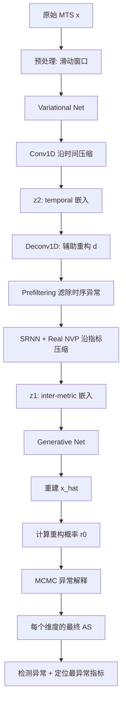
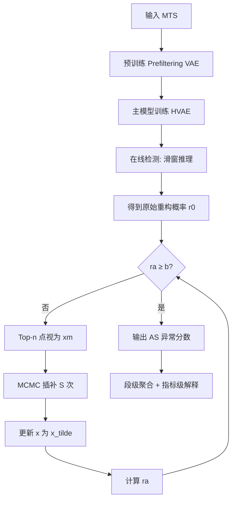

# InterFusion: Multivariate Time Series Anomaly Detection and Interpretation using Hierarchical Inter-Metric and Temporal Embedding（KDD 2021）

> 作者：Zhihan Li, Youjian Zhao, Jiaqi Han, Ya Su, Rui Jiao, Xidao Wen, Dan Pei
> 机构：清华大学、BNRist
> 发表年份：2021
> 会议/期刊：KDD 2021（ACM SIGKDD Conference on Knowledge Discovery and Data Mining）
> 关联 PDF：同目录下 `KDD21_InterFusion_Li.pdf`

## 一、文档信息速览

| 字段 | 值 |
|---|---|
| 标题 | Multivariate Time Series Anomaly Detection and Interpretation using Hierarchical Inter-Metric and Temporal Embedding |
| 作者 | Zhihan Li, Youjian Zhao, Jiaqi Han, Ya Su, Rui Jiao, Xidao Wen, Dan Pei |
| 机构 | Tsinghua University, BNRist |
| 发表年份 | 2021 |
| 会议/期刊 | KDD 2021 |
| 分类 | 时序异常检测 / 多元时序 / AIOps |
| 核心问题 | 如何同时建模多元时序中跨指标的互相关依赖和单指标的时间依赖，并据此进行无监督异常检测与可解释的指标级根因定位。 |
| 主要贡献 | 1) 提出首个联合学习显式低维 inter-metric 与 temporal 嵌入的 HVAE 模型；2) 设计 two-view embedding、hierarchical structure、prefiltering 三个关键结构设计；3) 提出基于 MCMC 插补的异常解释方法，可在异常点上得到合理的重构与嵌入；4) 在 4 个真实数据集上 F1 平均 > 0.94，解释精度 0.87。 |

## 二、背景（Background）

在制造系统、IT 服务、互联网应用等真实工业场景中，一个被监测的实体（entity）通常会被几十甚至上百个指标（metric）共同刻画，如 Web 服务器的 CPU 利用率、内存使用率、TCP 主动建连数等。这些指标随时间连续采样，就形成了多元时序（Multivariate Time Series, MTS）。MTS 既存在"同一指标内"的时序依赖（temporal dependency，例如 CPU 利用率的日周期），也存在"同一时间戳不同指标间"的互相关依赖（inter-metric dependency，例如包传输率、TCP 建连数和 CPU 利用率之间通常正相关）。

传统做法依赖运维专家对每个指标手动设置静态阈值，但当指标数膨胀到成百上千时，这种做法不可扩展。学术界近年来提出了两类方法：
1. **基于预测（prediction-based）** 的方法：用历史值预测未来值，按预测误差判定异常；缺点是有些指标本身不可预测（"inherently unpredictable"）。
2. **基于重构（reconstruction-based）** 的方法：学习低维表示再重构，按重构误差判定异常。代表包括 MSCRED、OmniAnomaly、USAD 等，但这些方法要么只能建模 inter-metric 依赖（用简单确定性方法太弱），要么不能很好建模 temporal 依赖（缺时间维低维表示）。

此外，主流方法还存在两个普遍问题：
- 训练数据中可能含有潜在异常，直接学习容易过拟合到异常模式。
- 检测到异常后只给"是 / 否"的告警，没有"哪些指标最异常"的可解释信息，运维人员定位根因仍需费时。

InterFusion 正是在这一背景下被提出，目标是在一个统一框架中同时建模 inter-metric 与 temporal 依赖、鲁棒地学习正常模式、并在检测阶段给出可解释的指标级定位。

## 三、目的（Purpose / Problems Solved）

- **痛点 1**：现有方法往往只建模一种依赖。**解决方案**：用 HVAE 联合学习显式低维 inter-metric 与 temporal 嵌入。
- **痛点 2**：独立学习两种嵌入后融合困难；沿用图像 HVAE 又会让 inter-metric 嵌入丢失时间一致性。**解决方案**：设计 two-view embedding（沿时间和指标两个"视图"分别压缩、再以辅助"重构输入"作为桥梁）。
- **痛点 3**：训练数据中可能含有未标注的异常，模型容易过拟合到异常。**解决方案**：prefiltering 策略——先用一个预训练 VAE 滤掉部分时序异常，再让 inter-metric 嵌入从"重建后的输入"学习。
- **痛点 4**：检测到异常后无法定位"哪几个指标最异常"。**解决方案**：提出基于 MCMC 插补的异常解释方法，迭代地假设某些点是"缺失"，用 VAE 重构后估计合理值，再在最终重构概率上读出每个指标的异常贡献。
- **痛点 5**：点级评价指标与运维"看一段"的实际使用习惯不一致。**解决方案**：定义段级（segment-wise）评价指标，与现场习惯对齐。

## 四、核心原理（Principles）

InterFusion 是一个**层次化变分自编码器（HVAE）**，包含两个随机隐变量：
- z1 学习低维 inter-metric 嵌入。
- z2 学习低维 temporal 嵌入。

生成模型分解为：

$$
p_\theta(x, z_1, z_2) = p_\theta(x \mid z_1, z_2) \cdot p_\theta(z_1 \mid z_2) \cdot p_\theta(z_2)
$$

z1 与 z2 之间的依赖通过 hierarchical structure 表达，使 inter-metric 嵌入能够感知 temporal 信息，而不是两个独立嵌入再融合。

**Two-view embedding**：
- 沿时间维度用 Conv1D 压缩窗口得到 z2（temporal 嵌入），长度被压缩为 W'。
- 用 Deconv1D 将 z2 重建为"辅助重构输入" d。
- 沿指标维度在 d 上用类似 SRNN 的结构得到 z1（inter-metric 嵌入），维度被压缩为 M'。
- 这种"先压缩时间→重建→压指标"的方式，使 z1 既学到指标间关系又保留时间一致性。

**Prefiltering 策略**：
- 预训练一个 VAE 模型，对 x 沿时间压缩得到 d，d 试图"忠实"重构 x 但通过 embedding-reconstruction 过程自动滤掉时序异常。
- 主模型训练时，z1 不直接从 x 推导，而从 d 推导，从而减少过拟合到异常的风险。

**MCMC-based 异常解释**：
- 异常点会污染潜变量 z，进而污染所有维度的重构，导致"正常指标也被判异常"。
- 算法 1 把低重构概率的 top-n 个点视为"缺失" x_m，其余视为"观测" x_o；用 VAE 对 (x_o, x_m) 做 S 次 MCMC 插补，得到"接近正常"的重构 x̃；再基于 x̃ 计算每个维度的最终重构概率 AS。
- 反复扩大 n（按 n_inc 步进），直到重构概率回到正常基线 b。

**训练目标**（ELBO 展开形式）：

$$
\mathcal{L}(x, \theta, \phi) = \mathbb{E}_{q_\phi} \log p_\theta(x \mid z_1, z_2, e) + \log p_\theta(z_1, e \mid z_2) + \log p_\theta(z_2) - \log q_\phi(z_1, d \mid z_2, x) - \log q_\phi(z_2 \mid x)
$$

**异常分数**（推理时）：

$$
AS = - \frac{1}{M \cdot W} \sum_{x_i \in x_o} \mathbb{E}_{q_\phi(z_1, z_2 \mid \tilde{x})} \log p_\theta(x_i \mid z_1, z_2)
$$

**与传统方法的差异**：
- 与 OmniAnomaly 相比：InterFusion 显式分离 inter-metric / temporal 两个嵌入，并配套解释方法。
- 与 MSCRED 相比：MSCRED 用矩阵签名（signature matrix）做确定性重构，无法处理"指标间关系可能反向"的复杂情况；InterFusion 用 HVAE 概率建模更灵活。
- 与 VAE 变体（VAEpro、USAD）相比：InterFusion 通过 HVAE 同时捕获 inter-metric 与 temporal 信息。

## 五、算法详解（Algorithm）

### 1. 输入 / 输出
- **输入**：多元时序 x ∈ R^(M×N)，M 个指标，N 个时间戳，滑窗长度 W。
- **输出**：每个时间点的异常分数 AS；以及每个时间点对应的"最异常指标"集合。

### 2. 核心模块
- **Variational Net（q-net）**：x → Conv1D → z2 → Deconv1D → d → SRNN+Real NVP → z1。
- **Generative Net（p-net）**：z2 → SRNN → e → Deconv1D → x̃；z1 → 拼接 → 重构 x。
- **Prefiltering VAE**：预训练 z2 与 d。
- **MCMC 解释器**：算法 1，迭代地把低重构概率点视作"缺失"并插补。

### 3. 伪代码

```python
# 训练阶段
pretrain_filtering_vae(x_train)        # 预训练 Prefiltering VAE
for epoch in range(E):
    z2 = conv1d(x_window)              # 沿时间压缩
    d = deconv1d(z2)                   # 辅助重构
    z1 = srnn_with_realnvp(d)          # 沿指标压缩
    x_hat = generate(z1, z2, e)        # 重建
    loss = -elbo(x_window, x_hat, z1, z2, e, d)
    loss.backward()
    optimizer.step()

# 推理阶段（异常检测 + 解释）
def detect_and_interpret(x_window):
    r0 = reconstruction_probability(x_window)  # 原始每个维度重构概率
    b = baseline                                # 训练集 Q1 分位数均值
    np = count(r0 < b)
    n, n_init, n_inc = init, beta_init * np, beta_inc * np
    rlist = []
    while not (ra >= b or n > np):
        xm = top_n(x_window, r0, n)             # 把低重构概率的点视为缺失
        xo = x_window - xm
        for s in range(S):                      # MCMC 插补 S 次
            z1, z2 = sample_q(xo, xm)
            xo_rec, xm_rec = decode(z1, z2)
            x_window = (xo_rec, xm_rec)         # 更新
        ra = mean_recon_prob(x_window)          # 用更新后的输入计算平均重构概率
        rlist.append(ra)
        n += n_inc
    x_tilde = x_window with highest ra
    AS = -mean_recon_prob_per_dim(x_tilde)
    return AS
```

### 4. 关键数学
- ELBO 展开：详见上文公式。
- Real NVP 在 z1 上做可逆仿射变换以增强表达力。
- MCMC 步中，q(d|z2) 与 p(e|z2) 共享 Deconv1D 参数，可以对消（详见论文 Eq. 3-4）。

### 5. 复杂度分析
- 单次前向：O(M·W·(隐变量维度))，与 VAE 同一量级。
- 解释阶段 MCMC 需 S 次解码，最多 np/n_init 次循环，在 SWaT 上可在秒级完成。

### 6. 训练与推理
- **训练**：无监督，仅用正常 / 训练时序；用 Adam + SGVB 估计器优化 ELBO。
- **推理**：滑窗 W 输入，对窗口最后一个点输出 AS，并按段聚合检测异常段。

### 7. 示例
SWaT 数据集上，InterFusion 对某段异常（如传感器值突升）的输出 AS 会在该传感器所在维度上明显高于其他维度，运维人员即可直接定位到该传感器为最异常指标。

## 六、系统架构图（Architecture）



## 七、流程图（Process Flow）



## 八、关键创新点（Key Innovations）

- **+ 双视图嵌入（Two-view Embedding）**：沿时间和指标两个"视图"分别压缩 MTS，避免传统 HVAE 在 MTS 上"时间错位"问题。
- **+ 层次化结构 + Prefiltering**：让 inter-metric 嵌入在 temporal 信息指导下学习，又通过预训练 VAE 抑制过拟合到异常。
- **+ MCMC-based 异常解释**：把"异常点污染潜变量"这一经典 VAE 痛点转化为算法机会，用迭代插补估计"正常态"重构，再得到可信的指标级贡献。
- **+ 段级评估指标**：与运维人员的实际操作习惯对齐，避免点级评估中"对了一点点就算对"的过乐观。
- **+ 大规模实验 + 工业部署**：4 个真实数据集（SWaT、WADI、SMD、新发布的 ASD），平均 F1 0.94，并已在某大型互联网公司部署。

## 九、实验与结果（Experiments）

**数据集**：
- **SWaT**：新加坡公用事业局公开的水处理厂数据集。
- **WADI**：水分配数据集，118 个指标，复杂互相关。
- **SMD**（Server Machine Dataset）：5 周服务器指标，OmniAnomaly 发布。
- **ASD**（Application Server Dataset）：本文新发布的某大型互联网公司应用服务器监控数据。

**Baseline**：LSTM-NDT、MSCRED、MAD-GAN、OmniAnomaly、DSANet、USAD、VAEpro。

**主要指标**：
- **异常检测**：best-F1（点级 + 段级 + point-adjust）。
- **异常解释**：HitRate@P%（被识别为最异常指标的前 P% 中包含真实根因指标的比例）。

**关键结果数字**（Table 1，Average best-F1）：

| 方法 | SWaT | WADI | SMD | ASD | Avg |
|---|---|---|---|---|---|
| LSTM-NDT | 0.8133 | 0.5067 | 0.7687 | 0.4061 | 0.6237 |
| MSCRED | 0.8346 | 0.5469 | 0.8252 | 0.5948 | 0.7004 |
| MAD-GAN | 0.8431 | 0.7085 | 0.8966 | 0.6325 | 0.7702 |
| OmniAnomaly | 0.7344 | 0.7927 | 0.9628 | 0.8344 | 0.8311 |
| DSANet | 0.8924 | 0.8739 | 0.9630 | 0.8740 | 0.9008 |
| USAD | 0.8227 | 0.4275 | 0.9024 | 0.7987 | 0.7378 |
| VAEpro | 0.8369 | 0.8200 | 0.8693 | 0.8522 | 0.8446 |
| **InterFusion** | **0.9280** | **0.9103** | **0.9817** | **0.9531** | **0.9433** |

- 解释精度（HitRate）平均 0.87，比 SOTA 高至少 0.07。

**消融实验**（论文 Table 5）：去掉 hierarchical、two-view、prefiltering、FLOW（Real NVP）、MCMC-interp 任一组件都会显著降低 F1，说明每个设计点都必要。

**效率分析**：在 SWaT 上每 1024 个时间点检测时间约 1 秒（GPU），相比 OmniAnomaly 推理成本相当，显著低于 MSCRED。

## 十、应用场景（Use Cases）

- **Web 应用服务器监控**：多指标异常检测，定位最异常指标（CPU、内存、连接数）以加速排障。
- **水处理 / 工业控制**：SWaT、WADI 等数据集场景，识别传感器级异常。
- **多机房服务器集群**：MTS 反映集群整体状态，InterFusion 给出"哪几台机器的几个指标最异常"。
- **金融交易系统**：同时监控成百上千个指标的时间序列，识别异常段并定位根因指标。
- **IoT 设备监控**：传感器互相关建模，对设备群组做异常检测。

## 十一、相关论文（Related Papers in this set）

- `paper-INFOCOM21-cfp`（CTF）也是面向多元时序异常检测，但侧重 coarse-to-fine 模型迁移。
- `马明华atc21_JumpStarter` 也是多元时序异常检测，侧重 cold-start 场景，可与 InterFusion 互补做"冷启动 → 在线学习"。
- `PID6423661`（GMVAE）在 VAE 上做高斯混合先验，可作为 z 的先验替换，扩展 InterFusion。
- `share_file`（VAEPP）的 pull-back 先验也可作为 z2 的先验替代。

## 十二、术语表（Glossary）

- **MTS（Multivariate Time Series）**：多元时序。
- **Inter-metric dependency**：同一时间戳下不同指标之间的关系。
- **Temporal dependency**：同一指标在时间上的依赖。
- **HVAE（Hierarchical Variational Autoencoder）**：层次化 VAE。
- **Real NVP**：一种 normalizing flow 实现的灵活后验。
- **ELBO**：Evidence Lower Bound，VAE 训练目标。
- **Prefiltering**：用预训练 VAE 滤除时序异常的策略。
- **MCMC Imputation**：蒙特卡洛插补，迭代用 VAE 估计"缺失点"的过程。
- **Point-adjust**：段级评估方法。
- **HitRate@P%**：前 P% 候选中包含真值的比率。

## 十三、参考与延伸阅读

- OmniAnomaly (KDD 2019) — 用随机递归 VAE 做 MTS 异常检测。
- MSCRED (AAAI 2019) — 用矩阵签名 + ConvLSTM。
- DSANet (IJCAI 2019) — Dual Self-Attention Network。
- USAD (KDD 2020) — UnSupervised Anomaly Detection。
- VAE 经典：Kingma & Welling 2014。
- Real NVP：Dinh et al. 2017。
- SMD 数据集、SWaT / WADI 数据集。
- 代码与数据：论文 Appendix C.1 给出开源链接。
