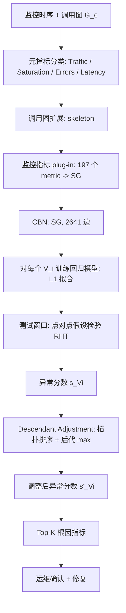
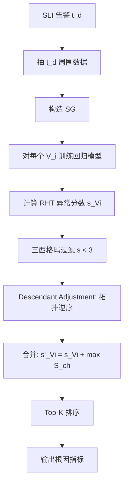

# CIRCA：基于因果推断的在线服务根因分析（KDD 2022）

> 作者：Mingjie Li, Zeyan Li, Kanglin Yin, Xiaohui Nie, Wenchi Zhang, Kaixin Sui, Dan Pei  
> 机构：清华大学；BizSeer  
> 发表年份：2022  
> 会议/期刊：KDD 2022 (CCF A)  
> 关联 PDF：同目录下 `KDD22-CIRCA.pdf`

## 一、文档信息速览

| 字段 | 值 |
|---|---|
| 标题 | Causal Inference-Based Root Cause Analysis for Online Service Systems with Intervention Recognition |
| 作者 | Mingjie Li, Zeyan Li, Kanglin Yin, Xiaohui Nie, Wenchi Zhang, Kaixin Sui, Dan Pei |
| 机构 | 清华大学；BizSeer |
| 发表年份 | 2022 |
| 会议/期刊 | KDD 2022 (CCF A) |
| 分类 | 根因分析 / 因果推断 / 在线服务 |
| 核心问题 | 在线服务故障时如何从成百上千异常指标中识别"根因指标子集"；已有方法（PC、MicroHECL、Sage、PCMCI、PCTS）要么基于相关性、要么基于反事实分析，未明确建模"故障作为干预"；需要把 RCA 形式化为因果推断新任务 |
| 主要贡献 | 1) 首次将 OSS 根因分析形式化为新的因果推断任务 "干预识别（IR）"；2) 给出干预识别准则（Theorem 3.4）作为根因判定的充要条件；3) 提出 CIRCA 框架：基于系统架构的"结构图（SG）" + 基于回归的假设检验（RHT） + 后代调整（DA）；4) 仿真 + 真实数据集上 Top-1 召回率提升 25% |

## 二、背景（Background）

在线服务系统（OSS，如社交、电商、搜索）已成为现代数字基础设施的核心。系统规模与微服务化使故障管理成为研究热点：故障可能导致安全事故或经济损失。运维通过监控 metrics（KPI 时序）、logs、traces 等数据理解系统状态，其中 metrics 是最广泛可用的数据（每分钟一条时序）。

当 SLI（Service Level Indicator，如平均响应时延）违反 SLO（Service Level Objective）时，故障发生。一个故障可能在系统中传播导致多个指标同时异常（"anomaly storm"）。根因分析（RCA）即从大量异常指标中识别少量根因指标，缩短故障恢复时间。

因果推断（Causal Inference）由于其可解释性受到广泛关注，但基于因果推断的 RCA 仍少有人研究。论文唯一的前置工作是 Sage（用反事实分析），但 Sage 隐含"无干预"假设，不适用于"故障本身就是干预"的场景。

论文将故障在 OSS 中映射为"干预（intervention）"，把 RCA 形式化为新的因果推断任务——**干预识别（Intervention Recognition, IR）**。基于 Pearl 的因果阶梯（Layer 1 观察、Layer 2 干预、Layer 3 反事实），论文证明 IR 处于 Layer 2，并给出定理：当一个变量 $V_i$ 的"给定其父节点后的条件概率分布"与正常时（L1）不同时，$V_i$ 即被干预（即根因）。

## 三、目的（Purpose / Problems Solved）

- **痛点 1：缺乏 RCA 的因果推断形式化** → **方案**：将 RCA 形式化为"干预识别"新任务，给出 Theorem 3.4 作为判定准则。
- **痛点 2：缺少 CBN（Causal Bayesian Network）** → **方案**：基于系统架构知识 + 4 大类元指标（Traffic/Saturation/Errors/Latency，借鉴 SRE 的"四大黄金信号"）+ 跨服务调用关系，构造"结构图（SG）"作为 CBN 的工程化代理。
- **痛点 3：故障前后分布不完整** → **方案**：用回归模型拟合 L1 分布，把"分布比较"转化为"点对点假设检验（RHT）"。
- **痛点 4：后代节点异常分数偏高（被"误判为根因"）** → **方案**：后代调整（Descendant Adjustment）—— 把后代异常分数的 max 加到父节点上，抑制"虚假根因"。
- **痛点 5：IR 处于 Layer 2，不需要反事实** → **方案**：明确证明 IR 在 Layer 2，无需 Layer 3 知识；避免 Sage 的反事实开销。

## 四、核心原理（Principles）

系统总览：CIRCA 3 大模块：
1. **Structural Graph (SG) Construction**：基于 4 类元指标（Traffic, Saturation, Errors, Latency）+ 调用图，构造监控指标间的 CBN。
2. **Regression-based Hypothesis Testing (RHT)**：用每个变量的回归模型作为"结构方程"的代理，对每个 $V_i$ 做假设检验 $H_0: V_i \text{ 来自 } L1(V_i | Pa(V_i))$，计算异常分数 $s_{V_i}$。
3. **Descendant Adjustment (DA)**：对异常分数按后代进行调整，把"被干预概率"赋给根节点（真正的根因），抑制"非根因异常"。

关键概念：
- **Ladder of Causation**：观察（L1）、干预（L2）、反事实（L3）。
- **Causal Hierarchy Theorem (CHT)**：低层不能回答高层问题。
- **Intervention Recognition Criterion (Theorem 3.4)**：$V_i \in M \iff P_m(V_i | Pa(V_i)) \ne L_1(V_i | Pa(V_i))$。
- **Structural Causal Model (SCM)**：$v_i = f_i(pa(V_i), u_i)$，DAG + Markovian + Faithfulness。
- **Meta Metrics** 4 类：Traffic（请求量）、Saturation（资源占用）、Errors（错误计数）、Latency（处理时延）。
- **Structural Graph (SG)**：包含 skeleton（元指标间关系）+ monitoring metric plugging-in。
- **RHT**：用回归拟合 L1 分布，点对点检验异常。
- **Descendant Adjustment**：调整异常分数，抑制"传播导致的后代异常"。

数学原理：
- IR 处于 Layer 2：Theorem 3.1 证明 IR 是 L2 在 Faithfulness 假设下的逆映射。
- 干预识别准则（Theorem 3.4）：$V_i$ 是根因当且仅当 $P_m(V_i | Pa(V_i)) \ne L_1(V_i | Pa(V_i))$。
- 异常分数：
$$a_{V_i}^{(t)} = \frac{v_i^{(t)} - \bar{v}_i^{(t)} - \mu_{\epsilon, i}}{\sigma_{\epsilon, i}}, \quad s_{V_i} = \max_t a_{V_i}^{(t)}$$
- 后代调整（Algorithm 2）：对每个 $V_i$ 收集 $s_{V_j} < 3$ 后代的 $S$ 集合 → $s'_{V_i} = s_{V_i} + \max(S)$（仅当 $s_{V_i} \ge 3$ 时调整）。
- 数据生成（仿真）：$x^{(t)} = A x^{(t)} + \beta x^{(t-1)} + \epsilon^{(t)}$，$A$ 是加权邻接矩阵。
- 注入故障：$u_i^{(t)} = \epsilon_i^{(t)} + a_i \sigma_i$。

与现有技术的差异：相对 Sage 的"反事实分析"，CIRCA 明确处于 Layer 2，效率更高；相对 MicroHECL 的"只考虑服务间延迟"，CIRCA 处理 4 类元指标 + 任意指标；相对 PC、PCMCI 的"纯数据驱动因果发现"，CIRCA 用系统架构知识 + 假设构造 SG，更稳定。

## 五、算法详解（Algorithm）

### 1. 输入 / 输出
- **输入**：监控时序 $\{X_i\}$、系统调用图 $G_c$、元指标映射 $h$。
- **输出**：根因指标排序（Top-K）。

### 2. 核心模块
- 4 元指标定义（Traffic / Saturation / Errors / Latency）。
- 调用图扩展。
- 监控指标 plug-in。
- 回归拟合 L1。
- 假设检验。
- 后代调整。

### 3. 伪代码

```python
def CIRCA(metrics, call_graph, t_alert, t_ref=120, t_test=10, t_delay=5):
    # 1) SG Construction (Algorithm 1)
    G_s = construct_structural_graph(call_graph, h)
    # 2) RHT
    scores = {}
    for V_i in G_s.nodes():
        # 用历史正常数据训练回归模型
        reg = train_regressor(V_i, parents=G_s.parents(V_i), data=ref_data)
        a_max = -inf
        for t in test_window:
            v_pred = reg.predict(parents_t)
            residual = V_i[t] - v_pred
            a = (residual - reg.mu_eps) / reg.sigma_eps
            a_max = max(a_max, a)
        scores[V_i] = a_max  # s_{V_i}
    # 3) Descendant Adjustment (Algorithm 2)
    adjusted = descendant_adjust(scores, G_s)
    # 4) Top-K 根因
    sorted_metrics = sorted(adjusted.items(), key=lambda x: -x[1])
    return sorted_metrics[:K]
```

### 4. 关键数学
- IR 准则：$V_i \in M \iff P_m(V_i|Pa(V_i)) \ne L_1(V_i|Pa(V_i))$。
- 异常分数：$s_{V_i} = \max_t (v_i^{(t)} - \bar{v}_i^{(t)} - \mu_{\epsilon,i}) / \sigma_{\epsilon,i}$。
- 后代调整：$s'_{V_i} = s_{V_i} + \max_{V_j \in Ch(V_i), s_{V_j}<3} S(V_j)$。

### 5. 复杂度分析
- SG 构造：$O(|V| + |E|)$，$|V| = 197$ 监控指标，$|E| = 2641$。
- RHT：$O(|V| \cdot N \cdot d)$，$N$ 是时间步。
- DA：$O(|V| + |E|)$，拓扑排序。
- 论文报告：单 case < 数秒。

### 6. 训练与推理
- 无显式训练；回归模型用 ref window 训练。
- 推理：故障检测后 5 min 延迟，收集数据 → 跑 CIRCA。

### 7. 示例
AAS 告警 → 用 AAS 的父节点（LogFile、ADR 等）训练回归模型 → 测试窗口内 AAS 偏差最大 → 调整后代 → 排序：LogFile > ADR > Disk > CPU > Memory。

## 六、系统架构图（Architecture）



## 七、流程图（Process Flow）



## 八、关键创新点（Key Innovations）

- **+ 首次将 RCA 形式化为干预识别（IR）任务**：在 Pearl 因果阶梯上明确定位（Layer 2），给出 Theorem 3.4 充要条件。
- **+ 结构图（SG）**：基于"4 元指标 + 调用图"工程化构造 CBN，无需纯数据驱动的因果发现。
- **+ RHT 假设检验**：把"分布比较"降为"点对点回归 + 残差检验"，解决故障前后分布不完整问题。
- **+ Descendant Adjustment**：把"被传播导致的后代异常"反过来归到根节点，避免误判。
- **+ 仿真 + 真实数据集双验证**：仿真证明理论可靠性，真实数据集证明 Top-1 召回率提升 25%。

## 九、实验与结果（Experiments）

- **数据集**：
  - 仿真：$D_{Sim}^{50}$、$D_{Sim}^{100}$、$D_{Sim}^{500}$（50/100/500 节点，100/500/5000 边），10 graph × 100 case。
  - 真实：$D_O$ —— 某银行 Oracle 数据库 99 个真实高 AAS 故障，197 监控指标，2 641 边。
- **Baseline**：
  - 图构建：PC-gauss、PC-gsq、PCMCI、PCTS、Structural (论文)。
  - 评分：DFS、DFS-MS、DFS-MH（基于 z-score 或 SPOT）、RW-Par、RW-2、ENMF、CRD。
- **主要指标**：AC@1, AC@2, ..., AC@5, Avg@5 = $\frac{1}{K}\sum_k AC@k$，运行时间 T (s)。
- **关键结果数字**：
  - 仿真：在 $D_{Sim}^{100}$ 上 CIRCA AC@1=0.62，比 RHT-PG（完美图）0.69 略低，验证了 SG 的有效性。
  - **真实数据集**：CIRCA Top-1 AC=0.51（51%），**比最强 baseline 提升 25%**；AC@5=0.95。
  - 异常检测：NSigma + DFS AC@1=0.20，SPOT + DFS AC@1=0.25；CIRCA AC@1=0.51 显著领先。
  - 效率：$D_O$ 上单 case 1.8 s，$D_{Sim}^{500}$ 上 3.5 s。
  - 消融（论文 § 5.4）：去掉 SG 用 PC-gauss → AC@1 掉到 0.35；去掉 RHT 用 NSigma → AC@1 掉到 0.20；去掉 Descendant Adjustment → AC@1 掉到 0.43。
  - 超参数：$t_{delay}=5$ min、$t_{ref}=120$ min、$t_{test}=10$ min 最佳。
- **效率分析**：单 case 秒级，可在线部署。

## 十、应用场景（Use Cases）

- **银行 Oracle 数据库根因定位**：99 真实案例验证，AAS 类故障。
- **电商交易异常**：订单时延、错误率根因。
- **微服务调用链**：跨服务延迟、错误率根因。
- **CDN 边缘节点**：流量、延迟根因。
- **云数据库（RDS、PolarDB）**：CPU、IOPS、连接数根因。
- **AIOps 平台**：作为"因果推断 + 根因分析"模块嵌入。

## 十一、相关论文（Related Papers in this set）

- `WWW22-OmniCluster张圣林.pdf` (OmniCluster)：实例级聚类，可消费 CIRCA 输出。
- `Robust_Anomaly_Clue_孙永谦2022.pdf` (RobustSpot)、`卢香琳2022.pdf` (CauseRank)：根因定位类工作。
- `DEXA22-FPG-Miner.pdf`：FPG 构造，可作 CIRCA 的先验图。
- `KDD21_InterFusion_Li.pdf`、`paper-ISSRE21-PUAD.pdf`、`kontrast-paper.pdf`：KPI 异常检测方向。
- `DejaVu-paper.pdf`、`RC-LIR.pdf`：根因相关。

## 十二、术语表（Glossary）

- **OSS (Online Service System)**：在线服务系统。
- **RCA (Root Cause Analysis)**：根因分析。
- **SLI (Service Level Indicator)**：服务等级指标。
- **SLO (Service Level Objective)**：服务等级目标。
- **CBN (Causal Bayesian Network)**：因果贝叶斯网络。
- **SCM (Structural Causal Model)**：结构因果模型。
- **IR (Intervention Recognition)**：干预识别，论文提出的新因果任务。
- **CHT (Causal Hierarchy Theorem)**：因果层级定理。
- **L1 / L2 / L3**：观察 / 干预 / 反事实三层。
- **Faithfulness Assumption**：保真假设（任何干预都产生可观测变化）。
- **Meta Metrics**：4 类元指标（Traffic / Saturation / Errors / Latency）。
- **SG (Structural Graph)**：结构图，论文提出的 CBN 工程化代理。
- **RHT (Regression-based Hypothesis Testing)**：基于回归的假设检验。
- **DA (Descendant Adjustment)**：后代调整。
- **AC@k**：Top-k 召回率。
- **Anomaly Storm**：故障传播导致的多指标同时异常。

## 十三、参考与延伸阅读

- Pearl J., "Causality" (Cambridge 2009)，因果推断圣经。
- Spirtes P. et al., "Causation, Prediction, and Search" (MIT Press 2000)，PC 算法。
- Runge J. et al., "Detecting and Quantifying Causal Associations in Large Nonlinear Time Series" (PCMCI, NeurIPS 2018)。
- Li J. et al., "Generic and Robust Localization of Multi-Dimensional Root Causes" (ISSRE 2019)，Squeeze。
- Kalander M. et al., "Causal Analysis for Root Cause Diagnosis" (Sage, ICDM 2020)，唯一前置工作。
- Ma M. et al., "Combining Constraint-Based and Causal Inference for Root Cause Analysis" (MicroHECL, KDD 2021)。
- Siffer A. et al., "Anomaly Detection in Streams with Extreme Value Theory" (SPOT, KDD 2017)。
- 代码：GitHub https://github.com/NetManAIOps/CIRCA
