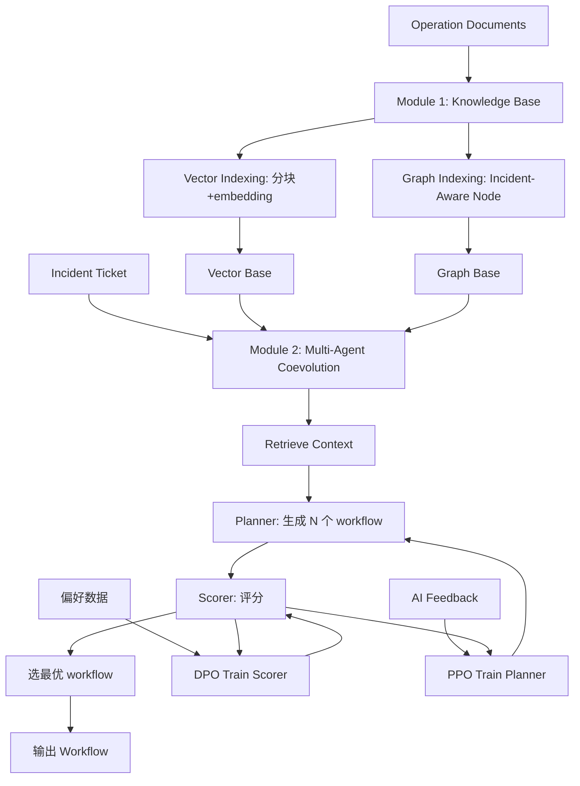
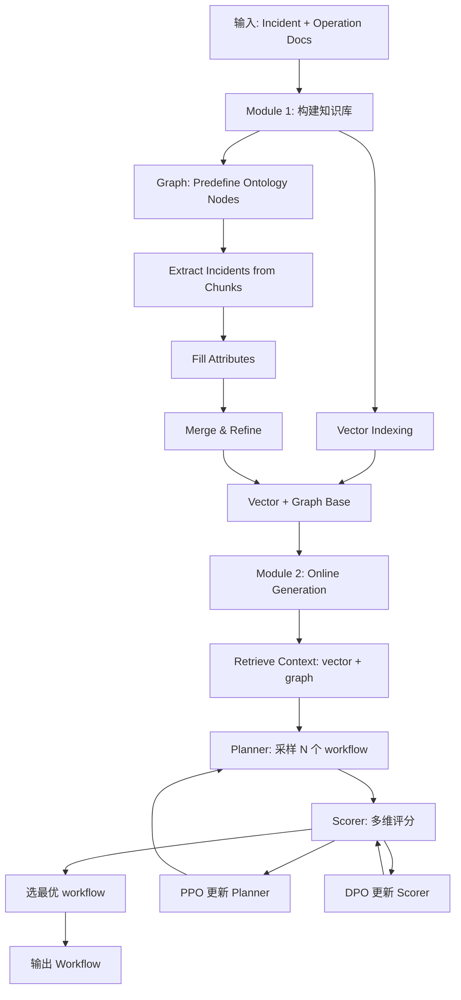

# FlowXpert：基于知识库与多 Agent 协同进化的故障排除工作流编排（KDD 2025）

> 作者：Binpeng Shi、Yu Luo、Yongxin Zhao、Shenglin Zhang、Bowen Hao、Chenyu Zhao、Yongqian Sun、Zhi Zhang、Wei Song、Xiaolong Chen、Jingbo Miao、Dan Pei
> 机构：南开大学、华为云、华为、Haihe Lab、清华
> 发表年份：2025
> 会议/期刊：KDD 2025（Toronto, Canada）
> 关联 PDF：同目录下 `KDD25-FlowXpert.pdf`

## 一、文档信息速览

| 字段 | 值 |
|---|---|
| 标题 | FlowXpert: Expertizing Troubleshooting Workflow Orchestration with Knowledge Base and Multi-Agent Coevolution |
| 作者 | Binpeng Shi, Yu Luo, Yongxin Zhao, Shenglin Zhang, Bowen Hao, Chenyu Zhao, Yongqian Sun, Zhi Zhang, Wei Song, Xiaolong Chen, Jingbo Miao, Dan Pei |
| 机构 | 南开大学、华为云、华为、海河实验室、清华 |
| 发表年份 | 2025 |
| 会议/期刊 | KDD 2025 |
| 分类 | 故障排除 / 工作流编排 / LLM / 多 Agent |
| 核心问题 | 大型云服务（华为云 DCN）中工作流手工编写成本高、LLM 自动生成又难对齐领域规范与可靠性 |
| 主要贡献 | 1) 领域本体的 incident-aware 知识图谱；2) Planner + Scorer 多 Agent 协同进化（PPO+DPO）；3) STEPScore 评估指标；4) OpsFlowBench 基准；5) 华为云 10 周部署 |

## 二、背景（Background）

华为云数据中心网络（DCN）跨 17 区域、63 可用区，托管百万级服务器和十万级交换机；每月产生 2 万+ 事件工单。如此规模下，传统手工故障排除流程无法扩展。

云服务商通常把故障排除抽象为**预定义工作流**（Process Step + Decision Step + Terminal Step），提供 step-by-step 指引给 on-call 工程师（OCE）和 AI Executor。OCE 用工作流减少专业知识需求，Executor（带工具调用能力的 AI 代理）期望自动解读工作流执行。

但传统工作流编写高度依赖专家经验，每个事件需 7 个 OCE（含 2 个专家）约 7 小时。LLM 自动生成工作流虽有进展，但面临三大挑战：
- **C1 故障排除专业性复杂**：手工 API 化知识代价大；vector indexing 难建立长程关联；graph indexing 粒度不匹配。
- **C2 工作流编排需符合领域规范**：必须全面 recall 关键步骤、可读可执行。
- **C3 AI 反馈可靠性**：开源 LLM 作 AI 评判员在知识密集场景下能力有限。

FlowXpert 提出"知识库 + 多 Agent 协同进化"的双模块框架。

## 三、目的（Problems Solved）

- **痛点 1：手工工作流难扩展。** 每事件 7 人 × 7 小时，无法大规模。
- **痛点 2：LLM 生成与领域规范错位。** 通用 LLM 不熟悉 OCE 操作语言。
- **痛点 3：AI 反馈不可靠。** 开源评判员能力不足，反馈有误。
- **痛点 4：知识图谱粒度不匹配。** 通用 graph 工具粒度太粗或太细。
- **解决方案**：
  1) 领域 ontology 引导的"Incident-Aware Node"知识图谱（兼顾粒度与表达力）；
  2) Planner + Scorer 双 Agent，PPO 调 Planner、DPO 调 Scorer，co-evolve；
  3) 偏好数据合成受"contextual richness"控制，提升 AI 评判的稳定性。

## 四、核心原理（Principles）

**总览**：FlowXpert 包含两个模块：
- **Module 1：Knowledge Base Construction**：基于本体（ontology）的 incident-aware graph + vector base 联合知识库。
- **Module 2：Multi-Agent Coevolution**：Planner 生成工作流，Scorer 评估；通过 PPO 调 Planner、DPO 调 Scorer，让两个 Agent 互相进化。

**模块 1：知识库构建**：

- **领域本体（Domain Ontology）**：把 incident management 抽象为 5 类核心概念：
  - Incident（中心概念，主键）
  - Failure Description（故障描述）
  - Mitigation Steps（缓解步骤）
  - Typical Cases（典型案例）
  - Additional Note（附加说明）
  - 关系：`(Incident, has_attributes, Attrs)`，Attrs = {Failure Description, Mitigation Steps, ...}
- **Incident-Aware Node**：每个 node 像一张"待填表"，以 incident 名为 PK，attributes 为字段。
- **构建 4 步**：
  1. **Predefine Nodes**：基于 ontology 定义节点 schema；
  2. **Extract Incidents**：分块后 LLM 抽取 incident 名称；
  3. **Fill Attributes**：few-shot LLM 抽取 Failure Description、Steps、Typical Cases、Notes；
  4. **Merge & Refine**：跨 chunk 合并去重。

**模块 2：多 Agent 协同进化**：

- **Planner**：根据 incident + 知识库生成工作流。
- **Scorer**：评估工作流质量，多维度打分。
- **PPO for Planner**：用 Scorer 的多维分数做 reward signal，PPO 微调 Planner。
- **DPO for Scorer**：合成"丰富上下文 vs 稀疏上下文"下的 workflow pairs 作为偏好数据，DPO 微调 Scorer。
- **协同进化**：Scorer 越准 → Planner 学得越好；Planner 生成更好的 workflow → Scorer 也能学到更细粒度区分。

**关键数学**：

- **STEPScore 评估**（在 OpsFlowBench 上）：
  $$STEPScore = w_1 \cdot C_{\text{coverage}} + w_2 \cdot R_{\text{redundancy}} + w_3 \cdot E_{\text{executability}} + w_4 \cdot S_{\text{structure}}$$
  四个维度：步骤覆盖率、冗余度、可执行性、结构合理性。
- **PPO 目标**：
  $$L^{PPO}(\theta) = \mathbb{E}_t\big[\min(r_t(\theta) A_t, \text{clip}(r_t(\theta), 1-\epsilon, 1+\epsilon) A_t)\big]$$
- **DPO 目标**：
  $$L^{DPO}(\phi) = -\log\sigma\big(\beta \log\frac{\pi_\phi(y_w|x)}{\pi_{\text{ref}}(y_w|x)} - \beta\log\frac{\pi_\phi(y_l|x)}{\pi_{\text{ref}}(y_l|x)}\big)$$

**为什么这么做**：
- Ontology 引导保证知识图谱粒度与领域匹配；
- 协同进化让 Planner 与 Scorer 互相促进，避免单方面训练偏差；
- PPO 直接优化任务表现，DPO 提升评判员的判别力；
- Vector + Graph 双索引兼顾广度与深度。

**与现有技术的差异**：
- vs. 手工工作流：自动化 + 标准化。
- vs. ReAct、ToolLLaMA、T-Eval：FlowXpert 用 ontology 知识 + 协同进化，比 action space 更丰富。
- vs. Graph RAG：FlowXpert 用 incident-aware node，比通用 graph 粒度更对。

## 五、算法详解（Algorithm）

### 1. 输入 / 输出
- **输入**：incident ticket（事件名 + 描述）；领域 operation documents。
- **输出**：可执行 troubleshooting workflow（Process Step + Decision Step + Terminal Step）。

### 2. 核心模块
- **Vector Indexer**：分块 + embedding。
- **Graph Builder**：ontology 引导的 incident-aware node 抽取 + 合并。
- **Planner (LLM)**：用 RAG 知识生成 workflow。
- **Scorer (LLM)**：多维度评分。
- **PPO Trainer**：Planner 微调。
- **DPO Trainer**：Scorer 微调。
- **Workflow Postprocessor**：格式校验 + 可执行性检查。

### 3. 伪代码

```python
def flowxpert_pipeline(incident, docs):
    # Module 1: 知识库构建（离线）
    vector_base = build_vector_index(docs)
    graph_base = build_incident_aware_graph(docs, ontology)
    
    # Module 2: 在线生成
    context = retrieve_context(incident, vector_base, graph_base, top_k=10)
    workflows = planner.sample_workflows(incident, context, n=8)  # 多 sample
    scores = [scorer.score(incident, context, w) for w in workflows]
    best_workflow = workflows[argmax(scores)]
    return best_workflow, scores

def ppo_train_planner(planner, scorer, incidents, workflows, n_iter=10):
    for it in range(n_iter):
        # 1) 采样
        contexts = retrieve_contexts(incidents)
        gen_wfs = planner.sample(incidents, contexts)
        # 2) 评分
        rewards = [scorer.score(i, c, w) for i, c, w in zip(incidents, contexts, gen_wfs)]
        # 3) PPO 更新
        planner.ppo_update(gen_wfs, rewards)
    return planner

def dpo_train_scorer(scorer, incidents, contexts, preference_pairs):
    for pair in preference_pairs:
        # 偏好数据：相同 incident + context 下的 (preferred, rejected) workflow
        chosen_score = scorer.score(*pair.chosen)
        rejected_score = scorer.score(*pair.rejected)
        dpo_loss = -log_sigmoid(chosen_score - rejected_score)
        dpo_loss.backward()
    return scorer
```

### 4. 关键数学
- 见上文 "关键数学" 章节。
- 偏好数据合成：用不同"contextual richness"（如完整知识 vs 缺某些 incident-aware 节点）生成 workflow pair，构造 (rich-context, good) vs (poor-context, bad) 偏好。

### 5. 复杂度分析
- 知识库构建：$O(N \cdot L)$ chunks 抽取 + LLM 调用，典型 1-2 GPU·小时。
- 在线生成：单 incident ~3-8 秒（多 sample + 评分）。
- 训练：PPO/DPO 各 ~10 GPU·小时。

### 6. 训练与推理
- 训练：离线 PPO/DPO 协同进化。
- 推理：在线 RAG + Planner 采样 + Scorer 选最优。

### 7. 示例
- Incident: "Low optical power"
- 知识库：检索到 incident-aware node 含 Mitigation Steps: "Clean the optical module interface"
- Planner 生成 workflow:
  - Process: Clean the optical module interface
  - Decision: Has the optical power returned to normal?
  - Process: Repair or contact support (No branch)
  - Terminal: Complete (Yes branch)
- Scorer 评分：覆盖率 1.0、冗余度 0.9、可执行性 1.0、结构 1.0 → STEPScore 0.97。

## 六、系统架构图（Architecture）



## 七、流程图（Process Flow）



## 八、关键创新点（Key Innovations）

- **+ Domain Ontology 引导的 Incident-Aware Graph**：5 类核心概念 + Incident-Aware Node，粒度与领域匹配，兼顾表达力与可控性。
- **+ Planner + Scorer 协同进化**：PPO 调 Planner（任务导向）、DPO 调 Scorer（评判可靠），互相促进。
- **+ 受 Contextual Richness 控制的偏好数据合成**：避免 AI 评判员被无关信息干扰。
- **+ STEPScore 评估指标**：Coverage + Redundancy + Executability + Structure 四维度，与专家判断一致。
- **+ 华为云 10 周实际部署**：OCE 与 Executor 都受益，incident resolution 时间从 24 分钟降到 9 分钟（62.5% 减少）。

## 九、实验与结果（Experiments）

- **数据集**：OpsFlowBench（华为云 DCN 真实操作文档构建）；10 周部署数据。
- **Baseline**：Naive LLM、ReAct、ToolLLaMA、StateFlow、GPT-4o few-shot。
- **主要指标**：STEPScore（4 维度聚合）、人工评分、resolution time。
- **关键结果**：
  - FlowXpert 在 STEPScore 上显著超所有 baseline；
  - 10 周部署：incident resolution 时间从 24 分钟降到 9 分钟（-62.5%）；
  - 79 个高频 incident 已自动化为 script，OCE 0 干预；
  - 实际支持 OCE 与 Executor 两种用户。
- **消融实验**：
  - 去掉 ontology 引导：graph 粒度差，工作流质量退化；
  - 去掉 PPO：Planner 不对齐领域规范；
  - 去掉 DPO：Scorer 评判不稳，PPO 训练震荡；
  - 去掉 vector/graph 单一索引：知识覆盖不全。
- **效率分析**：单 incident ~3-8 秒；OCE 平均处理时间下降 62.5%。

## 十、应用场景（Use Cases）

- **云服务故障排除工作流自动生成**：华为云 DCN、AWS、Azure 等大型云平台。
- **OCE 辅助决策**：on-call 工程师快速获取分步指引。
- **AI Executor 自动执行**：把 workflow 翻译为脚本自动执行。
- **新员工培训**：workflow 作为标准化操作流程。
- **跨团队经验沉淀**：把分散在多个 OCE 脑子里的经验沉淀为知识库。

## 十一、相关论文（Related Papers in this set）

- 同为运维自动化的 **Triangle** 关注事件分诊，FlowXpert 关注事件分诊后的工作流编排；上下游关系。
- **TixFusion（3696630.3728547）** 关注工单聚合，与 FlowXpert 共享"减少 OCE 重复劳动"目标。
- **OpsEval、Eagle** 关注 LLM 评测，FlowXpert 可用其做能力评估。
- **PerfScout** 关注性能测试，可与 FlowXpert 配合——发现 breaking point 后用 FlowXpert 编排应急响应。

## 十二、术语表（Glossary）

- **Workflow**：工作流，由 Process Step / Decision Step / Terminal Step 组成。
- **OCE (On-Call Engineer)**：on-call 工程师。
- **Executor**：AI 代理，能调用工具执行 workflow。
- **Domain Ontology**：领域本体，定义核心概念与关系。
- **Incident-Aware Node**：以 incident 为主键的知识图节点。
- **Vector Indexing / Graph Indexing**：向量 / 图索引。
- **Planner / Scorer**：规划 / 评分 Agent。
- **PPO / DPO**：近端策略优化 / 直接偏好优化。
- **STEPScore**：FlowXpert 自研评估指标。
- **DCN (Data Center Network)**：数据中心网络。
- **Contextual Richness**：上下文丰富度，用于控制偏好数据。

## 十三、参考与延伸阅读

- ReAct、ToolLLaMA、T-Eval：被比较的 LLM Agent。
- Graph RAG：图增强检索。
- PPO（Schulman et al., 2017）、DPO（Rafailov et al., 2023）：RL 算法。
- 华为云 DCN、Ops、OCE 流程文档。
- OpsFlowBench：自研基准。
