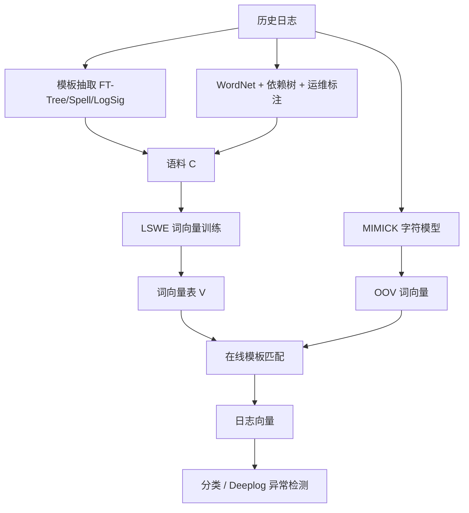
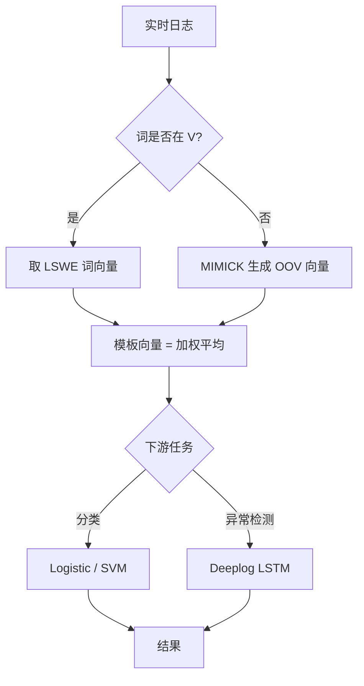

# Log2Vec: 一种面向在线日志分析的语义感知表示框架（ICCCN 2020）

> 作者：Weibin Meng, Ying Liu, Yuheng Huang, Shenglin Zhang, Federico Zaiter, Bingjin Chen, Dan Pei  
> 机构：清华大学计算机科学与技术系、清华大学网络科学与网络空间研究院、北京邮电大学计算机学院、南开大学软件学院、中山大学数据与计算机科学学院、BNRist  
> 发表年份：2020  
> 会议/期刊：IEEE ICCCN 2020 (International Conference on Computer Communications and Networks)  
> 关联 PDF：同目录下 `Log2Vec-icccn20.pdf`

## 一、文档信息速览

| 字段 | 值 |
|---|---|
| 标题 | Log2Vec: A Semantic-aware Representation Framework for Online Log Analysis |
| 作者 | Weibin Meng, Ying Liu, Yuheng Huang, Shenglin Zhang, Federico Zaiter, Bingjin Chen, Dan Pei |
| 机构 | Tsinghua University; BUPT; Nankai University; Sun Yat-sen University |
| 发表年份 | 2020 |
| 会议/期刊 | IEEE ICCCN 2020 |
| 分类 | 日志解析 / 日志表示 / AIOps |
| 核心问题 | 现有日志表示方法不能准确捕捉日志的领域语义，且无法处理运行时出现的新词（OOV 词） |
| 主要贡献 | LSWE 词向量学习；OOV 词处理器；面向在线日志分类与异常检测的统一表示框架；开源工具包 |

## 二、背景（Background）

日志是大型服务运行时最重要的一手数据。论文里举例，一个大型服务每小时可产生 50 GB（1.2~2 亿行）日志，运维需要日志进行异常检测、事件理解、故障预测。几乎所有日志分析的下游任务（分类、聚类、异常检测、关联分析）都依赖"结构化"输入：要么是模板索引，要么是向量。问题在于日志的"模板抽取"会丢信息（仅用模板索引无法表达模板之间的关系），而"传统 word2vec"在日志场景中会失败——因为"down"和"up"语境相似却是反义词。

更棘手的是"在线"二字：服务软件经常升级（增删新特性、修 bug、提性能），升级会让日志模板长出新词（论文中举例 `Vlan-interface` 这种 OOV 词），现有方法都是离线训练好的，无法在运行时给这些 OOV 词生成嵌入向量。论文在四个公开日志数据集上做了一次测量（Fig. 5 / Fig. 2）：训练集只占 10% 时，测试集中超过 70% 的日志包含 OOV 词；即使训练集占到 90%，Windows 和 HDFS 仍有超过 90% 的测试日志里含 OOV 词。这意味着仅靠离线词表注定是失败的方法。

## 三、目的（Purpose / Problems Solved）

- **痛点 1 → 方案 1**：传统词向量（word2vec）只能学到"上下文相似"，无法区分同/反义词 → 提出 LSWE（Log-Specific Word Embedding）将同义词、反义词、关系三元组融入 CBOW 目标函数。
- **痛点 2 → 方案 2**：日志模板在升级时出现 OOV 词，传统方法必须重训整个词表 → 引入 MIMICK 拼写模型，在线为 OOV 词生成嵌入。
- **痛点 3 → 方案 3**：现有日志表示丢掉语义，导致下游分类和异常检测误报多 → 把 LSWE 嵌入接到两个下游任务 Deeplog 和分类上做端到端验证。
- **痛点 4 → 方案 4**：缺乏可复现的日志表示工具 → 开源 Log2Vec Python 工具包。

## 四、核心原理（Principles）

Log2Vec 把"将日志变成向量"这件事拆成离线和在线两个阶段。离线阶段，先用从 WordNet 和依赖树得到的同义词集、反义词集、关系三元组训练 LSWE，让同义词在向量空间里靠近、反义词推远，同时让关系三元组 `(h, r, t)` 满足 `h + r ≈ t`（TransE 思想）。在线阶段，对于历史词直接取 LSWE 词向量；对于 OOV 词，把它的拼写当输入喂给 MIMICK 子网络，让它"猜"出一个 300 维向量。最后日志向量是它所有词向量的加权平均。

LSWE 的总目标函数是把三部分加起来：

$$ L_{lswe} = \sum_{k=1}^{|C|} \log p(w_i \mid w_{i-c}^{i+c}) + \gamma \sum_{r \in R_{w_i}} \log p(w_i \mid h+r) + \beta \Big( \sum_{u \in SYN_{w_i}} \log p(w_i \mid u) - \sum_{u \in ANT_{w_i}} \log p(w_i \mid u) \Big) $$

第一项是 CBOW 的 Skip-gram-like 上下文预测（保证分布假设）；第二项借 SWE 的 TransE 思想用关系三元组把关系信息灌进向量；第三项对应 LWE，让同/反义词在欧氏空间里被相应推/拉。`γ` 和 `β` 是两个权重超参。

OOV 处理器 MIMICK 把词嵌入当成"由拼写生成的样本"：先用一个双向 LSTM 在历史词上学习"字符→嵌入"函数 f: L → R^d，新词到来时直接用 f 生成嵌入；论文验证 99.8% 的 Windows 改词日志与原日志余弦相似度 > 0.9。

## 五、算法详解（Algorithm）

**输入**：原始日志流 L = {l1, l2, …}；可选同义词词典、关系三元组、WordNet 反义词集。  
**输出**：每条日志的向量表示 v(l)。

1. 离线
   1. 模板抽取：FT-Tree / Spell / LogSig 任一方法得到模板集 T。
   2. 构造同/反义词集和三元组，构建 (SYN, ANT, R)。
   3. 在 C 个模板构成语料上训练 LSWE。
   4. 在历史词表 V 上训练 MIMICK 模型。
2. 在线
   1. 对实时日志，先做模板匹配得到模板字符串。
   2. 对模板里的词 w：
      - 若 w ∈ V，直接取 LSWE 词向量。
      - 否则，用 MIMICK 预测向量。
   3. 模板向量 = 加权平均（或拼接）所有词向量。
   4. 把模板向量序列送入下游分类器 / Deeplog。

**关键数学**：见上一节 LSWE 目标。  
**复杂度**：LSWE 训练 ≈ word2vec 训练，但额外加上反/同义词正负采样；MIMICK 推理是 O(|w|) 的字符 LSTM 一次前向。  
**训练与推理**：训练 loss 由三个负对数概率加权组成；推理时直接做 weighted average，零成本。

## 六、系统架构图（Architecture）

## 七、流程图（Process Flow）

## 八、关键创新点（Key Innovations）

- **+ LSWE 联合目标**：把"反义词推远"和"三元组关系对齐"同时塞进 word2vec 训练目标。
- **+ 端到端 OOV 处理器**：用字符级 RNN（MIMICK）现场给新词生成嵌入，免去重训。
- **+ 在线-离线两阶段框架**：首次把"OOV 词处理"显式列为在线步骤的工程实践。
- **+ 公开四个数据集测量**：定量给出 OOV 词占比曲线（Fig. 2/5），为后续研究提供 benchmark。
- **+ 工业级工具包**：Python 3.6 实现并开源（github.com/WeibinMeng/Log2Vec）。

## 九、实验与结果（Experiments）

**数据集**：Spark log（3323 万行）、HDFS log（1117 万行）、Windows log（1.14 亿行）、Hadoop log（39.4 万行），外加 BGL 异常标注集（用于异常检测）。  
**Baseline**：日志分类任务对比 LogSig、FT-tree、Spell、Template2Vec；异常检测任务对比 Deeplog。  
**主要指标**：分类 F-score、异常检测 Precision/Recall/F-score。  
**关键结果数字**：
- 日志分类：Log2Vec 平均 F-score 0.944，四个 baseline 平均 0.745。
- 异常检测（BGL）：Deeplog 单独 Precision 0.898 → Deeplog + Log2Vec 提升到 0.941；F-score 0.930 → 0.939。
- OOV 鲁棒性：99.8% Windows 改词日志与原日志余弦相似度 > 0.9；平均相似度 0.964~0.996。
**消融**：LSWE 中反义词项关闭后，分类性能明显下降。  
**效率**：Linux 服务器（Intel Xeon 2.40 GHz）单次训练 + OOV 处理秒级。

## 十、应用场景（Use Cases）

- 在线日志异常检测（Deeplog + Log2Vec）。
- 日志在线聚类 / 模板匹配。
- 云服务 / IDC 故障告警的语义去重与合并。
- 安全审计：通过语义相似度检测异常的"伪装"日志模板。
- 多源异构日志归一化（不同供应商设备的同类日志）。

## 十一、相关论文（Related Papers in this set）

- 同组的 `LogAnomaly` 直接依赖 template2Vec，是 Log2Vec 的下游延伸。
- 同组的 `label-less-v3` 也涉及日志/KPI 异常标注。
- `pch-infocom2017` 关注日志聚类。

## 十二、术语表（Glossary）

- **OOV word**：Out-Of-Vocabulary 词，训练时未出现、运行时新冒出的词。
- **LSWE**：Log-Specific Word Embedding，论文提出的融合反/同义词与关系三元组的词向量训练目标。
- **MIMICK**：基于字符 RNN 的 OOV 嵌入生成方法（Pinter et al., EMNLP 2017）。
- **LWE / SWE**：分别是 Lexical / Semantic Word Embedding，LSWE 的两个组件。
- **TransE**：知识图谱嵌入方法，约束 `h + r ≈ t`。
- **Template2Vec**：Template2Vec（IJCAI 2019）把 word2vec 应用到日志模板上。

## 十三、参考与延伸阅读

- DeepLog (CCS 2017) — 序列日志异常检测基线。
- Template2Vec (IJCAI 2019) — 日志模板向量化的早期工作。
- MIMICK (EMNLP 2017) — 字符级 OOV 词嵌入。
- LogAnomaly (IJCAI 2019) — 同组同作者的 Log2Vec 后续工作。
- 开源实现：https://github.com/WeibinMeng/Log2Vec
