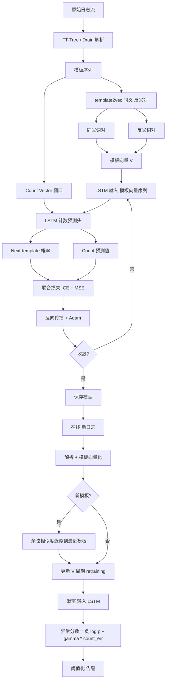
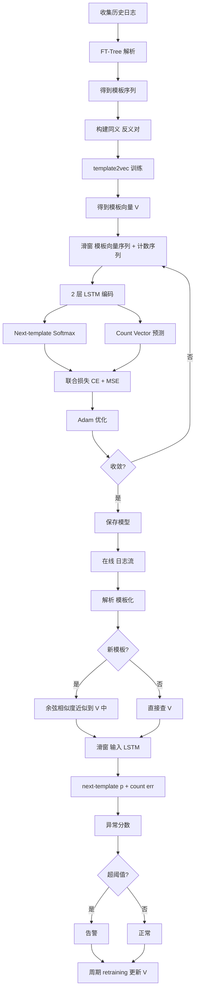

# LogAnomaly: Unsupervised Detection of Sequential and Quantitative Anomalies in Unstructured Logs（IJCAI 2019）

> 作者：Weibin Meng、Ying Liu、Yichen Zhu、Shenglin Zhang（通讯）、Dan Pei、Yuqing Liu、Yihao Chen、Ruizhi Zhang、Shimin Tao、Pei Sun、Rong Zhou
> 机构：清华大学；多伦多大学；南开大学；华为；BNRist
> 发表年份：2019
> 会议/期刊：IJCAI 2019
> 关联 PDF：同目录下 `LogAnomaly.pdf`

## 一、文档信息速览

| 字段 | 值 |
|---|---|
| 标题 | LogAnomaly: Unsupervised Detection of Sequential and Quantitative Anomalies in Unstructured Logs |
| 作者 | Weibin Meng、Ying Liu、Yichen Zhu、Shenglin Zhang、Dan Pei、Yuqing Liu、Yihao Chen、Ruizhi Zhang、Shimin Tao、Pei Sun、Rong Zhou |
| 机构 | 清华大学；多伦多大学；南开大学；华为；BNRist |
| 发表年份 | 2019 |
| 会议/期刊 | IJCAI 2019 |
| 分类 | 日志异常检测 / 无监督 / 序列 + 定量 / LSTM / template2vec |
| 核心问题 | 现有日志异常检测方法用模板 index 而非语义，导致 false alarms；并且不能同时检测顺序异常（sequential）与定量异常（quantitative） |
| 主要贡献 | (1) template2vec：基于同义词 / 反义词表把模板映射为语义向量；(2) 同时检测顺序 + 定量两类异常；(3) 对周期性 retraining 期间出现的新模板有近似 + 融合策略；(4) 在 HDFS + BGL 上 F1 分别 0.95 / 0.96 |

## 二、背景（Background）

大型互联网服务通常用日志（log）记录系统运行时状态，每条日志由"模板（template）+ 参数（variable）"组成：模板是固定字符串，参数是与运行时状态相关的变量（如接口号、IP、计数器）。日志是异常检测的"金矿"：流量异常、服务降级、硬件故障等都会在日志序列中留下痕迹。

现有自动日志异常检测方法可分为两类：
1. **基于计数 / 聚类**：PCA、Invariant Mining、LogClustering 等。把日志转为 event count vector，再用 PCA 或不变量挖掘检测"线性关系"破坏。
2. **基于深度学习**：DeepLog 用 LSTM 建模日志模板 index 序列的 next-event 概率。

这些方法的共同问题：**只用模板 index，丢失语义**。图 1 真实例子：网络交换机 8 条日志展示两个完全相同的正常 link flap 事件（`IFNET/2/linkDown_active` + `LACP/4/LACP_STATE_DOWN` + `DEVM/3/LocalFaultAlarm_clear` + `IFNET/2/linkDown_clear`）。基于关键词 "down" 的方法会触发 false alarm（误以为 down 是异常）；基于模板 index 的方法在第二次出现时（L5-L8）由于模板 index 略有不同也会判错。

论文把日志异常分为两类：
- **Sequential Anomaly（顺序异常）**：日志序列的次序违背了正常执行流。例如本应 L1→L2→L3→L4，但出现 L1→L3。
- **Quantitative Anomaly（定量异常）**：多条日志之间应满足的"线性 / 数量关系"被破坏，例如关闭文件必须对应打开文件、链路 down 必须对应 up。

LogAnomaly 第一个同时检测两类异常。核心创新是 **template2vec**：基于同义词 / 反义词表，把 log template 映射为语义向量，再用 2 层 LSTM 学习模板序列的正常模式。新出现的 log template 用语义相似度近似匹配到最近的旧模板，从而**减少周期性 retraining 之间新模板导致的 false alarm**。

## 三、目的（Problems Solved）

- **模板 index 丢失语义**：同义但不同 index 的模板被误判为异常。
- **顺序 + 定量两类异常分家**：现有方法只处理其中一种。
- **retraining 之间的新模板**：周期性训练之间出现的新模板触发 false alarm。
- **无监督**：工业日志极少标签。
- **告警风暴**：误报过多，运维负担重。

## 四、核心原理（Principles）

**系统总览**：LogAnomaly 离线阶段 (1) 用 FT-Tree / Drain 等工具把日志解析为模板；(2) 用 template2vec（基于同义词 / 反义词表 + Word2Vec 风格训练）把模板映射为 d 维向量；(3) 用 2 层 LSTM 学习模板序列 + 计数序列的正常模式。在线阶段把实时日志转成模板序列，喂入 LSTM，next-event 概率或 counter 关系异常即报警。新模板用语义相似度近似 + 与最近模板融合。

**关键概念**：

- **Log Template**：日志模板（去除参数后的固定字符串）。
- **Log Parameter**：日志参数（变量值）。
- **Sequential Anomaly**：顺序异常。
- **Quantitative Anomaly**：定量异常。
- **template2vec**：把模板映射为语义向量。
- **Synonyms / Antonyms**：同义词 / 反义词表（Table 1）。
- **LSTM**：Long Short-Term Memory。
- **FT-Tree / Drain**：日志模板解析工具。
- **Log Count Vector**：计数向量（每个模板出现次数）。
- **HDFS / BGL**：两个公开日志数据集。

**数学原理**：

- **Log Count Vector**（定量特征）：

$$
c_t = [c_{t,1}, c_{t,2}, ..., c_{t,K}] \in \mathbb{R}^K
$$

其中 $c_{t,k}$ 是窗口 $t$ 内第 $k$ 个模板的出现次数。

- **template2vec**（语义向量）：

论文预先定义同义词 / 反义词对（Table 1），通过优化如下目标学习每个模板的 d 维向量：

$$
\mathcal{L} = \sum_{(t_i, t_j) \in \text{syn}} \log \sigma(\vec{t}_i \cdot \vec{t}_j) + \sum_{(t_i, t_j) \in \text{ant}} \log \sigma(-\vec{t}_i \cdot \vec{t}_j)
$$

其中 $\sigma$ 是 sigmoid。同义模板向量相似，反义模板向量远离。

- **LSTM 模板序列建模**（顺序特征）：

$$
h_t = \text{LSTM}(\vec{t}_{t-w}, ..., \vec{t}_{t-1}, h_{t-1})
$$

$$
p(t_t = k \mid t_{<t}) = \text{softmax}(W_o h_t + b_o)_k
$$

- **LSTM 计数序列建模**（定量特征）：

$$
\hat{c}_t = W_c h_t + b_c,\quad \text{loss} = \|c_t - \hat{c}_t\|_2^2
$$

- **总损失**（联合训练）：

$$
\mathcal{L} = \alpha \cdot \text{CrossEntropy}(t_t, p) + \beta \cdot \|c_t - \hat{c}_t\|_2^2
$$

- **异常分数**（next-template 概率 + 计数误差）：

$$
s_t = -\log p(t_t \mid t_{<t}) + \gamma \cdot \|c_t - \hat{c}_t\|_2
$$

- **新模板近似**：

$$
t_{\text{new}} \approx t_{\text{nearest}} = \arg\max_{t} \cos(\vec{t}_{\text{new}}, \vec{t})
$$

**与现有方法的差异**：与 PCA、LogCluster、IM 相比，LogAnomaly 用 LSTM 而非线性模型；与 DeepLog 相比，LogAnomaly 用 template2vec 而非 index；与 PCA+DeepLog 组合相比，LogAnomaly 端到端联合训练。

## 五、算法详解（Algorithm）

1. **输入 / 输出**：
   - 输入：原始日志流。
   - 输出：每条 / 每个窗口的异常分数 / 标签。

2. **核心模块**：
   - **日志解析**（FT-Tree / Drain）：把每条日志转为 (template_id, params)。
   - **template2vec 训练**：用同义词 / 反义词对学习每个模板的 d 维向量。
   - **LSTM 模板序列训练**：用窗口化的模板向量序列训练 next-template LSTM。
   - **LSTM 计数序列训练**：把每个窗口的 count vector 作为另一路输入联合训练。
   - **新模板近似**：周期 retraining 之间，把新模板向量与现有模板做余弦相似度匹配，融合到最近的旧模板。
   - **在线异常检测**：next-template 概率 + 计数误差 → 异常分数。

3. **伪代码**：

```python
def parse_logs(log_lines):
    """FT-Tree / Drain: 把每条日志转为 (template_id, params)。"""
    templates = []
    for line in log_lines:
        template_id, params = ft_tree.parse(line)
        templates.append(template_id)
    return templates

def template2vec(template_pairs_syn, template_pairs_ant, d=128, epochs=50):
    """基于同义 / 反义对学习模板向量。"""
    V = {t: np.random.randn(d) for t in all_templates()}
    for ep in range(epochs):
        for (ti, tj) in template_pairs_syn:
            dot = V[ti] @ V[tj]
            grad = sigmoid(-dot) * (1 - sigmoid(-dot))
            V[ti] += lr * grad * V[tj]
            V[tj] += lr * grad * V[ti]
        for (ti, tj) in template_pairs_ant:
            dot = V[ti] @ V[tj]
            grad = -sigmoid(dot) * (1 - sigmoid(dot))
            V[ti] += lr * grad * V[tj]
            V[tj] += lr * grad * V[ti]
    return V

def build_dataset(template_ids, count_window=20, step=1):
    """构造训练样本 (X, y_template, y_count)。"""
    X, y_t, y_c = [], [], []
    for i in range(0, len(template_ids) - count_window, step):
        window = template_ids[i:i+count_window]
        cnt = np.bincount(window, minlength=K)
        X.append([V[t] for t in window])
        y_t.append(template_ids[i+count_window])
        y_c.append(cnt)
    return X, y_t, y_c

class LogAnomalyLSTM(nn.Module):
    def __init__(self, d_vocab=128, d_hid=128, n_templates=K):
        super().__init__()
        self.lstm = nn.LSTM(d_vocab, d_hid, num_layers=2, batch_first=True)
        self.fc_template = nn.Linear(d_hid, n_templates)
        self.fc_count = nn.Linear(d_hid, n_templates)

    def forward(self, X):
        h, _ = self.lstm(X)
        last = h[:, -1, :]
        return self.fc_template(last), self.fc_count(last)

def train_loganomaly(X, y_t, y_c, epochs=10, alpha=1.0, beta=0.1):
    model = LogAnomalyLSTM()
    opt = torch.optim.Adam(model.parameters(), lr=1e-3)
    for ep in range(epochs):
        for batch_x, batch_t, batch_c in dataloader(X, y_t, y_c):
            logits, cnt_pred = model(batch_x)
            loss_t = F.cross_entropy(logits, batch_t)
            loss_c = F.mse_loss(cnt_pred, batch_c)
            loss = alpha * loss_t + beta * loss_c
            opt.zero_grad(); loss.backward(); opt.step()
    return model

def approximate_new_template(t_new, V):
    """把新模板近似到最近的旧模板。"""
    best_t, best_sim = None, -1
    for t, v in V.items():
        sim = np.dot(t_new, v) / (np.linalg.norm(t_new) * np.linalg.norm(v) + 1e-9)
        if sim > best_sim:
            best_sim, best_t = sim, t
    return best_t, best_sim

def anomaly_score(model, X, gamma=1.0):
    logits, cnt_pred = model(X)
    p = F.softmax(logits, dim=-1)
    t_logp = -torch.log(p.gather(1, t_true.unsqueeze(1)).squeeze(1) + 1e-9)
    c_err = (cnt_pred - c_true).norm(dim=-1)
    return t_logp + gamma * c_err
```

4. **关键数学**：见 §四。

5. **复杂度分析**：
   - 模板解析：$O(N)$；
   - template2vec：$O(|S| \cdot d \cdot \text{epochs})$，$|S|$ 是同义 / 反义对数；
   - LSTM 训练：$O(T \cdot d_hid \cdot L)$ per batch；
   - 在线推理：$O(w \cdot d_hid \cdot L)$ per window。

6. **训练与推理**：
   - 训练：解析 → template2vec → LSTM 模板序列 + 计数序列；
   - 推理：在线解析 → template2vec → 滑窗 → LSTM → 异常分数。

7. **示例**：HDFS 数据集 11,175,629 条日志，575,061 blocks，16,838 异常 blocks。LogAnomaly 在 block 级别检测 F1 0.95；BGL 数据集 4,747,963 条日志，348,460 异常，F1 0.96。

## 六、系统架构图（Architecture）



## 七、流程图（Process Flow）



## 八、关键创新点（Key Innovations）

- **+ template2vec**：基于同义 / 反义表把模板映射为语义向量，避免 index 引起的 false alarm。
- **+ 同时检测顺序 + 定量两类异常**：LSTM 联合训练 next-template + count vector。
- **+ 新模板余弦近似**：减少 retraining 周期间新模板触发的 false alarm。
- **+ 无监督训练**：不需异常标签。
- **+ 公开数据集验证**：HDFS F1 0.95、BGL F1 0.96。

## 九、实验与结果（Experiments）

- **数据集**：
  - **HDFS**（Xu et al., 2009）：38.7 小时，11,175,629 条日志，575,061 blocks，16,838 异常 blocks（Hadoop 专家标注）。
  - **BGL**（Oliner & Stearley, 2007）：7 个月，4,747,963 条日志，348,460 异常日志。
- **Baseline**：PCA（Xu et al., 2009）、LogCluster（Lin et al., 2016）、Invariant Mining / IM（Lou et al., 2010）、DeepLog（Du et al., 2017）。
- **主要指标**：Precision、Recall、F1。
- **关键结果数字**：
  - **BGL**：LogAnomaly F1 平均 **0.96**；IM 召回 0.99 但 precision 比 LogAnomaly 低 0.14，触发 5.67× 误报；DeepLog 召回 0.96，precision 比 LogAnomaly 低 0.07，触发 3.33× 误报。
  - **HDFS**：LogAnomaly F1 平均 **0.95**。
  - PCA / LogCluster 在两个数据集 F1 ≤ 0.80。
  - 误报数 = 10^7 logs × (1 - precision) × anomaly_rate，LogAnomaly 大幅减少。
- **消融实验**：
  - LogAnomaly w/o template vector：损失顺序模式，F1 下降；
  - LogAnomaly w/o count vector：损失定量模式，F1 下降；
  - 两者结合最优。
- **效率**：单 GPU / 64G 内存服务器上训练数小时；在线推理毫秒级。
- **可视化**：Figure 6 BGL / Figure 7 HDFS 上各方法 accuracy 对比；新模板近似效果。

## 十、应用场景（Use Cases）

- **分布式文件系统（HDFS、Ceph、GlusterFS）日志异常检测**。
- **高性能计算 / 超算中心（BGL）日志异常检测**。
- **电信 / 交换机日志异常检测**（论文图 1 例子）。
- **云数据库 / 中间件异常检测**。
- **业务系统日志异常检测**：订单、支付、用户行为日志。

## 十一、相关论文（Related Papers in this set）

- `TraceSieve_ISSRE23`（追踪异常检测 / 微服务）
- `liu_imc15_Opprentice`（KPI 异常检测 / 无监督）
- `label-less-v3`（日志异常检测 / 无监督）
- `FluxInfer`（指标异常检测 + 解释）
- `OmniAnomaly_camera-ready`（多变量时序异常检测）
- `08723601`（KPI 周期自适应）
- `chenwenxiao_infocom2019`（多源指标故障定位）
- `www2018`（基于 KPI 的 AIOps / 异常检测）

## 十二、术语表（Glossary）

- **Log Template**：日志模板。
- **Log Parameter**：日志参数。
- **template2vec**：把模板映射为语义向量。
- **Synonyms / Antonyms**：同义词 / 反义词。
- **Sequential Anomaly**：顺序异常。
- **Quantitative Anomaly**：定量异常。
- **LSTM**：Long Short-Term Memory。
- **FT-Tree / Drain**：日志模板解析工具。
- **Count Vector**：模板出现次数向量。
- **PCA / LogCluster / IM / DeepLog**：日志异常检测 baseline。
- **HDFS / BGL**：公开日志数据集。
- **Sigmoid**：sigmoid 函数。
- **Cosine Similarity**：余弦相似度。
- **Word2Vec**：词向量训练方法。
- **IJCAI**：International Joint Conference on Artificial Intelligence。

## 十三、参考与延伸阅读

- Paper: DeepLog, *DeepLog: Anomaly Detection and Diagnosis from System Logs through Deep Learning*（Du et al., CCS 2017）。
- Paper: PCA, *Detecting Large-Scale System Problems by Mining Console Logs*（Xu et al., SOSP 2009）。
- Paper: IM, *Mining Invariants from Console Logs for System Problem Detection*（Lou et al., USENIX ATC 2010）。
- Paper: LogCluster, *Log Clustering Based Problem Identification for Online Service Systems*（Lin et al., KDD 2016）。
- Paper: Word2Vec, *Efficient Estimation of Word Representations in Vector Space*（Mikolov et al., 2013）。
- 工具：FT-Tree、Drain、Keras、PyTorch。
- 数据集：HDFS（Loghub）、BGL（Loghub）。
- 相关论文：`TraceSieve_ISSRE23`、`liu_imc15_Opprentice`、`label-less-v3`、`FluxInfer`、`OmniAnomaly_camera-ready`、`08723601`、`chenwenxiao_infocom2019`、`www2018`。
