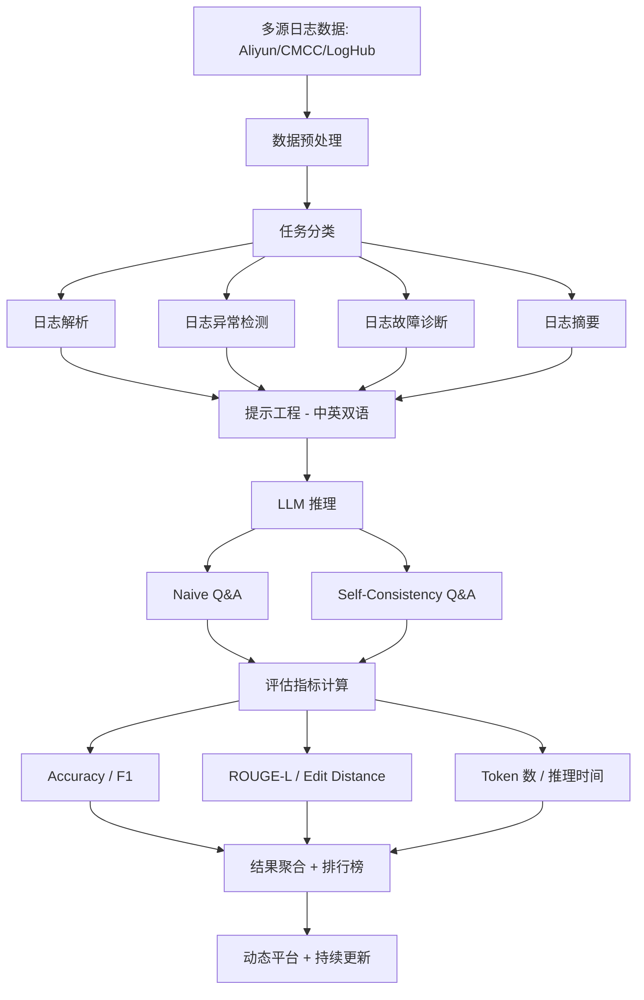
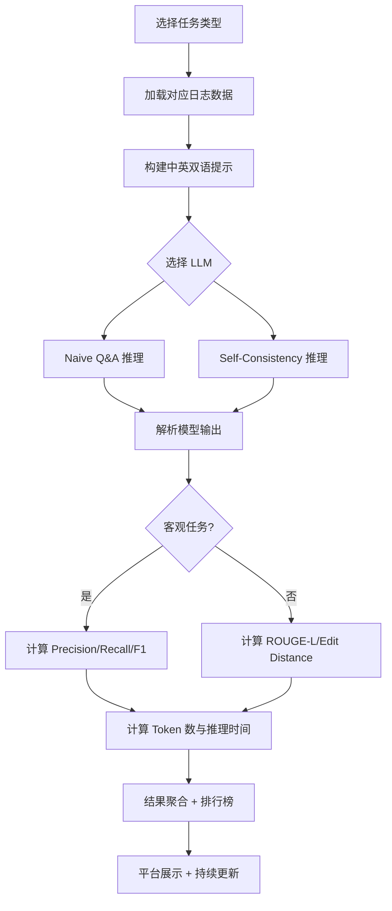

# LogEval: A Comprehensive Benchmark Suite for LLMs in Log Analysis（ESE 2025）

> 作者：Tianyu Cui, Shiyu Ma, Ziang Chen, Tong Xiao, Chenyu Zhao, Shimin Tao, Yilun Liu, Shenglin Zhang, Duoming Lin, Changchang Liu, Yuzhe Cai, Weibin Meng, Yongqian Sun, Dan Pei
> 机构：南开大学、清华大学、华为
> 发表年份：2025
> 会议/期刊：Empirical Software Engineering (CCF B)
> 关联 PDF：同目录下 `LogEval.pdf`

## 一、文档信息速览

| 字段 | 值 |
|---|---|
| 标题 | LogEval: A Comprehensive Benchmark Suite for LLMs in Log Analysis |
| 作者 | Tianyu Cui, Shiyu Ma, Ziang Chen, Tong Xiao, Chenyu Zhao, Shimin Tao, Yilun Liu, Shenglin Zhang, Duoming Lin, Changchang Liu, Yuzhe Cai, Weibin Meng, Yongqian Sun, Dan Pei |
| 机构 | Nankai University, Tsinghua University, Huawei |
| 发表年份 | 2025 |
| 会议/期刊 | Empirical Software Engineering (CCF B) |
| 分类 | 评测 / LLM 评估 / 日志分析 |
| 核心问题 | 缺乏对 LLM 在日志分析任务上系统全面的评估基准与平台 |
| 主要贡献 | 1) 首个 LLM 日志分析综合基准；2) 4000 条公开日志 + 中英双语提示；3) 动态更新的开源平台 |

## 二、背景（Background）

随着信息技术快速发展，软件系统已成为企业运营的支柱。这些系统每天产生海量日志数据，记录操作行为、状态变化和潜在故障。随着系统规模和复杂度的提升，手工日志分析变得越来越困难、容易出错、效率低下，不仅耗时，还常常导致对关键系统故障的响应延迟。因此，业界急需能快速提供洞见的自动化日志分析工具。

自动日志分析主要有四类核心任务：（1）日志解析（Log Parsing）；（2）日志异常检测（Log Anomaly Detection）；（3）日志故障诊断（Log Fault Diagnosis）；（4）日志摘要（Log Summarization）。近年来，深度学习方法被广泛应用于这些任务中，相较传统机器学习，能更有效处理大规模复杂日志数据，端到端自动提取特征，规避了手工特征工程与基于固定规则的约束。

但深度学习方法也面临挑战：预训练语言模型（PLM）需要大量算力与数据进行预训练和微调；难以处理领域特定术语（如日志中常见的缩写）；同类日志事件可能语义不同，不同日志事件可能共享相似词汇；不同系统的日志差异大，DL 模型需要频繁重训或微调。

随着 LLM 在 NLP 任务上展现强大能力（GPT-4、LLaMA-2、ChatGLM-4、Qwen-1.5 等），研究者开始探索其在日志分析任务上的应用。然而，LLM 的架构、规模、适用性差异大，如何选择最适合的 LLM 成为了研究者和开发者的难题。当前缺乏系统化、标准化的日志分析 LLM 评估基准与工具，这严重阻碍了 LLM 在日志分析中的有效应用。

## 三、目的（Purpose / Problems Solved）

- **缺乏系统化评估标准**：当前没有综合、系统的评估标准或工具包帮助研究者和开发者理解、比较不同 LLM 在各类日志分析任务上的表现。
- **基准数据不统一**：日志分析任务多样、架构各异、数据分散，难以做科学公平的对比。
- **提示工程差异**：不同提示风格导致评估结果不一致，需要统一的标准提示。
- **可重复性问题**：闭源与开源 LLM 在不同时间可能变化，需要持续可复现的基准。
- **缺乏动态更新平台**：现有静态基准无法跟上 LLM 与日志场景的快速演进。

## 四、核心原理（Principles）

LogEval 是一个综合性的 LLM 日志分析评估基准，整体方案涵盖四类核心任务、标准化中英双语提示、多种实验范式、动态平台与开源生态。

**关键概念定义**：
- **日志解析（Log Parsing）**：将非结构化日志转换为结构化模板（如 "Interface <*> changed state to <*>"）
- **日志异常检测（Log Anomaly Detection）**：识别日志中偏离正常模式的异常条目
- **日志故障诊断（Log Fault Diagnosis）**：通过分析日志相关性定位故障根因
- **日志摘要（Log Summarization）**：将大量日志压缩为可解释的简短摘要

**评估指标**：
- 解析准确率（Parsing Accuracy）：完全匹配预定义模板的日志比例
- 编辑距离（Edit Distance）：将生成输出转换为参考所需的字符级操作数
- 精确率（Precision）：TP / (TP + FP)
- 召回率（Recall）：TP / (TP + FN)
- F1 分数：2 × P × R / (P + R)
- ROUGE-L F1：基于最长公共子序列的摘要相似度
- 阈值准确率（Threshold Accuracy）：ROUGE-L ≥ θ 的比例
- 平均 token 数与推理时间：衡量 LLM 效率

**数学公式**：
- 解析准确率：
$$\text{Accuracy} = \frac{\text{Correctly Parsed Entries}}{\text{Total Entries}} \times 100\%$$
- 编辑距离：
$$\text{Edit Distance} = I + D + S$$
其中 I 为插入，D 为删除，S 为替换
- 精确率、召回率、F1 分数：
$$\text{Precision} = \frac{TP}{TP + FP}, \quad \text{Recall} = \frac{TP}{TP + FN}, \quad F1 = \frac{2 \times P \times R}{P + R}$$
- ROUGE-L：
$$\text{Recall}_{ROUGE-L} = \frac{|LCS(S, R)|}{|R|}, \quad F1 = \frac{2 \times R \times P_{LCS}}{R + P_{LCS}}$$

**与现有技术的差异**：
- 不同于 HELM、BIG-bench 等通用 NLP 评估基准，LogEval 专注日志分析领域
- 不同于 FinEval、MultiMedQA 等单领域基准，LogEval 覆盖日志分析四类核心任务
- 不同于 NetOps 等网络运维基准，LogEval 专注于日志处理全链路

## 五、算法详解（Algorithm）

### 1. 输入 / 输出
- **输入**：原始日志数据集、待评估 LLM
- **输出**：四类任务在多提示、多 LLM 下的准确率、F1、效率等指标

### 2. 核心模块
- 数据收集与预处理（Aliyun、CMCC、LogHub 等多源数据）
- 任务形式化（4 类任务，每类 15 个不同提示）
- 双语提示设计（中文 + 英文）
- LLM 推理（Naive Q&A、Self-Consistency Q&A）
- 评估指标计算（Accuracy、F1、ROUGE-L、Edit Distance、token 数、推理时间）
- 动态平台（持续集成新 LLM 与用户上传生产数据）

### 3. 伪代码

```python
def LogEval(log_dataset, llm, task, prompt_set, eval_mode):
    results = []
    for prompt in prompt_set:
        # 阶段1: 任务形式化
        formatted_prompt = format_prompt(task, prompt, log_dataset)

        # 阶段2: LLM 推理
        if eval_mode == "naive":
            answer = llm.invoke(formatted_prompt)
        elif eval_mode == "self_consistency":
            answers = [llm.invoke(formatted_prompt) for _ in range(5)]
            answer = majority_vote(answers)

        # 阶段3: 评估
        if task in ["Parsing", "Summary"]:
            score = (accuracy_score(answer, gt),
                     edit_distance(answer, gt),
                     rouge_l_f1(answer, gt))
        else:  # Detection, Diagnosis
            score = (precision(answer, gt),
                     recall(answer, gt),
                     f1_score(answer, gt))
        results.append(score)

    # 阶段4: 效率分析
    token_count = count_tokens(answer)
    inference_time = measure_time(llm.invoke, formatted_prompt)

    return aggregate_results(results, token_count, inference_time)
```

### 4. 关键数学
- 自洽性（Self-Consistency）：多次采样的多数投票机制
- 阈值准确率：
$$\text{Threshold Accuracy} = \frac{\sum_{i=1}^n I(ROUGE-L_i \geq \theta)}{n} \times 100\%$$

### 5. 复杂度分析
- 主要瓶颈是 LLM 推理时间，特别是 Self-Consistency 需要 5 次调用

### 6. 训练与推理
LogEval 本身不训练模型，仅作为评估平台

## 六、系统架构图（Architecture）



## 七、流程图（Process Flow）



## 八、关键创新点（Key Innovations）

- **+ 综合四任务基准**：首次系统覆盖日志解析、异常检测、故障诊断、摘要四类核心任务的 LLM 评测基准。
- **+ 中英双语提示**：每类任务提供中英双语提示（共 15 个不同提示），最小化提示风格差异带来的评估偏差。
- **+ 双范式评估**：结合 Naive Q&A 与 Self-Consistency Q&A 两种推理策略，零样本与少样本（5-shot）设置，全面评估 LLM。
- **+ 动态开源平台**：持续集成新 LLM 与用户上传生产数据，提供可复现的长期评估。
- **+ 效率与质量联合评估**：除准确率外，引入平均 token 数与推理时间，评估 LLM 部署成本。

## 九、实验与结果（Experiments）

### 数据集
- 4000 条公开日志条目
- 数据来源：Aliyun（299,817 条服务器故障日志）、CMCC（482,515 条 OpenStack OVS 日志，6 类故障）、LogHub（多源开放日志）
- 故障类型：CPU 高温、内存泄漏、硬件崩溃、软件 bug、资源不足、进程异常重启

### Baseline（12 个 LLM）
GPT-4、GPT-3.5、Claude-3-Sonnet、Gemini-Pro、Mistral 7B、InternLM2-Chat 7B/20B、DevOps-Model-Chat 7B/14B、AquilaChat 7B、ChatGLM-4、LLaMA-2 7B/13B/70B、Qwen-1.5-Chat 7B/14B/72B、Baichuan2-Chat 13B

### 主要指标
准确率、F1、ROUGE-L、Edit Distance、token 数、推理时间

### 关键结果数字
- **Log Parsing**：GPT-4 与 Claude 3 Sonnet 在 zero-shot 与 few-shot 上均领先；GPT-4 few-shot 准确率最高（接近 0.89）
- **Log Anomaly Detection**：LLaMA2-70B 在 zero-shot 最佳；Mistral-7B 在 few-shot 显著提升（达到 0.63）
- **Log Fault Diagnosis**：zero-shot 各 LLM 差异小；few-shot GPT-4 显著提升至 0.91
- **Log Summary**：DevOps 系列在 zero-shot 与 few-shot 均表现好；Mistral-7B 与 Qwen1.5-72B few-shot 显著提升

### 消融实验
- 提示数量：每任务 15 个不同提示减少提示敏感度
- 推理策略：Self-Consistency 5 次投票显著降低随机性
- 样本数：zero-shot vs few-shot (5-shot) 评估上下文学习能力

### 效率分析
- Commercial LLM（GPT-4、Claude 3 Sonnet、Gemini Pro）在准确率上整体领先
- Open-source LLM（Mistral-7B、DevOps 系列、Qwen1.5-72B）在某些任务上接近或超越 Commercial LLM
- 推理时间与 token 数随任务复杂度变化

## 十、应用场景（Use Cases）

- **AIOps 平台**：选择最适合日志分析任务的 LLM
- **运维团队**：评估 LLM 在故障检测、定位中的实用性
- **LLM 开发者**：在日志分析领域对比模型改进效果
- **学术研究**：作为日志分析 LLM 评估的标准基准
- **企业自评**：上传生产日志测试私有 LLM 在真实场景下的能力

## 十一、相关论文（Related Papers in this set）

- **OpsEval**（FSE 2025）：IT 运维领域的 LLM 综合基准
- **OpenRCA**（ICLR 2025）：LLM 根因分析评估
- **TechSupportEval**（IJCNN 2025）：技术支撑 QA 评估
- **AIOpsArena**（SANER 2025）：AIOps 算法在线评测平台
- **FlowXpert**（KDD 2025）：LLM 驱动的故障处理工作流编排

## 十二、术语表（Glossary）

- **PLM（Pre-trained Language Model）**：预训练语言模型
- **LLM（Large Language Model）**：大语言模型
- **ICL（In-Context Learning）**：上下文学习
- **Self-Consistency**：自洽性，多次采样后多数投票
- **LCS（Longest Common Subsequence）**：最长公共子序列
- **ROUGE-L**：基于 LCS 的文本相似度指标
- **Edit Distance**：编辑距离
- **OpenStack OVS**：OpenStack 的 Open vSwitch 虚拟交换机

## 十三、参考与延伸阅读

- **HELM**（NeurIPS 2022）：42 个场景的 LLM 综合评估
- **BIG-bench**：LLM 通用任务基准
- **FinEval**：金融领域 LLM 评估
- **MultiMedQA**：医学领域 LLM 评估
- **NetOps**：网络运维 LLM 评估
- **OpsEval**（FSE 2025）：IT 运维 LLM 基准
- **LILAC**（ICLR 2024）：基于 LLM 的日志解析
- **LogParser-LLM**：LLM + 前缀树聚类日志解析
- **DivLog**：基于 LLM ICL 的无监督日志解析
- **代码与平台**：https://github.com/LinDuoming/LogEval，https://nkcs.iops.ai/LogEval/
