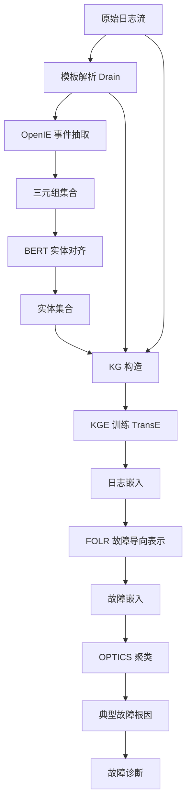
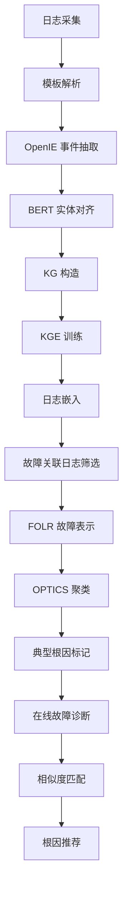

# LogKG: Log Failure Diagnosis through Knowledge Graph（IEEE TSC 2024）

> 作者：Yicheng Sui、Yuzhe Zhang、Jianjun Sun、Ting Xu、Shenglin Zhang、Zhengdan Li、Yongqian Sun、Fangrui Guo、Junyu Shen、Yuzhi Zhang、Dan Pei、Xiao Yang、Li Yu  
> 机构：南开大学；中国移动通信；Accumulus Technology；清华大学；海河实验室  
> 发表年份：2024  
> 会议/期刊：IEEE Transactions on Services Computing  
> 关联 PDF：同目录下 `LogKG.pdf`

## 一、文档信息速览

| 字段 | 值 |
|---|---|
| 标题 | LogKG: Log Failure Diagnosis through Knowledge Graph |
| 作者 | Yicheng Sui、Yuzhe Zhang、Jianjun Sun、Ting Xu、Shenglin Zhang、Zhengdan Li、Yongqian Sun、Fangrui Guo、Junyu Shen、Yuzhi Zhang、Dan Pei、Xiao Yang、Li Yu |
| 机构 | 南开大学；中国移动通信；Accumulus Technology；清华大学；海河实验室 |
| 发表年份 | 2024 |
| 会议/期刊 | IEEE TSC |
| 分类 | 日志故障诊断 / 知识图谱 / 多字段融合 |
| 核心问题 | 日志包含非结构化内容字段 + 结构化字段（timestamp、level、IP、component、task ID 等），现有日志诊断方法只关注内容字段，遗漏结构化信息 |
| 主要贡献 | (1) 通过开放信息抽取从日志模板构造事件（事件三元组）；(2) 基于 BERT 语义向量聚类的实体对齐方法；(3) 提出 FOLR 故障导向日志表示；(4) 在 CMCC ISP 真实日志数据 + 公开日志数据集上验证，发布故障案例数据集与源码 |

## 二、背景（Background）

日志是描述服务运行时状态的重要数据，日志驱动的故障诊断（如网络中断、软件 bug、硬件崩溃、配置错误）一直是 AIOps 的核心研究方向。日志通常是半结构化文本：含时间戳、级别、IP、组件、任务 ID 等结构化字段 + 一段开发者预设的非结构化"内容"（模板 + 参数）。在手动故障诊断中，工程师需要综合多字段信息才能定位根因——例如按 task ID + component + 语义内容筛选日志。

现有日志诊断方法（LogCluster、LogPAI、LogSy 等）大多只关注内容字段，把日志看成"模板序列"，丢失了结构化字段所携带的丰富关系。知识图谱（KG）技术已经在文本融合中显示其价值：实体抽取、实体对齐、关系抽取三步能融合结构化与非结构化信息。论文把 KG 引入日志诊断，提出 LogKG：(1) 从日志模板抽取事件三元组；(2) 用 BERT 语义向量聚类对齐实体；(3) 用 KG 嵌入（KGE）表示日志；(4) 用 OPTICS 聚类聚合历史故障并标记典型根因。

数据集来自中国移动通信（CMCC）的真实 ISP 故障日志（GAIA 数据集），论文同时发布故障案例数据集与源代码。

## 三、目的（Problems Solved）

- **多字段信息融合难**：把日志非结构化内容 + 结构化字段统一到 KG。
- **实体抽取**：用开放信息抽取从日志模板得到事件三元组（subject, predicate, object）。
- **实体对齐**：不同日志中的同义实体需要合并（BERT 语义向量 + 聚类）。
- **关系抽取**：日志与组件、模板、PID、Level、RequestID 等的关系。
- **故障表示**：FOLR（Failure-Oriented Log Representation）从 KG 嵌入得到故障向量。
- **故障聚类**：OPTICS 聚类聚合历史故障，标记典型根因。
- **公开数据集缺失**：发布 CMCC ISP 故障日志数据集与源码。

## 四、核心原理（Principles）

**系统总览**：LogKG 工作流为：(1) 日志解析（template extraction）；(2) 事件三元组抽取（OpenIE）；(3) 实体对齐（BERT 向量 + 聚类）；(4) KG 构造（节点=实体/模板/日志，边=关系）；(5) KG 嵌入（TransE/ComplEx 等 KGE）；(6) FOLR（故障导向日志表示）；(7) OPTICS 聚类 + 典型根因标记；(8) 故障诊断（相似度匹配）。

**关键概念**：

- **日志（Log）**：半结构化文本记录。
- **模板（Template）**：日志内容字段解析后的固定格式。
- **事件三元组（Triple）**：(subject, predicate, object)。
- **实体对齐（Entity Alignment）**：把同义实体合并。
- **KG（Knowledge Graph）**：知识图谱。
- **KGE（Knowledge Graph Embedding）**：知识图谱嵌入。
- **FOLR（Failure-Oriented Log Representation）**：故障导向日志表示。
- **OPTICS**：基于密度的层次聚类。
- **BERT 向量**：基于预训练 BERT 的语义表示。
- **OpenIE**：开放信息抽取。

**数学原理**：

- **TransE 嵌入**：

$$
\min \sum_{(h, r, t) \in \mathcal{T}} \max(0, d(h + r, t) - d(h' + r, t') + \gamma)
$$

其中 $(h, r, t)$ 是正样本三元组，$(h', r, t')$ 是负样本，$d$ 是距离函数。

- **BERT 语义向量**：

$$
v_e = \text{BERT}_{\text{CLS}}(e) \in \mathbb{R}^d
$$

- **聚类合并（OPTICS）**：

$$
\text{OPTICS}(V) = \{C_1, C_2, \ldots, C_K\}
$$

- **FOLR 构造**：对故障 $F$ 关联的日志集合 $L_F$，先用 KG 嵌入得到每条日志的向量 $v_l$，再聚合：

$$
v_F = \text{Aggregate}(\{v_l : l \in L_F\})
$$

聚合方式包括 mean、max、attention。

- **相似度匹配**：

$$
\text{sim}(v_F, v_F') = \frac{v_F \cdot v_F'}{\|v_F\| \|v_F'\|}
$$

**与现有技术的差异**：与"日志模板序列 + 机器学习"方法相比，LogKG 显式建模多字段关系；与"日志图"方法相比，LogKG 引入知识图谱嵌入与语义对齐；与"日志 + 告警"多模态方法相比，LogKG 聚焦日志本身。

## 五、算法详解（Algorithm）

1. **输入 / 输出**：
   - 输入：原始日志流。
   - 输出：故障根因（相似历史故障聚类中心）。

2. **核心模块**：
   - **日志解析**：Drain 等模板抽取。
   - **OpenIE 事件抽取**：从模板文本中抽取三元组。
   - **BERT 实体对齐**：用 BERT 编码实体，OPTICS 聚类合并。
   - **KG 构造**：节点 + 边。
   - **KGE 训练**：TransE/ComplEx 等。
   - **FOLR 计算**：故障关联日志的向量聚合。
   - **OPTICS 聚类**：聚合历史故障。
   - **根因诊断**：相似度匹配 + 人工标记。

3. **伪代码**：

```python
def logkg_pipeline(logs):
    # 1. 模板解析
    templates = drain_parse(logs)
    # 2. 事件抽取
    triples = openie_extract(templates)
    # 3. 实体对齐
    entities = bert_align(triples)
    # 4. KG 构造
    G = build_kg(entities, triples, structured_fields=logs.struct)
    # 5. KGE
    kge = transE_train(G, dim=128)
    # 6. 日志表示
    log_emb = {l: kge.encode(l) for l in logs}
    # 7. FOLR
    failure_emb = {F: aggregate([log_emb[l] for l in F.logs]) for F in failures}
    # 8. 聚类
    clusters = optics_cluster(list(failure_emb.values()))
    # 9. 根因标记
    typical_root_causes = {c: annotate_centroid(c) for c in clusters}
    return typical_root_causes
```

4. **关键数学**：见 §四。

5. **复杂度分析**：
   - 日志解析：$O(N \cdot L)$；
   - OpenIE：$O(N \cdot T)$，$T$ 为模板数；
   - BERT 对齐：$O(N \cdot d^2)$，$d$ 为 BERT 维度；
   - KGE 训练：$O(|E| \cdot d)$，$E$ 为三元组数；
   - 聚类：$O(N \log N)$；
   - 总计：分钟级到小时级（取决于数据规模）。

6. **训练与推理**：监督 KGE 训练（TransE）；推理用相似度匹配 + 人工标注的典型根因。

7. **示例**：CMCC ISP 故障日志"mobservice2: now call service:redisservice2"、"redisservice1: service refuse"；模板解析 + OpenIE 抽 (redisservice1, refuse, downstream) 等三元组；BERT 聚类合并"redisservice"与"redis service"等变体；KGE 得到日志向量；故障聚类后典型根因标记为"redis 连接拒绝"。

## 六、系统架构图（Architecture）



## 七、流程图（Process Flow）



## 八、关键创新点（Key Innovations）

- **+ 多字段日志 KG 融合**：把结构化字段 + 非结构化内容统一到知识图谱。
- **+ OpenIE 事件三元组抽取**：从模板自动抽取事件，简化实体/关系构造。
- **+ BERT 实体对齐**：用语义向量解决同义实体合并问题。
- **+ FOLR 故障导向表示**：把"故障关联日志"作为整体表示。
- **+ CMCC ISP 真实数据集发布**：推动学术研究。

## 九、实验与结果（Experiments）

- **数据集**：CMCC 真实 ISP 日志（GAIA）+ 1 个公开日志数据集。
- **Baseline**：日志聚类、日志序列分类、LogBERT、LogPAI 等。
- **主要指标**：故障诊断 F1、Precision、Recall、聚类质量（ARI、NMI）。
- **关键结果数字**：
  - LogKG 在故障诊断 F1 上优于基线（论文 Table）；
  - 实体对齐使 KG 更紧凑、嵌入更鲁棒；
  - OPTICS 聚类有效区分不同类型故障。
- **消融实验**：分别去掉实体对齐、KGE、FOLR、聚类步骤，验证每部分贡献。
- **效率分析**：分钟级到小时级训练；推理毫秒级。
- **可视化**：KG 子图、典型故障聚类中心。

## 十、应用场景（Use Cases）

- **运营商网络日志故障诊断**：定位网络故障根因。
- **金融系统日志分析**：识别异常交易、风险事件。
- **云服务日志监控**：把日志与告警、指标关联。
- **SaaS 多租户日志诊断**：跨租户共享知识。
- **学术研究**：复现 LogKG 与新算法对比。

## 十一、相关论文（Related Papers in this set）

- `LogSummary_Unstructured_Log_Summarization_for_Software_Systems`（日志摘要）
- `Chain-of-Event_Interpretable-Root-Cause-Analysis-for-MicroservicesFSE24-Camera-Ready`（事件级根因）
- `AlertRCA_CCGRID2024_CameraReady`（告警根因）
- `TSC23-DiagFusion`（多模态故障诊断）
- `MonitorAssistant_CameraReady-v1.5_submitted`（LLM 监控助手）
- `A-survey-on-intelligent-management-of-alerts-and-incidents-in-IT-services`（AIOps 综述）

## 十二、术语表（Glossary）

- **Log（日志）**：半结构化文本记录。
- **Template（模板）**：日志内容字段解析后的固定格式。
- **Event Triple（事件三元组）**：(subject, predicate, object)。
- **Entity Alignment（实体对齐）**：同义实体合并。
- **KG（Knowledge Graph）**：知识图谱。
- **KGE（Knowledge Graph Embedding）**：知识图谱嵌入。
- **FOLR（Failure-Oriented Log Representation）**：故障导向日志表示。
- **OPTICS**：基于密度的层次聚类。
- **BERT**：预训练语言模型。
- **OpenIE（Open Information Extraction）**：开放信息抽取。
- **TransE**：经典 KGE 方法。
- **Drain**：日志模板解析算法。
- **GAIA**：Generic AIOps Atlas 数据集。

## 十三、参考与延伸阅读

- Paper: LogPAI（He et al., 2017）——日志解析工具集。
- Paper: Drain（ICWS 2017）——日志模板解析。
- Paper: TransE（NeurIPS 2013）——KGE 经典方法。
- Paper: BERT（NAACL 2019）——预训练语言模型。
- Paper: OPTICS（SIGMOD 1999）——密度聚类。
- 工具：BERT、TransE、OpenIE、Drain。
- 数据集：CMCC GAIA、公开日志数据集（论文发布）。
- 相关论文：`LogSummary_Unstructured_Log_Summarization_for_Software_Systems`、`Chain-of-Event_Interpretable-Root-Cause-Analysis-for-MicroservicesFSE24-Camera-Ready`、`AlertRCA_CCGRID2024_CameraReady`、`TSC23-DiagFusion`、`MonitorAssistant_CameraReady-v1.5_submitted`。
