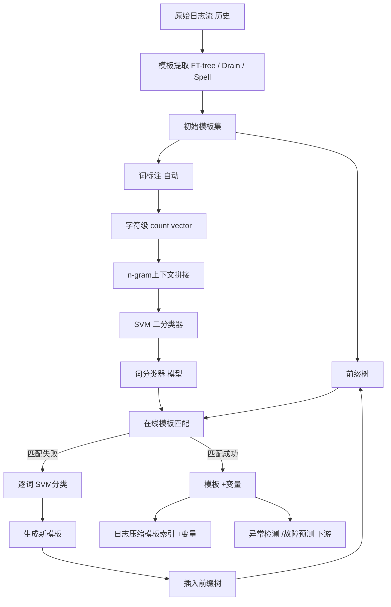
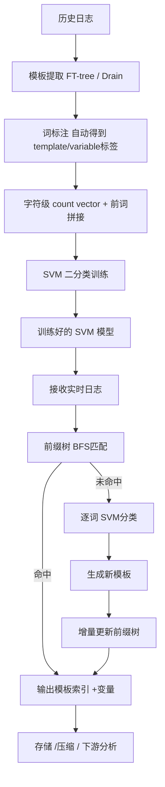

# LogParse: Making Log Parsing Adaptive through Word Classification（ICCCN2020）

> 作者：Weibin Meng, Ying Liu, Federico Zaiter, Shenglin Zhang, Yihao Chen, Yuzhe Zhang, Yichen Zhu, En Wang, Ruizhi Zhang, Shimin Tao, Dian Yang, Rong Zhou, Dan Pei
>机构：清华大学计算机科学与技术系；清华大学网络科学与网络空间研究院；南开大学软件学院；多伦多大学统计系；吉林大学；华为；BNRist
> 发表年份：2020
>会议/期刊：ICCCN2020（International Conference on Computer Communication and Networks）
>关联 PDF：同目录下 `LogParse-ICCCN20.pdf`

## 一、文档信息速览

|字段 | 值 |
|---|---|
|标题 | LogParse: Making Log Parsing Adaptive through Word Classification |
| 作者 | Weibin Meng, Ying Liu, Federico Zaiter, Shenglin Zhang, Yihao Chen, Yuzhe Zhang, Yichen Zhu, En Wang, Ruizhi Zhang, Shimin Tao, Dian Yang, Rong Zhou, Dan Pei |
|机构 |清华大学；南开大学；多伦多大学；吉林大学；华为 |
| 发表年份 |2020 |
|会议/期刊 | ICCCN2020 |
|分类 | 自适应日志解析 /词分类 / AIOps |
|核心问题 | 当前日志解析方法不具备自适应能力：服务内升级后无法匹配新模板；跨服务复用解析困难；模板准确率仅0.559 |
| 主要贡献 | (1) 把模板生成问题转化为词分类问题；(2) 用 n-gram字符级特征 + SVM 自动更新模板集；(3) 在四个公共数据集上把准确率从0.559提升至接近1.0；并落地于一家顶级云服务商的日志压缩场景 |

## 二、背景（Background）

日志（logs）是大型服务运维的核心数据源，被广泛用于状态监控、事件理解、异常检测与故障预测。日志消息由两部分组成：模板（template，描述事件的常量部分）和变量（variable，随每条日志变化的部分）。要对日志做自动化分析，首先必须把日志解析为「模板索引 +变量」。

传统的数据驱动模板提取方法包括 Spell（最长公共子序列）、LogSig（聚类）、IPLoM（迭代划分）、FT-tree（频繁项挖掘）、Drain（启发式）。这些方法对长周期历史日志的解析平均准确率达到97.80%，对完整训练集效果良好，但都缺少两个关键能力：

1. **服务内自适应（intra-service adaptiveness）**：软件/固件升级会引入新类型日志，老的模板集无法匹配。例如四种方法在剩余90% 日志上的未匹配率：HPC 上 Spell0.940、HDFS 上 Spell0.832、ZooKeeper 上 Spell0.876、Hadoop 上 Spell0.992。
2. **跨服务自适应（cross-service adaptiveness）**：当新类型服务上线，历史日志量不足，传统方法准确率极低。论文观察到，当训练日志仅10% 时，传统方法平均准确率仅0.559。

由于模板必须对新日志"随时可用"，才能支撑日志压缩、异常检测、故障预测等下游应用，论文提出 LogParse：通过把模板生成问题转化为词分类问题，仅靠词级别特征（字符级 n-gram count vector）即可自动增量更新模板集。

## 三、目的（Problems Solved）

- **服务内自适应**：在出现新类型日志后无需重学全部历史日志，仅增量匹配新日志、更新模板集。
- **跨服务自适应**：在一个服务上训练的 LogParse 模型可直接迁移到另一种新服务的日志解析。
- **词分类标签缺失**：利用现有模板提取方法自动生成词标签（template word / variable word），无需人工标注。
- **新词与共享词难题**：用字符级 count vector解决 OOV（out-of-vocabulary）词；以「当前词 + 前一个词」的拼接向量作为上下文特征，处理同一个词既可能出现在模板也可能出现在变量的情况。
- **日志压缩应用落地**：在顶级云服务提供商部署，把日志压缩为「模板索引 +变量」，提升压缩率与查询速度。

## 四、核心原理（Principles）

**整体流程**：LogParse离线组件先用任意传统模板提取方法（如 FT-tree、Drain 等）从历史日志提取模板，进而把所有词分成「模板词」与「变量词」两类，得到训练标签；然后用 SVM训练一个二分类词分类器。在线组件对实时日志先用前缀树匹配模板；若匹配失败，则对每个词构造字符级 count vector拼接上下文特征，输入 SVM区分模板词/变量词，进而学习新模板并插入前缀树。

**关键概念**：

- **Template Word（模板词）**：刻画事件语义的常量词，例如「Interface」「changed」「state」「to」「down」。
- **Variable Word（变量词）**：随日志变化的参数，例如接口名「ae3」、VLAN 名「vlan22」。
- **Prefix Tree（前缀树）**：按词序列将模板组织为前缀树，加速模板匹配。
- **Template Set（模板集）**：所有已学到的模板根到叶路径的集合。
- **Word Labeling（词标注）**：用现有模板提取方法自动给词打「模板/变量」标签。
- **Character-level Count Vector（字符级计数向量）**：把词中的每个 ASCII字符数量组成向量。
- **n-gram Context（n 元上下文）**：将当前词的向量与前一个词的向量拼接。
- **Adaptive Update（自适应更新）**：模板集随新日志增量增长。

**数学原理**：

- **字符级 count vector**（论文 Eq.表述）：对词 $w$，构造长度为 $|A|$ 的向量

$$
\mathbf{v}(w) = (c_1(w), c_2(w), \dots, c_{|A|}(w))
$$

其中 $c_k(w)$ 是字符 $a_k$ 在词 $w$ 中出现的次数，$|A|=128$（ASCII）。

- **上下文特征向量**（n-gram）：把当前词 $w_t$ 的向量与前一个词 $w_{t-1}$ 的向量拼接：

$$
\mathbf{x}(w_t) = [\mathbf{v}(w_t); \mathbf{v}(w_{t-1})] \in \mathbb{R}^{2 \times128}
$$

- **SVM分类器输出**：

$$
\hat{y}(w_t) = \operatorname{sgn}\!\left(\sum_{i} \alpha_i y_i K(\mathbf{x}_i, \mathbf{x}(w_t)) + b\right)
$$

- **模板相似度（余弦相似度用于模板匹配）**：

$$
\operatorname{sim}(T_i, T_j) = \frac{\sum_k \mathbb{1}[w_k^{(i)} = w_k^{(j)}]}{\text{len}(T_i) + \text{len}(T_j) - \text{len}_{\text{lcs}}}
$$

- **压缩比**：论文定义为

$$
R_{\text{compress}} = \frac{\text{size}(\text{compressed logs})}{\text{size}(\text{original logs})}
$$

**与现有技术的差异**：与 Spell、LogSig、IPLoM 等「聚类 / 最长子序列 /迭代划分 /频繁项挖掘」类方法不同，LogParse 把模板生成转化为词分类，可以增量更新模板集，并且具有跨服务泛化能力。

## 五、算法详解（Algorithm）

1. **输入 / 输出**：
 - 输入：原始日志流（历史 +实时）。
 - 输出：每条日志的模板索引 +变量词；增量更新的模板集。

2. **核心模块**：
 - **Template Extraction**：用任意已有模板提取方法（FT-tree / Drain / Spell / LogSig / IPLoM）从历史日志提取模板集。
 - **Word Labeling**：把出现在模板中的词标为 template word，其他标为 variable word。
 - **Word Representation**：把每个词转为字符级 count vector；拼接前一个词的向量作为上下文特征。
 - **Word Classifier**：用 SVM训练二分类器区分 template/variable词。
 - **Template Matching**：用前缀树把实时日志与已有模板匹配；流程见论文 Algorithm1（BFS状态机）。
 - **Template Generation**：对未匹配的日志，逐词调用 SVM，把分类为 template 的词作为新模板插入前缀树。
 - **Log Compression Application**：把日志表示为「template index + variable words」，并叠加 bzip /7zip / zip 做二次压缩。

3. **伪代码**：

```python
def extract_templates_ft_tree(historical_logs):
 """离线：从历史日志提取初始模板集合"""
 templates = ft_tree(historical_logs)
 build_prefix_tree(templates)
 return templates

def label_words(templates, logs):
 """离线：根据已有模板把日志里的词标为 template/variable"""
 labels = []
 for log in logs:
 tmpl = match_template(log, templates)
 for word, slot in zip(log.split(), tmpl.split()):
 labels.append((word, slot == "<*>"))
 return labels

def build_char_ngram_features(labeled_words):
 """离线：构造 SVM 的训练特征 (字符级 count vector + 前词拼接)"""
 X, y = [], []
 for word, is_template in labeled_words:
 v_cur = char_count_vector(word)
 v_prev = char_count_vector(prev_word(word))
 X.append(np.concatenate([v_cur, v_prev]))
 y.append(1 if is_template else0)
 return np.array(X), np.array(y)

def train_word_classifier(X, y):
 """离线：用 SVM训练二分类器"""
 clf = SVC(kernel="linear")
 clf.fit(X, y)
 return clf

def online_match_and_update(log, prefix_tree, clf):
 """在线：先匹配模板；失败则学新模板"""
 tmpl = bfs_match(log, prefix_tree)
 if tmpl is not None:
 return tmpl, log.split()[1:]  #已有模板 +变量
 # 学新模板
 new_tmpl_words = []
 prev = ""
 for word in log.split():
 v = np.concatenate([char_count_vector(word), char_count_vector(prev)])
 if clf.predict([v])[0] ==1:
 new_tmpl_words.append(word)
 prev = word
 new_tmpl = " ".join(new_tmpl_words)
 insert_into_prefix_tree(prefix_tree, new_tmpl)
 return new_tmpl, [w for w in log.split() if w not in new_tmpl_words]
```

4. **关键数学**：见 §四。

5. **复杂度分析**：
 - 前缀树匹配（BFS）：$O(|L| \cdot |\Sigma|)$，$|L|$ 为日志词数。
 - SVM预测：$O(d \cdot n_{\text{SV}})$，$d=256$（特征维度），$n_{\text{SV}}$ 为支持向量数。
 -增量更新前缀树：$O(|T|)$。

6. **训练与推理**：
 -训练：FT-tree / Drain提取模板 →词标注 →字符级特征 → SVM训练。
 -推理：实时日志先 BFS匹配前缀树；未命中时调用 SVM区分模板词/变量词 → 生成新模板 →插入前缀树。

7. **示例**：原始日志 `Interface ae3, changed state to down`。FT-tree提取出模板 `Interface *, changed state to down`。新日志 `Vlan-interface vlan22, changed state to up` 无法匹配前缀树，LogParse 把每个词的字符级向量拼接上下文输入 SVM，识别出 `Vlan-interface / changed / state / to / up` 为模板词，把 `vlan22`留作变量，生成新模板 `Vlan-interface *, changed state to up`，插入前缀树后即可匹配后续同模板日志。

## 六、系统架构图（Architecture）



## 七、流程图（Process Flow）



## 八、关键创新点（Key Innovations）

- **+ 把模板生成转化为词分类**：跳出聚类 / 最长子序列的传统范式，仅靠词级特征即可增量更新。
- **+字符级 count vector +上下文 n-gram**：解决 OOV 与「同词既在模板又在变量」的歧义。
- **+ 服务内自适应**：增量学习新模板，避免重新处理全部历史日志。
- **+跨服务自适应**：HPC → HDFS / Zookeeper / Hadoop跨数据集准确率平均0.980。
- **+ 日志压缩落地**：从2018-09 起在顶级云服务提供商部署用于交换机 /防火墙日志。
- **+ 开源**：LogParse 实现已开源，地址为 https://github.com/WeibinMeng/LogParse。

## 九、实验与结果（Experiments）

- **数据集**：
 - HPC（High Performance Cluster）：433,489 条日志。
 - HDFS（Hadoop Distributed File System）：11,175,629 条日志。
 - ZooKeeper：74,380 条日志。
 - Hadoop（MapReduce Job）：394,308 条日志。
- **Baseline模板提取方法**：LogSig、IPLoM、Spell、Drain、FT-tree。
- **指标**：Rand Index、压缩比、查询时间。
- **关键结果数字**：
 -增量学习场景下 LogParse 平均模板提取准确率 **0.958**（基线传统方法仅0.559，提升 **71.5%**）。
 -跨数据集模板学习 Rand Index 平均 **0.980**，例如 HPC→HDFS0.983、HDFS→ZooKeeper0.993。
 -跨服务压缩平均比率 **22.7%**（LogParse w/ bzip 可降至 **3.2%**）。
 -1TB 日志压缩后查询100 条：LogParse **0.212 ms**，bzip20.27 小时、7zip1.12 小时、zip1.91 小时。
 -落地场景：交换机日志压缩率16.4%，防火墙23.3%；与 bzip叠加分别降至3.13% 和5.07%。
- **消融实验**：分别去掉上下文特征、字符级特征、n-gram 等，验证每部分贡献（论文 Fig.9展示训练数据比例从10% 到90% 的稳定性）。
- **效率分析**：模板匹配 BFS极快；SVM推理单条日志毫秒级。

## 十、应用场景（Use Cases）

- **云服务提供商日志压缩**：把 GB/TB 级原始日志压缩为「模板索引 +变量」，显著降低存储成本并支持实时查询。
- **跨服务日志解析迁移**：新服务上线时无需从头训练，直接复用已训练的 LogParse 模型。
- **网络设备日志解析（交换机 /防火墙）**：捕获接口状态变化、邻居变更、链路 up/down 等事件。
- **AIOps 下游任务**：异常检测（LogAnomaly / DeepLog）、故障预测（PreFix）的前置解析步骤。
- **工业日志压缩与归档**：长周期历史日志的双重压缩。

##十一、相关论文（Related Papers in this set）

- `LogAnomaly`（IJCAI19，Meng 等）：基于模板的日志异常检测，是 LogParse 的下游应用之一。
- `DeepLog`（CCS17，Du 等）：LSTM 日志异常检测，依赖模板提取。
- `Device_Agnostic_Log_Anomaly_Classification`（IWQoS18）：LogClass，部分作者重叠，同样关注日志解析与异常分类。
- `孟伟斌LogClass_Anomalous_Log_Identification_and_Classification_With_Partial_Labels`（TNSM21）：LogClass期刊版。
- `paper-ISSRE20-LogTransfer`（ISSRE20）：跨系统日志异常检测，同样涉及 FT-tree模板提取。
- `TraceSieve_ISSRE23`（ISSRE23）：追踪异常检测，与日志/追踪互补。

##十二、术语表（Glossary）

- **Template Word**：模板词，日志中刻画事件的常量词。
- **Variable Word**：变量词，随日志变化的参数（IP、接口号等）。
- **Prefix Tree**：前缀树，按词序列组织模板。
- **FT-tree**：频繁项挖掘模板提取方法。
- **Drain**：启发式模板提取方法（固定深度树）。
- **Spell**：基于最长公共子序列的流式解析。
- **LogSig**：基于聚类的解析方法。
- **IPLoM**：基于迭代划分的解析方法。
- **n-gram**：把相邻 $n$ 个词/字符的向量拼接作为特征。
- **SVM**：支持向量机，二分类器。
- **Intra-service Adaptiveness**：服务内自适应，能处理升级产生的新类型日志。
- **Cross-service Adaptiveness**：跨服务自适应，模型可迁移到新类型服务的日志。
- **Log Compression**：日志压缩，把日志表示为「模板索引 +变量」。

##十三、参考与延伸阅读

- Paper: Spell（Du & Li, ICDM2016）——流式日志解析。
- Paper: LogSig（Tang et al., CIKM2011）——基于聚类的日志解析。
- Paper: IPLoM（Makanju et al., KDD2009）——迭代划分日志解析。
- Paper: Drain（He et al., ICWS2017）——固定深度树启发式解析。
- Paper: FT-tree（Zhang et al., IWQoS2017）——频繁项挖掘解析。
- Paper: DeepLog（Du et al., CCS2017）——日志异常检测。
- Paper: LogAnomaly（Meng et al., IJCAI2019）——结构化与定量日志异常检测。
- Paper: PreFix（Zhang et al., SIGMETRICS2018）——交换机故障预测。
-工具：FT-tree、Drain、Spell、LogSig、IPLoM；开源 LogParse（GitHub）。
- 相关论文目录：`LogAnomaly`、`DeepLog`、`Device_Agnostic_Log_Anomaly_Classification`、`paper-ISSRE20-LogTransfer`。
