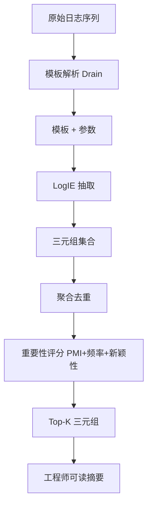
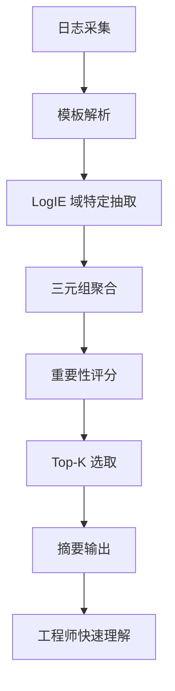

# LogSummary: Unstructured Log Summarization for Software Systems（IEEE TNSM 2023）

> 作者：Weibin Meng、Federico Zaiter、Yuzhe Zhang、Ying Liu、Shenglin Zhang、Shimin Tao、Yichen Zhu、Tao Han、Yongpeng Zhao、En Wang、Yuzhi Zhang、Dan Pei  
> 机构：华为；清华大学；南开大学；吉林大学；美的集团；海河实验室  
> 发表年份：2023  
> 会议/期刊：IEEE Transactions on Network and Service Management（DOI 10.1109/TNSM.2023.3236994）  
> 关联 PDF：同目录下 `LogSummary_Unstructured_Log_Summarization_for_Software_Systems.pdf`

## 一、文档信息速览

| 字段 | 值 |
|---|---|
| 标题 | LogSummary: Unstructured Log Summarization for Software Systems |
| 作者 | Weibin Meng、Federico Zaiter、Yuzhe Zhang、Ying Liu、Shenglin Zhang、Shimin Tao、Yichen Zhu、Tao Han、Yongpeng Zhao、En Wang、Yuzhi Zhang、Dan Pei |
| 机构 | 华为；清华大学；南开大学；吉林大学；美的集团；海河实验室 |
| 发表年份 | 2023 |
| 会议/期刊 | IEEE TNSM |
| 分类 | 日志摘要 / NLP / 可解释性 |
| 核心问题 | 大规模软件系统日志量巨大（50GB/小时，1.2-2 亿行），工程师难以手工阅读；现有方法要么只压缩不解释，要么需要大量标注数据 |
| 主要贡献 | (1) 提出 LogSummary 端到端无监督日志摘要框架；(2) 提出 LogIE 域特定高效信息抽取方法（融合模板 + NLP）；(3) 全局知识驱动的三元组排序方法；(4) 公开 4 个开源日志数据集的人工标注摘要与代码 |

## 二、背景（Background）

大型软件系统每天产生海量日志（论文场景约 50GB/小时，1.2-2 亿行），是运维工程师理解系统状态的核心数据。现有日志分析方法可分为日志压缩、解析、异常检测、故障预测、故障诊断等，但这些方法在给出结果后，工程师仍需"亲自阅读"原始日志以确认——这与"日志最初是为人类阅读而设计"的初衷相矛盾。

手工或基于规则的日志摘要方法在三种场景下失效：(1) 数百名开发/运维人员对原始日志的语境知识不完整；(2) 日志量爆炸，手工/规则方法耗时易错；(3) 敏捷开发下新日志类型不断出现，规则更新滞后。

论文发现工程师最关心日志中的"实体-关系-事件"三元组（triple），例如 "(Interface, changed to, down)" 比 56 词的原始日志更易理解。论文提出 LogSummary 框架：先用域特定 NLP 方法（LogIE）从每条日志抽取三元组；再用全局知识对三元组排序；选出 Top-K（如 Top-2）作为摘要。

## 三、目的（Problems Solved）

- **日志难以人工阅读**：自动生成可解释摘要。
- **NLP 工具不适用日志**：日志含域特定符号、语法异于普通文本；通用 NLP 工具抽取不准。
- **效率低**：每小时千万级日志，逐条 NLP 抽取三元组开销大。
- **摘要排序**：现有 NLP 文本摘要按句子顺序排列，工程师更关心"重要日志优先"。
- **缺少公开摘要数据集**：发布 4 个开源数据集的人工标注摘要。
- **无监督**：避免对大量标注的依赖。

## 四、核心原理（Principles）

**系统总览**：LogSummary 工作流为：(1) 模板解析（Drain）得到模板 + 参数；(2) 域特定 LogIE 抽取三元组；(3) 全局知识驱动的三元组排序（用所有日志的统计信息排序）；(4) 选 Top-K 三元组作为摘要。

**关键概念**：

- **Triple（三元组）**：(entity, relation, entity) 或 (entity, relation, value)。
- **LogIE**：Log Information Extraction，日志域特定信息抽取。
- **Log Template**：日志模板（参数化后的固定部分）。
- **Global Knowledge**：全局知识（所有日志的统计信息）。
- **Top-K Summary**：Top-K 三元组摘要。
- **Drain**：经典日志模板解析算法。

**数学原理**：

- **三元组抽取**（LogIE）：

$$
T = \text{LogIE}(l, \text{template}(l), \text{domain\_rules})
$$

其中 $l$ 是日志，$T = \{(e_1, r, e_2), \ldots\}$。

- **三元组重要性评分**（结合语义 + 频率）：

$$
s(t) = \lambda_1 \cdot \text{PMI}(t) + \lambda_2 \cdot \log f(t) + \lambda_3 \cdot \text{novelty}(t)
$$

PMI（点互信息）衡量语义关联，$f$ 是出现频率，novelty 衡量新颖性。

- **Top-K 选取**：

$$
\text{Summary} = \arg\max_{T' \subseteq T, |T'|=K} \sum_{t \in T'} s(t)
$$

- **模板 + NLP 融合**：

$$
T = \text{NLP}(\text{template}(l)) \cup \text{RuleExtract}(l)
$$

**与现有技术的差异**：与纯日志压缩方法相比，LogSummary 给出可读三元组；与日志解析方法相比，LogSummary 进一步抽取语义关系；与文本摘要（NLP）方法相比，LogSummary 引入域特定 LogIE 解决"日志语法异于普通文本"问题。

## 五、算法详解（Algorithm）

1. **输入 / 输出**：
   - 输入：日志序列。
   - 输出：Top-K 三元组摘要。

2. **核心模块**：
   - **模板解析**：Drain。
   - **LogIE**：模板 + NLP + 域规则。
   - **三元组聚合**：合并相同三元组。
   - **重要性评分**：PMI + 频率 + 新颖性。
   - **Top-K 选取**。

3. **伪代码**：

```python
def logsummary_pipeline(logs, K=2):
    templates = drain_parse(logs)
    triples = []
    for l, t in zip(logs, templates):
        ts = logie(l, t, domain_rules)
        triples.extend(ts)
    # 去重 + 聚合
    triple_counts = aggregate(triples)
    # 评分
    scores = {}
    for t, f in triple_counts.items():
        scores[t] = alpha * pmi(t) + beta * log(f) + gamma * novelty(t)
    # Top-K
    top_k = sorted(scores, key=scores.get, reverse=True)[:K]
    return top_k
```

4. **关键数学**：见 §四。

5. **复杂度分析**：
   - 模板解析：$O(N)$；
   - LogIE 抽取：$O(N \cdot T)$，$T$ 为模板数；
   - 三元组聚合：$O(N \cdot |T|)$；
   - 评分：$O(|T|^2)$；
   - 总计：分钟级到小时级。

6. **训练与推理**：无监督；推理 = LogIE + 评分 + Top-K。

7. **示例**：网络设备日志"Interface ae3, changed state to down" → 模板 "* Interface *, changed state to *" → LogIE 抽取 (Interface, changed to, down) → 评分 → Top-2 摘要"网络端口状态变化"。

## 六、系统架构图（Architecture）



## 七、流程图（Process Flow）



## 八、关键创新点（Key Innovations）

- **+ LogSummary 端到端摘要框架**：模板 + NLP + 排序。
- **+ LogIE 域特定抽取**：解决"日志语法异普通文本"问题。
- **+ 全局知识驱动排序**：跨日志统计提升摘要质量。
- **+ 公开 4 个数据集标注摘要**：推动学术研究。
- **+ 高效**：分钟级到小时级处理。

## 九、实验与结果（Experiments）

- **数据集**：4 个开源日志数据集（OpenStack、Linux、Hadoop、Apache 等），论文公开了人工标注的"金标准摘要"。
- **Baseline**：纯模板压缩、纯 NLP 摘要、LogPAI、TextRank 等。
- **主要指标**：ROUGE F1（评估摘要相似度）、人工评估。
- **关键结果数字**：
  - ROUGE F1 平均 0.741；
  - 在 4 个数据集上均优于基线；
  - 案例研究显示摘要易于工程师理解。
- **消融实验**：分别去掉模板、LogIE、全局评分，验证每部分贡献。
- **效率分析**：处理 100K 条日志分钟级。
- **可视化**：摘要对比示例。

## 十、应用场景（Use Cases）

- **大规模软件系统日志摘要**：网络设备、服务器、数据库。
- **AIOps 故障诊断前置**：先摘要后诊断。
- **运维知识管理**：把日志摘要存入知识库。
- **客服系统**：把日志摘要用于用户支持。
- **学术研究**：复现与对比新方法。

## 十一、相关论文（Related Papers in this set）

- `LogKG`（日志 KG 诊断）
- `Chain-of-Event_Interpretable-Root-Cause-Analysis-for-MicroservicesFSE24-Camera-Ready`（事件级根因）
- `AlertRCA_CCGRID2024_CameraReady`（告警根因）
- `MonitorAssistant_CameraReady-v1.5_submitted`（LLM 监控助手）
- `TSC23-DiagFusion`（多模态故障诊断）
- `A-survey-on-intelligent-management-of-alerts-and-incidents-in-IT-services`（AIOps 综述）

## 十二、术语表（Glossary）

- **Log（日志）**：软件运行时输出记录。
- **Triple（三元组）**：(entity, relation, entity) 或 (entity, relation, value)。
- **LogIE（Log Information Extraction）**：日志信息抽取。
- **Log Template**：日志模板。
- **Drain**：经典日志模板解析算法。
- **Global Knowledge**：全局知识。
- **PMI（Pointwise Mutual Information）**：点互信息。
- **ROUGE**：摘要评估指标。
- **Top-K Summary**：Top-K 摘要。
- **Domain Rule**：域特定规则。
- **Unsupervised**：无监督。

## 十三、参考与延伸阅读

- Paper: LogPAI（He et al., 2017）——日志解析工具集。
- Paper: Drain（ICWS 2017）——日志模板解析。
- Paper: TextRank（EMNLP 2004）——文本摘要。
- Paper: OpenIE（Banko et al., 2007）——开放信息抽取。
- 工具：BERT、Spacy、Stanford OpenIE。
- 数据集：HDFS、OpenStack、Linux、Hadoop、Apache、CMCC GAIA 等。
- 相关论文：`LogKG`、`Chain-of-Event_Interpretable-Root-Cause-Analysis-for-MicroservicesFSE24-Camera-Ready`、`AlertRCA_CCGRID2024_CameraReady`、`MonitorAssistant_CameraReady-v1.5_submitted`、`TSC23-DiagFusion`。
