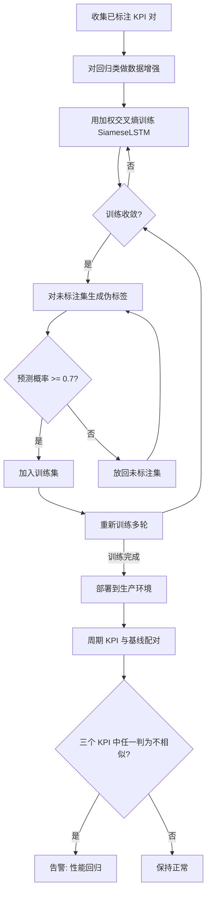

# Adaptive Performance Regression Detection via Semi-Supervised Siamese Learning（IEEE TNSM 2025）

> 作者：Yongqian Sun, Mengyao Li, Xiao Xiong, Lei Tao, Yimin Zuo, Wenwei Gu, Shenglin Zhang, Junhua Kuang, Yu Luo, Huandong Zhuang, Bowen Deng, Dan Pei  
> 机构：南开大学、华为云、香港中文大学、清华大学  
> 发表年份：2025  
> 会议/期刊：IEEE Transactions on Network and Service Management（TNSM）  
> 关联 PDF：同目录下 `Mengyao__SiameseLSTM.pdf`  
> 源代码：作者公开（论文引用 [35]）

## 一、文档信息速览

| 字段 | 值 |
|---|---|
| 标题 | Adaptive Performance Regression Detection via Semi-Supervised Siamese Learning |
| 作者 | Yongqian Sun, Mengyao Li, Xiao Xiong, Lei Tao, Yimin Zuo, Wenwei Gu, Shenglin Zhang, Junhua Kuang, Yu Luo, Huandong Zhuang, Bowen Deng, Dan Pei |
| 机构 | 南开大学、华为云、香港中文大学、清华大学 |
| 发表年份 | 2025 |
| 会议/期刊 | IEEE TNSM |
| 分类 | 异常检测 / 性能回归检测 / 半监督学习 / 时序相似度 |
| 核心问题 | 在动态负载、变长 KPI 序列和标签稀缺、类别极不平衡的工业压力测试场景下，准确、低延迟地识别"性能回归"。 |
| 主要贡献 | 1) 联合 workload（Vusers）+ 多维 KPI 作为模型输入；2) 双分支权重共享 LSTM 孪生网络，避免每个接口单独训练；3) 数据增强 + 加权交叉熵损失 + 伪标签半监督学习三件套解决不平衡；4) 在华为云生产数据上 F1=0.958，比最佳基线提升 0.282。 |

## 二、背景（Background）

随着云服务和微服务架构的广泛采用，软件系统的稳定性与性能直接关系到用户体验和平台收入。BBC 的研究表明，加载时间每增加 1 秒，就会流失 10% 的用户；微软与 Google 的联合项目也证明，400ms 的网络延迟在 2020 年给两家公司造成了 $1.75 亿的损失。微服务、频繁版本发布和动态工作负载进一步加剧了系统行为的不确定性：即使代码改动不显著，在不同并发量下也可能出现"性能回归"——表现为响应时间增加、吞吐量下降等。

工业界传统做法分两类：一类是利用 KS-test、Mann-Whitney U test 等统计方法比较两批 KPI 分布；另一类是基于聚类/自编码器的重构误差法（如 AutoPerf）。但它们都存在明显缺陷：统计方法对均值/中位数/方差敏感，容易把"正常负载波动"误报为回归；自编码器类方法依赖"足够多的正常数据训练"且需要手工调参/聚类，难以适配高频采样、变长序列、稀疏标签的工业场景。论文 Fig.1 给出一个直观反例：基线、正常、回归三种曲线在响应时间/吞吐量上肉眼可分，但 KS 检验 p-value 接近 0，会把"对数加压下的正常"误报为回归。

文章正是在这种"动态负载 + 变长 + 标签稀缺 + 类别不平衡"的工业痛点下，提出 DynamicRegress 系统，并在华为云 CodeArts PerfTest 平台的 78 个功能接口上验证其有效性。

## 三、目的（Purpose / Problems Solved）

论文显式列出三大挑战：

- **挑战 1：在动态负载下比较变长 KPI 序列。** 工业压测中两次测试的采样点数往往不同（持续时长、采样间隔差异），传统 SCNN 需要等长输入，只能用 padding/truncation，引入噪声或丢失关键趋势。
- **挑战 2：接口多样、单接口标签稀缺。** 一套系统往往有几十甚至上百个功能接口，每个接口正常模式不同，但每个接口的标注样本却很少，无法为每个接口单独训练一个模型。
- **挑战 3：标签类别极不均衡。** 正常样本远多于回归样本（论文数据集中回归仅占 7.91%），传统交叉熵会偏向多数类，导致漏报真正的回归。

每条挑战都对应了"痛点 → 解决方案"：变长序列→LSTM 编码器天然支持变长；接口多样→权重共享孪生结构学到统一嵌入空间；类别不平衡→数据增强 + 加权损失 + 半监督伪标签三策略组合。

## 四、核心原理（Principles）

DynamicRegress 的整体思路是：把"性能回归检测"重新表述为"两组 KPI 时序是否相似"的二分类问题。具体来说，将同一接口的"基线 KPI"和"周期执行的 KPI"配对成一个样本对，二者来自同一版本发布下的不同测试周期。借助孪生网络的双塔结构学到的嵌入向量，比较它们的"绝对差"$\Delta Z = |Z^{(1)} - Z^{(2)}|$，再通过 softmax 输出相似/不相似的概率。

关键概念：

- **KPI Pair（KPI 配对）**：同一接口在两次测试中的 (Vusers, KPI) 时序对，组成了一个样本。
- **Workload-aware 输入**：把并发用户数 Vusers 作为一个"协变量"与 KPI 一起作为多变量时序输入。Fig.1(b) 表明，Vusers 增大本身就是性能自然变化的常见原因，必须与 KPI 共同建模。
- **Siamese LSTM**：两个权重完全相同的 LSTM 分支，输出变长序列的最终隐藏态 $Z^{(j)} = h_{T_j}^{(j)}$ 作为整段序列的"指纹"，天然支持变长。
- **数据增强（仅对回归样本）**：噪声注入（加随机扰动）+ 时间平移（在时间轴上做小幅度偏移），增加回归样本多样性与数量。
- **加权交叉熵损失**：多数类/少数类权重比 1:2，引导模型关注回归样本。
- **半监督伪标签**：先用少量已标注数据训练，每轮用当前模型对未标注集做预测，仅保留预测概率 ≥ 0.7（论文实验得到的最优阈值）的样本作为新的"伪标签样本"加入训练集，迭代多轮。

**与现有技术的差异**：

- vs **KS/MWU**：本方法对负载协变量建模，能区分"负载驱动的正常波动"和"真正的回归"，在 Precision 上大幅领先。
- vs **SCNN**：本方法用 LSTM 编码变长序列，不需要等长对齐。
- vs **AutoPerf 重构类**：本方法只学"相似/不相似"判别能力，不依赖每个接口的大量正常数据训练自编码器。
- vs **vPerfGuard**：vPerfGuard 预测再比较，本方法直接学"两个时序是否来自同一模式"，更接近"判别式"思路。

数学上，加权交叉熵损失可表示为：

$$L = -\frac{1}{N}\sum_{i=1}^{N}\Big[w_1\cdot y_i \log \hat{y}_i + w_0\cdot (1-y_i)\log (1-\hat{y}_i)\Big]$$

其中 $w_1$ 是回归类权重、$w_0$ 是正常类权重。论文通过消融确定最佳比例为 1:2（多数:少数）。

## 五、算法详解（Algorithm）

### 1. 输入 / 输出

- **输入**：KPI 配对 $(X^{(1)}, X^{(2)})$，每条 $X^{(j)} = \{x_1^{(j)}, x_2^{(j)}, \ldots, x_{T_j}^{(j)}\}$，其中 $x_i^{(j)}\in\mathbb{R}^2$ 由 (Vusers, KPI) 构成。
- **输出**：$\hat{y} = \text{softmax}(W_{fc}\cdot \Delta Z + b_{fc})\in\mathbb{R}^2$，表示"相似"和"不相似"两个类别的概率。

### 2. 核心模块

- **数据预处理模块**：构造 (Vusers, KPI) 二元组时序；对回归类样本加噪 / 时移。
- **孪生 LSTM 编码器**：权重完全共享的两路 LSTM，对变长序列编码到 $Z^{(1)}, Z^{(2)}$。
- **相似度计算头**：$\Delta Z = |Z^{(1)} - Z^{(2)}|$ 后接全连接 + softmax。
- **半监督训练循环**：伪标签生成 + 置信度阈值过滤（≥0.7）→ 加入训练集 → 重新训练。
- **在线检测模块**：将新测试周期 KPI 与基线 KPI 配对送入模型，按专家规则（任一 KPI 判定为回归即触发）输出告警。

### 3. 伪代码

```python
# 离线训练（结合半监督伪标签）
def train_dynamic_regress(labeled_set, unlabeled_set, epochs=30,
                          p_threshold=0.7, w_ratio=(1, 2)):
    model = SiameseLSTM()
    optimizer = Adam(model.params(), lr=...)
    weights = {'normal': w_ratio[0], 'regression': w_ratio[1]}

    # 1) 数据增强：仅对回归类样本
    aug_labeled = augment_regression(labeled_set, methods=['noise', 'shift'])

    # 2) 多轮半监督训练
    for epoch in range(epochs):
        # 监督训练
        for (x1, x2, y) in shuffle(aug_labeled):
            Z1, Z2 = model.encode(x1), model.encode(x2)
            delta = (Z1 - Z2).abs()
            yhat = model.classify(delta)
            loss = weighted_ce(yhat, y, weights)
            optimizer.step(loss)

        # 伪标签生成
        confident_pairs = []
        for (x1, x2) in unlabeled_set:
            p = model.predict_similarity(x1, x2)
            if max(p) >= p_threshold:
                confident_pairs.append((x1, x2, p.argmax()))
        aug_labeled.extend(confident_pairs)  # 扩展训练集

    return model

# 在线检测
def online_detect(model, baseline, periodic, kpi_types):
    flags = {}
    for kpi in kpi_types:  # RT, TPS, success rate
        x1 = build_pair(baseline.vusers, baseline[kpi])
        x2 = build_pair(periodic.vusers, periodic[kpi])
        p = model.predict_similarity(x1, x2)
        flags[kpi] = (p.argmax() == 'dissimilar')
    # 专家规则：任一 KPI 判定为不相似 → 整体报回归
    return any(flags.values())
```

### 4. 关键数学

LSTM 隐藏态递推（论文简化为一个统一的非线性映射）：

$$h_t = \phi(W x_t + A h_{t-1} + b)$$

其中 $W, A$ 为可学习矩阵，$\phi$ 为非线性激活，简化形式掩盖了门控机制（input / forget / output gate），但实际实现是标准 LSTM。序列的最终表示 $Z = h_T$ 凝聚了整段时序动态。

相似度度量最终输出：

$$\hat{y} = \mathrm{softmax}(W_{fc}\cdot |Z^{(1)} - Z^{(2)}| + b_{fc})$$

选择绝对差而非欧氏距离的原因：平方误差放大幅度，对异常点更敏感；余弦相似度需归一化，绝对差更直接、训练更稳。

### 5. 复杂度分析

论文未给严格复杂度公式，但给出**实测 Run Time**：每对 KPI 检测延迟 0.006s。三种 KPI 串行判定总延迟约 0.018s，工业要求 < 1s 即可满足；并按 0.006 × N 估算 N 个 KPI 的扩展时延。

### 6. 训练与推理

- **训练目标**：加权交叉熵，权重 1:2。
- **优化器**：Adam。
- **训练周期**：30 epoch，loss 后期稳定在 ~0.3。
- **推理流程**：新批次测试得到 KPI 时序 → 与同接口基线配对 → 编码、相似度分类 → 按专家规则输出最终判定。

### 7. 示例

论文 Fig.7（正常）vs Fig.8（回归）是一组很好的样例：Fig.7 周期执行 KPI 与基线在响应时间/吞吐量/成功率上都接近，模型输出"相似"；Fig.8 周期执行的响应时间出现剧烈下跌后回升、吞吐量持续低于基线，模型在响应时间和吞吐量上输出"不相似"，成功率因仍是 1 不报警，整体按专家规则被判定为性能回归。该案例也提示：成功率单一指标不可信，必须联合 RT/TPS。

## 六、系统架构图（Architecture）

```mermaid
graph TB
    subgraph DataSource["数据源 (华为云 CodeArts PerfTest)"]
        A1[Baseline KPIs + Vusers]
        A2[Periodic KPIs + Vusers]
    end
    subgraph Preprocess["数据预处理 (III-B)"]
        B1[构造 (Vusers, KPI) 时序对]
        B2[对回归类样本: 加噪 / 时间平移]
    end
    subgraph SiameseLSTM["SiameseLSTM 孪生编码器"]
        C1[LSTM Branch 1 (共享权重 W, A)]
        C2[LSTM Branch 2 (共享权重 W, A)]
    end
    D1[计算 |Z1 - Z2|]
    D2[FC + Softmax 相似度分类]
    subgraph Semi["半监督学习循环"]
        E1[伪标签生成]
        E2{概率 >= 0.7?}
        E3[加入训练集]
        E4[放回未标注集]
    end
    subgraph Online["在线检测 (III-E)"]
        F1[按 RT / TPS / 成功率 逐个判定]
        F2[专家规则: 任一指标异常即告警]
    end
    A1 --> B1
    A2 --> B1
    B1 --> B2
    B2 --> C1
    B2 --> C2
    C1 --> D1
    C2 --> D1
    D1 --> D2
    D2 --> E1
    E1 --> E2
    E2 -- 是 --> E3
    E2 -- 否 --> E4
    E3 --> B1
    F1 --> F2
```

## 七、流程图（Process Flow）



## 八、关键创新点（Key Innovations）

- **+ Workload-aware 多维 KPI 输入**：把并发用户数作为协变量与 KPI 一起喂给 LSTM，让模型能区分"负载驱动的正常波动"和"真正的回归"。消融 C1（去掉 Vusers）F1 从 0.958 掉到 0.583，证明这是关键设计。
- **+ 双分支权重共享 LSTM 孪生结构**：将"两次测试是否同模式"问题转化为嵌入空间相似度学习，LSTM 的递归结构天然支持变长，无需 padding/truncation，权重共享大幅减少参数量，适配稀缺标注。
- **+ 数据增强 + 加权交叉熵 + 半监督伪标签三件套**：分别从"样本多样性"、"损失函数"、"训练集扩展"三层面解决类别不平衡。消融 C3/C4/C5 表明三者缺一不可，去掉任何一个 F1 都明显下降。
- **+ 在线 + 离线一体化系统**：离线半监督训练 + 在线实时检测，论文 Fig.6 给出完整工业落地架构（Web Service / Load Balancing / Scheduler / Algorithm Service / Data Center / Data Monitor），可监 78 个接口、5 大业务域。
- **+ 对每接口友好的专家规则化判定**：将单 KPI 判别结果通过"任一指标异常即触发"的可配置规则聚合（论文 V-B.3 中明确支持多数投票、加权融合、混合逻辑三种 SRE 可定制规则），兼顾召回与业务可解释性。

## 九、实验与结果（Experiments）

- **数据集**：华为云 CodeArts PerfTest 平台生产数据，78 个功能接口，KPI 1 秒粒度采样，包含 RT、TPS、成功率三类。
  - 标注训练集：3522 对（3171 normal + 351 regression，正常/异常 ≈ 9:1）
  - 未标注训练集：6840 对
  - 测试集：8145 对（7573 normal + 572 regression）
- **Baseline**：KS-test、Mann-Whitney U test、TSFEL 特征提取 + 分类器、AutoPerf 聚类 + 自编码器，加上 5 个消融变体 C1-C5。
- **主要指标**：Precision、Recall、F1 Score、Run Time（每对 KPI）。
- **关键结果数字**（论文 Table II）：
  - DynamicRegress F1 = **0.958**（Precision 0.991，Recall 0.927），Run Time 0.006s。
  - KS/MWU F1 ≈ 0.276 / 0.274（高 recall 但 precision 极低）。
  - TSFEL F1 = 0.676，Run Time 0.214s（最慢）。
  - AutoPerf F1 = 0.279。
  - 消融：去 Vusers（C1）F1=0.583；标准化（C2）F1=0；去数据增强（C3）F1=0.284；去加权损失（C4）F1=0.884；去半监督（C5）F1=0.852。
  - 论文称 F1 相对最佳 baseline 提升 0.282。
- **消融实验**：5 个变体（C1-C5）逐一破坏关键模块，F1 都明显下降，验证每个组件必要性。
- **效率分析**：单对 KPI 0.006s，三 KPI 串行 ~0.018s，远低于工业 1s 阈值；扩展估算 0.006×N 秒。
- **超参敏感度**：p_threshold 在 0.5-0.9 间 F1 稳定，0.7 最佳；加权损失比 1:1.5~1:3.5 间 F1 稳定，1:2 最佳。
- **部署**：在华为云生产环境已部署超 6 个月，监控 5 大业务域 78 个接口，回归对召回率 90%+。

## 十、应用场景（Use Cases）

- **云服务压测回归自动判定**：版本发布后周期性跑压测，自动判断新版本是否出现性能回归，减少人工 review。
- **多服务接口健康度评分**：通过相似度嵌入 + 加权规则，给出每个接口的"偏离基线"程度。
- **容量规划与负载特征归因**：把"为什么这次表现差"归因到 RT / TPS / 成功率 三个维度的偏离。
- **A/B 测试后端性能监控**：实验组与对照组配对送入模型，定位"哪个接口的哪类指标被改动拖累"。
- **金融 / 电商等 SLA 严苛行业的版本门禁**：在 CI/CD 流水线中集成，作为发版门禁，对 KPI 异常自动阻断或告警。

## 十一、相关论文（Related Papers in this set）

- `LabelEase_ISSRE24_CameraReady`：自动打标/主动学习，与本工作缓解"标签稀缺"思路互补。
- `24_TOSEM_DeepHunt`：基于深度学习的故障/异常检测，与本工作同属异常检测大类。
- `InformationSciences-OmniFed`：联邦异常检测，关注跨组织数据，与本工作关注样本不平衡可对照。
- `Shiyu__Accurate_and_Interpretable_Log_Fault_Diagnosis_using_Large_Language_Models-2`：LLM 日志诊断，互补覆盖"日志"维度。
- `Mengyao__SiameseLSTM`（本篇）：以 KPI 时序为输入，孪生 LSTM + 半监督路线，可与上面的"日志/事件"视角串联。

## 十二、术语表（Glossary）

- **KPI（Key Performance Indicator）**：关键性能指标，本文中特指响应时间（RT）、吞吐量（TPS）、成功率。
- **Performance Regression（性能回归）**：因代码、环境或负载变化导致的系统性能下降。
- **Siamese Network（孪生网络）**：两个权重完全相同的子网络，分别处理成对输入并在嵌入空间度量相似度。
- **LSTM（Long Short-Term Memory）**：长短期记忆网络，通过门控机制解决 RNN 梯度消失/爆炸，擅于捕捉时序依赖。
- **Semi-supervised Learning（半监督学习）**：联合少量标注数据与大量未标注数据训练，常用伪标签/置信度过滤扩展训练集。
- **Workload（Vusers）**：压测中的虚拟用户数，描述并发负载强度。
- **Pseudo-labeling（伪标签）**：用当前模型对未标注样本生成预测标签，再以此为伪监督信号继续训练。
- **Data Augmentation（数据增强）**：通过对样本做扰动（加噪、时移等）扩充训练集，缓解过拟合与不平衡。
- **Weighted Cross-Entropy（加权交叉熵）**：在损失函数中为不同类别设定不同权重，使模型对少数类更敏感。
- **Confidence Threshold（置信度阈值）**：伪标签筛选门槛，仅保留模型预测概率超过阈值的样本作为"可信"伪标签。

## 十三、参考与延伸阅读

- **AutoPerf**（论文 [9]）：按功能代码聚类 + 自编码器重构误差检测性能回归，HWPC 数据集上有效，service-level 数据上力不从心。
- **vPerfGuard**（论文 [42]）：用 workload-aware 解析性能模型预测服务级指标，论文 [III-B] 中作为"为何要 workload-aware"动机对照。
- **Siamese CNN**（论文 [10]）：Siamese 网络用于时间序列相似度，固定输入长度，需 padding/truncation，DynamicRegress 用 LSTM 突破此限制。
- **KS-test**（论文 [7]）与 **MWU test**（论文 [8]）：基于经验 CDF / 秩和的非参数统计检验，常用于两样本分布差异。
- **KS/MWU 的失效场景**：当负载协变量未被建模时，KS/MWU 会把"对数加压下的正常响应时间"误报为回归，论文 Fig.1 给出反例。
