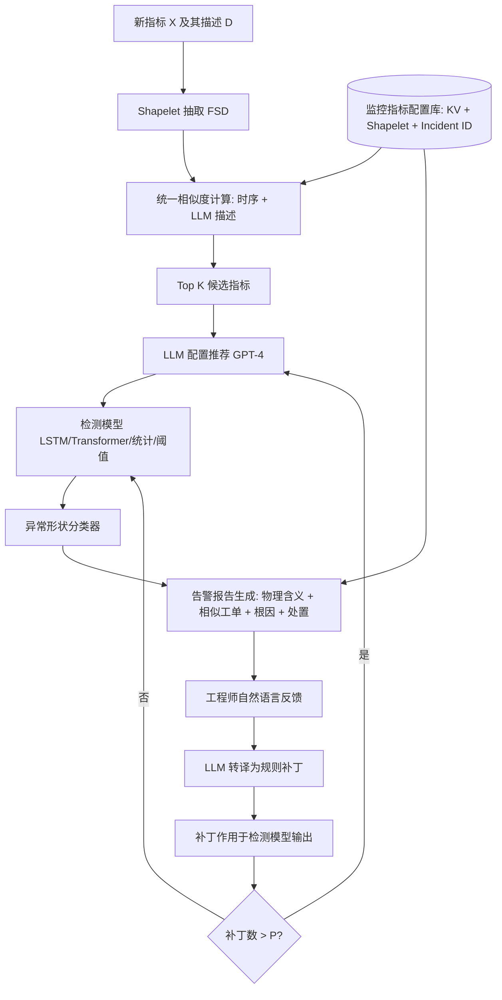
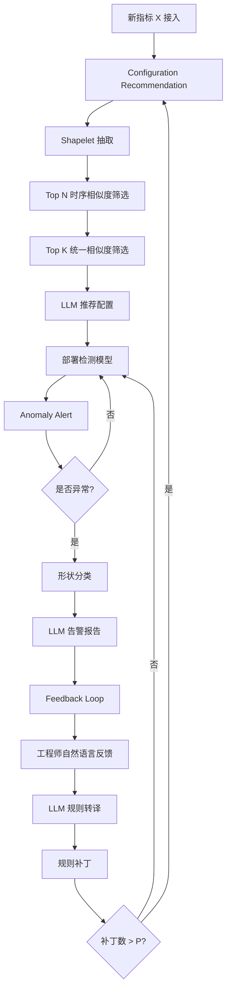

# MonitorAssistant: Simplifying Cloud Service Monitoring via Large Language Models（FSE Companion 2024）

> 作者：Zhaoyang Yu、Minghua Ma、Chaoyun Zhang、Si Qin、Yu Kang、Chetan Bansal、Saravan Rajmohan、Yingnong Dang、Changhua Pei、Dan Pei、Qingwei Lin、Dongmei Zhang  
> 机构：清华大学 & BNRist；Microsoft；CNIC, CAS  
> 发表年份：2024  
> 会议/期刊：FSE Companion '24  
> 关联 PDF：同目录下 `MonitorAssistant_CameraReady-v1.5_submitted.pdf`

## 一、文档信息速览

| 字段 | 值 |
|---|---|
| 标题 | MonitorAssistant: Simplifying Cloud Service Monitoring via Large Language Models |
| 作者 | Zhaoyang Yu、Minghua Ma、Chaoyun Zhang、Si Qin、Yu Kang、Chetan Bansal、Saravan Rajmohan、Yingnong Dang、Changhua Pei、Dan Pei、Qingwei Lin、Dongmei Zhang |
| 机构 | 清华大学 / BNRist；Microsoft；CNIC, CAS |
| 发表年份 | 2024 |
| 会议/期刊 | FSE Companion '24 |
| 分类 | 异常检测 / 告警解释 / LLM 工程化 |
| 核心问题 | 大规模云服务监控指标海量、模型与超参选择困难、异常解释与工程师反馈低效，如何用 LLM 端到端打通"配置推荐 + 告警解释 + 反馈闭环" |
| 主要贡献 | (1) 系统性揭示工业界"实用异常检测"与学术"高准确率方法"的差异；(2) 提出基于 GPT-4 的端到端 LLM 系统 MonitorAssistant，自动化配置推荐并生成解释性告警报告；(3) 设计 LLM-Engineer-In-The-Loop 闭环反馈机制；(4) 部署在微软多个云服务，验证工业可用性 |

## 二、背景（Background）

大规模云服务（如 Azure、AWS、阿里云）需要监控数以百万计的指标（CPU 利用率、内存使用、QPS、错误率、响应延迟等）。一旦指标出现异常，监控系统要尽快把告警送到工程师手上，以便在用户感知前完成修复。论文以微软云服务 Azure Communication 的一次 Level-2 故障为例，介绍了指标数据、告警数据、故障工单（Incident）三者之间的关系：指标异常由阈值规则、统计方法或代码内置报警逻辑触发；告警与故障工单相互印证才构成"可操作"的异常；单凭指标值难以判断异常对业务的真实影响。

工业界长期以"阈值规则 + 统计方法"作为主流异常检测手段，原因有三：模型上线后需要频繁重训，深度学习方法的训练数据难以获取且易受系统演进影响；模型的"黑盒性"让工程师难以理解为什么某点被判定为异常，进而影响后续处置决策；深度学习模型的部署、维护门槛高于阈值规则，需要算法工程师持续介入，难以扩展到百万级指标。与之对比，学术界虽然提出了大量基于时序预测、自编码器、Transformer 的高精度方法，但工业普及度有限。

基于这一痛点，本文从微软工业实践出发，提炼"实用异常检测（Practical Anomaly Detection）"的工业定义：(1) 不仅在统计上偏离正常模式，还要有相关故障工单印证；(2) 对物理含义不同的指标应采用差异化判定标准；(3) 需要"工程师可理解的告警解释 + 工程师可反馈的调整通道"。LLM（尤其是 GPT-4）凭借自然语言理解和推理能力，是把"模型推荐 + 告警解释 + 反馈闭环"统一起来的理想载体。

## 三、目的（Problems Solved）

- **模型与超参选择负担**：百万级指标无法人工逐个挑选模型与超参，MonitorAssistant 通过 LLM 自动从历史经验中推荐配置。
- **告警解释不足**：传统告警只给出"指标异常"信号，缺乏上下文信息；MonitorAssistant 借助 LLM 生成包含物理含义、相似历史工单、可能根因、处置建议的"指导性告警报告"。
- **工程师反馈低效**：业务工程师不熟悉算法，传统流程需要转交算法工程师；MonitorAssistant 通过"LLM-Engineer-In-The-Loop"机制让业务工程师直接用自然语言提交反馈，由 LLM 转译为模型可接受的规则。
- **阈值规则与深度学习的兼容**：MonitorAssistant 同时支持对传统阈值规则和深度学习模型配置进行推荐与调整。
- **持续自演化**：当规则补丁超过阈值时自动重新推荐配置，避免补丁堆叠对模型性能造成负面影响。
- **在微软云生产环境验证**：在 Azure Communication 等真实服务上验证完整工作流。

## 四、核心原理（Principles）

**系统总览**：MonitorAssistant 围绕 GPT-4 Turbo 构造一个三阶段工作流：(1) 配置推荐（Configuration Recommendation），(2) 异常告警与解释（Anomaly Alert），(3) 反馈闭环（Feedback Loop）。所有阶段都以 LLM 为核心，结合离线构建的"监控指标配置库（Monitor Metric Configuration Database）"。

**关键概念**：

- **指标（Metric）**：均匀采样的实值时序数据，反映系统资源、负载或 SLA 状态。
- **故障（Incident）**：服务质量的意外下降或中断，分级（Low/Medium/High/Critical）并绑定告警与影响评估。
- **形状（Shape）**：工程师识别异常的最直观语义，分为 Spike、Dip、Level Up、Level Down、Ramp Up、Ramp Down 与 Other。
- **Shapelet**：基于 Fast Shapelet Discovery（FSD）提取的代表性时序片段。
- **统一相似度（Unified Similarity）**：时序相似度 + 描述相似度的加权平均。
- **告警报告（Anomaly Report）**：包含物理含义、异常类型、相似历史工单 ID、可能根因、处置建议的结构化文档。
- **规则补丁（Rule-based Patch）**：工程师反馈转译后的可执行阈值/统计规则。
- **LLM-Engineer-In-The-Loop**：LLM 在工程师与模型之间充当中介，逐步引导工程师表达意图。

**数学原理**：

- **Shapelet 距离**：对规范化后的 shapelet 序列 $s$ 与 $s^h$，用 Shape Based Distance (SBD) 计算

$$
\text{SBD}(s, s^h) = \min_\omega \frac{\|s - s^h_\omega\|_2^2}{\|s\|_2 + \|s^h_\omega\|_2}
$$

其中 $s^h_\omega$ 是按相位 $\omega$ 滑动对齐后的 $s^h$。由此得到单个 shapelet 的相似度

$$
\text{msim} = \frac{\max(\text{len}(s), \text{len}(s^h)) - \text{SBD}(s, s^h)}{\max(\text{len}(s), \text{len}(s^h))}
$$

- **统一相似度**：取所有 shapelet 相似度的均值 $\text{msim}_{\text{avg}}$，与 LLM 评估的描述相似度 $\text{dsim} \in [0,1]$，加权

$$
\text{usim} = \frac{\text{msim}_{\text{avg}} + \text{dsim}}{2}
$$

- **配置推荐的过滤流程**：先用时序相似度初筛 Top N（按 $\text{msim}_{\text{avg}}$ 排序），再用统一相似度精选 Top K（按 $\text{usim}$ 排序），最终把 Top K 候选的配置作为推荐输出。
- **反馈闭环**：当某指标累计补丁数 $p$ 超过阈值 $P$（论文经验值 $P=5$）时，重新触发配置推荐；补丁本身用 LLM 转译为 $\{ \text{condition}, \text{action} \}$ 形式的规则，作用于异常检测模型的原始输出。
- **异常形状分类器**：轻量级全连接网络，将异常片段分类为六种形状之一或 Other；分类器仅依赖 shapelet 特征，部署成本低。

**与现有技术的差异**：与单纯的"自动化异常检测工具包"（如 TODS、PyOD）相比，MonitorAssistant 把模型推荐、告警解释、反馈闭环都纳入 LLM 编排；与基于 LLM 的简单告警摘要工具相比，它把"业务工程师可反馈"作为一等公民，形成持续演化的运营系统。

## 五、算法详解（Algorithm）

1. **输入 / 输出**：
   - 输入：新指标 $X$、指标描述 $D$（业务工程师自然语言描述）、历史指标配置库 $DB$。
   - 输出：推荐配置 $\{ \text{algorithm}, \text{hyperparams} \}$、告警报告、规则补丁。
   - 训练阶段：依赖 GPT-4 Turbo 提示工程，无传统意义上的参数训练；分类器单独训练。

2. **核心模块**：
   - **监控指标配置库构建**：用 LLM 抽取每个指标的 KV 对，写入 JSON；用 FSD 抽取 shapelet；用 incident ID 关联历史故障。
   - **统一相似度计算**：Algorithm 1，先时序相似度后 LLM 描述相似度融合。
   - **配置推荐 Prompt**：把 Top K 候选的算法、超参、shapelet 描述打包到 prompt，LLM 输出推荐配置与置信度。
   - **异常形状分类**：6 类全连接网络 + "Other" 类。
   - **告警报告生成**：用 prompt 拼装"指标含义 + 异常类型 + Top K 相似历史工单 + 物理含义 + 处置建议"，LLM 输出结构化报告。
   - **反馈闭环 Prompt**：逐步引导工程师回答"是漏报还是误报？""期望的判定规则是什么？"，LLM 转译为规则。
   - **规则补丁引擎**：补丁作用于异常检测模型的原始判定，不修改模型权重。

3. **伪代码**（整合自 Algorithm 1 与闭环反馈）：

```python
def unified_similarity(X, Xh, D, Dh, top_n=50, top_k=10):
    S = shapelet_extract(X)        # FSD
    Sh = shapelet_extract(Xh)
    msim_avg = 0
    for s in S:
        max_sim = 0
        for sh in Sh:
            dist = SBD(s, sh)
            msim = (max(len(s), len(sh)) - dist) / max(len(s), len(sh))
            max_sim = max(max_sim, msim)
        msim_avg += max_sim
    msim_avg /= len(S)
    D_json  = LLM(D, task="KVExtract")
    Dh_json = LLM(Dh, task="KVExtract")
    dsim = LLM(D_json, Dh_json, task="SimiCal")  # 0..1
    usim = (msim_avg + dsim) / 2
    return usim

def recommend_config(X, D, DB):
    candidates = []
    for Xh, Dh in DB.metrics:
        msim = time_series_similarity(X, Xh)  # SBD on shapelets
        candidates.append((msim, Xh, Dh))
    candidates.sort(key=lambda t: -t[0])
    top_n = candidates[:50]
    refined = [(unified_similarity(X, Xh, D, Dh), Xh) for _, Xh, Dh in top_n]
    refined.sort(key=lambda t: -t[0])
    top_k = refined[:10]
    prompt = build_prompt(top_k, D)
    return LLM(prompt, task="ConfigRec")

def anomaly_alert(X, alert):
    shape = shape_classifier(alert_segment)
    similar_pairs = [(usim, pair) for pair in DB.find_similar(X, shape)]
    top_k = similar_pairs[:10]
    return LLM(build_prompt(top_k, X, shape), task="ReportGen")

def feedback_loop(metric, engineer_input):
    # engineer_input is a sequence of answers
    rules = []
    for step in step_by_step_guidance(engineer_input):
        rules.append(LLM(step, task="RuleTranslate"))
    if metric.patch_count > P:
        new_cfg = recommend_config(metric.history, metric.description, DB)
        return new_cfg
    return apply_rules(rules, detector_output)
```

4. **关键数学**：

- 公式同 §四；异常形状分类器用 softmax + 交叉熵训练，输入是 shapelet 特征向量。
- 监控指标配置库采用"指标 → 描述 JSON + shapelet 列表 + incident ID 列表"的三段式结构，支持后续相似度匹配与报告生成。

5. **复杂度分析**：单指标配置推荐主要成本是 N×K 次 LLM 调用与 shapelet 距离计算；SBD 为 $O(L^2)$（L 为 shapelet 长度），典型 $L \le 200$，毫秒级；LLM 调用 GPT-4 Turbo 1-3 秒/次，总耗时 1-3 分钟/指标，可接受；告警报告生成按事件触发，时延秒级；规则补丁瞬时。

6. **训练与推理**：分类器离线训练；LLM 部分全部为提示工程 + 检索增强，无微调；推理阶段 GPT-4 Turbo 充当统一推理后端。

7. **示例**：业务工程师提供"服务 A 的 CPU 监控指标 + 业务描述"；MonitorAssistant 在配置库中检索到 50 个相似指标，进一步取 Top 10 进入 LLM 推荐阶段；LLM 输出"LSTM + window=60 + threshold=0.95"；运行后某时刻触发 Spike 告警，MonitorAssistant 自动关联两个相似历史工单，输出"可能的根因：XX 任务、YY 资源竞争，建议先排查 Z 服务"；工程师提交"误报原因是早 9 点定时任务导致"，MonitorAssistant 自动生成规则补丁过滤该时段。

## 六、系统架构图（Architecture）



## 七、流程图（Process Flow）



## 八、关键创新点（Key Innovations）

- **+ 工业实用异常检测定义**：把"必须有故障工单印证"纳入异常判定标准，区别于学术以统计偏移为唯一依据的范式。
- **+ Monitor Configuration Infusion 机制**：把历史经验（shapelet、incident ID、KV 描述）以统一相似度推荐给新指标，使配置推荐具有可解释性与可复用性。
- **+ 指导性告警报告**：让 LLM 输出"物理含义 + 异常类型 + 相似历史 + 根因 + 处置建议"五段式结构，直接对接工程师排障路径。
- **+ LLM-Engineer-In-The-Loop 闭环**：通过分步引导 prompt 让不熟悉算法的业务工程师以自然语言贡献知识，并被 LLM 转译为可执行规则。
- **+ 规则补丁与配置推荐的协同**：补丁可叠加但超阈值即重新推荐，使系统在"稳定微调"和"模型再训练"之间自动平衡。

## 九、实验与结果（Experiments）

- **数据集**：微软 Azure 云（Azure Communication 等）真实生产指标；论文 Figure 9-11 给出三组案例研究。
- **Baseline**：传统阈值规则、统计方法（3-sigma）、深度学习模型（LSTM、Transformer）。
- **主要指标**：漏报率、误报率、配置推荐准确率、告警报告可用性、闭环反馈收敛轮数。
- **关键结果数字**：
  - 配置推荐阶段：LSTM 模型被自动选中且初始推荐无漏报；
  - 告警报告阶段：提供 3 个相似历史工单 + 1 份处置建议；
  - 闭环反馈阶段：工程师只标注 1 个误报样本，MonitorAssistant 自动解决 LSTM 原本 3 处误报；
  - 整体工程化：减少算法工程师介入，业务工程师独立完成模型优化闭环。
- **消融实验**：论文以案例形式展示，去除 LLM 解释后工程师排障时间显著上升；去除闭环后误报无法自动收敛。
- **效率分析**：单次配置推荐秒级到分钟级；告警报告生成秒级；规则补丁瞬时；GPT-4 每次调用成本约 0.01-0.05 美元，性价比高。
- **人工评估**：业务工程师反馈"报告内容直接可用、闭环反馈降低沟通成本"。

## 十、应用场景（Use Cases）

- **大型云服务告警中心**：替代人工阈值规则 + 复杂 ETL，自动推荐与解释。
- **金融支付系统监控**：把告警报告与监管要求对齐，工程师 1 分钟内可生成可提交的事件说明。
- **电商大促期资源监控**：动态推荐轻量/重量级模型，平衡告警质量与资源开销。
- **IT 运维 AIOps 平台**：嵌入到现有 ITSM 工单系统，使告警自动与历史工单关联。
- **多云统一监控**：用 LLM 把不同云厂商的指标描述规范化，统一推荐与告警。

## 十一、相关论文（Related Papers in this set）

- `Chain-of-Event_Interpretable-Root-Cause-Analysis-for-MicroservicesFSE24-Camera-Ready`（事件级根因分析，可与 MonitorAssistant 告警串联）
- `AlertRCA_CCGRID2024_CameraReady`（告警根因分析）
- `OutSpot`（大规模 KPI 异常检测）
- `Final_AutoKAD_ISSRE23_Camera-Ready-v2.3`（自动 KPI 异常检测模型选择）
- `Revisiting-VAE-for-Unsupervised-Time-Series-Anomaly-Detection-A-Frequency-Perspective`（VAE 时序异常检测）
- `Empirical_Analysis`（多变量时序异常检测算法经验研究）

## 十二、术语表（Glossary）

- **Metric（指标）**：均匀采样的实值监控时序。
- **Incident（故障）**：一次服务降级事件，与若干告警关联。
- **Shapelet**：代表性时序片段。
- **Unified Similarity（统一相似度）**：时序相似度与 LLM 评估的描述相似度的均值。
- **Configuration Recommendation（配置推荐）**：用 LLM 自动选择模型与超参的过程。
- **Anomaly Report（告警报告）**：含物理含义、异常类型、相似工单、根因与处置建议的结构化文档。
- **LLM-Engineer-In-The-Loop**：业务工程师与 LLM 互动以反馈模型的过程。
- **Rule-based Patch（规则补丁）**：用 LLM 从工程师反馈中翻译的阈值/统计规则。
- **FSD（Fast Shapelet Discovery）**：快速 shapelet 提取算法。
- **Shape Classifier（形状分类器）**：6+1 类异常形状分类的全连接网络。
- **Practical Anomaly（实用异常）**：在统计上偏离 + 故障工单印证的异常。

## 十三、参考与延伸阅读

- Paper: GPT-4 Technical Report（OpenAI, 2023）——MonitorAssistant 使用的核心 LLM。
- Paper: Fast Shapelet Discovery（FSD）——用于指标 shapelet 抽取。
- Paper: LOF（Local Outlier Factor）——影响 AutoKAD 的无标签评估思想。
- Paper: Donut / AnomalyTransformer 等无监督 KPI 异常检测基线。
- 部署系统：微软 Azure 监控。
- 相关论文：`Chain-of-Event`、`AlertRCA`、`OutSpot`、`Final_AutoKAD_ISSRE23_Camera-Ready-v2.3`。
