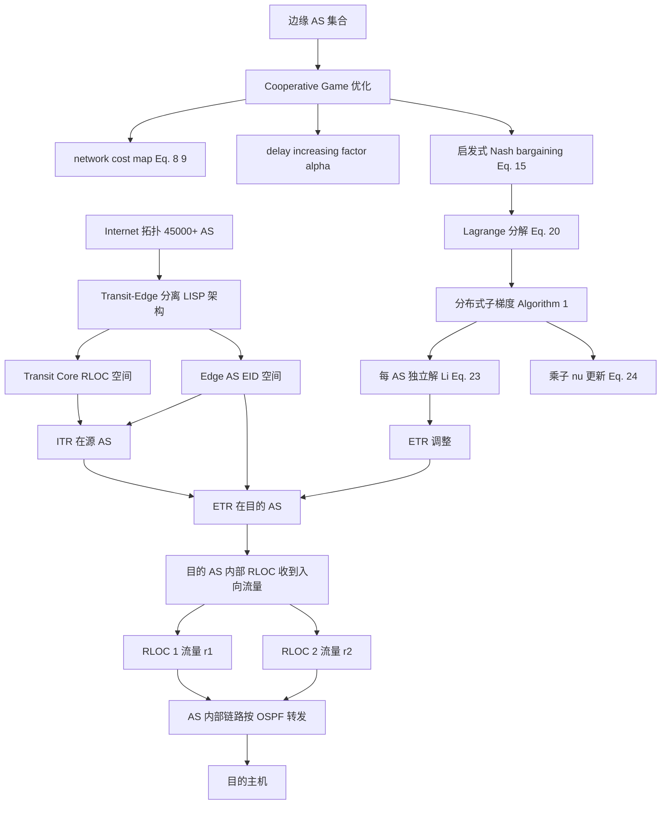
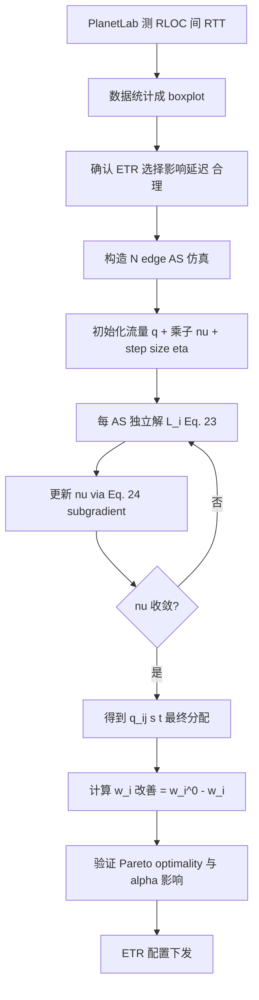

# Multi-AS Cooperative Incoming Traffic Engineering in a Transit-Edge Separate Internet（Computer Networks 2014）

> 作者：Yaodong Zhang, Yue Wang, Dan Pei（通讯作者）, Jian Yuan
> 机构：清华大学（北京）
> 发表年份：2014
> 会议/期刊：Computer Networks, vol. 73, pp. 112–127, 2014（Elsevier）
> 关联 PDF：同目录下 `Multi-AS-cooperative-incoming-traffic-engineering-in-a-transit-edge-separate-internet-zhang2014.pdf`

## 一、文档信息速览

| 字段 | 值 |
|---|---|
| 标题 | Multi-AS cooperative incoming traffic engineering in a transit-edge separate internet |
| 作者 | Yaodong Zhang、Yue Wang、Dan Pei（通讯作者）、Jian Yuan |
| 机构 | 清华大学电子工程系 |
| 发表年份 | 2014 |
| 会议/期刊 | Computer Networks (Elsevier)，vol. 73，pp. 112–127 |
| 分类 | 互联网路由 / 流量工程 / LISP / 博弈论 |
| 核心问题 | Transit-Edge 分离架构（如 LISP）下，多个自私的 edge AS 各自选择 ETR 时只优化自身延迟、忽略其他 AS 的 incoming traffic engineering 性能，导致目标 AS 入向负载不均、网络鲁棒性下降 |
| 主要贡献 | (1) 分析 LISP 架构下 edge AS 之间的 ETR 选择冲突；(2) 提出"多 AS 协作 incoming TE"框架，edge AS 牺牲有限延迟换全局 TE 性能；(3) 在 PlanetLab 上实测不同 RLOC 间延迟差异验证假设；(4) 用启发式 cooperative game + Lagrange 分解给出分布式求解算法；(5) 用 Abilene / CERNET 拓扑仿真验证 Pareto optimality 与延迟容忍因子 α 的影响 |

## 二、背景（Background）

互联网由 45000+ AS 组成，其中 ~84% 是 edge AS（仅作为源/目的 AS），其余为 transit AS。Edge AS 通常 multi-homed（多宿主），通过不同 transit 路径到达对方。Inter-domain TE 包含 outgoing TE（容易，源 AS 自主选出口）和 incoming TE（困难，目的 AS 的入向由其他 AS 决定）。理想 incoming TE 是让到达各 RLOC 的流量均匀分布，提升链路利用率、降低拥塞概率。

BGP 提供粗粒度的入向 TE 工具（前缀宣告、AS 路径、MED），但 AS 间通常自私地采用 hot-potato 等策略最大化自身目标，忽略对邻居 AS 入向 TE 的影响，导致邻居 AS 入向流量不均、鲁棒性下降。

新一代网络架构——Transit-Edge Separation（代表：LISP）——可极大缓解 BGP 全局路由表规模（43–90% 减小），并为 edge AS 之间提供更直接的入向 TE 接口。LISP 把核心（transit）与端系统（end-host）地址空间分开：Routing Locator（RLOC，标识 edge router）与 Endpoint Identifier（EID，标识端主机）。ITR/ETR（合称 xTR）在两个空间之间做映射。ETR 选择本应平衡入向负载，但 LISP RFC 并未明确多 AS 场景下的协商机制。

论文用 LISP 作为典型场景，研究多 AS 协作入向 TE：让多个 edge AS 牺牲有限延迟（受 delay increasing factor $\alpha_i$ 约束）来换整体 TE 性能 Pareto 改进。

## 三、目的（Problems Solved）

- **ETR 选择冲突**：分析 LISP 中 ETR 选择的延迟 vs 入向 TE 冲突。
- **自私行为导致的入向负载不均**：提出 cooperative incoming TE 框架，edge AS 通过合作避免成为别人"最差" ETR。
- **多 AS 优化目标的形式化**：用启发式 cooperative game（基于 Nash bargaining 的变换）形式化 social utility，平衡各 AS 的入向 TE 改善与其延迟牺牲。
- **分布式求解**：将原问题通过 Lagrange 分解 + 子梯度方法转化为每 AS 独立求解子问题，并用 $\nu$ 乘子迭代对齐。
- **延迟容忍因子 $\alpha$ 的影响**：给出 $\alpha$ 在 Pareto 最优解和合作收益上的定量分析。
- **真实数据集验证**：用 PlanetLab 6 个欧洲 AS 测量 RLOC 间 RTT，仿真 Abilene / CERNET 内部拓扑。

## 四、核心原理（Principles）

**Notation（Table 1）**：
- $AS_i$：第 i 个 edge AS。
- $RLOC_{is}$：$AS_i$ 的第 s 个 RLOC；$K_i$ 为 $AS_i$ 的 RLOC 数。
- $q_{ij}(s,t)$：从 $RLOC_{is}$ 到 $RLOC_{jt}$ 的流量。
- $d_{ij}(s,t)$：$RLOC_{is}$ 到 $RLOC_{jt}$ 的 one-way delay。
- $Q_{ij}(s)$：$RLOC_{is}$ 发往 $AS_j$ 的总流量需求。
- $r_i(s)$：$AS_i$ 经 $RLOC_{is}$ 收到的入向流量。
- $E_i$：$AS_i$ 内部链路集合。
- $b_{il}(s)$：$r_i(s)$ 走内部链路 l 的比例。
- $C_l$、$u_l$、$\hat u_l = u_l/C_l$：链路 l 的容量、负载、归一化负载。
- $w_i$：$AS_i$ 的网络成本（流量工程指标），本文使用 network cost（map 后的链路 cost 之和）。
- $\alpha_i$：$AS_i$ 的延迟容忍因子（合作后 $d_i \le \alpha_i d_i^0$）。
- $a_k$：第 k 个 AS 的 $\alpha_k$（$a=\sum a_k$）。

**核心方程**：

1. **$AS_i$ 与 $AS_j$ 间的总延迟**（Eq. 1）：

$$
d_{ij} = d_{ji} = \sum_{s=1,2} \sum_{t=1,2} \left[ q_{ij}(s,t) d_{ij}(s,t) + q_{ji}(t,s) d_{ji}(t,s) \right]
$$

2. **$AS_i$ 的总延迟**（Eq. 2）：

$$
d_i = \sum_{j \in N_i} d_{ij}
$$

3. **流量需求约束**（Eq. 3）：

$$
Q_{ij}(s) = \sum_{t=1}^{K_j} q_{ij}(s,t), \quad \forall i, j, s=1,\ldots, K_i
$$

4. **入向流量约束**（Eq. 4）：

$$
r_i(s) = \sum_{j \neq i} \sum_{t=1}^{K_j} q_{ji}(t,s), \quad \forall i, s=1,\ldots, K_i
$$

5. **内部链路负载**（Eq. 5）：

$$
u_l = \sum_{s=1}^{K_i} b_{il}(s) r_i(s), \quad \forall i, l \in E_i
$$

6. **归一化链路负载**（Eq. 6）：

$$
\hat u_l = u_l / C_l
$$

7. **网络成本**（Eq. 8，increasing convex map 后的 cost 之和）：

$$
w_i = \sum_{l \in E_i} \phi(\hat u_l), \quad \forall i
$$

**Cooperative incoming TE 优化目标**（Eq. 15，启发式 Nash bargaining 变换）：

$$
\max U = \prod_i \left( w_i^0 - w_i \right)^{\sum_{k} a_k / a_k}
$$

受约束：
- $d_i \le \alpha_i d_i^0$
- $Q_{ij}(s) = \sum_t q_{ij}(s,t)$
- $q_{ij}(s,t) \ge 0$

等价地最大化对数形式（Eq. 16）：

$$
\max \ln U = \sum_i \frac{a_i}{\sum_k a_k} \ln(w_i^0 - w_i)
$$

**Lagrange 分解**：对偶函数 Eq. 20：
- $\nu_{ji}(t,s)$ 是 lagrangian 乘子；
- 每个 $AS_i$ 独立解自己的子问题 $L_i$（Eq. 22/23），只用本地信息。
- 乘子按 Eq. 24 更新：

$$
\nu_{ji}^{k+1}(t,s) = \max\left( 0, \nu_{ji}^k(t,s) - \eta \frac{\partial L}{\partial \nu_{ji}(t,s)}\big|_k \right)
$$

$\eta$ 满足 diminishing step size 规则。算法 1 给出完整分布式实现。

**凸性证明**：Eq. 27 给出 $\partial^2 z / \partial q_{ji}(t,s)^2 \le 0$，所以 Eq. 15 是凸问题，可由 KKT/Lagrange 对偶求解。

**Network cost map $\phi$**（Eq. 9，[20]）：

$$
\phi(\hat u) = \begin{cases}
\hat u, & 0 \le \hat u < 1/3 \\
3\hat u - 2/3, & 1/3 \le \hat u < 2/3 \\
10\hat u^2 - 163/18 \cdot \hat u + 3, & 2/3 \le \hat u < 9/10 \\
70\hat u - 67/3, & 9/10 \le \hat u < 1 \\
500\hat u - 1468/3, & 1 \le \hat u < 11/10 \\
5000\hat u - 16318/3, & 11/10 \le \hat u < 1
\end{cases}
$$

## 五、算法详解（Algorithm）

1. **输入 / 输出**
   - 输入：N 个 edge AS、每 AS 的 $K_i$ 个 RLOC、每对 RLOC 间的延迟 $d_{ij}(s,t)$、流量需求 $Q_{ij}(s)$、内部链路 set $E_i$、$\alpha_i$。
   - 输出：每对 AS 之间的流量分配 $q_{ji}(t,s)$，满足约束条件下使 social utility $U$ 最大化。
2. **核心模块**
   - **PlanetLab 延迟测量**：在 6 个欧洲 AS（AS 137/224/378/559/766/786）上跑 ping，每小时记录不同 RLOC 对间 RTD，用 boxplot 给出统计特性。
   - **Network cost map**：将 $\hat u_l$ 映射为 increasing convex cost score。
   - **Lagrangian decomposition**：引入 artificial incoming variables $q'_{ji}(t,s)$，添加 Eq. 19 约束 $q'_{ji}=q_{ji}$，构建 Eq. 20 对偶问题。
   - **Distributed subgradient (Algorithm 1)**：初始化 step size $\eta$ 和 Lagrange 乘子 $\nu_{ji}(t,s)$；每 AS 独立解 Eq. 23；按 Eq. 24 更新 $\nu$；直到 $\nu$ 收敛。
3. **伪代码**

```python
def cooperative_incoming_te(ases, q_init, nu_init, eta, alpha):
    """
    ases: list of AS objects, each with K_i RLOCs, E_i internal links, demand Q
    q_init: initial flow q_{ji}(t,s)
    nu_init: initial Lagrange multipliers nu_{ji}(t,s)
    eta: initial step size (diminishing)
    alpha: per-AS delay tolerance factor
    """
    nu = nu_init
    while not converged(nu):
        # Step 3: each AS independently solves its own L_i (Eq. 23)
        local_solutions = {}
        for ASi in ases:
            # given current nu, minimize L_i over ASi's outgoing q_{ij}(s,t)
            local_solutions[ASi] = ASi.solve_local_Li(nu, alpha[ASi])

        # Step 4: update nu via subgradient
        for (i, j, t, s), nu_val in nu.items():
            grad = local_solutions[j].q_out[j,i,s] - local_solutions[i].q_in[j,t,s]
            nu[(i, j, t, s)] = max(0, nu_val - eta * grad)

        eta = eta * decay_factor  # diminishing step size

    # Output: each AS's outgoing flows q_{ij}(s,t)
    return {ASi: local_solutions[ASi].q_out for ASi in ases}
```

4. **关键数学**：见 §四（Eqs. 1–27）。
5. **复杂度分析**
   - 原问题（集中式）：变量 $N + \sum_i K_i(N-1)$、约束 $\sum_i K_i(N-1) + N$ 随 $N, K_i$ 非线性增长，无法用一般 solver 求解。
   - 分布式（Lagrange 分解）：每 AS 独立解子问题，乘子迭代次数通常有限（§3.4 给出 $\nu$ 收敛的 diminishing step size 论证）。
6. **训练与推理**：无机器学习；纯凸优化 + 分布式算法。
7. **示例**：2 AS 场景（Abilene 拓扑，$a_1=a_2=1.1$，路径延迟如 Fig. 7）。不合作时 $w_1=w_2=168.9$；合作 Pareto feasible region 内最优时 $w_1=w_2=76.1$（均衡最低网络成本），证明 Pareto optimality。10 AS 场景中，单个 AS 改变 $\alpha_1$ 对其它 AS 的影响显著弱化（Fig. 10b–d 中其他 AS 的 cost 几乎不变）。

## 六、系统架构图（Architecture）



## 七、流程图（Process Flow）



## 八、关键创新点（Key Innovations）

- **+ LISP 架构下多 AS ETR 冲突的明确形式化**：用 delay + network cost 两个性能维度刻画 ETR 选择的两难。
- **+ 启发式 cooperative game 目标**：用 $\sum_k a_k / a_k$ 指数加权的 product-of-utilities 形式，规避标准 Nash bargaining 在 TE-延迟联合优化中"两个性能无法合成一个 utility"的困难。
- **+ Lagrange 分解 + 分布式 subgradient 求解**：避免集中式求解器难以处理的大规模非线性约束。
- **+ PlanetLab 实证延迟数据**：6 个欧洲 AS 间 RTD 的 boxplot 表明中位 RTT 随路径变化显著（>3 倍），证明把延迟牺牲纳入考虑是必要的。
- **+ Abilene / CERNET 拓扑仿真**：6 AS 场景下，90% 仿真运行总 cost 下降 60–180；2 AS 场景严格验证 Pareto optimality。
- **+ $\alpha$ 的参数影响分析**：2 AS 时 $\alpha$ 增大显著降低双方 cost；多 AS 时影响迅速局部化（其它 AS cost 几乎不变）。

## 九、实验与结果（Experiments）

- **PlanetLab 测量**：1173 节点 / 561 site；选 AS 137/224/378/559/766/786 6 个 AS；每小时 ping 累计 1 个月；图 3 给 boxplot，例如 AS 766 ↔ AS 786 中位 RTD <40ms，而 AS 766 ↔ AS 137 RTD 远高于此。
- **仿真设置**：
  - 6 edge AS，每 AS 2 RLOC（典型现实，仅 17% 边缘 AS 有 >2 RLOC）。
  - 内部拓扑：Abilene（11 节点）与 CERNET；OSPF + 建议链路权重。
  - 内部链路容量 10Gbps；总合作入向流量 10Gbps；每 RLOC 1Gbps。
  - 延迟：复用 PlanetLab 测得 RTD（每对 AS 4 条路径）。
  - $\alpha_i=1.2$（默认）。
  - 100 组随机延迟数据。
- **关键结果**：
  - **总网络成本下降（图 4）**：Abilene 90% 仿真运行总 cost 下降 60–180；CERNET 也有 0.06–22 区间的下降。
  - **个体网络成本（图 5）**：合作后各 AS 网络成本都不会上升；初始 cost 越高的 AS 改善越大。
  - **Pareto optimality（图 8）**：2 AS Abilene + $a_1=a_2=1.1$ 时，初始 $w=168.9$ → 合作可行域内最低 $w=76.1$（双方均衡下降）。
  - **$\alpha$ 影响（图 9）**：$a \le 1.3$（Abilene）/1.25（CERNET）时双方 cost 持续下降；超过该阈值后不再改善。
  - **$\alpha$ 不对称（图 10）**：当 $a_1 > a_2$ 时 AS1 cost 进一步下降，AS2 上升但不超过其初始 cost；多 AS 场景该影响迅速局部化（10 AS 时其他 AS cost 几乎不变）。
- **诚实性分析**：每 AS 提交自己的 $\alpha_i$、$w_i^0$、$Q_{ij}(s)$、$d_{ij}(s,t)$；traffic volume $q_{ij}(s,t)$ 由双方共同提交可校验；论文认为在长周期（月/季）算法时间尺度下，自私撒谎收益小、风险大。

## 十、应用场景（Use Cases）

- **LISP 大规模部署的入向 TE 优化**：Facebook 等已用 LISP 试验；论文给出多 AS 协调机制。
- **ISP 间的 cooperative TE**：自治、互不信任的多 ISP 之间按月/季协商长期 TE 配置。
- **数据中心边缘 PoP 之间的入向负载均衡**：LISP 风格映射适用于边缘 AS 多 PoP 场景。
- **SDN/NFV 控制面决策**：把 cooperative game 作为 SDN 应用层决策器。
- **卫星 / 海底光缆多宿主 TE**：高延迟差异场景下本方案的延迟牺牲成本可量化。

## 十一、相关论文（Related Papers in this set）

- `f2tree`（IEEE/ACM TON 2017）（DCN 路由快速恢复）
- `F2Tree-ICDCS15`（会议版 F2Tree）
- `CQRD-ComputerNetworks15`（CQRD 队列管理）
- `CQRD-LCN`（CQRD 会议短版）
- `FUSO-ATC16`（多路径 TCP 快速重传）
- `conext15-final2`（FUNNEL 软件变更性能评估）
- `NLB-ICCCN2015-paper`（NDN 直播 WLAN）
- `firewall`（防火墙指纹与 DoF 攻击）
- `chen_npc14_CQ`（CQ 交换机 buffer 容量设计）

## 十二、术语表（Glossary）

- **AS (Autonomous System)**：自治系统。
- **BGP (Border Gateway Protocol)**：域间路由协议。
- **Transit / Edge AS**：中转 / 边缘 AS。
- **LISP (Locator/ID Separation Protocol)**：IETF 标准，把 RLOC 与 EID 分离。
- **ITR / ETR / xTR**：Ingress/Egress/x Tunnel Router。
- **EID / RLOC**：Endpoint Identifier / Routing Locator。
- **Multi-homing**：一个 AS 通过多条路径连接 Internet。
- **Hot-Potato Routing**：AS 尽快把流量交给邻居 AS 的策略。
- **Incoming TE**：目的 AS 的入向流量工程。
- **Pareto Optimality**：多目标优化的帕累托最优。
- **Nash Bargaining**：合作博弈中的纳什议价解。
- **Lagrange Decomposition**：把耦合约束问题分解为可分布式求解的子问题。
- **Subgradient Method**：处理非可微凸优化的迭代方法。
- **KKT Conditions**：凸优化 KKT 最优条件。
- **Network Cost**：把链路负载通过 increasing convex map 后的 cost 之和。
- **Delay Increasing Factor $\alpha_i$**：合作后延迟相对初始延迟的容忍上限。
- **Abilene / CERNET**：美国 Internet2 与中国教育网拓扑。

## 十三、参考与延伸阅读

- Paper: Multi-AS Cooperative Incoming TE in Transit-Edge Separate Internet（本文）。
- Paper: LISP RFC 6830（D. Farinacci 等）。
- Paper: BGP4（Stewart, 1998）——BGP 详解。
- Paper: Shrimali et al. (2010) Cooperative Interdomain TE using Nash bargaining。
- Paper: Secci et al. (2011, 2012) Transit-Edge Separated Internet 与两 AS 合作 TE。
- Paper: Mahajan et al. (NSDI 2005, 2007) ISP 间协商路由。
- 工具：PlanetLab、NS2/NS3、SNMP、CoDel 等。
- 相关论文：`f2tree`、`F2Tree-ICDCS15`、`CQRD-ComputerNetworks15`、`CQRD-LCN`、`FUSO-ATC16`、`conext15-final2`、`NLB-ICCCN2015-paper`、`firewall`、`chen_npc14_CQ`。
