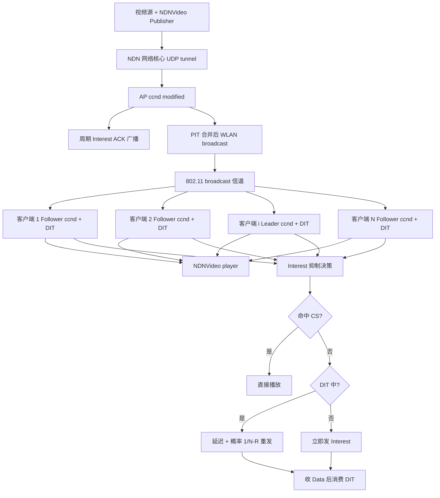
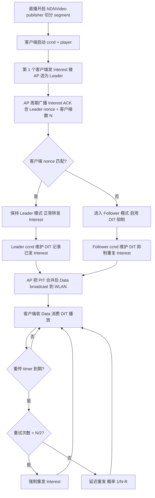

# NLB: NDN Live Video Broadcasting over Wireless LAN（ICCCN 2015）

> 作者：Menghan Li, Dan Pei, Xiaoping Zhang（通讯作者）, Beichuan Zhang, Ke Xu
> 机构：清华大学（清华信息科学与技术国家实验室 / 计算机科学与技术系）；亚利桑那大学计算机科学系
> 发表年份：2015
> 会议/期刊：ICCCN 2015（IEEE International Conference on Computer Communication and Networks）
> 关联 PDF：同目录下 `NLB-ICCCN2015-paper.pdf`

## 一、文档信息速览

| 字段 | 值 |
|---|---|
| 标题 | NDN Live Video Broadcasting over Wireless WLAN |
| 作者 | Menghan Li、Dan Pei、Xiaoping Zhang（通讯作者）、Beichuan Zhang、Ke Xu |
| 机构 | 清华大学 TNList / 计算机系；亚利桑那大学计算机系 |
| 发表年份 | 2015 |
| 会议/期刊 | ICCCN 2015 |
| 分类 | 无线网络 / 视频直播 / NDN 跨层优化 |
| 核心问题 | 最后一跳 WiFi 上 NDN 仍按 unicast 传送，导致同一视频被多客户端重复拉取、浪费带宽；802.11 broadcast 无 MAC ACK 丢包严重 |
| 主要贡献 | (1) NLB：基于 NDN 的 cross-layer 直播方案，AP 端用 802.11 broadcast 发送 Data；(2) Leader-based Interest 抑制 + 周期性 Interest ACK；(3) 接收端速率控制 + 丢包恢复；(4) commodity 1Gbps AP（Mercury MW4530R 720MHz）+ 20 WiFi client 测试床；20 客户端全部 1Mbps 直播流畅，UCast/BCast 上限分别仅 7 / 4 客户端 |

## 二、背景（Background）

视频流量已占北美下行峰值 29.7%，且 Cisco 预测 2018 年 61% 互联网接入走 WiFi 与移动设备。视频内容分发是当前最迫切的需求。NDN（Named Data Networking，Jacobson 等）作为以内容为中心的未来网络架构，原生支持 caching/multicast，理论上最适合视频分发。但在最后一跳（WiFi）上，目前 NDN 实现仍把多客户端看成多个独立 unicast 会话，导致同一视频被多客户端重复拉取、浪费带宽。WiFi 自带的 broadcast 机制虽能缓解，但又因没有 MAC ACK 而丢包严重。

论文把直播（NLB）的目标形式化为：

> 给定一个直播视频（bit rate 固定）以及 N 个 WiFi 客户端，最小化无线介质上 Interest/Data 包数量，同时保证 playback 平滑。

论文对比了当前 NDN 直播方案，发现 UCast（每客户端 unicast）受限于 7 客户端；BCast（AP 直接 broadcast Data）受限于 broadcast 带宽（4 客户端）。NLB 综合两者：AP 用 broadcast 传 Data，客户端用 Leader/Follower 机制避免重复 Interest。

## 三、目的（Problems Solved）

- **多客户端重复 Interest/Data 浪费带宽**：选举一个 Leader 集中发 Interest，其他 Follower 在 NDN 层 delay 重复 Interest。
- **802.11 broadcast 无 MAC ACK 导致丢包**：在应用层用 Interest pipeline + RTT 估计 + 重传 timer 弥补。
- **Interest 与 Data 同时占用无线信道造成冲突**：在 NDN 层用 Delayed Interest Table（DIT）抑制冲突，AP 周期发送 Interest ACK 同步 Leader 进度。
- **首跳必须兼容现有 IP/MAC 层**：不修改 802.11 MAC，AP 用 OpenWrt + UDP tunnel 把 NDN 包送到原 NDN 网络；AP 同时仍可跑 IP 业务。
- **Leader 失效后切换**：用 `SNmax` 机制保证新 Leader 不重发已被老 Leader 发过的 Interest。

## 四、核心原理（Principles）

**NDN 基础**：每个内容块有 name；消费者发 Interest，路由器建 PIT 聚合相同 Interest，Data 沿原路返回。CS（Content Store）缓存沿途 Data。

**NLB 三层方案**（不修改 802.11 MAC）：
- **NDN 应用层（NDNVideo）**：publisher 把直播切成 segment，写到 NDN repository（命名 `/repo/stream/video/segments/=number`）；player 用 Interest pipeline 请求。
- **NDN 层 ccnd 增强**：AP ccnd 把同一目的 WLAN 面的多入口 Interest 在 PIT 合并，对 Data 走 broadcast；Leader ccnd 维护 DIT（Delayed Interest Table），Follower ccnd 也维护 DIT。
- **应用层播放器**：从 metadata 拿 bit rate，估算 pipeline 大小 $W = (S_2 - S_1) T_r / T_s$，维护 RTT 平滑 $S_{RTT}=(1-\alpha)S_{RTT}+\alpha RTT$（$\alpha=1/8$）、方差 $RTT_{VAR}=(1-\beta)RTT_{VAR}+\beta|S_{RTT}-RTT|$（$\beta=1/4$）、重传 timer $T_i=S_{RTT}+K\cdot RTT_{VAR}$（$K=3$，参考 RFC 2988），并排除 <10ms 的本地 CS 命中 RTT 防止 timer 退化。

**Leader 选择**：AP 把第 1 个发 Interest 的客户端选为 Leader，每收到 `P_ack`（默认 30）个来自 Leader 的 Interest 就广播一个 Interest ACK（特殊 Data 包，含 Leader nonce + 客户端数 N）。Follower 收到 Interest ACK 后对照 nonce 判断自己是不是 Leader。

**Interest 抑制概率**：Leader 转发 Interest 时，按 $1/(N-R)$ 的概率允许 Follower 的延迟 Interest 发出（$R$ 是同 Interest 已经被 Follower 重发的次数）；当 $R > N/2$ 时直接强制发出。

**Interest pipeline 大小**：

$$
W = \frac{(S_2 - S_1) \cdot T_r}{T_s}
$$

其中 $S_2, S_1$ 是相邻 $T_s$（默认 5s）内最新两个 segment 号，$T_r$ 是平均 RTT。

**Interest 重传 timer**：

$$
T_i = S_{RTT} + K \cdot RTT_{VAR}, \quad K=3
$$

**Follower Interest 重发条件**：
- Interest 命中本地 CS（DIT 删除）→ 已收到，无需再发；
- 收到 Data 消耗 DIT 中的 Interest → 推进 $SN_i$；
- 超过 $N/2$ 次重发 → 强制发出。

## 五、算法详解（Algorithm）

1. **输入 / 输出**
   - 输入：直播视频流（1Mbps H.264）；$N$ 个 WiFi 客户端；AP 一个；NDN 服务器一个。
   - 输出：所有客户端流畅播放 1Mbps 视频；wireless 介质上 Interest/Data 重复数显著降低。
2. **核心模块**
   - **Server-side NDNVideo publisher**：在 Ubuntu server 上跑原版 ccnd + NDNVideo 切分直播。
   - **AP-side modified ccnd**：在 OpenWrt 上跑 modified ccnd：把同 WLAN 面 PIT 条目合并后 broadcast；周期性发 Interest ACK。
   - **Client-side modified ccnd**：在 Ubuntu / MacOS 上跑 modified ccnd + NDNVideo player：每个客户端根据 Interest ACK 决定自己跑 Leader 还是 Follower；Follower 用 DIT 做 Interest 抑制；Leader 维护 DIT 用于延迟重传 Interest。
   - **Application-layer adaptation**：player 算 bit rate、Smoothed RTT、Interest 重传 timer；Live stream bootstrap 找最新 segment；playout delay $T_{pd}=5$ 秒用于缓存抗 jitter。
3. **伪代码**

```python
# AP 端 modified ccnd
class NLBAccessPoint:
    def on_interest(self, interest, in_face):
        if self.stream_name(interest) not in self.streams:
            self.streams[interest.name] = Stream(leader_face=in_face,
                                                  leader_nonce=interest.nonce,
                                                  client_count=1)
        else:
            stream = self.streams[interest.name]
            stream.client_count += 1
            self.pit.add(interest.name, in_face)
        # 转发到上游一次
        self.forward_to_upstream(interest)

    def on_data(self, data):
        faces = self.pit.consume(data.name)
        # 把 Data broadcast 到 WLAN（不 unicast）
        for f in faces:
            if f.is_wlan():
                self.wlan_broadcast(data)
            else:
                self.send(data, f)
        # 每收 P_ack=30 个 Leader Interest 就广播一个 Interest ACK
        if self.leader_interest_count[data.name] % 30 == 0:
            self.wlan_broadcast(self.build_interest_ack(N=stream.client_count))


# Follower 端 ccnd DIT 抑制
class FollowerDIT:
    def on_interest_from_app(self, interest):
        if self.cs.has(interest.name):
            return  # 本地 CS 已命中
        self.dit.add(interest.name)

    def on_data(self, data):
        sn = self.dit.consume(data.name)  # consumed segment number
        # 把 DIT 中 SN < sn 的延迟 Interest 随机发出去
        for entry in self.dit.entries_with_sn_less_than(sn):
            if random.random() < 1.0 / max(1, (self.N - entry.retry_count)):
                self.send_interest(entry.interest)
                self.dit.remove(entry)
        # 自己 cs 缓存
        self.cs.add(data)

    def on_retransmit_from_app(self, interest):
        entry = self.dit[interest.name]
        entry.retry_count += 1
        if entry.retry_count > self.N // 2:
            self.send_interest(interest)  # 强制发出
            self.dit.remove(entry)
```

4. **关键数学**：见 §四（pipeline $W$、RTT 平滑、重传 timer、Follower 强制发出阈值 $N/2$）。
5. **复杂度分析**
   - 客户端 Interest 抑制：每个 Follower 维护 DIT，$O(1)$ per Interest 查表；
   - AP broadcast：单次 Data $O(1)$ broadcast，复用 PIT 条目避免重复 unicast；
   - 测试床实测：1Mbps 视频 / 20 客户端，AP CPU ~30%；UCast 在 7 客户端 AP CPU 已 >90%。
6. **训练与推理**：无机器学习；纯协议 + 启发式。
7. **示例**：校园直播赛事。20 个学生在教室用 WiFi 看同一 1Mbps 直播。NLB 选第一个发 Interest 的学生为 Leader，其 ccnd 转发所有 Interest；其他 19 个 Follower 在 NDN 层抑制重复 Interest；AP 通过 802.11 broadcast 把 Data 一次性送达 20 个客户端，wireless 介质利用率保持在 30% CPU / 低 Interest 冗余（~120%）+ 低 Data 冗余（~119%）。

## 六、系统架构图（Architecture）



## 七、流程图（Process Flow）



## 八、关键创新点（Key Innovations）

- **+ Leader/Follower 机制**：在 NDN 层把"谁来发 Interest"集中到一个客户端，避免 N 个客户端重复 Interest。
- **+ Interest ACK 周期广播**：让所有 Follower 同步 Leader 的 `SNmax`，同时切换 Leader 时不重发老 Interest。
- **+ DIT（Delayed Interest Table）抑制重复 Interest**：概率 $1/(N-R)$ 允许 Follower 延迟重发，$R > N/2$ 时强制发出。
- **+ 不改 802.11 MAC**：用 AP 端 modified ccnd + UDP tunnel 兼容现有 NDN 与 IP 业务，部署门槛低。
- **+ commodity AP 即可运行**：Mercury MW4530R 720MHz CPU 跑 OpenWrt，20 客户端 AP CPU 仅 ~30%。
- **+ 接收端 RTT 平滑 + 排除本地 CS 命中 RTT**：避免 RTO 退化到 μs 级引发的 Interest 爆炸。

## 九、实验与结果（Experiments）

- **测试床**：1 台 Mercury MW4530R 802.11ac 5GHz AP（broadcast 6Mbps 上限，unicast 750Mbps），最多 20 台 Linux VM WiFi 客户端；NDNVideo publisher 在 Ubuntu server 上；客户端跑 modified ccnd；H.264 1Mbps 视频（Mobile calendar 样本）。
- **参数**：playout delay $T_{pd}=5$s；$T_s=5$s；$P_{ack}=30$；每实验 300s 重复 5 次。
- **对比方案**：
  - **UCast**：客户端和 AP 跑原版 ccnd，Interest/Data 都走 UDP unicast。
  - **BCast**：客户端跑 NLB player + 原版 ccnd，AP 用 modified ccnd broadcast Data，但 Interest 仍走 unicast。
  - **NLB**：本文方案。
- **关键数字**：
  - 1Mbps 视频 / 20 客户端：NLB 全部流畅（buffer rate <0.041 /s，buffer ratio <2%）；UCast 在 7 客户端后 buffer ratio 飙到 14.03%；BCast 在 4 客户端后 buffer ratio 飙到 4.02%。
  - Interest 冗余度：NLB 20 客户端时 122.96%；理想 unicast 100%；UCast 快速偏离；BCast 接近 ideal unicast。
  - Data 冗余度：NLB 20 客户端时 118.75%；BCast 显著优于 UCast 但仍远差于 NLB。
  - AP CPU：NLB 20 客户端 ~30%；UCast 7 客户端 >90%；BCast 4 客户端 ~60%（受限于 broadcast 6Mbps 带宽）。
- **结论**：NLB 至少是 UCast 的 3 倍、BCast 的 5 倍客户端规模；在 1Mbps 视频上仍有 1% 每客户端的额外冗余空间，支持更多客户端。

## 十、应用场景（Use Cases）

- **校园/企业直播**：上千上万学生/员工通过 WiFi 看同一直播讲座。
- **大型赛事直播**（SuperBowl、NBA 决赛、World Cup、Olympic）：用户从移动设备 WiFi 接入。
- **企业内训/全公司会议直播**：NDN 缓存进一步把热点内容推到接入侧。
- **酒店/医院/会场 WiFi 直播**：高密度客户端场景下避免 broadcast 带宽浪费。
- **可与 MAC 层 802.11 broadcast 增强方案（Medusa、Dircast、Flexcast 等）互补**。

## 十一、相关论文（Related Papers in this set）

- `F2Tree-ICDCS15` / `f2tree`（Fat Tree 快速故障恢复，DCN 视角）
- `CQRD-ComputerNetworks15` / `CQRD-LCN`（交换机内部 CQRD 队列管理）
- `FUSO-ATC16`（多路径 TCP 快速重传）
- `conext15-final2`（FUNNEL 软件变更后性能评估）
- `Multi-AS-cooperative-incoming-traffic-engineering-in-a-transit-edge-separate-internet-zhang2014`（LISP 边 AS 协作流量工程）
- `firewall`（防火墙指纹与 DoF 攻击）
- `chen_npc14_CQ`（CQ 交换机 buffer 设计理论）

## 十二、术语表（Glossary）

- **NDN (Named Data Networking)**：以内容名为中心的网络架构。
- **CCN / Content Centric Networking**：NDN 的同义前身。
- **Interest / Data packet**：NDN 两种基本包类型。
- **PIT (Pending Interest Table)**：NDN 路由器中记录 Interest 入接口的表。
- **CS (Content Store)**：NDN 路由器本地缓存。
- **ccnd**：NDN 转发守护进程（来自 ccnx 0.8.1）。
- **PIT Aggregation**：同 name 的多个 Interest 合并为一条。
- **Leader / Follower**：NLB 中负责发 Interest 的客户端与其余客户端。
- **DIT (Delayed Interest Table)**：Leader/Follower 各自维护的兴趣抑制表。
- **Interest ACK**：AP 周期广播的特殊 Data 包，告知 Leader nonce + 客户端数 N。
- **SNmax**：Leader 已发 Interest 的最大 segment number。
- **Playout delay $T_{pd}$**：播放器启动后缓存时间，用于抗 jitter。
- **Smoothed RTT / RTT VAR**：RFC 2988 风格的 RTT 平滑与方差。
- **Interest Retransmission Timer $T_i$**：$T_i = S_{RTT} + K \cdot RTT_{VAR}$。
- **802.11 Broadcast**：WiFi 物理层 broadcast，但无 MAC ACK。
- **OpenWrt**：嵌入式 Linux，广泛用于家用 AP。
- **Medusa / Dircast / Flexcast**：基于 MAC 层 802.11 broadcast 增强的方案，与 NLB 互补。
- **H.264 / FFmpeg / MPEG-2 HD**：视频编码与样本。

## 十三、参考与延伸阅读

- Paper: NLB ICCCN 2015（本文）。
- Paper: NDN（Jacobson et al. 2009）—— NDN 架构。
- Paper: NDNVideo（Kulinski & Burke, NDN TR-0007, 2012）—— NDN 直播原型。
- Paper: Medusa（NSDI 2010）、Dircast（ICNP 2009）、Flexcast（MobiCom 2011）—— MAC 层 802.11 broadcast 增强。
- Paper: AMVS-NDN（NOMEN 2013）—— 移动 NDN 自适应视频流。
- 工具：NDN/ccnx 0.8.1、OpenWrt、FFmpeg、iperf、Mercury MW4530R。
- 相关论文：`F2Tree-ICDCS15`、`f2tree`、`CQRD-ComputerNetworks15`、`CQRD-LCN`、`FUSO-ATC16`、`conext15-final2`、`Multi-AS-cooperative-incoming-traffic-engineering-in-a-transit-edge-separate-internet-zhang2014`、`firewall`、`chen_npc14_CQ`。
