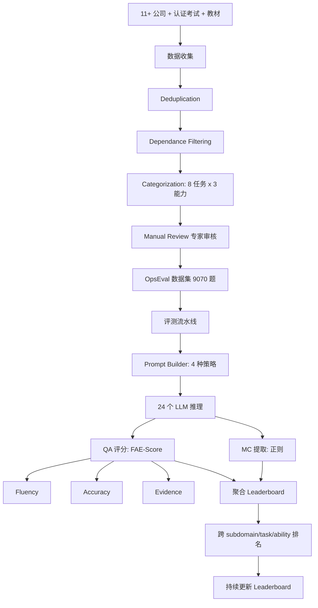
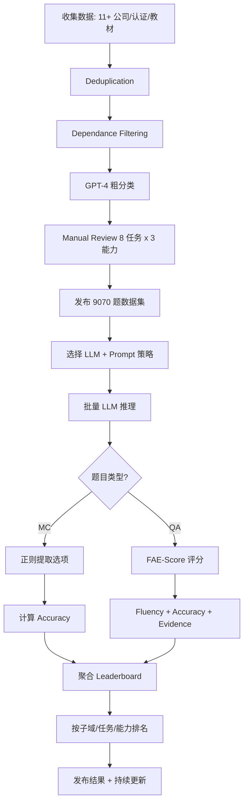

# OpsEval：面向 IT 运维领域的大语言模型综合评估基准（FSE Companion 2025）

> 作者：Yuhe Liu、Changhua Pei、Longlong Xu、Bohan Chen、Mingze Sun、Zhirui Zhang、Yongqian Sun、Shenglin Zhang、Kun Wang、Haiming Zhang、Jianhui Li、Gaogang Xie、Xidao Wen、Xiaohui Nie、Minghua Ma、Dan Pei
> 机构：清华大学 & BNRist、CNIC CAS、Nankai University、Huawei、Microsoft、BizSeer
> 发表年份：2025
> 会议/期刊：FSE Companion 2025（Trondheim, Norway）
> 关联 PDF：同目录下 `OpsEval_FSE_0421.pdf`
> 数据：https://github.com/NetManAIOps/OpsEval-Datasets

## 一、文档信息速览

| 字段 | 值 |
|---|---|
| 标题 | OpsEval: A Comprehensive Benchmark Suite for Evaluating Large Language Models' Capability in IT Operations Domain |
| 作者 | Yuhe Liu, Changhua Pei, Longlong Xu, Bohan Chen, Mingze Sun, Zhirui Zhang, Yongqian Sun, Shenglin Zhang, Kun Wang, Haiming Zhang, Jianhui Li, Gaogang Xie, Xidao Wen, Xiaohui Nie, Minghua Ma, Dan Pei |
| 机构 | 清华、CNIC、南开、华为、Microsoft、BizSeer |
| 发表年份 | 2025 |
| 会议/期刊 | FSE Companion 2025 |
| 分类 | 评测 / LLM / IT 运维 / FAE-Score |
| 核心问题 | 缺乏对 OpsLLM 在 IT 运维领域系统全面的评估基准与适配的 QA 评估指标 |
| 主要贡献 | 1) 首个双语多任务 Ops LLM 评测基准（9070 问题）；2) 8 任务 × 3 能力分类；3) FAE-Score 评估方法；4) 24 个 LLM × 多 prompt 策略评估；5) AIOps 社区协作 |

## 二、背景（Background）

IT 运维（IT Operations, Ops）在云、5G、金融平台等关键系统中扮演枢纽角色。AIOps 用 AI 解决异常检测、故障诊断、性能优化等关键任务，已成 Gartner 重点方向。LLM 的崛起为 AIOps 注入新可能——OpsLLM（用 LLM 做 Ops 任务）可统一处理告警分析、运维问答、报告生成等。

然而 OpsLLM 的评估面临独特挑战：
1. **数据敏感专有**：Ops 数据多在公司内部，公开少。
2. **子领域众多**：5G、云、银行、证券等各成体系，需要"任务 × 能力"分类。
3. **Prompt 敏感**：OpsLLM 多为通用 LLM 微调，对 prompt 形式敏感。
4. **QA 指标不准**：BLEU/ROUGE 只看文本相似，不看"是否答对关键点"。

现有 NLP 基准（MMLU、C-Eval、GSM8K）与 Ops 任务错位，BLEU/ROUGE 在长文本 Ops QA 上与人类专家判断相关性差。

OpsEval 应运而生：建立包含 9070 个问题的 Ops LLM 评测基准，覆盖 9 个子域、8 个任务、3 个能力，提供 FAE-Score 评估方法（与专家评估相关性 0.9175，远高于 BLEU 0.6705、ROUGE -0.3957），并由 11+ 公司提供数据支持。

## 三、目的（Problems Solved）

- **痛点 1：缺数据。** 公开 Ops 数据少，多为公司敏感数据。
- **痛点 2：缺分类。** Ops 任务众多，无系统 Taxonomy。
- **痛点 3：缺评估指标。** BLEU/ROUGE 与专家判断相关性差。
- **痛点 4：缺 prompt 鲁棒性研究。** 现有 LLM 对 prompt 形式敏感。
- **解决方案**：OpsEval 协同 11+ 公司收集数据，建立 8 任务 × 3 能力分类，提供 FAE-Score 评估，测试 24 个 LLM × 多 prompt 策略。

## 四、核心原理（Principles）

**总览**：OpsEval 是一个包含数据集 + 分类体系 + 评估方法 + Leaderboard 的综合基准。三大子模块：Data Collection、Preprocessing、Evaluation。

**Data Collection（4 类来源）**：

1. **Company Materials**：与 11+ 公司（华为、联想、中兴、Zabbix、Rizhiyi 等）合作，收集真实 Ops 工单、错误日志、培训测试。
2. **Certification Exams**：5G、Oracle、云等认证考试题（公开题库）。
3. **Ops Textbooks**：高校教材、运维图书（含章节练习）。
4. **公开网络管理图书**：经预聚类后人工标注。

**Preprocessing（4 步）**：

1. **Deduplication**：用 bge-large-zh-v1.5 计算问题余弦相似度，阈值 0.7 合并重复。
2. **Dependance Filtering**：过滤依赖外部图片/文档的题目，用关键词列表 + GPT-3.5 双轨过滤。
3. **Categorization**：GPT-4 粗分类 + 人工 review 精分类 → 8 任务 × 3 能力。
4. **Manual Review**：10+ 年经验的领域专家审核，每折 2 个专家。

**8 个任务**：

- General Ops Knowledge、Network Configuration、Software Deployment、Monitoring and Alerts、Performance Optimization、Automation Scripts、Fault Analysis and Diagnostics、Miscellaneous

**3 个能力**：

- Knowledge Recall（知识回忆）、Analytical Thinking（分析思维）、Practical Application（实践应用）

**9 个子域**：

- Wired Network、5G Communication、Oracle Database、Log Analysis、DevOps、Private Cloud、Securities Info、Hybrid Cloud、Financial IT

**Evaluation**：

- **MC 题**：用正则提取模型选项，计算 Accuracy。
- **QA 题**：用 **FAE-Score**（Fluency-Accuracy-Evidence Score）。
- **Prompt 策略**：naive / Self-Consistency (SC) / Chain-of-Thought (CoT) / Few-shot (ICL)。
- **模型规模**：从 2B（Phi-2、Gemma-2B）到 GPT-4o 闭源模型，24 个 LLM。

**FAE-Score 核心**：
- **Fluency**：语言流畅 + 符合回答要求。
- **Accuracy**：是否覆盖答案关键点。
- **Evidence**：是否有充分论据。
- 每个维度 0-3 分，最终加权。论文显示与专家判断相关性 0.9175，远超 BLEU (0.6705)、ROUGE (-0.3957)。

**关键数学**：

- **FAE-Score 总分**：
  $$FAE = w_1 \cdot F + w_2 \cdot A + w_3 \cdot E$$
  其中 $F, A, E \in [0, 3]$，$w_1 = w_2 = w_3 = 1/3$ 默认。
- **与专家相关性**：
  $$\rho(FAE, \text{Expert}) = 0.9175$$

**为什么这么做**：
- 多公司协作：解决数据敏感、单一公司不具代表性的问题。
- 双语（中文+英文）：覆盖国内外 Ops 实践。
- 8 任务 × 3 能力：把"Ops 能力"拆成可量化维度。
- FAE-Score：传统指标在长文本上失效，需要考虑"证据"与"关键点覆盖"。

**与现有技术的差异**：
- vs. MMLU/C-Eval/GSM8K：通用 NLP 基准，OpsEval 专门针对 IT 运维。
- vs. BLEU/ROUGE：FAE-Score 看"是否答对"而非"字面相似"，与专家判断相关性远高。

## 五、算法详解（Algorithm）

### 1. 输入 / 输出
- **输入**：OpsEval 题目集 + LLM 模型 + prompt 策略。
- **输出**：每题评分（MC accuracy / QA FAE-Score）+ 跨任务/能力/子域的 leaderboard。

### 2. 核心模块
- **Question Loader**：从 JSON 加载题目。
- **Prompt Builder**：按 task/ability 拼接 prompt。
- **LLM Caller**：调用模型 API 或本地推理。
- **Answer Extractor**：用正则提取 MC 选项；用 LLM-as-judge 评估 QA。
- **FAE-Score Calculator**：三维度评分聚合。
- **Leaderboard Generator**：跨维度排序。

### 3. 伪代码

```python
def opseval_evaluate(llm, dataset, prompt_strategy='naive', language='zh'):
    prompt_templates = load_prompt_templates(language)
    results = []
    for q in dataset:
        # 1) 构造 prompt
        if prompt_strategy == 'naive':
            prompt = prompt_templates['naive'].format(q=q)
        elif prompt_strategy == 'sc':
            prompt = prompt_templates['sc'].format(q=q)
        elif prompt_strategy == 'cot':
            prompt = prompt_templates['cot'].format(q=q)
        elif prompt_strategy == 'icl':
            prompt = prompt_templates['icl'].format(q=q, examples=sample_3_shot(q))
        # 2) LLM 推理
        response = llm.generate(prompt, max_new_tokens=512)
        # 3) 评分
        if q.type == 'MC':
            pred = extract_choice(response)
            score = 1.0 if pred == q.answer else 0.0
        else:  # QA
            F, A, E = fae_judge(q, response, judge_llm=llm)
            score = (F + A + E) / 9.0  # 归一到 [0, 1]
        results.append({
            'qid': q.id, 'task': q.task, 'ability': q.ability,
            'subdomain': q.subdomain, 'score': score
        })
    return aggregate_leaderboard(results)

def fae_judge(q, response, judge_llm):
    # 三个维度的 LLM-as-judge 评分
    F = judge_llm.score(q, response, criterion='fluency')    # 0-3
    A = judge_llm.score(q, response, criterion='accuracy', ref=q.answer)  # 0-3
    E = judge_llm.score(q, response, criterion='evidence')   # 0-3
    return F, A, E
```

### 4. 关键数学
- 见上文 "关键数学" 章节。
- Leaderboard 聚合：按 (subdomain, task, ability) 分组计算 macro-average。

### 5. 复杂度分析
- 单题评估：1 次 LLM 调用（generate）+ 3 次 LLM 调用（FAE 评分）= 4 次 LLM 调用。
- 整个 benchmark：24 LLM × 9070 题 × 4 prompt 策略 ≈ 87 万次 LLM 调用，分布式执行约 1-2 周。

### 6. 训练与推理
- OpsEval 是评测框架，无训练阶段。
- 推理：批量调用 LLM，分布式。

### 7. 示例
- MC 题："Which of the following represents quantifying data moved from one host to another within a specific time frame? A: Reliability B: Response time C: Throughput D: Jitter" → 答案 C
- QA 题："请解释 5G NR 中 PUSCH 的时频资源分配" → 用 FAE-Score 评估模型回答的 Fluency、Accuracy、Evidence。

## 六、系统架构图（Architecture）



## 七、流程图（Process Flow）



## 八、关键创新点（Key Innovations）

- **+ 首个双语多任务 Ops LLM 评测基准**：9070 题覆盖 9 子域 × 8 任务 × 3 能力。
- **+ AIOps 社区协作**：11+ 公司（华为、中兴、联想、Zabbix 等）联合提供数据。
- **+ FAE-Score 评估指标**：与专家判断相关性 0.9175，远超 BLEU/ROUGE。
- **+ 24 个 LLM × 4 种 prompt 策略全维度评估**：揭示 OpsLLM 在不同 prompt 下的真实表现。
- **+ 持续更新的 Leaderboard**：数据集与排行榜 1+ 年持续维护。

## 九、实验与结果（Experiments）

- **数据集**：9070 题（~7000 MC + ~2000 QA）。
- **LLM**：24 个，包括 GPT-4/3.5-turbo、ERNIE-Bot-4.0、GLM4、LLaMA-2/3、Qwen-Chat、InternLM2、DevOps-Model、Baichuan2、ChatGLM3、Mistral、Gemma、Claude-3-Opus、Qwen2-Instruct 等。
- **Prompt 策略**：naive / SC / CoT / Few-shot (ICL)。
- **关键结果**：
  - FAE-Score 与专家判断相关性 0.9175，远超 BLEU (0.6705)、ROUGE (-0.3957)；
  - GPT-4 总体表现最好，Qwen2-72B、Claude-3-Opus 紧随；
  - 开源小模型（7B）在简单 MC 题上接近闭源大模型，但 QA 题差距明显；
  - 领域微调（DevOps-Model）vs 通用 LLM（Qwen、GLM）：在特定子域有提升，但跨域泛化差。
- **观察**：
  - 知识回忆类问题相对简单，分析与实践类问题难；
  - 中文题比英文题难（开源模型中文弱）；
  - Few-shot 普遍提升，但 SC 增益不稳定。

## 十、应用场景（Use Cases）

- **OpsLLM 选型与采购评估**：用 OpsEval 横向比较候选 LLM。
- **OpsLLM 微调数据来源**：用 OpsEval 子集作为领域 SFT 数据。
- **Ops LLM 能力诊断**：发现模型在哪个任务/子域弱，定向改进。
- **Prompt 调优**：用不同 prompt 策略评估，找到最优 prompt 模板。
- **学术研究**：作为 OpsLLM 评估的标准工具。

## 十一、相关论文（Related Papers in this set）

- 同为评测基准的 **LogEval**（ESE 2025）关注日志分析任务，可视为 OpsEval 在"日志"子域的精细化。
- **Eagle**（FSE Companion 2026）关注 Ops QA 生成流水线，与 OpsEval 的"QA 评估"互补。
- **NetMan AIOps Lab 多篇论文** 都可以用 OpsEval 做能力评估。

## 十二、术语表（Glossary）

- **OpsLLM**：IT 运维大语言模型。
- **AIOps**：Artificial Intelligence for IT Operations。
- **FAE-Score**：Fluency-Accuracy-Evidence Score，OpsEval 自研评估指标。
- **BLEU / ROUGE**：传统文本相似度评估指标。
- **Self-Consistency (SC)**：多次采样投票。
- **Chain-of-Thought (CoT)**：思维链 prompt。
- **In-Context Learning (ICL)**：上下文学习（few-shot）。
- **8 任务 × 3 能力**：见正文。
- **9 子域**：Wired Network、5G、Oracle、Log、DevOps、Private Cloud、Securities、Hybrid Cloud、Financial IT。
- **bge-large-zh-v1.5**：中文 embedding 模型，用于去重。

## 十三、参考与延伸阅读

- MMLU、C-Eval、GSM8K、MT-Bench：通用 NLP 基准。
- BLEU、ROUGE、METEOR、BERTScore：传统文本评估。
- RAGAS：检索增强生成的评估框架。
- 11+ 协作公司：BOSC、Bizseer、ChinaEtek、华为、联想、Zabbix、ZTE 等。
- 数据：https://github.com/NetManAIOps/OpsEval-Datasets
