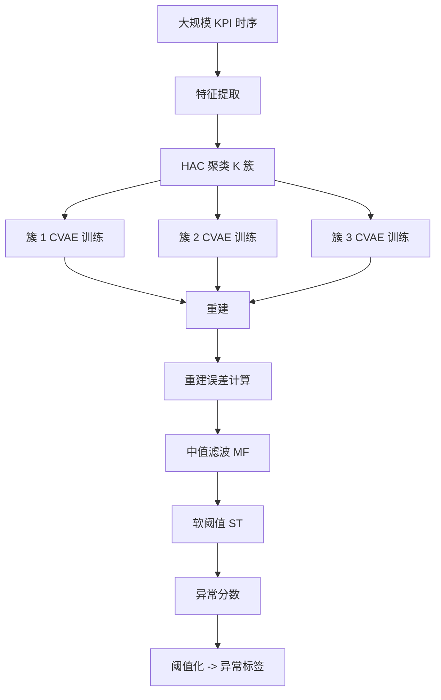
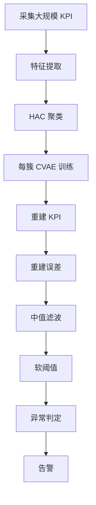

# OutSpot: Efficient and Robust KPI Outlier Detection for Large-Scale Datacenters（IEEE TC 2023）

> 作者：Yongqian Sun、Daguo Cheng、Tiankai Yang、Yuhe Ji、Shenglin Zhang、Man Zhu、Xiao Xiong、Qiliang Fan、Minghan Liang、Dan Pei、Tianchi Ma、Yu Chen  
> 机构：南开大学；清华大学；南加州大学；快手；海河实验室  
> 发表年份：2023  
> 会议/期刊：IEEE Transactions on Computers（Volume 72, Issue 10, October 2023）  
> 关联 PDF：同目录下 `OutSpot.pdf`

## 一、文档信息速览

| 字段 | 值 |
|---|---|
| 标题 | OutSpot: Efficient and Robust KPI Outlier Detection for Large-Scale Datacenters |
| 作者 | Yongqian Sun、Daguo Cheng、Tiankai Yang、Yuhe Ji、Shenglin Zhang、Man Zhu、Xiao Xiong、Qiliang Fan、Minghan Liang、Dan Pei、Tianchi Ma、Yu Chen |
| 机构 | 南开大学；清华大学；南加州大学；快手；海河实验室 |
| 发表年份 | 2023 |
| 会议/期刊 | IEEE TC |
| 分类 | KPI 异常检测 / 深度生成模型 / 大规模数据中心 |
| 核心问题 | 大规模数据中心（数千万 KPI）需要同时检测"子序列异常"和"整条 KPI 异常"；现有方法要么只关注历史模式（subsequence），要么只关注同周期模式（time series），无法兼顾 |
| 主要贡献 | (1) 把 HAC 与 CVAE 结合，先聚类再生成，兼顾两类异常；(2) 提出软阈值 + 中值滤波后处理提升准确率；(3) 在两个工业数据集上 F1 0.95/0.91、AUC 0.99/0.99；(4) 发布标注工具与数据集 |

## 二、背景（Background）

数据中心需要监控数千万 KPI（CPU、内存、TCP 重传率、磁盘 I/O 等），每个 KPI 是一组等间隔采样的单变量时序。论文把 KPI 异常分为三类：点异常（point outlier，单个数据点偏离）、子序列异常（subsequence outlier，连续一段偏离）、整条 KPI 异常（outlier time series，整条 KPI 与同周期其他 KPI 偏离）。点异常通常由自动恢复与负载均衡引发，工程师往往忽略；子序列异常和整条 KPI 异常意味着设备持续异常或管理失误，需要立即处置。

现有异常检测方法的局限：(1) 多数方法只关注"点"，不关注"段"或"整条"；(2) 子序列异常检测方法需为每条 KPI 训练独立模型，资源消耗巨大；(3) 整条 KPI 异常检测方法学的是"同周期其他 KPI 的模式"，可能漏掉"该 KPI 自身异常但其他 KPI 正常"的情况；(4) 深度生成模型的重建概率在高维数据上反而给异常更高分，判别能力下降；(5) 标注工作量大。

论文提出 OutSpot：先用 HAC（层次凝聚聚类）把数千万 KPI 按模式分簇（论文场景中 3 簇），再在每簇上用 CVAE 学习"历史模式 + 同周期模式"，最后比较重建形状与原始形状判定异常，配合软阈值（ST）+ 中值滤波（MF）后处理。

## 三、目的（Problems Solved）

- **大规模 KPI 检测效率**：HAC 把数千万 KPI 分簇，避免每条 KPI 训练一个模型。
- **子序列异常 + 整条 KPI 异常同时检测**：CVAE 同时学两种模式。
- **重建概率不可靠**：用重建形状比较替代概率。
- **后处理优化**：软阈值（ST）+ 中值滤波（MF）提高准确率。
- **多模式 KPI**：HAC 聚类解决"一种模型无法覆盖多种 KPI"问题。
- **标注工具缺失**：发布 GUI 标注工具与公开数据集。

## 四、核心原理（Principles）

**系统总览**：OutSpot 工作流为：(1) 用 Z-Score/形状特征聚类（HAC）；(2) 在每簇上用 CVAE 学习正常模式（条件 = 簇 ID + 同周期 KPI 上下文）；(3) 重建每个 KPI 序列；(4) 用 ST + MF 后处理得到异常分数。

**关键概念**：

- **KPI（Key Performance Indicator）**：关键性能指标，等间隔单变量时序。
- **Point Outlier（点异常）**：单点偏离。
- **Subsequence Outlier（子序列异常）**：连续一段偏离。
- **Outlier Time Series（整条 KPI 异常）**：整条 KPI 偏离同周期其他 KPI。
- **HAC（Hierarchical Agglomerative Clustering）**：层次凝聚聚类。
- **CVAE（Conditional VAE）**：条件变分自编码器。
- **ST（Soft Threshold）**：软阈值。
- **MF（Median Filter）**：中值滤波。

**数学原理**：

- **CVAE 编码-解码**：

$$
\mu, \sigma = \text{Encoder}(x, c), \quad z \sim \mathcal{N}(\mu, \sigma^2)
$$
$$
\hat{x} = \text{Decoder}(z, c)
$$

其中条件 $c$ = 簇 ID + 同周期其他 KPI 上下文。

- **CVAE 损失**（ELBO）：

$$
\mathcal{L} = \mathbb{E}_{q_\phi(z|x,c)}[\log p_\theta(x|z, c)] - D_{KL}(q_\phi(z|x, c) || p(z))
$$

- **重建误差**：

$$
e_t = |x_t - \hat{x}_t|
$$

- **软阈值（ST）**：

$$
\tau_t = \mu_e + \alpha \cdot \sigma_e
$$

$\alpha$ 控制灵敏度。

- **中值滤波（MF）**：

$$
\hat{e}_t = \text{median}(e_{t-w}, \ldots, e_{t+w})
$$

- **异常判定**：

$$
\text{outlier} = \mathbb{1}[\hat{e}_t > \tau_t]
$$

- **聚类**：

$$
d(C_i, C_j) = \min_{u \in C_i, v \in C_j} d(u, v)
$$

**与现有技术的差异**：与单点异常检测（USAD、DONUT）相比，OutSpot 关注子序列与整条 KPI；与子序列异常检测（SR、CPC）相比，OutSpot 用聚类 + CVAE 避免每条 KPI 训练；与整条 KPI 异常检测（Opprentice）相比，OutSpot 同时学两种模式。

## 五、算法详解（Algorithm）

1. **输入 / 输出**：
   - 输入：大规模 KPI 时序集合。
   - 输出：每条 KPI 的异常分数 + 异常区间。

2. **核心模块**：
   - **特征提取**：Z-Score + 形状统计。
   - **HAC 聚类**：分簇。
   - **CVAE 训练**：每簇一个模型。
   - **重建 + 误差计算**。
   - **ST + MF 后处理**。
   - **阈值化**。

3. **伪代码**：

```python
def outspot_train(kpis, n_clusters=3):
    features = [extract_features(k) for k in kpis]
    clusters = hac(features, n_clusters)
    models = {}
    for c in range(n_clusters):
        cluster_kpis = [kpis[i] for i in range(len(kpis)) if clusters[i] == c]
        context = build_context(cluster_kpis)  # 同周期其他 KPI
        cvae = train_cvae(cluster_kpis, context)
        models[c] = cvae
    return models

def outspot_detect(kpi, models, alpha=1.5, w=3):
    cluster = predict_cluster(kpi)
    context = build_context_single(kpi)
    x_hat = models[cluster].reconstruct(kpi, context)
    e = np.abs(kpi - x_hat)
    e_smooth = median_filter(e, w)
    tau = e_smooth.mean() + alpha * e_smooth.std()
    return (e_smooth > tau).astype(int)
```

4. **关键数学**：见 §四。

5. **复杂度分析**：
   - 聚类：$O(N^2 \log N)$，$N$ 为 KPI 数；
   - CVAE 训练：每簇 $O(K T d)$，$K$ 为每簇 KPI 数，$T$ 为序列长度；
   - 推理：单条 KPI 毫秒级；
   - 总计：在 GPU 上分钟级到小时级。

6. **训练与推理**：CVAE 无监督训练；推理用 ST + MF + 阈值化。

7. **示例**：某数据中心 18 类 KPI 用 HAC 分 3 簇；每簇 CVAE 重建；某条 CPU 使用率 KPI 在凌晨出现持续高负载（子序列异常），重建误差超阈值 → 异常告警。

## 六、系统架构图（Architecture）



## 七、流程图（Process Flow）



## 八、关键创新点（Key Innovations）

- **+ HAC + CVAE 双层架构**：聚类解决模式多样性，CVAE 解决双模式学习。
- **+ 子序列 + 整条 KPI 同时检测**：避免两种异常漏检。
- **+ 形状比较替代概率**：提高高维数据上的判别能力。
- **+ ST + MF 后处理**：实用性强。
- **+ 公开工具与数据集**：GUI + 标注数据。

## 九、实验与结果（Experiments）

- **数据集**：A - 全球短视频服务商（快手）；B - 国内三大通信运营商之一。
- **Baseline**：USAD、DONUT、SR、CPC、Opprentice、Isolation Forest、PCA 等 7 种。
- **主要指标**：F1-score、AUC。
- **关键结果数字**：
  - 数据集 A：F1 0.95、AUC 0.99；
  - 数据集 B：F1 0.91、AUC 0.99；
  - 显著优于 7 个基线。
- **消融实验**：分别去掉 HAC、CVAE、ST、MF，验证每部分贡献。
- **效率分析**：可扩展到数千万 KPI；推理毫秒级。
- **可视化**：KPI 重建曲线、聚类分布。

## 十、应用场景（Use Cases）

- **数据中心 KPI 监控**：CPU、内存、TCP、磁盘 I/O 等。
- **服务器健康监测**：定位持续异常服务器。
- **运维容量规划**：发现异常流量模式。
- **金融数据中心监控**：交易系统基础设施异常。
- **云服务基础设施**：IaaS 层资源异常。

## 十一、相关论文（Related Papers in this set）

- `Revisiting-VAE-for-Unsupervised-Time-Series-Anomaly-Detection-A-Frequency-Perspective`（VAE 频域）
- `Final_AutoKAD_ISSRE23_Camera-Ready-v2.3`（自动 KPI 模型选择）
- `Empirical_Analysis`（多变量时序异常检测实证）
- `MonitorAssistant_CameraReady-v1.5_submitted`（LLM 监控助手）
- `Beyond_Sharing_Conflict-Aware_Multivariate_Time_Se`（多变量时序异常）
- `A-survey-on-intelligent-management-of-alerts-and-incidents-in-IT-services`（AIOps 综述）

## 十二、术语表（Glossary）

- **KPI（Key Performance Indicator）**：关键性能指标。
- **Point Outlier**：点异常。
- **Subsequence Outlier**：子序列异常。
- **Outlier Time Series**：整条 KPI 异常。
- **HAC（Hierarchical Agglomerative Clustering）**：层次凝聚聚类。
- **CVAE（Conditional VAE）**：条件变分自编码器。
- **ST（Soft Threshold）**：软阈值。
- **MF（Median Filter）**：中值滤波。
- **ELBO**：证据下界。
- **ELBO Loss**：重建 + KL 损失。
- **Reconstruction Error**：重建误差。

## 十三、参考与延伸阅读

- Paper: USAD（KDD 2020）——单模态基线。
- Paper: DONUT（KDD 2022）——VAE 时序异常检测。
- Paper: SR、CPC ——子序列异常检测。
- Paper: Opprentice ——整条 KPI 异常检测。
- Paper: Isolation Forest、PCA ——传统基线。
- 工具：OutSpot 标注工具（公开）。
- 数据集：OutSpot 数据集 A、B（公开）。
- 相关论文：`Revisiting-VAE-for-Unsupervised-Time-Series-Anomaly-Detection-A-Frequency-Perspective`、`Final_AutoKAD_ISSRE23_Camera-Ready-v2.3`、`Empirical_Analysis`、`MonitorAssistant_CameraReady-v1.5_submitted`、`Beyond_Sharing_Conflict-Aware_Multivariate_Time_Se`。
