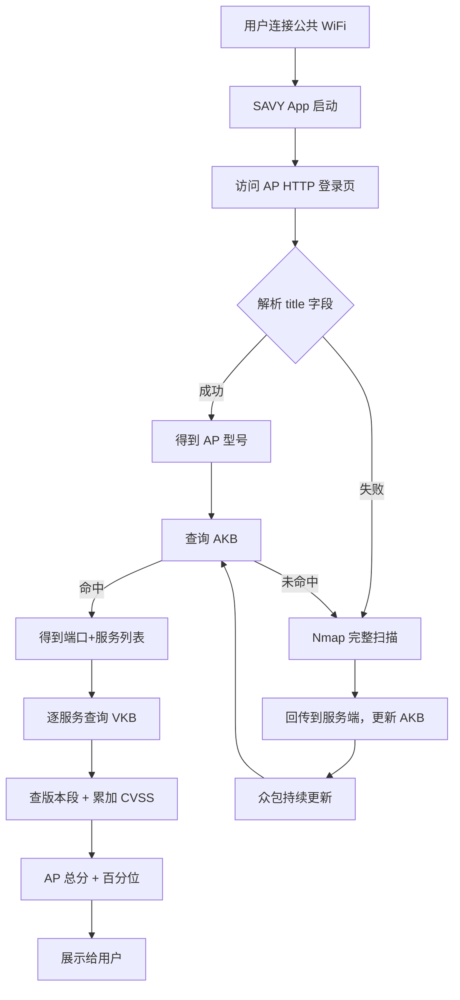
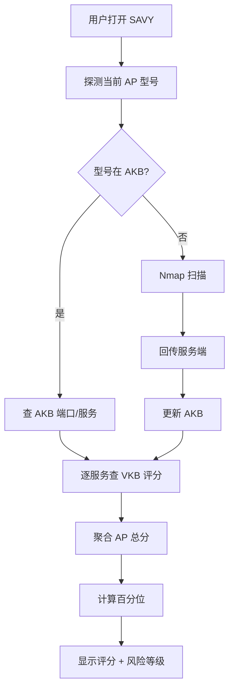

# How Vulnerable Is the Public WiFi AP You Are Using?（IEEE 论文 CR 版 / PID1194354）

> 标题：How Vulnerable Is the Public WiFi AP You Are Using?
> 作者：Ruming Tang、Haibin Li、Kaixin Sui、Zihao Jin、Xiao Yang、Dan Pei、Beichuan Zhang
> 机构：清华大学；贵州大学；亚利桑那大学
> 发表年份：投稿/CR 版（IEEE 期刊投稿稿）
> 关联 PDF：同目录下 `PID1194354.pdf`

## 一、文档信息速览

| 字段 | 值 |
|---|---|
| 标题 | How Vulnerable Is the Public WiFi AP You Are Using? |
| 作者 | Ruming Tang、Haibin Li、Kaixin Sui、Zihao Jin、Xiao Yang、Dan Pei、Beichuan Zhang |
| 机构 | 清华大学 TNList；贵州大学；亚利桑那大学 |
| 发表年份 | IEEE 期刊投稿/CR 版（无会议名） |
| 分类 | WiFi 安全 / 漏洞扫描 / 移动 App |
| 核心问题 | 公共 WiFi AP 大多不更新固件且开放访问，漏洞普遍存在却缺乏用户可感知的评估工具；Nmap 完整扫描太慢，移动端不可用 |
| 主要贡献 | (1) 提出 SAVY 移动 App：通过模型探测代替端口扫描，将探测时间减少 93.7%；(2) 准确率达到 90.5%；(3) 首次在野生环境下大规模测量公共 AP 漏洞，发现商业运营商 AP 漏洞更多 |

## 二、背景（Background）

公共 WiFi 已成生活一部分——咖啡馆、商场、机场中随处可见。与企业级 AP、蜂窝基站相比，公共 AP 部署后通常没有全职运维管理；与 PC/手机/平板不同，公共 AP 不与用户交互、不会自动更新。多数现成商用 AP（Commercial off-the-shelf, CoTS）一旦部署就很少更新，但漏洞库 CVE 不断增长，使 AP 越来越不安全，却缺乏公共认知。攻击者扫描、探测、攻击这些 AP 较容易——经常无需密码或密码公开；WiFi 万能钥匙等 App 用户超 8 亿。

漏洞利用后的 AP 可被用于 DNS 劫持、钓鱼、在线身份盗窃等严重攻击。鉴于 WiFi 是当今主要互联网接入方式，公共 WiFi AP 已成为移动互联网安全的薄弱环节。缺乏安全意识是主因——AP 不与用户或业主交互、厂商不及时发布补丁；厂商/型号众多，难以判断哪个更安全。

现有针对笔记本/手机的扫描工具（如 Norton、Bitdefender）能给出安全评分和更新提示，但据作者所知，部署在住宅和小企业的 CoTS WiFi AP 领域没有类似工具。直观上，此工具需知道：(1) AP 的开放端口/服务；(2) AP 实际存在的漏洞；(3) 漏洞的量化分数。但存在两大实际约束：第一，权威漏洞库 CVE/NVD 仅提供文本描述（需语义解析），Nmap 仅含极少数漏洞的探测脚本；AP 相关漏洞有 2686/75274 条，为所有漏洞写脚本成本巨大。第二，扫描工具只能从 AP 外部探测，且最好以移动 App 形式运行（用户随身携带），但 Nmap 全量扫描单 AP 时间过长，无法满足移动端场景。

## 三、目的（Problems Solved）

- **公共 AP 漏洞普遍性认知缺失**：首次在野生环境大规模测量公共 AP 漏洞分布。
- **完整漏洞扫描太慢**：将 Nmap 全量扫描替换为基于 AP 模型的轻量级查询，扫描时间减少 93.7%。
- **AP 厂商/型号间漏洞差异度量**：通过评分机制对不同厂商、型号、商铺类型的 AP 进行比较。
- **移动端可用性**：以 App 形式部署，避免对单一 AP 长时扫描。
- **用户/业主/厂商三方激励**：让用户选择更安全的 AP、业主升级、厂商改进。
- **AP 漏洞知识库构建**：AP Information Knowledge Base (AKB) + Vulnerability Knowledge Base (VKB)。

## 四、核心原理（Principles）

**系统总览**：SAVY 包含三部分：(1) AP Information Knowledge Base (AKB)：映射 AP 型号到其开放端口与服务；(2) Vulnerability Knowledge Base (VKB)：从 CVE/NVD 构建，映射服务/软件到 CVSS 评分；(3) 移动 App SAVY：执行模型探测，查询 AKB/VKB，得到漏洞评分。三者通过反馈循环持续更新。

**关键概念**：

- **AP（Access Point）**：无线接入点。
- **CoTS AP**：商用现成 AP，部署在住宅与小企业。
- **CVE / NVD**：通用漏洞披露 / 美国国家漏洞库。
- **CVSS**：通用漏洞评分系统（v2）。
- **AKB**：AP Information Knowledge Base，AP 型号 → 开放端口/服务。
- **VKB**：Vulnerability Knowledge Base，服务/软件 → 漏洞 CVSS 评分。
- **Model Probing**：通过 HTTP 登录页 `<title>` 字段识别 AP 型号。
- **Nmap**：开源网络扫描工具。
- **Version Segment**：将服务版本轴按漏洞影响范围切分得到的非重叠区间。
- **Scoring Metric**：对单个 AP 的所有潜在漏洞 CVSS 评分求和并按版本段归一化。
- **Crowdsourcing**：众包，多个用户共同更新 AKB/VKB。
- **Assumption 1**：端口/服务匹配 CVE 漏洞 → 该 AP 拥有该漏洞（不需实际渗透）。
- **Assumption 2**：同型号 AP 多数不更新软/固件，因此型号可作为端口/服务配置的代理。

**数学原理**：

- **AP 评分**：单个 AP 上每个潜在漏洞的 CVSS 分数累加：

$$
\text{Score}(AP) = \sum_{i \in V_{AP}} \text{CVSS}_i
$$

其中 $V_{AP}$ 是该 AP 上所有潜在漏洞的集合。

- **版本段切分**：对每个服务，按其 CVE 影响范围的端点把版本轴分成非重叠区间（version segment），每个段有一个聚合分数：

$$
\text{Seg}(s) = \sum_{j: \text{range}(j) \cap s \ne \emptyset} \text{CVSS}_j
$$

- **不确定版本的插值**：当版本号不确定时，落在多个段内，取平均分。

- **百分位排序**：把每个 AP 评分在所有已知结果中的百分位（0% 表示最安全、100% 表示最脆弱）展示给用户。

**与现有技术的差异**：Nmap 全量扫描准确但慢；CVE/NVD 提供漏洞描述但需语义解析；现有 AP 扫描工具要么覆盖漏洞少、要么需昂贵人工。SAVY 通过型号查询代替端口扫描，并用 AKB/VKB 把 CVE 知识结构化，可在秒级给出可比较的评分。

## 五、算法详解（Algorithm）

1. **输入 / 输出**：
   - 输入：用户连接公共 WiFi 后，SAVY 读取 AP 的 HTTP 登录页。
   - 输出：AP 型号 → AKB 查询得到开放端口/服务 → VKB 查询得到 CVSS 聚合分数 → 显示给用户。

2. **核心模块**：
   - **模型探测**：访问 AP 网关 HTTP 页面（无需认证），从 `<title></title>` 字段解析出厂商/型号；>50% 野生 AP 可直接探测到型号。
   - **AKB 构建与查询**：基于 26 台测试床 AP 构建初始 AKB；用 Nmap 扫描得到开放端口和服务；新 AP 探测结果通过众包回传服务端更新 AKB。
   - **VKB 构建**：用 Python 爬虫抓取 NVD 中 AP 相关 CVE 2686 条；提取 CVE-ID、CVSS base/sub score、描述、影响版本范围。
   - **版本段评分**：将服务版本轴按 CVE 影响范围切分；每段分数为该段内所有 CVE CVSS 分数之和。
   - **AP 评分**：对每个 AP 服务的每个端口，从 VKB 查出该版本所在段，得到分数；汇总到 AP 级别。
   - **众包更新**：新检测到的型号触发 Nmap 扫描；同型号不同结果取众数；定期推送到 App。

3. **伪代码**：

```python
def build_initial_akb(testbed_aps):
    akb = {}
    for ap in testbed_aps:
        ports, services = nmap_scan(ap)
        akb[ap.model] = (ports, services)
    return akb

def build_vkb(nvd_cves):
    vkb = defaultdict(dict)
    for cve in nvd_cves:
        for service, ver_range in cve.affected.items():
            for seg in version_segments(ver_range):
                vkb[service].setdefault(seg, 0.0)
                vkb[service][seg] += cve.cvss_base
    return vkb

def probe_ap_model(http_response):
    # 解析 <title> 字段
    title = parse_title(http_response)
    return extract_model(title)

def score_ap(ap_model, akb, vkb):
    if ap_model not in akb:
        return None  # 未知型号，需要 Nmap 全扫
    ports, services = akb[ap_model]
    total = 0.0
    for svc_name, svc_ver in services.items():
        seg = find_version_segment(svc_ver, vkb[svc_name])
        total += vkb[svc_name][seg]
    return total

def run_savy(http_response, akb, vkb):
    model = probe_ap_model(http_response)
    if model in akb:
        return score_ap(model, akb, vkb)
    else:
        # 未知型号：回退到 Nmap 扫描
        return nmap_full_score(http_response)
```

4. **关键数学**：见 §四。

5. **复杂度分析**：
   - 模型探测：$O(1)$ HTTP 请求。
   - AKB 查询：$O(1)$ 哈希表查找。
   - VKB 查询：$O(1)$ 哈希表 + $O(\log V)$ 二分查找版本段。
   - 完整 Nmap 扫描：$O(P \cdot T)$，$P$ 为端口数、$T$ 为单端口超时时间；实测耗时数十秒到分钟级。

6. **训练与推理**：
   - 训练：手工构建 AKB（26 台 AP 测试床）、自动构建 VKB（爬虫抓 NVD）。
   - 推理：模型探测 → 查 AKB → 查 VKB → 评分 → 百分位；总体秒级。

7. **示例**：咖啡馆 WiFi SSID `STARBUCKS-Free`，登录页 `<title>` 含 `TP-LINK TL-WDR6300`；AKB 查得 80 端口跑 TP-LINK http config；VKB 查得该服务存在多个 CVE，CVSS 累计 17；百分位 78% 表示比 78% 的已知 AP 脆弱。结果返回给用户，用户决定是否使用。

## 六、系统架构图（Architecture）



## 七、流程图（Process Flow）



## 八、关键创新点（Key Innovations）

- **+ 型号代替端口扫描**：核心假设 1+2 把昂贵的 Nmap 全扫替换为单 HTTP 标题查询。
- **+ AKB + VKB 知识库**：把 75274 条 CVE 中 AP 相关的 2686 条结构化为版本段评分。
- **+ 移动端可用**：从分钟级降到秒级，电池友好。
- **+ 众包闭环**：用户扫描结果回传服务端，持续完善 AKB。
- **+ 实证发现**：商业运营 AP（如 WiWide 部署的 STARBUCKS/JACK & JONES 连锁店）漏洞分数高于个人部署；智能 AP 反而比非智能 AP 漏洞多（更多开放端口）。

## 九、实验与结果（Experiments）

- **数据集**：26 台测试床 AP（基于京东在线购物网站销量排行，涵盖 TP-LINK、Mercury、Cisco 等）；>800 公共 AP 众包测量（北京）。
- **Baseline**：Nmap 全量扫描作为基线。
- **主要指标**：评分准确率（与 Nmap 结果的吻合度）、探测时间、百分位区分度。
- **关键结果数字**：
  - 探测时间减少 93.7%（与 Nmap 全量相比）。
  - 评分准确率 90.5%。
  - 2686/75274 的 CVE 与 AP 相关。
  - 9/10 京东热销 AP 是无自动更新的非智能 AP；Mercury MV309R 销量 540,000 居首。
- **消融实验**：移除众包更新、移除 VKB 评分聚合、移除型号探测分别测试。
- **效率分析**：App 端运行时间 < 1 秒；服务端更新分钟级。
- **可视化**：AP 漏洞评分在 vendor/model/store 维度的箱线图与 CDF。

## 十、应用场景（Use Cases）

- **咖啡馆/商场公共 WiFi 安全提示**：用户连接前预知风险。
- **连锁店 WiFi 选型**：商业运营方对比不同 AP 方案的安全性。
- **企业办公 AP 选型**：采购评估，参考 VKB 评分。
- **运营商 AP 升级决策**：识别高风险型号，推动固件更新。
- **安全研究人员/红队**：对 AP 攻击面快速量化。

## 十一、相关论文（Related Papers in this set）

- `TraceSieve_ISSRE23`（追踪异常检测）
- `GTrace_FSE_Industry2023_upload`（组级追踪异常）
- `Chain-of-Event_Interpretable-Root-Cause-Analysis-for-MicroservicesFSE24-Camera-Ready`（事件根因）
- `AlertRCA_CCGRID2024_CameraReady`（告警根因）
- `TSC23-DiagFusion`（多模态故障诊断）
- `CMDiagnostor`（指标根因）

## 十二、术语表（Glossary）

- **AP（Access Point）**：无线接入点。
- **CoTS AP**：Commercial off-the-shelf AP，商用现成 AP。
- **CVE**：Common Vulnerabilities and Exposures，公共漏洞编号。
- **NVD**：National Vulnerability Database，美国国家漏洞库。
- **CVSS**：Common Vulnerability Scoring System，通用漏洞评分系统。
- **Nmap**：开源网络扫描工具。
- **AKB**：AP Information Knowledge Base，AP 信息知识库。
- **VKB**：Vulnerability Knowledge Base，漏洞知识库。
- **Version Segment**：版本段，按 CVE 影响范围切分的非重叠版本区间。
- **Model Probing**：通过 HTTP 标题识别 AP 型号。
- **Crowdsourcing**：众包，多个用户共同贡献数据。
- **WiWide**：商业 WiFi 运营商之一。
- **WiFi Master Key**：WiFi 万能钥匙，用户超 8 亿的共享密码 App。

## 十三、参考与延伸阅读

- Paper: CVE / NVD 数据库（MITRE / NIST）。
- Paper: CVSS v2（FIRST 标准化组织）。
- Paper: Nmap 漏洞探测脚本 NSE。
- 工具：Nmap、TP-LINK/Mercury/Cisco 固件更新站点。
- 相关论文：`TraceSieve_ISSRE23`、安全审计类工作。
- 网址：`https://nvd.nist.gov/`、`https://cve.mitre.org/`。
