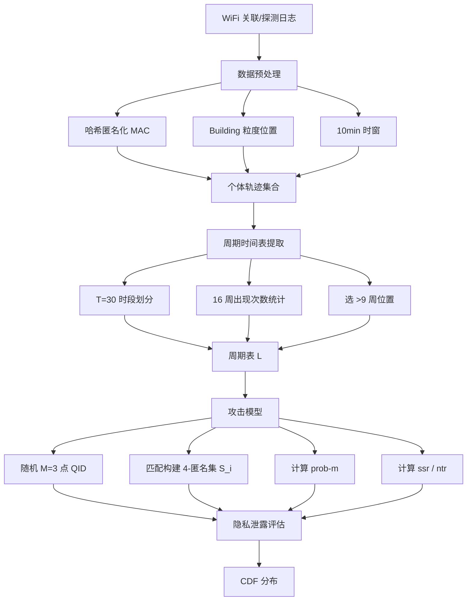
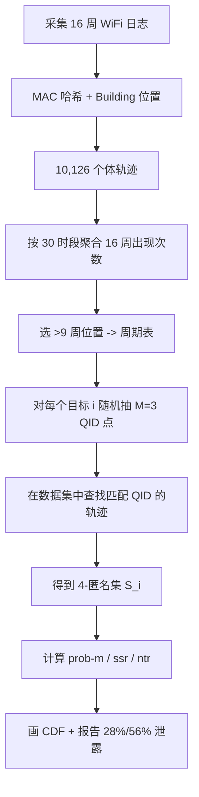

# You Can Hide, But Your Periodic Schedule Can't（IEEE 论文 / PID4775457）

> 标题：You Can Hide, But Your Periodic Schedule Can't
> 作者：Minghua Ma、Kai Zhao、Kaixin Sui、Lei Xu、Yong Li、Dan Pei
> 机构：清华大学 TNList；Microsoft
> 关联 PDF：同目录下 `PID4775457.pdf`

## 一、文档信息速览

| 字段 | 值 |
|---|---|
| 标题 | You Can Hide, But Your Periodic Schedule Can't |
| 作者 | Minghua Ma、Kai Zhao、Kaixin Sui、Lei Xu、Yong Li、Dan Pei |
| 机构 | 清华大学 TNList；Microsoft |
| 发表年份 | IEEE 投稿/CR 版 |
| 分类 | 隐私 / 轨迹匿名 / 数据发布 |
| 核心问题 | 现有 k-匿名能阻止 record linkage，但无法阻止 attribute linkage；尤其在校园周期性行为（课表）这种敏感属性上，k=4 时仍 28% 完全泄露、56% 部分泄露 |
| 主要贡献 | (1) 首次定量研究周期性时间表的 schedule-leakage 风险；(2) 提出基于 16 周清华校园 WiFi 轨迹的大规模测量；(3) 提出 Max Attack Probability (prob-m) 和 Sensitive Schedule Rate (ssr) 两个新指标 |

## 二、背景（Background）

随着移动技术发展，WiFi 在手机、平板、便携游戏机中普遍存在。借助随身设备，企业 WiFi 网络能在室内层面追踪人，比 GPS（1, 2）或蜂窝基站（3, 4, 5）更细粒度。这种移动数据集有巨大价值，可用于基于位置的社交网络（1, 6）、近邻营销（7）、移动建模（4, 8）、智能交通（2, 9）等。

然而，人类移动轨迹非常敏感。例如，研究 [3] 显示一个人访问最多的两个位置最可能是家和公司。如果轨迹数据在发布前未妥善脱敏，用户隐私会被严重侵犯。早期研究 [4] 表明，即使身份被匿名，仅用 4 个随机时空点就能重新识别 95% 的用户。

为解决这一风险，已有大量工作 [3, 5, 10, 11, 12, 13, 14] 试图发布隐私保护的轨迹数据集。其中，k-匿名 [15] 被广泛使用来防止重新识别攻击——它保证在任意匿名集合中，每个个体至少与 k-1 个其他个体不可区分。然而已有定性认识：k-匿名在敏感属性多样性低时仍存在风险（即属性链接攻击 [16]）。l-多样性 [16] 要求 k-匿名集合中敏感属性的多样性足够大，使对手难以猜测。

要实现 l-多样性需定义轨迹的敏感属性，但无统一定义。论文选择"周期性时空时间表（periodic schedule）"作为敏感属性，原因：(1) 周期性时间表包含时空双维度信息，比 top-2 location 包含的纯空间维度更具信息量；(2) 已有 Periodica [22] 等算法可从轨迹中提取周期行为；(3) 校园学生都有规律课表，便于研究；论文有 721 名 TUNow 志愿者提供的 4,412 门课的真实时间表作为 ground truth。

## 三、目的（Problems Solved）

- **k-匿名的 attribute linkage 漏洞**：当敏感属性多样性低时，k-匿名仍泄露周期性时间表。
- **缺乏定量研究**：首次给出 schedule-leakage 的量化指标。
- **校园周期性行为场景**：以 16 周 WiFi 轨迹为代表场景。
- **真实数据驱动**：用清华校园 2,670 个 AP、111 栋楼、10,126 名学生 16 周数据测量。
- **隐私 vs 实用性权衡**：在隐私保护与数据可用性之间寻找平衡点。

## 四、核心原理（Principles）

**系统总览**：论文提出针对 trajectory-only 数据集的 schedule-leakage 攻击模型：(1) 把每天分成 T=30 个时段，统计每个个体 16 周的访问位置；(2) 提取最频繁位置形成 periodic schedule；(3) 用 M 个随机时空点作为 quasi-identifier（QID）执行 k-匿名攻击（k=4）；(4) 用 prob-m 和 ssr 两个指标量化攻击成功率。

**关键概念**：

- **Trajectory**：轨迹，个体的时空序列。
- **WiFi Trajectory**：由 AP 关联/探测日志得到的校园轨迹。
- **Periodic Schedule**：周期性时间表，个体在固定时段反复出现的位置。
- **k-anonymity**：k-匿名，k-1 个其他个体与目标不可区分。
- **Quasi-identifier (QID)**：准标识符，可用于链接到个体的部分信息。
- **Record Linkage**：记录链接，重识别攻击。
- **Attribute Linkage**：属性链接，在匿名集合中猜测敏感属性。
- **l-diversity**：l-多样性，敏感属性多样性约束。
- **Max Attack Probability (prob-m)**：匿名集合中某时段被正确猜测的最大概率。
- **Sensitive Schedule Rate (ssr)**：受害者时间表中容易被猜的时段占比。
- **Non-empty Time slot Rate (ntr)**：非空时段占比（视为受害者有周期活动的时段）。
- **M=3 random points**：QID 由 3 个随机时空点组成。
- **k=4**：使用 4-匿名。

**数学原理**：

- **周期性时间表构建**：对每个个体 i，把每天 24h 划分成 T=30 个时段；对每个时段 n，统计 16 周中 i 出现的位置 v(e)，出现次数大于 9 周（60%）的位置作为周期位置。

- **k-匿名集合构造**：对每个受害者 i，用 M=3 个随机时空点作为 QID，在数据集中查找所有匹配 QID 的轨迹，得到匿名集合 $S_i$。

- **攻击概率（某时段）**：把 $S_i$ 中所有个体的周期性时间表在时段 n 的位置按出现次数分类，假设对手选最多出现的位置 $A_n$：

$$
P_n = \frac{A_n}{k \cdot C}
$$

其中 k=4 为匿名集大小，C=16 周。

- **Max Attack Probability（最大攻击概率）**：

$$
\text{prob-m} = \max_{n=1}^{T} P_n = \max_{n=1}^{T} \frac{A_n}{k \cdot C}
$$

- **Sensitive Schedule Rate（敏感时段率）**：

$$
\text{ssr} = \frac{\#(\text{sensitive time slots})}{T}
$$

- **Non-empty Time slot Rate**：

$$
\text{ntr} = \frac{\#(\text{non-empty time slots})}{T}
$$

其中非空时段指受害者有周期位置（出现次数 > 9 周）的时段。

**与现有技术的差异**：之前轨迹隐私工作 [3, 4, 5, 10, 12, 13, 14] 关注 re-identification（record linkage），本文首次研究 periodic schedule 的 attribute linkage 攻击，揭示即使 4-匿名也存在 28% 完全泄露。

## 五、算法详解（Algorithm）

1. **输入 / 输出**：
   - 输入：清华校园 16 周 WiFi 轨迹（含 Device ID、Time、AP/Building）、721 志愿者 4,412 门课课表（ground truth）。
   - 输出：每个个体在 4-匿名下的 prob-m 与 ssr；CDF 分布与隐私泄露量化。

2. **核心模块**：
   - **轨迹数据预处理**：用哈希匿名化 MAC 地址；位置用最强信号 AP 所在 building 表示；时间用 10min 窗口。
   - **周期性时间表提取**：把 24h 分成 T=30 时段；统计 16 周每个时段 i 在每个 building 的出现次数；选出现 >9 次的位置作为周期位置。
   - **QID 构造**：随机抽取 M=3 个时空点作为 QID。
   - **k-匿名集合构造**：在轨迹数据集中查找所有匹配 QID 的轨迹；得到 $S_i$（k=4 个个体）。
   - **攻击概率计算**：把 $S_i$ 拼成 T×k 矩阵 L；按位置分类累加 16 周出现次数；选最大 $A_n$；$P_n = A_n / (k \cdot C)$。
   - **prob-m & ssr 计算**：prob-m = max P_n；ssr = (# 时段 i 出现位置在 $S_i$ 中最频繁)/T。
   - **评估**：在所有受害者上计算 prob-m、ssr；画 CDF 分布。

3. **伪代码**：

```python
def extract_periodic_schedule(traj_i, weeks=16, T=30, threshold_weeks=9):
    """traj_i: 16周轨迹; 返回 T 时段的周期位置列表"""
    counts = [[0] * N_BUILDINGS for _ in range(T)]
    for (t, b) in traj_i:
        slot = time_to_slot(t)  # 把 t 映射到 [0, T)
        counts[slot][b] += 1
    schedule = []
    for slot in range(T):
        max_b = argmax(counts[slot])
        if counts[slot][max_b] > threshold_weeks:
            schedule.append((slot, max_b))
        else:
            schedule.append((slot, None))
    return schedule

def build_anonymous_set(target_i, all_trajs, M=3):
    """target_i: 受害者; all_trajs: 所有轨迹; 返回匹配 QID 的 k-匿名集"""
    qid = random_sample(target_i.traj, M=M)  # 随机抽 M 个时空点
    S = [j for j, tr in enumerate(all_trajs) if contains_all(tr, qid)]
    return S  # |S| >= k

def compute_prob_m(S_i, all_schedules, k=4, weeks=16):
    """S_i: 匿名集; all_schedules: 所有周期表; 返回 prob-m"""
    L = stack_periodic_schedules([all_schedules[i] for i in S_i])  # T x k
    max_p = 0.0
    for n in range(L.shape[0]):
        counter = Counter(L[n])
        top_count = counter.most_common(1)[0][1]
        p = top_count / (k * weeks)
        if p > max_p:
            max_p = p
    return max_p

def compute_ssr(target_schedule, S_i, all_schedules):
    L = stack_periodic_schedules([all_schedules[i] for i in S_i])
    sensitive = 0
    for n, (slot, loc) in enumerate(target_schedule):
        if loc is None:
            continue
        counter = Counter(L[n])
        top_loc, top_count = counter.most_common(1)[0]
        if loc == top_loc:
            sensitive += 1
    return sensitive / len(target_schedule)
```

4. **关键数学**：见 §四。

5. **复杂度分析**：
   - 周期表提取：$O(|traj_i|)$。
   - 匿名集构造：$O(N \cdot M)$ 字符串匹配（N 为总用户数）。
   - prob-m / ssr 计算：$O(T \cdot k)$。
   - 整体评估 N 个受害者：$O(N^2 \cdot M)$ 在最坏情况下。

6. **训练与推理**：纯数据驱动分析，无训练过程。

7. **示例**：某学生 ID1 每周二 13:30-15:05 都在 building a（16 周中 14 周），ID2、ID3 也类似。攻击者知道 ID1 在周二 13:30-15:05 出现 → QID 匹配 → 找到 ID1/2/3 的匿名集 → 在周二 13:30-15:05 时段，a 出现 14+12+15=41 次（共 4×16=64）→ P_n=0.64；最终 prob-m 可达 0.85（极端情况），ssr=0.33。

## 六、系统架构图（Architecture）



## 七、流程图（Process Flow）



## 八、关键创新点（Key Innovations）

- **+ 首次量化周期性时间表泄露**：从定性到定量（prob-m、ssr 两指标）。
- **+ 大规模真实校园数据**：10,126 学生、16 周、2,670 AP、111 building。
- **+ 4-匿名仍 28% 完全泄露**：揭示 k-匿名在周期性数据上的不足。
- **+ 与 721 志愿者课表对齐**：用 4,412 门课验证周期表提取的准确性（提取 3,548 vs 真实 4,412，覆盖 80%+）。
- **+ Privacy vs Utility 讨论**：l-diversity 会显著降低数据可用性。

## 九、实验与结果（Experiments）

- **数据集**：清华校园 16 周（2016-02-22 至 2016-06-12）WiFi 轨迹；10,126 学生；2,670 Cisco AP；111 building。
- **真实课表**：721 TUNow 志愿者共 4,412 门课（用于验证周期表提取的 ground truth）。
- **设置**：T=30 时段；M=3 QID；k=4 匿名；threshold 60% (9/16 周)。
- **关键结果数字**：
  - 56% 个体匿名集大小为 1（直接重识别）。
  - 4-匿名下 28% 周期表完全泄露；56% 部分泄露。
  - 14% 个体 prob-m > 0.8。
  - 平均 prob-m = 0.65。
  - 周期表提取数 3,548 vs 真实 4,412（覆盖 80%+）。
- **基线方法**：与 top-2 location 等 k-匿名实现比较；本文的 l-diversity 方案代价大。
- **可视化**：prob-m、ssr、ntr 三个 CDF；ssr/ntr 接近 1 说明大部分非空时段都可被攻击。

## 十、应用场景（Use Cases）

- **校园 WiFi 轨迹发布**：高校发布研究轨迹前需评估周期性泄露。
- **企业 WiFi 室内定位数据发布**：商场、办公楼的室内位置数据脱敏。
- **智能交通数据发布**：定期出行模式（如通勤路线）的隐私保护。
- **移动应用用户行为研究**：App 内用户位置序列的发布。
- **社交网络位置签到数据**：Foursquare、Gowalla 类数据的隐私。
- **公共数据集脱敏规范**：政策制定者参考。

## 十一、相关论文（Related Papers in this set）

- `TraceSieve_ISSRE23`（追踪异常检测）
- `CMDiagnostor`（指标根因）
- `Chain-of-Event_Interpretable-Root-Cause-Analysis-for-MicroservicesFSE24-Camera-Ready`（事件根因）
- `AlertRCA_CCGRID2024_CameraReady`（告警根因）
- `TSC23-DiagFusion`（多模态故障诊断）

## 十二、术语表（Glossary）

- **Trajectory**：轨迹，时空序列。
- **WiFi Trajectory**：由 WiFi AP 关联/探测日志得到的轨迹。
- **Periodic Schedule**：周期性时间表。
- **k-anonymity**：k-匿名。
- **Quasi-identifier (QID)**：准标识符。
- **Record Linkage**：记录链接（重识别）。
- **Attribute Linkage**：属性链接。
- **l-diversity**：l-多样性。
- **prob-m (Max Attack Probability)**：最大攻击概率。
- **ssr (Sensitive Schedule Rate)**：敏感时段率。
- **ntr (Non-empty Time slot Rate)**：非空时段率。
- **M=3 random points**：3 个随机时空点。
- **T=30 slots**：每天 30 时段。
- **C=16 weeks**：16 周。
- **TUNow App**：清华校园 App，提供志愿者课表 ground truth。
- **Cisco AP**：企业级 AP，论文使用 2,670 台。

## 十三、参考与延伸阅读

- Paper: k-anonymity（Sweeney, 2002）。
- Paper: l-diversity（Machanavajjhala et al., TKDD 2007）。
- Paper: Periodica 周期行为挖掘 [22]。
- Paper: 4 random points re-identify 95% [4]。
- Paper: 清华 EDUM / Mobicamp 校园数据系统 [18, 19]。
- Paper: Differential Privacy（Dwork et al., TCC 2006）——一种更现代的隐私保护技术。
- 相关论文：`TraceSieve_ISSRE23` 等。
- 网址：清华网络中心、TUNow App。
