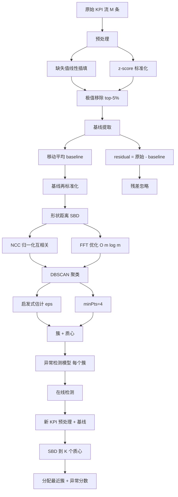
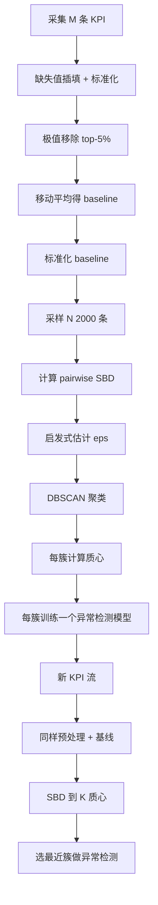

# Robust and Rapid Clustering of KPIs for Large-Scale Anomaly Detection（IEEE 2018 / PID5338621）

> 标题：Robust and Rapid Clustering of KPIs for Large-Scale Anomaly Detection
> 作者：Zhihan Li、Youjian Zhao、Rong Liu、Dan Pei
> 机构：清华大学；Stevens Institute of Technology；BNRist
> 发表年份：2018
> 会议/期刊：IEEE BigData 2018（投稿/CR 版）
> 关联 PDF：同目录下 `PID5338621.pdf`

## 一、文档信息速览

| 字段 | 值 |
|---|---|
| 标题 | Robust and Rapid Clustering of KPIs for Large-Scale Anomaly Detection |
| 作者 | Zhihan Li、Youjian Zhao、Rong Liu、Dan Pei |
| 机构 | 清华大学；Stevens Institute of Technology；BNRist（北京国家信息科学与技术研究中心） |
| 发表年份 | 2018 |
| 会议/期刊 | IEEE BigData 2018 |
| 分类 | 时间序列聚类 / KPI 异常检测 / 大规模 AIOps |
| 核心问题 | 大规模 KPI（关键绩效指标）异常检测中每个 KPI 单独建模代价高；时间序列聚类常因噪声/异常/相位偏移/振幅差异而失真；KPI 维度高达上万点 |
| 主要贡献 | (1) 提出 ROCKA：4 步鲁棒聚类算法（预处理 / 基线提取 / 聚类 / 分配）；(2) 真实 KPI 数据集 F-score >0.85；(3) 异常检测训练时间减少 90%，性能仅损失 15% |

## 二、背景（Background）

互联网公司（电商、社交、搜索引擎）监控数千到数百万 KPI（Key Performance Indicators，如 CPU 利用率、QPS）以保证服务可靠。KPI 上的异常（尖峰或凹陷）常预示相关应用的潜在故障——服务器宕机、网络过载、外部攻击等。因此异常检测被广泛用于最小化损失 [2, 4, 5]。

多数异常检测算法（Opprentice [2]、EGADS [4]、DONUT [5]）假设每个 KPI 需要一个独立模型。但在大规模场景下：
1. 模型选择、参数调优、训练、标注成本巨大。
2. 数千到数百万 KPI 无法逐一建模。

幸运的是，许多 KPI 因隐含的关联性彼此相似。若能把同质 KPI（如同一均衡服务器集群中各服务器的 QPS）按相似度分组为少数聚类，每个聚类只需一个异常检测模型，便能大幅降低开销。

KPI 聚类面临两个经典时间序列聚类不存在的新挑战：
1. **噪声、异常、相位偏移、振幅差异**：这些形状变化会扭曲 KPI 之间的相似度，使传统方法失效。
2. **高维度**：KPI 通常上万数据点（几天到几周），传统算法难以应对。

时间序列聚类虽已研究 20 余年 [6]，但大多数论文 [7, 8] 关注理想化数据——低维度（<1000 点）、平滑曲线。然而现实 KPI 充满噪声和异常，相位偏移和振幅差异常见。

## 三、目的（Problems Solved）

- **大规模 KPI 异常检测的高训练开销**：通过聚类把 M 个模型减少到 K 个（M >> K）。
- **KPI 形状变化鲁棒性**：对噪声、异常、相位偏移、振幅差异不敏感。
- **高维时间序列聚类效率**：处理上万点 KPI。
- **无需预设聚类数**：DBSCAN 风格密度聚类自适应聚类数。
- **新 KPI 自动分配**：聚类后用质心做 1-NN 分配。
- **真实场景验证**：在大型互联网公司 KPI 上验证。

## 四、核心原理（Principles）

**系统总览**：ROCKA 包含 4 步：
1. **预处理（Preprocessing）**：缺失值线性插填；标准化（z-score）消除振幅差异。
2. **基线提取（Baseline Extraction）**：移除 top-5% 极值（疑似异常）→ 线性插填；再用小窗口移动平均把 KPI 拆为 baseline + residuals。
3. **聚类（Clustering）**：在基线上用形状距离 SBD（基于互相关）作为相似度；DBSCAN 自动确定密度半径 ε；用启发式算法选 ε；找每簇质心。
4. **分配（Assignment）**：新 KPI 同样预处理 + 基线提取，计算与各质心的 SBD，分配到最近簇。

**关键概念**：

- **KPI（Key Performance Indicator）**：关键绩效指标。
- **Time Series T**：时序 $T = (x_1, x_2, ..., x_m)$。
- **Baseline**：基线，KPI 的"正常"平滑趋势。
- **Residual**：残差，基线与原始的差。
- **Standardization（z-score）**：$x̂_t = (x_t - μ) / σ$。
- **Shape-Based Distance (SBD)**：基于归一化互相关 NCC 的形状距离。
- **Normalized Cross-Correlation (NCC)**：归一化互相关。
- **Cross-Correlation CC_s(x̃, ỹ)**：在相位偏移 s 下的内积。
- **DBSCAN**：基于密度的聚类算法。
- **Density Radius ε**：DBSCAN 邻域半径。
- **minPts**：DBSCAN 核心对象的最小邻居数（设为 4）。
- **kdis**：每个对象到其第 k 近邻的距离。
- **Cluster Centroid**：簇内总 SBD 最小的对象。
- **YADING [10]**：基线聚类算法。
- **Sliding Window**：滑窗。

**数学原理**：

- **基线提取**（窗口长 W，stride=1）：

$$
x_t^* = \frac{1}{W} \sum_{i=1}^{W} x_{t-i+1}
$$

- **互相关 CC_s**（位移 s 下的内积）：

$$
CC_s(\vec{x}, \vec{y}) = \begin{cases} \sum_{i=1}^{m-s} x_{i+s} \cdot y_i, & s \ge 0 \\ \sum_{i=1}^{m+s} x_i \cdot y_{i-s}, & s < 0 \end{cases}
$$

- **归一化互相关 NCC**：

$$
NCC(\vec{x}, \vec{y}) = \max_s \frac{CC_s(\vec{x}, \vec{y})}{\|\vec{x}\|_2 \cdot \|\vec{y}\|_2}
$$

- **形状距离 SBD**（范围 [0, 2]，0 表示完全相同）：

$$
SBD(\vec{x}, \vec{y}) = 1 - NCC(\vec{x}, \vec{y})
$$

- **簇质心**：簇内总 SBD 最小的对象

$$
\text{centroid} = \arg\min_{\vec{x} \in C} \sum_{\vec{y} \in C} SBD(\vec{x}, \vec{y})^2
$$

- **DBSCAN 邻域**：对象 p 在 ε 内有 ≥ minPts 邻居则是核心对象；密度可达形成簇。

- **kdis 启发式**：在排序后的 kdis 曲线上找平坦段，候选 ε；选 max_radius (0.05) 范围内最大的候选 ε。

**与现有技术的差异**：YADING 等基线方法对原始数据直接聚类，易受噪声/异常/相位影响。ROCKA 引入基线提取消除噪声/异常、SBD 处理相位偏移、密度估计自动选 ε，在真实数据上 F-score >0.85（YADING 在高维 KPI 上效果不佳）。

## 五、算法详解（Algorithm）

1. **输入 / 输出**：
   - 输入：M 条原始 KPI 时间序列（每条长度 m）。
   - 输出：K 个聚类，每簇一个质心；新 KPI 分配到最近质心。

2. **核心模块**：
   - **预处理**：缺失值线性插填；标准化。
   - **极值移除**：标准化后移除偏离均值 top-5% 数据点，线性插填。
   - **基线提取**：移动平均滑窗；baseline = 滑动平均；residual = 原始 - baseline。
   - **标准化基线**：在基线上再标准化。
   - **DBSCAN 聚类**：用 SBD 计算 pairwise 距离；启发式估计 ε（max_radius=0.05，minPts=4）；DBSCAN 聚类。
   - **质心计算**：每簇中 SBD^2 之和最小的对象作为质心。
   - **分配**：新 KPI 同样预处理 + 基线提取 + SBD 到各质心 → 最小 SBD 簇。

3. **伪代码**：

```python
def preprocess(kpi):
    kpi = linear_interpolate_missing(kpi)
    kpi = z_score_standardize(kpi)
    return kpi

def extract_baseline(kpi, window=24):
    # 1) 移除 top-5% 极值
    threshold = np.percentile(np.abs(kpi), 95)
    cleaned = np.where(np.abs(kpi) > threshold, np.nan, kpi)
    cleaned = linear_interpolate(cleaned)
    # 2) 移动平均
    baseline = moving_average(cleaned, window)
    residuals = cleaned[window-1:] - baseline
    return z_score(baseline)

def sbd(x, y):
    # 归一化互相关
    ncc = max(np.correlate(x, y, mode='full')) / (np.linalg.norm(x) * np.linalg.norm(y))
    return 1 - ncc

def estimate_eps(kdis, max_radius=0.05, minPts=4):
    # 启发式：在 max_radius 范围内的平坦段中找最大 ε
    candidates = find_flat_parts(kdis, max_radius, minPts)
    return max(candidates) if candidates else 0.05

def cluster_kpis(baselines, minPts=4):
    dist_matrix = pairwise_sbd(baselines)
    eps = estimate_eps(kdis_from(dist_matrix, k=minPts))
    clusters = dbscan(dist_matrix, eps=eps, minPts=minPts)
    centroids = [argmin_sum_sbd(c) for c in clusters]
    return clusters, centroids

def assign_new_kpi(new_kpi, centroids):
    baseline = extract_baseline(preprocess(new_kpi))
    sbd_to_centroids = [sbd(baseline, c) for c in centroids]
    return argmin(sbd_to_centroids)
```

4. **关键数学**：见 §四。

5. **复杂度分析**：
   - SBD 计算：$O(m \log m)$（用 FFT 优化互相关）。
   - 两两距离矩阵：$O(N^2 m \log m)$。
   - DBSCAN：$O(N \log N)$。
   - 启发式 ε 估计：$O(N \log N)$（divide & conquer）。
   - 新 KPI 分配：$O(K m \log m)$。

6. **训练与推理**：
   - 训练（离线）：随机采样（如 9000+ KPI 中抽 2000）→ 聚类 → 计算质心。
   - 推理（在线）：新 KPI 走预处理 + 基线提取 + SBD 到 K 个质心 → 选最近 → 用该簇的异常检测模型。

7. **示例**：某互联网公司 QPS、CPU 利用率、错误计数等 9000+ KPI；ROCKA 抽 2000 聚类到 50 簇；每簇训练一个 DONUT 模型；新 KPI 毫秒级分配。训练时间从单 KPI 单独训练约 1.5 小时 × 9000 降到 50 × 1.5 小时 ≈ 75 小时，开销降 90%。

## 六、系统架构图（Architecture）



## 七、流程图（Process Flow）



## 八、关键创新点（Key Innovations）

- **+ 极值移除 + 基线提取**：消除异常和噪声对聚类的影响。
- **+ SBD 形状距离**：用 NCC 处理相位偏移，O(m log m) FFT 优化高效。
- **+ 启发式 ε 估计**：自动选 DBSCAN 密度半径，无需人工设定。
- **+ 聚类 + 共享异常检测模型**：训练开销从 M 降到 K。
- **+ 真实工业 KPI 验证**：F-score >0.85；异常检测训练时间减少 90%。

## 九、实验与结果（Experiments）

- **数据集**：公开 UCR 时间序列数据集 + 真实工业 KPI（>9000 条，几天到几周长度）。
- **Baseline**：YADING [10]、K-Means、K-medoids、DBSCAN（多种距离）。
- **主要指标**：F-score、Rand Index、训练时间、异常检测精度损失。
- **关键结果数字**：
  - 真实 KPI 上 F-score >0.85（YADING 等基线较低）。
  - 异常检测训练时间从 100% 降到 10%（减少 90%）。
  - 性能损失仅 15%。
  - 采样 2000 足以代表 9000+ KPI。
- **消融实验**：分别去掉极值移除、基线提取、SBD、密度估计。
- **效率分析**：SBD 在 1440 点 KPI 上单次计算 <1ms；聚类分钟级。
- **可视化**：每簇 baseline 与簇内 KPI 叠加对比；聚类前后 t-SNE 投影。

## 十、应用场景（Use Cases）

- **互联网公司大规模 KPI 异常检测**：电商、社交、搜索引擎。
- **服务器集群监控**：QPS、CPU、内存、错误计数等批量监控。
- **SaaS 平台 APM**：微服务多个 KPI 联合建模。
- **电信运营商 KPI 监控**：基站流量、用户数等。
- **IoT 设备时序数据聚类**：传感器数据按行为模式分组。
- **金融交易指标聚类**：股票、期货价格行为模式分组。

## 十一、相关论文（Related Papers in this set）

- `TraceSieve_ISSRE23`（追踪异常检测）
- `KDD21_InterFusion_Li`（多源 KPI 异常检测）
- `OmniAnomaly_camera-ready`（多变量 KPI 异常检测 VAE）
- `AlertRCA_CCGRID2024_CameraReady`（告警根因）
- `TSC23-DiagFusion`（多模态故障诊断）
- `CMDiagnostor`（指标根因）

## 十二、术语表（Glossary）

- **KPI（Key Performance Indicator）**：关键绩效指标。
- **Time Series T**：时序 $(x_1, ..., x_m)$。
- **Baseline**：基线，KPI 正常趋势。
- **Residual**：残差。
- **Standardization（z-score）**：$x̂ = (x - μ)/σ$。
- **SBD（Shape-Based Distance）**：形状距离。
- **NCC（Normalized Cross-Correlation）**：归一化互相关。
- **CC_s**：位移 s 下的互相关。
- **DBSCAN**：基于密度的聚类。
- **Density Radius ε**：DBSCAN 邻域半径。
- **minPts**：核心对象最小邻居数。
- **kdis**：k 距离，到第 k 近邻的距离。
- **Cluster Centroid**：簇内 SBD 平方和最小的对象。
- **YADING [10]**：基线聚类算法。
- **FFT（Fast Fourier Transform）**：快速傅里叶变换。
- **DONUT [5]**：VAE-based 异常检测算法。
- **Opprentice [2]**：基于规则+ML 的异常检测。
- **EGADS [4]**：Yahoo 异常检测平台。

## 十三、参考与延伸阅读

- Paper: DBSCAN（Ester et al., KDD 1996）。
- Paper: Shape-Based Distance SBD [9]。
- Paper: YADING 多时间序列聚类 [10]。
- Paper: DONUT 异常检测 [5]。
- Paper: Opprentice [2]、EGADS [4]。
- 工具：FFT (numpy.fft)、DBSCAN (sklearn.cluster.DBSCAN)。
- 相关论文：`TraceSieve_ISSRE23`、`KDD21_InterFusion_Li`、`OmniAnomaly_camera-ready`。
- 公开数据集：UCR Time Series Archive。
