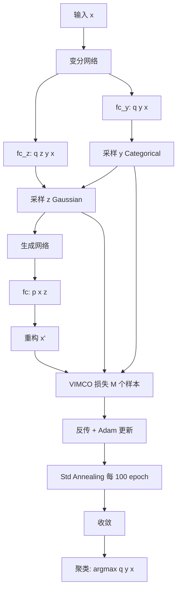

# NVISA: Unsupervised Clustering through Gaussian Mixture VAE with Non-Reparameterized VI and Std Annealing（IEEE / PID6423661）

> 标题：Unsupervised Clustering through Gaussian Mixture Variational AutoEncoder with Non-Reparameterized Variational Inference and Std Annealing
> 作者：Zhihan Li、Youjian Zhao、Haowen Xu、Wenxiao Chen、Shangqing Xu、Yilin Li、Dan Pei
> 机构：清华大学；BNRist
> 关联 PDF：同目录下 `PID6423661.pdf`

## 一、文档信息速览

| 字段 | 值 |
|---|---|
| 标题 | Unsupervised Clustering through Gaussian Mixture VAE with Non-Reparameterized Variational Inference and Std Annealing |
| 作者 | Zhihan Li、Youjian Zhao、Haowen Xu、Wenxiao Chen、Shangqing Xu、Yilin Li、Dan Pei |
| 机构 | 清华大学；BNRist（北京国家信息科学与技术研究中心） |
| 发表年份 | IEEE 投稿/CR 版 |
| 分类 | 无监督聚类 / 深度生成模型 / Gaussian Mixture VAE |
| 核心问题 | 现有 GMVAE/VaDE 用 mean-field 近似 q(z|x)q(y|x)，表达能力受限；类别变量 y 不可重参数化时训练难稳定 |
| 主要贡献 | (1) 直接使用 q(z|y,x) 代替 mean-field；(2) 采用 VIMCO 非重参数化变分推断；(3) 提出 std annealing 稳定训练；(4) 5 个基准数据集上 ACC 优于 GMVAE/VaDE/LTVAE 等基线 |

## 二、背景（Background）

聚类是机器学习与人工智能的基础研究课题，目的是以无监督方式将相似样本分组。传统方法如 k-means [1] 和高斯混合模型 GMM [2] 用数据空间或人工特征空间的简单相似性度量和统计分布表示聚类，需针对特定任务精心设计特征。但对图像等复杂数据，手工设计特征极具挑战，聚类效果差。

近年来深度神经网络（DNN）显著提升复杂数据上的聚类精度。Deep Embedded Clustering (DEC) [3] 用 DNN 同时学习特征和聚类质心，然后在低维特征上 k-means。但训练目标与经典聚类不完全匹配，效果不佳。

另一条路线是深度生成模型——VAE [4] 和 GAN [5] 的变体。Gaussian Mixture GAN (GM-GAN) [6] 在隐空间用高斯混合；但 GAN 类对聚类分配和其他隐变量关系约束不强，在 MNIST 之外的复杂数据集上效果下降。

VAE 路线：Gaussian Mixture VAE (GMVAE) [7] 和 VaDE [8] 是两个典型代表。它们用 Categorical 变量 y 表示聚类分配、Gaussian 变量 z 表示其他信息；通过 mean-field 近似 q(z, y|x) = q(z|x)q(y|x) 和 SGVB 估计器训练。但 mean-field 限制 z 和 y 在 x 条件下独立，难以处理真实数据集。

## 三、目的（Problems Solved）

- **mean-field 近似限制 z 与 y 的依赖**：直接用 q(z|y, x) 表达任何条件依赖。
- **类别变量 y 不可重参数化**：提出使用 VIMCO 等非重参数化 VI 方法。
- **VIMCO 训练不稳定**：提出 std annealing 稳定训练。
- **类别变量 y 训练困难**：用 NVIL/VIMCO 处理离散 y。
- **基线算法精度不足**：在 5 个基准数据集上超过 GMVAE/VaDE/LTVAE。

## 四、核心原理（Principles）

**系统总览**：NVISA 是基于 Gaussian Mixture VAE 的无监督聚类框架。生成模型 $p_θ(x, y, z) = p_θ(x|z) p_θ(z|y) p_θ(y)$；变分后验 $q_φ(z, y|x) = q_φ(z|y, x) q_φ(y|x)$（注意：直接依赖，不 mean-field）。y ∈ {1..K} 是 Categorical 变量；z 是条件 Gaussian 变量；x 是 Gaussian 分布。NVISA 用 VIMCO 训练 + std annealing 稳定。

**关键概念**：

- **Gaussian Mixture VAE**：用 Categorical y + Gaussian z 的 VAE 变体。
- **Mean-Field Approximation**：$q_φ(z, y|x) = q_φ(z|x) q_φ(y|x)$，限制 z 与 y 在 x 条件下独立。
- **q(z|y, x)**：直接条件化 y 和 x，保留依赖。
- **VIMCO（Variational Inference for Monte Carlo Objectives）**：多采样变分下界，对非可重参数化变量友好。
- **NVIL（Neural Variational Inference and Learning）**：带 baseline net 的非重参数化方法。
- **EnumY**：枚举 y 用 SGVB 训练。
- **Categorical Reparameterization with Gumbel-Softmax**：另一种可选，但论文发现 MNIST 上仅约 80% ACC，未采用。
- **Std Annealing**：std 退火，给 $σ_x, σ_z$ 加随训练退火的下界，防止 VIMCO 训练 loss 发散。
- **Unsupervised Clustering Accuracy (ACC)**：聚类分配与真实标签的最佳 1-to-1 映射后正确率。
- **Kuhn-Munkres Algorithm**：求最佳 1-to-1 映射。
- **SoftPlus**：$SoftPlus(a) = log(e^a + 1)$。
- **KL Divergence**：KL 散度。
- **Importance Sampling Estimator**：重要性采样估计。
- **Lower Bound on Std**：给 σ 加常数下界。

**数学原理**：

- **生成模型**：

$$
p_θ(x, y, z) = p_θ(x|z) p_θ(z|y) p_θ(y)
$$

其中 $p_θ(y) = Cat(π)$；$p_θ(z|y) = N(μ_z(y;θ), σ_z(y;θ)^2 I)$；$p_θ(x|z) = N(μ_x(z;θ), σ_x(z;θ)^2 I)$。

- **变分后验**（不用 mean-field）：

$$
q_φ(z, y|x) = q_φ(z|y, x) q_φ(y|x)
$$

其中 $q_φ(y|x) = Cat(π(x;φ))$；$q_φ(z|y, x) = N(μ_z(x,y;φ), σ_z(x,y;φ)^2 I)$。

- **VIMCO 目标**（M 个样本）：

$$
L_M(x;θ,φ) = E_{(y,z)^{(1:M)} \sim q_φ(z,y|x)} \left[ \log \frac{1}{M} \sum_{m=1}^{M} \frac{p_θ(x, y^{(m)}, z^{(m)})}{q_φ(z^{(m)}, y^{(m)}|x)} \right]
$$

- **NVIL 梯度**：

$$
\nabla L_{ELBO} = E_{q_φ(z,y|x)} \nabla f(x,y,z) + (f(x,y,z) - C_ψ(x) - c) \nabla \log q_φ(z,y|x)
$$

其中 $f = \log p_θ - \log q_φ$；$C_ψ(x)$ 是 baseline net；$c$ 是可学习常数。

- **Std Annealing**：

$$
σ'_x(z;θ) = SoftPlus(σ_x(z;θ)) + ϵ_x
$$
$$
σ'_z(x,y;φ) = SoftPlus(σ_z(x,y;φ)) + ϵ_z
$$

其中 $ϵ_x, ϵ_z$ 从 1 起步、每 100 epoch 减半、最终 $10^{-4}$。

- **ELBO 分解**（VIMCO 目标分解）：

$$
L_M = E_{q_φ(z,y|x)} \log p_θ(x|z) - D_{KL}(q_φ(y,z) \| p_θ(y,z)) - I((Z,Y); X)
$$

**与现有技术的差异**：GMVAE/VaDE 用 mean-field $q(z|x)q(y|x)$，本文用 $q(z|y, x)$，保留条件依赖；VIMCO 比 EnumY 训练更稳、聚类更准；std annealing 解决 VIMCO loss 发散问题。

## 五、算法详解（Algorithm）

1. **输入 / 输出**：
   - 输入：图像或特征向量 $x \in R^L$；聚类数 K。
   - 输出：每个样本的聚类分配 $y$。

2. **核心模块**：
   - **生成网络**：x 的高斯均值 μ_x(z;θ) 和 σ_x(z;θ) 由神经网络输出。
   - **变分网络**：π(x;φ)、μ_z(x,y;φ)、σ_z(x,y;φ) 由神经网络输出。
   - **VIMCO 训练**：从 q(y|x) 采样 y、再从 q(z|y, x) 采样 z，共 M 个；计算 VIMCO loss。
   - **Std Annealing**：每个 epoch 调整 ϵ_x, ϵ_z。
   - **聚类推断**：$y = \arg\max q_φ(y|x)$。

3. **伪代码**：

```python
class NVISA(nn.Module):
    def __init__(self, L_in, K, L_z):
        # 变分网络
        self.fc_y = nn.Linear(L_in, K)  # q(y|x)
        self.fc_z_loc = nn.Linear(L_in + K, L_z)  # q(z|y, x)
        self.fc_z_scale = nn.Linear(L_in + K, L_z)
        # 生成网络
        self.dec_fc = nn.Sequential(..., nn.Linear(L_z, L_in))

    def encode(self, x, y_onehot):
        h = torch.cat([x, y_onehot], dim=-1)
        mu = self.fc_z_loc(h)
        sigma = F.softplus(self.fc_z_scale(h)) + self.eps_z
        return mu, sigma

    def decode(self, z):
        mu = self.dec_fc(z)
        sigma = F.softplus(...) + self.eps_x
        return mu, sigma

    def vimeo_loss(self, x, M=15):
        # 枚举 y
        logits_y = self.fc_y(x)
        # 多采样 (y, z)
        samples = []
        for m in range(M):
            y = gumbel_softmax(logits_y, hard=False)  # 或直接采样
            mu_z, sigma_z = self.encode(x, y)
            z = mu_z + sigma_z * torch.randn_like(mu_z)
            mu_x, sigma_x = self.decode(z)
            # log p(x, y, z) / q(y, z | x)
            log_p = gaussian_logpdf(x, mu_x, sigma_x) + \
                    gaussian_logpdf(z, mu_z_prior, sigma_z_prior).sum(-1) + \
                    categorical_logpdf(y, logits=logits_y)
            log_q = gaussian_logpdf(z, mu_z, sigma_z).sum(-1) + categorical_logpdf(y, logits=logits_y)
            samples.append((log_p - log_q, z, y))
        # VIMCO baseline + leave-one-out
        log_ws = torch.stack([s[0] for s in samples], dim=0)  # M x B
        # ...VIMCO 具体计算...
        return -log_likelihood.mean()

    def step_anneal(self):
        self.eps_x = max(self.eps_x * 0.5, 1e-4)
        self.eps_z = max(self.eps_z * 0.5, 1e-4)
```

4. **关键数学**：见 §四。

5. **复杂度分析**：
   - 每次前向：与 VAE 相同，O(B·L_in·L_z)。
   - VIMCO M 采样：O(M·B·L_in·L_z)。
   - 总训练：每 epoch O(M·N·L_in·L_z)。

6. **训练与推理**：
   - 训练：Adam 优化器；初始 lr=0.001，每 300 epoch ×0.5；VIMCO 样本数 M=15（CIFAR-100 取 50）。
   - 推理：$y = \arg\max q_φ(y|x)$。

7. **示例**：MNIST 60000 训练图像 → NVISA 用 z dim=10、k=10 → ACC 98.40%（最好）/ 96.55%±2.64%（平均）；用 AE 预训练 + GMM 初始化可达 98.04%±0.17%。

## 六、系统架构图（Architecture）



## 七、流程图（Process Flow）

```mermaid
flowchart TD
    S1[输入数据集 5 个] --> S2[归一化 [0, 1] 或 z-score]
    S2 --> S3[NVISA 网络前向]
    S3 --> S4{训练或推理}
    S4 -->|训练| S5[采样 M 个 y z]
    S5 --> S6[VIMCO 损失计算]
    S6 --> S7[Adam 反向传播]
    S7 --> S8[Std Annealing 调 eps]
    S8 --> S9[收敛?]
    S9 -->|否| S3
    S9 -->|是| S10[保存模型]
    S4 -->|推理| S11[y = argmax q y x]
    S10 --> S11
    S11 --> S12[输出聚类分配]
```

## 八、关键创新点（Key Innovations）

- **+ q(z|y, x) 代替 mean-field**：表达更一般的条件依赖，聚类精度更高。
- **+ VIMCO 非重参数化 VI**：处理 Categorical 变量 y。
- **+ Std Annealing**：稳定 VIMCO + Gaussian p(x|z) 训练；loss 永不 divergence。
- **+ 5 个基准数据集 SOTA**：MNIST 98.40%、Fashion-MNIST 66.14%、STL-10 91.22%、CIFAR-10 76.96%、CIFAR-100 38.79%。
- **+ AE 预训练 + GMM 初始化**：MNIST 进一步提升到 98.04%±0.17%。

## 九、实验与结果（Experiments）

- **数据集**：MNIST、Fashion-MNIST、STL-10、CIFAR-10、CIFAR-100。
- **Baseline**：AE+GMM、VAE+GMM、DEC、GM-GAN、GMVAE、VaDE、LTVAE-GMM、LTVAE-full。
- **主要指标**：Unsupervised Clustering Accuracy (ACC) %, K=10（MNIST/Fashion/STL-10/CIFAR-10），K=100（CIFAR-100）。
- **关键结果数字**（Table I）：
  - MNIST：NVISA(best) 98.40 / GM-GAN 99.24。
  - Fashion-MNIST：NVISA 66.14 / LTVAE-full 61.32。
  - STL-10：NVISA 91.22。
  - CIFAR-10：NVISA 76.96。
  - CIFAR-100：NVISA 38.79。
  - NVIL 训练 loss 发散；VIMCO 1000 samples ACC 91.3；VIMCO 15 + std annealing ACC 98.40。
- **消融实验**：(1) q(z|y,x) vs mean-field；(2) EnumY vs NVIL vs VIMCO；(3) std annealing 开/关。
- **效率分析**：单次实验 3-12 小时（CIFAR-100 30 小时），GTX 1080 Ti。
- **可视化**：t-SNE 嵌入投影、生成样本对比。

## 十、应用场景（Use Cases）

- **图像聚类**：手写数字、时尚商品、自然图像的自动分组。
- **客户分群**：电商用户行为聚类。
- **异常检测聚类**：异常模式无监督分组。
- **基因表达数据聚类**：高维生物数据。
- **文档主题聚类**：文本嵌入的聚类。
- **跨模态聚类**：图像+文本联合聚类。

## 十一、相关论文（Related Papers in this set）

- `TraceSieve_ISSRE23`（追踪异常检测）
- `KDD21_InterFusion_Li`（多源 KPI 异常）
- `OmniAnomaly_camera-ready`（多变量 KPI 异常 VAE）
- `AlertRCA_CCGRID2024_CameraReady`（告警根因）
- `TSC23-DiagFusion`（多模态故障诊断）

## 十二、术语表（Glossary）

- **Gaussian Mixture VAE**：Categorical y + Gaussian z 的 VAE。
- **Mean-Field Approximation**：$q(z,y|x) = q(z|x)q(y|x)$。
- **q(z|y, x)**：直接条件化 y 和 x。
- **VIMCO**：Variational Inference for Monte Carlo Objectives。
- **NVIL**：Neural Variational Inference and Learning。
- **EnumY**：枚举 y 用 SGVB 训练。
- **Std Annealing**：std 退火。
- **Gumbel-Softmax**：Categorical 重参数化方法。
- **ACC**：Unsupervised Clustering Accuracy。
- **Kuhn-Munkres Algorithm**：求最佳 1-to-1 映射。
- **SoftPlus**：$log(e^a+1)$。
- **Lower Bound on Std**：σ 的常数下界。
- **ResNet-50 Features**：STL-10/CIFAR 用的预训练 2048 维特征。
- **LTVAE**：Latent Tree VAE。
- **DEC**：Deep Embedded Clustering。
- **GM-GAN**：Gaussian Mixture GAN。

## 十三、参考与延伸阅读

- Paper: VAE（Kingma & Welling, 2014）[4]。
- Paper: GMVAE [7]、VaDE [8]、LTVAE [21]。
- Paper: VIMCO（Burda et al., 2016；Mnih & Rezende 扩展）[9, 13]。
- Paper: NVIL（Mnih & Gregor, 2014）[12]。
- Paper: Gumbel-Softmax [10]。
- Paper: DEC [3]、GM-GAN [6]。
- 数据集：MNIST、Fashion-MNIST、STL-10、CIFAR-10、CIFAR-100。
- 工具：PyTorch、TensorFlow。
- 相关论文：`TraceSieve_ISSRE23`、`KDD21_InterFusion_Li`。
