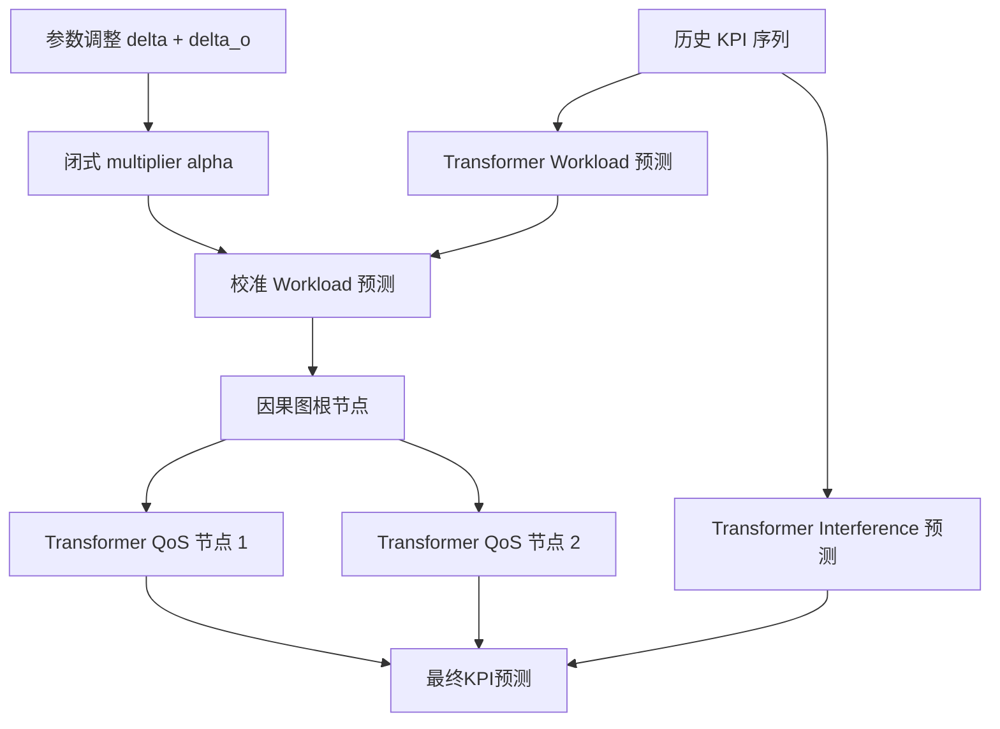
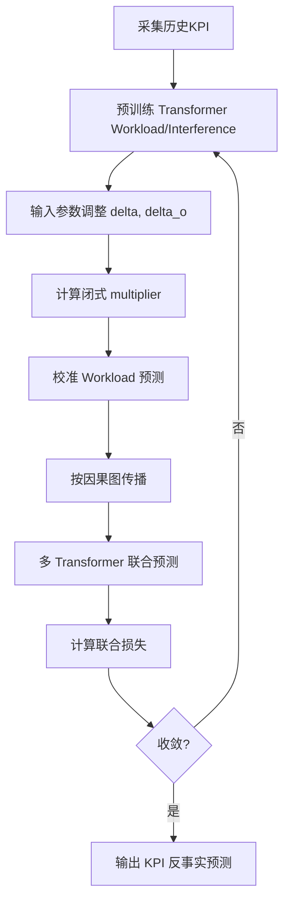

# Predicting the Impact of Parameter Adjustments on Cellular Networks (PIPCell, ASE 2025)

> 作者：Yongqian Sun, Qingliang Zhang, Yu Luo, Mingjie Li, Shenglin Zhang, Xiaolei Hua, Renkai Yu, Xinwen Fan, Lin Zhu, Junlan Feng, Dan Pei
> 机构：南开大学、中国移动研究院、清华大学
> 发表年份：2025
> 会议/期刊：IEEE/ACM International Conference on Automated Software Engineering (ASE), Sun 16 – Thu 20 November 2025, Seoul, South Korea
> 关联 PDF：同目录下 `PIPCell_ISSRE_CameraReady_v5.pdf`

## 一、文档信息速览

| 字段 | 值 |
|---|---|
| 标题 | Predicting the Impact of Parameter Adjustments on Cellular Networks (PIPCell) |
| 作者 | Yongqian Sun, Qingliang Zhang, Yu Luo, Mingjie Li, Shenglin Zhang, Xiaolei Hua, Renkai Yu, Xinwen Fan, Lin Zhu, Junlan Feng, Dan Pei |
| 机构 | 南开大学软件学院、中国移动研究院、清华大学 |
| 发表年份 | 2025 |
| 会议/期刊 | ASE 2025 (CCF A) |
| 分类 | 蜂窝网络运维 / 时序预测 / 因果推断 / 参数调整 |
| 核心问题 | 在真实部署前预测 TP/CIO 参数调整对蜂窝网络 KPI 的影响，从而减少人工调优迭代 |
| 主要贡献 | 1) 基于域知识的闭式 multiplier 校准 Workload 预测；2) 因果图引导的多 Transformer 跨指标依赖建模；3) 中国移动真实数据上 RMSE/sMAPE 显著优于基线 |

## 二、背景（Background）

5G 网络中，gNB 持续进行参数调整（如 TP 发射功率、CIO 小区个体偏移），以应对流量与负载的时空动态。运营商每天做出大量参数决策，但反馈延迟长达数小时，导致调优周期长、用户体验受损。传统时序预测模型（ARIMA、Prophet、Transformer）默认系统配置静态，无法捕捉参数调整后关键指标的突变。概念漂移适应方法在漂移发生后才更新模型，缺乏"提前预判"能力。

论文以中国移动真实网络为研究对象，把参数调整视为外生干预，建立"参数调整 → KPI"反事实预测框架。模型需要回答："若把某小区 TP 从 18.2 dBm 调到 12.2 dBm，后续 RRC 连接数会怎样变化？"。

## 三、目的（Purpose / Problems Solved）

- **痛点 1**：参数调整历史数据稀缺 → **方案**：从 3GPP 域知识出发推导闭式 multiplier，对无调整预测结果做校准。
- **痛点 2**：指标之间存在复杂非线性依赖 → **方案**：用因果图组织多个 Transformer，将父节点的预测嵌入子节点输入。
- **痛点 3**：参数组合空间巨大（TP 0-60 dBm 步长 0.1 + CIO -24~24 共 31 档 → 18,000+ 组合） → **方案**：闭式 multiplier + 因果图传递，避免逐组合训练。
- **痛点 4**：缺评估基准 → 引入中国移动真实 KPI 数据集，3 类共 17 个指标。

## 四、核心原理（Principles）

PIPCell 由两阶段组成：(1) 在无参数调整的历史数据上预训练 Transformer 预测 Workload 与 Interference；(2) 用 3GPP 域知识推导的闭式 multiplier $\alpha(\beta|\theta)$ 对 Workload 预测做校准，再用因果图传递到 QoS 等下游指标。

关键概念：
- **3GPP 重选规则**：UE 选择小区的判据 $RSRP_t+CIO_{t\to s}>RSRP_s+CIO_{s\to t}+Hys$。
- **TP ratio $\beta$**：参数调整前后接收功率比，$\beta=10^{0.1(\delta+\delta_o)}$。
- **闭式 multiplier $\alpha(\beta|\theta)$**：通过几何推导得到的小区面积比函数，反映 Workload 因参数调整产生的相对变化。
- **因果图 (Causal Graphical Model)**：把多个 Transformer 按因果关系组织，每个 Transformer 输入嵌入其父节点的预测。
- **Workload 三类指标**：RRC/E-RAB 连接数、PRB 利用率、最大/平均 RRC。

闭式 multiplier 公式（小区 A 调整后面积比）：
$$\alpha(\beta|\theta)=\begin{cases}\frac{4(\beta\gamma-\sqrt{\beta}\sin\gamma)\beta^{1/2}\gamma}{(1-\beta)^{2}\tan(\theta/2)} & \beta<1\\ 1 & \beta=1\\ 2-\alpha(1/\beta|\theta) & \beta>1\end{cases}$$

校准公式：$W\approx \tilde{W}\cdot\alpha(\beta|\theta)$。

与现有技术的差异：与传统时序预测不同，PIPCell 将参数调整视为外生干预，结合 3GPP 域知识做闭式校准，再用因果图建模跨指标影响。

## 五、算法详解（Algorithm）

1. **输入 / 输出**：输入：参数调整（$\delta, \delta_o$）+ 历史 KPI 序列；输出：调整后 KPI 的预测值。
2. **核心模块**：Transformer 预测器、闭式 multiplier 校准、因果图跨指标传播、整体优化器。
3. **伪代码**：

```python
# Phase 1: 无调整预测
W0_pred = transformer_workload.predict(windowed_history)
I0_pred = transformer_interference.predict(windowed_history)

# multiplier 校准
beta = 10 ** (0.1 * (delta + delta_o))
alpha = compute_alpha(beta, theta)
W_pred = W0_pred * alpha

# Phase 2: 因果图传播
for node in topological_sort(causal_graph):
    parents = causal_graph.parents(node)
    parent_preds = [outputs[p] for p in parents]
    outputs[node] = transformer[node].predict(history, parent_preds)

# 联合损失
loss = mse(W_pred, label_W) + sum(mse(outputs[k], label[k]) for k in nodes)
```

4. **关键数学**：闭式 multiplier 由几何推导得出；联合损失 = Workload 重建 + 各节点预测。
5. **复杂度分析**：$O(N \cdot L)$，$N$ 为指标数，$L$ 为窗口长度。
6. **训练与推理**：使用 Adam 优化器，lr=1e-3，序列长度 96；在 NVIDIA RTX 4090 GPU 上训练。
7. **示例**：图 1 展示某小区 TP 从 18.2 dBm 调到 12.2 dBm 后，最大 RRC 连接数显著下降，PIPCell 能预测这一突变。

## 六、系统架构图（Architecture）



## 七、流程图（Process Flow）



## 八、关键创新点（Key Innovations）

- **+ 闭式 multiplier 校准**：把 3GPP 域知识转化为可微公式校准预测结果。
- **+ 因果图组织的多 Transformer**：父节点预测嵌入子节点输入，显式建模跨指标因果。
- **+ 反事实预测框架**：在真实部署前预判参数影响，避免反馈延迟。
- **+ 两阶段训练策略**：第一阶段在大量无调整数据上预训练，第二阶段在干预数据上微调。
- **+ 真实工业级评估**：在中国移动真实 17 指标 KPI 数据上 RMSE/sMAPE 大幅优于基线。

## 九、实验与结果（Experiments）

- **数据集**：中国移动真实网络 KPI 数据，3 类共 17 个指标。
- **Baseline**：ARIMA、Prophet、Transformer 变体、TimesNet、Informer、CrossFormer 等。
- **主要指标**：RMSE、sMAPE。
- **关键结果数字**：PIPCell 相比最佳基线 RMSE 提升 25.8%、sMAPE 提升 59.0%。
- **消融实验**：去掉 multiplier 校准或因果图都会导致显著退化。
- **效率分析**：单小区推理时间 < 10 ms。

## 十、应用场景（Use Cases）

- **5G 容量优化**：调参前预测负载变化。
- **能耗管理**：根据预测动态调整 TP 降低能耗。
- **负载均衡**：预测 CIO 调整后的切换行为。
- **应急通信保障**：重大事件前预判容量缺口。
- **自动化运维决策**：与 AIOps 平台集成实现自治网络。

## 十一、相关论文（Related Papers in this set）

- 与 **RefinedEdge** 互补——后者在边缘做异常检测，前者在云端做参数影响预测。
- 与 **TimeSeriesBench、TADBench** 同属时序方向，但侧重干预预测。
- 与 **Lindorm-UWC** 同属网络与 IoV，但 PIPCell 关心网络参数调整，Lindorm-UWC 关心数据存储。

## 十二、术语表（Glossary）

- **TP**：Transmission Power 发射功率。
- **CIO**：Cell Individual Offset 小区个体偏移。
- **RSRP**：Reference Signal Received Power 参考信号接收功率。
- **RRC**：Radio Resource Control 无线资源控制。
- **PRB**：Physical Resource Block 物理资源块。
- **Workload / QoS / Interference**：三类核心 KPI 簇。
- **闭式 multiplier**：基于域知识推导的校准系数。
- **因果图**：Causal Graphical Model。

## 十三、参考与延伸阅读

- 3GPP TS 36.304：UE 空闲态过程。
- ARIMA、Prophet：经典时序预测方法。
- Informer、Autoformer、TimesNet：Transformer 时序模型。
- Causal Forest：因果推断基线。
- 项目主页：见论文附录。