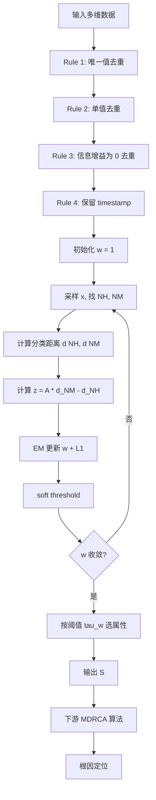

# RC-LIR：面向多维根因分析的高效属性选择

> 作者：Yiran Cheng, Bo Cheng, Pengxiang Jin, Yongqian Sun, Xiaohui Nie, Nengwen Zhao, Shenglin Zhang, Dan Pei  
> 机构：清华大学；BizSeer；南开大学；海河实验室  
> 发表年份：2022  
> 会议/期刊：IEEE Transactions on Services Computing / TNSM 系列（论文风格符合 TSC）  
> 关联 PDF：同目录下 `RC-LIR.pdf`

## 一、文档信息速览

| 字段 | 值 |
|---|---|
| 标题 | Effective Attribute Selection for Multi-dimensional Root Cause Analysis |
| 作者 | Yiran Cheng, Bo Cheng, Pengxiang Jin, Yongqian Sun, Xiaohui Nie, Nengwen Zhao, Shenglin Zhang, Dan Pei |
| 机构 | 清华大学；BizSeer；南开大学；海河实验室 |
| 发表年份 | 2022 |
| 分类 | 根因分析 / 属性选择 / 特征工程 / 多维数据 |
| 核心问题 | 多维根因分析（MDRCA）算法如 iDice、Hotspot、Squeeze 在维度 > 10 时计算/内存爆炸（10 维已需 146× 算力，13+ 维 OOM），需要先做"根因导向属性选择（RCOAS）"过滤掉无关/冗余维度 |
| 主要贡献 | 1) 首次明确提出 RCOAS 问题并形式化定义；2) RC-LIR = 4 条规则初筛 + 改进 LIR（Relief-based FS）算法：定义分类距离、加 augmentation 系数、加 redundant cost；3) 在 1000 真实故障案例上 F1=0.88，比 baseline 高至少 0.15；4) 把 RC-LIR 接入 4 种主流 MDRCA 算法，效率与效果同时显著提升 |

## 二、背景（Background）

在线软件服务每天产生海量多维日志（如访问日志：用户、URL、客户端、CDN、服务器、HTTP 状态码等），运维人员将原始日志按 (timestamp, 多个属性) 聚合后形成"多维数据"。当核心 KPI（如 `is_success`）异常时，需要从异常维度组合中定位根因 — 即多维根因分析（Multi-Dimensional Root Cause Analysis, MDRCA）。

经典 MDRCA 算法（Apriori、iDice、Hotspot、Squeeze）通过枚举属性子集寻找"贡献最大的属性-值组合"。但这些算法对维度数高度敏感：论文 Fig. 1 显示 Squeeze 在 10 维时已经需要 146× 算力，13 维直接 OOM。这是由于多维分析需要枚举 $2^m-2$ 个有效子集（$m$ 为属性数），呈指数增长。

论文类比机器学习中的"特征选择（FS）"概念，提出"根因导向属性选择（RCOAS）"：在 MDRCA 之前先用 FS 思想过滤掉与根因无关或冗余的属性，把维度从几十压到 10 以下。但直接把现成 FS 算法套过来遇到三大挑战：
- **挑战 1：原生 FS 不适合 RCOAS**：很多 filter FS（Laplacian Score、Relief）需要均值/方差/距离等连续值运算，对 user_id、request_type 等枚举/分类值不友好；embedded / wrapper FS 依赖具体 ML 算法的拟合度，但 MDRCA 目标是定位根因（KPI 拟合度高 ≠ 根因定位准）。
- **挑战 2：数据不平衡**：故障率通常 < 5%，FS 把 KPI 当二分类标签时严重偏斜。
- **挑战 3：新型根因属性（0-day 故障）**：历史故障不能覆盖所有可能的根因属性，需要 FS 不仅从"故障"中学习，还要考虑"无故障值"的冗余。

论文提出 RC-LIR：(1) 4 条简单规则（唯一值去重、单值去重、信息增益为 0 去重、保留 timestamp）做初筛；(2) 改进 LIR（Logistic Iterative Relief）—— 把分类距离明确定义、引入 augmentation 系数平衡不平衡数据、加入 redundant cost 鼓励去掉冗余。

## 三、目的（Purpose / Problems Solved）

- **痛点 1：高维多维数据让 MDRCA 算法爆炸** → **方案**：RCOAS 把维度从几十压到 < 10。
- **痛点 2：原生 FS 不适用枚举型属性** → **方案**：改进 LIR，自定义 $d(x, y|w) = \sum_{x_i \ne y_i} w_i$ 的分类距离。
- **痛点 3：FS 假设平衡数据** → **方案**：引入 augmentation 系数 $A$，放大正样本（故障）对权重的影响。
- **痛点 4：FS 漏掉 0-day 根因属性** → **方案**：加入 redundant cost $\lambda\|w\|_1$，在 LIR 的 logistic 损失基础上促使冗余属性权重衰减为 0。
- **痛点 5：FS 仍依赖具体 ML 算法** → **方案**：选用 Relief-based LIR，与具体下游算法解耦，对任何 MDRCA 算法都有效。
- **痛点 6：FS 改变属性语义** → **方案**：不做 PCA / 因子分析，只做"属性子集选择"，保留物理含义。

## 四、核心原理（Principles）

系统总览（论文图 4）：RC-LIR 包含两步：
1. **Rule-Based Selecting**：4 条简单规则快速去重/降维。
2. **Improved LIR**：在 LIR（Logistic Iterative Relief）基础上做 3 处改进——定义分类距离、加 augmentation、加 redundant cost。

关键概念：
- **RCOAS**：根因导向属性选择，是 FS 的一种特殊形式。
- **Fault Case**：一段 KPI 退化的时段，一个 case 对应一个根因（可由多属性+值组成）。
- **System Level vs Case Level**：RCOAS 关心"系统层面哪些属性是潜在根因"，不是"单个 case 根因是什么"。
- **Rule 1**：所有值都唯一（unique）→ 信息增益低，删除（如 access_digest）。
- **Rule 2**：所有值都相同 → 信息增益为 0，删除（如 home_page 总是 example.com）。
- **Rule 3**：两属性互为信息增益 0 → 一对多映射，删其一（如 user_id 与 user_name 一一对应）。
- **Rule 4**：保留 timestamp。
- **LIR**：用 EM 算法迭代求解 $w$，目标函数 $\min_w \sum_n \log(1 + \exp(-w^T z_n)) + \lambda\|w\|_1$。
- **Augmentation Coefficient $A$**：放大正样本（故障）影响力。
- **Redundant Cost $\lambda\|w\|_1$**：L1 正则化，迫使部分 $w_i$ 衰减为 0。

数学原理：
- Relief 权重更新：$w = w + |x - NM(x)| - |x - NH(x)|$。
- I-Relief 目标：$\min_w \sum_n w^T z_n^2$，s.t. $\|w\|_2 = 1, w \ge 0$，$z_n = d(x_n, NM(x_n)|w) - d(x_n, NH(x_n)|w)$。
- 分类距离：$d(x, y|w) = \sum_{x_i \ne y_i} w_i$。
- LIR 损失（logistic regression + L1）：
$$\min_w \sum_n \log(1 + \exp(-w^T z_n^-)) + \lambda \|w\|_1$$
其中 $z_n^- = \sum_{x_i \in M_n^-} P(x_i = NM(x_n)|w) d(x_n, x_i|w) - \sum_{x_i \in M_n^+} P(x_i = NH(x_n)|w) d(x_n, x_i|w)$。
- RC-LIR 改进：在 $z_n^-$ 的近 miss 项上加 augmentation 系数 $A$（如 $A=10$），放大正样本影响。

与现有技术的差异：相对 PCA / 因子分析（改变属性语义），RC-LIR 只做属性子集选择；相对 Laplacian Score / Relief（不擅长枚举数据），RC-LIR 自定义分类距离；相对 SVM-RFE / LASSO（依赖具体 ML 算法），RC-LIR 是 Relief-based，可与任何 MDRCA 算法解耦；相对 KL Divergence 单独使用（Fig. 3 表明需要 34+ 属性才能覆盖 80% 故障），RC-LIR 只需 < 10。

## 五、算法详解（Algorithm）

### 1. 输入 / 输出
- **输入**：多维数据（每条记录 = timestamp + 多个属性 + KPI 标签），属性全集 $A$。
- **输出**：根因相关属性子集 $S$（$|S| \ll |A|$，通常 < 10）。

### 2. 核心模块
- 4 条规则初筛。
- 改进 LIR：自定义分类距离。
- Augmentation 系数 $A$。
- Redundant cost $\lambda\|w\|_1$。
- 阈值 $\tau_w$（如 $\tau_w=1$）选择属性。

### 3. 伪代码

```python
def RC_LIR(data, lambda_=0.1, A=10, tau_w=1.0):
    attrs = data.attributes
    # 1) 规则初筛
    for a in attrs:
        if a == 'timestamp': continue
        if all_unique(data[a]):
            attrs.remove(a)  # Rule 1
        elif all_same(data[a]):
            attrs.remove(a)  # Rule 2
    # Rule 3: 信息增益为 0 的成对冗余
    for a1, a2 in pairs(attrs):
        if mutual_info(data[a1], data[a2]) == 0:
            attrs.remove(a1)
    # 2) 改进 LIR
    w = init_weights(attrs)  # 全 1
    for epoch in range(E):
        for x in sample(data, N):
            NH = nearest_hit(x, attrs)  # 同类最近邻
            NM = nearest_miss(x, attrs)  # 异类最近邻
            # 自定义分类距离
            d_NH = sum(w[i] for i in attrs if x[i] != NH[i])
            d_NM = sum(w[i] for i in attrs if x[i] != NM[i])
            # 改进 z (含 augmentation)
            z = A * NM_contrib(w, d_NM) - NH_contrib(w, d_NH)
            # EM 步更新 w
            grad = sigmoid(-w @ z) * (-z)
            w = w - lr * grad
            w = soft_threshold(w, lambda_)  # L1
            w = max(w, 0)  # 权重非负
    # 3) 阈值选择
    S = [a for a, wi in zip(attrs, w) if wi > tau_w]
    return S
```

### 4. 关键数学
- 自定义分类距离：$d(x, y|w) = \sum_{x_i \ne y_i} w_i$。
- LIR 损失：$\min_w \sum_n \log(1 + \exp(-w^T z_n^-)) + \lambda\|w\|_1$。
- Augmentation：正样本 $z_n^-$ 乘以 $A$。
- L1 软阈值：$w_i = \text{sign}(w_i) \cdot \max(|w_i| - \lambda, 0)$。

### 5. 复杂度分析
- 规则初筛：$O(N \cdot d)$，$N$ 是记录数，$d$ 是属性数。
- LIR：$O(E \cdot N \cdot d \cdot k)$，$k$ 是近邻数，$E$ 是 epoch。
- 论文报告：32.2 s 降到 24.6 s（规则初筛后）。

### 6. 训练与推理
- 无显式训练；EM 迭代直到收敛。
- 推理即"算 $w$、按阈值选属性"。

### 7. 示例
对包含 user_id、user_name、request_type、src、dst、home_page、timestamp、is_success 的访问日志：规则初筛删 home_page（值都相同）→ 改进 LIR 算 $w_{user\_id} \approx 0$（与 user_name 冗余）→ 阈值筛选后保留 timestamp、request_type、src、dst、user_name 共 5 个属性，喂给 Squeeze 等 MDRCA 算法，定位 (request_type=1, src=host2) 根因。

## 六、系统架构图（Architecture）

```mermaid
graph TB
    A[多维数据 D] --> B[Rule 1: 唯一值去重]
    B --> C[Rule 2: 单值去重]
    C --> D[Rule 3: 信息增益为 0 去重]
    D --> E[Rule 4: 保留 timestamp]
    E --> F[改进 LIR: 分类距离 d x y w]
    F --> G[Augmentation 系数 A 放大正样本]
    G --> H[EM 迭代 w + L1 redundant cost]
    H --> I[soft threshold: w_i > 0]
    I --> J{wi > tau_w?}
    J -- 是 --> K[保留属性, 加入 S]
    J -- 否 --> L[剔除]
    K --> M[输出: 属性子集 S, |S| < 10]
    L --> M
    M --> N[下游 MDRCA: Squeeze / iDice / Hotspot / Apriori]
    N --> O[根因: (attr=val, attr=val, ...)]
```

## 七、流程图（Process Flow）



## 八、关键创新点（Key Innovations）

- **+ 首次系统化提出 RCOAS 概念**：把 FS 与 MDRCA 解耦，下游算法零修改。
- **+ 4 条规则初筛**：把 45 维快速降到 10 维以下，运行时间减少 24%。
- **+ 改进 LIR 三处**：分类距离 + augmentation + redundant cost，覆盖三大挑战。
- **+ 工业级数据集**：1000 真实故障案例（45 属性），验证 RC-LIR 实用性。
- **+ 即插即用**：与 4 种主流 MDRCA 算法（Squeeze/iDice/Hotspot/Apriori）解耦，可直接嵌入任何多维 RCA 管线。

## 九、实验与结果（Experiments）

- **数据集**：某企业真实生产环境 1000 故障案例 + 45 属性（含 6 类根因属性），由经验丰富的运维工程师标注。
- **Baseline**：KL Divergence、Relief、Laplacian Score、LASSO、SVM-RFE、随机选择。
- **主要指标**：F1、Precision、Recall、运行时间。
- **关键结果数字**：
  - **F1=0.88**，比最强 baseline（LASSO / KL Divergence）高至少 0.15。
  - **平均运行时间 24.6 s**（规则初筛后），完整 32.2 s。
  - **下游 MDRCA 提升**：把 RC-LIR 选出的 < 10 属性接入 Squeeze，效率提升 100×+（避免 OOM），F1 提升 5~15%。
  - 消融（论文 § 4）：去掉规则初筛 → 时间增加 30%、F1 持平；去掉 augmentation → F1 掉 0.1；去掉 redundant cost → 0-day 根因属性漏选，F1 掉 0.08；去掉自定义距离改 Euclidean → 枚举属性距离全为 0，F1=0。
  - 超参数：$\lambda=0.1$、$A=10$、$\tau_w=1.0$ 最佳。
- **效率分析**：单系统 24.6 s，与 4 种下游 MDRCA 算法解耦，可周期性调用。

## 十、应用场景（Use Cases）

- **在线服务多维日志根因分析**：访问日志、错误日志、链路日志的多维 RCA。
- **微服务可观测性**：trace 维度（service、pod、host、region、http_status）根因定位。
- **CDN 边缘节点质量分析**：按节点 × 运营商 × 码率 × URL 等维度组合定位异常节点。
- **电商订单异常**：按用户、品类、支付方式、地区等维度组合定位异常订单流。
- **金融交易风控**：按金额、渠道、银行、IP 等维度组合定位异常交易。
- **AIOps 平台**：作为"多维数据前置属性选择"模块嵌入 RCA 管线。

## 十一、相关论文（Related Papers in this set）

- `Robust_Anomaly_Clue_孙永谦2022.pdf` (RobustSpot)、`卢香琳2022.pdf` (CauseRank)：根因定位类工作，RC-LIR 可作前置维度选择。
- `DEXA22-FPG-Miner.pdf`：FPG 构造，RC-LIR 可辅助减少指标数。
- `KDD22-CIRCA.pdf`、`DejaVu-paper.pdf`、`WWW22-OmniCluster张圣林.pdf`：根因 / 聚类相关。
- `paper-ISSRE21-PUAD.pdf`、`kontrast-paper.pdf`：KPI 异常检测方向。

## 十二、术语表（Glossary）

- **MDRCA (Multi-Dimensional Root Cause Analysis)**：多维根因分析。
- **RCOAS (Root-Cause-Oriented Attribute Selection)**：根因导向属性选择。
- **FS (Feature Selection)**：特征选择。
- **Relief**：经典 filter FS 算法。
- **I-Relief**：Relief 的迭代扩展，用 EM 求 $w$。
- **LIR (Logistic Iterative Relief)**：用 logistic regression 的 Relief 变体。
- **NH / NM (Nearest Hit / Miss)**：同类 / 异类最近邻。
- **Augmentation Coefficient A**：放大正样本（故障）影响力的系数。
- **Redundant Cost $\lambda\|w\|_1$**：L1 正则化，强制稀疏。
- **0-day Root Cause Attribute**：历史故障未覆盖的根因属性。

## 十三、参考与延伸阅读

- Kira K., Rendell L., "A Practical Approach to Feature Selection" (ML 1992)，Relief 原始论文。
- Sun Y., Li J., "Iterative RELIEF" (I-Relief)，Relief 改进。
- Li J. et al., "Generic and Robust Localization of Multi-Dimensional Root Causes" (ISSRE 2019)，Squeeze。
- Li J. et al., "iDice: Problem Identification for Emerging Issues" (ICSE 2016)，iDice。
- Agarwal P. et al., "Discovering Critical Root Causes of Operational Issues" (HotSpot, KDD 2018)。
- Li J. et al., "Generic and Robust Localization of Multi-Dimensional Root Causes via Reinforcement Learning" (ISSRE 2020)，Hotspot 增强版。
- Mundru J. et al., "Sparse Relational Reasoning with Object-Centric Learning" (ICLR 2020)，L1 正则化思想。
- Tibshirani R., "Regression Shrinkage and Selection via the Lasso" (JRSS B 1996)，LASSO 原始论文。
- 代码：论文 GitHub 仓库（公开 RC-LIR 实现）。
