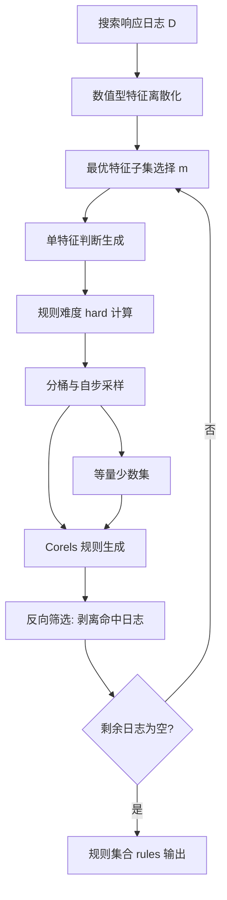
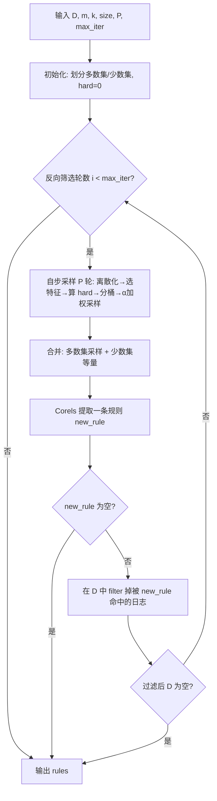

# 搜索服务响应时间异常诊断（计算机研究与发展 2024）

> 作者：夏思博、马明华、金鹏翔、崔丽月、张圣林、金娃、孙永谦、裴丹  
> 机构：南开大学软件学院；先进计算与关键软件（信创）海河实验室；清华大学计算机科学与技术系  
> 发表年份：2024  
> 会议/期刊：计算机研究与发展 2024, 61(6): 1573-1584  
> 关联 PDF：同目录下 `Response-Time-Anomaly-Diagnosis-for-Search-Service.pdf`

## 一、文档信息速览

| 字段 | 值 |
|---|---|
| 标题 | 搜索服务响应时间异常诊断 (Response Time Anomaly Diagnosis for Search Service) |
| 作者 | 夏思博、马明华、金鹏翔、崔丽月、张圣林、金娃、孙永谦、裴丹 |
| 机构 | 南开大学软件学院；海河实验室；清华大学计算机科学与技术系 |
| 发表年份 | 2024 |
| 会议/期刊 | 《计算机研究与发展》2024 年第 61 卷第 6 期 |
| 分类 | 异常检测 / 根因分析 / 服务质量 |
| 核心问题 | 在大规模且分布极不平衡的搜索响应日志中，挖掘出"可解释、高泛化率"的多维特征规则以诊断搜索响应时间过长的根因 |
| 主要贡献 | 1) 经验性研究搜索日志各维度与 SRT 的关联；2) 提出 Miner 框架，结合自步采样 + Corels 规则生成 + 反向筛选；3) 在 2 家中国顶级搜索引擎公司真实日志上获得最优的泛化率与召回率 |

## 二、背景（Background）

随着互联网服务的普及，搜索引擎、电子商务、社交网络等典型网络服务的响应速度深刻影响用户体验与服务商收入。学术研究与工业案例均显示，响应延迟与营收之间存在显著相关性：Amazon 每增加 0.1 s 延迟即导致收入下降 1%，Bing 搜索结果慢 0.5 s 也会造成约 1.2% 的收入下降。搜索引擎公司通常要求把搜索响应时间（Search Response Time, SRT）控制在 1 s 以内，并把单条 SRT 与用户浏览器、运营商 ISP、是否含广告、页面加载方式、图片个数等上下文属性一同记录，构成结构化多维度日志。

在实践层面，仅依靠"单维特征→指标"难以解释 SRT 过长的根因。论文通过真实数据的热度图与提琴图发现：图片数量与 SRT 关系并非单调增加（因为热门词条通常有缓存分区）；不同运营商之间 SRT 分布差异显著；浏览器 UA、页面加载方式等枚举属性也对 SRT 有可观影响。运维工程师真正需要的是一组"多维特征组合"形式的描述性规则，从而有针对性地优化服务端、网络端或前端。

在此之前，已有研究主要存在三方面问题：基于决策树的 FOCUS 存在易过拟合、计算效率低、对动态数据适应性差；HHH（层次化聚类）需要针对不同数据集调参，参数固定导致在线场景性能不稳定；DBSherlock 借助领域知识启发式划定指标分界点，迁移成本高。也有工作引入 PerfXplain、DeCaf、FP-Growth+提升度（FDA）等方法，但都难以同时处理"数据量大、数据分布不平衡、要求规则泛化率高"三大挑战。

## 三、目的（Purpose / Problems Solved）

论文聚焦于"多维度搜索响应日志的根因诊断"这一具体运维痛点，要解决的技术问题包括：

- **痛点 1：日志数据量大**：每天的搜索日志（经过 1‰ 均匀采样）仍有几十万到上百万条，需要算法能在合理时间内完成处理。
- **痛点 2：数据分布不平衡**：SRT 过长的日志在全部数据中占比通常 < 30%，特定多维组合（如"联通 + 图片数 < 10"）的占比可能 < 1%，传统分类/决策树算法难以直接得到高召回率的规则。
- **痛点 3：要求规则泛化率高**：运维工程师希望得到能描述"一大类 SRT 过长问题"的可解释规则，而不是"超多条件堆叠"形成的局部特例规则。
- **痛点 4：可解释性**：黑盒预测模型无法直接为运维人员提供可操作的优化方向，需要"如果 [条件] 则 [断言]"这种人类可读的规则。
- **痛点 5：算法可证明最优**：决策树只能给出局部最优的切分，需要可证明最优的规则生成算法来避免在 SRT 这类对正确性要求高的工业场景中出现"漏判"。

## 四、核心原理（Principles）

Miner 框架的整体思路是"分而治之"：先用**自步采样（self-paced sampling）**从分布不平衡的海量日志中按"样本分类难度"挑选代表性样本，再以**Corels**这一可证明最优的规则列表学习器提取单条描述规则，最后通过**反向筛选（iterative reverse filtering）**对已被规则覆盖的日志做剥离、迭代生成多条规则，从而在保留高召回的同时兼顾高泛化。

关键概念定义如下：
- **多数集 / 少数集**：以 SRT 是否 > 1 s 为阈值，将日志划分为响应时间正常（多数集）与响应时间过长（少数集）。
- **自步采样系数** $\alpha = \tan\left(\frac{p\pi}{2P}\right)$，其中 $p$ 是当前迭代轮数、$P$ 是总迭代轮数。$\alpha$ 越大，对高难度样本的采样权重越大。
- **规则难度 $hard(j)$**：样本 $j$ 在特征子集 $F_p$ 上被全部 $m$ 个单特征判断同时正确分类的难度，定义为这些判断函数误差之和。
- **最优特征子集**：按"带权熵"最小原则从全部特征中选出的 $m$ 个分类能力最强的特征。
- **分桶**：将多数集样本按 $hard$ 值等分为 $k$ 桶，再按 $\alpha$ 控制的比例从每个桶中抽取。

数学原理上，自步采样沿用了"教师-课程学习"思想：先学容易的"平凡样本"，再逐步引入"边界样本"，最后过滤"噪声样本"。设第 $p$ 轮迭代有 $m$ 个特征，$hard(j) = \sum_{i=1}^{p}\sum_{f=f_{i,1}}^{f_{i,m}} judge_f(j)$，其中 $judge_f$ 是单特征 $f$ 的判断函数。第 $l$ 个桶应采样数量为：

$$num_l = size \times \frac{hard[l] + \alpha}{\sum_{l} (hard[l] + \alpha)}$$

Corels 通过字典树（trie）做分支定界搜索，其目标是在所有候选规则列表中找到正则化经验风险 $R(r) = \frac{1}{n}\sum_i \mathbb{1}[r(x_i) \neq y_i] + \lambda \cdot |r|$ 最小的列表，从而给出可证明最优且简短的规则。

与现有技术的差异：相比 FOCUS 的"决策树 + 启发式多日融合"，Miner 既提供最优性保证又显式处理类不平衡；相比 HHH 的"层次化聚类 + 调参"，Miner 不依赖人工调参；相比 DBSherlock 的"指标分界点"，Miner 输出的是特征组合规则而非阈值；相比 DeCaf 的"随机森林节点分数排序"与 FDA 的"FP-Growth+提升度"，Miner 借助 Corels 给出最优性证明。

## 五、算法详解（Algorithm）

### 1. 输入 / 输出
- **输入**：类别不平衡的搜索响应日志 $D$（含 SRT 标签、若干上下文特征）；最优特征子集大小 $m$；分桶数 $k$；采样数量 $size$；自步采样迭代次数 $P$；反向筛选最大轮数 $max\_iter$。
- **输出**：若干条"如果 [条件] 则 SRT 过长"的描述性规则 $rules$。

### 2. 核心模块
- **数值型特征离散化**：按熵最小原则递归二分，形成"区间 → 枚举值"映射。
- **最优特征子集选择**：按带权熵 $e = \sum_{i=1}^{n} w_i e_i = \sum_{i=1}^{n} \frac{\#i}{\#total} \sum_{j \in \{0,1\}} p_{i,j}\ln p_{i,j}$ 排序，取最小的 $m$ 个。
- **单特征判断生成**：对每个特征的每个取值计算"该取值下 SRT 过长占比"，与原始数据占比比较，大于则判为过长。
- **规则难度计算**：$hard(j) = \sum_{i=1}^{p}\sum_{f=f_{i,1}}^{f_{i,m}} judge_f(j)$。
- **分桶采样与合并**：以 $hard$ 值分桶，按 $\alpha$ 调节各桶采样比例，再与等量少数集合并。
- **Corels 规则生成**：在采样数据上运行 Corels，得到一条最优规则。
- **反向筛选**：在原始数据中剥离被该规则命中的样本，剩余数据进入下一轮。

### 3. 伪代码（自步采样，算法 1）

```python
def self_paced_sample(D, m, k, size, P):
    major_set = [x for x in D if x.srt <= 1000]
    minor_set = [x for x in D if x.srt > 1000]
    hard = [0] * len(major_set)
    for p in range(1, P + 1):
        # 1) 数值型特征离散化
        discretize_numeric(D)
        # 2) 选最优特征子集（带权熵最小）
        features = select_top_m_by_weighted_entropy(D, m)
        # 3) 对每个特征生成单特征判断
        for f in features:
            judge = build_single_feature_judge(f, D)
            # 4) 更新 hard
            for j, x in enumerate(major_set):
                hard[j] += 0 if judge(x) == x.label else 1
        # 5) 分桶
        bins = bucketize(major_set, hard, k)
        avg_hard = [mean(bins[l]) for l in range(k)]
        # 6) 自步采样系数
        alpha = math.tan(p * math.pi / (2 * P))
        # 7) 按比例从各桶采样
        sampled = []
        weights = [(avg_hard[l] + alpha) for l in range(k)]
        s = sum(weights)
        for l in range(k):
            num_l = size * weights[l] / s
            sampled.extend(random.sample(bins[l], int(num_l)))
    # 8) 加入等量少数集
    sampled.extend(random.sample(minor_set, size))
    return sampled
```

### 4. 关键数学

- 带权熵：$e = \sum_{i=1}^{n} \frac{\#i}{\#total} \sum_{j \in \{0,1\}} p_{i,j}\ln p_{i,j}$。
- 自步系数：$\alpha = \tan\left(\frac{p\pi}{2P}\right)$。
- 桶采样：$num_l = size \times \frac{hard[l] + \alpha}{\sum_{l} (hard[l] + \alpha)}$。
- Corels 风险：$R(r) = \frac{1}{n}\sum_i \mathbb{1}[r(x_i)\neq y_i] + \lambda |r|$。

### 5. 复杂度分析
自步采样单轮的时间复杂度近似为 $O(|D| \cdot d \cdot k)$，其中 $d$ 为特征数。Corels 的复杂度为 $O(b^{|r|})$ 量级（$b$ 是单层分支数，$|r|$ 是规则深度），但因前缀树剪枝与采样规模控制，论文报告 Miner 平均每 100 万条日志耗时 70.37 s，可处理 1000 万条日志级别数据。

### 6. 训练与推理
训练阶段对每个候选特征生成单特征判断，计算 $hard$ 并采样，最终由 Corels 训练出规则列表；推理阶段即"对每条新日志按规则列表查表"，匹配即给出诊断。

### 7. 示例
对 SRT=2203 ms 的日志 `(#Image=25, UA=Safari, Ad=有广告, ISP=UNICOM, PageType=async)`，Miner 迭代 5 轮并反向筛选后可输出形如"如果 ISP=UNICOM 且 #Image≥20 且 Ad=有广告，则 SRT 过长"的多维规则。运维工程师据此可重点排查联通用户、含广告、高图片数场景下的服务端缓存与 CDN 命中率。

## 六、系统架构图（Architecture）



## 七、流程图（Process Flow）



## 八、关键创新点（Key Innovations）

- **+ 自步采样 + 规则生成耦合**：首次将"按分类难度自步采样"与"可证明最优的规则列表学习"在同一框架内耦合，规避了 Corels 在海量不平衡数据上失效的问题。
- **+ 反向筛选迭代机制**：以"剥离已覆盖日志"代替"随机重置种子"，使后续规则聚焦剩余 SRT 过长样本，逐轮提升整体泛化率。
- **+ 经验性结论指导设计**：通过真实日志的提琴图、热度图发现"单维特征不足、多维组合关键、分类难度差异大"等规律，并将其直接编码到带权熵与分桶策略中。
- **+ 无需领域知识**：不依赖人工标注的指标分界点，可在 SRT、Web 响应时间等多类延迟场景直接迁移。
- **+ 最优性保证**：基于 Corels 的分支定界搜索输出的是"正则化经验风险最小"的规则列表，避免决策树贪心切分带来的次优性。

## 九、实验与结果（Experiments）

- **数据集**：数据集 A：56 天约 2 000 万条搜索响应日志，6 个特征（来自文献 [6]）；数据集 B：3 天 74 万条搜索响应日志，7 个特征。两份数据均来自中国市场份额前列的搜索引擎公司。
- **Baseline**：DBSherlock（启发式分界点）、HHH（层次化聚类）、FOCUS（决策树 + 多日融合）、DeCaf（随机森林 + 节点分数）、FDA（FP-Growth + 提升度）。
- **主要指标**：Generality（规则覆盖日志行数 / 总日志行数）、Recall（规则覆盖的 SRT 过长日志 / 全部 SRT 过长日志）、运行时间。
- **关键结果数字**：
  - 在数据集 A 与 B 的 Generality 与 Recall 曲线（图 4、图 5）上，Miner 第 1 条规则的 Generality 与 Recall 即显著高于全部 baseline，且规则数 ≤ 3 时已经接近顶部。
  - 5 种 baseline 在两份数据上的 Generality 与 Recall 均接近 0，表明在长尾分布下它们"挖不出普遍性规则"。
  - 数据量从 100 万条增至 1000 万条时，Miner 运行时长大致线性增长，平均每 100 万条 70.37 s，前几轮迭代承担主要时间，反向筛选使后续轮次数据规模迅速下降。
  - 特征维度从 3 增到 6 时运行时长随之上升，但 3 维与 4 维时长接近，差异主要来自高维特征的自步采样开销。
  - 消融（图 8）：用"分层采样"替换自步采样后，需 ≥ 3 轮反向筛选才达到可用水平；用 CART 决策树替换 Corels 后，3 条规则才堪堪比上 Miner 第 1 条规则；去除反向筛选后泛化率与召回率均明显下降，且随迭代轮数增加优势更显著。
- **效率分析**：CPU E5-2650 @ 2.20 GHz、128 GB DDR4 内存、Ubuntu 16.04。每 100 万条日志平均 70.37 s，可应对实际生产环境中 10⁷ 级别的搜索日志。
- **Miner 参数**：$m=5$、$k=5$、$size=1500$、$P=5$、$max\_iter=5$。

## 十、应用场景（Use Cases）

- **搜索服务 SRT 诊断**：快速定位"运营商 + 浏览器 + 图片数 + 是否有广告 + 加载方式"等多维组合下的慢请求，指导 CDN 调优、缓存策略升级、广告投放策略调整。
- **通用 Web 响应时间诊断**：把 Miner 框架的输入替换为 Web 服务的多维响应日志，可输出描述"慢请求"的多维规则。
- **数据库 / 大数据查询延迟诊断**：将 SRT 替换为 SQL 查询延迟、Job 完成时间等指标，借鉴 Miner 的自步采样+Corels 模式。
- **移动端 App 启动 / 页面加载监控**：将 ISP、机型、系统版本、SDK 版本等特征作为输入，挖掘"长尾慢启动"规则。
- **金融支付 / 交易延迟诊断**：在支付网关、银行核心系统中挖掘"高延迟订单"的多维根因规则。

## 十一、相关论文（Related Papers in this set）

- `KDD21_InterFusion_Li`（KDD 2021）：多源异构日志的异常检测，思路与"多维特征 + 规则诊断"互补。
- `KDD22-CIRCA`：考虑协变量的时序异常检测，与本篇"先采样再规则化"思路可对照。
- `KDD21_InterFusion_Li`、`2022张圣林` 等：同属 AIOps Lab 多维日志根因主题。
- 同期 Sponge、MicroRCA、FluxInfer 等多维根因论文均把"采样 + 规则/因果"作为可借鉴路径。

## 十二、术语表（Glossary）

- **SRT (Search Response Time)**：单次搜索请求从发出到返回结果的总耗时，论文中阈值 1 s。
- **Generality**：规则覆盖日志行数占日志总行数的比例，衡量规则的"广泛适用性"。
- **Recall**：规则覆盖的 SRT 过长日志占全部 SRT 过长日志的比例，衡量"抓得住多少长尾慢请求"。
- **Corels**：可证明最优的规则列表学习器，基于字典树 + 分支定界。
- **Self-Paced Sampling（自步采样）**：从易到难逐步加大高难度样本比例的采样策略。
- **Major / Minor Set**：多数集（SRT 正常）与少数集（SRT 过长）。
- **Reverse Filtering（反向筛选）**：每轮剥离被规则命中的样本再进入下一轮训练的迭代机制。
- **带权熵 (Weighted Entropy)**：以特征各取值占比为权重的熵，用于衡量特征的分类能力。
- **Hard Sample / Easy Sample / Noise**：分别对应边界样本、平凡样本、噪声样本。

## 十三、参考与延伸阅读

- FOCUS：使用决策树诊断搜索响应时间过长（KDD 2019，本论文的核心 baseline）。
- HHH：层次化聚类算法用于视频 QoS 诊断（SOSP/ATC 系列工作）。
- DBSherlock：基于指标分界点的数据库性能根因诊断（SIGMOD 2019）。
- DeCaf：随机森林 + 节点分数的根因描述（VLDB 2020）。
- FDA：FP-Growth + 提升度的频繁项集根因挖掘（KDD 2019）。
- Corels 官方实现：https://github.com/corels/corels，可直接运行规则列表学习。
