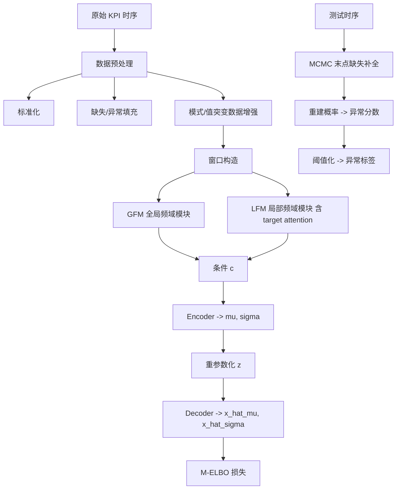
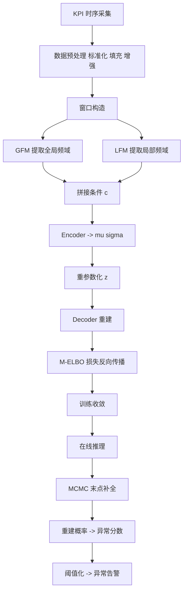

# Revisiting VAE for Unsupervised Time Series Anomaly Detection: A Frequency Perspective（WWW 2024）

> 作者：Zexin Wang、Changhua Pei、Minghua Ma、Xin Wang、Zhihan Li、Dan Pei、Saravan Rajmohan、Dongmei Zhang、Qingwei Lin、Haiming Zhang、Jianhui Li、Gaogang Xie  
> 机构：CNIC, CAS；Microsoft；Stony Brook University；快手；清华大学  
> 发表年份：2024  
> 会议/期刊：WWW '24（新加坡，2024 年 5 月 13-17 日）  
> 关联 PDF：同目录下 `Revisiting-VAE-for-Unsupervised-Time-Series-Anomaly-Detection-A-Frequency-Perspective.pdf`

## 一、文档信息速览

| 字段 | 值 |
|---|---|
| 标题 | Revisiting VAE for Unsupervised Time Series Anomaly Detection: A Frequency Perspective |
| 作者 | Zexin Wang、Changhua Pei、Minghua Ma、Xin Wang、Zhihan Li、Dan Pei、Saravan Rajmohan、Dongmei Zhang、Qingwei Lin、Haiming Zhang、Jianhui Li、Gaogang Xie |
| 机构 | CNIC, CAS；Microsoft；Stony Brook University；快手；清华大学 |
| 发表年份 | 2024 |
| 会议/期刊 | WWW '24 |
| 分类 | 时序异常检测 / VAE / 频域增强 |
| 核心问题 | 现有 VAE 时序异常检测无法同时捕捉异构周期模式与细粒度趋势，频域信息缺失导致重建不准确 |
| 主要贡献 | (1) 分析现有 VAE 异常检测失败的频域原因；(2) 提出 FCVAE（Frequency-enhanced CVAE），结合全局频域 GFM + 局部频域 LFM 引导编解码；(3) 在公开与工业数据集上 F1 提升 40% / 10%，让 VAE-based 方法重回 SOTA |

## 二、背景（Background）

时序异常检测（Time Series Anomaly Detection, TSAD）是 AIOps 中最基础的任务之一，互联网公司需要监控指标（CPU、内存、QPS、错误率、延迟等）并在异常出现时通知工程师。传统阈值规则与统计方法虽然部署简单，但难以应对复杂周期与趋势变化；预测式深度学习方法（AnomalyTransformer、Informer 等）虽然在公开数据集上表现出色，但要求训练数据"全部正常"，对真实业务中混合的异常-正常样本非常敏感；基于重建的 VAE 方法（如 DONUT）天然能处理混合数据，但论文发现其在工业数据上"重建得过于完美"——也就是说，正常数据被"重建得像正常"，异常数据也被"重建得像正常"，导致判别困难。

论文把 VAE 重建失败归因于"频域信息缺失"。时序信号在频域中包含周期、季节性、噪声等成分；现有 VAE 仅在时域做重建，对"全局频率"（整窗的 FFT）只能学到平均化的频谱，对"局部突变"（窗口末尾的关键点）则缺乏针对性注意力。这导致：(1) 异构周期模式无法完整重建；(2) 详细趋势被平滑；(3) 窗口末端异常难识别。论文把这些痛点总结为三大挑战：
- **挑战 1：异构周期模式捕捉失败**。单一全局频率无法覆盖多周期叠加信号。
- **挑战 2：详细趋势重建不足**。VAE 的瓶颈使局部趋势被平均化。
- **挑战 3：频域条件噪声大**。把整窗 FFT 后送入 CVAE 作为条件会引入大量"长尾"噪声频点，干扰编码-解码。

基于这些观察，论文提出 FCVAE（Frequency-enhanced CVAE），通过"全局频率模块 GFM"+"局部频率模块 LFM"双路引导 CVAE 的编解码器，让 VAE 重新在异常检测任务上 SOTA。

## 三、目的（Problems Solved）

- **VAE-based 异常检测的频域盲区**：把频域信息显式注入 VAE 的条件向量，让编码器、解码器能同时感知全局周期与局部趋势。
- **异构周期模式与详细趋势的协同建模**：通过 GFM 处理"整体 FFT + 线性层 + dropout"实现长程周期重建；通过 LFM（带 target attention）处理"子窗口 FFT + 查询-键-值注意力"实现局部趋势重建。
- **频域条件去噪**：用线性层在 GFM 中筛除"长尾"噪声频点；用 target attention 在 LFM 中筛选最相关的子窗口。
- **窗口末点异常难识别**：用 MCMC missing imputation + 末点 mask 让模型在测试时聚焦最新点。
- **混合异常-正常数据下的训练**：通过"模式突变 + 值突变"两种数据增强 + M-ELBO，让无监督训练也能学到异常鲁棒的表示。
- **重建概率作为异常分数**：用 $p_\theta(x|z, c)$ 期望的负对数作为分数，阈值化即可判定异常。

## 四、核心原理（Principles）

**系统总览**：FCVAE 整体由三部分组成：数据预处理、训练、测试。数据预处理包括标准化、缺失/异常填充、模式/值突变数据增强；训练时用 CVAE 框架，把 GFM(x) 与 LFM(x) 拼到条件 c 上；测试时用 MCMC missing imputation 估计末点正常值，再以重建概率为异常分数。

**关键概念**：

- **CVAE（Conditional VAE）**：在 VAE 基础上引入条件 $c$（如标签、属性），让生成/重建过程受控。
- **M-ELBO（Modified ELBO, DONUT）**：对窗口内每个点用指示变量 $\alpha_w$ 加权，缓解异常/缺失对重建的污染。
- **GFM（Global Frequency Module）**：对整个窗口做 FFT，再用线性层 + dropout 提取代表周期模式的全局频域嵌入。
- **LFM（Local Frequency Module）**：把窗口滑窗切为子窗口，对每个子窗口做 FFT 提取频域特征；用 target attention（最新子窗口作 query，其他子窗口作 key/value）关注末点附近的局部变化。
- **Target Attention**：在推荐系统中常用的注意力变体，权重由目标域特征决定。
- **MCMC Missing Imputation**：把窗口末点当作缺失，用马尔可夫链蒙特卡洛估计"正常值"以辅助异常分数计算。
- **Anomaly Score**：$-\mathbb{E}_{q_\phi(z|x,c)}[\log p_\theta(x|z,c)]$，重建概率越低分数越高。

**数学原理**：

- 标准 VAE 训练 ELBO：

$$
\mathcal{L}_{VAE} = \mathbb{E}_{q_\phi(z|x)}[\log p_\theta(x|z)] - D_{KL}(q_\phi(z|x) || p(z))
$$

- DONUT M-ELBO：

$$
\mathcal{L}_{M} = \mathbb{E}_{q_\phi(z|x)}\left[\sum_{w=1}^{W} \alpha_w \log p_\theta(x_w|z) + \beta \log p_\theta(z) - \log q_\phi(z|x) \right]
$$

其中 $\beta = \frac{\sum_w \alpha_w}{W}$。

- FCVAE 的条件 CVAE 训练目标：

$$
\mathcal{L} = \mathbb{E}_{q_\phi(z|x,c)}\left[\sum_{w=1}^{W} \alpha_w \log p_\theta(x_w|z, c) + \beta \log p_\theta(z) - \log q_\phi(z|x, c) \right]
$$

- 编码-解码过程：

$$
\mu, \sigma = \text{Encoder}(x, \text{LFM}(x), \text{GFM}(x))
$$
$$
z = \text{Sample}(\mu, \sigma)
$$
$$
\mu_x, \sigma_x = \text{Decoder}(z, \text{LFM}(x), \text{GFM}(x))
$$

- GFM：

$$
f_{\text{global}} = \text{Dropout}(\text{Dense}(\mathcal{F}(x)))
$$

其中 $\mathcal{F}$ 表示 FFT。

- LFM 的 target attention：设子窗口数为 $n$，最新子窗口作为 query $Q = \mathcal{F}(x_{sw,n})$，其他子窗口作为 key/value $K = V = [\mathcal{F}(x_{sw,1});\ldots;\mathcal{F}(x_{sw,n-1})]$，则

$$
\text{Attn}(Q, K, V) = \text{softmax}\left(\frac{Q K^\top}{\sqrt{d}}\right) V
$$

- Anomaly Score：

$$
\text{Score} = -\mathbb{E}_{q_\phi(z|x,c)}[\log p_\theta(x|z, c)]
$$

**与现有技术的差异**：与 DONUT（仅时域 VAE）相比，FCVAE 引入 GFM+LFM 双路频域条件；与预测式方法（AnomalyTransformer）相比，FCVAE 仍是无监督重建范式，对混合异常-正常数据天然友好；与 FFT 增强的时序分类方法相比，FCVAE 把频域作为"条件"而非"输入特征"，避免特征对齐问题。

## 五、算法详解（Algorithm）

1. **输入 / 输出**：
   - 输入：单变量时序 $x = [x_0, \ldots, x_t]$，长度 $t$，滑窗大小 $W$。
   - 输出：每个时间点的异常分数与 0/1 标签。

2. **核心模块**：
   - **数据预处理**：Z-Score 标准化、缺失值线性插值、异常值平滑、模式/值突变数据增强。
   - **GFM**：整窗 FFT → 线性层 → dropout。
   - **LFM**：子窗口滑窗 → FFT → target attention（最新子窗作 query）。
   - **Encoder/Decoder**：CNN/MLP 风格，输出高斯参数 $\mu, \sigma$。
   - **CVAE 训练**：用 M-ELBO 作为损失。
   - **MCMC 缺失补全**：测试时把末点 mask 为 0，迭代估计正常值。
   - **Anomaly Score 计算**：负对数重建概率。

3. **伪代码**：

```python
def gfm(x):
    Fx = fft(x)                  # global FFT
    return dropout(dense(Fx))

def lfm(x, sub_window=20, stride=5):
    sub_fft = [fft(x[i:i+sub_window]) for i in range(0, len(x)-sub_window+1, stride)]
    Q = sub_fft[-1]              # latest sub-window
    K = V = stack(sub_fft[:-1])
    attn = softmax(Q @ K.T / sqrt(d)) @ V
    return dropout(dense(attn))

def fcvae_train(x_windows, epochs=100):
    c = concat(gfm(x), lfm(x))
    mu, sigma = encoder(x, c)
    z = reparameterize(mu, sigma)
    x_hat_mu, x_hat_sigma = decoder(z, c)
    loss = -m_elbo(x, x_hat_mu, x_hat_sigma, mu, sigma, alpha, beta)
    return loss.backward()

def fcvae_test(x, window, model, threshold):
    x_win = x[-window:]
    c = concat(gfm(x_win), lfm(x_win))
    # MCMC missing imputation for the last point
    for _ in range(num_mcmc):
        x_win_imp = x_win.copy()
        x_win_imp[-1] = sample_from_model(x_win_imp, model, c)
    score = -reconstruction_log_prob(x_win_imp, c, model)
    return int(score > threshold)
```

4. **关键数学**：见 §四。

5. **复杂度分析**：
   - FFT：$O(W \log W)$，单窗毫秒级；
   - 编码-解码：$O(W \cdot d)$，其中 $d$ 为隐藏维度；
   - 训练：每个 epoch 对所有窗口迭代，论文 100 epoch 在 GPU 上分钟级；
   - 推理：单窗毫秒级，MCMC 迭代 $T$ 次线性乘 $T$。

6. **训练与推理**：
   - 训练目标：M-ELBO CVAE 损失；无监督，仅需时序数据。
   - 数据增强：模式突变（拼接两个窗口的子序列）+ 值突变（随机点赋值）。
   - 推理：MCMC 补全末点 + 重建概率阈值化。

7. **示例**：监测某服务 QPS，窗口大小 60；GFM 提取整体 24h 周期频谱，LFM 关注最近 5 分钟；模型学习"正常 QPS 应具有规律周期 + 末点连续过渡"；当出现流量突刺时，重建概率骤降，Anomaly Score 超阈值触发告警。

## 六、系统架构图（Architecture）



## 七、流程图（Process Flow）



## 八、关键创新点（Key Innovations）

- **+ 频域条件化 VAE 框架**：首次把 FFT 频域显式作为 CVAE 条件，让 VAE 能同时感知周期与趋势。
- **+ 双路 GFM + LFM 设计**：全局频率模块捕捉长程周期，局部频率模块捕捉末点附近的突变。
- **+ Target Attention 用于 LFM**：在推荐系统中流行的注意力变体被引入到时序频域对齐，定位"最新子窗口"与"过去子窗口"的关系。
- **+ MCMC 末点缺失补全 + Mask**：在测试时把末点 mask 掉，迫使模型在重建时聚焦"最新点"，提高末点异常识别率。
- **+ 模式/值突变数据增强**：让 M-ELBO 在无监督训练中也能区分正常与异常，兼容真实业务中的混合样本。

## 九、实验与结果（Experiments）

- **数据集**：Yahoo、KPI-Cup、WSD（百度/搜狗/eBay）、NAB 四组公开数据集，外加真实 Web 系统工业数据。
- **Baseline**：DONUT、USAD、AnomalyTransformer、Informer、TranAD、GDN、CL-MPP、MTS-CAD 等。
- **主要指标**：F1-score、Precision、Recall、Affiliation F1。
- **关键结果数字**：
  - 公开数据集：FCVAE 在 F1 上相对 SOTA 提升约 40%；
  - 真实 Web 系统：F1 提升约 10%；
  - 综合 SOTA：FCVAE 在大多数子集上排名第一。
- **消融实验**：论文对比去掉 GFM、去掉 LFM、去掉数据增强、去掉 MCMC 等设置，验证每部分的贡献。
- **效率分析**：训练时间与 DONUT 同量级；推理单窗毫秒级，满足在线监控需求。
- **可视化**：用频域可视化展示 FCVAE 重建的"周期 + 趋势"双重建效果，对比基线方法"过平滑"或"过尖峰"。

## 十、应用场景（Use Cases）

- **云服务 KPI 监控**：CPU、内存、QPS、延迟等指标异常检测。
- **金融支付时序**：交易量、失败率、退款率的异常识别。
- **电信运营商**：流量、呼叫接通率异常。
- **电商大促**：GMV、订单量、转化率异常监控。
- **工业 IoT**：传感器时序异常。

## 十一、相关论文（Related Papers in this set）

- `OutSpot`（大规模 KPI 异常检测）
- `Final_AutoKAD_ISSRE23_Camera-Ready-v2.3`（自动 KPI 异常检测模型选择）
- `MonitorAssistant_CameraReady-v1.5_submitted`（LLM 监控助手）
- `Chain-of-Event_Interpretable-Root-Cause-Analysis-for-MicroservicesFSE24-Camera-Ready`（根因）
- `Empirical_Analysis`（多变量时序异常检测方法实证）
- `Beyond_Sharing_Conflict-Aware_Multivariate_Time_Se`（多变量时序异常）
- `TSC23-DiagFusion`（多模态故障诊断）

## 十二、术语表（Glossary）

- **VAE（Variational Autoencoder）**：变分自编码器。
- **CVAE（Conditional VAE）**：条件变分自编码器。
- **M-ELBO（Modified Evidence Lower Bound）**：DONUT 提出的 ELBO 改进版。
- **FFT（Fast Fourier Transform）**：快速傅里叶变换。
- **GFM（Global Frequency Module）**：全局频率模块。
- **LFM（Local Frequency Module）**：局部频率模块。
- **Target Attention**：目标注意力机制。
- **MCMC（Markov Chain Monte Carlo）**：马尔可夫链蒙特卡洛方法。
- **Reparameterization Trick**：重参数化技巧。
- **KL Divergence**：KL 散度。
- **Anomaly Score**：异常分数。
- **Window（滑动窗口）**：异常检测的最小处理单元。

## 十三、参考与延伸阅读

- Paper: DONUT: Unsupervised Anomaly Detection with Variational Autoencoder (KDD 2022).
- Paper: AnomalyTransformer: Time Series Anomaly Detection with Association Discrepancy (ICLR 2022).
- Paper: Informer: Beyond Efficient Transformer for Long Sequence Time-Series Forecasting (AAAI 2021).
- Paper: USAD: UnSupervised Anomaly Detection on Multivariate Time Series (KDD 2020).
- Paper: TranAD: Deep Transformer Networks for Anomaly Detection in Multivariate Time Series Data (VLDB 2022).
- 代码仓库：`https://github.com/CSTCloudOps/FCVAE`
- 公开数据集：Yahoo S5、KPI-Cup、WSD、NAB。
