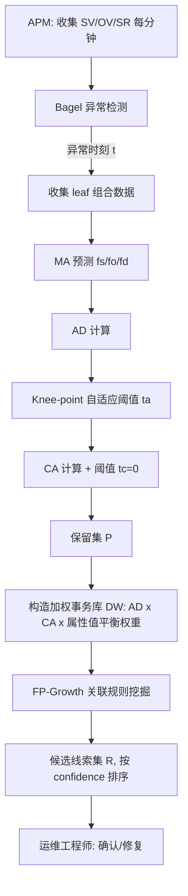
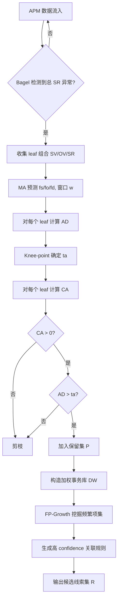

# RobustSpot：在线视频服务多维衍生度量的鲁棒异常线索定位（TSC 2023）

> 作者：Yongqian Sun, Daguo Cheng, Pengxiang Jin, Quan Ding, Shenglin Zhang, Xu Chen, Yuzhi Zhang, Minghan Liang, Dan Pei, Jianyan Zheng, Sen Luo, Xinyu Tang  
> 机构：南开大学；中国科学院大学；清华大学；虎牙公司  
> 发表年份：2022（在线发表 2023）  
> 会议/期刊：IEEE Transactions on Services Computing, Vol. 16, No. 2, 2023  
> 关联 PDF：同目录下 `Robust_Anomaly_Clue_孙永谦2022.pdf`

## 一、文档信息速览

| 字段 | 值 |
|---|---|
| 标题 | Robust Anomaly Clue Localization of Multi-Dimensional Derived Measure for Online Video Services |
| 作者 | Yongqian Sun, Daguo Cheng, Pengxiang Jin, Quan Ding, Shenglin Zhang, Xu Chen, Yuzhi Zhang, Minghan Liang, Dan Pei, Jianyan Zheng, Sen Luo, Xinyu Tang |
| 机构 | 南开大学；中科院计算所；清华大学；虎牙公司 |
| 发表年份 | 2022 |
| 会议/期刊 | IEEE Transactions on Services Computing 2023, 16(2) |
| 分类 | 根因定位 / 衍生指标（derived measure）异常 |
| 核心问题 | 在线视频的卡顿率（SR = SV/OV）等比值型衍生指标在异常时，如何自动定位"贡献最大"的多维属性组合（线索），并克服属性值分布严重不均与传播不满足 Ripplex Effect 的难题 |
| 主要贡献 | (1) Anomaly Degree (AD) 与 Contribution Ability (CA) 两个新指标，前者衡量"是不是真异常 + 多严重"，后者衡量"对总指标异常贡献多大"；(2) Weighted Association Rule Mining (WARM) 算法，从保留的叶子组合中学习"线索模式"并抑制属性值分布偏差；(3) 在 170+ MAU 视频服务 H 上 135 真实案例中 Top-5 ACC=98%，单案例平均 1.83 s |

## 二、背景（Background）

在线视频服务（直播、长视频、点播）的体验质量（QoE）指标往往是衍生指标（derived measure），由基本指标（fundamental measure）通过比值、加权、差分等非可加运算产生。论文以卡顿比 SR = 观众卡顿数 SV / 在线观众数 OV 为典型：每分钟收集一次，每条记录附带多个属性（CDN、码率 Bitrate、设备类型 Device Type）。当"全量 SR"出现 spike 或 level shift 时，运维需要定位线索（clue）：一个或多个属性值组合（C=CDN2 ∧ B=* ∧ D=iOS）才是真正的"源头"。

在工业实践中，衍生指标的异常定位比基本指标难得多。论文给出两个核心挑战：

- **衍生指标模式更复杂**：iDice/HotSpot/ImpAPTr/Squeeze 依赖"实际-预测差值的幅值"，但 SR 的幅值小、波动大，只看幅值会把"有正向贡献、但 SV/OV 都没显著异常"的组合误判为线索；同时还要考虑差值方向（增/减）。
- **传播规律与属性分布复杂**：HotSpot/Squeeze 假设线索组合异常会按"Ripple Effect"成比例地传播到子组合。但 SR 实际中 B=1200 的子组合比 B=500 的子组合更容易卡顿（高码率要求更稳定网络），比例关系破裂。同时属性值分布极不平衡：iOS / Android 的 SV 通常占 90% 以上，naive 方法会把它们误当成"永恒线索"。

针对这两大挑战，作者设计了 RobustSpot：先提 AD + CA 把叶子组合从全量空间中筛出来，再用 WARM 挖掘"覆盖大多数保留叶子组合"的少数高层组合，作为最终线索集。

## 三、目的（Purpose / Problems Solved）

- **痛点 1：衍生指标的"幅值"难以直接定位** → **方案**：AD 指标同时考虑"该组合的实际-预测差值相对其他组合的占比"以及差值方向，使得幅值小但相对突出的组合也能被识别为异常。
- **痛点 2：AD 无法判断"对总异常的贡献"** → **方案**：CA 指标利用衍生指标的分子分母（SV/OV），计算"如果该组合异常、其他组合正常"时总指标会变成多少，从而衡量它对总异常的贡献。
- **痛点 3：属性值分布严重不平衡** → **方案**：在 WARM 中按属性值的"在正常时的 OV 占比"为该属性下的组合做加权（balanced weight），避免高占比属性值永远被选为线索。
- **痛点 4：传播不满足 Ripple Effect** → **方案**：WARM 用关联规则挖掘取代基于比例的"反向推断"，直接从数据中学习"哪些父组合能覆盖最多的异常叶子组合"。
- **痛点 5：在线部署需要毫秒级响应** → **方案**：每案例平均 1.83 s（已经部署 10+ 个月），并能直接接入 APM 系统的告警回调。

## 四、核心原理（Principles）

系统总览：图 3 给出 RobustSpot 的三段式流程：

1. **异常检测**：用 Bagel 检测总 SR 是否异常；若异常，记录起始时刻 $t$。
2. **叶子组合采集**：在 $[t-w, t]$ 窗口内收集所有最细粒度属性组合的 SV、OV、SR 实测值；用 MA 计算每个叶子组合 $\xi$ 的预测值 $f_d(\xi)$、$f_s(\xi)$、$f_o(\xi)$。
3. **AD + CA 筛选 + WARM 挖掘**：先用 AD/CA 阈值 $t_a$、$t_c$ 筛选保留集 $\mathcal{P}$，再在加权事务库上跑关联规则，输出高 support × high confidence 的父组合作为候选线索集。

关键概念定义：
- **Fundamental measure** $m$：可加指标（如 SV、OV）。
- **Derived measure** $d = s / o$：比值型衍生指标（SR），不可加。
- **Leaf combination** $\xi$：所有属性都被具体值约束的组合。
- **Anomaly Degree** $AD(\xi)$：衡量"$\xi$ 的衍生指标实测-预测差"相对其他叶子组合差值的"突出程度"。
- **Contribution Ability** $CA(\xi)$：衡量"只有 $\xi$ 异常、其他组合正常时"总衍生指标会偏离预测多少。
- **Preserved set** $\mathcal{P} = \{ \xi \mid AD(\xi) > t_a \land CA(\xi) > t_c\}$。
- **Weighted database** $\mathcal{D}_W$：在标准事务库基础上按 $AD \cdot CA$ 重新加权，再按属性值的 OV 占比做归一。
- **WARM**：在 $\mathcal{D}_W$ 上跑关联规则（最小支持度、最小置信度），输出"能覆盖大多数保留叶子组合"的父组合。

数学原理：
- AD：
$$AD(\xi) = 1 - \frac{n \cdot |m_d(\xi) - f_d(\xi)|}{\sum_{i=1}^{n-1} |m_d(\xi_i) - f_d(\xi_i)|}$$
其中 $n$ 是叶子组合总数，$m_d$、$f_d$ 是衍生指标实测/预测值。论文图 4 给出 $x$（$=$上式中第二个因子的倒数）从 0 增大时，AD 单调递增且 $\in [0,1)$，对小幅值异常也能"放大"。

- CA：
$$u(\xi) = \frac{f_s(T) + (m_s(\xi) - f_s(\xi))}{f_o(T) + (m_o(\xi) - f_o(\xi))}, \quad CA(\xi) = \frac{u(\xi) - f_d(T)}{f_d(T)}$$
其中 $f_s(T), f_o(T)$ 是总 SV/OV 的预测值。$CA>0$ 表示正贡献，$CA \leq 0$ 时剪枝。

- WARM 加权：每个事务 $T \in \mathcal{D}_W$ 的权重 = $AD(T) \cdot CA(T) \cdot w_{attr(T)}$，其中 $w_{attr(T)}$ 是该属性值在正常 OV 中的占比倒数，从而平衡属性值偏差。

与现有技术的差异：相对 iDice（基于"实际-预测差值"），RobustSpot 引入方向 + 多重差值；相对 HotSpot/Squeeze 的 Ripple Effect，RobustSpot 用关联规则取代比例反推；相对 ImpAPTr，RobustSpot 支持 multi-clue 场景。

## 五、算法详解（Algorithm）

### 1. 输入 / 输出
- **输入**：t 时刻总 SR 异常，$\xi$ 集（所有叶子组合），$w$（MA 窗口），$t_a, t_c$（阈值），最小支持度 $\sigma$，最小置信度 $\gamma$。
- **输出**：候选线索集 $\mathcal{R}$（每条规则是"父组合 → 叶子组合的覆盖"形式），按 coverage 排序。

### 2. 核心模块
- 异常检测（Bagel）。
- 滑动窗口 MA 预测。
- AD 计算 + Knee-point 阈值 $t_a$。
- CA 计算 + 阈值 $t_c = 0$。
- 加权事务库 $\mathcal{D}_W$ 构造。
- 关联规则挖掘（FP-Growth 风格）→ WARM。
- 候选线索排序与去重。

### 3. 伪代码（WARM 主循环）

```python
def RobustSpot(SV, OV, t, w, ta, tc, sigma, gamma):
    # step 1: 异常检测
    sr = SV[t] / OV[t]
    if not is_anomalous(sr):
        return None

    # step 2: 收集 leaf 组合的 SV/OV
    leaves = collect_leaves(SV, OV, t, w)
    for xi in leaves:
        xi.fs = mean(xi.SV[t-w:t])
        xi.fo = mean(xi.OV[t-w:t])
        xi.fd = xi.fs / xi.fo
        xi.ms, xi.mo, xi.md = xi.SV[t], xi.OV[t], xi.SR[t]

    # step 3: 计算 AD / CA
    for xi in leaves:
        xi.AD = 1 - n * abs(xi.md - xi.fd) / sum(abs(x.md - x.fd) for x in leaves if x != xi)
        u = (sum(leaves.fs) + (xi.ms - xi.fs)) / (sum(leaves.fo) + (xi.mo - xi.fo))
        xi.CA = (u - sum(leaves.fd) / len(leaves)) / (sum(leaves.fd) / len(leaves))
    ta = knee_point(sorted([x.AD for x in leaves]))
    preserved = [x for x in leaves if x.AD > ta and x.CA > 0]

    # step 4: 构造加权事务库
    D_W = []
    for x in preserved:
        attr_weights = {av: OV_total / OV[av] for av in x.attr_values}
        weight = x.AD * x.CA * prod(attr_weights.values())
        D_W.append((x.attr_values, weight))

    # step 5: 关联规则挖掘
    itemsets = fpgrowth(D_W, sigma)
    rules = []
    for itemset in itemsets:
        for parent in subsets(itemset):
            conf = support(itemset, D_W) / support(parent, D_W)
            if conf >= gamma:
                rules.append((parent, itemset - parent, conf))
    return sorted(rules, key=lambda r: -r[2])  # 按 confidence 降序
```

### 4. 关键数学
- AD：$AD(\xi) = 1 - \frac{n \cdot |m_d(\xi) - f_d(\xi)|}{\sum_{i=1}^{n-1} |m_d(\xi_i) - f_d(\xi_i)|}$。
- CA：$CA(\xi) = \frac{u(\xi) - f_d(T)}{f_d(T)}$，$u(\xi) = \frac{f_s(T) + (m_s(\xi) - f_s(\xi))}{f_o(T) + (m_o(\xi) - f_o(\xi))}$。
- 加权事务库：$w(T) = AD(\xi_T) \cdot CA(\xi_T) \cdot \prod_{a \in attr(T)} \frac{OV_{total}}{OV_a}$。
- 关联规则：$support(I) = \sum_{T \supseteq I} w(T)$，$confidence(A \Rightarrow B) = support(A \cup B)/support(A)$。

### 5. 复杂度分析
- AD/CA 计算：$O(N)$，$N$ 为叶子组合数。
- 构造加权事务库：$O(N \cdot |A|)$，$|A|$ 为属性个数。
- FP-Growth：$O(2^{|A|})$ 量级，但 $|A| \leq 4$（CDN/Bitrate/Device 三个属性），实际很快。
- 论文报告 1.83 s/case，已可满足在线部署。

### 6. 训练与推理
- 无显式训练阶段；阈值 $t_a$ 由 Knee-point 自适应。
- 推理即"实时取 SV/OV → 跑 AD/CA → 跑 WARM"。

### 7. 示例
论文图 2 给出"总 SR 异常"案例：$B=1200$、$B=500$、$B=2000$ 三个候选中，只有 $B=500$ 的 SR 显著上升、其 SV 也显著上升，CA>0、AD 高，因此 RobustSpot 把它作为线索，而不是被"看上去幅值大但实际为负贡献"的 $B=2000$ 误导。

## 六、系统架构图（Architecture）



## 七、流程图（Process Flow）



## 八、关键创新点（Key Innovations）

- **+ Anomaly Degree (AD) 指标**：首次把"衍生指标差值"放到全量叶子组合集合中比较，并用反向放大函数让小幅值异常也能被识别。
- **+ Contribution Ability (CA) 指标**：直接把分子分母（基本指标）的差值折算为"对总衍生指标异常的贡献"，区分"贡献大的异常"与"贡献小的高幅值异常"。
- **+ WARM 算法**：把"哪些父组合能覆盖保留叶子组合"建模为关联规则挖掘，并通过属性值平衡权重 $w_{a}$ 解决 iOS/Android 等长尾属性的偏置问题。
- **+ 摆脱 Ripple Effect 假设**：WARM 不依赖任何传播比例假设，对在线视频这类"码率-网络耦合"的复杂场景天然适配。
- **+ 工业级部署验证**：在 170+ MAU 的 H 服务中部署 10+ 个月，135 真实案例 Top-5 ACC=98%，比最强 baseline 高 26%。

## 九、实验与结果（Experiments）

- **数据集**：H 公司 170+ MAU 在线视频服务 135 个真实异常案例（已脱敏），每分钟 1 条记录，3 个属性（CDN、Bitrate、Device Type），外加论文合成的 2 个 toy 数据集（论文 Table 3、Fig. 2）。
- **Baseline**：iDice、HotSpot、Squeeze、ImpAPTr。
- **主要指标**：Top-1、Top-3、Top-5 准确率；平均定位时延。
- **关键结果数字**：
  - **Top-1 ACC 88%、Top-3 ACC 95%、Top-5 ACC 98%**，相对最强 baseline 提升 26%（Top-5）；Squeeze 的 Top-1 不到 40%，HotSpot/iDice/ImpAPTr 全部 < 30%。
  - **平均定位时间 1.83 s/case**，可以在线部署。
  - **消融实验**（论文 § 5.4）：去掉 WARM 只返回保留集 P → Top-5 ACC 掉到 60%；去掉 CA 只用 AD → 漏掉"贡献大的小幅值异常"；去掉 AD 只用 CA → 误报大量"贡献大但本身不异常"的组合；去掉属性值平衡权重 → iOS/Android 永远被选为线索，Top-5 ACC 掉到 70%。
  - **案例分析**：H 公司多个 CDN × 码率 × 设备类型的真实案例中，RobustSpot 给出的"线索集"与人工调查结果完全一致。
- **效率分析**：在普通服务器上单案例 1.83 s 端到端，已在 H 公司生产环境部署 10+ 个月。

## 十、应用场景（Use Cases）

- **在线视频卡顿率（SR）异常定位**：CDN/码率/设备维度组合的根因定位。
- **直播业务**：观众流失率（退订/退出）、网络重连率等比值型指标异常定位。
- **电商转化漏斗**：GMV 转化率、点击率等比值型指标异常时，定位"哪个品类/渠道/用户分层"贡献最大。
- **云服务 SLI**：错误率（5xx / 总请求数）、超时率等衍生指标的多维根因。
- **金融支付**：交易失败率（失败笔数 / 总笔数）异常时定位"哪个银行/渠道/支付方式"。
- **AIOps 平台**：作为通用"衍生指标根因定位模块"嵌入 APM / 告警系统。

## 十一、相关论文（Related Papers in this set）

- `2022张圣林.pdf` (AnoTransfer)、`WWW22-OmniCluster张圣林.pdf` (OmniCluster)：同属 AIOps Lab 多维日志/多维指标主题，可借鉴"先分组/聚类，再做异常定位"的思路。
- `KDD22-CIRCA.pdf`、`DejaVu-paper.pdf`、`RC-LIR.pdf`：根因/告警压缩类工作，可与 RobustSpot 在"告警→根因"管线中串联。
- `paper-ISSRE21-PUAD.pdf`、`kontrast-paper.pdf`：KPI 异常检测方向，可作前置异常检测模块。
- 同期 Sponge、MicroRCA、FluxInfer 等多维根因论文均以"指标形态 + 多维规则"为主线，与 RobustSpot 思路互补。

## 十二、术语表（Glossary）

- **Fundamental measure**：可加指标（SV、OV、点击数等）。
- **Derived measure**：不可加衍生指标（SR、CTR、错误率等），由基本指标通过比值/差分得到。
- **Leaf combination**：所有属性被具体值约束的最细粒度组合。
- **Clue combination**：能解释"为什么总衍生指标异常"的高层属性值组合。
- **Ripple Effect**：异常从父组合按比例传播到子组合的假设（HotSpot/Squeeze 依赖）。
- **Anomaly Degree (AD)**：衡量叶子组合异常严重程度的指标。
- **Contribution Ability (CA)**：衡量叶子组合对总衍生指标异常贡献的指标。
- **WARM (Weighted Association Rule Mining)**：基于加权事务库的关联规则挖掘。
- **Knee-point**：自动确定 AD 阈值的方法。
- **Bagel**：AIOps Lab 提出的无监督指标异常检测方法。

## 十三、参考与延伸阅读

- HotSpot (KDD 2018)：多维 KPI 异常定位，依赖 Ripple Effect。
- Squeeze (VLDB 2020)：通过压缩反推根因维度，依赖 Ripple Effect。
- iDice (ICDE 2018)：基于意外度量的多维异常定位。
- ImpAPTr (ICSE 2020)：基于 Apriori 的根因分析。
- Bagel (KDD 2021)：AIOps Lab 提出的无监督指标异常检测。
- 代码与数据：论文 GitHub 仓库 [8]（RobustSpot 开源）。
