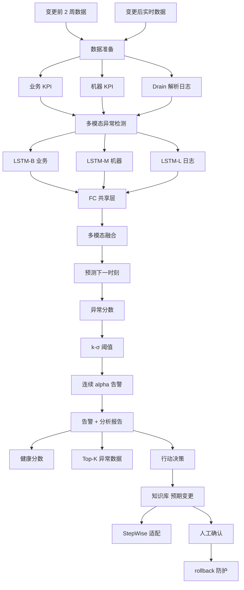
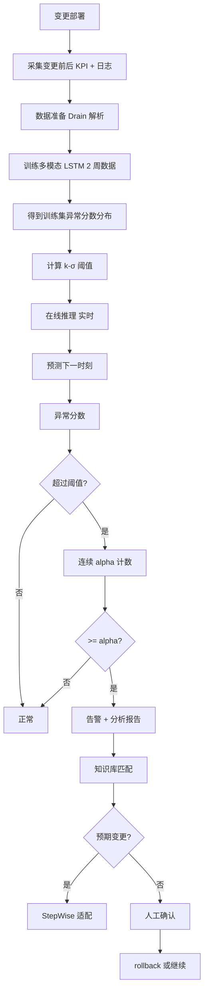

# SCWarn: Identifying Bad Software Changes via Multimodal Anomaly Detection for Online Service Systems（ESEC/FSE 2021）

> 作者：Nengwen Zhao, Junjie Chen, Zhaoyang Yu, Honglin Wang, Jiesong Li, Bin Qiu, Hongyu Xu, Wenchi Zhang, Kaixin Sui, Dan Pei  
> 机构：清华大学（BNRist）；天津大学；BizSeer；中国光大银行  
> 发表年份：2021  
> 会议/期刊：ESEC/FSE 2021（ACM 29th Joint European Software Engineering Conference and Symposium on the Foundations of Software Engineering）  
> 关联 PDF：同目录下 `SCWarn.pdf`

## 一、文档信息速览

| 字段 | 值 |
|---|---|
| 标题 | Identifying Bad Software Changes via Multimodal Anomaly Detection for Online Service Systems |
| 简称 | SCWarn |
| 作者 | Nengwen Zhao, Junjie Chen, Zhaoyang Yu, Honglin Wang, Jiesong Li, Bin Qiu, Hongyu Xu, Wenchi Zhang, Kaixin Sui, Dan Pei |
| 机构 | 清华大学；天津大学；BizSeer；中国光大银行 |
| 发表年份 | 2021 |
| 会议/期刊 | ESEC/FSE 2021 |
| 分类 | 软件变更检测 / 多模态异常检测 / 微服务 / 深度学习 |
| 核心问题 | 大型在线服务系统软件变更频繁且常引发事故（约 50.4% 事故由变更引起），传统 3σ 规则只关注业务 KPI、漏报/延迟严重、忽略"预期变更"误报 |
| 主要贡献 | (1) 首次大规模实证研究（5 个服务 2 年数据，246 坏变更 + 196 正常变更）；(2) 多模态 LSTM 检测（业务 KPI + 机器 KPI + 日志），F1 平均 0.95；(3) 阈值 k-σ + 连续异常告警策略；(4) 基于知识库的预期变更过滤；MTTD 降低 20.4%~60.7% |

## 二、背景（Background）

大型在线服务系统（社交网络、网银、搜索引擎）需要频繁进行软件变更（修复 bug、部署新功能、适应环境变更、提升性能）。Google SRE 报告约 70% 事故与软件变更相关。变更前虽经过 code review、unit test、integration test，但生产环境的集群规模、组件交互、资源竞争、OS/库版本、意外负载等差异仍可能让 bug 漏过。因此部署后监控（post-change monitoring）至关重要，需要尽早识别"坏变更"（bad change）以采取防护措施（rollback 等）。

传统自动化变更检测方法多关注业务 KPI 异常（响应时间等），存在三大问题：(1) 等到业务 KPI 异常时已经造成用户损失和金钱损失，延迟太高（有时达 5+ 天）；(2) 3σ、Holt-winters 等通用异常检测方法未针对软件变更场景设计；(3) 商业监控产品（Dynatrace、Datadog）也未解决上述问题。

论文对某大型商业银行 5 个服务系统两年内工单做了首次大规模实证：约 50.4% 事故由变更引起；坏变更的根因：代码缺陷（38%）、配置错误（31%）、版本不兼容（11%）、资源竞争（9%）、其他（12%）；坏变更引发业务 KPI（响应时间）+ 机器 KPI（CPU、JVM 堆）+ 日志（FullGC、错误消息）多源异常；正常变更也可能引起"预期"异常（资源扩展 → CPU/响应时间下降）。

## 三、目的（Problems Solved）

- **多源数据融合**：业务 KPI + 机器 KPI + 日志统一为时间序列，融合检测。
- **早期检测**：不等业务 KPI 异常就发现，从机器 KPI/日志提前发现。
- **复杂模式**：不同坏变更模式不同，无监督学习。
- **预期变更过滤**：基于知识库区分"预期异常"和"坏变更异常"。
- **可解释告警**：输出分析报告（变更工单信息、健康分数、Top-K 异常数据），辅助工程师决策。
- **MTTD 降低**：相对 baseline 减少 20.4%~60.7%。

## 四、核心原理（Principles）

**系统总览**：SCWarn 包含四步：(1) 数据准备（统一为时间序列）；(2) 多模态异常检测（multimodal LSTM）；(3) 告警 + 分析报告（k-σ 阈值 + 连续点策略）；(4) 行动决策（知识库过滤 + 工程师确认）。

**关键概念**：

- **Software Change（软件变更）**：修复 bug、新功能、配置变更、基础设施变更。
- **Bad Change（坏变更）**：引发事故的变更。
- **Expected Change（预期变更）**：会引发异常但属正常（如资源扩展）。
- **KPI（Key Performance Indicator）**：业务 KPI（响应时间）+ 机器 KPI（CPU、JVM 堆）。
- **Log Template（日志模板）**：用 Drain 解析得到的日志模式。
- **Multimodal LSTM**：多模态 LSTM，融合时间依赖 + 跨模态关联。
- **Drain**：He et al. 2017 的日志解析算法。
- **Holt-winters**：三次指数平滑时序预测。
- **k-σ Principle**：异常分数均值 + k 倍标准差。
- **MTTD（Mean Time To Detect）**：平均检测时间。
- **3-σ Rule**：三倍标准差异常检测。
- **Knowledge Base（知识库）**：预期变更操作与对应数据行为。

**数学原理**：

- **LSTM 单模态表征**（论文 Fig. 7）：

$$
\phi^B = \text{LSTM}(X^{B}_{t-w:t}), \quad \phi^M = \text{LSTM}(X^{M}_{t-w:t}), \quad \phi^L = \text{LSTM}(X^{L}_{t-w:t})
$$

- **单模态表征与预测**：

$$
f^B(\phi^B, X^B_{t-w:t}) = \text{FC}(\phi^B), \quad P^B_{t+1} = \text{FC}(f^B(\cdot))
$$

- **多模态融合**（intermediate fusion）：

$$
F(f^B, f^M, f^L) = \text{FC}([f^B; f^M; f^L])
$$

- **多模态 LSTM 损失**（论文 Eq.）：

$$
L = \frac{1}{n} \sum_{i=1}^{n} [(P^B_i - X^B_i)^2 + (P^M_i - X^M_i)^2 + (P^L_i - X^L_i)^2]
$$

- **异常分数**（预测误差）：

$$
s_t = |X_{t+1} - P_{t+1}|
$$

- **k-σ 阈值**：

$$
\text{threshold} = \mu + k \sigma
$$

其中 $\mu$、$\sigma$ 是训练集异常分数的均值和标准差。

- **连续点告警策略**（连续 $\alpha$ 个时间步异常才告警，避免瞬时噪声）。

- **健康分数**（min-max 归一化）：

$$
\text{health\_score} = \max(100 - \frac{x - \min(AS_{\text{train}})}{\max(AS_{\text{train}}) - \min(AS_{\text{train}})}, 0)
$$

**与现有技术的差异**：与 Gandalf（End-to-end Safe Deployment, ASE 2019）相比，SCWarn 用多模态 LSTM 联合学习；与 Funnel（ISSRE 2017）相比，SCWarn 不依赖 iSST change point；与 Lumos（ICSE 2019）相比，SCWarn 不依赖 t-test；与单源方法（Donut、B-LSTM、OmniAnomaly、DeepLog）相比，SCWarn 多模态融合 F1 提升 0.27。

## 五、算法详解（Algorithm）

1. **输入 / 输出**：
   - 输入：变更前后多源 KPI/日志时间序列。
   - 输出：是否坏变更 + 健康分数 + 异常来源 Top-K。

2. **核心模块**：
   - **数据准备**：Drain 解析日志 → n+2 个时间序列（n 模板 + 总数 + 新日志数）。
   - **多模态 LSTM**：业务 + 机器 + 日志三路 LSTM → 共享全连接层 → 多模态融合 → 预测下一时刻。
   - **阈值选择**：训练集异常分数 k-σ（k=1）。
   - **告警策略**：连续 $\alpha=3$ 个点异常触发告警。
   - **健康分数**：min-max 归一化当前异常分数到 0~100。
   - **行动决策**：知识库匹配预期变更（如资源扩展），否则人工确认；预期变更用 StepWise 适配。

3. **伪代码**：

```python
def data_preparation(logs, kpis):
    """Drain 解析日志为时间序列"""
    templates = drain.parse(logs)
    series = [count_template(t) for t in templates]
    series.append(count_total(logs))
    series.append(count_new(logs, templates))
    return kpis + series

def multimodal_lstm_train(data, window=10, hidden=128, epochs=50):
    """训练多模态 LSTM"""
    lstm_b = LSTM(hidden, return_sequences=False)
    lstm_m = LSTM(hidden, return_sequences=False)
    lstm_l = LSTM(hidden, return_sequences=False)
    fc_shared = Dense(hidden, activation='relu')
    fc_out = Dense(data_dim)
    for ep in range(epochs):
        x_b, x_m, x_l = split_modalities(data)
        h_b = lstm_b(x_b)
        h_m = lstm_m(x_m)
        h_l = lstm_l(x_l)
        f = fc_shared(concat([h_b, h_m, h_l]))
        pred = fc_out(f)
        loss = mse(pred, target)
        loss.backward()
    return model

def compute_anomaly_score(model, data):
    s = np.abs(model.predict(data) - data)
    return s

def alert(score, mu, sigma, k=1, alpha=3):
    """k-σ 阈值 + 连续 alpha 点策略"""
    thresh = mu + k * sigma
    flags = (score > thresh).astype(int)
    # 连续 alpha 点
    consec = np.convolve(flags, np.ones(alpha), mode='same')
    return (consec >= alpha).astype(int)

def decision(alert_flag, change_op, knowledge_base):
    """根据知识库过滤预期变更"""
    if change_op in knowledge_base:
        return 'expected', knowledge_base[change_op]
    return 'unknown', None

def health_score(score, train_min, train_max):
    return max(100 - 100 * (score - train_min) / (train_max - train_min + 1e-9), 0)
```

4. **关键数学**：见 §四。

5. **复杂度分析**：
   - LSTM 训练：$O(N \cdot d \cdot \text{epochs})$。
   - 推理：$O(d)$ 每时间步。
   - 训练：3.43~4.84 分钟（SCWarn）。
   - 推理：0.86~0.94 秒。

6. **训练与推理**：
   - 训练：变更前 2 周数据；Adam lr=0.01，batch=64，epochs=50；LSTM hidden=128；2 FC hidden=64。
   - 推理：在线 0.86~0.94 秒。

7. **示例**：TrainTicket/E-commerce 两个微服务基准系统，注入 10 类坏变更（F1-F10）：代码缺陷（F1 大对象 F2 注入延迟 F3 慢 SQL F4 无效路径）、配置错误（F5 JVM 大小 F6 端口 F7 连接数限制 F8 不存在表）、软件版本（F9 不兼容）、资源竞争（F10 CPU）。

## 六、系统架构图（Architecture）



## 七、流程图（Process Flow）



## 八、关键创新点（Key Innovations）

- **+ 首次大规模实证研究**：5 服务 2 年数据，揭示 50.4% 事故由变更引起，根因分布 38/31/11/9/12%。
- **+ 多模态 LSTM 融合**：业务 + 机器 + 日志三路 LSTM + 共享 FC 层。
- **+ 连续点告警策略**：避免瞬时网络噪声误报。
- **+ 健康分数 + Top-K 异常**：可解释的告警报告。
- **+ 预期变更过滤**：知识库 + StepWise 适配。
- **+ MTTD 大幅降低**：20.4%~60.7%。
- **+ 真实工业部署**：银行实际使用。

## 九、实验与结果（Experiments）

- **数据集**：Train-Ticket（30+ 微服务开源基准）+ E-commerce（电商搜索端到端），Kubernetes 部署；2 个数据集 A（121 坏变更 + 96 正常）、B（125 坏变更 + 98 正常）。
- **Baseline**：Gandalf（ASE 2019）、Funnel（ISSRE 2017）、Lumos（ICSE 2019）、单源 Donut/B-LSTM/LSTM-NDT/OmniAnomaly/DeepLog、多源 M-AE/M-LSTM/Multimodal AE。
- **主要指标**：P、R、F1、MTTD、训练时间、检测时间。
- **关键结果数字**：
  - SCWarn A：P=0.91、R=0.95、F1=0.93、MTTD=5.1 min；
  - SCWarn B：P=0.97、R=0.98、F1=0.97、MTTD=2.3 min；
  - Gandalf-AD A：0.68/0.95/0.79/6.2，B：0.77/0.99/0.87/3.1；
  - Funnel A：0.77/0.69/0.73/14.0，B：0.76/0.87/0.81/6.4；
  - Lumos A：0.66/0.94/0.78/10.0，B：0.77/0.93/0.82/10.0；
  - MTTD 平均 3.7 min，降低 20.4%~63.7%；
  - 多模态 LSTM vs M-LSTM p-value=0.0416，effect size=0.6860（中等差异）；vs multimodal AE p=0.0019，effect size=0.8388（大差异）。
- **消融实验**：
  - 单源：Donut 0.76/0.83、B-LSTM 0.80/0.93、LSTM-NDT 0.76/0.86、OmniAnomaly 0.83/0.87、DeepLog 0.71/0.66；
  - 多源：M-AE 0.81/0.86、M-LSTM 0.87/0.96、Multimodal AE 0.88/0.94、Multimodal LSTM 0.93/0.97。
- **效率**：SCWarn 训练 3.43~4.84 min，检测 0.86~0.94 s，比 OmniAnomaly（28.11 min）、DeepLog（50.65 min）快得多。
- **超参数**：k=1、α=3 最佳。

## 十、应用场景（Use Cases）

- **银行系统变更检测**：中国光大银行实际部署。
- **微服务发布监控**：电商/支付/订票等微服务。
- **CI/CD 流水线**：自动检测坏变更并 rollback。
- **云服务发布**：Azure/AWS 资源变更后监控。
- **电信运营商业务变更**：告警关联变更事件。

## 十一、相关论文（Related Papers in this set）

- `alertrank_camera-ready`（严重告警识别）
- `SynthoDiag`（测试告警诊断）
- `TraceSieve_ISSRE23`（追踪异常检测）
- `SmartIW-Camera-Ready`（TCP IW 调优）
- `SparseRCA__Unsupervised_Root_Cause_Analysis_in_Sparse_Microservice_Testing_Traces__ISSRE24_Camera_Ready_`（稀疏追踪 RCA）
- `ISSRE24-Self-Evolution`（LLM 微调）

## 十二、术语表（Glossary）

- **Software Change**：软件变更。
- **Bad Change**：坏变更。
- **Expected Change**：预期变更。
- **KPI**：业务/机器关键性能指标。
- **Multimodal LSTM**：多模态 LSTM。
- **Drain**：He et al. 2017 日志解析。
- **k-σ Principle**：异常阈值。
- **3-σ Rule**：三倍标准差。
- **MTTD**：平均检测时间。
- **StepWise**：时序适配算法。
- **FullGC**：Java 垃圾回收。
- **JVM Heap**：Java 堆内存。

## 十三、参考与延伸阅读

- Paper: He et al. 2017《Drain: An online log parsing approach》——日志解析。
- Paper: Chen & Guestrin 2016《XGBoost》——异常检测特征。
- Paper: Hundman et al. 2018《Detecting spacecraft anomalies using LSTMs》——LSTM 异常检测。
- Paper: Xu et al. 2018《Donut》——VAE 时序异常。
- Paper: Su et al. 2019《OmniAnomaly》——随机递归时序 VAE。
- Paper: Du et al. 2017《DeepLog》——日志异常检测 LSTM。
- Paper: Hochreiter & Schmidhuber 1997 LSTM。
- 工具：Train-Ticket、E-commerce benchmark、Prometheus、InfluxDB、Logstash、ElasticSearch、Kubernetes。
- 相关论文：`alertrank_camera-ready`、`SynthoDiag`。
