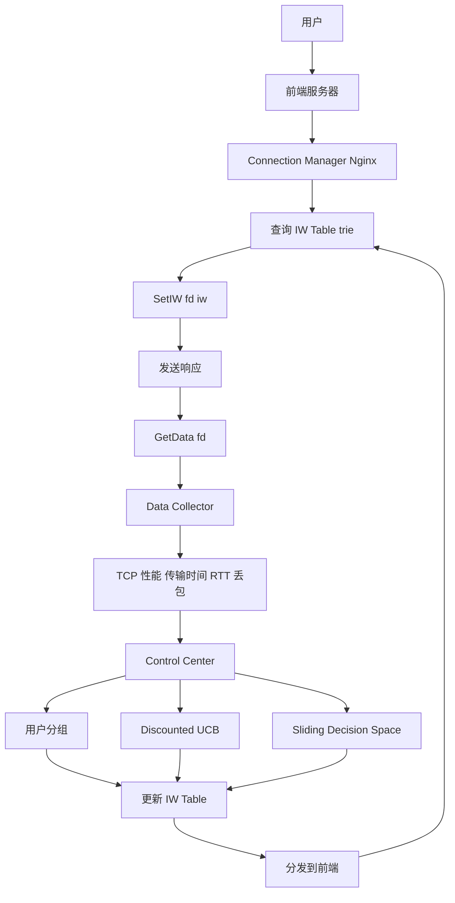
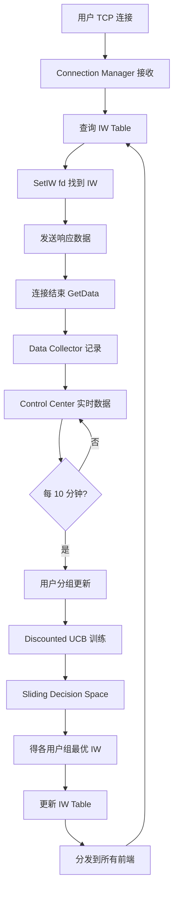

# SmartIW: Reducing Web Latency through Dynamically Setting TCP Initial Window with Reinforcement Learning（IEEE IWQoS 2018）

> 作者：Xiaohui Nie, Youjian Zhao, Dan Pei, Guo Chen, Kaixin Sui, Jiyang Zhang  
> 机构：清华大学（BNRist）；湖南大学；微软研究院；百度  
> 发表年份：2018  
> 会议/期刊：IEEE IWQoS 2018  
> 关联 PDF：同目录下 `SmartIW-Camera-Ready.pdf`

## 一、文档信息速览

| 字段 | 值 |
|---|---|
| 标题 | Reducing Web Latency through Dynamically Setting TCP Initial Window with Reinforcement Learning |
| 简称 | SmartIW |
| 作者 | Xiaohui Nie, Youjian Zhao, Dan Pei, Guo Chen, Kaixin Sui, Jiyang Zhang |
| 机构 | 清华大学；湖南大学；微软研究院；百度 |
| 发表年份 | 2018 |
| 会议/期刊 | IEEE IWQoS 2018 |
| 分类 | TCP 优化 / Web 性能 / 强化学习 / 边缘网络 |
| 核心问题 | TCP 启动期 IW（初始拥塞窗口）静态且保守（2~10），导致 Web 短流（>80% 仍在 slow-start 阶段）无法充分利用带宽；不同用户/ISP/省份网络条件差异巨大，单一 IW 无法适应 |
| 主要贡献 | (1) Linux 内核 + Nginx 改造实现服务端 TCP 性能测量（传输时间、丢包率、RTT），无客户端协助；(2) 基于用户网络特征（子网/ISP/省份）的 bottom-up 分组满足 RL 上下文连续性要求；(3) Sliding-decision-space discounted UCB 加速大动作空间搜索；(4) 部署百度移动搜索 1+ 年，平均传输时间降低 23%~29% |

## 二、背景（Background）

Web 服务的网络传输时间直接决定用户体验与营收。TCP 是几乎所有在线 Web 服务的传输层（Microsoft、Google、百度）。TCP 启动期采用保守静态的初始拥塞窗口 IW（2、4 或 10），然后通过探测/调整寻找最佳拥塞窗口。但 Web 短流（典型 120KB）通常在 1 个 RTT 内就完成传输，没时间从保守 IW 找到最佳 CWND。论文实测百度移动搜索 1 周数据：>80% TCP 流在会话结束时仍处于 slow-start 阶段，未充分利用可用带宽。

Google 提议把 IW 从 2~4 提升到 10，但 10 对高速光纤用户仍偏小，对 GPRS 等低速用户又过大。静态 IW 无法适应网络条件时空高度变化的现实。

数据驱动的学习（如 RL）适合：实时 trial-and-error 平衡探索与利用，但有三个挑战：
1. **服务端测量 TCP 性能**：传统 Web 服务端不能直接测量 TCP 传输时间（需要客户端协助）。
2. **RL 上下文连续性**：RL 假设上下文分布连续，但网络条件时空变化大，细粒度用户组（IP）样本不足。
3. **大动作空间搜索**：IW 取值空间连续巨大，brute-force 搜索不切实际。

论文提出 SmartIW，用 RL 在服务端动态设置 IW，按用户组（子网/ISP/省份）应用。

## 三、目的（Problems Solved）

- **服务端 TCP 测量**：修改 Linux 内核 + Nginx 收集 TCP 流性能（传输时间、丢包、RTT），无客户端协助。
- **用户分组**：bottom-up 基于子网/ISP/省份特征分组，找到既满足样本量又满足 RL 上下文连续性的最细粒度用户组。
- **大动作空间搜索**：sliding-decision-space discounted UCB，从短列表开始动态扩展。
- **动态适应**：每 10 分钟重训，应对网络条件变化。
- **公平性约束**：reward 综合 goodput + RTT，避免对其他流造成拥塞。
- **真实工业部署**：百度移动搜索 1+ 年，23%~29% 提升。

## 四、核心原理（Principles）

**系统总览**：SmartIW 包含三个组件：(1) Connection Manager（Nginx 模块）查询 IW Table 设置 IW 并输出性能数据；(2) Data Collector 收集 TCP 性能数据；(3) Reinforcement Learning 在 Control Center 运行分组 + RL 算法，更新 IW Table。

**关键概念**：

- **TCP IW（Initial Window）**：初始拥塞窗口大小。
- **CWND**：拥塞窗口。
- **RTT（Round-Trip Time）**：往返时延。
- **Slow Start**：TCP 慢启动。
- **RL（Reinforcement Learning）**：强化学习。
- **UCB（Upper Confidence Bound）**：多臂老虎机算法。
- **Discounted UCB**：非平稳环境的 UCB 变体。
- **Subnet/ISP/Province**：子网/ISP/省份，三层网络特征。
- **Geolocation Database**：IP 地理位置库。
- **Goodput**：有效吞吐量。
- **MSS（Maximum Segment Size）**：最大报文段大小。
- **Jitter $J$**：网络抖动，表征连续性。
- **Sliding-decision-space**：滑动决策空间方法。
- **LTE/Ethernet/GPRS**：不同网络类型。

**数学原理**：

- **TCP 响应时间估计**（论文 Fig. 1）：

$$
T_{\text{TCP}} = T_{\text{end}} - T_{\text{start}}
$$

- **响应时间分解**：

$$
T_{\text{response}} = T_1 + T_2 + T_3 \approx T_2 + T_3 + T_4
$$

其中 $T_2$ 是前后端内部网络，$T_3$ 是后端处理，$T_4$ 是最后 ACK 时间（可服务端测量），用来估算 $T_1$（用户到前端请求时间）。

- **Discounted UCB 算法**（论文 Algorithm 1）：

$$
\bar{X}_t(\gamma, i) = \frac{\sum_{s=1}^{t} \gamma^{t-s} X_s(i) \mathbf{1}\{I_s = i\}}{N_t(\gamma, i)}
$$

$$
N_t(\gamma, i) = \sum_{s=1}^{t} \gamma^{t-s} \mathbf{1}\{I_s = i\}
$$

- **UCB 置信上界**（论文 Eq. 3）：

$$
c_t(\gamma, i) = 2B \sqrt{\frac{\xi \log n_t(\gamma)}{N_t(\gamma, i)}}, \quad n_t(\gamma) = \sum_i N_t(\gamma, i)
$$

- **决策**（选择最大化 $\bar{X}_t + c_t$ 的 arm）：

$$
I_t = \arg\max_{1 \le i \le K} \bar{X}_t(\gamma, i) + c_t(\gamma, i)
$$

- **奖励函数**（论文 Eq. 4，综合 goodput 和 RTT）：

$$
X_s(i) = \alpha \cdot \frac{\text{Goodput}_s(i)}{\text{Goodput}_{\max}} + (1 - \alpha) \cdot \frac{\text{RTT}_{\min}}{\text{RTT}_s(i)}
$$

- **网络抖动 $J$**（论文 Eq. 5，评估用户组稳定性）：

$$
J = \frac{\sum_{s=2}^{n} |X_s - X_{s-1}| / X_s}{n-1}
$$

$J \le T$ 表示该用户组满足 RL 连续性。

- **IW 滑动决策空间**（论文 Fig. 4）：
  - 初始化 arm 列表 $[15, 20, 25, 30]$；
  - 若最佳 arm 是最大的 $\text{IW}_{\text{large}}$，加 4 并删除 $\text{IW}_{\text{small}}$；
  - 若最佳 arm 是最小的 $\text{IW}_{\text{small}}$，减 4 并删除 $\text{IW}_{\text{large}}$。

**与现有技术的差异**：与静态 IW=10（Google 提议）相比，SmartIW 动态适应；与 Liu et al. 2014（TCP fast open）相比，SmartIW 改变 IW 不修改协议；与 Reinforcement Learning for video ABR 优化相比，SmartIW 应用于 TCP IW。

## 五、算法详解（Algorithm）

1. **输入 / 输出**：
   - 输入：用户 IP、TCP 性能（传输时间、RTT、丢包、goodput）。
   - 输出：每个用户组的 IW 值。

2. **核心模块**：
   - **Connection Manager**：Nginx 模块，用 trie 查 IW Table，设 IW。
   - **Data Collector**：收集 GetData(fd) 返回的 TCP 性能，存 HBase/HDFS。
   - **用户分组（User Grouping）**：bottom-up 四步法（叶子节点 → ISP → 省份 → All）。
   - **RL 训练（Discounted UCB）**：滑动决策空间，每 10 分钟重训。
   - **IW Table 更新**：分发到所有前端服务器。

3. **伪代码**：

```python
def discounted_ucb(arms, gamma=0.95, B=1, xi=0.1):
    """非平稳多臂老虎机"""
    X_bar = {i: 0 for i in arms}
    N = {i: 0 for i in arms}
    n_total = 0
    for t in range(T):
        for i in arms:
            if t < len(arms):
                chosen = arms[t]
                break
            conf = 2 * B * sqrt(xi * log(n_total + 1) / (N[i] + 1e-9))
            scores[i] = X_bar[i] + conf
        chosen = argmax(scores)
        reward = get_reward(chosen)
        n_total += 1
        for i in arms:
            X_bar[i] = (gamma * X_bar[i] * N[i] + (reward if i == chosen else 0)) / (gamma * N[i] + (1 if i == chosen else 0))
            N[i] = gamma * N[i] + (1 if i == chosen else 0)
    return X_bar

def sliding_decision_space(arms, reward_func):
    """滑动决策空间方法"""
    best_arm = argmax(reward_func(arms))
    if best_arm == max(arms):
        new_arm = max(arms) + 4
        arms = arms[1:] + [new_arm]
    elif best_arm == min(arms):
        new_arm = min(arms) - 4
        arms = [new_arm] + arms[:-1]
    return arms

def user_grouping(subnets, isps, provinces, threshold_T=0.1):
    """bottom-up 用户分组"""
    groups = []
    # Step 1: 检查叶子节点（子网）是否满足 RL 连续性
    for s in subnets:
        if jitter(s) <= threshold_T:
            groups.append(s)
        else:
            groups.append(None)  # 标记为 blue
    # Step 2: 兄弟 leaf blue 合并为 Others
    # Step 3: ISP 层检查 Others
    # Step 4: 省份层检查 Others；最后 All 层
    return groups

def reward(goodput, rtt, alpha=0.8):
    return alpha * goodput / goodput_max + (1 - alpha) * rtt_min / rtt

def set_iw(connection, iw):
    """Linux 内核 setsockopt 设置 IW"""
    setsockopt(connection.fd, TCP_IW, iw)
```

4. **关键数学**：见 §四。

5. **复杂度分析**：
   - 用户分组：$O(N \log N)$，$N$ 子网数。
   - Discounted UCB：$O(T \cdot K)$，$K$ arm 数。
   - 滑窗搜索：$O(1)$ 每步。
   - 在线查询 IW：$O(N)$ trie 最长前缀匹配，$N \le 32$。

6. **训练与推理**：
   - 训练：每 10 分钟重训；15 万 IP → 19 个用户组。
   - 推理：每 TCP 连接 trie 查 IW，毫秒级。

7. **示例**：百度移动搜索 1 个数据中心 4 台前端服务器，分 2 组对比（TCP-10 静态 vs SmartIW 动态）。SmartIW 在 50、80 分位提升 25%，99 分位提升 5%。

## 六、系统架构图（Architecture）



## 七、流程图（Process Flow）



## 八、关键创新点（Key Innovations）

- **+ 服务端测量**：Linux 内核 + Nginx 改造，无客户端协助，收集 TCP 性能。
- **+ 用户分组**：bottom-up 算法（子网 → ISP → 省份 → All），既满足样本量又满足 RL 连续性。
- **+ Sliding-decision-space**：大动作空间动态搜索，从短列表开始扩展。
- **+ Discounted UCB**：非平稳环境 RL 适应网络变化。
- **+ 综合 reward**：goodput + RTT 兼顾性能与公平。
- **+ 真实工业部署**：百度移动搜索 1+ 年。
- **+ 实际收益**：平均传输时间降低 23%~29%。

## 九、实验与结果（Experiments）

- **数据集**：百度移动搜索 1 个北京数据中心，1 周数据。
- **Baseline**：TCP-10（IW=10）、TCP-200（IW=200）、SmartIW without grouping。
- **主要指标**：平均 TCP 响应时间、各分位提升。
- **关键结果数字**：
  - 平均响应时间降低 23%（某些用户组 30%）；
  - 50 分位提升 25%、80 分位提升 25%；
  - 99 分位提升 5%（loss 是 99 分位长尾主因，SmartIW 不专门优化 loss）；
  - 19 个用户组（3 省份 + 15 省份+ISP + 1 Others），1501665 IP 归类；
  - 上海、广东、新疆 jitter 接近阈值 0.1（因跨地域路由）；
  - 各用户组响应时间提升 15%~31%。
- **Testbed 评估**：9 用户组 + 1 服务器，HTB + netem 模拟网络条件。
  - TCP-10: 14KB；
  - TCP-200: 280KB（激进）；
  - SmartIW 表现最接近最优；
  - 验证了用户分组 + RL 两个组件都有贡献。
- **关键参数**：$\text{Smin} = 100$、$\theta = 0.1$、time_bin = 10 min、$\alpha = 0.8$、$\Delta = 5$、$\xi = 0.1$、初始 arm $[5, 10, 15, 20]$。

## 十、应用场景（Use Cases）

- **Web 搜索服务**：百度移动搜索（实际部署）。
- **电商平台**：短流密集（图片/HTML/CSS/JS）。
- **API 网关**：跨网络用户访问。
- **CDN 边缘**：不同地域网络条件。
- **视频点播/直播**：短流（弹幕、首帧）。
- **物联网（IoT）**：小数据包传输。

## 十一、相关论文（Related Papers in this set）

- `alertrank_camera-ready`（告警分级）
- `SCWarn`（多模态异常检测）
- `SynthoDiag`（测试告警诊断）
- `TraceSieve_ISSRE23`（追踪异常检测）
- `SparseRCA__Unsupervised_Root_Cause_Analysis_in_Sparse_Microservice_Testing_Traces__ISSRE24_Camera_Ready_`（稀疏追踪 RCA）
- `ISSRE24-Self-Evolution`（LLM 微调）
- `mining-causality-niexiaohui`（因果图根因分析）
- `FSE_24_GrayScope`（灰色故障定位）

## 十二、术语表（Glossary）

- **TCP IW**：Initial Window，初始拥塞窗口。
- **CWND**：Congestion Window，拥塞窗口。
- **RTT**：Round-Trip Time，往返时延。
- **Slow Start**：慢启动。
- **RL**：Reinforcement Learning。
- **UCB**：Upper Confidence Bound。
- **Discounted UCB**：折扣 UCB（非平稳）。
- **MSS**：Maximum Segment Size。
- **Goodput**：有效吞吐量。
- **Subnet/ISP/Province**：子网/ISP/省份。
- **Jitter**：网络抖动。
- **Trie**：前缀树。
- **Sliding-decision-space**：滑动决策空间。
- **HTB/netem**：Linux TC 工具。

## 十三、参考与延伸阅读

- Paper: Allman et al. 2013《Increasing TCP's Initial Window》——IW=10 提案。
- Paper: Auer et al. 2002《Finite-time Analysis of the Multiarmed Bandit Problem》——UCB。
- Paper: Garivier & Moulines 2008《On Upper-Confidence Bound Policies for Switching Bandit Problems》——Discounted UCB。
- Paper: Mao et al. 2017《A Reinforcement Learning Approach to ABR》——视频 ABR 用 RL。
- Paper: Jiang et al. 2014《Via: Improving Internet Telemetry through Vanity Name Caching》——TCP fast open。
- 工具：Linux 内核（setsockopt）、Nginx、HAProxy、Linux TC（HTB/netem）。
- 相关论文：`alertrank_camera-ready`、`SCWarn`。
