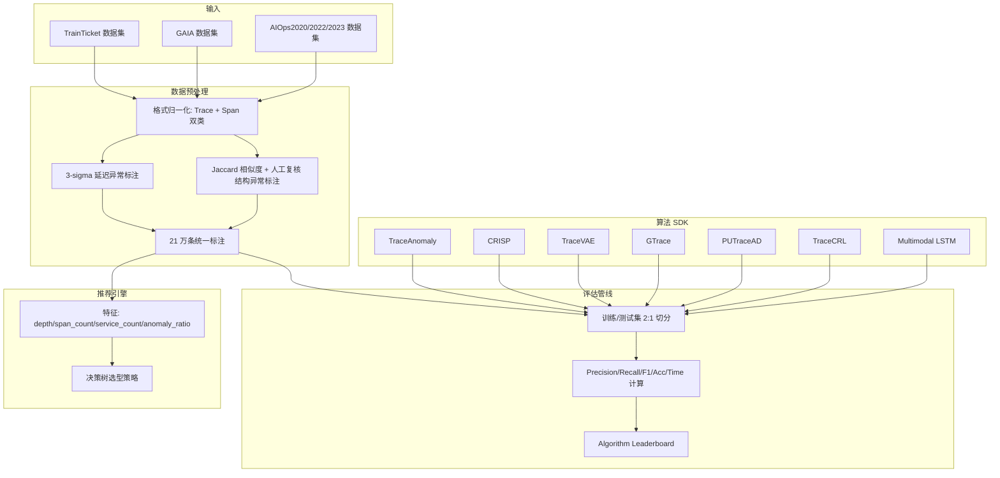
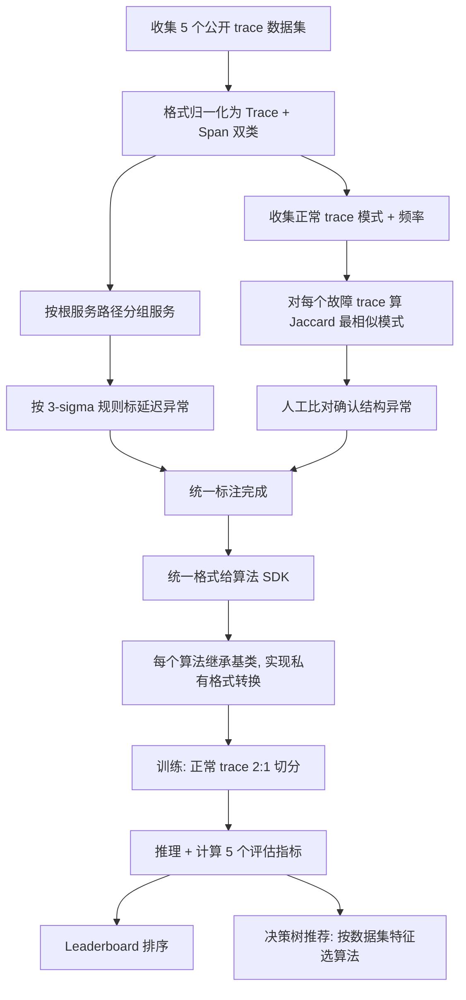

# TADBench: A Comprehensive Benchmark and Empirical Study of Trace Anomaly Detection（IEEE TSC 2025）

> 作者：Yongqian Sun, Minyi Shao, Xiaohui Nie, Kaiwen Yang, Xingda Li, Bowen Hao, Shenglin Zhang, Changhua Pei, Dongbiao He, Yanbiao Li, Dan Pei  
> 机构：南开大学、中国科学院计算机网络信息中心（CNIC）、清华大学  
> 发表年份：2025  
> 会议/期刊：IEEE Transactions on Services Computing（TSC）  
> 关联 PDF：同目录下 `TSC-TADBench.pdf`  
> 代码：https://github.com/nkalgo/TADBench.git

## 一、文档信息速览

| 字段 | 值 |
|---|---|
| 标题 | A Comprehensive Benchmark and Empirical Study of Trace Anomaly Detection（TADBench） |
| 作者 | Yongqian Sun, Minyi Shao, Xiaohui Nie, Kaiwen Yang, Xingda Li, Bowen Hao, Shenglin Zhang, Changhua Pei, Dongbiao He, Yanbiao Li, Dan Pei |
| 机构 | 南开大学、中国科学院 CNIC、清华大学 |
| 发表年份 | 2025 |
| 会议/期刊 | IEEE TSC |
| 分类 | 评测基准 / 经验研究 / Trace 异常检测 |
| 核心问题 | 缺乏统一的 trace 异常检测算法评测基准和公平的对比框架，导致工业落地不知道该选哪个算法。 |
| 主要贡献 | 1) TADBench 统一数据格式 + 5 个公开 trace 数据集 + 约 21 万条人工标注；2) 模块化评估框架（collection→preprocess→adapt→evaluate） + 算法 SDK 抽象基类；3) 7 个 trace 异常检测算法的横向对比（VAE / GNN / LSTM 三类）；4) 基于决策树的算法推荐策略，按 trace depth / span count / service count / anomaly ratio 给出具体选型建议。 |

## 二、背景（Background）

随着微服务架构成为大型互联网应用的主流选择，系统的可观测性变得前所未有的重要。分布式追踪（distributed tracing）通过 trace（一次请求经过的所有 span）和 span（单个服务调用）构建有向无环图（DAG），完整记录请求传播路径。Trace 异常检测因此成为故障诊断、根因分析和系统可视化的关键能力——它能在问题扩散前识别服务交互网络中的异常，避免服务中断或性能下降。

然而，过去几年 trace 异常检测领域出现了一个尴尬局面：
- 算法侧：TraceAnomaly（VAE 变分自编码器）、CRISP、TraceVAE、GTrace（VAE 类）、PUTraceAD（GNN + 半监督）、TraceCRL（GraphCL 对比学习 + GNN）、Multimodal LSTM 等 7 种代表性算法相继被提出，思路各异；
- 数据侧：TrainTicket、GAIA、AIOps2020/2022/2023 等多个开源数据集涌现，但格式不统一、缺少异常标签；
- 评估侧：各论文只在自己选定的一个或两个数据集上跑，难以横向比较。

结果就是：开发者和运维人员面对具体生产系统时，没有客观依据选择算法；同时复现也困难——不同论文用了不同的数据预处理、不同超参、不同评估脚本。这种"碎片化生态"严重阻碍了 trace 异常检测从论文走向生产。

TADBench 正是为了打破这一困境而生的：把数据集、算法、评估管线、推荐策略整合成一个可复现的开放基准，让"选哪个算法"成为一个数据驱动、可被工程师快速回答的问题。

## 三、目的（Purpose / Problems Solved）

论文明确给出三大挑战：

- **挑战 1：数据可用性差。** 各数据集格式不统一、缺异常标签，散落各处，集成成本高。
- **挑战 2：缺乏标准化评估框架。** 各论文预处理方式、算法实现、测试管线不一致，导致无法公平比较，复现困难。
- **挑战 3：算法选型难。** 不同算法在不同场景表现差异大，但运维人员缺少"数据特征 → 算法"的映射指南。

每条挑战都对应了"痛点 → 解决方案"：

- 痛点 1 → 收集 5 个公开数据集 → 统一为 Trace + Span 双类格式 → 用 3-sigma 规则 + Jaccard 相似度 + 人工复核标注约 21 万条 trace；
- 痛点 2 → 设计 4 阶段评估框架（trace collection / preprocessing / model adaptation / model evaluation） + 算法 SDK 抽象基类 + 开源代码；
- 痛点 3 → 在 5 个数据集 × 7 个算法上做大规模实验 → 用决策树集成 trace depth / span count / service count / anomaly ratio 多种特征 → 输出树状推荐策略。

## 四、核心原理（Principles）

TADBench 包含四大块：(a) 数据集整合与统一标注；(b) 统一数据格式；(c) 算法 SDK 抽象；(d) 跨数据集实验 + 推荐策略。

**统一数据格式**：作者定义了两个核心类（Fig.9）：
- **Trace 类**：trace_id、root span、span count、anomaly type（0 正常 / 1 仅延迟 / 2 仅结构 / 3 双异常）、source。
- **Span 类**：trace_id、span_id、parent_span_id、children_span_id、start_time、duration、service/operation name、anomaly、status_code、latency、structure、extra。

这样无论原始数据是 GAIA 格式还是 AIOps2022 格式，都先转成统一格式，再由各算法 SDK 内部转成该算法私有的输入格式（如 STV、SCPV、graph 邻接表等）。

**异常标签生成**：
- **延迟异常**：对每个服务，先按"从根服务出发的共享调用路径"分组，避免同名服务被混在一起；用正常 trace 中该组服务延迟的高斯分布 (μ, σ) 建模，遵循 3-sigma 规则——$L\notin[\mu-3\sigma, \mu+3\sigma]$ 即标记为延迟异常。
- **结构异常**：先收集正常 trace 的服务集模式 + 频率；对每个故障 trace，计算它与所有正常模式的 Jaccard 相似度 $J(T,P) = |S(T)\cap S(P)|/|S(T)\cup S(P)|$；取最相似模式 $P^*$，人工比对 $T$ 与 $P^*$，确认存在 missing / unexpected / out-of-order calls 后标为结构异常。

**算法分类**（Fig.6）：
- **VAE-based**：TraceAnomaly、CRISP、TraceVAE、GTrace；
- **GNN-based**：PUTraceAD、TraceCRL；
- **LSTM-based**：Multimodal LSTM。

**评估指标**：Precision、Recall、F1、Accuracy、Time Consumption（训练时间 / 检测速度）。

**与现有方法差异**：
- 现有 trace 算法评估都是"选一两个数据集 + 自己实现预处理"，缺少系统化横向比较；TADBench 是第一个综合 benchmark。
- 现有数据集缺标签、格式不统一；TADBench 提供 21 万条人工标注 + 统一格式。
- 选型缺乏指导；TADBench 给出基于决策树的推荐策略。

数学核心公式：

3-sigma 延迟异常判定：

$$L\notin[\mu - 3\sigma, \mu + 3\sigma]$$

Jaccard 相似度（结构异常匹配）：

$$J(T,P) = \frac{|S(T)\cap S(P)|}{|S(T)\cup S(P)|}$$

最相似正常模式选择：

$$P^* = \arg\max_{P_i\in\mathcal{P}} J(T, P_i)$$

## 五、算法详解（Algorithm）

### 1. 输入 / 输出

- **TADBench 输入**：原始 trace 数据（多种格式） + 待评测算法源码。
- **TADBench 输出**：每个算法在 5 个数据集上的 Precision/Recall/F1/Accuracy/Time，以及一份"数据特征 → 推荐算法"的决策树。

### 2. 核心模块

- **Trace Collection**：收集 5 个开源 trace 数据集。
- **Trace Preprocessing**：统一为 Trace/Span 双类格式，补齐缺失字段。
- **Dataset Labeling**：延迟异常用 3-sigma；结构异常用 Jaccard + 人工复核。
- **Model Adaptation**：每个算法继承 SDK 抽象基类，重写 `preprocess` 把统一格式转为算法私有格式。
- **Model Evaluation**：标准化训练/测试管线，按 Precision/Recall/F1/Accuracy/Time 评估。
- **Algorithm SDK**：抽象基类统一输入输出接口。
- **Leaderboard**：交互式排序界面（Fig.12）。
- **Recommendation Engine**：用决策树集成多种数据特征做算法选型。

### 3. 伪代码

```python
# === 统一标注 ===
def label_latency_anomaly(traces, services):
    for svc in services:
        normal_latencies = [t[svc].latency for t in traces if t.label == 'normal']
        mu, sigma = mean(normal_latencies), std(normal_latencies)
        for t in traces:
            if abs(t[svc].latency - mu) > 3 * sigma:
                t.latency_anomaly = True

def label_structure_anomaly(faulty_traces, normal_patterns):
    for t in faulty_traces:
        P_star = argmax([jaccard(t.services, p) for p in normal_patterns])
        if human_compare(t, P_star):  # missing/unexpected/out-of-order
            t.structure_anomaly = True

# === 算法 SDK 基类 ===
class TraceAnomalyAlgo:
    def preprocess(self, unified_traces):
        # 把 Trace/Span 转为该算法私有格式
        return algo_specific_format

    def train(self, train_data):
        raise NotImplementedError

    def predict(self, test_data):
        raise NotImplementedError

# === 决策树推荐 ===
def recommend_algo(dataset_features):
    # features: trace_depth, span_count, service_count, anomaly_ratio
    if features['anomaly_ratio'] > 0.10:
        return 'PUTraceAD'  # semi-supervised
    if features['span_count'] <= 5 or features['span_count'] > 30:
        return 'GTrace'      # Tree-LSTM
    if 6 <= features['span_count'] <= 10:
        if features['trace_depth'] <= 3:
            return 'TraceVAE'
        return 'GTrace'
    if 11 <= features['span_count'] <= 30:
        if features['anomaly_ratio'] <= 0.01 or features['anomaly_ratio'] > 0.03:
            return 'TraceVAE'
        return 'GTrace'
```

### 4. 关键数学

3-sigma 规则（公式 1）：

$$L\notin[\mu - 3\sigma, \mu + 3\sigma]$$

Jaccard 相似度（公式 2）：

$$J(T,P)=\frac{|S(T)\cap S(P)|}{|S(T)\cup S(P)|}$$

F1-score（公式 6）：

$$F1 = 2\times\frac{P\times R}{P+R}$$

### 5. 复杂度分析

论文未给严格复杂度公式，但 Table V 实测：GTrace 检测速度 10211 traces/s，Multimodal LSTM 4500 traces/s，TraceVAE 仅 257 traces/s（双变量 graph VAE 计算昂贵）。训练时间上，TraceVAE 最长（23497s），Multimodal LSTM 最短（419s）。

### 6. 训练与推理

- **训练**：对每个数据集，按 2:1 切分正常 trace 为训练/测试集；所有异常 trace 全部进入测试集。
- **推理**：调用算法 SDK 的 predict 接口；输出 anomaly score，按阈值/聚类判定。
- **评估**：对每个数据集分别计算 Precision/Recall/F1/Accuracy/Time。

### 7. 示例

论文 Fig.1 展示一个 7-span 的 trace 例子；Fig.2 展示延迟异常（spans 0/1/2 延迟异常高）；Fig.3 展示意外服务调用（B 错误调用 G 而非 E）；Fig.4 展示缺失调用（E 缺失）；Fig.5 展示调用顺序错误（F 错误调用 E 而应 B 调用 E）。

## 六、系统架构图（Architecture）



## 七、流程图（Process Flow）



## 八、关键创新点（Key Innovations）

- **+ 第一个公开的 trace 异常检测综合 benchmark**：5 个开源数据集（TrainTicket、GAIA、AIOps2020/2022/2023）+ 7 个主流算法 + 21 万条人工标注 + 3.6 GB 数据 + 约 104 万 traces；GitHub 开源，是社区的"基础设施级"贡献。
- **+ 统一数据格式（Trace + Span 双类）**：把 GAIA 格式、AIOps 格式、TrainTicket 格式归一化，让"换数据集不用重写预处理"成为可能。
- **+ 基于"调用路径分组"的 3-sigma 延迟异常标注**：相比按服务名分组，按根服务出发的共享调用路径分组更准确，避免同名服务被混在一起；3-sigma 规则兼顾统计严谨与可解释性。
- **+ Jaccard + 人工复核的结构异常标注**：自动找最相似正常模式，再人工确认 missing / unexpected / out-of-order，兼顾效率和准确性。
- **+ 算法 SDK 抽象 + 决策树推荐策略**：把 7 个异构算法统一为同一种"训练-预测"接口，并基于数据集特征（depth、span count、service count、anomaly ratio）输出"具体场景该用哪个算法"的树状决策，让选型从"凭经验"变成"数据驱动"。

## 九、实验与结果（Experiments）

- **数据集**：5 个公开 trace 数据集（Table I/II）：
  - TrainTicket：trace depth 3.3、avg spans 39.0、services 29、operations 64、异常率 32.9%。
  - GAIA：depth 4.7、avg spans 9.3、services 10、异常率 49.9%。
  - AIOps2020：depth 5.5、avg spans 23.1、services 10、异常率 21.8%。
  - AIOps2022：depth 4.2、avg spans 21.7、services 40、operations 29、异常率 36.3%。
  - AIOps2023：depth 3.8、avg spans 14.5、services 37、异常率 53.6%。
- **算法**：7 个（Multimodal LSTM、TraceAnomaly、CRISP、PUTraceAD、TraceCRL、TraceVAE、GTrace）。
- **评估指标**：Precision、Recall、F1、Accuracy、Time Consumption。
- **关键结果数字**（Table III/IV/V）：
  - TrainTicket：GTrace F1=99.4% 最优；TraceVAE 97.3%。
  - GAIA：TraceVAE F1=90.9% 最优。
  - AIOps2020：GTrace F1=71.8% 最优。
  - AIOps2022：TraceVAE F1=78.9% 最优。
  - AIOps2023：PUTraceAD F1=74.7% 最优（异常率 53.6%，半监督优势明显）。
  - 结构异常 F1：TraceVAE 96.8% > GTrace 95.6% > PUTraceAD 89.1%。
  - 延迟异常 F1：GTrace 78.2% > TraceVAE 76.4% > Multimodal LSTM 62.2%。
  - 检测速度（Table V）：GTrace 10211 traces/s 最快；Multimodal LSTM 4500；TraceVAE 仅 257。
- **消融实验**：通过按 trace depth（≤3 / 3-6 / >6）、span count（1-5 / 6-10 / 11-30 / >30）、service count（1-4 / 5-8 / >8）、anomaly ratio（0% / 0.5% / 1% / 3%）分组，对比各算法表现（Fig.14-17）。
- **效率分析**：Table V 给出训练时间（最短 419s LSTM，最长 23497s TraceVAE）和检测速度（GTrace 最快 10211 traces/s）。
- **推荐策略**：决策树集成 4 个特征输出选型（论文 IV-E）：异常率 >10% → PUTraceAD；span ≤5 或 >30 → GTrace；6-10 span 且 depth ≤3 → TraceVAE，depth>3 → GTrace；11-30 span 且异常率 ≤1% 或 >3% → TraceVAE，其余 GTrace。

## 十、应用场景（Use Cases）

- **微服务系统异常检测算法选型**：运维人员按自己系统的 trace depth/span count/service count 特征，对照决策树选算法。
- **学术界算法对比基准**：发表新 trace 异常检测算法时，可在 TADBench 5 个数据集上跑出公平比较。
- **教学与培训**：学生可以在统一框架下复现 7 个算法，理解 VAE / GNN / LSTM 在 trace 数据上的差异。
- **trace 数据集统一标注工具**：作者公开的 3-sigma + Jaccard 标注流程可被其他研究者复用。
- **AIOps 平台集成**：平台开发者可参考 TADBench 的评估管线搭建内部的 trace 异常检测评测体系。

## 十一、相关论文（Related Papers in this set）

- `Mengyao__SiameseLSTM`：KPI 时序异常检测，与本篇 trace 维度互补。
- `Shiyu__Accurate_and_Interpretable_Log_Fault_Diagnosis_using_Large_Language_Models-2`：日志故障诊断，与本篇 trace 维度互补（同一作者团队）。
- `24_TOSEM_DeepHunt`：深度异常检测，与本篇 trace 异常检测同属 AIOps 大类。
- `InformationSciences-OmniFed`：联邦异常检测，可与 TADBench 评估框架结合研究"联邦 trace 异常检测"。
- `TSC-TADBench`（本篇）：trace 异常检测的"基础设施级" benchmark。

## 十二、术语表（Glossary）

- **Trace（追踪）**：一次请求在分布式系统中经过的所有 span 构成的有向无环图。
- **Span（调用段）**：单个服务调用的记录，包含 trace_id、span_id、parent_span_id、start_time、duration、service/operation name 等。
- **Latency Anomaly（延迟异常）**：服务执行时间超过正常统计范围。
- **Structural Anomaly（结构异常）**：服务调用关系偏离正常模式（unexpected / missing / out-of-order calls）。
- **OpenTracing**：分布式追踪规范，定义 trace 和 span 两个核心组件。
- **DBSCAN**：基于密度的聚类算法，论文中 Jaccard 距离的聚类工具之一。
- **3-sigma Rule**：假设数据正态分布，99.73% 在 ±3σ 内，超出即为异常。
- **VAE（Variational Autoencoder）**：变分自编码器，论文中 TraceAnomaly/CRISP/TraceVAE/GTrace 的基础。
- **GNN（Graph Neural Network）**：图神经网络，论文中 PUTraceAD/TraceCRL 的基础。
- **GAT（Graph Attention Network）**：图注意力网络，PUTraceAD 用其生成 trace 图表示。
- **Tree-LSTM**：树形 LSTM，GTrace 用其处理 trace 树结构。
- **nnPU（non-negative PU learning）**：非负 PU 学习算法，PUTraceAD 的训练目标。
- **Decision Tree（决策树）**：TADBench 用于集成多种数据特征做算法推荐的模型。
- **Jaeger / Zipkin / SkyWalking**：常见分布式追踪系统。

## 十三、参考与延伸阅读

- **TraceAnomaly**（论文 [14]）：基于 DVB-NF 的 VAE trace 异常检测。
- **CRISP**（论文 [16]）：基于关键路径向量（SCPV）的 trace 异常检测。
- **TraceVAE**（论文 [20]）：双变量 Graph-VAE 建模结构 + 时间。
- **GTrace**（论文 [12]）：graph-wise + node-wise VAE + Tree-LSTM + 缓存/分组加速。
- **PUTraceAD**（论文 [25]）：GAT + nnPU 半监督 trace 异常检测。
- **TraceCRL**（论文 [30]）：GraphCL + One-Class SVM 对比学习。
- **Multimodal LSTM**（论文 [34]）：多模态 LSTM 联合建模时序 + 结构。
- **OpenTracing**（规范）：分布式追踪的事实标准。
- **TrainTicket / GAIA / AIOps2020/2022/2023**：TADBench 集成的 5 个公开数据集，详见论文 Table I。
- **GitHub：nkalgo/TADBench**：论文配套开源代码、复现脚本、推荐决策树。
