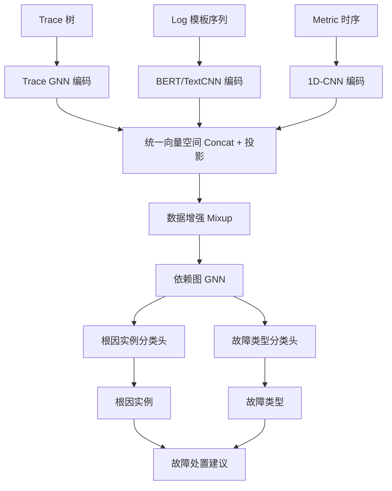
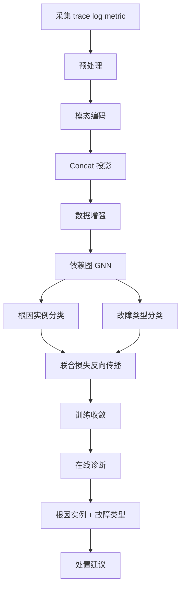

# DiagFusion: Robust Failure Diagnosis of Microservice System through Multimodal Data（IEEE TSC 2023）

> 作者：Shenglin Zhang、Pengxiang Jin、Zihan Lin、Yongqian Sun、Bicheng Zhang、Sibo Xia、Zhengdan Li、Zhenyu Zhong、Minghua Ma、Wa Jin、Dai Zhang、Zhenyu Zhu、Dan Pei  
> 机构：南开大学；复旦大学；微软；浙江网商银行；清华大学；海河实验室  
> 发表年份：2023  
> 会议/期刊：IEEE Transactions on Services Computing（DOI 10.1109/TSC.2023.3290018）  
> 关联 PDF：同目录下 `TSC23-DiagFusion.pdf`

## 一、文档信息速览

| 字段 | 值 |
|---|---|
| 标题 | DiagFusion: Robust Failure Diagnosis of Microservice System through Multimodal Data |
| 作者 | Shenglin Zhang、Pengxiang Jin、Zihan Lin、Yongqian Sun、Bicheng Zhang、Sibo Xia、Zhengdan Li、Zhenyu Zhong、Minghua Ma、Wa Jin、Dai Zhang、Zhenyu Zhu、Dan Pei |
| 机构 | 南开大学；复旦大学；微软；浙江网商银行；清华大学；海河实验室 |
| 发表年份 | 2023 |
| 会议/期刊 | IEEE TSC |
| 分类 | 故障诊断 / 多模态 / 微服务 |
| 核心问题 | 单模态（trace / log / metric）方法对复杂微服务故障诊断不充分；多模态数据格式异构难融合；故障类型不平衡 |
| 主要贡献 | (1) 实证研究表明多模态融合对故障诊断至关重要；(2) 提出 DiagFusion 框架，融合 trace + log + metric 统一表示；(3) 用数据增强解决标签不足与故障类型不平衡；(4) 用 GNN 同时完成根因实例定位与故障类型判定；(5) 根因定位提升 20.9%-368%，故障类型判定提升 11.0%-169% |

## 二、背景（Background）

现代微服务系统通常包含数十到数千个服务实例，运行在物理机、VM、容器上。一个实例的故障会通过复杂的服务依赖关系传播到其他实例，造成用户满意度下降和公司损失。论文以 AWS 2021 年 12 月持续 7 小时的网络故障为例，说明及时准确的故障诊断至关重要。

微服务系统的可观测性"三大支柱"：追踪（trace，记录请求执行路径与 span）、日志（log，半结构化软硬件事件）、指标（metric，时序数据如 CPU、内存、QPS、错误率）。单模态方法（基于 trace、log、metric 之一）存在两大局限：

- 单次故障往往影响多个模态，单一模态无法捕捉完整模式；
- 某些故障类型只在特定模态下反映，单模态方法会漏检。

论文先做实证研究：分析开源平台 1000+ 故障案例（系统卡顿、进程崩溃、登录失败、文件缺失、访问拒绝等），证明多模态融合对准确诊断至关重要。进而提出 DiagFusion：(1) 轻量预处理 + 表征学习把三模态映射到同一向量空间；(2) 数据增强解决标签不足与故障类型不平衡；(3) 用 trace + 部署数据构建依赖图，用 GNN 捕捉空间特征与故障传播路径；(4) 联合完成"根因实例定位"和"故障类型判定"。

## 三、目的（Problems Solved）

- **单模态方法不足**：融合 trace/log/metric。
- **多模态表示异构**：用统一表示学习映射到同一向量空间。
- **故障类型不平衡**：用数据增强（mixup、SMOTE 风格）扩充稀有故障。
- **根因实例定位**：用 GNN 在依赖图上学习。
- **故障类型判定**：多分类头输出类型。
- **小样本场景**：仅 160/80 个标注故障即可训练。
- **公开实现**：发布代码与数据。

## 四、核心原理（Principles）

**系统总览**：DiagFusion 包含 (1) 轻量预处理（trace → 树、log → 模板、metric → 时序向量）；(2) 表征学习（不同编码器映射到统一向量空间）；(3) 数据增强（特征 mixup、时序抖动）；(4) 依赖图构建（基于 trace + 部署）；(5) GNN 训练（结合空间特征 + 故障传播路径）；(6) 联合输出（根因实例 + 故障类型）。

**关键概念**：

- **Trace（追踪）**：用户请求的 span 树。
- **Span**：trace 中的单个调用节点。
- **Log（日志）**：半结构化事件。
- **Metric（指标）**：时序数据。
- **Modality（模态）**：一种数据类型。
- **Dependency Graph（依赖图）**：服务实例之间的调用关系图。
- **Multimodal Fusion（多模态融合）**：把多种模态映射到统一向量空间并联合训练。
- **Data Augmentation**：数据增强（mixup、SMOTE 等）。
- **GNN（图神经网络）**：在依赖图上学习节点表示。
- **Root Cause Instance Localization**：根因实例定位。
- **Failure Type Determination**：故障类型判定。

**数学原理**：

- **三模态编码**：

$$
h_t = f_{\text{trace}}(G_t), \quad h_l = f_{\text{log}}(L_t), \quad h_m = f_{\text{metric}}(M_t)
$$

$f_{\text{trace}}$ 用 GNN 编码 span 树，$f_{\text{log}}$ 用 BERT/TextCNN 编码模板，$f_{\text{metric}}$ 用 1D-CNN 编码时序。

- **统一向量空间映射**：

$$
h = \text{Concat}(h_t, h_l, h_m) W_{\text{proj}} \in \mathbb{R}^d
$$

- **数据增强（mixup）**：

$$
h' = \lambda h + (1-\lambda) h'' , \quad y' = \lambda y + (1-\lambda) y''
$$

$\lambda \sim \text{Beta}(\alpha, \alpha)$。

- **依赖图 GNN**：

$$
h_v^{(k+1)} = \phi\left( \sum_{u \in N(v)} W^{(k)} h_u^{(k)} \right)
$$

- **联合损失**：

$$
\mathcal{L} = \mathcal{L}_{\text{root}} + \mathcal{L}_{\text{type}} + \lambda \mathcal{L}_{\text{aug}}
$$

其中 $\mathcal{L}_{\text{root}}$ 是根因实例分类损失，$\mathcal{L}_{\text{type}}$ 是故障类型分类损失，$\mathcal{L}_{\text{aug}}$ 是辅助增强损失。

- **推理**：

$$
\hat{v}_{\text{root}} = \arg\max_v P(v | h), \quad \hat{c} = \arg\max_c P(c | h)
$$

**与现有技术的差异**：与单模态方法（TraceAnomaly、LogCluster、OmniAnomaly）相比，DiagFusion 多模态融合；与 Eadro、MicroHEC 等多模态方法相比，DiagFusion 引入数据增强 + GNN 联合训练；与 AnoFusion（同期）相比，DiagFusion 强调"诊断"而非"检测"。

## 五、算法详解（Algorithm）

1. **输入 / 输出**：
   - 输入：服务实例的 trace + log + metric 模态数据 + 少量标注故障。
   - 输出：根因实例 + 故障类型。

2. **核心模块**：
   - **预处理**：trace → span 树、log → Drain 模板、metric → 归一化时序。
   - **模态编码器**：GNN / BERT / 1D-CNN。
   - **统一向量空间**：Concat + 投影。
   - **数据增强**：mixup、SMOTE、特征抖动。
   - **依赖图构建**：基于 trace 父-子关系 + 部署数据。
   - **GNN 训练**：GCN/GAT 在依赖图上。
   - **联合分类头**：根因 + 类型。
   - **推理**：前向输出。

3. **伪代码**：

```python
def diagfusion_train(trace, log, metric, label_root, label_type, epochs=100):
    h_t = trace_gnn(trace)
    h_l = log_bert(log)
    h_m = metric_cnn(metric)
    h = concat(h_t, h_l, h_m) @ W_proj
    # data augmentation
    h_aug, y_root_aug, y_type_aug = mixup(h, label_root, label_type, alpha=0.2)
    # GNN on dependency graph
    h_g = gnn(dependency_graph, h_aug)
    # joint classification
    p_root = softmax(W_root @ h_g + b_root)
    p_type = softmax(W_type @ h_g + b_type)
    loss = cross_entropy(p_root, y_root_aug) + cross_entropy(p_type, y_type_aug)
    loss.backward()
```

4. **关键数学**：见 §四。

5. **复杂度分析**：
   - 模态编码：$O(N d)$；
   - GNN 训练：$O(|E| d)$/epoch；
   - 数据增强：常数倍；
   - 总计：GPU 上分钟级到小时级（取决于数据规模）。

6. **训练与推理**：监督训练（少量标注）；推理前向输出。

7. **示例**：某服务实例 trace 出现 500 错误、log 报"file not found"、metric 网络流量突降；DiagFusion 编码三模态 + 依赖图 GNN → 判定根因实例为 S3 + 故障类型为"文件缺失（code bug）"。

## 六、系统架构图（Architecture）



## 七、流程图（Process Flow）



## 八、关键创新点（Key Innovations）

- **+ 多模态统一表示**：trace/log/metric 编码到同一向量空间。
- **+ 数据增强解决标签稀缺与不平衡**：mixup 等技术。
- **+ 依赖图 GNN**：联合空间特征 + 故障传播路径。
- **+ 联合训练根因 + 类型**：双任务学习。
- **+ 小样本 + 大幅提升**：仅 160/80 标注即可训练，根因定位提升 20.9%-368%。

## 九、实验与结果（Experiments）

- **数据集**：1 个开源平台（如 TrainTicket）+ 1 个真实微服务系统（浙江网商银行）。
- **Baseline**：单模态方法（TraceAnomaly、LogCluster、OmniAnomaly）、多模态方法（Eadro、AnoFusion）。
- **主要指标**：Avg@K（根因定位）、F1（故障类型判定）、时间效率。
- **关键结果数字**：
  - 训练样本 160/80 时，根因定位 Avg@5 0.75/0.76；
  - 根因定位准确率提升 20.9%-368%；
  - 故障类型 F1 0.84/0.80，提升 11.0%-169%；
  - 时间效率：GPU 上分钟级，CPU 上小时级。
- **消融实验**：分别去掉多模态、数据增强、依赖图 GNN，验证每部分贡献。
- **效率分析**：训练和推理时间可控。
- **可视化**：依赖图、根因热力图。

## 十、应用场景（Use Cases）

- **微服务系统故障诊断**：根因定位 + 故障类型判定。
- **金融支付链路异常诊断**：定位支付失败的根因实例。
- **电商大促异常处置**：定位流量异常源。
- **SaaS 多租户故障定位**：跨租户诊断。
- **运营商业务故障诊断**：定位网络/应用层根因。

## 十一、相关论文（Related Papers in this set）

- `Chain-of-Event_Interpretable-Root-Cause-Analysis-for-MicroservicesFSE24-Camera-Ready`（事件级根因）
- `AlertRCA_CCGRID2024_CameraReady`（告警根因）
- `CMDiagnostor`（调用指标根因）
- `TraceVAE`（追踪异常检测）
- `MonitorAssistant_CameraReady-v1.5_submitted`（LLM 监控助手）
- `LogKG`（日志 KG 诊断）
- `3580305.3599902`（AnoFusion 多模态检测）

## 十二、术语表（Glossary）

- **Trace**：用户请求的 span 树。
- **Span**：trace 中的单个调用。
- **Log**：半结构化事件。
- **Metric**：时序监控数据。
- **Modality（模态）**：一种数据类型。
- **Dependency Graph**：服务依赖图。
- **Multimodal Fusion**：多模态融合。
- **GNN（Graph Neural Network）**：图神经网络。
- **GCN（Graph Convolutional Network）**：图卷积网络。
- **GAT（Graph Attention Network）**：图注意力网络。
- **Root Cause Instance Localization**：根因实例定位。
- **Failure Type Determination**：故障类型判定。
- **Mixup**：特征空间插值数据增强。
- **Avg@K**：前 K 名准确率。

## 十三、参考与延伸阅读

- Paper: Eadro（KDD 2023）——多模态端到端。
- Paper: AnoFusion（WWW 2024）——多模态异常检测。
- Paper: MicroHEC、MS-RCA ——指标根因。
- Paper: TraceAnomaly、LogCluster、OmniAnomaly ——单模态基线。
- Paper: GNN 相关（Kipf & Welling 2017, Veličković 2018）。
- 工具：TrainTicket、Sock Shop 等开源微服务 demo。
- 相关论文：`Chain-of-Event_Interpretable-Root-Cause-Analysis-for-MicroservicesFSE24-Camera-Ready`、`AlertRCA_CCGRID2024_CameraReady`、`CMDiagnostor`、`TraceVAE`、`MonitorAssistant_CameraReady-v1.5_submitted`、`LogKG`、`3580305.3599902`。
