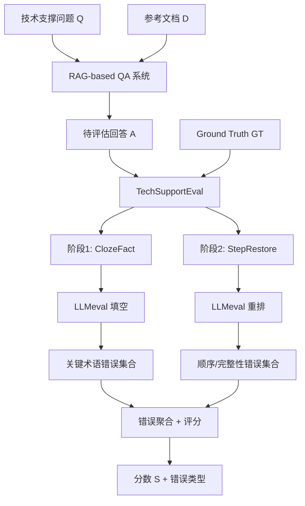
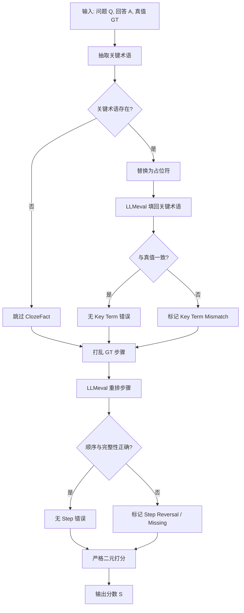

# TechSupportEval: An Automated Evaluation Framework for Technical Support Question Answering（IJCNN 2025）

> 作者：Bohan Chen, Yongqian Sun, Yuhe Liu, Longlong Xu, Zhe Xie, Changhua Pei, Jing Han, Fan Ni, Xuhui Cai, Ce Yang, Dan Pei
> 机构：清华大学、南开大学、中国科学院计算机网络信息中心、中兴通讯股份有限公司、中国移动通信集团有限公司
> 发表年份：2025
> 会议/期刊：IJCNN 2025, Rome, Italy, June 30-July 5, 2025 (TH-CPL B, CCF C)
> 关联 PDF：同目录下 `TechSupportEval.pdf`

## 一、文档信息速览

| 字段 | 值 |
|---|---|
| 标题 | TechSupportEval: An Automated Evaluation Framework for Technical Support Question Answering |
| 作者 | Bohan Chen, Yongqian Sun, Yuhe Liu, Longlong Xu, Zhe Xie, Changhua Pei, Jing Han, Fan Ni, Xuhui Cai, Ce Yang, Dan Pei |
| 机构 | Tsinghua University, Nankai University, CNIC CAS, ZTE Corporation, China Mobile |
| 发表年份 | 2025 |
| 会议/期刊 | IJCNN 2025 (CCF C) |
| 分类 | 评测 / 技术支持 QA 评估 |
| 核心问题 | 现有 QA 评估方法在技术支持场景下无法精确匹配关键术语，也无法验证步骤顺序与完整性 |
| 主要贡献 | 提出 ClozeFact 与 StepRestore 双技术；构建基于 TechQA 的评测基准；AUC 0.91，超越 SOTA 7.6% |

## 二、背景（Background）

技术支撑（Technical Support）是 IT 服务行业的核心场景之一，其市场规模已达万亿美元级别。典型技术支撑流程是：用户在 Microsoft Forum、IBM Developer Forum 等技术社区提出问题，由领域专家参照产品手册、Troubleshooting 指南等参考文档，给出可执行的操作步骤。传统人工支撑受限于专家数量、响应时间与跨地域可扩展性，难以应对海量工单。

为提升效率，业界开始采用基于大语言模型（LLM）+ 检索增强生成（RAG）的技术支撑 QA 系统。该类系统先从知识库中检索 top-K 相关段落，再由 LLM 综合生成回答。然而，RAG 系统存在两类风险：（1）LLM 幻觉——生成不存在或错误的命令、文件路径、配置参数；（2）检索错误——返回的段落顺序错乱或缺失关键步骤。这些问题在技术支撑场景下会直接误导用户执行错误操作，造成二次故障。

因此，工业界迫切需要一个能自动评估 QA 系统回答质量的框架，以系统性提升系统可靠性。但现有自动评估方法（如 ROUGE、BLEU、BERTScore、G-Eval、LangChain Eval、RefChecker 等）多依赖文本相似度或简单的原子事实比对，无法精准识别"命令是否正确、步骤是否完整、顺序是否对"这三类关键问题。技术支撑 QA 的核心判据是"回答是否在正确顺序下完整包含所有可执行步骤，并使用准确的关键术语（如命令、路径、URL）"，这与一般问答场景的评估要求有显著差异。

## 三、目的（Purpose / Problems Solved）

本论文针对技术支撑 QA 自动评估问题，识别了现有方法的三大瓶颈，并提出对应的解决方案：

- **关键术语匹配（Key Term Matching）**：LLM 幻觉会产生错误或不存在的关键术语（如错误的 netstat 参数），导致用户执行错误操作。现有评估方法难以发现这种细微差异。
- **步骤顺序验证（Step Order Verification）**：RAG 检索返回的段落可能顺序错乱，按错误顺序执行步骤会让后续步骤失效。现有方法把抽取的事实当作无序集合处理，无法验证顺序。
- **步骤完整性验证（Step Completeness Verification）**：RAG 检索可能省略中间步骤，导致不完整指导。现有评估方法无法识别缺失的步骤。

本文提出的 TechSupportEval 通过两个创新技术——ClozeFact 与 StepRestore——系统性解决上述问题。

## 四、核心原理（Principles）

TechSupportEval 是一种两阶段 LLM 自动评估框架，整体方案概述如下：

给定技术支撑问题 Q、参考文档集合 D、待评估的 QA 系统使用 LLMQA 检索 top-K 段落并生成回答 A = Generate(D', Q; LLMQA)。技术支撑的标准答案 GT 是一个有序步骤列表 [g1, g2, ..., gn]，每个 gi 是一个可执行步骤。评估器 Evaluate(·) 利用 LLMeval 给出回答 A 的准确性分数 S ∈ [0,1]，目标是最大化 S 与真实标签 S* 之间的 AUC。

**关键概念定义**：
- **关键术语（Key Term）**：从 GT 中预定义抽取的命令、文件路径、URL 等关键内容
- **错误类型**：
  - Key Term Mismatch（关键术语不匹配）：生成回答中的关键术语与参考文档不一致
  - Step Reversal（步骤倒置）：必要步骤以错误顺序出现
  - Step Missing（步骤缺失）：必要步骤被省略

**阶段一：ClozeFact**

将 GT 中的关键术语替换为占位符 ⟨BLANK[ID]⟩，形成"完形填空"形式的提示，要求 LLMeval 根据回答 A 填回关键术语，或在缺失时返回 "Unanswerable"。这种设计强制 LLMeval 主动重构关键术语（而非被动匹配），减少幻觉与对先验知识的依赖，确保精确匹配。

**阶段二：StepRestore**

将 GT 的有序步骤打乱，给每个步骤分配一个唯一大写字母标识，要求 LLMeval 重新按执行顺序排列，并只选择 A 中明确提到的步骤。这一设计强制 LLMeval 从回答中识别步骤，无法凭先验知识补全，从而可靠地验证步骤顺序与完整性。

**与现有技术的差异**：
- 不同于 ROUGE/BLEU 等基于 n-gram 的文本相似度评估，本文关注"步骤"这一结构化概念
- 不同于 FActScore/RAGAS 等基于原子事实抽取的评估，本文通过完形填空让 LLM 主动"重建"事实，降低幻觉
- 不同于 G-Eval 等黑箱 LLM 评分，本文给出透明可解释的错误类型

## 五、算法详解（Algorithm）

### 1. 输入 / 输出
- **输入**：技术支撑问题 Q、参考文档 D、待评估回答 A
- **输出**：准确性分数 S ∈ [0,1]、错误集合（Key Term Mismatch / Step Reversal / Step Missing）

### 2. 核心模块
- 关键术语抽取器（基于预定义规则抽取命令、路径、URL）
- 提示构建器（构建 ClozeFact 与 StepRestore 提示模板）
- LLMeval 推理器（调用 LLM 完成填空与重排任务）
- 错误聚合器（合并两个阶段结果，按严格二元打分或自定义打分）

### 3. 伪代码

```python
def TechSupportEval(Q, A, GT, LLMeval):
    # 阶段一：ClozeFact
    key_terms = extract_key_terms(GT)  # 命令、文件路径、URL
    masked_GT = replace_with_placeholders(GT, key_terms)
    prompt1 = f"""Given the provided text, replace each placeholder
⟨BLANK_*⟩ with the corresponding key term based on the given response.
If the required information is not explicitly mentioned, return "Unanswerable"."""
    cloze_filled = LLMeval(prompt1 + masked_GT + A)
    key_term_errors = detect_mismatch(cloze_filled, key_terms)

    # 阶段二：StepRestore
    shuffled_steps = shuffle_with_labels(GT)  # 分配 A/B/C...
    prompt2 = f"""Based on the provided text, identify and arrange the
mentioned steps in the correct logical execution order. Only include
steps explicitly stated in the text."""
    restored_order = LLMeval(prompt2 + shuffled_steps + A)
    step_order_errors = detect_order_error(restored_order, GT)
    step_completeness_errors = detect_missing_steps(restored_order, GT)

    # 评分（默认严格二元）
    errors = key_term_errors | step_order_errors | step_completeness_errors
    S = 0 if len(errors) > 0 else 1
    return S, errors
```

### 4. 关键数学

- **AUC 计算**：通过 ROC 曲线下面积衡量 S 区分正确/错误回答的能力

$$TPR = \frac{TP}{TP + FN}, \quad FPR = \frac{FP}{FP + TN}$$

$$AUC = \int_0^1 TPR(FPR) d(FPR)$$

- **Pearson 相关系数**：用于衡量模型分数与人类标注之间的线性相关

$$r = \frac{\sum_i (S_i - \bar{S})(S^*_i - \bar{S}^*)}{\sqrt{\sum_i (S_i - \bar{S})^2 \sum_i (S^*_i - \bar{S}^*)^2}}$$

### 5. 复杂度分析
- 时间复杂度：O(L_LLM × (N_cloze + N_steps))，其中 L_LLM 为 LLM 推理时间，N_cloze 为关键术语数，N_steps 为步骤数
- 空间复杂度：主要由 LLM 上下文窗口决定

### 6. 训练与推理
本框架不训练模型，仅在推理时通过提示工程调用 LLMeval。

### 7. 示例

假设 GT 为 "1. 用 netstat -tulnp 查端口 80，2. 停止进程，3. 重启服务器"，回答 A 写成 "1. 用 netstat -anp 查端口 80..."。

- ClozeFact：把 netstat -tulnp 替换为 ⟨BLANK_1⟩，LLMeval 应答 "netstat -anp"，与真值"netstat -tulnp"不一致 → 检测出 Key Term Mismatch
- StepRestore：打乱后要求 LLMeval 重排，若回答 A 缺少第 2 步，则检测出 Step Missing

## 六、系统架构图（Architecture）



## 七、流程图（Process Flow）



## 八、关键创新点（Key Innovations）

- **+ ClozeFact 技术**：将事实验证建模为完形填空任务，强制 LLMeval 主动"重建"关键术语而非依赖表面字符串匹配，显著降低幻觉影响，提升关键术语匹配的精度。
- **+ StepRestore 技术**：将步骤顺序验证建模为重排任务，通过打乱 GT 步骤并要求 LLMeval 重排，确保评估只基于回答中明确出现的步骤，可同时验证顺序与完整性。
- **+ 基于 TechQA 的评估基准**：基于公开 TechQA 数据集，构造了包含 282 个有效问题、由三种不同能力 QA 系统（GPT-4o Mini、LLaMA 3 70B、LLaMA 3 8B）生成回答、5 名领域专家标注真实准确性的评测基准。
- **+ 错误类型化分类**：将技术支撑 QA 错误明确归类为 Key Term Mismatch、Step Reversal、Step Missing 三类，并支持灵活的自定义打分策略。

## 九、实验与结果（Experiments）

### 数据集
- 基础数据集：TechQA（IBM Developer Forum 真实工单）
- 过滤后 282 个有效问题
- 问题平均长度 366.48 字符，GT 平均长度 220.87 字符，参考文档平均长度 4844.93 字符
- GT 平均步骤 2.04，最多 14 步

### Baseline
- 词法类：ROUGE-1、ROUGE-L、BLEU
- 语义类：BERTScore
- LLM 评估类：LangChain Eval、LlamaIndex Eval、RAGAS、RAGQuestEval、G-Eval、RefChecker

### 主要指标
- AUC（ROC 曲线下面积）
- Pearson 相关系数 r（模型分数与人类标注的相关性）

### 关键结果数字
- 在 GPT-4o Mini 回答上：TechSupportEval AUC = **0.9109**，Pearson r = **0.6616**
- 超越 SOTA RefChecker（AUC 0.8348）**7.6%**
- 在 LLaMA 3 70B 回答上：TechSupportEval AUC = **0.8876**，Pearson r = **0.7430**
- 在 LLaMA 3 8B 回答上：TechSupportEval AUC = **0.8970**，Pearson r = **0.7938**
- 消融实验：去掉 ClozeFact 后 AUC 从 0.9109 降至 0.8486（-6.2%），去掉 StepRestore 后 AUC 略降至 0.9129（GPT-4o Mini 上影响较小，因为该模型步骤错误少）
- 效率：平均耗时 **2.43 秒**，成本 $0.31×10⁻³，仅次于 LlamaIndex Eval 但 AUC 远高于其

### 消融实验
- 去除 ClozeFact：显著下降，证明关键术语精确匹配对评估至关重要
- 去除 StepRestore：在能力强的 QA 系统上影响较小，在能力弱的 QA 系统上影响显著
- LLMeval 选择：实验了 GPT-4o Mini、Claude 3.5 Haiku、LLaMA 3.3 70B、Qwen 2.5 72B 四种，TechSupportEval 在所有选择下均稳定优于 baseline

### 效率分析
TechSupportEval 时间 2.43 秒、成本 $0.31×10⁻³、AUC 0.8985，性价比远超 RAGAS（23.55s）、RefChecker（4.06s）。

## 十、应用场景（Use Cases）

- **云服务商工单系统**：评估 LLM 自动回答工单的准确性，避免错误命令误导用户
- **开发者社区助手**：验证 Copilot 类工具给出的代码修复/排错建议是否包含完整且顺序正确的步骤
- **企业内部 IT 知识库**：评估 RAG 系统对内部文档的检索-生成质量，定位幻觉与检索错误
- **智能客服系统**：评估智能客服在故障排查、配置指导等场景下的回答可靠性
- **LLM 评估平台**：作为通用 QA 评估组件集成到 LLM 评测流水线

## 十一、相关论文（Related Papers in this set）

- **OpenRCA**（ICLR 2025）：同样关注 LLM 在运维场景的能力评估，但聚焦根因分析
- **OpsEval**（FSE 2025）：更广泛的 IT 运维 LLM 评测基准
- **LogEval**（ESE 2025）：专门评估 LLM 在日志分析任务上的能力
- **AIOpsArena**（SANER 2025）：AIOps 算法的在线评测平台
- **FlowXpert**（KDD 2025）：技术支撑工作流编排框架，与本文的"工作流执行步骤评估"思想互补

## 十二、术语表（Glossary）

- **RAG（Retrieval-Augmented Generation）**：检索增强生成，从知识库中检索相关文档并由 LLM 生成回答
- **Cloze Test（完形填空）**：将文本中的关键内容挖空，要求填回的测试形式
- **AUC（Area Under Curve）**：ROC 曲线下面积，衡量二分类能力的指标
- **Pearson r**：皮尔逊相关系数，衡量两个变量线性相关性
- **OCE（On-Call Engineer）**：值班工程师
- **TechQA**：IBM 发布的技术支撑 QA 数据集
- **原子事实（Atomic Fact）**：回答中可单独验证的最小事实单元
- **LLMeval**：用于评估的 LLM

## 十三、参考与延伸阅读

- **RefChecker**（EMNLP 2024）：基于三元组的事实核查，是本文的主要 SOTA baseline
- **G-Eval**（arXiv 2023）：使用 GPT-4 的 NLG 评估方法
- **RAGAS**：RAG 系统的自动化评估框架
- **FActScore**（EMNLP 2023）：长文本生成的细粒度事实精度评估
- **TechQA**（arXiv:1911.02984）：技术支撑 QA 数据集
- **代码与数据集**：https://github.com/NetManAIOps/TechSupportEval
