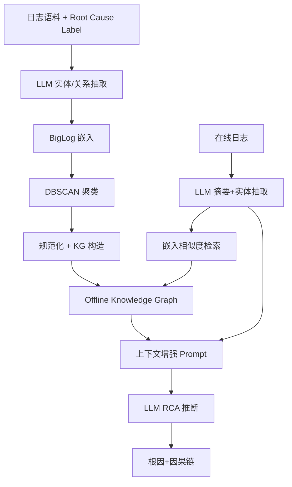
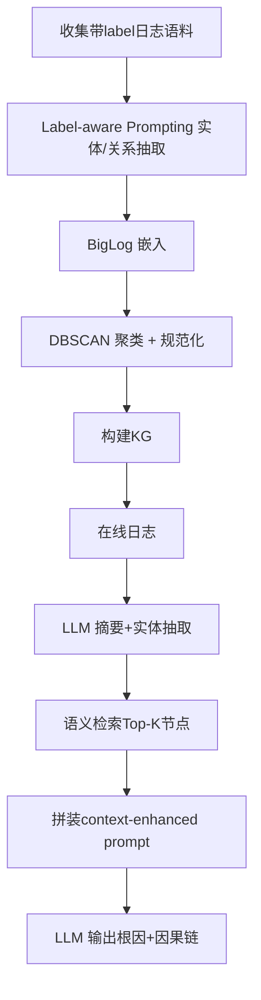

# AetherLog: Log-based Root Cause Analysis by Integrating Large Language Models with Knowledge Graphs (ISSRE 2025)

> 作者：Tianyu Cui, Ruowei Fu, Changchang Liu, Yuhe Ji, Wenwei Gu, Shenglin Zhang, Yongqian Sun, Dan Pei
> 机构：南开大学、海河实验室、清华大学
> 发表年份：2025
> 会议/期刊：2025 IEEE 36th International Symposium on Software Reliability Engineering (ISSRE), São Paulo, Brazil, October 21-24, 2025
> 关联 PDF：同目录下 `Tianyu_AetherLog_to_ISSRE-3.pdf`

## 一、文档信息速览

| 字段 | 值 |
|---|---|
| 标题 | AetherLog: Log-based Root Cause Analysis by Integrating Large Language Models with Knowledge Graphs |
| 作者 | Tianyu Cui, Ruowei Fu, Changcang Liu, Yuhe Ji, Wenwei Gu, Shenglin Zhang, Yongqian Sun, Dan Pei |
| 机构 | 南开大学、海河实验室 HL-IT、清华大学 |
| 发表年份 | 2025 |
| 会议/期刊 | ISSRE 2025 (CCF B) |
| 分类 | 日志根因分析 / LLM / 知识图谱 / AIOps |
| 核心问题 | 用 LLM 与知识图谱协同进行基于日志的根因分析，应对 LLM 幻觉与 KG 不全的双重缺陷 |
| 主要贡献 | 1) 语义实体聚合机制；2) 上下文感知实体召回机制；3) LLM + KG 协同的 AetherLog 框架 |

## 二、背景（Background）

大规模软件系统的故障日益频繁且相互关联，日志是最直接、最细粒度的故障证据。然而日志数量庞大、语义模糊、噪声多，传统 RCA（根因分析）方法难以跟上系统演化的速度。基于规则的方法（Ladra、LogRule）需要人工维护规则，覆盖不全；基于机器学习的方法（Log3C、LogRCA）依赖浅层特征或服务指标，难以泛化；基于知识图谱的方法（LogKG）能给出结构化因果链，但实体抽取依赖固定规则，容易遗漏新模式。LLM 出现后，LogPrompt、LogGPT、LogRAG 等方法带来新希望，但直接调用存在幻觉、缺乏领域知识等问题。

## 三、目的（Purpose / Problems Solved）

- **痛点 1**：LLM 提取的实体存在大量语义冗余（同一概念多种说法），导致 KG 节点重复 → **方案**：在实体表示层做嵌入聚类+规范化去重。
- **痛点 2**：KG 依赖固定规则抽取，可能遗漏关键故障实体或引入无关节点 → **方案**：在线阶段用 LLM 总结日志 + 实体抽取，并通过嵌入相似度召回最相关节点。
- **痛点 3**：纯 LLM 方法缺乏结构化因果推理 → **方案**：用 KG 检索结果构造 context-enhanced prompts，引导 LLM 输出可解释的因果链。
- **痛点 4**：评估缺乏工业级数据集 → 引入 2 个真实工业数据集（阿里、中国移动）共 2,764 故障案例。

## 四、核心原理（Principles）

AetherLog 由离线 KG 构造 + 在线 RCA 推理两条管线组成。离线阶段用 LLM 在弱监督下抽取实体与关系，然后做嵌入聚类与规范化，得到紧凑、语义一致的 KG。在线阶段 LLM 抽取日志摘要与实体，调用嵌入检索找到最相似节点，注入到 context-enhanced prompt 中，输出可解释的根因。

关键概念：
- **Label-Aware Prompting**：把 root cause label 作为弱监督，要求 LLM 提取与该 label 相关的实体与关系。
- **BigLog Embedding**：使用专门在大型日志语料上预训练的 BigLog 编码器，把实体映射到语义空间。
- **Density-Based Clustering**：使用 DBSCAN，$\epsilon=0.5$ 由 k-distance elbow 确定；同一 cluster 内实体选离中心最近的为 canonical。
- **Context-Aware Recall**：把 LLM 抽取的实体作为查询，在 KG 中做近似最近邻检索，召回 Top-K。
- **Context-Enhanced Prompt**：将召回的实体关系拼入 LLM prompt，使模型能依据结构化知识推断根因。

数学公式方面，聚类中心：
$$\hat{e}_j=\arg\min_{e\in c_j}\|v_e-\mu_j\|_2,\quad \mu_j=\frac{1}{|c_j|}\sum_{e\in c_j}v_e$$

与现有技术差异：相对于 LogKG 的规则驱动抽取，AetherLog 通过 LLM+嵌入聚类显著降低 KG 冗余度；相对于 LogPrompt 的纯 LLM 推理，AetherLog 借助 KG 检索给出因果解释。

## 五、算法详解（Algorithm）

1. **输入 / 输出**：输入：原始日志（label）+ 离线日志语料；输出：根因标签 + 因果链解释。
2. **核心模块**：
   - 离线：Label-aware Prompting 实体/关系抽取 → BigLog 嵌入 → DBSCAN 聚类 → 规范化 → KG 构造。
   - 在线：LLM 日志摘要 + 实体抽取 → 嵌入相似度检索 → 上下文增强 Prompt → LLM RCA 推断。
3. **伪代码**：

```python
# 离线 KG 构造
for log, label in corpus:
    triples = llm_extract_with_label(log, label)   # Few-shot + CoT
    for ent in entities(triples):
        v_ent = biglog.embed(ent)
# 聚类规范化
clusters = dbscan(embeddings, eps=0.5, minpts=5)
KG = build_graph([(canonical(c), rel, canonical(c2)) for c in clusters])

# 在线 RCA
summary = llm.summarize(raw_log)
entities = llm.extract_entities(summary)
query_emb = biglog.embed(entities)
hits = KG.semantic_search(query_emb, top_k=5)
prompt = build_context_enhanced_prompt(summary, hits, examples=3)
root_cause = llm.rca(prompt)
```

4. **关键数学**：聚类半径由 k-distance elbow 确定，规范化选最近中心的实体做代表。
5. **复杂度分析**：离线 $O(N\log N)$（DBSCAN），在线检索近似 ANN 复杂度 $O(\log |V|)$。
6. **训练与推理**：使用 GPT-4 类 LLM，无需微调；BigLog 加载预训练权重；KG 一次性构建。
7. **示例**：对一次 nvme timeout 引起的存储子系统故障，AetherLog 能正确回溯到根因"nvme timeout"，并给出完整因果链。

## 六、系统架构图（Architecture）



## 七、流程图（Process Flow）



## 八、关键创新点（Key Innovations）

- **+ 语义实体聚合**：把 LLM 抽取的实体嵌入到 BigLog 空间做 DBSCAN 聚类去冗余。
- **+ 上下文感知实体召回**：在线阶段用嵌入相似度检索最相关的 KG 节点。
- **+ Label-Aware Prompting**：把 root cause label 作为弱监督信号引导抽取。
- **+ LLM + KG 协同范式**：把 LLM 的语义理解与 KG 的结构化推理结合，显著降低幻觉。
- **+ 工业规模评估**：在 2 个真实数据集（2,764 故障）上验证 F1 提升 6%-8%。

## 九、实验与结果（Experiments）

- **数据集**：阿里巴巴内部数据集（2,671 故障）、中国移动数据集（93 故障）。
- **Baseline**：LogKG、LogRule、LogPrompt、LogRAG。
- **主要指标**：F1-score、Precision、Recall。
- **关键结果数字**：AetherLog 在两个数据集上分别取得 F1 0.93 与 0.97，相对最佳基线提升 6% 和 8%。
- **消融实验**：去掉语义聚合、context-aware recall 模块各带来明显 F1 下降。
- **效率分析**：检索阶段主要开销是 LLM 调用，KG 查询近似 ANN。

## 十、应用场景（Use Cases）

- **云服务故障根因分析**：阿里云、AWS 等大规模在线服务的日志 RCA。
- **运营商核心网故障诊断**：中国移动、银行系统的交易链路故障分析。
- **存储子系统故障归因**：分布式存储、Ceph、HDFS 故障定位。
- **微服务异常链路追踪**：结合 trace 的故障语义解析。
- **IT 运维知识库建设**：从历史日志自动构建可解释的故障知识库。

## 十一、相关论文（Related Papers in this set）

- 与 **LogInsight (Shiyu__Accurate...)** 同属 LLM + 日志方向，互补——前者侧重 RCA，后者侧重可解释故障分类。
- 与 **SelfLog (ISSRE2024_paper_129)** 互补——后者聚焦日志解析，前者聚焦根因分析。
- 与 **ChatTS (VLDB_2025_Camera_Ready-1)**、**Medicine (3691620)**、**ResilienceGuardian (1570994962)** 共同组成 LLM for AIOps 技术栈。
- 与 **TimeSeriesBench、PIPCell、RefinedEdge** 互补——后者基于时序/指标，前者基于日志。

## 十二、术语表（Glossary）

- **RCA**：Root Cause Analysis 根因分析。
- **KG**：Knowledge Graph 知识图谱。
- **Label-Aware Prompting**：把根因标签作为弱监督的 prompt。
- **BigLog**：专门在日志上预训练的编码器。
- **DBSCAN**：基于密度的聚类算法。
- **Context-Enhanced Prompt**：结合 KG 检索结果增强的提示。
- **Semantic Entity Aggregation**：语义实体聚合机制。
- **Context-Aware Recall**：上下文感知实体召回机制。

## 十三、参考与延伸阅读

- LogKG：基于知识图谱的日志根因分析。
- LogPrompt / LogGPT：基于 LLM 的日志分析。
- LogRAG：基于检索增强的日志异常检测。
- BERT / LogBERT 系列：日志编码器。
- 项目代码：https://github.com/ISSRE25-Submission-56/AetherLog