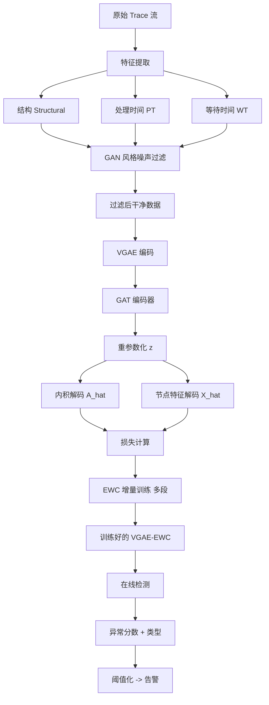
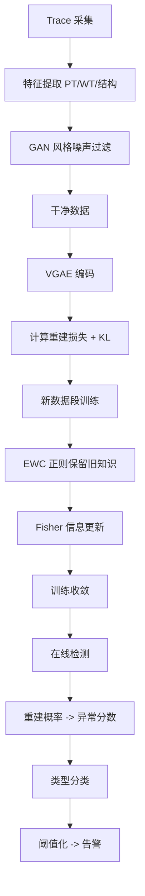

# TraceSieve: Efficient and Robust Trace Anomaly Detection for Large-Scale Microservice Systems（ISSRE 2023）

> 作者：Shenglin Zhang、Zhongjie Pan、Heng Liu、Pengxiang Jin、Yongqian Sun、Qianyu Ouyang、Jiaju Wang、Xueying Jia、Yuzhi Zhang、Hui Yang、Yongqiang Zou、Dan Pei  
> 机构：南开大学；海河实验室；云账户科技（天津）；清华大学  
> 发表年份：2023  
> 会议/期刊：ISSRE 2023（IEEE International Symposium on Software Reliability Engineering）  
> 关联 PDF：同目录下 `TraceSieve_ISSRE23.pdf`

## 一、文档信息速览

| 字段 | 值 |
|---|---|
| 标题 | TraceSieve: Efficient and Robust Trace Anomaly Detection for Large-Scale Microservice Systems |
| 作者 | Shenglin Zhang、Zhongjie Pan、Heng Liu、Pengxiang Jin、Yongqian Sun、Qianyu Ouyang、Jiaju Wang、Xueying Jia、Yuzhi Zhang、Hui Yang、Yongqiang Zou、Dan Pei |
| 机构 | 南开大学；海河实验室；云账户科技；清华大学 |
| 发表年份 | 2023 |
| 会议/期刊 | ISSRE 2023 |
| 分类 | 追踪异常检测 / 微服务 / 无监督 |
| 核心问题 | 大规模微服务系统每日百万级追踪中混杂约 1% 异常；细粒度追踪特征（结构 + 处理时间 + 传输等待）未被充分利用；模型训练耗时长达 8 天 |
| 主要贡献 | (1) 基于 GAN 的噪声过滤预处理模块；(2) VGAE-EWC：把 VGAE 与弹性权重整合 EWC 增量训练结合，降低训练时间；(3) 在两个数据集上 F1 分别 0.970 和 0.925，平均提升 0.235 / 0.119 |

## 二、背景（Background）

微服务架构带来可扩展性、复用性和独立部署的优势，但系统的可靠性问题（如服务宕机、网络拥塞、调用错误）会直接影响用户满意度和商业收益。一次微服务系统故障平均损失 $301K-$400K/小时。追踪（trace）记录了用户请求在微服务之间的调用链与执行细节（起始时间、结束时间、函数名、服务名），是故障诊断的核心数据源。Jaeger、Zipkin、SkyWalking、OpenTracing、ES-APM 等开源工具让追踪采集标准化。

追踪异常检测与根因定位一直受关注，传统方法把追踪转为数值向量再用机器学习：有些用操作频率作为特征，有些把调用路径展开为路径特征。但这些方法大多只关注响应时间与调用结构两类特征，忽略了追踪中的"细粒度信息"——结构（structural）、服务处理时间（service processing time, PT）、传输等待时间（waiting time, WT）——而这三类信息恰恰分别对应"逻辑错误""服务内部错误""网络问题"。

论文把追踪异常检测的痛点总结为两个：
1. **混合数据噪声**：追踪中正常数据占绝大多数，异常占约 1%；但手动标注昂贵、噪声大。论文 Table I 显示基线方法在原始数据上 F1 普遍下降 0.43-0.52。
2. **大规模数据训练耗时**：合作企业每日产生约 300 万条 trace，传统方法训练一周数据需 192+ 小时（8 天），无法实时更新。

论文提出 TraceSieve：(1) 在数据预处理阶段用 GAN 风格的自动编码器过滤噪声；(2) 用 VGAE 编码追踪图结构与节点特征；(3) 用 EWC（Elastic Weight Consolidation）做增量训练，把训练时间从 8 天压缩到小时级。

## 三、目的（Problems Solved）

- **混合正常/异常数据训练难**：GAN 风格的自动编码器在预处理阶段过滤异常 noise，提升后续训练质量。
- **追踪细粒度特征未被利用**：PT、WT、结构三类特征联合建模，区分逻辑错误 / 服务内部错误 / 网络问题。
- **大规模训练耗时**：VGAE-EWC 增量训练，按时间窗分段训练 + EWC 正则保留旧知识。
- **在线检测实时性**：在噪声过滤 + 增量训练后，模型可在线部署。
- **根因定位**：在异常检测基础上给出"是哪种异常"的诊断。

## 四、核心原理（Principles）

**系统总览**：TraceSieve 包含三阶段：(1) 数据预处理（特征提取 + 噪声过滤）；(2) 离线训练（VGAE-EWC）；(3) 在线检测。特征提取计算 PT、WT；噪声过滤用 GAN 风格自动编码器判别器对每条 trace 打"噪声分"；VGAE 在过滤后的数据上学习图嵌入与节点重建；EWC 增量训练分段迭代。

**关键概念**：

- **Trace（追踪）**：用户请求的微服务调用链。
- **Execution（执行）**：trace 中的单个调用单元。
- **Structural Information（结构信息）**：调用路径与依赖。
- **Processing Time (PT)**：服务内部处理时间。
- **Waiting Time (WT)**：调用间等待/网络传输时间。
- **Structural Anomaly**：调用结构异常。
- **PT Anomaly**：服务处理时间异常。
- **WT Anomaly**：网络等待异常。
- **GAN-based Noise Filter**：用自动编码器重建误差作为噪声分数。
- **VGAE（Variational Graph Autoencoder）**：图变分自编码器。
- **EWC（Elastic Weight Consolidation）**：弹性权重整合的增量学习方法。
- **VGAE-EWC**：VGAE + EWC 的增量训练策略。

**数学原理**：

- **PT 与 WT 计算**（论文 Equation 1）：

$$
PT(E) = ST(6) - ET(5)
$$
$$
WT(5) = ET(5) - ST(5)
$$

其中 $ST(i), ET(i)$ 分别是执行 $i$ 的开始/结束时间戳。

- **噪声分数**（基于自动编码器重建误差）：

$$
s_{\text{noise}}(G) = \| G - \text{Dec}(\text{Enc}(G)) \|_2
$$

$s_{\text{noise}}$ 越大越可能是异常。

- **VGAE 重构**：

$$
\hat{A} = \sigma(Z Z^\top), \quad Z = \text{GAT}(\text{Encoder}(A, X))
$$

- **VGAE 损失**（重构 + KL）：

$$
\mathcal{L}_{VGAE} = -\frac{1}{N} \sum_{i,j} A_{ij} \log \hat{A}_{ij} - \frac{1}{N} \sum_{i,j} (1-A_{ij}) \log(1-\hat{A}_{ij}) + D_{KL}(q(Z|A,X) || p(Z))
$$

- **EWC 增量训练损失**（新任务损失 + 旧任务参数约束）：

$$
\mathcal{L}_{EWC} = \mathcal{L}_{\text{new}}(\theta) + \sum_i \lambda \cdot F_i \cdot (\theta_i - \theta_i^*)^2
$$

其中 $F_i$ 是 Fisher 信息矩阵对角元，$\theta_i^*$ 是旧任务参数。

- **异常分数**（重建概率的负对数）：

$$
\text{Score}(G) = - \log p_\theta(A, X | G)
$$

**与现有技术的差异**：与 TraceAnomaly（向量 + VAE）相比，TraceSieve 保留图结构并联合 PT/WT/结构三类特征；与 GTrace（组级 VAE）相比，TraceSieve 增加噪声过滤 + 增量训练；与现有 VGAE 相比，TraceSieve 引入 EWC 应对大规模数据。

## 五、算法详解（Algorithm）

1. **输入 / 输出**：
   - 输入：原始 trace 流。
   - 输出：每条 trace 的异常分数 + 异常类型（结构/PT/WT）。

2. **核心模块**：
   - **特征提取**：从 trace 中抽取 PT、WT、调用结构。
   - **噪声过滤**：用自动编码器在每条 trace 上重建，对重建误差排序，过滤高误差的异常 trace。
   - **VGAE**：把 trace 视为图（节点=执行，边=调用关系），用 GAT 编码器 + 内积解码器重建邻接矩阵和节点特征。
   - **EWC 增量训练**：把训练数据按时间窗分段，每段训练时加上 EWC 正则项保留旧段知识。
   - **在线检测**：新 trace 输入 VGAE 推断异常分数；按阈值告警。

3. **伪代码**：

```python
def preprocess_traces(traces):
    feats = []
    for G in traces:
        pt = compute_pt(G)
        wt = compute_wt(G)
        feats.append((G.adj, pt, wt, G.struct))
    return feats

def noise_filter(features, ae):
    scores = [ae.recon_error(f) for f in features]
    threshold = quantile(scores, 0.99)
    cleaned = [f for f, s in zip(features, scores) if s <= threshold]
    return cleaned, scores

def vgae_train(features, epochs=50):
    model = VGAE(in_dim, hidden_dim)
    for ep in range(epochs):
        A_hat, X_hat = model(features)
        loss = recon_loss(A_hat, features.A) + recon_loss(X_hat, features.X) + kl_loss(model)
        loss.backward()
    return model

def vgae_ewc_incremental(model, segment, fisher, prev_params, lambda_ewc=0.1):
    for ep in range(epochs):
        loss = vgae_loss(model, segment) + lambda_ewc * sum(f * (p - p_prev) ** 2 for f, p, p_prev in zip(fisher, model.params, prev_params))
        loss.backward()
    fisher = update_fisher(model, segment)
    prev_params = model.params.clone()
    return model, fisher, prev_params

def detect(model, G, threshold):
    A_hat, X_hat = model.infer(G)
    score = -recon_log_prob(G.A, A_hat) - recon_log_prob(G.X, X_hat)
    return int(score > threshold), score
```

4. **关键数学**：见 §四。

5. **复杂度分析**：
   - 噪声过滤：$O(N \cdot d)$，$d$ 为特征维度；
   - VGAE 训练：$O(|E| d)$/epoch；
   - EWC 增量训练：每段在 GPU 上分钟级；
   - 在线检测：单条 trace 毫秒级。

6. **训练与推理**：
   - 训练：GAN 自动编码器 + VGAE + EWC；
   - 推理：VGAE 重建概率 → 阈值化 → 异常标签。

7. **示例**：电商订单追踪"Checkout → CheckPrice → ReadDB"；正常时 PT=2.5ms、WT=1ms；异常时 WT 飙到 100ms（网络拥塞）；TraceSieve 在结构/PT/WT 三个维度同时检测，定位到"等待时间异常"。

## 六、系统架构图（Architecture）



## 七、流程图（Process Flow）



## 八、关键创新点（Key Innovations）

- **+ GAN 风格噪声过滤**：在预处理阶段用自动编码器重建误差过滤异常，避免污染训练。
- **+ VGAE-EWC 增量训练**：把训练从一次性大规模数据分解为多段增量，每段加上 EWC 正则保留旧知识。
- **+ PT/WT/结构联合建模**：充分利用追踪的细粒度特征，区分多种异常类型。
- **+ 在线检测实时性**：训练时间从 8 天压缩到小时级，推理毫秒级。
- **+ 真实工业数据集**：在大型电商数据集上 F1 0.970 / 0.925。

## 九、实验与结果（Experiments）

- **数据集**：1 个大型电商微服务系统（合作企业，1 周数据）；1 个公开/合成数据集。
- **Baseline**：MultimodalTrace、AEVB、TraceAnomaly、TraceCRL、Sage 等。
- **主要指标**：F1-score、Precision、Recall、训练时间。
- **关键结果数字**：
  - TraceSieve F1 分别 0.970 与 0.925；
  - 相对 SOTA 平均提升 0.235 与 0.119；
  - 训练时间从 192h 降到小时级（具体数字见论文 Table）；
  - 噪声过滤使 F1 提升约 0.4-0.5。
- **消融实验**：分别去掉噪声过滤、EWC、PT/WT 特征，验证每部分贡献。
- **效率分析**：在线检测毫秒级；训练增量分段可日更。
- **可视化**：trace 异常类型（结构/PT/WT）混淆矩阵。

## 十、应用场景（Use Cases）

- **电商订单追踪异常检测**：识别支付链路的网络延迟。
- **金融支付链路监控**：定位"网络拥塞 vs 服务错误 vs 逻辑错误"。
- **微服务发布后回归**：识别新版本引入的结构异常。
- **SaaS API 网关监控**：检测跨服务调用异常。
- **电信运营商业务监控**：识别业务调用链异常。

## 十一、相关论文（Related Papers in this set）

- `TraceVAE`（追踪异常检测 VAE）
- `GTrace_FSE_Industry2023_upload`（组级追踪异常检测）
- `Chain-of-Event_Interpretable-Root-Cause-Analysis-for-MicroservicesFSE24-Camera-Ready`（事件级根因）
- `AlertRCA_CCGRID2024_CameraReady`（告警级根因）
- `TSC23-DiagFusion`（多模态故障诊断）
- `CMDiagnostor`（调用指标根因）

## 十二、术语表（Glossary）

- **Trace**：用户请求的微服务调用链。
- **Execution**：trace 中的单个调用。
- **Structural Anomaly**：结构异常。
- **PT (Processing Time)**：服务处理时间。
- **WT (Waiting Time)**：等待/传输时间。
- **GAN**：生成对抗网络。
- **AE (Autoencoder)**：自编码器。
- **VGAE**：变分图自编码器。
- **EWC（Elastic Weight Consolidation）**：弹性权重整合增量学习。
- **Fisher Information Matrix**：Fisher 信息矩阵。
- **GAN-based Noise Filter**：用自动编码器实现的噪声过滤。
- **ES-APM**：企业自研的追踪采集工具。

## 十三、参考与延伸阅读

- Paper: VGAE（Kipf & Welling, 2016）——图 VAE。
- Paper: TraceAnomaly（WWW 2020）——追踪异常检测 VAE。
- Paper: GAT（Veličković et al., 2018）——图注意力。
- Paper: EWC（Kirkpatrick et al., PNAS 2017）——增量学习。
- Paper: GAN-based Anomaly Detection。
- 工具：Jaeger、Zipkin、SkyWalking、OpenTracing、ES-APM。
- 相关论文：`TraceVAE`、`GTrace_FSE_Industry2023_upload`、`Chain-of-Event_Interpretable-Root-Cause-Analysis-for-MicroservicesFSE24-Camera-Ready`。
