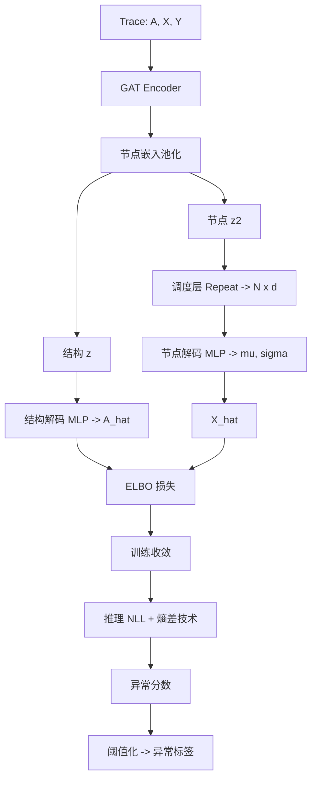
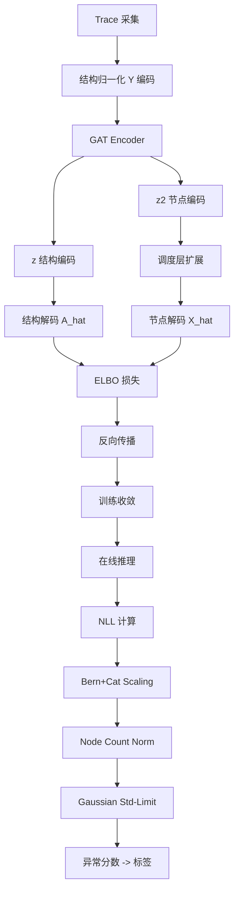

# Unsupervised Anomaly Detection on Microservice Traces through Graph VAE（WWW 2023）

> 作者：Zhe Xie、Haowen Xu、Wenxiao Chen、Wanxue Li、Huai Jiang、Liangfei Su、Hanzhang Wang、Dan Pei  
> 机构：清华大学 & BNRist；eBay  
> 发表年份：2023  
> 会议/期刊：WWW '23（ACM Web Conference 2023，2023 年 4 月 30 日 - 5 月 4 日，美国 Austin）  
> 关联 PDF：同目录下 `TraceVAE.pdf`

## 一、文档信息速览

| 字段 | 值 |
|---|---|
| 标题 | Unsupervised Anomaly Detection on Microservice Traces through Graph VAE |
| 作者 | Zhe Xie、Haowen Xu、Wenxiao Chen、Wanxue Li、Huai Jiang、Liangfei Su、Hanzhang Wang、Dan Pei |
| 机构 | 清华大学 / BNRist；eBay |
| 发表年份 | 2023 |
| 会议/期刊 | WWW '23 |
| 分类 | 追踪异常检测 / 图 VAE / 微服务 |
| 核心问题 | 微服务追踪是树状图结构，传统 VAE 难以同时建模结构与节点耗时；NLL 作为异常分数对低维 OOD 样本出现"反转" |
| 主要贡献 | (1) 提出 TraceVAE 双变量图 VAE（结构 z + 节点 z2）；(2) 设计调度层（dispatching layer）将图级 z2 展开为节点级特征；(3) 发现 NLL 反转现象可分解为 KL+熵项，熵差导致异常分数不可靠；(4) 提出三种技术缓解熵差（Bernoulli & Categorical Scaling、Node Count Normalization、Gaussian Std-Limit）；(5) 在 5 个真实追踪数据集上 F1 显著优于基线 |

## 二、背景（Background）

微服务架构把后端服务拆分为上千个独立部署的小服务，每个用户请求会调用多个微服务 API，产生一条追踪（trace）。追踪记录了树形调用关系以及每个节点（API 调用）的耗时和返回码，是故障诊断的重要数据源。OpenTelemetry 等开源工具让追踪采集标准化，但企业每天产生 TB 级追踪数据，不可能全部人工标注，因此无监督追踪异常检测成为 AIOps 的核心需求。

现有追踪异常检测方法分为两类：基于手工特征（统计、规则）的方法难以应对复杂结构与耗时变化；基于深度学习的方法（TraceAnomaly、CRISP 等）虽然引入 VAE，但通常把追踪向量化为特征向量，丢失了树形结构；少数方法（GNN、Tree-LSTM）尝试学习结构但需要监督训练或额外数据。VGAE（Variational Graph Autoencoder）虽然适合图数据，但通常用全连接层解码邻接矩阵和节点特征，难以泛化到不同节点数。

TraceVAE 针对以上痛点，把追踪视为"图 + 节点特征"，用双变量 VAE 同时编码结构（z）和节点耗时（z2），并提出"调度层"解决节点级特征解码问题。但论文进一步发现：当用负对数似然（NLL）作为异常分数时，部分异常样本的 NLL 反而比正常样本更小，称之为"NLL 反转"。这与 OOD 检测文献中"低维 OOD 输入 NLL 更小"的现象类似，但论文首次在追踪异常检测中给出"分解为 KL + 熵项"的形式解释，并提出三种熵差缓解技术。

## 三、目的（Problems Solved）

- **追踪结构与节点耗时协同建模**：用双变量图 VAE 同时编码结构与节点耗时。
- **解码节点特征泛化性差**：用调度层（dispatching layer）把图级上下文 z2 展开为节点级特征，避免全连接层解码。
- **NLL 反转现象**：揭示"低维 OOD 样本 → 数据熵更小 → NLL 更小"的本质，给出形式化分解。
- **NLL 作为异常分数不可靠**：提出三种实用技术缓解熵差：Bernoulli & Categorical Scaling、Node Count Normalization、Gaussian Std-Limit。
- **无监督追踪异常检测**：5 个真实数据集验证有效性。
- **跨数据集泛化**：在不同微服务、不同规模下均显著优于基线。

## 四、核心原理（Principles）

**系统总览**：TraceVAE 把追踪 $G = (A, X, Y)$ 视为带根节点的树（$A$ 邻接矩阵，$X$ 节点耗时，$Y$ 节点 API ID）。Encoder 用 GAT 提取节点嵌入，再通过两个独立 head 输出 $z$（结构编码）和 $z_2$（节点特征编码）。Decoder 用调度层把 $z_2$ 展开为节点级特征，再与 $z$ 联合重建 $A$、$X$。训练目标为 ELBO；推理时用 NLL 异常分数，结合三种熵差技术。

**关键概念**：

- **Trace（追踪）**：$G = (A, X, Y)$，树状图。
- **Merged Trace**：把相同 API 的节点合并后的"模式化追踪"，用于结构异常检测。
- **VAE（Variational Autoencoder）**：变分自编码器。
- **VGAE（Variational Graph Autoencoder）**：图变分自编码器。
- **GAT（Graph Attention Network）**：图注意力网络。
- **Dispatching Layer（调度层）**：把图级 $z_2$ 通过复制/广播扩展到节点级。
- **NLL Inversion（NLL 反转）**：异常样本 NLL 低于正常样本的现象。
- **Entropy Gap（熵差）**：低维 OOD 样本与高维训练样本之间的数据熵差异。
- **Bernoulli & Categorical Scaling**：对结构特征做置信度缩放。
- **Node Count Normalization**：对节点数做归一化，平衡不同 trace 长度的影响。
- **Gaussian Std-Limit**：限制解码高斯分布的标准差范围。

**数学原理**：

- **ELBO**：

$$
\mathcal{L}_{ELBO} = \mathbb{E}_{q_\phi(z, z_2|A, X)}[\log p_\theta(A, X|z, z_2)] - D_{KL}(q_\phi(z, z_2) || p(z, z_2))
$$

- **NLL 分解**：

$$
\text{NLL}(x) = \underbrace{\text{KL}(q_\phi(z|x) || p(z))}_{KL} + \underbrace{\mathbb{E}_{q_\phi(z|x)}[-\log p(z)]}_{-\log p(z)} + \underbrace{\mathbb{E}_{q_\phi(z|x)}[-\log p(x|z)]}_{reconstruction}
$$

论文证明"重建项 ≈ 数据熵 $H(x)$"，因此低维 OOD 样本数据熵更小 → 重建项更小 → NLL 反而更小。

- **调度层**：

$$
z_{2,\text{node}} = \text{Repeat}(z_2, N) \in \mathbb{R}^{N \times d}
$$

其中 $N$ 是节点数，$d$ 是 $z_2$ 维度。

- **结构解码**：

$$
p(A|z) = \text{Bernoulli}(\sigma(\text{MLP}(z)))
$$

- **节点特征解码**：

$$
p(X_i|z, z_{2,\text{node},i}) = \mathcal{N}(\mu_i, \sigma_i^2)
$$

其中 $(\mu_i, \sigma_i) = \text{Decoder}_X(z, z_{2,\text{node},i})$。

- **异常分数（带三种技术）**：

$$
\text{Score}(G) = \text{NLL}(G) + \lambda_1 S_{\text{Bern}} + \lambda_2 S_{\text{NC}} + \lambda_3 S_{\text{Std}}
$$

其中 $S_{\text{Bern}}$、$S_{\text{NC}}$、$S_{\text{Std}}$ 分别对应三种熵差技术。

**与现有技术的差异**：与 TraceAnomaly / CRISP（向量 + VAE）相比，TraceVAE 显式建模图结构；与 VGAE（邻接矩阵 + 全连接解码）相比，TraceVAE 用调度层提高节点特征泛化；与 NLL-based 异常检测（如 DONUT）相比，TraceVAE 显式处理熵差问题。

## 五、算法详解（Algorithm）

1. **输入 / 输出**：
   - 输入：单条追踪 $G = (A, X, Y)$。
   - 输出：异常分数 / 0-1 标签。

2. **核心模块**：
   - **Encoder**：GAT 提取节点嵌入 → 池化（mean/max）→ 两个 head 输出 $z$、$z_2$。
   - **结构解码**：$z$ → MLP → sigmoid → 邻接矩阵 $A$。
   - **节点解码**：调度层展开 $z_2$ → per-node MLP → $\mu, \sigma$ → 重采样生成 $X$。
   - **训练目标**：ELBO。
   - **熵差技术**：
     - **Bernoulli & Categorical Scaling**：缩放结构解码概率。
     - **Node Count Normalization**：按节点数归一化 NLL。
     - **Gaussian Std-Limit**：限制解码高斯分布的 $\sigma$ 在 $[\sigma_{\min}, \sigma_{\max}]$。
   - **异常分数**：带技术的 NLL。

3. **伪代码**：

```python
def tracevae_encode(G, gat):
    h_nodes = gat(G.A, G.X, G.Y)
    z = head_struct(h_nodes.pool())            # graph-level
    z2 = head_node(h_nodes.pool())            # graph-level
    return z, z2

def dispatching_layer(z2, N):
    return z2.unsqueeze(0).expand(N, -1)       # broadcast to N nodes

def tracevae_decode(z, z2, G):
    A_hat = sigmoid(mlp_A(z))
    z2_node = dispatching_layer(z2, G.N)
    mu, sigma = mlp_X(z, z2_node)              # per-node params
    X_hat = Normal(mu, sigma.clamp(min=sigma_min, max=sigma_max))
    return A_hat, X_hat

def train_tracevae(graphs, epochs=200):
    for ep in range(epochs):
        loss = 0
        for G in graphs:
            z, z2 = tracevae_encode(G, gat)
            A_hat, X_hat = tracevae_decode(z, z2, G)
            kl = kl_divergence(z, z2) - prior
            recon = -bernoulli_logp(G.A, A_hat) - normal_logp(G.X, X_hat)
            loss += recon + beta * kl
        loss.backward()

def anomaly_score(G, model, lambda_nc):
    z, z2 = model.encode(G)
    A_hat, X_hat = model.decode(z, z2)
    nll = -bernoulli_logp(G.A, A_hat) - normal_logp(G.X, X_hat)
    # Bern & Cat scaling
    nll = nll * lambda_bern
    # Node count normalization
    nll = nll / G.N
    # Std-limit applied inside decoder
    return nll
```

4. **关键数学**：见 §四。

5. **复杂度分析**：
   - GAT 编码：$O(|E| d)$；
   - 解码：$O(N d^2)$；
   - ELBO 训练：每个 epoch 对所有 trace 迭代，与训练集规模线性相关；
   - 推理：单条 trace 毫秒级。

6. **训练与推理**：
   - 训练：无监督 ELBO 损失；
   - 推理：NLL + 三种技术 → 阈值化 → 异常标签。

7. **示例**：某订单服务追踪"Checkout → CheckPrice(×2) → ReadDB"；正常时 ReadDB 耗时 2.5ms；异常时 ReadDB 耗时 100ms（耗时异常）或节点数突增 1 个（结构异常）。TraceVAE 用 NLL 衡量偏离程度，结合熵差技术后得到稳定的异常分数。

## 六、系统架构图（Architecture）



## 七、流程图（Process Flow）



## 八、关键创新点（Key Innovations）

- **+ 双变量图 VAE**：结构 z 与节点 z2 独立编码，灵活处理图级与节点级特征。
- **+ 调度层（Dispatching Layer）**：把图级 z2 扩展为节点级特征，避免全连接解码的泛化问题。
- **+ NLL 反转的形式化解释**：分解为 KL + 熵项，揭示低维 OOD 样本数据熵更小导致 NLL 反转。
- **+ 三种熵差缓解技术**：Bernoulli & Categorical Scaling、Node Count Normalization、Gaussian Std-Limit，工程化即插即用。
- **+ 5 个真实工业数据集验证**：在国际电商公司的 5 个追踪数据集上 F1 显著优于基线。

## 九、实验与结果（Experiments）

- **数据集**：5 个追踪数据集，来自一家国际电商公司的不同微服务系统。
- **Baseline**：TraceAnomaly、CRISP、DeepTraLog、GDN、USAD、DONUT 等。
- **主要指标**：F1-score、Precision、Recall。
- **关键结果数字**：
  - TraceVAE 在 5 个数据集上 F1 均显著优于基线；
  - 三种熵差技术各自对 F1 均有贡献；
  - 调度层比"全连接解码"提升泛化性。
- **消融实验**：分别去掉 z、z2、调度层、熵差技术，验证每部分贡献。
- **效率分析**：训练分钟级；推理单条 trace 毫秒级；可在线部署。
- **可视化**：追踪异常案例分析（结构异常、耗时异常）。

## 十、应用场景（Use Cases）

- **微服务系统在线异常检测**：对每条追踪实时判别异常。
- **电商订单系统追踪监控**：识别异常调用链。
- **金融支付链路追踪**：在支付链路上发现异常节点。
- **SaaS API 监控**：API 网关层异常检测。
- **微服务发布后回归**：识别发布后出现的异常调用模式。

## 十一、相关论文（Related Papers in this set）

- `GTrace_FSE_Industry2023_upload`（同类追踪异常检测）
- `TraceSieve_ISSRE23`（追踪异常检测）
- `Chain-of-Event_Interpretable-Root-Cause-Analysis-for-MicroservicesFSE24-Camera-Ready`（事件级根因）
- `AlertRCA_CCGRID2024_CameraReady`（告警级根因）
- `TSC23-DiagFusion`（多模态故障诊断）
- `CMDiagnostor`（调用指标根因）

## 十二、术语表（Glossary）

- **Trace（追踪）**：单次请求的微服务调用树。
- **VAE（Variational Autoencoder）**：变分自编码器。
- **VGAE（Variational Graph Autoencoder）**：图变分自编码器。
- **GAT（Graph Attention Network）**：图注意力网络。
- **Dispatching Layer（调度层）**：把图级特征扩展到节点级。
- **NLL（Negative Log-Likelihood）**：负对数似然。
- **NLL Inversion（NLL 反转）**：异常样本 NLL 低于正常样本的现象。
- **Entropy Gap（熵差）**：不同维度数据之间的熵差异。
- **Bernoulli & Categorical Scaling**：离散分布熵差缩放。
- **Node Count Normalization**：节点数归一化。
- **Gaussian Std-Limit**：高斯分布标准差限制。
- **Merged Trace（合并追踪）**：把相同 API 节点合并后的模式化追踪。

## 十三、参考与延伸阅读

- Paper: TraceAnomaly（WWW 2020）——早期追踪异常检测 VAE。
- Paper: CRISP（KDD 2021）——追踪异常检测对比学习。
- Paper: VGAE（Kipf & Welling, 2016）——图 VAE。
- Paper: GAT（Veličković et al., 2018）——图注意力网络。
- Paper: DONUT（KDD 2022）——VAE 异常检测 NLL 使用。
- Paper: OOD Detection via NLL（ICML 2019）——NLL 反转相关研究。
- 工具：OpenTelemetry、Jaeger、Zipkin。
- 相关论文：`GTrace_FSE_Industry2023_upload`、`TraceSieve_ISSRE23`。
