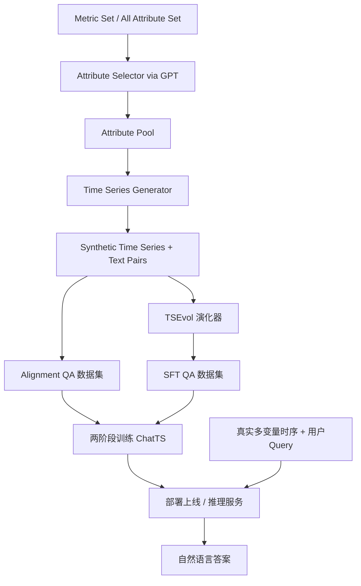
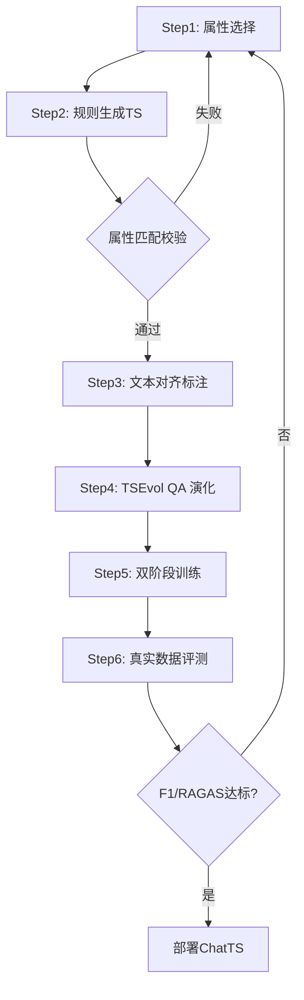

# ChatTS: Aligning Time Series with LLMs via Synthetic Data for Enhanced Understanding and Reasoning (VLDB 2025)

> 作者：Zhe Xie, Zeyan Li, Xiao He, Longlong Xu, Xidao Wen, Tieying Zhang, Jianjun Chen, Rui Shi, Dan Pei
> 机构：清华大学（Tsinghua University）/BNRist、字节跳动（ByteDance）、BizSeer
> 发表年份：2025
> 会议/期刊：Proceedings of the VLDB Endowment (VLDB), Volume 18, 2025
> 关联 PDF：同目录下 `VLDB_2025_Camera_Ready-1.pdf`

## 一、文档信息速览

| 字段 | 值 |
|---|---|
| 标题 | ChatTS: Aligning Time Series with LLMs via Synthetic Data for Enhanced Understanding and Reasoning |
| 作者 | Zhe Xie, Zeyan Li, Xiao He, Longlong Xu, Xidao Wen, Tieying Zhang, Jianjun Chen, Rui Shi, Dan Pei |
| 机构 | Tsinghua University/BNRist、ByteDance、BizSeer |
| 发表年份 | 2025 |
| 会议/期刊 | PVLDB Vol.18 No.8, 2025 |
| 分类 | 多模态大模型 / 时序理解 / 异常对话 / AIOps |
| 核心问题 | 让 LLM 把多变量时序当作原生模态（像图像一样）来处理，并在缺乏真实"时序-文本"配对数据的情况下完成对齐与推理 |
| 主要贡献 | 1) attribute-based 合成时序生成；2) Time Series Evol-Instruct (TSEvol) 生成多样化 QA；3) 上下文感知的 TS-MLLM 架构；4) 全合成数据训练并在真实场景评测 |

## 二、背景（Background）

时序数据广泛存在于电力、医疗、流量、气象、金融以及工业 AIOps 场景。运维人员经常需要基于多变量监控时序回答诸如"成功率是否有异常抖动""哪些指标同步出现了波动""系统发生了什么故障"这类开放性问题。传统时序异常检测模型只能给出"是否有异常"的二值或分数结论，无法解释，且缺乏可对话性。

近年来 MLLM（多模态大模型）在视觉-语言任务上取得突破，但时序模态一直缺失。研究人员尝试用三类方法将 LLM 与时序结合：(1) Text-based：直接把数值塞进 prompt，受 token 长度限制，全局特征理解差；(2) Vision-based：把时序画成图像交给 GPT-4o/Qwen-VL，受图像分辨率和细节解析能力限制；(3) Agent-based：让 LLM 调用 STL 分解、AD/Rocket 等工具，token 消耗大、易产生幻觉。

此外，要让 LLM 真正"理解"时序，必须有大量"时序-文本"对齐数据，而现有公开语料几乎不存在。TimeLLM 等工作仅聚焦于预测任务，并未解决"理解"与"推理"问题。论文指出，工业 AIOps 场景下，多变量时序之间的相关性是诊断故障的关键，因此需要把多变量时序作为一等模态，类比图像让 LLM 能端到端读图。

## 三、目的（Purpose / Problems Solved）

- **痛点 1**：缺乏高质量"语言+时序"对齐数据，导致 TS-MLLM 难以训练 → **方案**：提出基于属性（attribute-based）的合成时序生成方法，使每条样本附带精确的文本属性描述。
- **痛点 2**：现有生成方法只产数值，无法保证模态对齐的精度和属性多样性 → **方案**：构建包含 4 类 Trend、7 类 Seasonality、3 类 Noise、19 类 Local Fluctuation 的属性集合，由 GPT Selector 挑选符合物理含义的子集。
- **痛点 3**：缺乏多样化 QA 训练数据 → **方案**：提出 Time Series Evol-Instruct (TSEvol)，从种子 QA 演化出多样化的复杂度递增的问答对，并加入 Reasoning 与 Situation 两种新增演化类型。
- **痛点 4**：现有方法无法保留多变量时序上下文与数值精度 → **方案**：设计 context-aware TS-MLLM 编码与 value-preserved normalization（双通道：归一化向量+缩放/偏置参数）。
- **痛点 5**：缺乏面向 TS-MLLM 的评测基准 → **方案**：构建 A/B/MCQ2 三套数据集，覆盖对齐与推理两大类共 10 类子任务。

## 四、核心原理（Principles）

ChatTS 由四部分组成：**属性驱动的合成时序生成器**、**TSEvol QA 演化器**、**上下文感知的 TS-MLLM**、**两阶段训练**。整体思路是"先合成、再训、最后用真实数据评估"。模型输入包括多变量时序数组与自然语言查询，输出自然语言答案。

关键概念：
- **Attribute Set**：4 大类（Trend/Periodicity/Noise/Local Fluctuation）共 33 种细粒度属性，按规则拼装可生成无限多样时序。
- **Attribute Selector**：由 GPT 根据真实业务场景选取属性子集，使生成时序具备物理意义。
- **Time Series Patches**：每个时序列切成固定大小 patch，由 5 层 MLP 编码。
- **Context-Aware Encoder**：保持多变量时序在原始输入中的相对位置，将 patch 嵌入到文本 token 之间，保留全局结构。
- **Value-Preserved Normalization**：除 0-1 归一化外，将 scaling 和 offset 参数以文本形式附加到 prompt，使 LLM 可还原数值。
- **TSEvol**：从种子 QA 通过 Trend、Period、Local、Breadth、Depth、Reasoning、Situation 七个方向逐步演化，生成多样化训练语料。
- **Alignment + SFT**：先用大规模对齐数据让模型对齐模态，再用 SFT 让模型学会复杂问答与推理。

数学公式方面，对数值任务定义相对准确率：
$$\text{relative\_accuracy} = \max\left(1.0 - \frac{|V_{\text{answer}} - V_{\text{label}}|}{|V_{\text{label}}|},\, 0.0\right)$$

与现有技术差异：相对于 TimeLLM 只支持预测、Agent-based 链路长易幻觉、Vision-based 细节丢失，ChatTS 把时序列当作原生 token 嵌入 LLM，并配套合成数据流水线。

## 五、算法详解（Algorithm）

1. **输入 / 输出**：输入为多变量时序数组 $T=\{T_1,\dots,T_n\}$ 与自然语言查询 $Q$，输出文本答案 $A$。
2. **核心模块**：
   - Attribute Selector（GPT 筛选物理含义合理的属性子集）
   - Attribute Sampler（按规则为属性分配具体数值）
   - Time Series Generator（基于规则生成严格符合属性的数值序列）
   - TSEvol 演化器（生成多样化 QA）
   - Context-Aware Encoder（patch 编码 + token 级拼接）
   - Value-Preserved Normalization（双通道数值归一化）
3. **伪代码**：

```python
# 1) 属性合成
attrs = GPT_Selector.select(metric_set, all_attribute_set)
sample = AttributeSampler.sample(attrs)
ts = TimeSeriesGenerator.generate(sample)   # 严格匹配属性

# 2) QA 演化
qa_pairs = []
for qa_seed in seed_qas:
    new_qa = TSEvol.evolve(qa_seed, attribute_pool, correlation_pool,
                            types=["Breadth","Depth","Reasoning","Situation"])
    qa_pairs.append(new_qa)

# 3) 上下文编码
patches = mlp_encoder(patchify(ts_arrays))      # 5 层 MLP
text_tokens = text_embedding(tokenize(prompt))
x = insert_patches_at_position(patches, text_tokens)

# 4) 模型推理
answer = qwen25_14b.generate(x)                 # ChatTS 基于 QWen2.5-14B
```

4. **关键数学**：属性归一化采用 0-1 缩放，再以文本 prompt 形式回放 scaling 与 offset，确保 LLM 可还原数值。模型训练目标是标准的 cross-entropy 自回归损失。
5. **复杂度分析**：单 patch 编码 $O(p \cdot d)$，$p$ 为 patch 大小、$d$ 为隐藏维；推理 token 量比 text-based 方法少 5× 以上。
6. **训练与推理**：两阶段——Alignment（UTS 35k + MTS-Shape 35k + MTS-Local 35k），SFT（TSEvol 24,270 + IF 5,050）。基模型为 QWen2.5-14B-Instruct，使用 DeepSpeed + LLaMA-Factory 全参微调，8×A800 GPU。
7. **示例**：对一张包含 HTTP 请求/成功率/磁盘 I/O 的多变量时序，ChatTS 能正确回答"哪些指标同步波动""系统可能出现了 I/O 过载"，相比 GPT-4o 在多变量对齐任务上 F1 提升 46.0%，推理任务提升 25.8%。

## 六、系统架构图（Architecture）



## 七、流程图（Process Flow）



## 八、关键创新点（Key Innovations）

- **+ 属性驱动的合成时序生成**：将数值与属性文本精确对齐，使合成数据具备"可对齐、可解释"双重特性。
- **+ Time Series Evol-Instruct (TSEvol)**：首个面向时序的多模态 Evol-Instruct 算法，将 Breadth/Depth/Reasoning/Situation 四类进化操作结合到属性池中，生成多样化训练 QA。
- **+ Context-Aware TS-MLLM 编码**：在 token 级别把多变量时序嵌入文本位置，保留序列相对结构，避免 TimeLLM 类方法的扁平化损失。
- **+ Value-Preserved 双通道归一化**：用 0-1 缩放 + 文本描述 scaling/offset，让 LLM 仍可执行数值任务。
- **+ 三套真实-合成混合评测**：构建 Dataset A/B/MCQ2，涵盖 6 类对齐与 4 类推理子任务，为后续 TS-MLLM 评估奠定基础。

## 九、实验与结果（Experiments）

- **数据集**：Dataset A (525 题，AIOps/Weather/NAB/Oracle)、Dataset B (1,616 题)、MCQ2 (100 题)；训练用合成数据约 17 万样本。
- **Baseline**：Text-based（GPT-4o、GPT-4-Turbo、QWen2.5-14B）、Vision-based（GPT-4o/GPT-4o-mini 渲染图像）、Agent-based（ReAct + STL/AD/Rocket 工具）。
- **主要指标**：F1（分类任务）、相对准确率（数值任务）、RAGAS（Q&A 任务）、accuracy（T/F/MC）。
- **关键结果数字**：
  - 对齐任务平均：ChatTS 在 Dataset A 上 categorical/numerical 分别比 GPT-4o 提升 46.0% 和 80.7%；Dataset B 上提升 75.9% 与 112.7%。
  - 推理任务平均 0.667，远超 GPT-4o (0.530) 与 GPT-4-Turbo (0.499)；MCQ2 任务达到 0.600，领先基线 0.470。
  - 多变量任务上 text-based 几乎无法回答，ChatTS 多变量相关性任务 F1 达 0.905。
  - Token 成本仅 0.08M-0.34M，是 GPT-4o 文本基线 1.3M-4.5M 的约 1/15。
- **消融实验**：w/o Attribute-Based、w/o TSEvol、w/o TS Modality 均显著下降；多变量任务上 text-only 几乎完全失效；不同尺寸 QWen2.5（7B/14B/32B）即便全 SFT 也无法超越 ChatTS-14B。
- **效率分析**：每 1.3M token GPT-4o 需 $3.25，ChatTS 仅 $0.02。

## 十、应用场景（Use Cases）

- **AIOps 故障诊断对话**：SRE 通过自然语言询问多指标异常原因。
- **智能运维助手**：嵌入企业告警平台，提供"指标解释+修复建议"对话能力。
- **工业监控分析**：电力、制造场景下基于多传感器时序的异常解读与原因推断。
- **金融监控**：分析师与系统对话询问交易量、波动率、价格相关性。
- **气象与交通预测解读**：将数值预报转换为可解释的自然语言报告。

## 十一、相关论文（Related Papers in this set）

- 与 **RefinedEdge (Jiacheng__RefinedEdge_to_TKDE)** 互补——后者关注边缘端轻量化时序异常检测，前者关注多模态对话。
- 与 **TimeSeriesBench (2402.10802v3)** 同属时序异常检测场景，但 ChatTS 强调 LLM 对齐与推理。
- 与 **AetherLog (Tianyu_AetherLog_to_ISSRE-3)**、**LogInsight (Shiyu)** 都使用 LLM 做运维对话/解释。

## 十二、术语表（Glossary）

- **TS-MLLM**：Time-Series Multimodal Large Language Model，把时序列当作原生模态输入的多模态大模型。
- **Attribute**：时序的可量化文本属性（如趋势、周期、噪声、局部波动）。
- **TSEvol**：Time Series Evol-Instruct，本文提出的时序 QA 演化算法。
- **Context-Aware Encoder**：把时序 patch 按原始文本位置嵌入的编码器。
- **Value-Preserved Normalization**：在 0-1 归一化基础上，将 scaling/offset 以文本形式告知 LLM 的双通道方案。
- **Alignment Task / Reasoning Task**：分类-数值对齐任务与归纳-演绎-因果-对比推理任务。
- **RAGAS**：基于关键词匹配的 LLM 评估指标，用于评估归纳推理 QA。
- **MCQ2**：第三方对比推理基准。

## 十三、参考与延伸阅读

- TimeLLM：Time-Series Forecasting with LLMs。
- GPT-4o / QWen-VL 视觉 MLLM 与对照实验。
- Self-Instruct / Evol-Instruct 系列方法。
- QWen2.5-14B-Instruct 基座模型：https://huggingface.co/Qwen/QWen2.5-14B-Instruct
- 项目主页：https://github.com/NetManAIOps/ChatTS