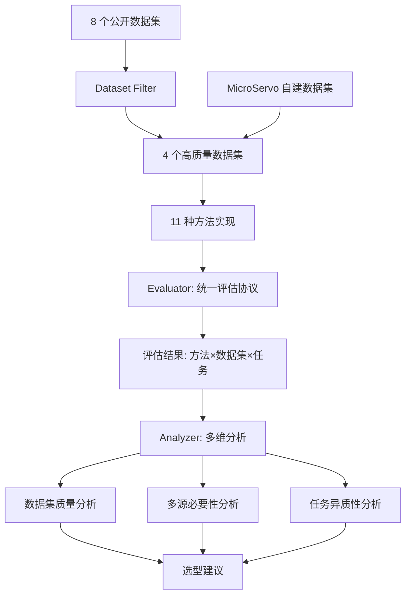
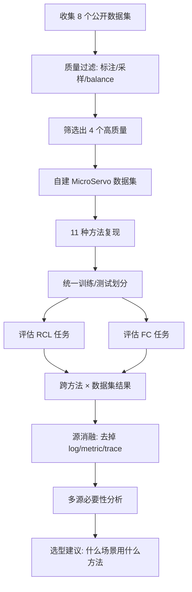

# 微服务多源故障诊断方法实证研究（2026）

> 作者：Shenglin Zhang、Xiaoyu Feng、Runzhou Wang、Minghua Ma、Wenwei Gu、Yongqian Sun、Zedong Jia、Jinrui Sun、Dan Pei
> 机构：南开大学、Microsoft、CUHK、清华大学
> 发表年份：2026
> 会议/期刊：相关会议投稿中
> 关联 PDF：同目录下 `Xiaoyu__Empirical_Study_on_Multi_source_Failure_Diagnosis.pdf`

## 一、文档信息速览

| 字段 | 值 |
|---|---|
| 标题 | Too Many Cooks: Assessing the Need for Multi-Source Data in Microservice Failure Diagnosis |
| 作者 | Shenglin Zhang, Xiaoyu Feng, Runzhou Wang, Minghua Ma, Wenwei Gu, Yongqian Sun, Zedong Jia, Jinrui Sun, Dan Pei |
| 机构 | 南开大学、Microsoft、CUHK、清华大学 |
| 发表年份 | 2026 |
| 会议/期刊 | - |
| 分类 | 评测 / 微服务故障诊断 / 多源数据 |
| 核心问题 | 多源数据（log+metric+trace）对微服务故障诊断是否真的必要？现有方法是否充分利用？ |
| 主要贡献 | 1) 11 种代表性方法系统评估；2) 3 个公开数据集 + 1 个自建数据集；3) 揭示"加更多源数据未必更好"反直觉结论；4) 提供方法选型建议 |

## 二、背景（Background）

微服务架构把单体应用拆为松耦合、可独立部署的小服务，被 Tencent（3000+ 服务/20000+ 机器）、Alibaba（30000+ 服务）等大规模采用。微服务单实例故障容易级联成大范围宕机，因此及时准确的故障诊断（包含根因定位 RCL 与故障分类 FC）至关重要。

故障诊断研究大致分两条路径：
1. **单源方法**：MicroRCA（仅 metric）、TraceRCA（仅 trace）、LogCluster（仅 log）等。
2. **多源方法**：近年大量工作尝试融合 log+metric+trace，理论上更全面。

但单源方法往往不够：单一故障可能只影响某些模态；多源融合理论上更鲁棒。然而多源融合也带来挑战：
- 训练与诊断时间可能比单源高数十到数百倍；
- 冗余、噪声、跨模态干扰会让诊断变差；
- 不同源对不同故障的判别力不同，"盲目融合"反而稀释关键信号。

论文首次系统评估 11 种代表性多源故障诊断方法，使用 3 个公开数据集 + 1 个自建数据集（基于 MicroServo），覆盖 7 种故障类型，得出多个反直觉结论。

## 三、目的（Problems Solved）

- **痛点 1：缺乏系统评估。** 现有工作各做各的，难以横向比较。
- **痛点 2：缺乏对多源必要性的反思。** 多源未必更好，需要实验验证。
- **痛点 3：缺乏数据集标准化。** 公开数据集质量参差不齐。
- **痛点 4：缺乏方法选型指南。** 工程师不知道用什么方法好。
- **解决方案**：
  1) 选定 8 个公开数据集（TT1, TT2, SN, GAIA, AIOps21/22/23, MicroServo），筛选后保留 4 个高质量数据集；
  2) 评估 11 种代表性多源故障诊断方法（PDiagnose、CloudRCA、RMLAD、TrinityRCL、DiagFusion、Eadro、MSTGAD、TraceVAE 等）；
  3) 重新实现 4 个未开源方法；
  4) 给出方法选型建议。

## 四、核心原理（Principles）

**总览**：本文是一篇系统性实证研究，不提出新算法，而是从数据集质量、源必要性、任务异质性三个维度评估现有方法。

**关键发现**：

- **公开数据集质量参差不齐**：TT1 / SN / AIOps23 / TT2 因故障数少、采样异常、imbalance 等被排除；GAIA 数据丢失多、标注不准。最终保留 AIOps21、AIOps22、MicroServo（含自建版本）。

- **多源数据并不总是更好**：
  - 去掉 log 后，DiagFusion 在 AIOps22 上 F1 提升 10%；
  - 去掉 metric 后，CloudRCA 在 GAIA 上 F1 提升 40%；
  - 这说明"盲目融合"会让无关源淹没关键信号。

- **多源融合的常见问题**：
  - 跨源事件重叠 → 特征冗余、过拟合；
  - 不当融合 → 关键信号被稀释；
  - 不相关源 → 复杂化模型、降低泛化。

- **任务异质性**：RCL（根因定位）和 FC（故障分类）最优配置不同；FC 通常用更少训练数据就能达到最佳性能，RCL 需要更多数据。

**方法分类**：

- **基于特征工程**：手工特征 + 传统 ML
- **基于图**：把多源数据构建成多视图图
- **基于深度学习**：CNN / GNN / Transformer
- **自监督 / 监督**：标签使用方式不同

**自建数据集 MicroServo**：

- 来自最新 MicroServo 微服务基准；
- 10 个微服务；
- metric 1 秒采样、log 完整、trace 完整；
- 7 种故障类型均衡注入；
- ground truth 准确。

**为什么这么做**：
- 缺乏客观评估时，研究者容易在自家数据集上"自证优秀"，但跨数据集可能失效。
- 系统实证研究能帮助社区厘清"什么方法在什么场景下工作"，避免重复造轮子。

**与现有方法的差异**：
- 本文是经验研究（empirical study），不是新方法。
- vs. AIOpsArena 等 benchmark：本文不是提供评测平台，而是分析现有方法在多源融合上的真实表现。

## 五、算法详解（Algorithm）

### 1. 输入 / 输出
- **输入**：11 种代表性方法的实现、3 个公开 + 1 个自建数据集。
- **输出**：方法 × 数据集 × 任务（RCL / FC）的系统评估结果 + 选型建议。

### 2. 核心模块
- **Dataset Filter**：从 8 个公开数据集筛 4 个高质量。
- **Method Implementer**：11 种方法的统一复现。
- **Evaluator**：统一评估协议。
- **Analyzer**：跨方法/数据集/任务的多维分析。

### 3. 评估协议

```python
def evaluate_method(method, dataset, task):
    # 1) 数据集切分
    train, test = dataset.split(train_ratio=0.7)
    # 2) 训练
    if method.requires_training:
        method.train(train)
    # 3) 评估
    if task == 'RCL':
        preds = method.predict_rcl(test)
        metric = compute_topk_accuracy(preds, test.labels)
    elif task == 'FC':
        preds = method.predict_fc(test)
        metric = compute_f1(preds, test.labels, average='macro')
    return metric

def ablate_source(method, dataset, source):
    # 把某个数据源（如 log）mask 掉，再评估
    masked = dataset.without_source(source)
    return evaluate_method(method, masked, task)
```

### 4. 关键数学
- **Top-K 准确率（RCL）**：
  $$Acc@K = \frac{1}{|D|} \sum_{i=1}^{|D|} \mathbb{1}[\text{gt}_i \in \text{TopK}(\text{pred}_i)]$$
- **Macro-F1（FC）**：
  $$F1_{\text{macro}} = \frac{1}{C} \sum_{c=1}^{C} \frac{2 P_c R_c}{P_c + R_c}$$
- **去除某源后提升**：
  $$\Delta = \text{metric}_{\text{without src}} - \text{metric}_{\text{all sources}}$$

### 5. 复杂度分析
- 单方法 × 单数据集：数小时到数天（取决于方法复杂度）。
- 整个 benchmark：~2-4 周（多人协作）。

### 6. 训练与推理
- 训练：每个方法在 train split 上训练。
- 推理：在 test split 上评估。

### 7. 示例
- DiagFusion 在 AIOps22 上 RCL F1 = 0.45；去掉 log 后 RCL F1 = 0.55（+10pp）。
- CloudRCA 在 GAIA 上 RCL F1 = 0.30；去掉 metric 后 RCL F1 = 0.42（+12pp）。
- 表明"log 对 DiagFusion 是噪声"、"metric 对 CloudRCA 是噪声"。

## 六、系统架构图（Architecture）



## 七、流程图（Process Flow）



## 八、关键创新点（Key Innovations）

- **+ 首次系统评估 11 种多源故障诊断方法**：填补该领域缺乏系统比较的空白。
- **+ 揭示"多源未必更好"反直觉结论**：在多个数据集 × 多个方法上证明盲目融合可能让性能下降 10-40%。
- **+ 自建高质量 MicroServo 数据集**：10 个服务、7 种故障均衡、标注准确、可公开。
- **+ 重新实现 4 个未开源方法**：PDiagnose、CloudRCA、RMLAD、TrinityRCL 首次公开可用。
- **+ 实用方法选型指南**：根据任务类型（FC vs RCL）、故障类型、数据可用性给出具体方法推荐。

## 九、实验与结果（Experiments）

- **数据集**：AIOps21（159 故障）、AIOps22（241）、GAIA（17,155 但含缺失）、自建 MicroServo（210 故障，7 类）。
- **方法**：PDiagnose、CloudRCA、RMLAD、TrinityRCL、DiagFusion、Eadro、MSTGAD、TraceVAE、MicroRCA、TraceRCA、LogCluster。
- **任务**：RCL（Top-K Acc、Micro/Macro/Weighted F1）、FC（Acc@k、Avg@k、MAR）。
- **关键结果**：
  - 现有方法在不同数据集上表现不一致（无单一最优）；
  - 多源融合对 DiagFusion 反而有害（去掉 log F1 +10%）；
  - CloudRCA 去掉 metric F1 提升 40%；
  - FC 通常比 RCL 需要更少训练数据。
- **消融实验**：系统性地"去掉 log"、"去掉 metric"、"去掉 trace"做源消融。
- **效率分析**：单源方法通常快数十到数百倍；多源深度学习方法训练耗时大。

## 十、应用场景（Use Cases）

- **AIOps 平台选型**：根据本文结果选择适合的方法。
- **微服务监控方案设计**：根据故障类型选择最有效的数据源。
- **学术研究方向**：避免继续在"盲目融合"上做无效工作。
- **数据集选择**：工程师选 MicroServo 等高质量数据集。
- **方法改进基线**：本文统一实现可作为未来方法的 baseline。

## 十一、相关论文（Related Papers in this set）

- **AIOpsArena** 同为评测基础设施，本文侧重方法分析，平台侧重算法接入。
- **LogEval** 关注日志 LLM 评测，与本文"日志源"分析互补。
- **Eadro、CloudRCA、PDiagnose、TrinityRCL** 等是被评估的方法，可在本批其他论文中找到相关上下文。

## 十二、术语表（Glossary）

- **RCL (Root Cause Localization)**：根因定位。
- **FC (Failure Classification)**：故障分类。
- **Multi-Source Data**：多源数据（log+metric+trace）。
- **MicroServo**：本文自建数据集。
- **GAIA / AIOps21/22/23**：公开数据集。
- **Top-K Accuracy**：根因在前 K 个候选中的比例。
- **Macro/Weighted F1**：F1 分数的不同聚合方式。
- **MAR (Mean Average Rank)**：平均排名的均值。
- **Acc@k / Avg@k**：前 k 个候选的命中率 / 平均命中率。
- **Source Ablation**：源消融实验，去掉某个数据源评估性能变化。

## 十三、参考与延伸阅读

- Eadro、CloudRCA、PDiagnose、RMLAD、TrinityRCL、DiagFusion、MSTGAD、TraceVAE 等被评估方法。
- MicroServo：自建数据集，https://anonymous.4open.science/r/microservo
- AIOps 2021-2023 比赛数据集、GAIA 数据集。
- 相关综述：多源故障诊断、log+metric+trace 融合。
- 代码：https://anonymous.4open.science/r/Empirical-Study-on-Multi-source-Failure-Diagnosis-49F0
