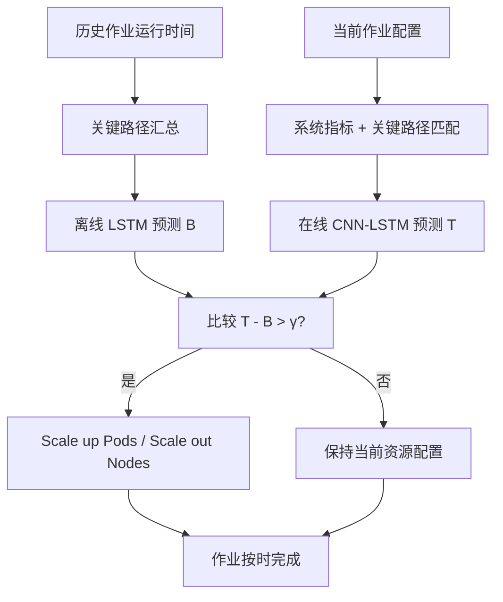
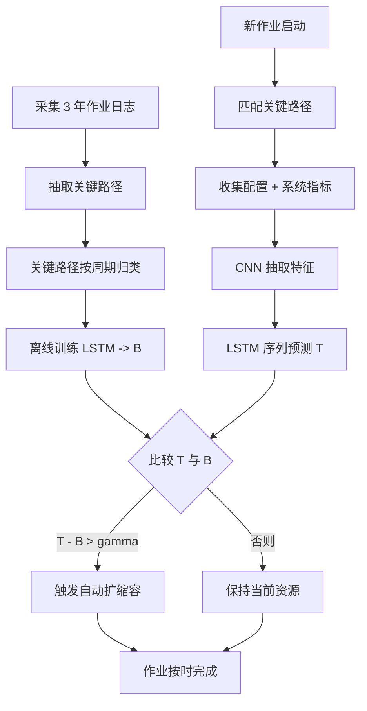

# Batman: Batch Job Run Time Prediction for Auto-Scaling in the Cloud（AAAI 2020 Poster）

> 作者：Minghua Ma、Christopher Zheng、Junjie Chen、Yilin Li、Xiao Peng、Gang Wang、Yong Wu、Fang Zhou、Wenchi Zhang、Kaixin Sui、Dan Pei  
> 机构：清华大学；McGill University；天津大学；中国光大银行；BizSeer；北京国家信息科学与技术研究中心（BNRist）  
> 发表年份：2020  
> 会议/期刊：AAAI 2020（Association for the Advancement of Artificial Intelligence）  
> 关联 PDF：同目录下 `aaai20_Poster.pdf`

## 一、文档信息速览

| 字段 | 值 |
|---|---|
| 标题 | Batch Job Run Time Prediction for Auto-Scaling in the Cloud（Batman 框架） |
| 作者 | Minghua Ma、Christopher Zheng、Junjie Chen、Yilin Li、Xiao Peng、Gang Wang、Yong Wu、Fang Zhou、Wenchi Zhang、Kaixin Sui、Dan Pei |
| 机构 | 清华大学；McGill University；天津大学；中国光大银行；BizSeer；BNRist |
| 发表年份 | 2020 |
| 会议/期刊 | AAAI 2020 Poster |
| 分类 | 云计算 / 批处理作业 / 运行时间预测 / 资源自动伸缩 |
| 核心问题 | 银行私有云中数千个批处理作业运行时间受工作负载与日期影响且人工伸缩低效；固定截止时间驱动调度不可行 |
| 主要贡献 | (1) 基于三年银行日志的运行时间特征刻画；(2) 关键路径（critical path）汇总每日任务依赖；(3) CNN+LSTM 离线+在线预测模型；(4) 触发式自动扩缩容策略 |

## 二、背景（Background）

随着云计算的快速发展，金融、互联网等行业越来越多地把批处理作业（batch job）部署到云端。批处理作业的特点是"长跑且周期性"：例如大数分析、ETL 任务通常每天或数小时执行一次，运行时长从分钟到数小时不等。为了提升资源利用率，企业普遍采用批处理作业 + 在线服务共置（co-location）模式，让两类负载共享计算资源。

这种模式带来新的挑战：批处理作业运行时间受多种因素影响，包括（1）批处理作业自身的工作负载；（2）作业内任务的复杂依赖关系与编排变化；（3）在线服务优先级抢占 CPU/内存；（4）日期/节假日带来的流量波动。在中国某顶级银行 IT 系统的私有云中，每天有数千个批处理作业并行运行；只要任一作业超出运维人员的"运行时长心理阈值（run time borderline）"，就需要人工加资源、缩范围、重跑剩余部分。这种人工操作既费时又易出错，无法应对上万级作业规模。

此前业界研究多采用"运行时间截止（deadline）驱动"的调度策略，由操作员为每个作业指定 deadline，并据此预分配资源。然而在大型云平台上，每个作业都需要单独的 deadline 与资源规划，并不现实。本文的目标是为每一个批处理作业自动学习"运行时长边界 B"，并在线预测 T，若 T > B 则触发自动扩缩容。

## 三、目的（Problems Solved）

- **离线 borderline 难以学习**：单个作业运行时间随工作负载、日期、依赖关系动态变化，固定 deadline 失效。
- **在线预测难以及时准确**：批处理与在线服务共置时，在线服务会抢占资源，造成作业运行时长抖动。
- **人工扩缩容效率低**：成千上万作业每出现一个 borderline 越界就需要人为干预，运维成本极高。
- **任务级依赖复杂**：一个批处理作业由若干任务组成，任务之间存在依赖、并行、周期性执行，关系复杂。
- **资源最小化与按时完成矛盾**：扩缩容策略需在"最少资源"与"按时完成"之间取得平衡。
- **缺乏大规模真实数据验证**：需要一个能在中国大型银行私有云真实日志上验证的端到端框架。

## 四、核心原理（Principles）

**系统总览**：Batman 框架由"主节点 + 工作节点"构成。一个 Node 是一台机器或虚拟机；一个 Pod 是由一个或多个紧耦合容器组成的最小部署单位。批处理作业运行在工作节点的 Pod 中。框架分两条路径：（1）离线预测——基于历史运行时间与关键路径，预测运行时间边界 B；（2）在线预测——在作业运行中按周期匹配关键路径并读取系统指标，预测完成时间 T；若 T−B > γ，则触发扩缩容。

**关键概念**：

- **Batch Job（批处理作业）**：周期性执行的长时任务（如每日 ETL、报表）。
- **Pod / Node**：Kubernetes 风格的部署单元。
- **Critical Path（关键路径）**：一个作业中所有任务依赖关系中累计耗时最长的链路，决定作业整体运行时长。
- **Run Time Borderline B**：作业运行时间边界，离线预测的目标。
- **Online Run Time T**：作业在跑中预测的总完成时间。
- **Coefficient of Variation (CoV)**：标准差 / 均值，用于衡量数据集波动性。
- **LSTM (Long Short-Term Memory)**：长短期记忆网络。
- **CNN (Convolutional Neural Network)**：卷积神经网络。
- **Master Node / Worker Nodes**：Batman 框架的主从节点。

**数学原理**：

- **关键路径的累计时长**：

$$
B \approx \sum_{t \in \text{critical path}} \text{duration}(t)
$$

- **触发自动扩缩容条件**：

$$
\text{Scale up if} \quad T - B > \gamma
$$

- **在线预测的输入特征**：当前作业配置（节点数、Pod 数）+ 系统指标（CPU、内存、网络）+ 关键路径上每个任务的运行时长 + 日期/周/月/节假日信息。

- **CNN-LSTM 联合模型**：CNN 用于在常数时间内抽取输入特征；LSTM 用于序列预测（在线运行时间）。

- **离线预测损失**（MSE 形式）：

$$
\mathcal{L} = \frac{1}{N} \sum_{i=1}^{N} (\log B_i^{\text{pred}} - \log B_i^{\text{true}})^2
$$

- **CoV 分布**：CoV = σ / μ，用于对数据集按波动性排序，验证预测模型在不同难度数据集上的表现。

**与现有技术的差异**：与 Jockey 等 deadline-driven 调度相比，Batman 不依赖人工指定 deadline，而是学习 borderline；与基于简单统计的预测相比，CNN+LSTM 联合模型可捕获非线性特征与序列依赖；与 ensemble 机器学习模型相比，Batman 的输入包含细粒度任务级时间与系统指标。

## 五、算法详解（Algorithm）

1. **输入 / 输出**：
   - 输入：3 年银行批处理作业历史运行时间、当前作业配置、系统指标、关键路径信息。
   - 输出：离线 borderline B、在线预测完成时间 T、是否触发扩缩容。

2. **核心模块**：
   - **Critical Path Summary**：从历史任务依赖图中抽取关键路径，并按周期归类（按天、周、月、节假日）。
   - **Offline Predictor**：基于历史关键路径 + 运行时长，使用 LSTM 预测 B。
   - **Online Predictor**：基于当前作业配置、系统指标、关键路径任务实时运行时长，使用 CNN+LSTM 在线预测 T。
   - **Auto-Scaling Module**：比较 T 与 B，若 T−B > γ 则触发 scale up（增加 Pod）或 scale out（增加 Node）。

3. **伪代码**：

```python
def critical_path_summary(task_graph, periods):
    cp = longest_path(task_graph)
    return bucket_by_period(cp, periods)

def offline_predict(history, cp_summary):
    features = encode_history_with_cp(history, cp_summary)
    return lstm_model.predict(features)

def online_predict(config, sys_metrics, cp_runtime):
    seq = build_sequence(config, sys_metrics, cp_runtime)
    feat = cnn_layers(seq)
    return lstm_model.step(feat)

def auto_scaling(B, T, gamma):
    if T - B > gamma:
        scale_up_pods_or_nodes()
    return T, B

# 离线训练
for epoch in range(epochs):
    for job_history in dataset:
        cp = critical_path_summary(job_history.tasks, periods)
        B_pred = offline_predict(job_history, cp)
        loss += (log(B_pred) - log(job_history.actual)) ** 2
    lstm_model.update(loss / len(dataset))
```

4. **关键数学**：见 §四。

5. **复杂度分析**：
   - 关键路径抽取：$O(|V| + |E|)$，$V/E$ 为任务节点/边；
   - LSTM 训练：$O(N \cdot d)$，$d$ 为隐藏状态维度；
   - 在线推理：单次毫秒级。

6. **训练与推理**：
   - 训练：CNN+LSTM 在三年银行作业日志上离线训练；
   - 推理：在线按周期匹配关键路径并调用 CNN+LSTM 推理。

7. **示例**：某银行每日 23:00 启动"账户结算作业"，包含 CheckData → Aggregate → Report 三个任务，CheckData 与 Aggregate 构成关键路径。LSTM 学习到 borderline B = 45min；运行中 CNN+LSTM 预测 T = 52min，T−B = 7min > γ，则触发扩容 2 个 Pod，缩短到 46min 跑完，避免超时。

## 六、系统架构图（Architecture）



## 七、流程图（Process Flow）



## 八、关键创新点（Key Innovations）

- **+ 基于关键路径的运行时长建模**：将作业拆解为关键路径，按周期归类后再用 LSTM 预测 borderline。
- **+ CNN+LSTM 联合在线预测**：用 CNN 抽取配置/指标特征，用 LSTM 做序列预测，兼顾非线性与时序依赖。
- **+ 离线 borderline + 在线 trigger 双轨设计**：在保留离线稳定性的同时支持在线实时响应。
- **+ 真实大规模数据集验证**：在中国某顶级银行 3 年私有云日志上训练与评估。
- **+ 自动扩缩容闭环**：T−B > γ 时主动扩 Pod 或 Node，资源最小化与按时完成并重。

## 九、实验与结果（Experiments）

- **数据集**：8 组（标记为 A-H）按 CoV 0.07、0.13、0.29、0.44、0.81、0.98、1.43、3.93 排序，覆盖从稳定到剧烈波动。
- **Baseline**：Kernel Regression (KR)、Kernel Ridge Regression (KRR)、Epsilon-SVR、Linear Regression (LR)、Ensemble (KRR+SVR+LR)。
- **主要指标**：平均 MSE（log 空间）。
- **关键结果数字**：
  - 在所有 8 个数据集上，Batman 的 MSE 均低于 5 种基线（Fig. 2）；
  - 离线预测 1 小时 horizon 时，Batman 误差稳定在最低水平；
  - CoV 越大预测越难，但 Batman 仍能给出最低 MSE。
- **消融实验**：未给出详细消融；论文以"MSE on 8 datasets"形式证明优势。
- **效率分析**：在线预测每条作业毫秒级；离线训练 LSTM 数小时（具体未在海报中披露）。
- **可视化**：Fig. 2 给出 8 个数据集上不同算法的 MSE 柱状图。

## 十、应用场景（Use Cases）

- **金融银行批处理**：每日账户结算、报表生成、风险对账。
- **大数据 ETL**：周期性数据搬运、清洗、聚合。
- **运营商夜间作业**：用户账单、话单汇总。
- **互联网公司夜间离线计算**：日志聚合、用户画像更新、推荐模型训练。
- **政府/企业数据上报**：定时数据导出、跨系统同步。

## 十一、相关论文（Related Papers in this set）

- `bujiahao`（KPI 异常检测 ADS）
- `CoFlux_camera-ready1`（KPI 波动相关性）
- `camera_ready`（多维根因 Squeeze）
- `icccn2017-pch`（WiFi 干扰量化）
- `ICCCN2020-YaoWang`（KPI 异常检测 iRRCF-Active）
- `ICSE-SEET-36`（持续评估与反馈）

## 十二、术语表（Glossary）

- **Batch Job**：周期性执行的批处理作业。
- **Run Time Borderline (B)**：运行时长边界。
- **Online Run Time (T)**：在线预测完成时间。
- **Critical Path**：关键路径，最长累计任务链路。
- **CoV (Coefficient of Variation)**：波动系数 σ/μ。
- **Pod / Node**：Kubernetes 部署单位。
- **LSTM**：长短期记忆网络。
- **CNN**：卷积神经网络。
- **Co-location**：批处理与在线服务共置。
- **Scale up / Scale out**：纵向扩容/横向扩容。
- **KR / KRR / SVR / LR**：核回归、核岭回归、ε-SVR、线性回归。
- **Ensemble**：KRR+SVR+LR 的集成模型。
- **BNRist**：北京国家信息科学与技术研究中心。

## 十三、参考与延伸阅读

- Paper: Jockey（Ferguson et al., EuroSys 2012）——保证数据并行集群作业延迟。
- Paper: EGADS（Laptev et al., KDD 2015）——通用时序异常检测框架。
- Paper: Opprentice（Liu et al., IMC 2015）——基于监督学习的异常检测。
- Paper: HotSpot（Sun et al., IEEE Access 2018）——多维 KPI 异常定位。
- 工具：Kubernetes、YARN、Mesos、Spark、TensorFlow。
- 相关论文：`bujiahao`、`CoFlux_camera-ready1`、`camera_ready`、`icccn2017-pch`。
