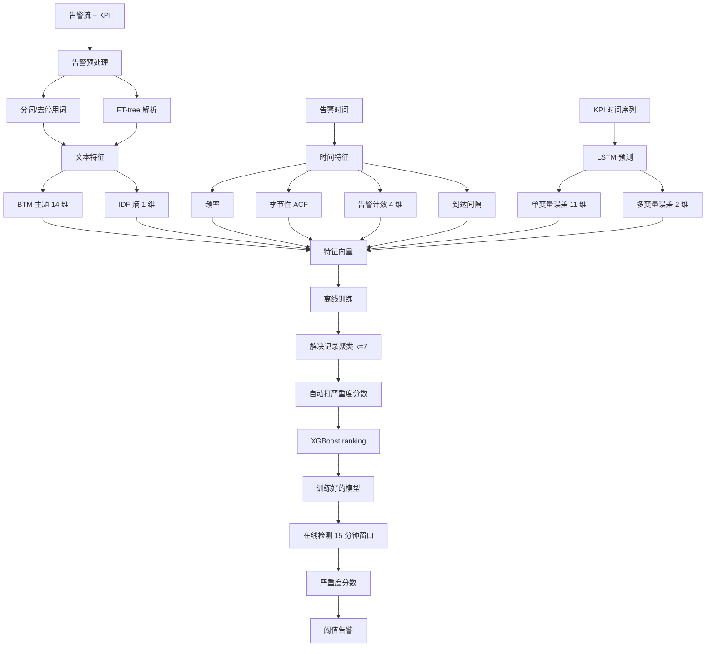
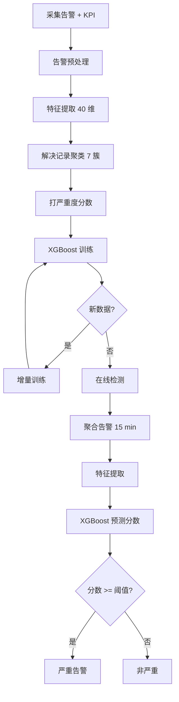

# AlertRank: Automatically and Adaptively Identifying Severe Alerts for Online Service Systems（ICSE 2020）

> 作者：Nengwen Zhao, Panshi Jin, Lixin Wang, Xiaoqin Yang, Rong Liu, Wenchi Zhang, Kaixin Sui, Dan Pei  
> 机构：清华大学（BNRist）；中国建设银行；史蒂文斯理工学院；BizSeer  
> 发表年份：2020  
> 会议/期刊：ICSE 2020（IEEE/ACM 42nd International Conference on Software Engineering）  
> 关联 PDF：同目录下 `alertrank_camera-ready.pdf`

## 一、文档信息速览

| 字段 | 值 |
|---|---|
| 标题 | AlertRank: Automatically and Adaptively Identifying Severe Alerts for Online Service Systems |
| 作者 | Nengwen Zhao, Panshi Jin, Lixin Wang, Xiaoqin Yang, Rong Liu, Wenchi Zhang, Kaixin Sui, Dan Pei |
| 机构 | 清华大学；中国建设银行；史蒂文斯理工学院；BizSeer；BNRist |
| 发表年份 | 2020 |
| 会议/期刊 | ICSE 2020 |
| 分类 | 告警管理 / 严重告警识别 / 排序学习 / 多源特征 |
| 核心问题 | 大型在线服务系统每日告警量巨大；基于规则分类严重告警经常漏报或浪费人力；告警与多种因素（文本、时间、KPI 异常）相关，规则难以捕捉；类别不平衡约 50:1 |
| 主要贡献 | (1) 自动打标策略：用工单 + 解决记录聚类给历史告警打严重度分数；(2) 提取 40 维可解释特征（BTM 主题/熵、时间频率/季节性、告警计数/到达间隔、原始严重度/时段/类型、KPI 单变量/多变量异常）；(3) XGBoost 排序学习框架 + 增量训练；3 个真实银行数据集 F1 平均 0.89 |

## 二、背景（Background）

大型在线服务系统（Google、亚马逊、微软、银行）由上千分布式组件组成，并发用户量大。监控系统收集 KPIs（日活、错误率）、logs（关键字匹配）、events 等。工程师为这些数据写大量规则触发告警，例如"CPU 利用率 > 90% 触发 P2 错误告警"、"warning/error/fail 关键字触发不同严重度"。规则分类使 P1 critical 告警优先处理，但 P1 仍可能每天上百条。

论文举出一个真实案例（Fig. 2）：某银行 P2 告警（10:14 响应时间升至 500ms）因工程师忙于 P1 而被忽略，10:45 用户投诉才发现，浪费 31 分钟修复时间。规则分类 P/R 仅 0.43/0.68，过于依赖阈值，遗漏复杂症状组合（成功率、交易量等）。

传统基于阈值或简单统计的告警优先级方法有四大痛点：(1) 标注成本高，每天上千条告警难以为每条手工打严重度；(2) 告警类型多，应用/网络/内存/中间件等，需要为每类手工定规则；(3) 系统动态变化，新告警类型、配置变更使规则失效；(4) 类别不平衡，非严重与严重告警比例约 50:1，传统二分类对不平衡敏感。

论文提出 AlertRank 框架，将告警识别建模为排序问题（而非二分类），并自动从历史工单中挖掘严重度标签。

## 三、目的（Problems Solved）

- **多源特征自动提取**：从告警文本、告警时间、KPI 指标中提取可解释特征，替代手工规则。
- **类别不平衡**：把"严重 vs 非严重"重构为"严重度分数排序"问题，用 XGBoost pointwise ranking 学习连续严重度。
- **自动打标**：利用历史工单 + 解决记录聚类自动生成训练标签，避免手工标注。
- **动态适应**：增量训练管道（每日/每周）更新模型，应对系统变化。
- **可解释性**：所有特征都可解释（主题、熵、频率、季节性、时段等），辅助工程师诊断。
- **减少人工**：相比规则策略，可减少约 31% 告警检查量，同时保持高 P/R。

## 四、核心原理（Principles）

**系统总览**：AlertRank 包含两阶段——离线训练和在线排序。离线训练：(1) 提取 40 维特征；(2) 用 TF-IDF + K-means（k=7，由 silhouette coefficient 确定）对解决记录聚类，由经验工程师为每簇打严重度分数（0、0.1、0.2、0.4、0.6、0.8、1），自动得到每条历史告警的严重度分数；(3) 用 XGBoost 回归树训练排序模型；(4) 用增量训练管道定期更新。在线排序：每 15 分钟对到达告警提取同样特征，预测严重度分数，按阈值告警。

**关键概念**：

- **告警（Alert）**：监控系统基于规则触发的运维事件。
- **严重度级别（Severity Level）**：P1-critical / P2-error / P3-warning。
- **工单（Ticket）**：告警升级后用于跟踪修复的事件。
- **严重度分数（Severity Score）**：0~1 连续值，作为排序学习的目标。
- **增量训练（Incremental Training）**：定期用最新数据重训模型，应对动态系统。
- **BTM（Biterm Topic Model）**：Yan et al. 2013 提出的短文本主题模型，比 LDA 适合短告警文本。
- **ACF（Autocorrelation Function）**：自相关函数，检测告警序列周期性。
- **IDF（Inverse Document Frequency）**：衡量单词重要性。
- **KPI 单变量异常（Univariate Anomaly）**：单个 KPI 预测误差。
- **KPI 多变量异常（Multivariate Anomaly）**：多 KPI 联合预测误差。
- **k-σ 阈值**：基于训练集异常分数均值的 k 倍标准差。

**数学原理**：

- **主题分布**（论文用 BTM 输出概率向量 $\phi_k \in \mathbb{R}^{14}$）：

$$
\mathbf{x}_{\text{topic}} = (\phi_1, \phi_2, \ldots, \phi_{14}) \in \mathbb{R}^{14}
$$

- **告警熵**（基于词 $w$ 的 IDF）：

$$
H(\text{alert}) = \sum_{w \in \text{alert}} \frac{\text{IDF}(w)}{\#w}, \quad \text{IDF}(w) = \log \frac{N}{N_w + 1}
$$

其中 $N$ 是历史告警总数，$N_w$ 是含词 $w$ 的告警数。

- **自相关函数 ACF**（告警时间序列 $C(a) = \{c_1, c_2, \ldots, c_h\}$）：

$$
\text{ACF}(l) = \frac{\sum_{i=0}^{N-1} c(i) \cdot c(i+l)}{N}, \quad l = 1, 2, \ldots, \lfloor N/2 \rfloor - 1
$$

- **KPI 单变量异常**（LSTM 预测第 $j$ 维的绝对误差）：

$$
e_j^{\text{uni}} = |X_{t+1}^{(j)} - \hat{X}_{t+1}^{(j)}|
$$

- **KPI 多变量异常**（联合预测误差）：

$$
e^{\text{multi}} = \| \mathbf{X}_{t+1} - \hat{\mathbf{X}}_{t+1} \|_2
$$

- **XGBoost pointwise ranking 目标**（回归损失）：

$$
\mathcal{L} = \sum_i (s_i - \hat{s}_i)^2 + \sum_k \Omega(f_k)
$$

其中 $s_i$ 是真实严重度分数，$\hat{s}_i$ 是预测值，$\Omega$ 是正则项。

- **KPI 异常特征提取**（LSTM 结构）：输入窗口 $\{\mathbf{X}_{t-w+1}, \ldots, \mathbf{X}_t\}$，输出下一时刻 $\hat{\mathbf{X}}_{t+1}$，维度 $m$ 对应 $m$ 个重要 KPI（业务 + 服务器）。

**与现有技术的差异**：与传统规则告警分类（Jiang et al. 2011; Tang et al. 2012）相比，AlertRank 用机器学习替代手工规则；与 Bug-KNN（Zhang et al. 2016 借鉴软件工程严重 bug 报告识别）相比，AlertRank 引入排序学习与多源特征；与基于强化学习的告警分类相比，AlertRank 把识别建模为 ranking 缓解类别不平衡。

## 五、算法详解（Algorithm）

1. **输入 / 输出**：
   - 输入：原始告警流 + 告警关联的 KPI 时间序列。
   - 输出：每条告警的严重度分数 + 严重/非严重二分类。

2. **核心模块**：
   - **告警预处理（Alert Preprocessing）**：分词 + 去停用词 + FT-tree 日志解析（Zhang et al. 2017 的算法）抽取告警模板，支持增量更新。
   - **文本特征提取**：BTM 主题概率（14 维，由 coherence score 选主题数）+ IDF 加权熵。
   - **时间特征提取**：频率（每条告警模板的出现次数）、季节性（ACF 最大值）、告警计数（30 分钟窗口内 4 个严重度级别数）、到达间隔（与上一条告警时间差）。
   - **KPI 特征提取**：用 LSTM 在 4 维业务 KPI（响应时间/成功率/交易量/处理时间）和 7 维服务器 KPI（CPU/I-O wait/内存/load/网络包/进程数/磁盘 I-O）上做单步预测，输出单变量（11 维）和多变量（2 维）异常分数。
   - **自动打标（Automatic Labeling）**：解决记录 TF-IDF 向量化 + K-means（k=7）聚类，每簇分配严重度分数（0.0/0.1/0.2/0.4/0.6/0.8/1.0），每条历史告警得到严重度分数。
   - **XGBoost ranking 训练**：回归树拟合严重度分数；定期用最新数据增量训练。
   - **在线检测**：15 分钟窗口内聚合告警，提取特征，预测分数，超过阈值（训练集最优阈值）告警。

3. **伪代码**：

```python
def preprocess_alerts(alerts):
    """分词 + FT-tree 解析得到告警模板"""
    templates = []
    for a in alerts:
        tokens = tokenize(a.content)
        template = ftree.match(tokens)
        templates.append(template)
    return templates

def extract_alert_features(alerts, btm, idf, ftree):
    """提取 27 维告警特征"""
    feats = []
    for a in alerts:
        topic = btm.transform(a.tokens)             # 14 维
        entropy = sum(idf[w] / count(w) for w in a.tokens)
        freq = frequency(a.template)
        seasonal = max_autocorr(time_series[a.template], 15)
        count_w = count_in_window(a, window=30*60)  # 30 min
        inter_arrival = a.time - prev_alert_time(a)
        feats.append([*topic, entropy, freq, seasonal,
                      count_w['P1'], count_w['P2'], count_w['P3'],
                      count_w['all'], inter_arrival])
    return feats

def extract_kpi_features(kpi, lstm):
    """用 LSTM 预测下一时刻，取单变量/多变量误差"""
    w = lstm.window
    pred = lstm.predict(kpi[-w:])
    uni_err = np.abs(kpi[-1] - pred)        # 11 维
    multi_err = np.linalg.norm(kpi[-1] - pred)
    return np.concatenate([uni_err, [multi_err, multi_err]])

def auto_label(alerts, k=7):
    """解决记录聚类 → 严重度分数"""
    tfidf_vecs = tfidf(alerts.resolution_record)
    clusters = kmeans(tfidf_vecs, k=k)
    severity_map = {0: 0.0, 1: 0.1, 2: 0.2, 3: 0.4, 4: 0.6, 5: 0.8, 6: 1.0}
    return [severity_map[c] for c in clusters]

def train_ranker(features, severity_scores):
    """XGBoost pointwise ranking 训练"""
    model = xgb.XGBRegressor(objective='reg:squarederror', n_estimators=300)
    model.fit(features, severity_scores)
    return model

def predict(model, features, threshold):
    scores = model.predict(features)
    labels = (scores >= threshold).astype(int)
    return labels, scores

def detect_online(new_alert, kpi_data, model, threshold):
    f = np.concatenate([
        extract_alert_features([new_alert]),
        extract_kpi_features(kpi_data, lstm)
    ])
    return predict(model, f, threshold)
```

4. **关键数学**：见 §四。

5. **复杂度分析**：
   - 告警预处理：$O(N \cdot L)$，$L$ 是告警文本长度。
   - 主题提取：BTM 推理 $O(K \cdot V)$，$K$ 主题数、$V$ 词表。
   - 聚类：$O(N \cdot d \cdot I)$，$I$ 迭代次数。
   - XGBoost 训练：$O(T \cdot |E| \log |E|)$，$T$ 树数。
   - 推理：单条告警毫秒级。

6. **训练与推理**：
   - 训练：3 个月数据，10 核 Intel Xeon E5-2620，约 20 分钟。
   - 推理：100 条告警约 2.4 秒（在线 15 分钟窗口内可处理）。

7. **示例**：银行 18 个月告警数据。3 个数据集 A/B/C（6 个月一段，374940/429768/390437 条告警，其中 7012/8482/7445 条严重）。F1 分别 0.89/0.86/0.93，平均 0.89。增量训练在 4 月 19 日软件变更后，F1 从 0.68 提升到 0.88（日更）。

## 六、系统架构图（Architecture）



## 七、流程图（Process Flow）



## 八、关键创新点（Key Innovations）

- **+ 自动打标**：用解决记录聚类（k=7，silhouette）替代手工标注，节约巨大人工成本。
- **+ 多维可解释特征**：40 维（14 主题 + 1 熵 + 1 频率 + 1 季节性 + 4 告警计数 + 1 到达间隔 + 1 原始严重度 + 3 时段 + 1 类型 + 11 单变量异常 + 2 多变量异常），每维都有清晰物理意义。
- **+ 排序学习框架**：把二分类重构为 pointwise ranking，缓解 50:1 的类别不平衡。
- **+ 增量训练**：XGBoost 支持日更/周更，4 月 19 日软件变更场景 F1 从 0.68 → 0.88。
- **+ FT-tree 解析**：支持告警模板动态演化，无需重新训练。
- **+ LSTM 联合 KPI 异常**：在 11 维业务/服务器 KPI 上学长期依赖，得到单/多变量异常。
- **+ 实际工业部署**：在中国建设银行上线，节约约 31% 告警检查量。

## 九、实验与结果（Experiments）

- **数据集**：3 个银行告警数据集 A（2018/01-06，374940 条，7012 严重）、B（2018/07-12，429768/8482）、C（2019/01-06，390437/7445）。严重与非严重比例约 1:50。
- **Baseline**：Rule-based（基于 P1/P2/P3 阈值）；Bug-KNN（基于 KNN 文本相似度，借鉴严重 bug 报告识别）。
- **主要指标**：Precision、Recall、F1、precision@k、训练时间、检测时间。
- **关键结果数字**：
  - AlertRank F1：A=0.89、B=0.86、C=0.93，平均 0.89；
  - Rule-based F1：0.53/0.56/0.53（P/R 0.43/0.68），被 AlertRank 显著超越；
  - Bug-KNN F1：0.74/0.70/0.64，比 AlertRank 低 0.15~0.29；
  - 消融：只用告警特征 F1 平均 0.76；只用 KPI 特征 F1 仅 0.36（说明告警特征贡献更大）；
  - 增量训练：4/19 后无更新 F1=0.68，日更 F1=0.88，周更 F1=0.81；
  - 减少告警检查量：规则策略需查 1996/2536/2094 条告警，AlertRank 只需 1380/1869/1148 条（约 31% 减少），同时保持 P/R 0.85+/0.90+。
- **消融实验**：分别去掉告警/KPI 特征、去掉增量训练、去掉 ranking（换 SVM/RF/XGBoost 分类）。
- **效率**：100 条告警检测 2.4 秒；3 个月数据训练 20 分钟。
- **可视化**：严重度分数 vs 各特征的散点图（Fig. 8）。

## 十、应用场景（Use Cases）

- **大型银行告警系统**：识别 P1 critical 告警，节约 on-call 工程师精力。
- **电商促销监控**：识别秒杀/大促期间真实告警，过滤噪音。
- **SaaS 服务监控**：跨服务调用异常告警优先级排序。
- **5G 核心网运维**：海量告警下的严重告警筛选。
- **云数据库告警**：ApsaraDB 等云原生数据库的告警分级。

## 十一、相关论文（Related Papers in this set）

- `TraceSieve_ISSRE23`（追踪异常检测）
- `SCWarn`（多模态异常检测）
- `SynthoDiag`（测试告警诊断）
- `SmartIW-Camera-Ready`（TCP IW 调优）
- `mining-causality-niexiaohui`（因果图根因分析）

## 十二、术语表（Glossary）

- **Alert**：告警，监控系统基于规则触发的事件。
- **Severity**：告警严重度（P1/P2/P3）。
- **Ticket**：工单，告警升级后的事件。
- **XGBoost**：梯度提升树算法。
- **LSTM**：长短期记忆网络。
- **BTM**：Biterm Topic Model 短文本主题模型。
- **FT-tree**：Zhang et al. 2017 提出的日志/告警解析树。
- **IDF**：逆文档频率。
- **ACF**：自相关函数。
- **Incremental Training**：增量训练，定期更新模型。
- **Ranking Model**：排序模型，输出连续分数。
- **Pointwise Ranking**：对单个样本预测分数。
- **Cohen's Kappa**：用于评估多人标注一致性的系数。

## 十三、参考与延伸阅读

- Paper: Jiang et al. 2011《Ranking the importance of alerts for problem determination》——基于规则的告警排名。
- Paper: Tang et al. 2012《Optimizing system monitoring configurations》——非动作告警过滤。
- Paper: Zhang et al. 2017《Syslog processing for switch failure diagnosis》——FT-tree 日志解析。
- Paper: Yan et al. 2013《A biterm topic model for short texts》——BTM 短文本主题模型。
- Paper: Chen & Guestrin 2016《XGBoost: A scalable tree boosting system》——XGBoost 算法。
- Paper: Hundman et al. 2018《Detecting spacecraft anomalies using LSTMs》——LSTM 异常检测。
- 工具：InfluxDB、Elasticsearch、Prometheus。
- 相关论文：`SCWarn`、`TraceSieve_ISSRE23`。
