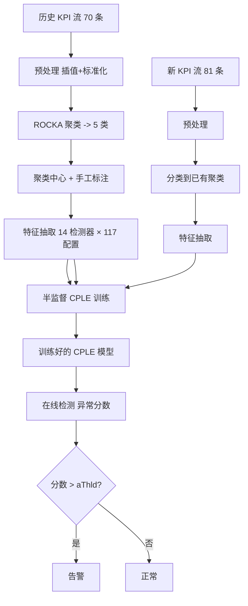
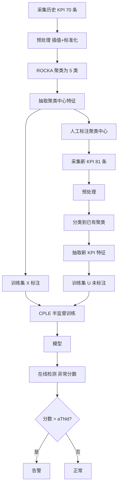

# ADS: Rapid Deployment of Anomaly Detection Models for Large Number of Emerging KPI Streams

> 作者：Jiahao Bu、Ying Liu、Shenglin Zhang、Weibin Meng、Qitong Liu、Xiaotian Zhu、Dan Pei  
> 机构：清华大学；南开大学；腾讯；BNRist  
> 发表年份：2018  
> 会议/期刊：IEEE IPCCC 2018（IEEE 37th International Performance Computing and Communications Conference）  
> 关联 PDF：同目录下 `bujiahao.pdf`

## 一、文档信息速览

| 字段 | 值 |
|---|---|
| 标题 | Rapid Deployment of Anomaly Detection Models for Large Number of Emerging KPI Streams |
| 作者 | Jiahao Bu、Ying Liu、Shenglin Zhang、Weibin Meng、Qitong Liu、Xiaotian Zhu、Dan Pei |
| 机构 | 清华大学；南开大学；腾讯；BNRist |
| 发表年份 | 2018 |
| 会议/期刊 | IEEE IPCCC 2018 |
| 分类 | KPI 异常检测 / 聚类 / 半监督学习 / 快速部署 |
| 核心问题 | 互联网服务持续产生大量新 KPI 流（每 10 天 6000+），传统方法需要人工算法选择/参数调优/重新标注，难以及时部署 |
| 主要贡献 | (1) 第一个面向"大规模新兴 KPI 流"的异常检测框架 ADS；(2) 首次将半监督学习用于 KPI 异常检测；(3) 在 70 历史 + 81 新 KPI 上达到平均 F1=0.92 |

## 二、背景（Background）

互联网服务（在线游戏、购物、社交、搜索）会持续监控大量 KPI（Key Performance Indicators），例如 CPU 利用率、QPS、响应延迟等。KPI 中的异常（尖峰/突降/水平漂移）往往意味着潜在的服务故障，需要被及时准确地检测出来。然而业界对 KPI 异常检测的研究多聚焦于"对单一 KPI 流优化算法"，无法应对互联网服务中"短时间内产生大量新兴 KPI 流"的真实场景。

以论文研究的某顶级游戏服务 G 为例：每季度平均上线 10+ 款新游戏，因此每 10 天平均产生 6000+ 新 KPI 流。传统统计方法（SVD、Wavelet、ARIMA、TSD、Holt-Winters 等）需要针对每条新 KPI 手动选算法 + 调参，在 6000 条规模下完全不可行；监督学习方法（EGADS、Opprentice）需要为每条新 KPI 重新标注；无监督方法（iForest）准确率低；基于 VAE 的 Donut 需要长达 6 个月的训练数据，无法做到"3 周内"上线。

论文提出 ADS（Anomaly Detection through Self-training），其核心思想基于两个观察：（1）很多 KPI 流因隐式关联而具有相似性，可聚类；（2）聚类数由业务类型决定，远小于 KPI 流数量，新增流很可能落入已有聚类。ADS 因此只需为每个聚类的中心打标，然后对每条新 KPI 与所属聚类中心进行半监督学习。

## 三、目的（Problems Solved）

- **大规模新兴 KPI 流快速部署**：3 周内对 6000+ 新 KPI 流完成异常检测上线，无需人工算法选择/调参/标注。
- **聚类 + 半监督学习替代全监督**：只需标注 5 个聚类中心即可训练 81 条新 KPI。
- **填补无监督准确率不足的空白**：相比 iForest 与 Donut，F1 提升 360% 与 61.4%。
- **算法与参数选择自动化**：以检测器输出的 severity 作为特征，输入随机森林，避免为每条 KPI 单独调参。
- **可扩展到新兴流**：基于聚类，新 KPI 自动归入已有聚类，复用聚类中心标签。
- **首次将半监督学习（CPLE）应用到 KPI 异常检测**：以往半监督方法用于图像/文本，未用于时间序列。

## 四、核心原理（Principles）

**系统总览**：ADS 由两条数据流组成：（1）历史 KPI 流：预处理 → ROCKA 聚类 → 抽取检测器特征 → 在聚类中心上手工标注；（2）新 KPI 流：预处理 → 分类到已有聚类 → 抽取检测器特征 → 与聚类中心特征+标签组成训练集 → CPLE 半监督学习训练模型 → 在线检测时计算 severity 并对比阈值 aThld 输出告警。

**关键概念**：

- **KPI Stream**：时间序列 (timestamp, value)。
- **Anomaly Detection Score / Severity**：检测器对每个数据点输出的非负异常程度。
- **Threshold (aThld)**：判定异常的全局阈值。
- **ROCKA**：快速 KPI 流聚类算法（Li et al., IWQoS 2018），基于形状相似度。
- **Cluster Centroid**：每个聚类的代表性 KPI 流。
- **Semi-Supervised Learning**：利用少量标注 + 大量未标注数据训练。
- **CPLE（Contrastive Pessimistic Likelihood Estimation）**：Loog 2016 提出的鲁棒半监督学习框架。
- **Base-Model**：半监督框架内的基础分类器，ADS 用 Random Forest。
- **Feature Extractor**：每个检测器在不同参数下输出的 severity 即为一种特征。
- **iForest / Donut**：无监督异常检测基线。

**数学原理**：

- **ROCKA 距离**：基于形状基线 + Fast Fourier Transform 的距离度量，复杂度 $O(m \log m)$。
- **检测器特征**：每个 (detector, params) 输出 severity：

$$
f_{d,p}(x_t) = \text{severity}_{d,p}(x_t) \in \mathbb{R}_{\ge 0}
$$

- **总特征数**：14 个检测器 × 共 117 种参数配置 = 117 维 severity 特征。

- **CPLE 目标函数**（论文 Eq. 2）：

$$
E(q, \theta | X, U) = J(y', g(U; \theta)) - J(y, g(X; \theta))
$$

其中 $X$ 为标注集，$U$ 为未标注集，$y'$ 是伪标签 $H(q)$，$J$ 是负对数似然。

- **伪标签（论文 Eq. 3）**：

$$
y' = H(q), \quad H(q_i) = \mathbb{1}[q_i \ge 0.5]
$$

- **数据点权重（论文 Eq. 4）**：

$$
w_i = \mathbb{1}[x_i \in X] \cdot 0 + \mathbb{1}[u_i \in U] \cdot q_i
$$

- **CPLE 优势**：（1）可换 base-model；（2）低内存 $O(n)$；（3）无需 EM/低密度假设；（4）支持增量学习。

**与现有技术的差异**：与 iForest 相比，ADS 用半监督而非纯无监督；与 Donut 相比，ADS 不需 6 个月训练数据；与 Opprentice 相比，ADS 不需为每条新 KPI 重新标注；与 ROCKA 单独使用相比，ADS 在聚类基础上做半监督学习，捕获聚类中心未覆盖的局部波动。

## 五、算法详解（Algorithm）

1. **输入 / 输出**：
   - 输入：70 条历史 KPI 流 + 5 个聚类中心标签 + 81 条新 KPI 流。
   - 输出：每条新 KPI 流的异常标签 + F1 指标。

2. **核心模块**：
   - **Preprocessing**：缺失值线性插值 + min-max 标准化。
   - **Clustering (ROCKA)**：将 70 历史 KPI 聚为 5 类，给出聚类中心。
   - **Feature Extraction**：14 个检测器 × 117 种参数配置 → 117 维 severity 特征。
   - **Classification**：将 81 新 KPI 分类到已有 5 类。
   - **Semi-Supervised Training (CPLE)**：以聚类中心（标注）+ 新 KPI 流（未标注）训练随机森林。
   - **Online Detection**：用训练好的模型在每条新 KPI 后 40% 上检测异常。

3. **伪代码**：

```python
def ads_pipeline(historical, new_streams):
    # 历史 KPI 预处理 + 聚类
    hists = [interpolate_and_normalize(s) for s in historical]
    clusters, centroids = rocka(hists, n_clusters=5)
    # 手工标注聚类中心
    labels = manual_label(centroids)
    # 抽取历史聚类中心特征
    cfeats = [extract_features(c) for c in centroids]
    # 新 KPI 流处理
    for new in new_streams:
        new = interpolate_and_normalize(new)
        cluster_id = classify(new, clusters)
        # 抽取新 KPI 特征
        new_feats = extract_features(new)
        # 训练集：聚类中心特征 + 标签，新 KPI 特征无标签
        X = cfeats[cluster_id]; y = labels[cluster_id]
        U = new_feats
        # CPLE 半监督训练
        model = cple_train(X, y, U, base_model=RandomForest())
        # 在线检测
        test_feats = new_feats[int(0.6*len(new)):]
        preds = [model.predict(f) for f in test_feats]
        for t, p in zip(test_times, preds):
            if p > aThld:
                yield t, "anomaly"
```

4. **关键数学**：见 §四。

5. **复杂度分析**：
   - ROCKA 聚类：$O(N \cdot m \log m)$，N=70，m 为流长度；
   - 特征抽取：14 检测器 × 117 配置 = 117 维，复杂度线性；
   - CPLE 训练：随机森林训练 + CPLE 迭代，分钟级；
   - 在线检测：每条新 KPI 毫秒级。

6. **训练与推理**：
   - 训练：在每条新 KPI 上以前 60% 训练，CPLE 随机森林；
   - 推理：每数据点计算 117 维 severity，输入模型得到异常分数。

7. **示例**：游戏 G 上线新游戏，产生 81 条新 KPI 流（Latency 19 条、Online Players 58 条、Success Rate 4 条）。ADS 聚类 5 类后，只需为 5 个聚类中心打标，对每条新 KPI 训练 CPLE 模型，最终在 81 条新 KPI 上取得平均 F1=0.92，远高于 iForest 0.20 与 Donut 0.57。

## 六、系统架构图（Architecture）



## 七、流程图（Process Flow）



## 八、关键创新点（Key Innovations）

- **+ 首次面向"大规模新兴 KPI 流"问题**：定义"3 周内上线 6000+ 新 KPI"这一真实工业痛点。
- **+ 首次将半监督学习（CPLE）用于 KPI 异常检测**：以聚类中心为少量标注，新 KPI 为大量未标注。
- **+ 检测器特征化**：把 14 个检测器 + 117 种参数配置转换为 117 维特征，免人工选算法/调参。
- **+ ROCKA 聚类 + CPLE 联合**：先聚类再用半监督学习吸收新流局部波动，显著优于 ROCKA+Opprentice。
- **+ 真实工业数据集验证**：在游戏 G 的 70 历史 + 81 新 KPI 上 F1=0.92，接近全监督 Opprentice 0.93，远超 iForest 0.20、Donut 0.57。
- **+ 可扩展**：CPLE 支持增量学习，可逐日更新。

## 九、实验与结果（Experiments）

- **数据集**：来自某顶级全球在线游戏服务 G 的 KPI 流，包含三类 KPI（Latency、Online Players、Success Rate）。
  - 历史 70 条用于聚类；
  - 81 条新流用于评估，其中 Latency 19、Online Players 58、Success Rate 4；
  - 数据点采样间隔 5 分钟，长度 1 个月；
  - 异常占比约 0.83%–1.7%；
  - 实际游戏中 6000+ 新 KPI/10 天。
- **Baseline**：iForest（无监督 Isolation Forest）、Donut（无监督 VAE）、Opprentice（监督学习）、ROCKA+Opprentice（聚类+监督）。
- **主要指标**：Best F1-Score（基于测试集调阈值）。
- **关键结果数字**：
  - ADS 在 81 条新 KPI 上平均 F1=0.92；
  - iForest 平均 F1=0.20；
  - Donut 平均 F1=0.57；
  - Opprentice（监督）平均 F1=0.93；
  - ROCKA+Opprentice 平均 F1=0.87；
  - 5 个聚类 F1 范围：0.67（E）–0.95（C）；
  - ADS 相对 iForest 提升 360%，相对 Donut 提升 61.4%；
  - 在 Cluster A 上 ADS 比 ROCKA+Opprentice 高 35.82%。
- **消融实验**：通过对比 ROCKA+Opprentice（无半监督）证明 CPLE 半监督贡献，尤其在聚类中心不能完全描述新流波动时。
- **效率分析**：训练时间数分钟/新流；在线检测毫秒级。
- **可视化**：Fig.4 给出 81 条新 KPI 上 4 种方法 F1 的 CDF；Table III 给出 5 个聚类的 F1 对比；Table IV 列出 ADS 显著优于 ROCKA+Opprentice 的具体 KPI（α, β, γ, δ...）。

## 十、应用场景（Use Cases）

- **在线游戏 KPI 监控**：新游戏上线时快速部署异常检测。
- **互联网公司新业务监控**：新业务上线时快速接入。
- **金融支付系统**：新支付通道的快速异常检测。
- **电商新业务上线**：新促销/新 SKU 监控。
- **运营商网络 KPI 监控**：新基站/新链路的快速部署。

## 十一、相关论文（Related Papers in this set）

- `camera_ready`（多维根因 Squeeze）
- `CoFlux_camera-ready1`（KPI 波动相关性）
- `ICCCN2020-YaoWang`（KPI 异常检测 iRRCF-Active）
- `aaai20_Poster`（批处理作业运行时长预测）
- `ICSE-SEET-36`（持续评估与反馈）

## 十二、术语表（Glossary）

- **KPI**：Key Performance Indicator。
- **Severity**：检测器输出的非负异常程度。
- **ROCKA**：Rapid Clustering of KPI Streams。
- **DBSCAN**：基于密度的聚类算法。
- **CPLE**：Contrastive Pessimistic Likelihood Estimation。
- **SUTVA**：Stable Unit Treatment Value Assumption。
- **Semi-Supervised Learning**：半监督学习。
- **aThld**：告警阈值。
- **EGADS**：Ensemble Generalized Anomaly Detection System。
- **Opprentice**：基于监督学习的异常检测。
- **iForest**：Isolation Forest。
- **Donut**：基于 VAE 的 KPI 异常检测。
- **ARIMA / Holt-Winters / SVD / Wavelet / TSD**：传统时序检测器。
- **BNRist**：北京国家信息科学与技术研究中心。

## 十三、参考与延伸阅读

- Paper: Donut（Xu et al., WWW 2018）——VAE 异常检测。
- Paper: Opprentice（Liu et al., IMC 2015）——监督学习异常检测。
- Paper: ROCKA（Li et al., IWQoS 2018）——KPI 流聚类。
- Paper: CPLE（Loog, TPAMI 2016）——半监督学习。
- Paper: EGADS（Laptev et al., KDD 2015）——时序异常检测。
- 工具：scikit-learn、StatsModels、Holt-Winters、ROCKA。
- 相关论文：`camera_ready`、`CoFlux_camera-ready1`、`ICCCN2020-YaoWang`。
