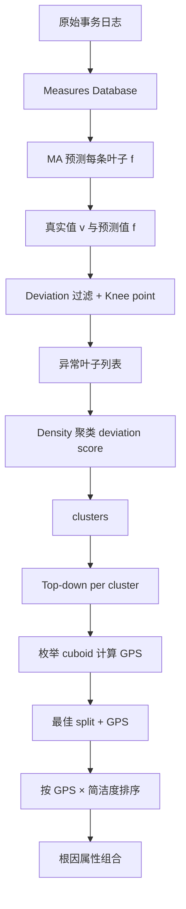
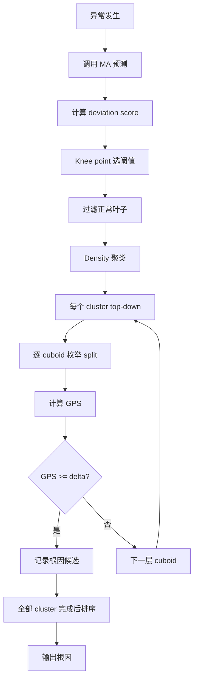

# Squeeze: Generic and Robust Localization of Multi-Dimensional Root Causes

> 作者：Zeyan Li、Chengyang Luo、Yiwei Zhao、Yongqian Sun、Kaixin Sui、Xiping Wang、Dapeng Liu、Xing Jin、Qi Wang、Dan Pei  
> 机构：清华大学；南开大学；BizSeer；中国建设银行；BNRist  
> 发表年份：2019 / 2020（IEEE TSC）  
> 会议/期刊：IEEE TSC（Transactions on Service Computing）  
> 关联 PDF：同目录下 `camera_ready.pdf`

## 一、文档信息速览

| 字段 | 值 |
|---|---|
| 标题 | Generic and Robust Localization of Multi-Dimensional Root Causes（Squeeze） |
| 作者 | Zeyan Li、Chengyang Luo、Yiwei Zhao、Yongqian Sun、Kaixin Sui、Xiping Wang、Dapeng Liu、Xing Jin、Qi Wang、Dan Pei |
| 机构 | 清华大学；南开大学；BizSeer；中国建设银行；BNRist |
| 发表年份 | 2019/2020 |
| 会议/期刊 | IEEE TSC |
| 分类 | 多维根因定位 / 服务运维 / 度量异常 |
| 核心问题 | 多维属性的度量异常时，需要在指数级搜索空间中快速定位根因属性组合 |
| 主要贡献 | (1) 提出广义涟漪效应（GRE），覆盖基本/派生度量及零预测值；(2) "bottom-up then top-down" 搜索策略；(3) 广义潜力分数（GPS）；(4) F1 比 SOTA 高 0.4，定位时间约 10 秒 |

## 二、背景（Background）

在线软件服务（在线购物、互联网公司）会周期性（如每分钟）采集多维属性的度量（measure）。每个度量（如下单总金额、订单平均金额、成功率）可按属性（如 Province、ISP）展开成多维数据立方体。当某个度量的真实值与预测值出现偏差时即发生异常，运维人员需要在指数级搜索空间中快速定位根因属性组合（如 Province=Beijing）。

按"派生方式"分，度量可分为基本度量（加性，如订单总额）与派生度量（比值/乘积，如平均金额、成功率）。按"搜索方法"分，前人方法分为 top-down（Adtributor、R-Adtributor、iDice、HotSpot）与 bottom-up（Apriori）。但所有这些方法都存在局限：有的对根因假设过强、有的只处理基本度量、有的忽略变化幅度小的异常、有的需要人工调参、有的太慢。本文提出 Squeeze（"bottom-up then top-down"），同时满足：（1）通用、鲁棒处理基本/派生度量；（2）支持任意异常幅度；（3）无需参数调优；（4）一致快速；（5）根因假设弱。

## 三、目的（Problems Solved）

- **多维根因的搜索空间爆炸**：在 d=5, l=10 时，候选根因数达 2^161050 − 1。
- **派生度量缺乏涟漪效应理论**：以往 ripple effect 仅适用于基本度量，派生度量无现成方法。
- **零预测值无法处理**：ripple effect 在 f(S)=0 时失效。
- **忽略变化幅度小的异常**：低占比但重要的异常（如银行小额交易失败）被忽略。
- **bottom-up 与 top-down 各有局限**：单纯 top-down 漏掉深 cuboid 的根因；单纯 bottom-up 太慢。
- **参数调优繁琐**：Apriori 的 support/confidence 阈值难调。

## 四、核心原理（Principles）

**系统总览**：Squeeze 的输入是某个度量的所有叶子属性组合的真实值 v 与预测值 f，输出是一组简洁（Occam's razor）解释所有异常的根因属性组合。系统包含四步：（1）按需调用 MA 等时间序列预测算法得到 f；（2）bottom-up：基于 deviation 过滤出异常叶子属性组合，再按 deviation score 聚类（每个 cluster 共享相似异常幅度）；（3）top-down：在每个 cluster 内，对每一层 cuboid 计算 GPS 分数，搜索最佳子集作为根因候选；（4）按 GPS × 简洁度排序输出根因。

**关键概念**：

- **Measure (M)**：被监控的指标值。
- **Fundamental Measure**：加性度量（如订单总额）。
- **Derived Measure**：派生度量（如平均金额、成功率 = 成功数/总数）。
- **Attribute / Attribute Value**：属性与属性值。
- **Attribute Combination**：属性-值对组合。
- **Leaf**：包含所有属性的属性组合。
- **Cuboid**：相同 key 的属性组合集合。
- **Descent**：包含关系的属性组合。
- **Real Value v(·) / Forecast Value f(·)**：真实值/预测值。
- **Generalized Ripple Effect (GRE)**：广义涟漪效应。
- **Generalized Potential Score (GPS)**：广义潜力分数。
- **Cuboid Layer**：cuboid 包含的属性个数。
- **Bottom-up / Top-down**：自底向上/自顶向下搜索。
- **Knee Point**：CDF 上的拐点，用于自动选择异常阈值。

**数学原理**：

- **GRE（基础形式，原 ripple effect）**（论文 Eq. 1）：

$$
\frac{f(e) - v(e)}{f(e)} = \frac{f(S) - v(S)}{f(S)}
$$

- **GRE（处理零预测值，论文 Eq. 2）**：

$$
\frac{f(e) - v(e)}{f(e) + v(e)} = \frac{f(S) - v(S)}{f(S) + v(S)}
$$

- **GRE 对派生度量（如 M3 = M1 / M2）的证明**：基于有限差分法，论文给出详细推导，结论：M3 仍满足 GRE。

- **Deviation Score**（论文公式）：

$$
d(e) := 2 \frac{f(e) - v(e)}{f(e) + v(e)}
$$

- **GPS（论文 Eq. 3）**：

$$
\text{GPS} = 1 - \frac{\text{avg}(|v(S_1) - a(S_1)|) + \text{avg}(|v(S_2) - f(S_2)|)}{\text{avg}(|v(S_1) - f(S_1)|) + \text{avg}(|v(S_2) - f(S_2)|)}
$$

- **succinctness 评分常数 C**（论文经验公式）：

$$
C = \frac{\log(\#\text{clusters} \cdot \#\text{abnormal leaves} / \#\text{leaves})}{\log(\#\text{attribute values})}
$$

- **Occam's razor**：在所有候选根因中按 GPS × 简洁度排序，选最佳。

**与现有技术的差异**：与 Adtributor（只一层 cuboid、忽略小幅度）相比，Squeeze 处理任意层 cuboid；与 iDice（只基本度量）相比，Squeeze 通过 GRE 处理派生度量；与 Apriori（参数难调、太慢）相比，Squeeze 仅一个 δ 阈值且 10 秒内；与 HotSpot（基本度量、MCTS）相比，Squeeze 通用且鲁棒。

## 五、算法详解（Algorithm）

1. **输入 / 输出**：
   - 输入：某度量在某时间窗内所有叶子属性组合的 v 与 f。
   - 输出：根因属性组合集合。

2. **核心模块**：
   - **MA Forecasting**：对每条叶子 v 使用移动平均预测 f。
   - **Deviation Filtering**：按 knee-point 自动选阈值过滤正常叶子。
   - **Density Clustering**：按 deviation score 聚类（Algorithm 1）。
   - **In-Cluster Localization**：对每个 cluster 逐 cuboid 计算 GPS（Algorithm 2）。
   - **Sorting by GPS × succinctness**：输出最佳根因。

3. **伪代码**：

```python
def squeeze(leaf_v, leaf_f):
    # 1. 计算 deviation score 并过滤
    d = 2 * (leaf_f - leaf_v) / (leaf_f + leaf_v)
    threshold = knee_point(d)  # 自动选阈值
    abnormal = [leaf for leaf, dv in zip(leaf_v, d) if dv > threshold]
    # 2. 按 deviation score 聚类
    clusters = density_cluster([d[l] for l in abnormal])
    # 3. 每个 cluster 内部 top-down 定位
    root_causes = []
    for cluster in clusters:
        for cuboid in all_cuboids_top_to_bottom:
            best_split = None; best_gps = 0
            for split in valid_splits(cuboid):
                gps = compute_gps(split, cluster, leaf_v, leaf_f)
                if gps > best_gps:
                    best_gps = gps; best_split = split
            if best_gps >= DELTA:
                root_causes.append(best_split)
                break
    # 4. 按 GPS × succinctness 排序
    return sorted(root_causes, key=lambda r: gps(r) - lambda_ * attributes(r))

def compute_gps(split, cluster, leaf_v, leaf_f):
    S1 = [l for l in leaf_v if l in cluster and l in split]
    S2 = [l for l in leaf_v if l in cluster and l not in split]
    a = expected_value(split, leaf_f)  # 论文 Eq. (3) 形式
    num = avg(abs(v - a) for v in S1) + avg(abs(v - f) for v in S2)
    den = avg(abs(v - f) for v in S1) + avg(abs(v - f) for v in S2)
    return 1 - num / den
```

4. **关键数学**：见 §四。

5. **复杂度分析**：
   - deviation 过滤：$O(N)$，N 为叶子数；
   - 聚类：$O(N \log N)$（直方图 + 极值点）；
   - top-down 枚举：$O(2^d \cdot l^d)$ cuboid 枚举，d 通常 < 10；
   - 整体在 10 秒内完成。

6. **训练与推理**：
   - 训练：无（无参数学习）；
   - 推理：每次异常时按需调用，对叶子属性组合运行完整 Squeeze。

7. **示例**：银行某天上午 9:00-11:00 出现 API 调用成功率骤降。Squeeze 接收所有叶子 v 与 f，过滤出异常叶子，按 deviation 聚类，逐 cuboid 计算 GPS，定位根因为 ServiceType=020020，对应某个服务类型软件 bug。

## 六、系统架构图（Architecture）



## 七、流程图（Process Flow）



## 八、关键创新点（Key Innovations）

- **+ 广义涟漪效应（GRE）**：首次形式化证明派生度量同样满足 ripple effect。
- **+ 处理零预测值**：用 (f+v)/2 替代 f 作分母，扩展 ripple effect 适用性。
- **+ bottom-up then top-down**：先聚类过滤缩小搜索空间，再 top-down 精确定位，速度与精度兼顾。
- **+ 广义潜力分数（GPS）**：用 L1-norm 的正负部分和替代 L2-norm，对小幅度异常更鲁棒。
- **+ 仅 1 个参数 δ**：相比 Adtributor/iDice/HotSpot/Apriori/R-Adtributor 全部有多个或易调参数。
- **+ 工业级真实案例验证**：在中国建设银行、Suning.com 等多家企业部署。
- **+ F1 比 SOTA 高 0.4，定位时间约 10 秒**。

## 九、实验与结果（Experiments）

- **数据集**：
  - 真实数据集 I1（在线购物，每 5 分钟交易数，5 维 15324 叶子）、I2（互联网公司，每分钟 page views，4 维 21600 叶子）；
  - 7 个半合成数据集 A、B0-B4、D，覆盖不同 forecast residual（0.80%–13.0%）；
  - 基本度量/派生度量各一组。
- **Baseline**：HotSpot+GRE（修改版）、iDice、Adtributor、R-Adtributor、Apriori。
- **主要指标**：F1-Score（基于属性组合）、Time Cost。
- **关键结果数字**：
  - Squeeze 在所有 7 个数据集上 F1 优于 SOTA 约 0.4；
  - 即使在异常幅度 < 0.4% 的情况下 Squeeze 仍可定位，HotSpot/Adtributor 几乎失效；
  - 异常幅度 0.4%–12% 与 12%–100% 区间 Squeeze F1 仍稳定；
  - 定位时间约 10 秒（24×Intel Xeon E5-2620 v3 @ 2.40GHz 64GB RAM，Python）；
  - 在 D（派生度量）上 HotSpot+GRE 与 Squeeze 同时达到较高 F1；
  - 工业案例：Case I 银行 API 成功率 2 小时未定位，Squeeze 数秒找到 ServiceType=020020；Case II 跨子系统 10 分钟人工定位，Squeeze 数秒找到 destination=ic 并发现更多根因；Case III 互联网公司夜间错误暴增，1 小时人工找到 1 个根因，Squeeze 找到 2 个根因。
- **消融实验**：HotSpot vs HotSpot+GRE（仅在派生度量上有效）；Squeeze 在不同 cuboid layer 与 n_elements 下的 F1；δ 变化对结果影响小。
- **效率分析**：Squeeze 10 秒内完成；Apriori 数百秒；其他方法快但 F1 低。
- **可视化**：Fig.8 给出 D 数据集上各算法在 9 种 (n_elements, cuboid_layer) 下的 F1；Fig.9 给出不同异常幅度下的 F1；Fig.12 给出 forecast residual 对 F1 的影响；Fig.11 给出 δ 变化对 F1 的影响。

## 十、应用场景（Use Cases）

- **银行 API 调用成功率骤降定位**：在多家银行实际部署。
- **电商交易量异常定位**：在 Suning.com 部署。
- **互联网公司业务异常定位**：在多家互联网公司部署。
- **SaaS 多租户监控**：定位到具体租户。
- **电信运营商 KPI 异常定位**：在多维属性 KPI 上定位。

## 十一、相关论文（Related Papers in this set）

- `bujiahao`（KPI 异常检测 ADS）
- `CoFlux_camera-ready1`（KPI 波动相关性）
- `ICCCN2020-YaoWang`（KPI 异常检测 iRRCF-Active）
- `aaai20_Poster`（批处理作业运行时长预测）
- `ICSE-SEET-36`（持续评估与反馈）

## 十二、术语表（Glossary）

- **Measure**：度量。
- **Fundamental / Derived Measure**：基本/派生度量。
- **Attribute / Attribute Value**：属性/属性值。
- **Attribute Combination**：属性组合。
- **Leaf**：叶子属性组合。
- **Cuboid**：相同 key 的属性组合集合。
- **Descent**：包含关系。
- **GRE (Generalized Ripple Effect)**：广义涟漪效应。
- **GPS (Generalized Potential Score)**：广义潜力分数。
- **Knee Point**：拐点。
- **MA (Moving Average)**：移动平均。
- **Adtributor / R-Adtributor / iDice / HotSpot / Apriori**：根因定位经典算法。
- **F1-Score**：精确率与召回率的调和均值。
- **MAE / MSE**：平均绝对误差/均方误差。
- **Occam's razor**：简洁性原则。
- **BNRist**：北京国家信息科学与技术研究中心。

## 十三、参考与延伸阅读

- Paper: Adtributor（Bhagwan et al., NSDI 2014）。
- Paper: iDice（Lin et al., ICSE 2016）。
- Paper: HotSpot（Sun et al., IEEE Access 2018）。
- Paper: Apriori（Agrawal & Srikant, VLDB 1994）。
- Paper: R-Adtributor（Persson & Rudenius, 2018 Master Thesis）。
- Paper: Squeeze（Li et al., IEEE TSC）。
- 工具：Python 3、scikit-learn、numpy、pandas。
- 相关论文：`bujiahao`、`CoFlux_camera-ready1`、`ICCCN2020-YaoWang`。
