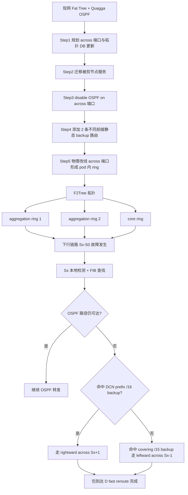
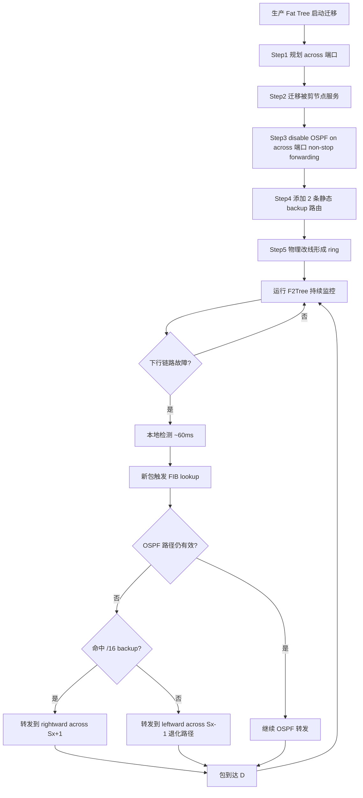

# F2Tree: Rapid Failure Recovery for Routing in Production Data Center Networks（IEEE/ACM TON 2017）

> 作者：Guo Chen, Youjian Zhao, Hailiang Xu, Dan Pei (Senior Member, IEEE), Dan Li (Member, IEEE)
> 机构：清华大学计算机科学与技术系；北京邮电大学计算机科学与技术系
> 发表年份：2017
> 会议/期刊：IEEE/ACM Transactions on Networking（DOI 10.1109/TNET.2017.2672678）
> 关联 PDF：同目录下 `f2tree.pdf`（初版为 ICDCS 2015）

## 一、文档信息速览

| 字段 | 值 |
|---|---|
| 标题 | F2Tree: Rapid Failure Recovery for Routing in Production Data Center Networks |
| 作者 | Guo Chen、Youjian Zhao、Hailiang Xu、Dan Pei、Dan Li |
| 机构 | 清华大学计算机科学与技术系；北京邮电大学计算机科学与技术系 |
| 发表年份 | 2017 |
| 会议/期刊 | IEEE/ACM Transactions on Networking（期刊扩展版） |
| 分类 | 数据中心网络 / 路由故障恢复 / Fat Tree 增强 |
| 核心问题 | 多根树型 DCN 中下行链路无本地备份路径，OSPF/BGP timer 收敛慢，无法满足 100ms 内实时 deadline；先前方案均需修改协议/数据面 |
| 主要贡献 | (1) F2Tree 拓扑 + 静态 backup 路由仅靠重布 2 条线实现下行 fast reroute；(2) 给出 5 步 live migration 部署方案，non-stop forwarding；(3) 1Gbps 测试床 + 8 端口 3 层 NS3-DCE 大规模仿真 + all-to-all 流量场景全面评估；(4) 期刊扩展版相比 ICDCS 版增加 §II-C 部署章节、§V 完整 all-to-all 实验、参数敏感性分析 |

## 二、背景（Background）

数据中心网络（DCN）由 100K+ 台服务器、数千台交换机互联，承担搜索、社交、电商等关键业务。实时业务（如 Bing/Google/Facebook 的搜索请求往往触发 100+ 机器的并行短流）端到端 deadline 通常 ≤300ms，DC 内子任务甚至 <100ms。生产 DCN 普遍采用多根树拓扑（Fat Tree、VL2、Leaf-Spine）+ 分布式路由（OSPF、BGP），其故障恢复时间受限于：
1. **下行链路无 immediate backup link**：aggregation/core 交换机在 Fat Tree 中没有同 pod 内的环回邻居。
2. **OSPF 收敛慢**：SPF 计算定时器默认 200ms，在大型不稳定网络下指数回退可达数秒甚至 9s；中间还会出现 path inflation、临时环路。

作者用一个 4 端口 3 层 Fat Tree 测试床（VMware ESXi 5，Ubuntu 14.04.1 LTS 虚拟机，Quagga 0.99.22，4×1Gbps 端口）重现：t=0ms 源 S 经 S1-S9-S17-S15-S7-D 路径发 UDP 流；t=380ms shutdown 接口 S15-S7。S15 接口检测 ~60ms，OSPF LSA 几乎瞬时传播，但 S1 等 SPF timer 过期 + 10ms FIB 更新，整段 S1 收敛时间 >272ms，UDP throughput 出现 272ms 的零值期。

作者总结根因为两条：
1. **多根树拓扑中下行链路（downward link）缺乏即时备份路径**——S15 找不到本地可用的备选下一跳。
2. **分布式路由协议需要时间反应**——OSPF 定时器在大型不稳定网络下可能数秒。

此前方案（Aspen Tree 改拓扑+F10 改协议+DDC 改数据面）都需要 non-trivial 路由/转发协议改动，难部署。F2Tree（Fault-tolerant Fat Tree）不修改任何协议/软件，仅靠重布 2 条线 + 2 条静态路由。

## 三、目的（Problems Solved）

- **下行链路无备份路径**：每台 agg/core 交换机预留 rightmost downward + rightmost upward 端口形成 across-link ring，把"下行链路 immediate backup 链路数"从 0 提升到 2。
- **上行链路多 1 条 backup**：上行 ECMP 加 2 条 across 链路，使上行 immediate backup 数 = N/2（N 端口交换机）。
- **OSPF/BGP 收敛太慢**：每台 agg/core 添加 2 条不同前缀的静态 backup route（DCN prefix /16 与 covering /15），FIB 切换只本地查表。
- **零协议改动**：保留所有现有 routing/forwarding 软件栈，可在生产 DCN 直接部署。
- **Live migration**：设计 5 步部署方案，使升级期间不丢包；论文 §IV-B 给出 non-stop forwarding 实证。
- **跨协议/拓扑可推广**：BGP、Leaf-Spine、VL2 同样适用。

## 四、核心原理（Principles）

**F2Tree 拓扑**：N 端口交换机的 Fat Tree，每台 agg/core 交换机保留 rightmost downward 端口作"右向 across 端口"、rightmost upward 端口作"左向 across 端口"；每个 pod 内首尾相连成 ring。其余 N-2 端口一半上行、一半下行，与 Fat Tree 相同。Across 端口上**禁用 OSPF**（不让它扩散到控制平面），仅作为本地 backup。

**Fast reroute 关键配置**：每台 agg/core 交换机添加 2 条不重分发到 OSPF 的静态路由：
- 一条指向 rightward across neighbor（如 S8→S9），前缀是 DCN prefix（如 10.11.0.0/16）；
- 一条指向 leftward across neighbor（如 S8→S10），前缀是 covering prefix（如 10.10.0.0/15）。

FIB 中 backup 路由前缀长度故意不同，避免 2 个相邻交换机同时下行失败时 ring 上临时环路（S8 优先走 S9 = 更长前缀；只有 S9 也失效时才退化到 S10 = 较短前缀）。

**Immediate backup link 数与公式**：

$$
\text{Backup}_{\text{downward}}^{\text{F2Tree}} = 2
$$

$$
\text{Backup}_{\text{upward}}^{\text{FatTree}} = N/2 - 1
$$

$$
\text{Backup}_{\text{upward}}^{\text{F2Tree}} = (N/2-2)_{\text{ECMP}} + 2_{\text{across}} = N/2
$$

**Scalability 对比**（N 端口同构 3 层 DCN）：

| 拓扑 | 节点数 | 协议改 | 数据面改 |
|---|---|---|---|
| Fat tree | $N^3/4$ | n/a | n/a |
| VL2 | $N^2/2$ | n/a | n/a |
| **F2Tree** | $N^3/4 - N^2 + N$ | **no** | **no** |
| Aspen tree | $N^3/4(f+1)$ | yes | no |
| F10 | $N^3/4$ | yes | yes |
| DDC | n/a | yes | yes |

N=128 时 F2Tree 仅少 ~2% 节点；Aspen tree f=1 少 50% 节点。

**Failure 4 大条件分析**（Sx 是 downward 失败所在交换机，Sy 在同 pod）：
1. right across link & right 邻居 downward link 都好：Sx→Sx+1→D。
2. Sx 到 Sy 之间所有下行都坏，Sy 仍有一条好下行：Sx→Sx+1→…→Sy→D。
3. right across 坏，left across & left 邻居下行好：Sx→Sx-1→D。
4. 多个并发失败（包括 Sy 的 right across + Sy 与 Sx 之间所有下行）：F2Tree 退化为 Fat Tree，需要 OSPF 重算。

**Live migration 第 3 步 non-stop forwarding 原理**：先 disable OSPF on across 端口→所有流量立刻按"老路径"经 across 邻居（OSPF 路由条目还没消失）继续转发；O SPF 收敛后再把流量切到新 OSPF 路径；改线时不丢包。

## 五、算法详解（Algorithm）

1. **输入 / 输出**
   - 输入：原始 Fat Tree 配置；故障事件集；目标 F2Tree 拓扑规划。
   - 输出：fast reroute 后的等价无故障路径；故障恢复时间统计；部署可行性证明。
2. **核心模块**
   - **Topology Planning**：每台 agg/core 交换机预留 2 个端口（rightmost downward + rightmost upward）做 across。
   - **Service Migration (Step 2)**：将被剪节点上的服务迁出。
   - **Across-port Routing-Protocol Disable (Step 3)**：保证 non-stop forwarding。
   - **Backup Route Configuration (Step 4)**：通过集中式 bash 脚本为每台 agg/core 添加 2 条不同前缀的静态路由。
   - **Physical Rewiring (Step 5)**：最后做物理改线；可用 [19] 中 topology 验证工具确认。
   - **Local Fast Reroute on Failure**：在交换机 Sx 上检测到 Sx-S0 失败 → 本地 FIB 命中 backup 路由 → 经 across 邻居（Sx+1 或 Sx-1）继续转发。
3. **伪代码**

```python
def f2tree_deployment(fat_tree):
    # 1) 规划
    for sw in fat_tree.switches_in_role(('aggregation','core')):
        sw.mark_as_across('rightmost_downward')
        sw.mark_as_across('rightmost_upward')
    update_topology_db(fat_tree)

    # 2) 服务迁移
    migrate(fat_tree.pruned_hosts())

    # 3) disable OSPF on across 端口 (non-stop forwarding)
    for sw in fat_tree.switches_in_role(('aggregation','core')):
        for p in sw.across_ports():
            sw.disable_ospf(p)

    # 4) 添加 backup 路由
    for sw in fat_tree.switches_in_role(('aggregation','core')):
        sw.add_static(prefix=DCN_PREFIX,    # 10.11.0.0/16
                       nh=sw.rightward_across_neighbor(),
                       redistribute=False)
        sw.add_static(prefix=COVERING_PREFIX,# 10.10.0.0/15
                       nh=sw.leftward_across_neighbor(),
                       redistribute=False)

    # 5) 物理改线
    fat_tree.rewire_across_ring()


def on_link_failure(sx, failed='Sx-S0'):
    if sx.can_reach_via_ospf(failed.dst_subnet):
        return  # OSPF 路径未受影响
    # 用更具体的 /16 backup (rightward across) 优先
    for pkt in sx.in_queue(failed.dst_subnet):
        sx.forward(pkt, via=sx.rightward_across_neighbor())
    # 退化情形：rightward 邻居也不可达 → 用 /15 backup
    if sx.rightward_across_neighbor() not in sx.reachable_neighbors():
        sx.forward_all_pending(via=sx.leftward_across_neighbor())
    return  # 全部 local 完成，无需 OSPF 重算
```

4. **关键数学**：见 §四（immediate backup 数 + 节点数 + 4 种失败条件）。
5. **复杂度分析**
   - 拓扑改造：每台 agg/core $O(1)$ 改线 + $O(1)$ 配置；
   - 故障检测：~60ms（BFD 风格，论文实测）；
   - 故障恢复：FIB 查找时间 μs 级；
   - 部署：5 步全脚本化，每步独立可回滚；
   - 大规模仿真：8 端口 3 层 20000 flow、5 并发失败下 9s 收敛退化情况罕见（< 0.03% 请求）。
6. **训练与推理**：无机器学习；纯静态 + 本地查找。
7. **示例**：F2Tree 测试床中"S→D 经 S1-S9-S17-S15-S7"路径上 S15-S7 突然 down，S15 检测到 down 后用本地 backup 路由经 S15-S16-S7 把报文送达 D；FCT 表征为连通性丢失 60ms + TCP 吞吐崩塌 220ms，相对 Fat Tree 272ms + 700ms。

## 六、系统架构图（Architecture）



## 七、流程图（Process Flow）



## 八、关键创新点（Key Innovations）

- **+ 2 条线 + 2 条静态路由 = 下行链路 2 条 immediate backup**。
- **+ Live migration 5 步法**：(1) 规划 (2) 迁移服务 (3) disable OSPF on across (4) 配 backup (5) 物理改线，全程 zero-loss。
- **+ 不同前缀长度的双 backup 路由**：避免 ring 临时环路。
- **+ 协议无关性**：OSPF/BGP 同样可借鉴；Leaf-Spine/VL2 拓扑可类比。
- **+ 大规模 all-to-all 实验**：每端 host 向不同 pod 内 host 发不限速 TCP 流，t=4.5s 拆 1/8 core-agg 链路，t=6s 恢复——F2Tree 比 Fat Tree 更平稳。
- **+ 78% 恢复时间下降**：从 272ms 到 60ms（连通性丢失）；96% deadline-missing 请求下降。

## 九、实验与结果（Experiments）

- **测试床**：4 端口 3 层 Fat Tree → F2Tree，VMware ESXi 5 + Ubuntu 14.04.1 LTS + Quagga 0.99.22 OSPF + ECMP。1458 byte/100μs UDP/TCP 流，故障注入通过 shutdown 接口。
- **大规模仿真**：NS3 + DCE 跑真实 Quagga + Linux TCP/IP 栈；2.4GHz/12 核服务器；8 端口 3 层 DCN；1Gbps 链路 + 5μs 传播延迟；60ms 故障检测 + 10ms FIB update 模拟。
- **Baseline**：Fat Tree + OSPF/ECMP。Aspen Tree、F10 因协议/数据面改动未纳入。
- **关键数字（Table III）**：
  - 1 下行链路失败：Fat Tree 272.847ms / 1302 丢包 / 700ms TCP 吞吐崩塌；F2Tree 60.619ms / 310 丢包 / 220ms TCP 吞吐崩塌。
  - 7 种失败条件 C1–C7：C1–C6 F2Tree 都保持 ~60ms 恢复；仅 C7（极端 3 链路并发 + across 同时失败）退化为 Fat Tree。
  - Partition-aggregate（≥3000 请求 / 1500 background / 600s）：Fat Tree 1/5 并发失败 deadline-miss 0.4% / 1.6%；F2Tree 0% / 0.06%（下降 100% / 96.25%）。Fat Tree 极端下出现 9s 完成时间（F2Tree 几乎消失）。
  - All-to-all（每 host 不限速 TCP、1/8 core-agg 链路失败 1.5s）：F2Tree 网络利用率与 Fat Tree 接近，且故障期间 0 振荡。
- **Live migration**：5 步迁移全程 0 丢包（UDP），TCP throughput 平滑（iperf + 自研发生器多次验证）。

## 十、应用场景（Use Cases）

- **生产 DCN 升级**：将现网 Fat Tree 升级为 F2Tree 而不中断业务。
- **搜索/广告/电商 partition-aggregate**：≤100ms 延迟敏感业务的首选。
- **多租户云 DCN**：突发流量大、租户间干扰多，F2Tree 提供毫秒级本地恢复。
- **Leaf-Spine / VL2 拓扑**：§VI 给出改造思路；同样适合 OSPF/BGP 之外的分布式路由。
- **金融支付、低延迟存储**：与 Fat Tree 相比 fault recovery 数量级提升。

## 十一、相关论文（Related Papers in this set）

- `F2Tree-ICDCS15`（会议初版，相同作者，2 条线 + 2 条静态路由的核心思想首次提出）
- `CQRD-ComputerNetworks15`（Fat Tree 内部交换机 CQRD 队列缓解下行流冲突）
- `CQRD-LCN`（CQRD 会议短版）
- `FUSO-ATC16`（多路径 TCP 快速重传，恢复 FCT）
- `conext15-final2`（FUNNEL：软件变更后性能变更快速检测）
- `NLB-ICCCN2015-paper`（NDN 直播 WLAN 跨层优化）

## 十二、术语表（Glossary）

- **DCN / Fat Tree / Multi-rooted Tree / ToR / Aggregation / Core / Pod**：见 F2Tree-ICDCS15 术语表。
- **ECMP / OSPF / BGP / LSA / FIB / BFD**：见 F2Tree-ICDCS15 术语表。
- **Immediate Backup Link**：本地信息即可重路由的备份链路。
- **Across Neighbor / Across Link**：F2Tree 中同 pod 内的 ring 邻居及其链路。
- **DCN Prefix / Covering Prefix**：覆盖所有 DCN 主机的最短与次短前缀。
- **Live Migration**：不中断业务的现网升级过程。
- **Non-Stop Forwarding**：升级过程中保持转发不中断。
- **Failure 4 Conditions**：1) right across + right neighbor OK；2) Sx..Sy 间下行都坏但 Sy 有可用下行；3) right across 坏 left across OK；4) Sy right across + Sy..Sx 间下行全坏（F2Tree 退化为 Fat Tree）。
- **Topology DB / Topology Verification Tool**：升级前/中用来确认拓扑正确性的工具。
- **Quagga / NS3-DCE**：开源软件路由器 / NS3 直接执行框架。

## 十三、参考与延伸阅读

- Paper: F2Tree IEEE/ACM TON 2017（本文，期刊扩展版）。
- Paper: F2Tree ICDCS 2015（同作者会议初版）。
- Paper: Aspen Tree（SIGCOMM 2014）、F10（NSDI 2013）、DDC（NSDI 2013）——同期容错方案。
- Paper: VL2（SIGOPS 2009）——Clos 风格多根树 DCN。
- 工具：Quagga、NS3、NS3-DCE、VMware ESXi、iperf、netem。
- 相关论文：`F2Tree-ICDCS15`、`CQRD-ComputerNetworks15`、`CQRD-LCN`、`FUSO-ATC16`、`conext15-final2`、`NLB-ICCCN2015-paper`。
