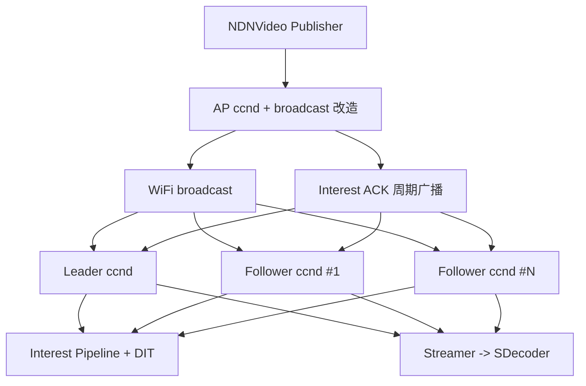
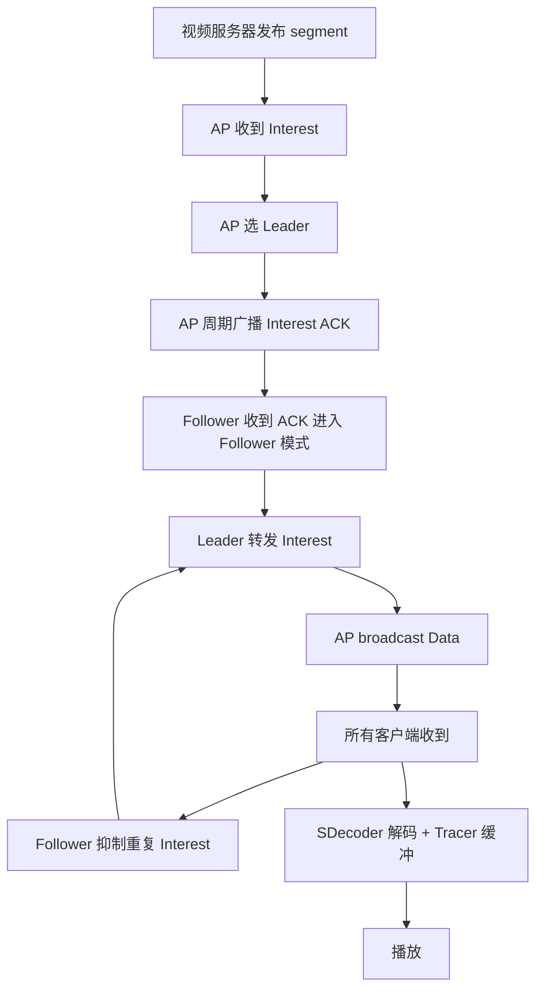

# Interest-Suppression-based NDN Live Video Broadcasting over Wireless LAN（NLB）

> 作者：Menghan Li、Dan Pei、Xiaoping Zhang、Beichuan Zhang、Ke Xu  
> 机构：清华大学（TNList）；亚利桑那大学  
> 发表年份：约 2015-2016  
> 会议/期刊：Frontiers of Computer Science（Selected from ICN 2015）  
> 关联 PDF：同目录下 `fcs-li.pdf`

## 一、文档信息速览

| 字段 | 值 |
|---|---|
| 标题 | Interest-Suppression-based NDN Live Video Broadcasting over Wireless LAN（NLB） |
| 作者 | Menghan Li、Dan Pei、Xiaoping Zhang、Beichuan Zhang、Ke Xu |
| 机构 | 清华大学 TNList；亚利桑那大学 |
| 发表年份 | 约 2015-2016 |
| 会议/期刊 | Frontiers of Computer Science |
| 分类 | NDN / 视频广播 / WLAN / 兴趣包抑制 |
| 核心问题 | 在 WiFi 上 NDN 视频广播存在重复 Interest 与无 MAC ACK 丢包，无法支持 20+ 并发客户端 |
| 主要贡献 | (1) NLB 跨层设计：Leader/Follower 机制 + Interest ACK；(2) Interest pipeline + 延迟发送；(3) 1Mbps 视频支持 20+ 客户端 |

## 二、背景（Background）

NDN（Named Data Networking）是一种以"内容"为中心的新型 Internet 架构，通过 Interest/Data 包 + 路由器内置缓存（Content Store）实现天然的多播与缓存支持，适用于视频直播等大流量场景。但在最后一段无线 WiFi 链路上，NDN 现有实现仍把"对同一内容的多次请求"当作多个单播会话处理，导致重复包与带宽浪费。WiFi 802.11 的 broadcast 模式没有 MAC 层 ACK，因此丢包率较高，影响流媒体质量。

校园网 / 体育馆 / 公共演讲等场景下，1Mbps 直播视频的并发观看者可能达 10k–100k。已有的 WiFi 直播工作（如 Medusa、Dircast、Flexcast）需要修改 802.11 MAC 层，难以在商用 AP 上部署。本文目标是在不修改 MAC 层的前提下，基于 NDN 跨层（应用层 + NDN 层）实现可扩展的 WiFi 直播。系统名为 NLB（NDN Live video Broadcasting），已在 1 软件 AP + 20 Raspberry Pi 客户端的物理测试床上实现与评估。

## 三、目的（Problems Solved）

- **WiFi 重复 Interest 浪费带宽**：20+ 客户端对同一段内容各自发 Interest，AP 上有 20 份重复请求。
- **WiFi 广播无 ACK 丢包率高**：现有 NDN 视频在 broadcast 上跑不通。
- **修改 802.11 MAC 不现实**：商用 AP 不允许修改驱动。
- **Live 视频对时延敏感**：相比 VoD 不能大幅预取，需要实时保证。
- **Leader/Follower 切换鲁棒**：客户端随时加入/离开，需要稳定 Leader。
- **Interest/Data 冗余控制**：避免在无 Loss recovery 的 broadcast 上泛滥重传。

## 四、核心原理（Principles）

**系统总览**：NLB 跨层分 NDN 层 + 应用层。（1）NDN 层：AP 改造为标准 NDN 路由器但向 WLAN broadcast；首次请求的客户端被选为 Leader，AP 通过 Interest ACK 周期广播告知 Follower 当前 Leader 与客户端数 N；Follower 收到与自己 Interest nonce 不匹配的 ACK 即转为 Follower 模式；（2）应用层：Streamer 用 Interest pipeline（类似 TCP SACK）控制发送速率；Follower 收到 Leader 已发的 Interest 即抑制重复；为避免 CS 命中后 RTT 估为 0 导致疯狂重传，使用 min_timer 下限。

**关键概念**：

- **NDN**：Named Data Networking。
- **Interest / Data Packet**：请求包 / 数据包。
- **PIT (Pending Interest Table)**：路由器未决 Interest 表。
- **Content Store (CS)**：NDN 路由器内容缓存。
- **Leader / Follower**：NLB 中首个发 Interest 的客户端 vs 其他客户端。
- **Interest ACK**：AP 周期性广播的特殊 Data 包，含 Leader 标识与客户端数 N。
- **Delayed Interest Table (DIT)**：Follower 维护的延迟发送 Interest 表。
- **Interest Pipeline**：基于 pending Interest 数量限制发送速率。
- **Playout Delay (Tpd)**：客户端在解码前的缓冲时间。
- **NSVP**：NDN Simulative Video Player 仿真器。
- **min_timer**：Interest 重传定时器下限。

**数学原理**：

- **Data Rate**：

$$
DR = N_{pi} \cdot L / T_r
$$

- **初始 Npi**：

$$
N_{pi} = VR \cdot T_r / L
$$

- **每 T_s 秒更新 Npi**：

$$
N_{pi} = (S_2 - S_1) \cdot T_r / T_s
$$

- **SRTT 平滑 RTT**：

$$
SRTT = (1 - \alpha) \cdot SRTT + \alpha \cdot RTT
$$

- **RTTVAR**（TCP 公式）：

$$
RTTVAR = (1 - \beta) \cdot RTTVAR + \beta \cdot |SRTT - RTT|
$$

- **重传定时器**：

$$
T_i = \max(\text{min\_timer}, SRTT + K \cdot RTTVAR)
$$

- **Follower 抑制重传概率**：

$$
p_{\text{send}} = 1 / (N - R)
$$

其中 N 为客户端数，R 为重传次数。

**与现有技术的差异**：与 Medusa / Dircast / Flexcast 不同，NLB 不修改 802.11 MAC；与 NDN 默认多单播不同，NLB 在 NDN 层用 Leader/Follower 机制；与 TCP 拥塞控制不同，NLB 用基于 pending Interest 的"类 SACK"控制。

## 五、算法详解（Algorithm）

1. **输入 / 输出**：
   - 输入：1Mbps 直播视频流 + N 个客户端 + 1 个 AP。
   - 输出：每个客户端的 Buffering Rate、Buffering Ratio、Interest/Data Redundancy。

2. **核心模块**：
   - **NDNVideo Streamer**：发布等长 segment 到 NDN repo。
   - **NSVP (NDN Simulative Video Player)**：在客户端模拟解码 + 缓冲。
   - **Streamer/Tracer/SDecoder**：三层应用模块。
   - **AP ccnd**：标准 NDN 路由器 + broadcast 改造。
   - **Leader ccnd**：维护 DIT、转发 Leader Interest。
   - **Follower ccnd**：维护 DIT、按概率抑制重传。
   - **Interest Pipeline**：控制 Npi。
   - **Interest Retransmission Timer**：min_timer + SRTT + K·RTTVAR。

3. **伪代码**：

```python
# 启动：AP 选第一个 Interest 发送者为 Leader
def ap_on_interest(client, stream):
    if stream not in streams:
        streams[stream] = {'leader': client, 'N': 0}
    streams[stream]['N'] += 1
    if every_pack_interests():
        broadcast_interest_ack(streams[stream])

# Leader ccnd
def leader_on_data(data):
    sn = data.match_interest_sn()
    dit.update(sn)  # 移除 SN 较小的 Interest
    dit.delayed_retransmit()  # 按 best-effort 重传 DIT 中 Interest

# Follower ccnd
def follower_on_interest(interest):
    if cs.match(interest):
        return data
    dit.add(interest)
    if retransmit_needed(interest):
        if random() < 1 / (N - R):
            send(interest)
            dit.remove(interest)

# Streamer Interest pipeline
def request_more_data():
    while len(p_ints) < Npi and left > 0:
        requested += 1
        p_ints.add(requested)
        send_interest(requested)
```

4. **关键数学**：见 §四。

5. **复杂度分析**：
   - Interest 处理：$O(1)$ 每个 Interest；
   - DIT 更新：$O(|DIT|)$；
   - 端到端延迟：$O(T_r)$。

6. **训练与推理**：
   - 训练：无（纯协议设计）；
   - 推理：实时按 802.11 broadcast 周期运行。

7. **示例**：1Mbps 直播视频，AP 频道 1（2.4GHz），6Mbps broadcast 带宽；20 个 Raspberry Pi 客户端订阅。NLB 支持 20 个客户端无卡顿播放，UCast 仅支持 10 个，BCast 仅支持 5 个。

## 六、系统架构图（Architecture）



## 七、流程图（Process Flow）



## 八、关键创新点（Key Innovations）

- **+ 不修改 802.11 MAC**：可部署在所有商用 AP。
- **+ Leader/Follower 机制 + Interest ACK**：用 NDN 层信令抑制重复 Interest。
- **+ Interest Pipeline 基于 pending Interests**：类似 TCP SACK 的可靠传输。
- **+ Delayed Interest Table (DIT)**：Follower 维护已发 Interest 表，避免重复重传。
- **+ min_timer 防止 CS 命中后 RTT 估为 0**：避免爆发式重传。
- **+ 物理测试床验证**：1 AP + 20 Raspberry Pi 验证可扩展性。

## 九、实验与结果（Experiments）

- **数据集 / 实验设置**：
  - 1 软件 AP（Ubuntu + hostapd 802.11n 2.4GHz 6Mbps broadcast）；
  - 20 个 Raspberry Pi 客户端；
  - 1Mbps Mobile calendar 测试视频（H.264/FFmpeg）；
  - 实验时间 0am–6am 低背景干扰；
  - 实验时长 120s × 5 runs。
- **Baseline**：UCast（NDN 单播）、BCast（NDN broadcast + 单播 Interest）。
- **主要指标**：Buffering Rate、Buffering Ratio、Interest Redundancy、Data Redundancy。
- **关键结果数字**：
  - 20 客户端时 NLB buffering rate 接近 0、buffering ratio 接近 0、redundancy 接近 100%；
  - UCast 仅支持 10 客户端（>10 出现严重卡顿）；
  - BCast 仅支持 5 客户端（>5 buffering ratio > 50%）；
  - NLB 在 scalability 上比 UCast 优 2×、比 BCast 优 4×；
  - 选定参数：min_timer=0.05s、(α,β,K)=(1/16, 1/8, 3)、Rmax=25、Pack=30；
  - 12 个参数组合测试中，min_timer=0.05s 与 0.10s 表现最稳。
- **消融实验**：min_timer 从 0 增至 0.20s 时 packet redundancy 降低但 buffering 上升；min_timer=0.05s 是 robustness / timeliness 的折中。
- **效率分析**：20 客户端同时播放 1Mbps 视频，AP 资源充足，Streamer 帧率稳定。
- **可视化**：Fig.1/2/3 给出 scalability、参数 sensitivity 曲线。

## 十、应用场景（Use Cases）

- **校园网 / 公司内直播讲座**：NLB 可在普通 AP 上支持 20+ 客户端。
- **大型赛事直播**（SuperBowl / NBA / 奥运开幕式）：1Mbps × 数千用户。
- **总统演讲直播**：突发性大量用户。
- **企业内网培训直播**：无需特殊硬件。
- **教育 / 远程会议**：低带宽视频直播。

## 十一、相关论文（Related Papers in this set）

- `iwqos16-li`、`conext15-final2`、`NLB-ICCCN2015-paper`、`pch-infocom2017`
- `BAPL_publish_version`
- `icccn2017-pch`

## 十二、术语表（Glossary）

- **NDN**：Named Data Networking。
- **Interest / Data Packet**：请求/数据包。
- **PIT (Pending Interest Table)**：未决 Interest 表。
- **Content Store (CS)**：路由器缓存。
- **Leader / Follower**：NLB 中的角色。
- **Interest ACK**：AP 广播的 Leader 标识包。
- **DIT (Delayed Interest Table)**：延迟 Interest 表。
- **Interest Pipeline**：pending Interest 数量控制。
- **SRTT / RTTVAR**：平滑 RTT 与 RTT 方差。
- **min_timer**：重传定时器下限。
- **NSVP**：NDN Simulative Video Player。
- **Tpd**：Playout Delay。
- **TNList**：清华大学信息技术国家实验室。
- **CCNx**：NDN 早期开源实现。

## 十三、参考与延伸阅读

- Paper: NDN（Zhang et al., ACM SIGCOMM 2006 / NDN Project）。
- Paper: NDNVideo（NDN Project technical report）。
- Paper: Medusa（Dang et al., NSDI 2008）。
- Paper: Dircast（Park et al., INFOCOM 2010）。
- Paper: Flexcast（Chandra et al., NSDI 2008）。
- Paper: 802.11n（IEEE 802.11 标准）。
- Paper: TCP SACK（RFC 2018）。
- 工具：CCNx 0.8.1、hostapd、Raspberry Pi、FFmpeg、OpenWrt。
- 相关论文：`iwqos16-li`、`conext15-final2`、`BAPL_publish_version`。
