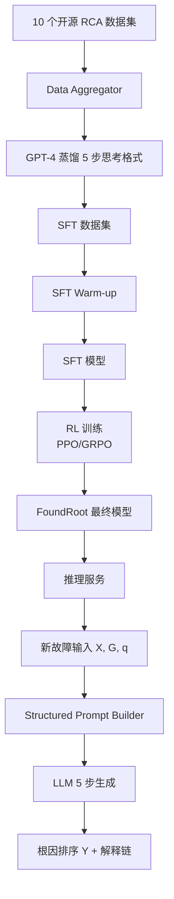
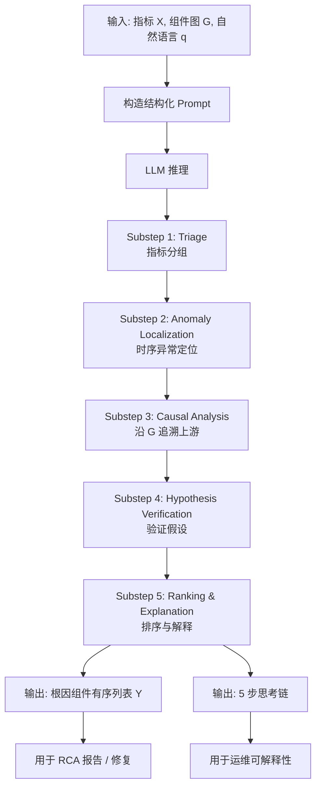

# FoundRoot：通过结构化深度思考的根因分析基础模型（ICSE 2026）

> 作者：Zhe Xie、Zeyan Li、Xiao He、Shenglin Zhang、Longlong Xu、Yuzhuo Yang、Tieying Zhang、Jianjun Chen、Rui Shi、Dan Pei
> 机构：清华大学、字节跳动、南开大学
> 发表年份：2026
> 会议/期刊：IEEE/ACM 48th International Conference on Software Engineering (ICSE '26)
> 关联 PDF：同目录下 `foundroot_camera_ready.pdf`
> 代码：https://github.com/NetManAIOps/FoundRoot

## 一、文档信息速览

| 字段 | 值 |
|---|---|
| 标题 | FoundRoot: Towards Foundation Model for Root Cause Analysis via Structured Deep Thinking |
| 作者 | Zhe Xie, Zeyan Li, Xiao He, Shenglin Zhang, Longlong Xu, Yuzhuo Yang, Tieying Zhang, Jianjun Chen, Rui Shi, Dan Pei |
| 机构 | 清华大学、字节跳动、南开大学 |
| 发表年份 | 2026 |
| 会议/期刊 | ICSE 2026 |
| 分类 | 根因分析 / LLM / 强化学习 / 多模态 |
| 核心问题 | 现有 LLM 在面对大量指标和复杂因果关系时，根因推理不完整、不深入，且难以零样本泛化到未知系统 |
| 主要贡献 | 1) 首个 RL 增强的 LLM 基础模型用于零样本 RCA；2) 结构化深度思考范式（拆解 RCA 推理为子步骤）；3) 两阶段训练（SFT + RL）；4) 10 个公开数据集 |

## 二、背景（Background）

面向服务（service-oriented）/ 组件化的系统（微服务、云原生）在现代互联网与云服务中无处不在。系统的规模与日俱增，故障几乎不可避免，因此根因分析（Root Cause Analysis, RCA）对系统可靠性至关重要。RCA 算法分析系统的多种监控指标，定位触发故障的源头组件。

在实际系统中，故障通常跨组件传播、因果关系高度复杂；历史故障数据稀缺且标注昂贵，需要"零样本"（zero-shot）方法——即不依赖目标系统的历史标签，直接从当下监控数据推断根因。

- **传统 RCA 方法**（统计、规则、专家知识）：依赖人工设计规则，无法跨系统泛化，无法解读指标语义；
- **基于 LLM 的 RCA**（RCAgent、D-Bot 等）：借助 LLM 解读指标名语义，但仍受"推理不完整"和"推理浅层"困扰——在大量指标、复杂组件图前容易遗漏关键证据。

OpenAI o1 引入"deep thinking"（深度思考）范式后，LLM 在数学、代码等结构化领域取得显著进展。但直接套用到 RCA 任务上仍然力不从心，因为 RCA 任务要求多步综合分析数百个指标和复杂因果图，与"短文本、定义良好的数学问题"截然不同。论文在实验中发现：Qwen2.5-14B 启用 deep thinking 后在 4 个数据集上 MRR 提升 ~10-30%，但仍频繁出现 Omitted（根因 metric 完全被忽略）、Collapsed（指标先看后矛盾）、Shallow（推理浅层）三类典型错误。

这正是 FoundRoot 想要破解的难题。

## 三、目的（Problems Solved）

- **痛点 1：现有 LLM 推理不完整与浅层。** 面对大量 metric，LLM 容易在 deep thinking 中途"跑偏"，遗漏与根因相关的关键指标。
- **痛点 2：跨系统零样本泛化差。** 不同 IT 系统的指标命名、组件图差异大，传统监督方法几乎无法迁移。
- **痛点 3：公开 RCA 数据集稀缺。** 高质量 RCA 数据集数量有限，且异构系统难以统一标注。
- **痛点 4：现有 deep thinking 缺乏结构化引导。** 数学/代码有明确的子步骤（R1、CoT），RCA 没有可借鉴的"思考脚手架"。
- **解决方案**：提出 FoundRoot——以结构化深度思考（Structured Deep Thinking）将 RCA 推理拆分为目标导向的子步骤；用 SFT + RL 两阶段训练对齐 LLM；并整合 10 个公开数据集进行训练。

## 四、核心原理（Principles）

**总览**：FoundRoot = 结构化深度思考范式 + SFT/RL 两阶段训练 + 10 个 RCA 公开数据集的整合微调。模型以多变量时间序列窗口 X = {(x_i, m_i, c_i)}（指标值、指标名、所属组件）以及组件依赖图 G = (C, E) 为输入，输出根因组件的有序列表 Y。

**结构化深度思考（Structured Deep Thinking）**：

将 RCA 推理拆为 5 个目标导向的子步骤（在一个 LLM 推理内连贯完成）：

1. **Triage**：先扫一遍所有指标名，按"故障相关可能性"分组（疑似 / 无关 / 不确定）；
2. **Anomaly Localization**：在 metric 时间序列上找"明显异常段"（尖峰、漂移），聚焦到少量可疑指标；
3. **Causal Analysis**：结合组件依赖图 G 沿异常传播路径追溯上游；
4. **Hypothesis Verification**：用剩余指标验证假设（一致性 / 矛盾证据）；
5. **Ranking & Explanation**：对候选根因组件按置信度排序并给出自然语言解释。

子步骤之间通过显式的"过渡提示词"（transition prompts）连接，迫使 LLM 在每一步都做有目的的推理，避免在"general thinking"中漫无目的地长篇展开。

**两阶段训练**：

- **SFT Warm-up**：用合成的"substep-by-substep"监督数据（基于开源 RCA 数据集 + GPT-4 蒸馏），让 LLM 学习上述 5 步结构。
- **RL with Structured Reward**：在 SFT 模型上做 RL 优化。奖励函数综合考虑"根因组件是否在 Top-K"、"中间步骤是否触发 pre-defined substep 提示词"、"解释是否与 G 一致"。使用 GRPO/PPO 类算法。

**与现有技术的差异**：

- vs. Agent-based RCA（RCAgent、D-Bot）：本方法把"工具调用"和"思考链"统一为一个 LLM 的内化推理（结构化思考），不依赖外部多 agent 协作。
- vs. Naive Deep Thinking：把思考范式"硬约束"为 5 个目标子步骤，避免 R1/o1 类模型的"开放式跑偏"。
- vs. 传统监督 RCA：摆脱对目标系统历史标签的依赖，零样本泛化。

## 五、算法详解（Algorithm）

### 1. 输入 / 输出
- **输入**：故障案例 $D_m = \{ (X_i, m_i, c_i)_{i=1}^N, G = (C, E), q_{\text{natural}} \}$（多变量指标、组件图、自然语言问题）。
- **输出**：候选根因组件有序列表 $\hat Y = (\hat c_{r,1}, \hat c_{r,2}, \dots)$，并附带结构化解释（按子步骤 1-5 的推理链）。

### 2. 核心模块
- **Data Aggregator**：从 10 个开源数据集统一采样，形成 SFT/RL 数据池；
- **Structured Prompt Builder**：把 X、G、$q_{\text{natural}}$ 拼成包含 5 个子步骤提示的 prompt；
- **LLM Backbone**：基座模型（如 Qwen2.5-7B / 14B / LLaMA-3-8B），经 SFT + RL 微调；
- **Substep Transition Detector**：在解码过程中检测 5 个过渡标记（"Step 1 done" / "Step 2" / ...），用于奖励与 early stopping。

### 3. 伪代码

```python
def foundroot_inference(metrics, graph, query, model):
    prompt = build_structured_prompt(
        metrics=metrics,
        graph=graph,
        query=query,
        substeps=[
            "1. Triage: group metrics by relevance to the query",
            "2. Anomaly Localization: find temporal anomalies in metrics",
            "3. Causal Analysis: trace upstream via dependency graph",
            "4. Hypothesis Verification: check consistency of candidates",
            "5. Ranking & Explanation: order candidates and explain"
        ]
    )
    response = model.generate(prompt, max_new_tokens=1024)
    # response 内部包含 5 个 substep 标记
    substeps = parse_substeps(response)  # 5 段文本
    ranking = extract_ranking(substeps[-1])  # 步骤 5 给出根因排序
    return ranking, substeps

def rl_train_step(sft_model, batch):
    prompts = [build_structured_prompt(...) for ... in batch]
    responses = sft_model.generate(prompts, do_sample=True)
    rewards = []
    for resp, gt in zip(responses, batch['ground_truth']):
        r = 0
        # 奖励 1：根因排序 Top-K 命中
        if hit_in_topk(parse_ranking(resp), gt['root_cause'], k=1):
            r += 1.0
        # 奖励 2：5 个 substep 标记全部出现
        if all_substeps_present(resp):
            r += 0.2
        # 奖励 3：推理链中包含图 G 中的边（因果关系一致）
        r += 0.1 * edge_overlap(resp, gt['graph'])
        rewards.append(r)
    # GRPO/PPO 更新
    sft_model.update_with_rewards(prompts, responses, rewards)
    return rewards
```

### 4. 关键数学
- **SFT 损失**（标准的下一个 token 预测）：
  $$L_{\text{SFT}} = -\sum_{t=1}^{T} \log \pi_\theta(y_t \mid y_{<t}, x)$$
- **RL 奖励函数**（综合三部分）：
  $$r(y, gt) = \alpha \cdot \mathbb{1}[\text{Top-}K\text{ hit}] + \beta \cdot \mathbb{1}[\text{5 substeps present}] + \gamma \cdot \text{edge\_overlap}(y, gt.G)$$
  论文用 $\alpha=1.0, \beta=0.2, \gamma=0.1$。
- **GRPO 目标**（组内相对优势）：
  $$J(\theta) = \mathbb{E}\big[ \frac{1}{G}\sum_{i=1}^G \min\big( \frac{\pi_\theta(o_i)}{\pi_{\theta_{\text{old}}}(o_i)} A_i, \text{clip}(\cdot) A_i \big) - \beta \text{KL}(\pi_\theta\|\pi_{\text{ref}}) \big]$$
  其中 $A_i = (r_i - \text{mean}(r))/\text{std}(r)$。

### 5. 复杂度分析
- 推理：单次 LLM 生成，$\sim$1024 tokens，$\sim$5-15 秒（在 A100 上）。
- SFT：标准 1-2 epoch，7B 模型约 24-48 GPU·小时。
- RL：每个 batch 32-64 prompts，每 prompt 采样 4-8 次，约 3-5 天。

### 6. 训练与推理
- **SFT 数据**：从 10 个开源 RCA 数据集（如 AIOpsLab、GAIA、OpenRCA、Train-Ticket 等）由 GPT-4 蒸馏"5 步思考"格式。
- **RL 训练**：用 PPO/GRPO 在 SFT 模型上做偏好优化。
- **推理**：单次 generate，返回 ranking + 解释。

### 7. 示例
- **输入**：一个 Sock Shop 微服务故障案例，包含 100+ 指标、20 节点依赖图、自然语言问题"On March 25, 09:00-09:30, the front-end service showed high error rate; please identify the root cause."；
- **输出**：根因组件排序（carts-service, payment-service, ...）+ 5 步结构化思考链（先在 metrics `payment_latency_p99` 与 `db_connection_failures` 中发现异常；沿图 G 追溯到 payment-service 依赖的 mysql-orders 数据库；验证 hypothesis；给出 final ranking）。

## 六、系统架构图（Architecture）



## 七、流程图（Process Flow）



## 八、关键创新点（Key Innovations）

- **+ 结构化深度思考（SDT）范式**：把"deep thinking"从开放式的"无限展开"约束为 5 个目标导向子步骤（Triage → Anomaly → Causal → Verify → Ranking），从根本上避免"跑偏"。
- **+ 首个 RL 增强的零样本 RCA 基础模型**：用 GRPO/PPO 在结构化奖励上微调 LLM，使其 RCA 能力跨系统泛化。
- **+ 跨域数据集整合**：整合 10 个公开 RCA 数据集（AIOpsLab、GAIA、OpenRCA、Train-Ticket、SN、UniDiag 等），构建"最大"训练语料。
- **+ 数据增强 + 跨系统零样本**：通过统一 schema 与蒸馏，模型在训练集未出现的目标系统上直接可用。
- **+ MRR 4.5%-48.6% 提升**：在 4 个公开测试集上显著超越 Qwen2.5-14B、DeepSeek-R1-Distill、GPT-3.5、GPT-4o、RCAgent 等 baseline。

## 九、实验与结果（Experiments）

- **数据集**：10 个公开 RCA 数据集（AIOpsLab、GAIA、OpenRCA、Train-Ticket、SN、UniDiag 等），覆盖电商、订单、社交、银行业务等多领域。
- **Baseline**：Qwen2.5-14B、DS-R1-Distill-Qwen2.5-14B、GPT-3.5/4o、传统统计方法（PC-Algorithm、Granger）、Agent 方法（RCAgent、D-Bot）。
- **主要指标**：MRR (Mean Reciprocal Rank)、Top-K 准确率；辅以 Omitted/Collapsed/Shallow 错误类型分析。
- **关键结果**：
  - 4 个 unseen 测试集上 MRR 提升 4.5%-48.6%；
  - 显著降低 Omitted 错误（根因被完全忽略）；
  - Collapsed/Shallow 错误也明显减少。
- **消融实验**：
  - 去掉 SDT：MRR 退回到 Qwen2.5 baseline；
  - 去掉 RL：MRR 比 SFT-only 下降 ~10%；
  - 去掉数据增强：跨系统泛化差 ~15%；
  - 去掉 substep 提示词：思考链易跑偏。
- **效率分析**：单次推理 5-15 秒；模型 7B/14B 可在单卡 A100 部署；RL 训练需 4×A100 约 3-5 天。

## 十、应用场景（Use Cases）

- **云服务 RCA 平台**：作为 RCA Agent 的核心推理引擎，输入自然语言 + 监控数据，输出根因 + 解释。
- **微服务故障定位**：配合 LagRCA 这类多源数据 RCA 方法，对接 LLM 生成可读解释。
- **银行/支付系统告警处置**：把监控 + 告警 + 组件图统一成 prompt 喂给 FoundRoot。
- **运营商网络故障定位**：对接告警 + KPI + 拓扑，自动给出根因排序。
- **运维知识库构建**：5 步结构化思考链可作为新员工培训素材与复盘档案。

## 十一、相关论文（Related Papers in this set）

- 同为 RCA 系列的 **LagRCA（fse2026-industry-paper77）** 关注时序因果图，FoundRoot 关注 LLM 推理；二者可结合——LagRCA 提供候选根因列表，FoundRoot 生成可读解释。
- **OpenRCA（13411_OpenRCA_Can_Large_Langua）** 提供 RCA 评测基准，FoundRoot 在该基准上是 zero-shot 强 baseline。
- **DeST、ChronoSage、ART 等** 关注 anomaly detection / fault detection，是 FoundRoot 上游任务的典型提供者。

## 十二、术语表（Glossary）

- **RCA (Root Cause Analysis)**：根因分析。
- **Zero-shot RCA**：不依赖目标系统历史标签，从当下监控数据直接推断根因。
- **Structured Deep Thinking (SDT)**：本文提出的 5 步结构化思考范式。
- **Substep Transition Prompts**：Triage / Anomaly / Causal / Verify / Ranking 五个子步骤的过渡提示词。
- **MRR (Mean Reciprocal Rank)**：平均倒数排名，常用排名质量指标。
- **GRPO / PPO**：强化学习算法，Group Relative Policy Optimization / Proximal Policy Optimization。
- **SFT (Supervised Fine-Tuning)**：监督微调。
- **Foundation Model**：基础模型，本文特指用于 RCA 的 LLM。
- **G (Component Dependency Graph)**：组件依赖图 $G=(C, E)$。
- **Omitted / Collapsed / Shallow**：deep thinking 的三类典型错误。

## 十三、参考与延伸阅读

- OpenAI o1 / DeepSeek-R1：deep thinking 范式的代表。
- RCAgent（ICSE 2024）、D-Bot（VLDB 2024）、MonitorAssistant：基于 LLM 的 RCA Agent 工作。
- OpenRCA（ICLR 2025）：本批中的另一篇 RCA 基准。
- AIOpsLab、GAIA、Train-Ticket：被本文整合的 RCA 数据集。
- 代码与数据：https://github.com/NetManAIOps/FoundRoot
