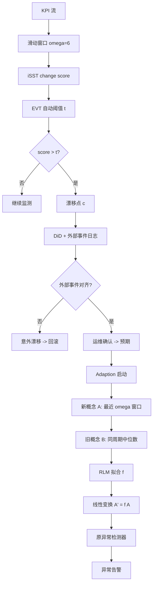
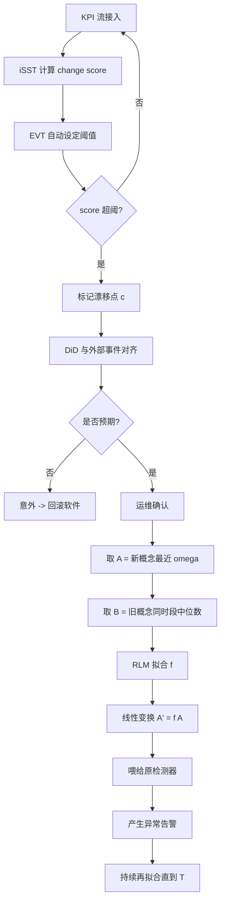

# StepWise: Robust and Rapid Adaption for Concept Drift in Software System Anomaly Detection（ISSRE 2018）

> 作者：Minghua Ma, Shenglin Zhang, Dan Pei, Xin Huang, Hongwei Dai  
> 机构：清华大学计算机科学与技术系；BNRist；南开大学软件学院；搜狗公司  
> 发表年份：2018  
> 会议/期刊：ISSRE 2018（IEEE International Symposium on Software Reliability Engineering）  
> 关联 PDF：同目录下 `issre-stepwise.pdf`

## 一、文档信息速览

| 字段 | 值 |
|---|---|
| 标题 | Robust and Rapid Adaption for Concept Drift in Software System Anomaly Detection |
| 作者 | Minghua Ma, Shenglin Zhang, Dan Pei, Xin Huang, Hongwei Dai |
| 机构 | 清华大学；BNRist；南开大学；搜狗 |
| 发表年份 | 2018 |
| 会议/期刊 | ISSRE 2018 |
| 分类 | KPI 异常检测 / 概念漂移 / 在线服务系统 |
| 核心问题 | 软件升级 / 配置变更 / 流量切换造成的预期概念漂移使既有异常检测器精度急剧下降；大规模 KPI 流每天出现 3000+ 漂移点，手动调参不可行 |
| 主要贡献 | (1) iSST-EVT：自动设定变化分数阈值，无需逐 KPI 调参；(2) 利用外部因素（软件变更 / 流量切换）做因果分类，区分预期 vs 意外漂移；(3) Robust Linear Model (RLM) 自适应新概念；(4) 在 6 个月、288 条 KPI 数据上 F-score 平均提升 206% |

## 二、背景（Background）

随着搜索引擎、在线购物、社交网络等 Web 软件系统的快速发展，KPI 异常检测对软件可靠性至关重要。Web 软件系统每日监控数百万条 KPI 流（Page Views、在线用户数、平均响应时间等），常使用 MA、TSD 等检测器并依赖运维人员人工调参。然而当数据分布发生显著变化——即"概念漂移"（concept drift）——既有检测器精度会迅速退化。

论文观察到搜狗每天有 3000+ KPI 概念漂移，其中 80% 以上为预期漂移（软件升级、配置变更、流量切换引起）。传统的应对方式是为每条 KPI 流手动重新调参，但百万级 KPI 流让这种做法完全不可行。论文把核心挑战归纳为四点：

1. **高频预期漂移**：每天数千次，手动调参不可行。
2. **海量 KPI 数据**：数十万台服务器 × 数十种 KPI = 数百万 KPI 流。
3. **检测器异构**：不同 KPI 流匹配不同检测器 / 组合，框架必须普适。
4. **快速自适应需求**：漂移后必须立刻恢复精度，避免长时间误报。

论文提出 StepWise 框架，含 detection（iSST-EVT 自动检测漂移点）+ classification（半自动分类预期 / 意外）+ adaption（基于 RLM 的快速自适应）三阶段。

## 三、目的（Problems Solved）

- **检测器在概念漂移后精度退化**：iSST-EVT 自动捕获漂移，无需逐 KPI 调阈值。
- **预期 / 意外概念漂移难以区分**：引入外部因素（软件变更、流量切换记录）+ 因果分析做半自动分类。
- **新概念缺乏标签数据**：利用旧概念与新概念之间的强线性相关性，用 RLM 在新概念数据到达后逐步回归。
- **检测器参数无法共享**：框架对检测器保持黑盒，只在数据流上做线性变换。
- **长时滞问题**：整体自适应延迟约 360 秒（iSST 窗口）+ 0.015 秒（RLM）。

## 四、核心原理（Principles）

**系统总览**：StepWise 包含 3 个组件——Detection（iSST-EVT 检测漂移点）、Classification（基于外部因素与 DiD 区分预期 vs 意外）、Adaption（对每条 KPI 流建立 Robust Linear Model 拟合 old→new 的映射，将新概念数据线性变换回旧概念空间，再用旧检测器判异常）。

**关键概念**：

- **KPI（Key Performance Indicator）**：软件服务的关键性能指标。
- **Concept（概念）**：KPI 流的数据分布。
- **Concept Drift（概念漂移）**：KPI 分布发生显著变化。
- **Expected vs Unexpected Drift**：是否符合运维预期。
- **iSST（Improved Singular Spectrum Transform）**：改进奇异谱变换，计算 change score。
- **EVT（Extreme Value Theory）**：极值理论，自动设置阈值。
- **Pickands–Balkema–De Haan Theorem**：EVT 第二定理，给出阈值 t 之上尾分布的极限形式。
- **Robust Linear Model (RLM)**：用重尾分布替代高斯，对异常点鲁棒的线性回归。
- **Difference in Differences (DiD)**：双重差分，用于自动判断软件变更是否引起概念漂移。
- **Old Concept / New Concept**：漂移前后的两个数据分布。

**数学原理**：

- **iSST 输出 change score**：窗口 ω=6 分钟，对原始 KPI 在两个相邻非重叠窗口上做奇异谱变换，输出变化幅度。论文图 4 展示 iSST change score 在 8 月 2 日有显著尖峰。

- **EVT 自动阈值（论文 §IV-A1）**：

$$
G_\gamma : x \mapsto \exp\left(-\left(1+\gamma x\right)^{-1/\gamma}\right), \quad \gamma \in \mathbb{R},\ 1+\gamma x > 0
$$

- **Pickands–Balkema–De Haan 定理（论文 Theorem IV.1）**：超过阈值 t 的超额分布近似 Gγ：

$$
\bar F_t(x) = P(X-t > x \mid X > t) \sim \left(1+\frac{\gamma x}{\sigma(t)}\right)^{-1/\gamma}
$$

- **Fisher 信息 / MLE**：t 取经验 98% 分位，σ、γ 用最大似然估计。

- **RLM 自适应（论文 §IV-C）**：

$$
f = \text{RLM}(B \sim A)
$$

其中 A 是新概念最近窗口（绿色，长度 ω），B 是旧概念中相同时段的中位数（紫色，长度 1 个周期）。RLM 用重尾分布鲁棒拟合异常。

- **对输入做线性变换**：把新概念 A' = f(A) 喂入既有异常检测器。

- **最终异常分（沿用检测器）**：检测边界仍是检测器自带的阈值，StepWise 只在数据层面做变换，不动检测器。

**与现有技术的差异**：Opprentice / EGADS / Donut 等监督学习需离线训练，重训练开销巨大；CUSUM、MRLS 等无监督变化检测需要逐 KPI 调阈值；StepWise 通用、零调参、跨检测器、与 Drift 分类结合。

## 五、算法详解（Algorithm）

1. **输入 / 输出**：
   - 输入：KPI 流 + 外部事件日志（软件变更、流量切换）。
   - 输出：每条 KPI 在每个时刻的漂移检测结果 + 期望根因 + 自适应后的异常告警。

2. **核心模块**：
   - **Detection（iSST-EVT）**：滑动窗口 ω=6 计算 iSST change score；用 EVT 在高分位（98%）上自动设阈值；超阈即标记漂移点。
   - **Classification**：把漂移时刻与外部事件对齐；用 DiD 做因果分析；运维仅做最终预期 / 意外确认。
   - **Adaption**：漂移点 c 之后，把新概念用窗口 ω 取 A；旧概念取相同时段 K_old 用中位数（消除潜在异常）做 B；用 RLM 拟合 f；用 f 把当前数据变换回旧概念空间，喂给原检测器。
   - **持续再拟合**：每隔一段时间用最新的 A 重新拟合 f，直到达到终止时间 T（=1 天）。

3. **伪代码**：

```python
def detect_drift(iSST_change_score, t):
    # t 自动由 EVT 在 98% 分位估计
    spikes = iSST_change_score[iSST_change_score > t]
    return spikes  # 漂移时刻列表

def classify_drift(drift_time, external_events):
    # 因果影响分析（DiD）
    if external_events_match(drift_time, external_events):
        return "expected"  # 需运维最终确认
    return "unexpected"

def adapt(K_old, K_new, detector):
    # 1) 取 A：新概念最近 ω 窗口
    A = K_new[-omega:]
    # 2) 取 B：旧概念相同时段的中位数
    B = median_for_same_period(K_old, period)
    # 3) RLM 拟合
    f = RLM.fit(A, B)
    # 4) 对新数据 A' 做线性变换
    A_prime = f(A)
    # 5) 喂给原检测器
    alerts = detector.detect(A_prime)
    return alerts

def stepwise_loop(KPI_stream, external_events, detector, omega=6, T_period=24*60):
    drift_times = []
    while not end_of_stream:
        window = next_window(KPI_stream, omega)
        score = iSST(window)
        spikes = detect_drift(score, t_evt)
        for c in spikes:
            label = classify_drift(c, external_events)
            if label == "expected":
                adapt(K_old=cutter_at(c, KPI_stream),
                      K_new=cutter_from(c, KPI_stream),
                      detector=detector)
```

4. **关键数学**：见 §四。

5. **复杂度分析**：
   - iSST-EVT：每个时间窗运行时间约 540.5 μs；
   - RLM 自适应：单点平均 0.015 秒；
   - 端到端自适应延迟 ≈ 360.015 秒；
   - 离线训练阶段对百万级 KPI 流可线性扩展（每条 KPI 独立）。

6. **训练与推理**：
   - 训练：iSST 模型参数（窗口大小、t、σ、γ）+ RLM 系数；
   - 推理：每条 KPI 在每个时间窗上线性扫描 change score → EVT 阈值判漂移 → 若预期漂移则触发 RLM 自适应。

7. **示例**：PV KPI 在 8 月 2 日 17:40 因流量切换下降，旧 TSD 持续误报；StepWise 在 8 月 2-3 日检测到漂移 → 判定预期（流量切换事件匹配）→ 用旧 PV 中位数线性拟合新 PV → 校正后误报消失。

## 六、系统架构图（Architecture）



## 七、流程图（Process Flow）



## 八、关键创新点（Key Innovations）

- **+ iSST-EVT**：首次把极值理论应用于 change score 流阈值自动设定，无需逐 KPI 调参。
- **+ 外部因素 + DiD**：把软件升级 / 流量切换作为先验，半自动分类预期 vs 意外概念漂移。
- **+ RLM 自适应**：用旧概念的中位数 + 重尾分布的 Robust Linear Model 把新概念数据线性变换回旧概念空间，保留检测器参数。
- **+ 跨检测器通用**：不修改检测器内部，仅在数据流上做变换，对 Static / TSD / MA / WMA / EWMA / Holt-Winters 等七种检测器全部适用。
- **+ 真实生产验证**：搜狗搜索 6 个月 288 条 KPI 流的部署证据。

## 九、实验与结果（Experiments）

- **数据集**：288 条 KPI 流，覆盖 6 个月，1 分钟采样；121 条 up-shift 漂移 + 175 条 down-shift 漂移 + 52 条意外漂移（论文 Table I）。
- **Baseline**：Static threshold、TSD、Diff、MA、WMA、EWMA、Holt-Winters 七种检测器。
- **指标**：Precision_a、Recall_a、F-score_a（adjusted：连续异常段中任意一点检出即视为整段检出）；#FP_a、#FN_a。
- **关键数字**：
  - StepWise 在 New concept 上 F-score 平均提升 206%（论文 Table III：up-shift 平均从 0.27 提升至 0.71；down-shift 平均从 0.30 提升至 0.71）。
  - 例：TSD 在 up-shift 段 F-score 由 41 → 79（提升 93%）；EWMA 由 38 → 89（提升 134%）。
  - Holt-Winters 在 down-shift 段 F-score 由 57 → 70（提升 23%）；Diff 由 12 → 68（提升 467%）。
  - iSST-EVT vs iSST：Precision_c 91.33% vs 91.09%；Recall_c 90.29% vs 88.46%；F-score_c 90.81% vs 89.76%；每流调参时间 ~15 min vs 0。
  - 自适应延迟 ≈ 360.015 秒（iSST 360s + RLM 0.015s），相比基线手动调参数十分钟。
- **消融**：论文 Table III 给出 w/o StepWise 对照，验证每一行检测器在新概念上 F-score 都远低于 StepWise 校正后。
- **可视化**：图 10 给出 MA 在 up-shift / down-shift 段有无 StepWise 的检测边界对比。
- **Adaption 速度**：图 8 显示 F-score 在概念漂移后 6 小时已达 0.60，1 天内接近稳态。

## 十、应用场景（Use Cases）

- **Web 搜索引擎监控**：PV、QPS、响应时间等 KPI 在每次发布 / 配置变更后自动恢复异常检测精度。
- **电商大促 / 流量调度**：秒杀、流量切换造成的预期漂移无需人工介入。
- **在线服务多数据中心**：各机房同时漂移时 StepWise 可并行处理。
- **多检测器集成平台**：把 StepWise 当作"漂移处理层"嵌入既有检测平台。
- **灰度发布 / A/B 测试**：KPI 分布变化后的快速自适应。

## 十一、相关论文（Related Papers in this set）

- `issre-stepwise`（本文）
- `马明华atc21_JumpStarter`（JumpStarter：KPI 快速初始化异常检测）
- `vldb20_slowsql`（iSQUAD：数据库慢查询根因诊断）
- `wch_ISSRE-1`（PatternMatcher：根因指标识别）
- `liuping-camera-ready`（FluxRank：根因机器定位）
- `TraceSieve_ISSRE23`（追踪异常检测）

## 十二、术语表（Glossary）

- **KPI (Key Performance Indicator)**：关键性能指标，如 PV、SRT、ER。
- **Concept Drift**：KPI 数据分布的显著变化。
- **Expected vs Unexpected Drift**：运维预期内 vs 预期外的漂移。
- **iSST (Improved Singular Spectrum Transform)**：改进奇异谱变换。
- **EVT (Extreme Value Theory)**：极值理论。
- **Pickands–Balkema–De Haan Theorem**：EVT 第二定理。
- **RLM (Robust Linear Model)**：重尾鲁棒线性回归。
- **DiD (Difference in Differences)**：双重差分因果识别。
- **Maximum Likelihood Estimation (MLE)**：极大似然估计。
- **Holt-Winters / EWMA / WMA / MA**：典型时间序列异常检测器。
- **FUNNEL**：搜狗内部变更影响评估系统（论文 §V-C baseline）。

## 十三、参考与延伸阅读

- Paper: Opprentice（IMC 2015）——机器学习驱动的异常检测。
- Paper: EGADS（KDD 2015）——Yahoo 通用异常检测框架。
- Paper: Donut（WWW 2018）——基于 VAE 的季节性 KPI 异常检测。
- Paper: iSST（CoNEXT 2015）——FUNNEL 中的快速漂移检测。
- Paper: S-H-ESD（Twitter 2015）——基于 ESD 的鲁棒异常检测。
- Paper: HOLT-WINTERS、MA、EWMA——经典时间序列预测 / 检测器。
- 工具：Apache HBase、OpenTSDB、Kafka、Jaeger、Zipkin。
- 相关论文：`马明华atc21_JumpStarter`、`TraceSieve_ISSRE23`、`wch_ISSRE-1`、`vldb20_slowsql`、`liuping-camera-ready`。