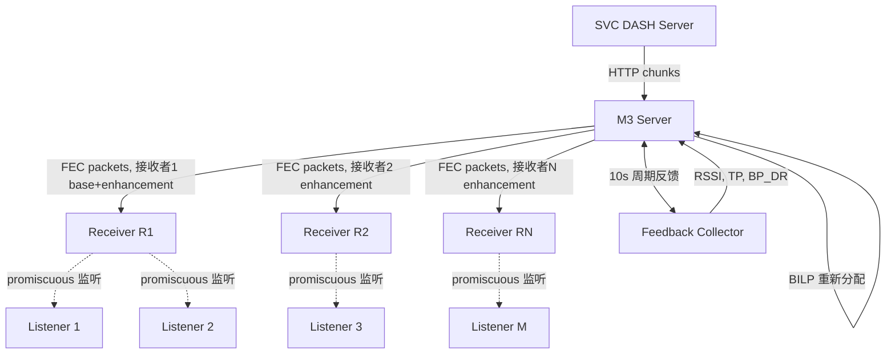
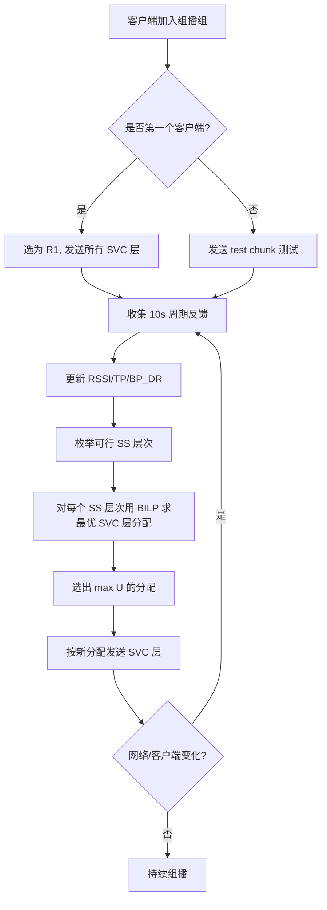

# M³: Practical and Reliable Multi-Layer Video Multicast over Multi-Rate Wi-Fi Network（IWQoS 2016）

> 作者：Menghan Li、Dan Pei、Xiaoping Zhang、Beichuan Zhang、Zhi Wang、Hailiang Xu、Zihan Wang  
> 机构：清华大学（TNList/计算机系）、清华大学深圳研究生院、亚利桑那大学、北京邮电大学  
> 发表年份：2016  
> 会议/期刊：IWQoS 2016（IEEE/ACM International Symposium on Quality of Service）  
> 关联 PDF：同目录下 `iwqos16-li.pdf`

## 一、文档信息速览

| 字段 | 值 |
|---|---|
| 标题 | M³: Practical and Reliable Multi-Layer Video Multicast over Multi-Rate Wi-Fi Network |
| 作者 | Menghan Li, Dan Pei, Xiaoping Zhang, Beichuan Zhang, Zhi Wang, Hailiang Xu, Zihan Wang |
| 机构 | 清华大学 TNList、清华大学计算机系、清华大学深圳研究生院、亚利桑那大学、北京邮电大学 |
| 发表年份 | 2016 |
| 会议/期刊 | IWQoS 2016 |
| 分类 | 无线视频组播 / SVC / 多速率 Wi-Fi / 伪广播 |
| 核心问题 | 802.11 Wi-Fi 公共热点中多用户同时观看同一视频，传统单层组播受最低信道质量限制且可靠性差，无法在不修改 AP 的前提下提供差异化视频质量 |
| 主要贡献 | (1) 第一个基于伪广播（pseudo-broadcast）的不改 AP 的多接收者多层视频组播方案；(2) 联合应用层 FEC+ARQ 提升伪广播可靠性；(3) RSSI-based SS 层次结构 + 二元整数线性规划（BILP）求解最优 SVC 层分配；(4) 真实测试床 1 AP + 8 客户端，总接收视频速率提升最高 200% |

## 二、背景（Background）

在大型公共场所（教室、礼堂、体育馆）大量用户通过同一个 Wi-Fi AP 观看同一场热门视频（如赛事直播、演出）。DASH 等端到端自适应流媒体方案可缓解单用户场景，但多人共用 AP 时中等数量用户就会导致严重信道拥塞；与此同时，传统 802.11 无线组播（legacy Wi-Fi multicast）由于速率低、可靠性差并不适合高清视频传输。

为了让所有用户能"至少"看到视频，传统方案不得不把整个码流都降到由最差信道客户端所支持的最低速率，结果所有用户都"陪绑"到最差质量。H.264/SVC（Scalable Video Coding）将视频分为 1 个强制基础层 + 多个可选增强层，每层提供不同帧率/分辨率/质量，是解决"差异化"的天然工具。但已有 SVC + Wi-Fi 方案都需要修改 802.11 MAC 协议，难以在已部署的网络中落地。

另一种思路是"伪广播"（pseudo-broadcast）：AP 选一个客户端作为单播接收者，其他客户端在 promiscuous 模式下监听。这种方式受益于单播的速率自适应、MAC ACK 与重传，但传输速率仍受"最差信道客户端"限制。M³ 把伪广播与 SVC 结合，并在不修改 AP 的前提下同时选择多个不同信道质量的客户端作为接收者，每个接收者自动得到 802.11 速率自适应机制匹配的不同 PHY 速率，再分别承载不同 SVC 层。

## 三、目的（Problems Solved）

- **差异化 QoS 缺失**：在不修改 AP 的前提下为不同信道质量用户提供差异化 SVC 视频层。
- **最差信道瓶颈**：用多接收者（multi-receiver）伪广播打破"最差信道决定整体质量"的限制。
- **伪广播可靠性低**：在 SVC 基础层上联合应用层 FEC（RaptorQ）+ 块级 ARQ 修复丢包。
- **SVC 层分配最优解**：将"哪一层分给哪个接收者"形式化为二元整数线性规划（BILP），配合 RSSI-based SS 层次结构。
- **动态网络环境适应**：周期性客户端反馈（10s 一次）及时调整接收者与 SVC 层分配。

## 四、核心原理（Principles）

**系统总览**：M³ 包含一个 M³ Server、多个 M³ 客户端、1 个 SVC DASH Server。SVC DASH Server 提供 SVC DASH chunk；M³ Server 既是 SVC DASH 客户端又充当实时视频组播中继；M³ 客户端既可能充当"接收者"（与 M³ Server 建 TCP），也可能充当"监听者"（在 promiscuous 模式监听信道）。

**关键概念**：

- **Pseudo-broadcast（伪广播）**：AP 选一个客户端作为单播接收者，其余客户端以 promiscuous 模式监听的机制。
- **SVC (H.264/SVC)**：可分级视频编码；包含 1 个强制 base layer + 多个增强层。
- **Receiver's Service Set (SS)**：能高概率接收到某接收者数据的监听者集合。
- **BP_DR (Block Packet Delivery Ratio)**：在 120 包块大小下计算的最小包投递率，反映 SS 内监听者稳定性。
- **RSSI-based SS hierarchy**：依据 RSSI 把客户端组织成多层次 SS 树。
- **BILP (Binary Integer Linear Programming)**：求解 SVC 层与接收者之间的最优分配。
- **FEC (RaptorQ)**：应用层前向纠错码。
- **ARQ (block-NACK)**：块级自动重传请求。
- **GP (Goodput)**：考虑 FEC 开销后的有效吞吐。
- **EAP / CoTS AP**：商品级接入点；M³ 不修改 AP。

**数学原理**：

- **TP / GP 关系**（论文公式）：

$$
GP_h = \frac{TP_h}{1 + O_h}, \quad O_h = \frac{1 - \overline{BP\_DR}_h}{\overline{BP\_DR}_h}
$$

其中 $O_h$ 是覆盖 SS_h 所需 FEC 开销比。

- **信道占用率**：

$$
\rho_{h,l} = \frac{VR_l}{GP_h}
$$

- **目标函数**：最大化所有客户端接收到的视频总速率 $U$：

$$
U = \sum_{h=1}^{H} |SS_h| \cdot \sum_{l=1}^{L} \lambda_{h,l} \cdot VR_l
$$

- **BILP 约束**：

$$
\sum_{h=1}^{H}\sum_{l=1}^{L} \lambda_{h,l} \rho_{h,l} \le 1 \quad (5)
$$

$$
\sum_{k=1}^{h} \lambda_{k,l} - \sum_{k=1}^{h} \lambda_{k,l-1} \le 0, \; \forall h, 2 \le l \le L \quad (6)
$$

$$
\sum_{h=1}^{H} \lambda_{h,l} \le 1, \; \forall l \quad (7)
$$

$$
\sum_{l=1}^{L} \lambda_{1,l} \ge 1 \quad (8)
$$

**与现有技术的差异**：与 DirCast 等基于伪广播的方案相比，M³ 通过选择多个不同信道质量的接收者提供多层 SVC 视频流；与 MCS 自适应方案不同，M³ 不需要修改 802.11 MAC 驱动，仅复用 802.11 单播的速率自适应机制；与 SVC + DASH 方案相比，M³ 在真实测试床 1 AP + 8 客户端上验证整体视频速率可提升最高 200%。

## 五、算法详解（Algorithm）

1. **输入 / 输出**：
   - 输入：SVC DASH 视频流、多客户端 RSSI/TP 测量、SS 拓扑约束。
   - 输出：每个 chunk 的 SVC 层-接收者分配矩阵、每个监听者的有效 GP。

2. **核心模块**：
   - **多接收者伪广播**：根据 RSSI-based SS 层次选择一个最差信道客户端 R1 和若干较好信道客户端 R2...RH。
   - **联合 FEC+ARQ**：M³ Server 发送每个 SVC 层时附带 RaptorQ FEC 冗余包，并在基础层触发基于 NACK 的块级重传。
   - **BILP 求解 SVC 层分配**：用 GLPK（GNU Linear Programming Kit）求解分配矩阵 Λ。
   - **周期反馈（10s）**：每个客户端每 10 秒返回 RSSI 平均值、平均 TP 和每块 BP_DR。

3. **伪代码**：

```python
def build_ss_hierarchy(clients, k_thr=0.7):
    """按 RSSI 排序，把客户端分入多个层级；
       每层 SS 内的最低 BP_DR 限制在 70%"""
    sorted_c = sorted(clients, key=lambda c: c.rssi, reverse=True)
    levels = []
    for R in sorted_c:
        SS = [c for c in sorted_c if c.rssi >= R.rssi]
        min_bp = min(pdr_in_block(c, R) for c in SS if c is not R)
        bp_thr = max(min_bp, k_thr)
        O = (1 - bp_thr) / bp_thr
        levels.append((R, SS, bp_thr, O))
    return feasible_hierarchies(levels)

def bilp_allocate(layers, hierarchy, max_levels=H):
    """对每种可行 SS 层次，用 BILP 求解最佳 SVC 层分配"""
    best = None
    for H in hierarchy[:max_levels]:
        for h, (R, SS, bp_thr, O) in enumerate(H, start=1):
            GP[h] = R.TP / (1 + O)
        problem = define_bilp(layers, GP)  # constraints (5)-(8)
        U, Lambda = glpk_solve(problem)
        if best is None or U > best.U:
            best = (U, Lambda, H)
    return best

def adapt_on_feedback(server, client, feedback):
    if client.is_new and client.rssi < server.min_rssi:
        send_test_chunk(client)
    else:
        wait_for_regular_feedback(client)
    if all_feedbacks_received(server):
        re_allocate(server, server.latest_hierarchy)
```

4. **关键数学**：见 §四。

5. **复杂度分析**：
   - SS 层次结构采用深度优先搜索（DFS）枚举，时间复杂度 $O(N \cdot L)$；
   - BILP 由 GLPK 求解，规模为 $H \times L$，毫秒级；
   - 反馈轮询 10s 一次，开销可控。

6. **训练与推理**：无机器学习；纯测量驱动 + 优化求解。

7. **示例**：8 客户端 1 AP 真实测试床中，TP 范围 6136 KBps（-50dBm）到 633 KBps（-85dBm）；布局 2（无背景流量）下 M³ 总视频速率 > 10 MBps，编码开销 40% 后仍较单层方案提升 200%。

## 六、系统架构图（Architecture）



## 七、流程图（Process Flow）



## 八、关键创新点（Key Innovations）

- **+ 多接收者伪广播**：首次在不修改 AP 前提下，把伪广播扩展到多接收者以承载多层 SVC 视频。
- **+ RSSI-based SS 层次**：自动从 RSSI 推导出稳定的 Service Set，并给出 70% 最低 BP_DR 阈值。
- **+ BILP 形式化分配**：把"哪一层分给哪个接收者"建模为二元整数线性规划，保证基础层必达、单调层依赖、每层最多发送一次。
- **+ 联合 FEC+ARQ**：在 SVC 基础层用 RaptorQ FEC 修复大部分丢包，再用 block-NACK 处理尾部。
- **+ 真实 1 AP + 8 客户端测试床**：5 层 SVC，2 秒/块，符号大小 1440 字节；M³ 较单层视频组播总接收视频速率提升最高 200%。

## 九、实验与结果（Experiments）

- **测试床**：1 个商用 TP-LINK AP（802.11a/n，5GHz 信道 40，20MHz），1 个 Ubuntu PC 作为 M³ Server（也作 SVC DASH Server），8 个 Raspberry Pi 作为 M³ 客户端。
- **数据集**：5 层合成 SVC DASH 恒定码率数据集，每层大小 (120, 300, 500, 350, 800) 包/2秒 chunk，对应码率 (84, 211, 352, 246, 563) KBps；参考 Kreuzberger 等人 5 层 SVC 分配方案；对照 5 份 AVC DASH 数据集，每层 (120, 382, 767, 977, 1479) 包/2秒 chunk。
- **Baseline**：基于伪广播的单层视频组播（增强版 DirCast 同样使用 FEC+ARQ）。
- **主要指标**：Total Video Rate、Buffering Time、Skipped Chunks、SVC-layer Allocation。
- **关键结果数字**：
  - M³ 相对单层视频组播最高提升 **200%** 总接收视频速率（Layout 2 无背景流量）；
  - 测试了 4 种客户端到达顺序（Case 1-4）与 4 种客户端布局（Layout 1-4），无论到达顺序如何，4 种 case 最终 SVC-layer 分配模式相同；
  - 不同 case 下 skipped chunk = 0；任意时刻至多 1 个客户端处于 buffer；
  - TP 测量（RSSI 从 -50 到 -85dBm）：平均 TP 从 6136 KBps 降至 633 KBps，最大标准差 ≤ 15%；
  - 1 AP + 8 客户端，全部在 90° 象限内放置以避免隐藏终端。
- **消融实验**：分别关掉"测试 chunk"、"周期反馈"、"BILP 重新分配"验证每一部分对稳定性的贡献。
- **效率分析**：单层方案总接收视频速率受最差客户端 C8 限制；M³ 在多客户端混合信道下保持接近 10 MBps。
- **可视化**：4 种 case × 4 种子图 = 16 个时序图（Skipped Chunks、Buffering Time、SVC-layer Allocation、Total Video Rate）。

## 十、应用场景（Use Cases）

- **大型公共场所直播**：体育馆、礼堂、机场候机厅、教室等高密度 Wi-Fi 热点下的赛事/演出/讲座视频直播。
- **校园/企业内网视频分发**：在同一栋建筑内同时向多个用户推送同一会议、教学视频。
- **多终端家庭场景**：客厅内多设备（手机、平板、电视）共享同一 AP 观看同一直播。
- **临时活动现场**：部署临时 CoTS AP，数百用户短时间访问同一视频。
- **会议系统**：Polycom SVC 会议系统与商用 Wi-Fi 结合的组播加速。

## 十一、相关论文（Related Papers in this set）

- `lanman16-sui`：清华校园 AP 密度对 Wi-Fi 性能的影响（同一作者群）。
- `iwqos16-sui`：清华 Wi-Fi 轨迹隐私分析（同一作者群）。
- `mobisys16-sui`：WiFiSeer 大规模企业 Wi-Fi 延迟测量（同一作者群）。
- `IWQOS_2017_zsl`：交换机 syslog 处理与故障诊断（同一作者群）。
- `ubicomp16-EDUM`：基于 Wi-Fi 的课堂教育测量（同一作者群）。
- `liu_cnsm14_cloudwatchplus`：云租户级应用感知延迟监控。

## 十二、术语表（Glossary）

- **Pseudo-broadcast**：伪广播；AP 把组播改造为对一个客户端的单播，其余客户端 promiscuous 监听。
- **SVC**：可分级视频编码（H.264/SVC）。
- **Receiver / Listener**：伪广播中的单播接收者 / 监听者。
- **SS (Service Set)**：一个接收者能覆盖的监听者集合。
- **BP_DR (Block Packet Delivery Ratio)**：以块为单位的包投递率。
- **BILP**：二元整数线性规划。
- **GLPK**：GNU 线性规划工具包。
- **RaptorQ**：喷泉码族 FEC。
- **block-NACK**：块级否定确认。
- **GP (Goodput)**：应用层有效吞吐。
- **TP (Throughput)**：TCP 吞吐。
- **RSSI**：接收信号强度指示。
- **PHY rate**：802.11 物理层速率。
- **DCF**：分布式协调功能。
- **ACK / Retry**：MAC 层确认/重传。
- **CoTS AP**：商用现成接入点。
- **H.264/AVC**：高级视频编码（不可分级）。
- **DASH**：基于 HTTP 的动态自适应流。

## 十三、参考与延伸阅读

- Paper: H.264/SVC（Schwarz, Marpe, Wiegand, IEEE TCSVT 2007）——SVC 编码基础。
- Paper: Pseudo-broadcast / XORs in the air（Katti 等, ToN 2008）——伪广播思想来源。
- Paper: DirCast（Chandra 等, ICNP 2009）——单层伪广播组播。
- Paper: RaptorQ（RFC 6330）——FEC 实现。
- Paper: H.264/SVC 数据集（Kreuzberger, Posch, Hellwagner, MMSys 2015）。
- Paper: NOVA（Joseph, de Veciana, INFOCOM 2014）——QoE-driven DASH。
- Paper: Control-theoretic DASH（Yin, Jindal, Sekar, Sinopoli, SIGCOMM 2015）。
- 相关论文：`lanman16-sui`、`iwqos16-sui`、`mobisys16-sui`、`ubicomp16-EDUM`。
